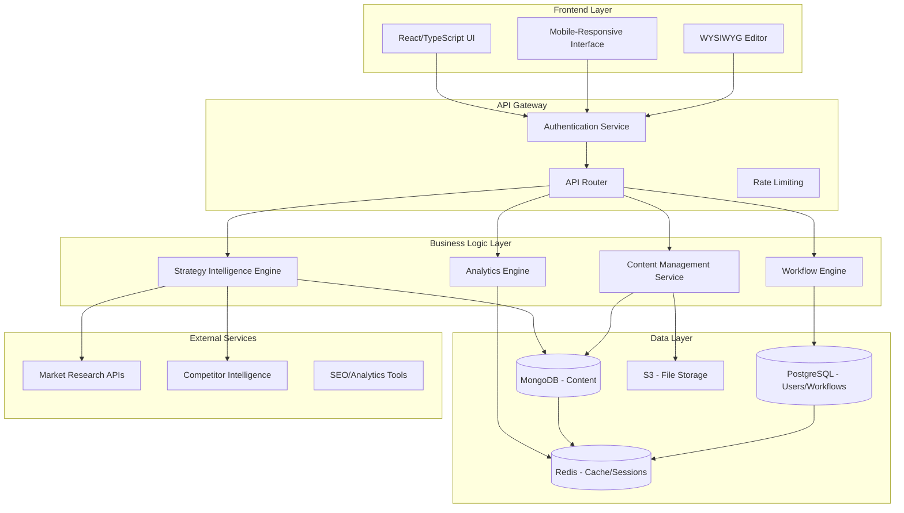

# Design Document: Business Strategy Expansion & CMS System

## Overview

The Business Strategy Expansion & CMS System is a comprehensive platform that addresses two critical needs: expanding Pixelated Empathy's business strategy to capture niche opportunities and competitive advantages, while providing a collaborative content management system for the marketing and business development team.

The system consists of two main components:
1. **Business Strategy Intelligence Engine** - Automated research, analysis, and strategy generation for niche markets, competitive intelligence, and grassroots marketing
2. **Collaborative CMS Platform** - Role-based content management system with workflow automation, version control, and team collaboration features

## Architecture

### High-Level System Architecture



### Component Architecture

#### Strategy Intelligence Engine
- **Market Research Module**: Automated niche market identification and analysis
- **Competitive Intelligence Module**: Competitor analysis and gap identification
- **Grassroots Strategy Generator**: Community-driven marketing strategy creation
- **Partnership Discovery Engine**: Automated partnership opportunity identification

#### Content Management System
- **Document Management**: Version-controlled document storage and editing
- **User Management**: Role-based access control and authentication
- **Workflow Engine**: Approval processes and content lifecycle management
- **Collaboration Tools**: Real-time editing, commenting, and team coordination

## Components and Interfaces

### Strategy Intelligence Engine

#### Market Research Module
```typescript
interface MarketResearchModule {
  identifyNicheMarkets(): Promise<NicheMarket[]>
  analyzeMarketOpportunity(market: MarketSegment): Promise<MarketAnalysis>
  generateGoToMarketStrategy(market: NicheMarket): Promise<GTMStrategy>
  prioritizeMarkets(markets: NicheMarket[]): Promise<PrioritizedMarket[]>
}

interface NicheMarket {
  id: string
  name: string
  marketSize: MarketSize
  accessibility: AccessibilityScore
  competitiveLandscape: CompetitorAnalysis[]
  barriers: BarrierToEntry[]
  advantages: CompetitiveAdvantage[]
  gotoMarketStrategy: GTMStrategy
}
```

#### Competitive Intelligence Module
```typescript
interface CompetitiveIntelligence {
  analyzeCompetitors(): Promise<CompetitorProfile[]>
  identifyFeatureGaps(): Promise<FeatureGap[]>
  generateCompetitiveResponse(scenario: CompetitiveScenario): Promise<ResponseStrategy>
  trackCompetitorChanges(): Promise<CompetitorUpdate[]>
}

interface CompetitorProfile {
  id: string
  name: string
  marketPosition: MarketPosition
  strengths: string[]
  weaknesses: string[]
  features: Feature[]
  pricing: PricingModel
  marketShare: number
  gapsVsUs: FeatureGap[]
}
```

#### Grassroots Marketing Engine
```typescript
interface GrassrootsMarketing {
  generateMarketingTactics(): Promise<MarketingTactic[]>
  createCommunityStrategy(platform: Platform): Promise<CommunityStrategy>
  buildContentCalendar(channels: Channel[]): Promise<ContentCalendar>
  identifyPartnershipOpportunities(): Promise<Partnership[]>
}

interface MarketingTactic {
  id: string
  name: string
  description: string
  effortLevel: EffortLevel
  expectedImpact: ImpactScore
  resources: Resource[]
  timeline: Timeline
  successMetrics: Metric[]
  templates: Template[]
}
```

### Content Management System

#### Document Management Service
```typescript
interface DocumentManagement {
  createDocument(doc: DocumentInput): Promise<Document>
  updateDocument(id: string, changes: DocumentUpdate): Promise<Document>
  getDocument(id: string): Promise<Document>
  deleteDocument(id: string): Promise<void>
  getVersionHistory(id: string): Promise<DocumentVersion[]>
  revertToVersion(id: string, versionId: string): Promise<Document>
}

interface Document {
  id: string
  title: string
  content: string
  type: DocumentType
  category: Category
  tags: string[]
  author: User
  lastModified: Date
  version: number
  status: DocumentStatus
  approvals: Approval[]
}
```

#### User Management Service
```typescript
interface UserManagement {
  createUser(user: UserInput): Promise<User>
  updateUser(id: string, updates: UserUpdate): Promise<User>
  deleteUser(id: string): Promise<void>
  assignRole(userId: string, role: Role): Promise<void>
  authenticateUser(credentials: Credentials): Promise<AuthResult>
  manageSession(token: string): Promise<Session>
}

interface User {
  id: string
  email: string
  name: string
  role: Role
  permissions: Permission[]
  lastLogin: Date
  isActive: boolean
}

enum Role {
  ADMINISTRATOR = 'administrator',
  CONTENT_CREATOR = 'content_creator',
  EDITOR = 'editor',
  VIEWER = 'viewer'
}
```

#### Workflow Engine
```typescript
interface WorkflowEngine {
  createWorkflow(workflow: WorkflowDefinition): Promise<Workflow>
  executeWorkflow(documentId: string, workflowId: string): Promise<WorkflowExecution>
  approveStep(executionId: string, stepId: string, approval: ApprovalDecision): Promise<void>
  getWorkflowStatus(executionId: string): Promise<WorkflowStatus>
}

interface WorkflowDefinition {
  id: string
  name: string
  steps: WorkflowStep[]
  triggers: WorkflowTrigger[]
}

interface WorkflowStep {
  id: string
  name: string
  type: StepType
  approvers: User[]
  conditions: Condition[]
  actions: Action[]
}
```

## Data Models

### Business Strategy Data Models

#### Market Analysis Model
```typescript
interface MarketAnalysis {
  marketId: string
  marketName: string
  marketSize: {
    totalAddressableMarket: number
    serviceableAddressableMarket: number
    serviceableObtainableMarket: number
    currency: string
  }
  accessibility: {
    score: number // 0-100
    factors: AccessibilityFactor[]
  }
  competitiveLandscape: {
    directCompetitors: Competitor[]
    indirectCompetitors: Competitor[]
    competitiveIntensity: number // 0-100
  }
  barriers: BarrierToEntry[]
  opportunities: MarketOpportunity[]
  threats: MarketThreat[]
  recommendedStrategy: StrategyRecommendation
}
```

#### Competitive Analysis Model
```typescript
interface CompetitorAnalysis {
  competitorId: string
  name: string
  website: string
  marketPosition: 'leader' | 'challenger' | 'follower' | 'niche'
  marketShare: number
  strengths: CompetitiveStrength[]
  weaknesses: CompetitiveWeakness[]
  features: {
    featureId: string
    name: string
    description: string
    hasFeature: boolean
    quality: number // 0-100
  }[]
  pricing: {
    model: 'subscription' | 'one-time' | 'usage-based' | 'freemium'
    tiers: PricingTier[]
  }
  customerSegments: CustomerSegment[]
  gapsVsUs: {
    gapId: string
    description: string
    category: 'critical' | 'important' | 'nice-to-have'
    recommendation: 'adopt-and-improve' | 'ignore' | 'differentiate-differently'
    effort: number // 1-10
    cost: number
    expectedImpact: number // 1-10
  }[]
}
```

#### Grassroots Marketing Model
```typescript
interface GrassrootsStrategy {
  strategyId: string
  name: string
  description: string
  tactics: MarketingTactic[]
  communityStrategies: CommunityStrategy[]
  contentStrategies: ContentStrategy[]
  partnershipOpportunities: Partnership[]
  advocacyPrograms: AdvocacyProgram[]
  successMetrics: SuccessMetric[]
  budget: {
    totalBudget: number
    allocation: BudgetAllocation[]
  }
  timeline: {
    phases: Phase[]
    milestones: Milestone[]
  }
}
```

### CMS Data Models

#### Document Model
```typescript
interface Document {
  id: string
  title: string
  slug: string
  content: string
  contentType: 'markdown' | 'html' | 'rich-text'
  type: DocumentType
  category: {
    id: string
    name: string
    parent?: string
  }
  tags: string[]
  metadata: {
    author: User
    createdAt: Date
    lastModified: Date
    lastModifiedBy: User
    version: number
    status: 'draft' | 'review' | 'approved' | 'published' | 'archived'
  }
  permissions: {
    read: string[] // user IDs or role names
    write: string[]
    approve: string[]
  }
  workflow: {
    currentStep?: string
    executionId?: string
    approvals: Approval[]
  }
  analytics: {
    views: number
    lastViewed: Date
    collaborators: string[]
    editCount: number
  }
}
```

#### User and Permission Model
```typescript
interface User {
  id: string
  email: string
  name: string
  avatar?: string
  role: Role
  permissions: Permission[]
  preferences: UserPreferences
  metadata: {
    createdAt: Date
    lastLogin: Date
    isActive: boolean
    invitedBy?: string
  }
}

interface Permission {
  resource: string // document, user, workflow, etc.
  action: 'create' | 'read' | 'update' | 'delete' | 'approve'
  conditions?: PermissionCondition[]
}

interface UserPreferences {
  theme: 'light' | 'dark' | 'auto'
  notifications: NotificationSettings
  editor: EditorSettings
  dashboard: DashboardSettings
}
```

#### Workflow Model
```typescript
interface WorkflowExecution {
  id: string
  workflowId: string
  documentId: string
  status: 'pending' | 'in-progress' | 'completed' | 'rejected' | 'cancelled'
  currentStep: string
  steps: {
    stepId: string
    status: 'pending' | 'in-progress' | 'approved' | 'rejected' | 'skipped'
    assignedTo: string[]
    completedBy?: string
    completedAt?: Date
    feedback?: string
    attachments?: string[]
  }[]
  metadata: {
    startedAt: Date
    completedAt?: Date
    startedBy: string
  }
}
```

## Correctness Properties

*A property is a characteristic or behavior that should hold true across all valid executions of a system—essentially, a formal statement about what the system should do. Properties serve as the bridge between human-readable specifications and machine-verifiable correctness guarantees.*

### Property 1: Market Analysis Completeness
*For any* niche market identified by the system, the market analysis should include all required components: market size, accessibility score, competitive landscape, barriers to entry, and competitive advantages.
**Validates: Requirements 1.2, 1.5**

### Property 2: Competitive Analysis Coverage
*For any* competitor documented in the system, the analysis should include strengths, weaknesses, market positioning, feature comparison, and identified gaps relative to our platform.
**Validates: Requirements 4.1, 4.2**

### Property 3: Content Completeness for Strategies
*For any* strategy document (demographic, rural, grassroots), the system should ensure all required sections are present and populated according to the strategy type requirements.
**Validates: Requirements 2.1, 2.2, 3.2, 7.2**

### Property 4: User Permission Consistency
*For any* user role in the system, the permissions should be consistent with the role definition and should not allow unauthorized access to restricted operations.
**Validates: Requirements 12.1, 12.2**

### Property 5: Document Version Integrity
*For any* document in the system, the version history should be complete, chronologically ordered, and allow successful reversion to any previous version.
**Validates: Requirements 14.1, 14.3**

### Property 6: Workflow State Consistency
*For any* workflow execution, the system should maintain consistent state transitions and prevent invalid state changes or approval bypasses.
**Validates: Requirements 16.1, 16.4**

### Property 7: Export Format Preservation
*For any* document exported from the system, the exported content should preserve all formatting, structure, and embedded media regardless of the export format.
**Validates: Requirements 17.1, 17.2**

### Property 8: Search Result Accuracy
*For any* search query in the system, the results should be relevant to the query terms and should include all matching content that the user has permission to access.
**Validates: Requirements 15.2**

### Property 9: Analytics Data Consistency
*For any* analytics report generated by the system, the data should be accurate, up-to-date, and consistent across different views and export formats.
**Validates: Requirements 18.1, 18.2, 18.5**

### Property 10: Mobile Functionality Parity
*For any* feature available on desktop, the mobile interface should provide equivalent functionality with appropriate UI adaptations for mobile devices.
**Validates: Requirements 19.1, 19.2**

### Property 11: Security Compliance
*For any* data handled by the system, encryption standards should be enforced (TLS 1.3 in transit, AES-256 at rest) and all access should be properly logged for audit purposes.
**Validates: Requirements 20.1, 20.3**

### Property 12: Template and Resource Completeness
*For any* marketing tactic or strategy documented in the system, all required templates, scripts, and implementation resources should be provided and accessible.
**Validates: Requirements 7.4, 9.3, 10.3**

### Property 13: Categorization Consistency
*For any* competitive gap or feature analysis, items should be properly categorized using the specified classification system and include all required metadata.
**Validates: Requirements 4.3, 5.2**

### Property 14: Content Organization Hierarchy
*For any* content in the system, the hierarchical organization should be consistent, navigable, and support both browsing and search-based discovery.
**Validates: Requirements 15.1, 15.5**

### Property 15: Collaboration State Synchronization
*For any* document being edited by multiple users simultaneously, changes should be synchronized in real-time and conflicts should be resolved without data loss.
**Validates: Requirements 13.4**

## Error Handling

### Business Strategy Engine Error Handling

#### Market Research Errors
- **Data Source Unavailable**: Graceful degradation with cached data and user notification
- **Invalid Market Parameters**: Input validation with specific error messages
- **Analysis Timeout**: Partial results with retry mechanism
- **Competitive Data Inconsistency**: Data validation with manual review flags

#### Content Generation Errors
- **Template Processing Failure**: Fallback to basic templates with error logging
- **Resource Generation Timeout**: Partial generation with completion queue
- **Validation Failure**: Detailed validation reports with correction suggestions

### CMS System Error Handling

#### Document Management Errors
- **Version Conflict**: Automatic merge with conflict resolution interface
- **Storage Failure**: Redundant storage with automatic failover
- **Permission Denied**: Clear error messages with access request workflow
- **Content Corruption**: Automatic backup restoration with integrity verification

#### User Management Errors
- **Authentication Failure**: Secure error messages without information disclosure
- **Session Timeout**: Graceful session extension with data preservation
- **Permission Changes**: Immediate effect with user notification
- **Account Lockout**: Administrative notification with unlock procedures

#### Workflow Errors
- **Approval Timeout**: Automatic escalation with notification
- **Invalid State Transition**: State correction with audit logging
- **Approver Unavailable**: Delegation mechanism with approval tracking
- **Workflow Corruption**: Automatic recovery with manual review option

### System-Wide Error Handling

#### Data Consistency Errors
- **Database Synchronization**: Automatic reconciliation with conflict resolution
- **Cache Invalidation**: Intelligent cache refresh with performance monitoring
- **Backup Failure**: Multiple backup strategies with failure alerting

#### Integration Errors
- **External API Failure**: Circuit breaker pattern with graceful degradation
- **Export/Import Errors**: Partial processing with error reporting and retry
- **Authentication Service Failure**: Local authentication fallback with sync recovery

## Testing Strategy

### Dual Testing Approach

The system requires both unit testing and property-based testing to ensure comprehensive coverage:

- **Unit tests**: Verify specific examples, edge cases, and error conditions
- **Property tests**: Verify universal properties across all inputs
- **Integration tests**: Verify component interactions and workflows
- **End-to-end tests**: Verify complete user journeys and business processes

### Property-Based Testing Configuration

**Testing Framework**: We will use **fast-check** for JavaScript/TypeScript property-based testing, configured to run a minimum of 100 iterations per property test.

**Property Test Implementation**: Each correctness property will be implemented as a single property-based test with the following tag format:
- **Feature: business-strategy-expansion, Property 1: Market Analysis Completeness**
- **Feature: business-strategy-expansion, Property 2: Competitive Analysis Coverage**
- etc.

### Unit Testing Strategy

**Business Strategy Engine Tests**:
- Market research algorithm accuracy with known datasets
- Competitive analysis parsing with sample competitor data
- Strategy generation with various input parameters
- Error handling with invalid or missing data

**CMS System Tests**:
- User authentication and authorization flows
- Document CRUD operations with various content types
- Workflow execution with different approval scenarios
- Version control operations with concurrent modifications

**Integration Tests**:
- End-to-end document creation and approval workflows
- User role changes and permission updates
- Export/import operations with various formats
- Real-time collaboration with multiple users

### Performance Testing

**Load Testing**:
- Concurrent user editing and collaboration
- Large document processing and export
- Bulk data import and analysis operations
- Search performance with large content volumes

**Security Testing**:
- Authentication and authorization bypass attempts
- Input validation and injection attack prevention
- Data encryption verification
- Audit logging completeness and integrity

---

*Last Updated: December 2025*
*Version: 1.0*