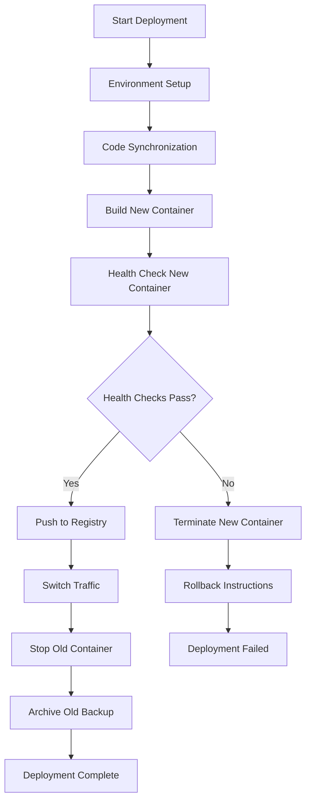

# Design Document

## Overview

This design document outlines the architecture for an improved rsync deployment script that implements a safe, pipeline-style deployment process with comprehensive health checks, backup management, and rollback capabilities. The solution transforms the current single-step deployment into a multi-stage pipeline with validation gates and automated recovery mechanisms.

## Architecture

### High-Level Flow



### Deployment Stages

1. **Pre-deployment Phase**
   - Environment validation and setup
   - Node.js 24.7.0 and pnpm 10.15.0 installation
   - SSH connectivity verification

2. **Synchronization Phase**
   - Rsync with .git directory inclusion
   - Backup preservation strategy
   - File integrity verification

3. **Build Phase**
   - Container image building with proper tagging
   - Build artifact validation
   - Resource optimization

4. **Validation Phase**
   - Comprehensive health checks
   - Performance validation
   - Security verification

5. **Deployment Phase**
   - Traffic switching with zero downtime
   - Container lifecycle management
   - Registry integration

6. **Post-deployment Phase**
   - Cleanup and archiving
   - Monitoring setup
   - Documentation generation

## Components and Interfaces

### Core Components

#### 1. Environment Manager
**Purpose:** Manages Node.js and pnpm installation and verification

**Interface:**
```bash
setup_nodejs_environment() {
    # Install Node.js 24.7.0 via nvm
    # Install pnpm 10.15.0
    # Verify versions
    # Return success/failure status
}

verify_environment() {
    # Check Node.js version
    # Check pnpm version
    # Validate PATH configuration
    # Return verification results
}
```

#### 2. Backup Manager
**Purpose:** Handles intelligent backup creation, retention, and restoration

**Interface:**
```bash
preserve_current_backup() {
    # Keep existing backup until new deployment verified
    # Create timestamped archive names
    # Maintain backup metadata
}

archive_backup() {
    # Move current backup to timestamped archive
    # Maintain up to 3 previous backups
    # Clean up oldest backups when space limited
}

generate_rollback_commands() {
    # Create specific rollback instructions
    # Include both container and filesystem restoration
    # Provide registry-based rollback options
}
```

#### 3. Container Manager
**Purpose:** Manages Docker container lifecycle with health validation

**Interface:**
```bash
build_container() {
    # Build new container with timestamp tag
    # Validate build artifacts
    # Tag with commit hash and timestamp
}

health_check_container() {
    # Wait for application readiness (60s timeout)
    # Test root endpoint for 200 status
    # Validate critical API endpoints
    # Verify static asset serving
    # Return detailed health report
}

switch_traffic() {
    # Start new container on different port
    # Validate new container health
    # Update proxy configuration
    # Stop old container
}
```

#### 4. Registry Manager
**Purpose:** Handles GitLab container registry integration

**Interface:**
```bash
push_to_registry() {
    # Tag image with timestamp and commit hash
    # Push to git.pixelatedempathy.tech registry
    # Verify successful upload
    # Log registry operations
}

pull_from_registry() {
    # List available images
    # Pull specific tagged version
    # Validate image integrity
}
```

#### 5. Secure Environment Variable Manager
**Purpose:** Handles secure transfer and deployment of environment variables

**Interface:**
```bash
encrypt_environment_file() {
    # Encrypt local .env file using GPG/OpenSSL
    # Generate secure transfer package
    # Validate encryption integrity
    # Return encrypted file path
}

deploy_environment_variables() {
    # Transfer encrypted environment file to VPS
    # Decrypt environment file securely on VPS
    # Load environment variables for deployment processes
    # Validate environment variable integrity
}

cleanup_environment_files() {
    # Remove temporary decrypted files
    # Clean up encryption artifacts
    # Secure deletion of sensitive temporary files
}

mask_sensitive_variables() {
    # Identify sensitive environment variables
    # Mask values in deployment logs
    # Provide secure logging for environment operations
}
```

#### 6. Health Check System
**Purpose:** Comprehensive application validation

**Interface:**
```bash
perform_health_checks() {
    # Basic connectivity test
    # API endpoint validation
    # Static asset serving test
    # Performance baseline check
    # Security header validation
    # Return detailed health report
}
```

### Data Models

#### Deployment Context
```bash
DEPLOYMENT_CONTEXT = {
    "timestamp": "2025-01-31T10:30:00Z",
    "commit_hash": "abc123def456",
    "node_version": "24.7.0",
    "pnpm_version": "10.15.0",
    "container_tag": "pixelated-empathy:2025-01-31-abc123",
    "backup_path": "/root/pixelated-backup-2025-01-31-103000",
    "health_check_results": {},
    "registry_push_status": "success|failed",
    "rollback_commands": []
}
```

#### Health Check Results
```bash
HEALTH_CHECK_RESULTS = {
    "basic_connectivity": {
        "status": "pass|fail",
        "response_time": "50ms",
        "details": "HTTP 200 OK"
    },
    "api_endpoints": {
        "/api/health": {"status": "pass", "response_time": "25ms"},
        "/api/bias-detection": {"status": "pass", "response_time": "45ms"}
    },
    "static_assets": {
        "status": "pass|fail",
        "sample_asset": "/assets/main.css",
        "response_time": "15ms"
    },
    "overall_status": "pass|fail",
    "summary": "All checks passed successfully"
}
```

## Error Handling

### Error Categories and Responses

1. **Environment Setup Errors**
   - Node.js installation failures
   - Version mismatch issues
   - Permission problems
   - **Response:** Terminate with clear error message and remediation steps

2. **Synchronization Errors**
   - Network connectivity issues
   - File permission problems
   - Disk space limitations
   - **Response:** Retry with exponential backoff, provide manual sync instructions

3. **Build Errors**
   - Container build failures
   - Dependency resolution issues
   - Resource constraints
   - **Response:** Preserve old container, provide build logs and troubleshooting steps

4. **Health Check Failures**
   - Application startup issues
   - API endpoint failures
   - Performance degradation
   - **Response:** Terminate new container, keep old container running, provide detailed failure analysis

5. **Registry Errors**
   - Authentication failures
   - Network connectivity issues
   - Storage quota exceeded
   - **Response:** Continue with local deployment, log registry issues for later resolution

### Rollback Strategies

#### Immediate Rollback (Health Check Failures)
```bash
# Terminate new container
docker stop pixelated-app-new 2>/dev/null || true
docker rm pixelated-app-new 2>/dev/null || true

# Ensure old container is running
docker start pixelated-app 2>/dev/null || true

# Restore previous backup if needed
sudo rm -rf /root/pixelated
sudo mv /root/pixelated-backup /root/pixelated
```

#### Manual Rollback (Post-deployment Issues)
```bash
# Container-based rollback
docker stop pixelated-app
docker run -d --name pixelated-app-rollback [previous-image-tag]

# Registry-based rollback
docker pull git.pixelatedempathy.tech/pixelated-empathy:[previous-tag]
docker run -d --name pixelated-app-rollback [pulled-image]

# Filesystem rollback
sudo systemctl stop caddy
sudo mv /root/pixelated /root/pixelated-failed
sudo mv /root/pixelated-backup-[timestamp] /root/pixelated
sudo systemctl start caddy
```

## Security Considerations

### Environment Variable Security

#### Encryption Standards
- **Algorithm:** AES-256-CBC or GPG with RSA-4096 keys
- **Key Management:** Passphrase-based encryption for simplicity
- **Transport Security:** Encrypted files only, never plaintext over network

#### Security Workflow
```bash
# Local encryption
encrypt_env_file() {
    openssl enc -aes-256-cbc -salt -in .env -out .env.encrypted -k "$PASSPHRASE"
    # OR
    gpg --symmetric --cipher-algo AES256 --output .env.gpg .env
}

# VPS decryption and usage
deploy_env_securely() {
    # Decrypt to temporary location
    openssl enc -aes-256-cbc -d -in .env.encrypted -out /tmp/.env.tmp -k "$PASSPHRASE"
    
    # Load variables
    source /tmp/.env.tmp
    
    # Immediate cleanup
    shred -vfz -n 3 /tmp/.env.tmp
}
```

#### Security Controls
1. **Temporary File Management:** All decrypted files stored in `/tmp` with restricted permissions (600)
2. **Automatic Cleanup:** Secure deletion using `shred` command with 3-pass overwrite
3. **Log Masking:** Sensitive variables (containing TOKEN, KEY, SECRET, PASSWORD) automatically masked
4. **Rollback Security:** Environment variable state preserved for rollback scenarios
5. **Failure Handling:** Deployment continues with warnings if environment transfer fails

#### Sensitive Variable Detection
```bash
# Patterns for automatic masking
SENSITIVE_PATTERNS=(
    "*TOKEN*" "*KEY*" "*SECRET*" "*PASSWORD*" 
    "*PRIVATE*" "*CREDENTIAL*" "*AUTH*"
)
```

## Testing Strategy

### Unit Testing
- Individual component functions (environment setup, health checks)
- Mock external dependencies (Docker, registry, SSH)
- Validate error handling paths
- Test backup and rollback logic

### Integration Testing
- End-to-end deployment scenarios
- Health check validation with real containers
- Registry push/pull operations
- Rollback procedure validation

### Performance Testing
- Health check response time validation (<50ms requirement)
- Container startup time measurement
- Registry operation performance
- Overall deployment time benchmarking

### Security Testing
- SSH key validation
- Container security scanning
- Registry authentication testing
- Backup file permission verification

### Failure Scenario Testing
- Network interruption during sync
- Container build failures
- Health check timeout scenarios
- Registry unavailability
- Disk space exhaustion
- Node.js/pnpm installation failures

## Implementation Considerations

### Node.js Environment Management
- Use nvm for Node.js 24.7.0 installation
- Ensure proper PATH configuration for all users
- Validate npm registry connectivity
- Handle existing Node.js installations gracefully

### Container Orchestration
- Implement blue-green deployment pattern
- Use different port assignments for new containers
- Implement proper container naming conventions
- Handle container resource constraints

### Health Check Implementation
- Implement progressive health checks (basic → detailed)
- Use configurable timeout values
- Provide detailed failure diagnostics
- Support custom health check endpoints

### Registry Integration
- Support GitLab container registry authentication
- Implement retry logic for network issues
- Handle registry quota limitations
- Provide fallback to local-only deployment

### Logging and Monitoring
- Structured logging with timestamps
- Deployment metrics collection
- Error categorization and reporting
- Performance monitoring integration

### Security Considerations
- Secure SSH key handling
- Container image vulnerability scanning
- Registry authentication security
- Backup file encryption options
- Audit trail maintenance

This design provides a robust foundation for implementing the improved deployment pipeline while maintaining backward compatibility and providing clear upgrade paths for existing deployments.