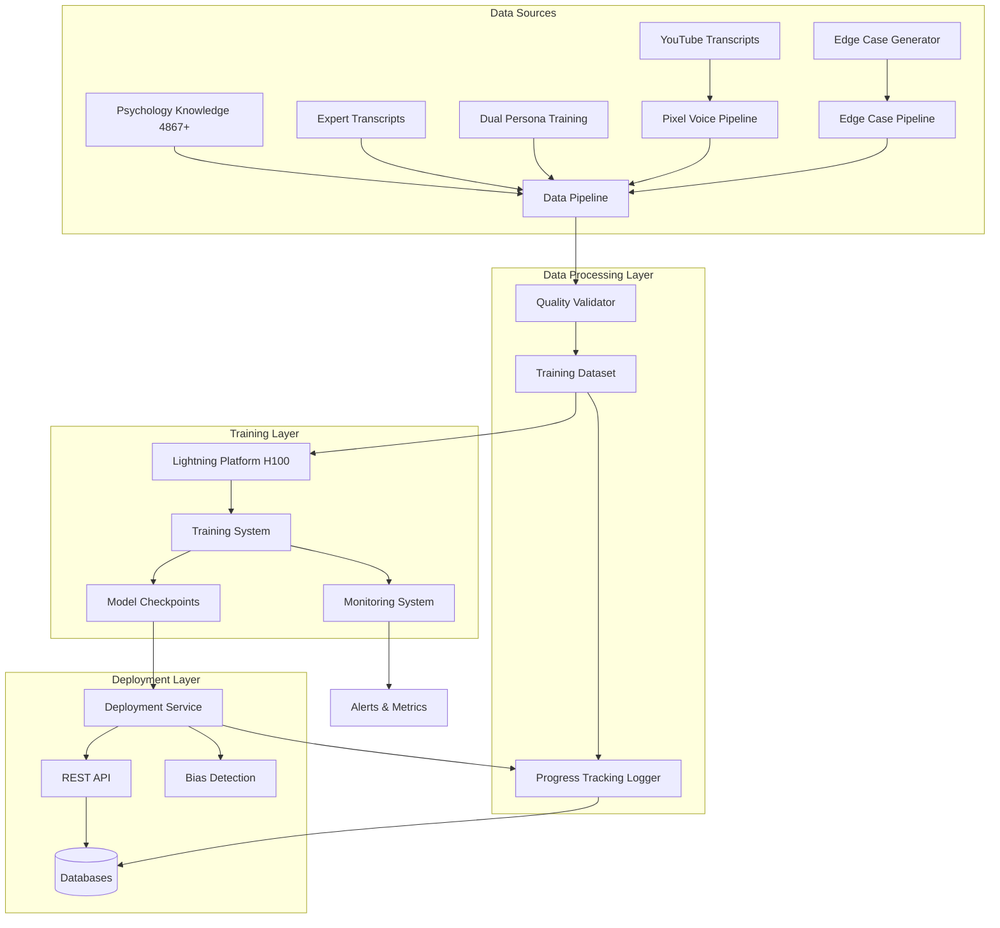

# Foundation Model Training Design

## Overview

This design document outlines the architecture and implementation approach for training a therapeutic AI foundation model using Lightning.ai H100 infrastructure with LoRA fine-tuning. The system processes 8,000+ therapeutic conversations to create a specialized model capable of contextual, empathetic responses while maintaining HIPAA compliance and clinical safety standards.

### Key Design Goals

- Train a Multi-expert Mixture of Experts (MoE) model specialized for therapeutic conversations
- Achieve breakthrough therapeutic AI capabilities within 12-hour training windows
- Maintain 99%+ data processing success rate with semantic validation
- Deploy production-ready model with <2s inference latency and 99.9% uptime
- Ensure HIPAA compliance and clinical safety throughout the pipeline

## Architecture

### High-Level System Architecture



### Component Architecture

The system is organized into four primary layers:

1. **Data Sources Layer**: Multiple specialized pipelines for diverse therapeutic content (YouTube transcripts, psychology knowledge, edge cases, expert transcripts, dual persona training)
2. **Data Processing Layer**: Handles ingestion, validation, and preparation of therapeutic conversation data with quality validation and progress tracking
3. **Training Layer**: Manages model training on Lightning.ai H100 infrastructure with real-time monitoring
4. **Deployment Layer**: Serves trained models via REST API with integrated bias detection, database connectivity, and long-term progress tracking

## Components and Interfaces

### 1. Data Processing Pipeline

**Purpose**: Transform raw therapeutic conversations into high-quality training data

**Key Components**:
- **Dataset Loader**: Reads from multiple sources (`ai/lightning/`, `ai/lightning/pixelated-training/`, `ai/lightning/pixelated-v2/`, `.notes/pixel-training/`)
- **Content Classifier**: Detects content patterns (interview, podcast, monologue, speech)
- **Question Extractor**: Generates 50% extracted + 50% contextual questions
- **Semantic Validator**: Prevents generic/irrelevant Q&A mismatches

**Interface**:
```python
class DataPipeline:
    def process_datasets(self, source_paths: List[Path]) -> ProcessedDataset:
        """Process multiple dataset sources into unified training format"""
        
    def validate_quality(self, dataset: ProcessedDataset) -> QualityReport:
        """Validate semantic coherence and therapeutic appropriateness"""
        
    def export_lora_format(self, dataset: ProcessedDataset, output_path: Path) -> None:
        """Export to Lightning.ai compatible LoRA training format"""
```

**Data Flow**:
1. Load raw conversations from multiple sources
2. Classify content type and extract context
3. Generate question-answer pairs (50/50 split)
4. Validate semantic coherence
5. Export to LoRA training format

### 1.1 Edge Case Generation Pipeline

**Purpose**: Generate challenging therapy scenarios for difficult client simulation training

**Key Components**:
- **Category Manager**: Handles 25 edge case categories (suicidality, psychotic episodes, trauma flashbacks, substance abuse crisis, etc.)
- **Difficulty Classifier**: Assigns difficulty levels (moderate, high, very high) to scenarios
- **Multi-Provider Generator**: Supports OpenAI, Anthropic, and Ollama for content generation
- **Safety Reviewer**: Flags high-risk content for clinical review

**Interface**:
```python
class EdgeCaseGenerator:
    def generate_prompts(self, scenarios_per_category: int = 20) -> List[EdgeCasePrompt]:
        """Generate prompts across 25 challenging therapy categories"""
        
    def generate_conversations(self, prompts: List[EdgeCasePrompt], max_conversations: int) -> List[Conversation]:
        """Generate challenging therapy conversations using AI providers"""
        
    def create_training_format(self, conversations: List[Conversation]) -> List[TrainingExample]:
        """Convert to training format with metadata (purpose, category, difficulty, challenges)"""
```

**Edge Case Categories**:
- **Very High Difficulty**: Suicidality, homicidal ideation, psychotic episodes, child abuse reporting, severe dissociation
- **High Difficulty**: Substance abuse crisis, trauma flashbacks, borderline crisis, domestic violence, eating disorders
- **Moderate Difficulty**: Paranoid accusations, medication refusal, family conflicts, adolescent defiance, couples betrayal

**Output Format**:
```python
{
    "prompt": "Therapist statement",
    "response": "Challenging client response",
    "purpose": "difficult_client",
    "category": "suicidality",
    "difficulty_level": "very_high",
    "expected_challenges": ["crisis_intervention", "safety_assessment"],
    "source": "edge_case_generation"
}
```

### 1.2 Pixel Voice Pipeline

**Purpose**: Process YouTube transcripts and voice data to extract therapeutic dialogue with personality consistency

**Key Components**:
- **Audio Downloader**: Downloads YouTube audio for transcription
- **Transcription Engine**: Batch transcription with quality filtering
- **Personality Extractor**: Identifies personality markers and emotional patterns
- **Dialogue Constructor**: Generates therapeutic dialogue pairs
- **Quality Control**: Validates transcription quality and dialogue naturalness

**Interface**:
```python
class PixelVoicePipeline:
    def download_youtube_audio(self, video_urls: List[str]) -> List[Path]:
        """Download audio from YouTube videos"""
        
    def batch_transcribe(self, audio_files: List[Path]) -> List[Transcript]:
        """Transcribe audio with quality assessment"""
        
    def extract_personality_markers(self, transcripts: List[Transcript]) -> PersonalityProfile:
        """Extract personality and emotional patterns"""
        
    def construct_dialogue_pairs(self, transcripts: List[Transcript], personality: PersonalityProfile) -> List[DialoguePair]:
        """Generate therapeutic dialogue pairs with personality consistency"""
        
    def validate_quality(self, dialogue_pairs: List[DialoguePair]) -> QualityReport:
        """Validate transcription quality and dialogue naturalness"""
```

**Data Sources**:
- YouTube therapeutic content creators
- Expert psychology lectures and presentations
- Clinical conversation recordings
- Professional therapy demonstrations

**Quality Metrics**:
- Transcription accuracy
- Dialogue naturalness score
- Personality consistency validation
- Emotional pattern coherence

### 1.3 Psychology Knowledge Integration

**Purpose**: Integrate comprehensive psychology knowledge base into training data

**Knowledge Sources**:
- **DSM-5 Concepts**: Clinical definitions and diagnostic criteria
- **Therapeutic Techniques**: Evidence-based therapeutic modalities
- **Expert Transcripts**: Tim Fletcher complex trauma series, professional therapy dialogues
- **Clinical Frameworks**: Psychology concepts and mental health knowledge

**Interface**:
```python
class PsychologyKnowledgeIntegrator:
    def load_knowledge_base(self, source_path: Path) -> KnowledgeBase:
        """Load 4,867+ psychology concepts"""
        
    def integrate_expert_transcripts(self, transcripts: List[Transcript]) -> List[TrainingExample]:
        """Process expert psychology transcripts (Tim Fletcher, etc.)"""
        
    def enrich_training_data(self, examples: List[TrainingExample], knowledge: KnowledgeBase) -> List[EnrichedExample]:
        """Enrich training examples with psychology knowledge context"""
```

**Knowledge Base Structure**:
```python
{
    "concept_id": "dsm5_ptsd_criteria",
    "category": "clinical_diagnosis",
    "content": "PTSD diagnostic criteria...",
    "source": "DSM-5",
    "related_concepts": ["trauma", "flashbacks", "hypervigilance"],
    "therapeutic_approaches": ["EMDR", "CPT", "PE"]
}
```

### 1.4 Dual Persona Training Pipeline

**Purpose**: Train model for multi-persona therapeutic interactions

**Key Components**:
- **Persona Manager**: Manages different therapeutic personas (empathetic listener, cognitive restructurer, crisis interventionist)
- **Context Switcher**: Handles transitions between personas based on client needs
- **Consistency Validator**: Ensures persona consistency within conversations

**Interface**:
```python
class DualPersonaTrainer:
    def generate_persona_dialogues(self, personas: List[Persona], scenarios: List[Scenario]) -> List[DialogueSet]:
        """Generate dialogues with multiple therapeutic personas"""
        
    def validate_persona_consistency(self, dialogue: DialogueSet) -> ConsistencyReport:
        """Validate persona consistency and appropriate switching"""
```

### 2. Quality Validation System

**Purpose**: Ensure training data meets therapeutic quality standards

**Validation Checks**:
- Semantic coherence scoring for Q&A pairs
- Therapeutic appropriateness validation
- Bias detection in training data
- Content diversity verification

**Interface**:
```python
class QualityValidator:
    def score_semantic_coherence(self, qa_pair: QAPair) -> float:
        """Score 0-1 for question-answer semantic alignment"""
        
    def validate_therapeutic_appropriateness(self, response: str) -> ValidationResult:
        """Check response against clinical standards"""
        
    def detect_bias(self, text: str) -> BiasReport:
        """Identify potential biases in content"""
```

**Quality Metrics**:
- Processing success rate: ≥99%
- Semantic mismatch prevention: 100%
- Question quality: 50% extracted, 50% contextual
- Content diversity: Multi-pattern support

### 3. Training System

**Purpose**: Execute LoRA fine-tuning on Lightning.ai H100 infrastructure

**Architecture Components**:
- **Model Architecture**: Multi-expert MoE with extended context
- **Training Loop**: Adaptive learning rate with warmup
- **Checkpoint Manager**: Regular model state persistence
- **Early Stopping**: Validation-based convergence detection

**Interface**:
```python
class TrainingSystem:
    def initialize_model(self, config: ModelConfig) -> MoEModel:
        """Initialize Multi-expert MoE architecture with LoRA adapters"""
        
    def train(self, dataset: TrainingDataset, config: TrainingConfig) -> TrainedModel:
        """Execute training loop with monitoring"""
        
    def save_checkpoint(self, model: MoEModel, epoch: int) -> Path:
        """Save model checkpoint for recovery"""
```

**Training Configuration**:
- Base architecture: Multi-expert Mixture of Experts
- Fine-tuning: LoRA (Low-Rank Adaptation)
- Context length: Extended for session continuity
- Training window: 12 hours maximum
- Hardware: Lightning.ai H100 GPUs
- Batch size: Optimized for H100 memory
- Learning rate: Adaptive with warmup
- Regularization: Dropout + weight decay

### 4. Monitoring System

**Purpose**: Track training progress and system health in real-time

**Monitored Metrics**:
- Training: loss, accuracy, perplexity, convergence
- Inference: response time, throughput
- Resources: GPU utilization, memory, storage
- Quality: semantic coherence, therapeutic appropriateness

**Interface**:
```python
class MonitoringSystem:
    def track_training_metrics(self, metrics: TrainingMetrics) -> None:
        """Log training progress metrics"""
        
    def track_inference_metrics(self, metrics: InferenceMetrics) -> None:
        """Log inference performance metrics"""
        
    def generate_quality_report(self, dataset: ProcessedDataset) -> QualityReport:
        """Generate comprehensive quality assessment"""
        
    def alert_on_threshold(self, metric: str, value: float, threshold: float) -> None:
        """Trigger alerts when metrics fall below thresholds"""
```

**Reporting**:
- Real-time dashboards for training progress
- Quality reports: `data/lightning_h100/conversion_quality_report.json`
- Historical data for trend analysis
- Automated alerts for threshold violations

### 5. Deployment Service

**Purpose**: Serve trained models in production with high availability

**Components**:
- **Docker Container**: Containerized model serving
- **REST API**: Inference endpoint
- **Bias Detection Integration**: Real-time bias checking
- **Database Connectors**: PostgreSQL, MongoDB, Redis

**Interface**:
```python
class DeploymentService:
    def load_model(self, checkpoint_path: Path) -> DeployedModel:
        """Load trained model from checkpoint"""
        
    def predict(self, request: InferenceRequest) -> InferenceResponse:
        """Process inference request with bias detection"""
        
    def health_check(self) -> HealthStatus:
        """Return service health status"""
```

**API Endpoints**:
```
POST /api/v1/inference
  - Input: { "conversation_context": [...], "user_input": "..." }
  - Output: { "response": "...", "bias_score": 0.0-1.0, "confidence": 0.0-1.0 }
  
GET /api/v1/health
  - Output: { "status": "healthy", "model_version": "...", "uptime": "..." }
```

**Performance Requirements**:
- Response time: <2 seconds
- Uptime: 99.9%
- Horizontal scaling support
- Database connectivity: PostgreSQL, MongoDB, Redis

### 6. Progress Tracking System

**Purpose**: Long-term, journal-style tracking of client therapeutic progress over extended timeframes

**Components**:
- **Session Logger**: Records therapeutic interactions with temporal context
- **Progress Analyzer**: Tracks therapeutic goals and milestones over time
- **Trend Detector**: Identifies patterns in client progress (improvement, regression, plateaus)
- **Timeline Manager**: Maintains chronological history of client journey

**Interface**:
```python
class ProgressTrackingSystem:
    def log_session(self, client_id: str, session_data: SessionData, timestamp: datetime) -> SessionLog:
        """Log therapeutic session with temporal context"""
        
    def track_progress(self, client_id: str, timeframe: Timeframe) -> ProgressReport:
        """Generate progress report for specified timeframe (weeks, months, years)"""
        
    def analyze_trends(self, client_id: str) -> TrendAnalysis:
        """Identify patterns in therapeutic progress over time"""
        
    def retrieve_historical_context(self, client_id: str, lookback_period: timedelta) -> HistoricalContext:
        """Retrieve relevant historical context for informed responses"""
        
    def track_milestones(self, client_id: str) -> List[Milestone]:
        """Track therapeutic goals and milestone achievements"""
```

**Data Structure**:
```python
@dataclass
class SessionLog:
    client_id: str
    session_id: str
    timestamp: datetime
    conversation_summary: str
    emotional_state: EmotionalState
    therapeutic_goals: List[str]
    progress_notes: str
    therapist_observations: str
    next_session_focus: str

@dataclass
class ProgressReport:
    client_id: str
    timeframe: Timeframe
    sessions_count: int
    goal_progress: Dict[str, float]  # goal_id -> completion percentage
    emotional_trends: List[EmotionalTrend]
    key_milestones: List[Milestone]
    overall_trajectory: str  # "improving", "stable", "regressing"
    recommendations: List[str]
```

**Timeframe Support**:
- Short-term: Daily, weekly tracking
- Medium-term: Monthly, quarterly tracking
- Long-term: Yearly, multi-year tracking
- Custom: User-defined timeframes

**Privacy and Security**:
- HIPAA-compliant storage
- Encrypted at rest and in transit
- Access control with audit logging
- Data retention policies
- Secure deletion capabilities

## Data Models

### Training Data Format

```python
@dataclass
class QAPair:
    question: str
    answer: str
    context: List[str]  # Conversation history
    source_type: str  # interview, podcast, monologue, speech, youtube, edge_case, expert_transcript
    semantic_score: float
    metadata: Dict[str, Any]

@dataclass
class EdgeCaseExample:
    prompt: str
    response: str
    purpose: str  # "difficult_client"
    category: str  # e.g., "suicidality", "trauma_flashbacks"
    difficulty_level: str  # "moderate", "high", "very_high"
    expected_challenges: List[str]
    source: str  # "edge_case_generation"
    clinical_review_required: bool

@dataclass
class VoiceDataExample:
    dialogue_pair: DialoguePair
    personality_markers: PersonalityProfile
    emotional_patterns: List[EmotionalPattern]
    transcription_quality: float
    naturalness_score: float
    source_url: str  # YouTube URL or audio source
    source_type: str  # "youtube", "expert_lecture", "clinical_demo"

@dataclass
class PsychologyKnowledgeExample:
    concept_id: str
    category: str  # "dsm5", "therapeutic_technique", "clinical_framework"
    content: str
    source: str  # "DSM-5", "Tim Fletcher", "expert_transcript"
    related_concepts: List[str]
    therapeutic_approaches: List[str]
    clinical_context: str

@dataclass
class ProcessedDataset:
    qa_pairs: List[QAPair]
    edge_cases: List[EdgeCaseExample]
    voice_data: List[VoiceDataExample]
    psychology_knowledge: List[PsychologyKnowledgeExample]
    total_conversations: int
    processing_success_rate: float
    quality_metrics: QualityMetrics
    source_distribution: Dict[str, int]  # Track balance across sources
```

### Model Configuration

```python
@dataclass
class ModelConfig:
    architecture: str = "moe"  # Mixture of Experts
    num_experts: int = 8
    expert_domains: List[str] = ["psychology", "mental_health", "bias_detection"]
    context_length: int = 8192  # Extended context
    lora_rank: int = 16
    lora_alpha: int = 32
    dropout: float = 0.1
```

### Training Configuration

```python
@dataclass
class TrainingConfig:
    max_duration_hours: int = 12
    batch_size: int = 32  # Optimized for H100
    learning_rate: float = 3e-4
    warmup_steps: int = 1000
    weight_decay: float = 0.01
    early_stopping_patience: int = 3
    checkpoint_interval: int = 1000  # steps
```

## Error Handling

### Data Processing Errors

**Strategy**: Graceful degradation with detailed logging

- **Invalid Format**: Skip file, log error, continue processing
- **Semantic Validation Failure**: Reject Q&A pair, log reason, maintain 99%+ success rate
- **Missing Context**: Use available context, flag for review
- **Processing Timeout**: Retry with smaller batch, escalate if persistent

### Training Errors

**Strategy**: Checkpoint recovery with automatic retry

- **OOM (Out of Memory)**: Reduce batch size, resume from last checkpoint
- **Divergence**: Reduce learning rate, resume from stable checkpoint
- **Hardware Failure**: Resume from last checkpoint on new instance
- **Timeout**: Save checkpoint, extend training window if needed

### Deployment Errors

**Strategy**: High availability with fallback mechanisms

- **Model Load Failure**: Retry with previous checkpoint, alert operators
- **Inference Timeout**: Return cached response or error, log incident
- **Database Connection**: Retry with exponential backoff, use circuit breaker
- **High Latency**: Scale horizontally, alert operators

### Security Errors

**Strategy**: Fail-safe with comprehensive audit logging

- **Authentication Failure**: Reject request, log attempt, alert security team
- **Input Validation Failure**: Sanitize and retry, or reject with error
- **HIPAA Violation**: Block operation, log incident, alert compliance team
- **Bias Detection Alert**: Flag response, log for review, optionally block

## Testing Strategy

### Unit Testing

**Scope**: Individual components and functions

**Key Test Areas**:
- Data pipeline: format conversion, validation logic
- Quality validator: semantic scoring, bias detection
- Training system: model initialization, checkpoint management
- Deployment service: API endpoints, database connections

**Coverage Target**: 90%+ for all training pipeline components

### Integration Testing

**Scope**: End-to-end workflow validation

**Test Scenarios**:
1. **Full Pipeline**: Raw data → processed dataset → trained model → deployed API
2. **Quality Validation**: Dataset processing with semantic validation
3. **Training Recovery**: Checkpoint save/load and resume
4. **Deployment Integration**: Model serving with bias detection and database connectivity

### Performance Testing

**Scope**: System performance under load

**Test Scenarios**:
- Training throughput: Process 8,000+ conversations within time limits
- Inference latency: <2s response time under concurrent load
- Resource utilization: GPU, memory, storage efficiency
- Scalability: Horizontal scaling under increased load

### Quality Testing

**Scope**: Therapeutic AI output quality

**Validation Methods**:
- Semantic coherence scoring
- Clinical appropriateness review
- Bias detection accuracy
- Human evaluation of sample responses

**Acceptance Criteria**:
- 99%+ processing success rate
- 100% semantic mismatch prevention
- Clinical validation pass rate
- Bias detection effectiveness

## Security and Compliance

### Data Security

**Encryption**:
- End-to-end encryption for all therapeutic data
- Encrypted storage for datasets and model checkpoints
- TLS for all API communications

**Access Control**:
- Role-based access control (RBAC) for all components
- Service accounts with minimal required permissions
- Multi-factor authentication for administrative access

**Audit Logging**:
- Comprehensive logs for all data access
- Model training and deployment events
- API requests and responses (sanitized)
- Security events and alerts

### HIPAA Compliance

**Data Handling**:
- PHI (Protected Health Information) identification and protection
- Data minimization: only necessary data collected
- Secure data transmission and storage
- Data retention and deletion policies

**Compliance Monitoring**:
- Regular security assessments (≤90 days)
- Compliance audits and reporting
- Incident response procedures
- Business associate agreements

### Responsible AI

**Fairness and Bias**:
- Bias detection in training data and model outputs
- Fairness metrics across demographic groups
- Regular bias audits and mitigation
- Transparent bias reporting

**Safety and Appropriateness**:
- Therapeutic appropriateness validation
- Output filtering for safety
- Clinical review processes
- User feedback mechanisms

## Deployment Architecture

### Infrastructure

**Lightning.ai Platform**:
- H100 GPU instances for training
- High-memory instances for data processing
- Distributed storage for datasets and checkpoints
- Python 3.11+ with uv package manager

**Production Environment**:
- Docker containerized deployment
- Kubernetes for orchestration and scaling
- Load balancer for API traffic
- Database cluster: PostgreSQL, MongoDB, Redis

### Deployment Process

1. **Model Training**: Execute on Lightning.ai H100
2. **Validation**: Run quality and performance tests
3. **Containerization**: Package model in Docker container
4. **Staging Deployment**: Deploy to staging environment
5. **Integration Testing**: Validate all integrations
6. **Production Deployment**: Blue-green deployment to production
7. **Monitoring**: Enable real-time monitoring and alerts

### Scaling Strategy

**Horizontal Scaling**:
- Multiple API service instances behind load balancer
- Auto-scaling based on request volume
- Database read replicas for query performance

**Vertical Scaling**:
- GPU instances for inference acceleration
- Memory optimization for large context windows
- Storage expansion for model checkpoints

## Implementation Phases

### Phase 1: Data Processing Infrastructure
- Implement core data pipeline with multi-source support
- Integrate Edge Case Generation Pipeline (25 categories, multi-provider support)
- Integrate Pixel Voice Pipeline (YouTube transcripts, personality extraction)
- Integrate Psychology Knowledge Base (4,867+ concepts)
- Implement Dual Persona Training Pipeline
- Build quality validation system with source-specific metrics
- Create LoRA format export functionality
- Achieve 99%+ processing success rate across all sources

### Phase 2: Training System
- Set up Lightning.ai H100 environment
- Implement MoE model architecture with LoRA
- Configure extended context for therapeutic session continuity
- Build training loop with monitoring
- Implement checkpoint management and early stopping
- Integrate diverse training data sources (edge cases, voice data, psychology knowledge)
- Balance training across source types

### Phase 3: Quality Assurance
- Develop comprehensive test suite
- Implement semantic validation
- Build bias detection system
- Conduct clinical appropriateness validation
- Validate edge case handling and safety protocols
- Test personality consistency in voice-derived dialogues
- Verify psychology knowledge integration accuracy

### Phase 4: Deployment and Integration
- Containerize trained model
- Build REST API with bias detection
- Integrate with databases (PostgreSQL, MongoDB, Redis)
- Implement Progress Tracking System for long-term client monitoring
- Deploy to production with monitoring
- Set up journal-style logging for extended timeframe tracking

### Phase 5: Monitoring and Optimization
- Implement real-time monitoring dashboards
- Set up alerting and incident response
- Monitor edge case handling effectiveness
- Track progress tracking system performance
- Optimize performance and resource usage
- Conduct security assessments
- Validate HIPAA compliance for long-term data storage

## Specialized Pipeline Integration

### Data Source Consolidation

The training system integrates multiple specialized pipelines to create a comprehensive therapeutic AI:

**Pipeline Integration Flow**:
```
Edge Case Pipeline → Training Data (25 categories, difficulty-tagged)
Pixel Voice Pipeline → Training Data (personality-consistent dialogues)
Psychology Knowledge → Training Data (4,867+ enriched concepts)
Dual Persona Training → Training Data (multi-persona interactions)
Expert Transcripts → Training Data (Tim Fletcher, clinical examples)
```

**Source Balance Strategy**:
- 30% Standard therapeutic conversations
- 25% Edge case scenarios (challenging situations)
- 20% Voice-derived dialogues (personality-consistent)
- 15% Psychology knowledge integration
- 10% Dual persona training examples

**Quality Assurance Across Sources**:
- Source-specific validation rules
- Cross-source consistency checks
- Clinical review for high-risk content
- Personality consistency validation
- Knowledge accuracy verification

### Long-Term Progress Tracking Integration

**Training Data Enhancement**:
- Temporal context in training examples
- Progress milestone patterns
- Long-term therapeutic journey examples
- Goal tracking and achievement patterns

**Deployment Integration**:
- Real-time session logging
- Historical context retrieval for responses
- Progress trend analysis
- Milestone tracking and reporting

---

**Document Version**: 2.0  
**Last Updated**: October 2025  
**Status**: Updated with specialized pipelines and progress tracking
