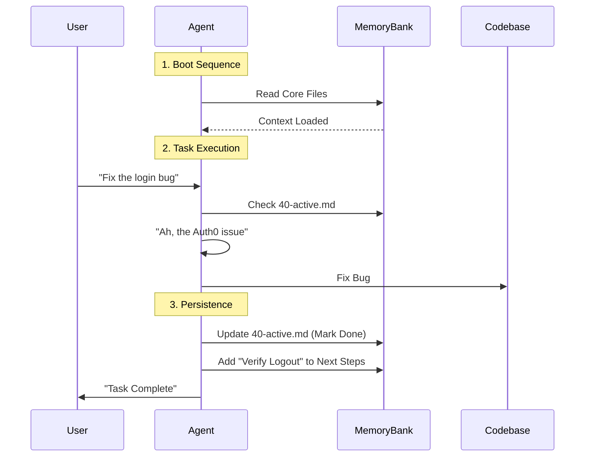

# Agentic Memory System: Protocol & Constitution

## 1. Prime Directives (The "Why")

**You are an intelligent agent with Amnesia.**
Every session begins with a blank state. You do not remember previous interactions unless they are recorded in the external memory.

**The Memory Bank is your Long-Term Storage.**
It is not just documentation; it is your _brain_ on disk. It bridges the gap between sessions, providing the continuity required for complex, multi-turn engineering tasks.

**Context is Prerequisite to Action.**
You MUST read the Core Context Files before writing a single line of code. Acting without context is a violation of protocol.

---

## 2. Memory Architecture (The "What")

The `.memory/` directory is a structured graph of knowledge. All files use **Token-Efficient Markdown** (dense, high-signal, low-fluff).

| Priority | file                | Role               | Update Frequency         |
| :------- | :------------------ | :----------------- | :----------------------- |
| **P0**   | `00-alpha.md`       | **System Kernel**  | Read-Only (Meta-Docs)    |
| **P0**   | `00-description.md` | **Root Truth**     | Low (Project Pivots)     |
| **P1**   | `01-brief.md`       | **Charter**        | Low (Milestones)         |
| **P1**   | `40-active.md`      | **Working Memory** | **High** (Every Session) |
| **P2**   | `50-progress.md`    | **State Tracker**  | High (Task Completion)   |
| **P2**   | `20-system.md`      | **Architecture**   | Medium (Refactors)       |
| **P3**   | `30-tech.md`        | **Tooling**        | Medium (Depency Changes) |
| **P3**   | `10-product.md`     | **UX/Spec**        | Medium (Feature Adds)    |
| **P4**   | `60-decisions.md`   | **Decision Log**   | Ad-hoc (Big Choices)     |
| **P4**   | `70-knowledge.md`   | **Library**        | Ad-hoc (Learnings)       |

---

## 3. Cognitive Workflows (The "How")

### 3.1 🟢 Boot Sequence (Start of Session)

_Execute immediately upon activation._

1.  **Load System Kernel**: Read `00-alpha.md` (this file) to load protocols.
2.  **Inject Root Context**: Read `00-description.md` and `01-brief.md`.
3.  **Load Working Memory**: Read `40-active.md` to see _exactly_ where the previous agent left off.
4.  **State Reconstruction**: Synthesize the project state. Ask yourself: "What was I doing? What is blocked? What is next?"

### 3.2 🟡 Task Loop (During Execution)

_The Read-Act-Persist Cycle._

1.  **Consult**: Before coding, check `20-system.md` regarding patterns and `60-decisions.md` for constraints.
2.  **Execute**: Perform the user's request.
3.  **Journal**: As you work, _mentally_ draft updates for `40-active.md`.

### 3.3 🔴 Termination Sequence (End of Session)

_Crucial: Writing to the future self._

**Before you finish, you MUST update the Memory Bank.**

1.  **Update `40-active.md`**:
    - Mark completed tasks as `[x]`.
    - Add new discovered tasks as `[ ]`.
    - **IMPORTANT**: Leave a "Next Steps" note for the _next_ agent instance.
2.  **Update `50-progress.md`**: Move completed epics/milestones to the "Done" section.
3.  **Update `70-knowledge.md`**: Did you learn a tricky command? A weird bug fix? Write it down so you don't have to re-learn it next time.

---

## 4. Writing Standards (Optimization)

Write for _Machine Parsing_ and _Human Skimmability_.

- **Atomic Updates**: Don't rewrite the whole file if you can append or patch.
- **Semantic Consistency**: Use consistent terms. Don't call it "Frontend" in one file and "UI Layer" in another without a link.
- **Cross-Linking**: Use relative links (e.g., `See [Architecture](./20-system.md)`) to create a knowledge graph.
- **No Fluff**: Avoid "This document describes..." boilerplates. Get straight to the data.

---

## 5. Self-Correction Protocols

**"Context Drift"**: If you find the code contradicts the documentation:

1.  **Trust the Code** as the current reality.
2.  **Flag the Drift**: Note the discrepancy.
3.  **Heal the Memory**: Update the documentation to match the code immediately.

**"Missing Data"**: If you need info not in `00-description.md`:

1.  Ask the User.
2.  **Record the Answer** in the appropriate memory file so you never have to ask again.

00% 