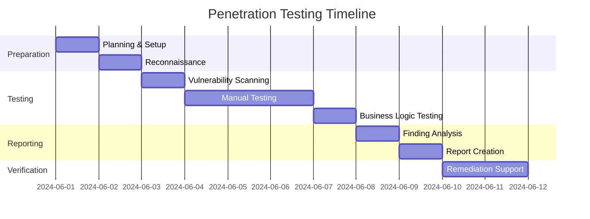

# 🔒 AI Components Penetration Testing Plan

## Implementation Progress

| Feature Area                  | Progress | Status Update                           | Priority | Due        |
| ----------------------------- | -------- | --------------------------------------- | -------- | ---------- |
| Reconnaissance & Planning     | 0%       | Planning phase                          | 🔴 High   | 2024-06-02 |
| Vulnerability Scanning        | 0%       | Awaiting planning completion            | 🔴 High   | 2024-06-03 |
| Manual Testing                | 0%       | Awaiting vulnerability scanning results | 🔴 High   | 2024-06-04 |
| Business Logic Testing        | 0%       | Awaiting initial testing results        | 🟡 Med    | 2024-06-07 |
| Findings Analysis & Reporting | 0%       | Awaiting testing completion             | 🟡 Med    | 2024-06-09 |
| Remediation Support           | 0%       | Awaiting report completion              | 🟡 Med    | 2024-06-10 |

## Success Metrics

| Metric                       | Current | Target | Status        |
| ---------------------------- | ------- | ------ | ------------- |
| Critical Vulnerabilities     | Unknown | 0      | ⚪ Not Started |
| High Vulnerabilities         | Unknown | 0      | ⚪ Not Started |
| Medium Vulnerabilities       | Unknown | sub-5  | ⚪ Not Started |
| API Endpoint Coverage        | 0%      | 100%   | ⚪ Not Started |
| Auth Mechanism Coverage      | 0%      | 100%   | ⚪ Not Started |
| Data Protection Verification | 0%      | 100%   | ⚪ Not Started |

## Active Implementation Tasks

### 1️⃣ Reconnaissance & Planning **(HIGH PRIORITY)**

#### Scope Definition (0% Complete)

- [ ] Identify all AI API endpoints for testing
- [ ] Map authentication and authorization mechanisms
- [ ] Document rate limiting implementation
- [ ] Catalog input validation and sanitization controls
- [ ] List error handling and logging systems
- [ ] Identify data encryption and protection mechanisms

#### Test Environment Setup (0% Complete)

- [ ] Create isolated test environment mirroring production
- [ ] Set up test accounts with various permission levels
- [ ] Ensure access to necessary documentation
- [ ] Prepare source code availability
- [ ] Obtain testing authorization
- [ ] Configure testing tools and infrastructure

### 2️⃣ Vulnerability Scanning **(HIGH PRIORITY)**

#### Automated Assessment (0% Complete)

- [ ] Run OWASP ZAP scanning
- [ ] Perform dependency vulnerability scanning
- [ ] Check for security misconfigurations
- [ ] Scan for sensitive information disclosure
- [ ] Conduct Static Application Security Testing (SAST)
- [ ] Analyze results and prioritize findings

### 3️⃣ Manual Testing **(HIGH PRIORITY)**

#### Authentication & Authorization (0% Complete)

- [ ] Attempt authentication bypass techniques
- [ ] Evaluate session management implementation
- [ ] Assess MFA implementation
- [ ] Verify password policy enforcement
- [ ] Test privilege escalation scenarios
- [ ] Check for insecure direct object references
- [ ] Verify role-based access control implementation
- [ ] Test API access control mechanisms

#### Input Validation & Injection (0% Complete)

- [ ] Attempt SQL injection attacks
- [ ] Test for XSS vulnerabilities
- [ ] Try command injection techniques
- [ ] Check for SSRF vulnerabilities
- [ ] Test for template injection
- [ ] Manipulate parameters and inputs
- [ ] Attempt request forgery attacks
- [ ] Test file upload functionality

#### Rate Limiting & DoS Protection (0% Complete)

- [ ] Test effectiveness of rate limiting
- [ ] Attempt resource exhaustion attacks
- [ ] Look for race conditions
- [ ] Test API abuse scenarios
- [ ] Verify throttling mechanisms

#### Data Protection (0% Complete)

- [ ] Review encryption implementation
- [ ] Verify transport security protocols
- [ ] Assess for data leakage
- [ ] Evaluate storage security
- [ ] Check for PII/PHI exposure
- [ ] Verify data minimization practices
- [ ] Assess storage compliance with regulations
- [ ] Verify proper data lifecycle management

### 4️⃣ Business Logic Testing **(MEDIUM PRIORITY)**

#### Application Behavior (0% Complete)

- [ ] Identify and exploit logic flaws
- [ ] Assess workflow security
- [ ] Test for race conditions
- [ ] Create function-specific abuse cases
- [ ] Verify business rule enforcement
- [ ] Test boundary conditions in business processes
- [ ] Manipulate API sequences

### 5️⃣ Findings Analysis & Reporting **(MEDIUM PRIORITY)**

#### Vulnerability Assessment (0% Complete)

- [ ] Analyze all identified vulnerabilities
- [ ] Assign CVSS scores
- [ ] Prioritize based on risk level
- [ ] Create comprehensive vulnerability descriptions
- [ ] Document steps to reproduce
- [ ] Prepare evidence documentation
- [ ] Draft remediation recommendations

#### Report Generation (0% Complete)

- [ ] Create executive summary
- [ ] Document detailed findings
- [ ] Develop remediation guidance
- [ ] Generate prioritized vulnerability list
- [ ] Propose remediation timeline
- [ ] Outline resource requirements
- [ ] Define verification criteria

## Implementation Timeline

## Validation Strategy

### Vulnerability Verification

- [ ] Implement double-validation of critical findings
- [ ] Verify exploitability of identified vulnerabilities
- [ ] Confirm vulnerability impact assessment
- [ ] Test proposed remediation effectiveness
- [ ] Document verification procedures

### Security Control Assessment

- [ ] Validate authentication controls
- [ ] Verify authorization mechanisms
- [ ] Assess input validation effectiveness
- [ ] Evaluate encryption implementation
- [ ] Test logging and monitoring capabilities
- [ ] Verify rate limiting effectiveness

## Deployment Phases

### Phase 1: Planning & Scanning (Target: June 1-3, 2024)

- [ ] Complete planning and setup
- [ ] Finish reconnaissance activities
- [ ] Conduct automated vulnerability scanning
- [ ] Analyze initial results

### Phase 2: Testing & Analysis (Target: June 4-8, 2024)

- [ ] Complete manual security testing
- [ ] Finish business logic testing
- [ ] Analyze all findings
- [ ] Assign severity ratings

### Phase 3: Reporting & Support (Target: June 9-12, 2024)

- [ ] Complete comprehensive report
- [ ] Present findings to stakeholders
- [ ] Provide remediation guidance
- [ ] Support initial remediation efforts

## Interactive Features

> 💡 **Quick Actions**
>
> - [View Testing Scope](#implementation-progress)
> - [Check Vulnerability Metrics](#success-metrics)
> - [Review Testing Timeline](#implementation-timeline)
> - [Access Testing Methodology](#validation-strategy)

> 🔄 **Status Updates**
>
> - Last Updated: 2025-03-15
> - Next Review: 2025-04-01
> - Testing Status: Planning Phase
> - Critical Path: Reconnaissance → Scanning → Testing → Analysis

> 📈 **Security Monitoring**
>
> - [View Vulnerability Dashboard](./vulnerability-dashboard)
> - [Check Remediation Progress](./remediation-progress)
> - [Review Compliance Status](./compliance-status)

---

📝 Notes & Dependencies

- Penetration testing requires authorized access to systems
- Testing should minimize impact on production systems
- All identified vulnerabilities must be documented securely
- Testing activities must comply with legal and regulatory requirements
- Test data must not include actual patient information

**Dependencies:**

- Test environment setup
- Authorization from security team
- Access to documentation
- Testing tools and frameworks
- Authorized test accounts

🔄 Recent Updates

- **2025-03-15**: Initial testing plan drafted
- **2025-03-10**: Scoping meeting with security team
- **2025-03-05**: Identified key AI components for testing
- **2025-03-01**: Initiated penetration testing planning

