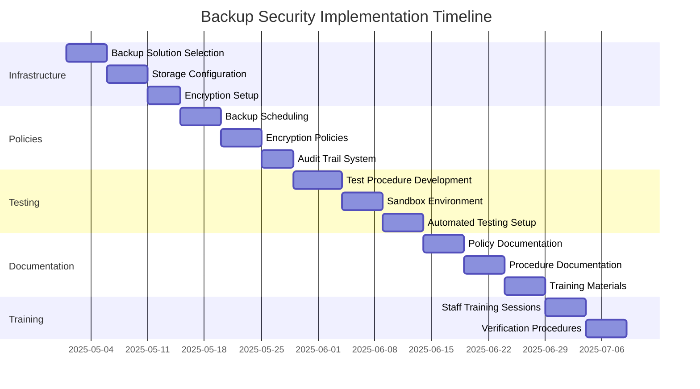

# 🔒 Backup Security Implementation Plan

## Implementation Progress

| Feature Area                | Progress | Status Update                   | Priority | Due       |
| --------------------------- | -------- | ------------------------------- | -------- | --------- |
| Infrastructure Setup        | 0%       | Awaiting implementation kickoff | 🔴 High   | Weeks 1-2 |
| Backup Policy Configuration | 0%       | Planning phase                  | 🔴 High   | Weeks 3-4 |
| Recovery Testing            | 0%       | Awaiting infrastructure setup   | 🟡 Med    | Weeks 5-6 |
| Documentation and Training  | 0%       | Awaiting policy configuration   | 🟡 Med    | Weeks 7-8 |

## Success Metrics

| Metric                    | Current | Target  | Status        |
| ------------------------- | ------- | ------- | ------------- |
| Backup Success Rate       | N/A     | >99.99% | ⚪ Not Started |
| Recovery Test Completion  | 0%      | 100%    | ⚪ Not Started |
| Documentation Coverage    | 0%      | 100%    | ⚪ Not Started |
| Staff Training Completion | 0%      | 100%    | ⚪ Not Started |
| Compliance Verification   | 0%      | 100%    | ⚪ Not Started |

## Active Implementation Tasks

### 1️⃣ Infrastructure Setup **(HIGH PRIORITY)**

#### Backup Solution Implementation (0% Complete)

- [ ] Select backup solution compatible with our stack
- [ ] Configure secure storage locations with appropriate access controls
- [ ] Set up encryption mechanisms for all backup types (AES-256)
- [ ] Implement backup monitoring and alerting system

#### Storage Location Configuration (0% Complete)

- [ ] Configure primary secure cloud storage with geographic redundancy
- [ ] Set up secondary storage with separate cloud provider
- [ ] Establish quarterly offline cold storage for disaster recovery
- [ ] Implement secure access controls for all storage locations

### 2️⃣ Backup Policy Configuration **(HIGH PRIORITY)**

#### Backup Scheduling (0% Complete)

- [ ] Implement weekly full backups with 1-year retention
- [ ] Configure daily differential backups with 1-month retention
- [ ] Set up hourly transaction log backups with 1-week retention
- [ ] Create backup log and audit trail system

#### Encryption Implementation (0% Complete)

- [ ] Configure end-to-end encryption for all PHI/PII data
- [ ] Implement secure key management for backup encryption keys
- [ ] Set up in-transit protection for backup transmission
- [ ] Configure secure key rotation for backup encryption
- [ ] Coordinate with existing FHE implementation for sensitive data fields

### 3️⃣ Recovery Testing **(MEDIUM PRIORITY)**

#### Testing Procedures (0% Complete)

- [ ] Develop automated recovery testing procedures
- [ ] Implement sandbox environment for recovery testing
- [ ] Create recovery success/failure metrics
- [ ] Document recovery time objectives (RTO) and recovery point objectives (RPO)
- [ ] Establish verification procedures for all backup types

#### Testing Automation (0% Complete)

- [ ] Create automated test schedule for different backup types
- [ ] Implement notification system for test results
- [ ] Develop reporting mechanism for compliance purposes
- [ ] Configure integration with monitoring systems

### 4️⃣ Documentation and Training **(MEDIUM PRIORITY)**

#### Compliance Documentation (0% Complete)

- [ ] Create comprehensive backup and recovery documentation
- [ ] Develop Backup Security Policy document
- [ ] Prepare Backup and Recovery Procedures guide
- [ ] Create Backup Verification Log Templates
- [ ] Develop Key Management Procedures documentation

#### Staff Training (0% Complete)

- [ ] Develop training materials for IT staff
- [ ] Schedule training sessions for all relevant personnel
- [ ] Create reference materials for quick consultation
- [ ] Establish backup verification procedures for compliance audits
- [ ] Create incident response procedures for backup/recovery failures

## Implementation Timeline

## Validation Strategy

### Backup Integrity Testing

- [ ] Implement checksum verification for all backup files
- [ ] Conduct periodic restoration tests in sandbox environment
- [ ] Verify data integrity after restoration
- [ ] Test encryption/decryption process for all backup types

### Security Verification

- [ ] Audit access controls for backup storage
- [ ] Verify encryption implementation meets HIPAA standards
- [ ] Test key management procedures and rotation
- [ ] Validate secure transmission of backup data

## Deployment Phases

### Phase 1: Initial Setup (Weeks 1-2)

- [ ] Select and implement backup solution
- [ ] Configure storage locations
- [ ] Set up basic encryption
- [ ] Implement monitoring

### Phase 2: Policy Implementation (Weeks 3-4)

- [ ] Deploy backup schedules
- [ ] Configure retention policies
- [ ] Implement audit logging
- [ ] Set up key management

### Phase 3: Testing and Validation (Weeks 5-6)

- [ ] Deploy testing procedures
- [ ] Conduct initial recovery tests
- [ ] Measure recovery metrics
- [ ] Refine processes based on results

### Phase 4: Documentation and Training (Weeks 7-8)

- [ ] Finalize all documentation
- [ ] Conduct staff training
- [ ] Verify compliance requirements
- [ ] Prepare for compliance audit

## Interactive Features

> 💡 **Quick Actions**
>
> - [View Backup Status Dashboard](#implementation-progress)
> - [Check Recovery Test Results](#validation-strategy)
> - [Review Implementation Timeline](#implementation-timeline)
> - [Access Training Materials](#deployment-phases)

> 🔄 **Status Updates**
>
> - Last Updated: 2025-04-27
> - Next Review: 2025-05-15
> - Sprint Status: Planning phase
> - Critical Path: Infrastructure Setup → Policy Configuration → Testing

> 📈 **Monitoring**
>
> - [View Backup Success Reports](./backup-reports)
> - [Check Recovery Test Results](./recovery-tests)
> - [Review Compliance Status](./compliance-status)

---

- Implementation must adhere to HIPAA Security Rule requirements
- Coordination needed with Security Engineering, DevOps, and Compliance teams
- Integration required with existing FHE system and DLP policies
- All processes must be documented for compliance audits

**Dependencies:**

- Secure cloud storage infrastructure
- Encryption key management system
- Sandbox testing environment
- Compliance documentation templates

- **2025-04-27**: Initial plan created
- **2025-04-25**: Completed requirements gathering
- **2025-04-20**: Identified compliance requirements
- **2025-04-15**: Initiated planning process
