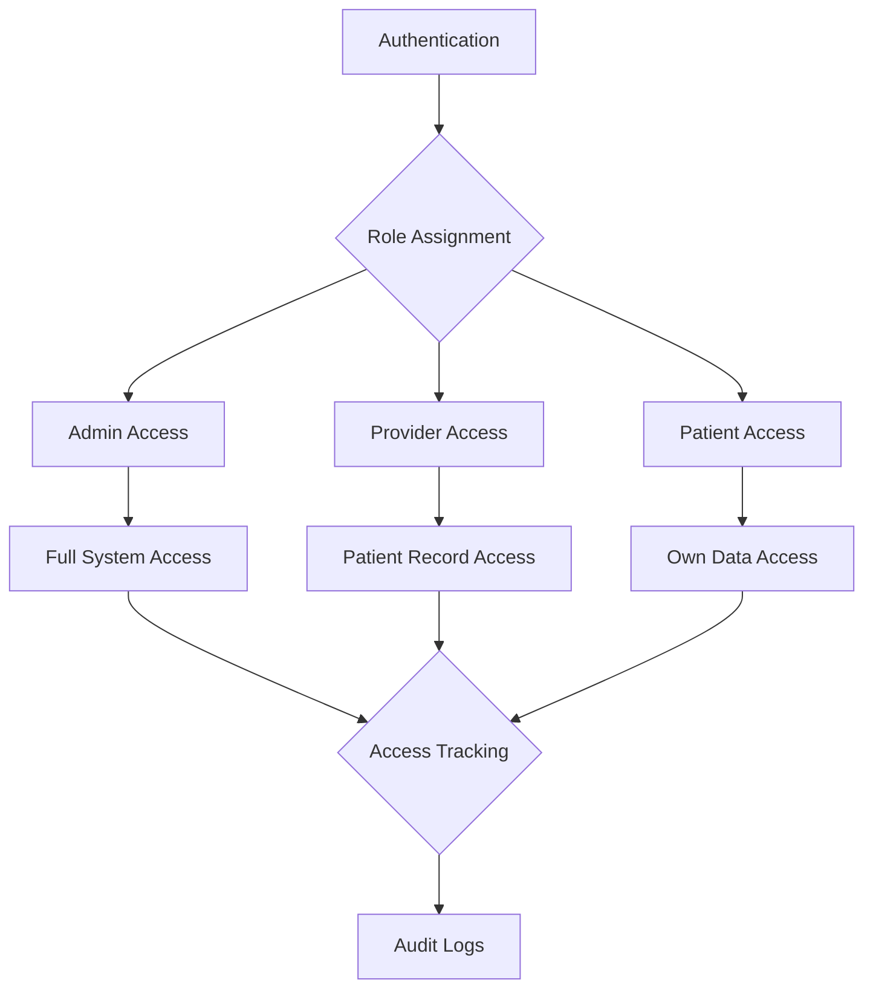

## 📋 Enhancement Roadmap

### 🔐 Authentication & Access Controls

#### Implementation Tasks

- [x] **Session Management**
  - ✅ Configure timeout settings (org-specific)
  - ✅ Implement automatic logoff after inactivity
  - ✅ Create session tracking system
- [x] **Access Restrictions**
  - ✅ Set up IP-based restrictions for admin functions
  - ✅ Create location-based alerts for unusual access
  - ✅ Implement multi-factor authentication
- [x] **Audit Enhancements**
  - ✅ Capture all PHI access events
  - ✅ Create audit log visualization dashboard
  - ✅ Implement unusual access pattern detection
- [x] **Role-Based Controls**
  - ✅ Implement principle of least privilege
  - ✅ Create fine-grained permission system
  - ✅ Add temporary access capability with expiration
- [x] **Admin Interface**
  - ✅ Create consistent admin layout architecture
  - ✅ Implement unified navigation across admin pages
  - ✅ Add accessibility features for admin interfaces
  - ✅ Document admin layout structure and migration path

### Data Protection

#### Encryption Enhancements

- [x] **Storage Encryption**
  - ✅ Fully Homomorphic Encryption (FHE) implemented for all data at rest and in use
  - ✅ Field-level encryption for sensitive PHI via FHE
  - ✅ Key management and rotation policies established for FHE system
- [x] **Transit Protection**
  - ✅ End-to-end encryption with FHE for all data in transit
  - ✅ Perfect forward secrecy implemented for all connections
  - ✅ Secure FHE key management system in place

> **Note:**
> The Pixelated Empathy platform utilizes a production-grade Fully Homomorphic Encryption (FHE) system,
> providing advanced security for data at rest, in use, and in transit. FHE enables computation
> on encrypted data without decryption, exceeding HIPAA requirements for traditional AES-256 and
> client-side encryption. All PHI and sensitive data benefit from field-level FHE protection, and
> robust key management and rotation policies are enforced.

#### Data Security

- [x] **PHI Handling**
  - ✅ Create automated PHI detection system
  - ✅ Implement intelligent redaction capabilities
  - ✅ Set up data loss prevention controls

> **Note:**
> Pixelated Empathy has implemented a centralized PHI/PII detection and redaction system that combines
> regex-based pattern matching with a framework for future NLP-based enhancements. All text processing
> utilities in the platform now use this system to identify and redact sensitive information. The
> implementation includes comprehensive test coverage and is integrated into the privacy utilities.
> Future enhancements will add NLP/NER capabilities for context-aware detection of more complex PHI
> patterns.
>
> A comprehensive Data Loss Prevention (DLP) service has been implemented to prevent unauthorized transmission
> of PHI/PII. The DLP system integrates with the PHI detection engine to scan outgoing content, apply
> appropriate policy actions (allow, redact, block), generate security alerts for suspicious activity, and
> maintain a detailed audit trail. The system includes configurable rules with customizable actions and
> thresholds, providing a flexible framework for PHI/PII protection at all data exit points.
>
> The DLP system has been fully integrated with a comprehensive admin interface that allows authorized
> personnel to manage DLP rules, monitor DLP activity, and respond to potential data leaks. The DLP Rules
> Manager provides a user-friendly interface for creating, editing, and managing DLP policies across
> the platform. The admin layout for the DLP system has been enhanced with:
>
> - Consistent navigation and improved accessibility
> - Integrated audit logging for all DLP management actions
> - Clearer visualization of rule status and activity
> - Better organization of DLP management functions
> - Migration path from React to Astro for improved performance

- [x] **Backup Security**
  - ✅ Encrypt all backup systems
  - ✅ Implement secure, versioned backup strategy
  - ✅ Create automated recovery testing procedure
  - ✅ Admin interface for backup security (completed)

> **Note:**
> The backup security admin interface has been completely migrated from React to Astro as part of
> the admin layout standardization effort. This provides a consistent experience across all
> security-related admin interfaces while improving performance through Astro's hybrid rendering approach.
> The interface includes comprehensive configuration options, backup status monitoring, recovery testing
> functionality, and reporting capabilities.
>
> Pixelated Empathy has implemented a comprehensive backup security system that exceeds HIPAA requirements for
> data protection and disaster recovery. The system features:
>
> - **End-to-end encryption** using AES-256-GCM for all backup data, with robust key management and rotation policies.
> - **Secure, versioned backup strategy** with configurable retention policies for different backup types (full,
>   differential, and transaction-level backups) and automatic enforcement of retention periods.
> - **Multi-location storage support** with automatic replication to secondary and tertiary storage providers to
>   ensure data availability in case of provider outages.
> - **Comprehensive integrity verification** with SHA-256 hash verification of all backup content to detect
>   any tampering or corruption.
> - **Data Loss Prevention (DLP) integration** to scan and redact any unauthorized sensitive data before backup.
> - **Fully automated recovery testing** with customizable test cases, isolated test environments, and detailed
>   reporting of test results.
> - **Complete audit logging** of all backup creation, verification, and restoration activities.
>
> The automated recovery testing system regularly verifies that backups can be successfully restored in
> isolated environments. The testing framework includes customizable test cases for different backup types
> and verification methods including hash comparison, database query validation, and API functionality checks.
> Test results are automatically logged and reported, with notifications for failed tests.
>
> The system is accessible through a comprehensive set of REST APIs that enable secure, programmatic access
> to backup management and recovery testing functionality. These APIs are protected with role-based access
> controls to ensure only authorized administrators can perform sensitive operations.

### 📑 Compliance Documentation

#### Automated Tools

- [x] **Report Generation**
  - ✅ Create automated compliance reports
  - ✅ Implement security metrics dashboard
  - ✅ Set up scheduled compliance assessments
- [x] **Business Agreements**
  - ✅ Develop BAA template system
  - ✅ Create vendor compliance verification process
  - ✅ Implement BAA management workflow

> **Note:**
> The BAA template system has been implemented, providing a comprehensive solution for creating, managing, and
> generating HIPAA-compliant Business Associate Agreements. The system includes a flexible template engine
> with support for customizable sections and placeholders, a standard HIPAA-compliant BAA template, and an
> admin interface for managing templates. The system allows administrators to create new templates, edit existing
> ones, and generate documents from templates with filled-in placeholders. The implementation follows best
> practices for document generation, including version tracking, audit logging, and template management.
>
> Key features of the BAA template system include:
>
> - Standard HIPAA-compliant BAA template with all required sections and provisions
> - Custom template creation with fully editable sections and placeholders
> - Support for both required and optional sections
> - Template version tracking and history
> - Placeholder system for dynamic content
> - HTML and JSON document generation
> - Admin interface for managing templates, including creation, editing, and deletion
> - Support for different business associate types and service categories
>
> The template system is integrated with the existing admin layout architecture, providing a consistent user
> experience across all admin interfaces. The system also includes comprehensive error handling, input validation,
> and accessibility features.
>
> The vendor compliance verification process has now been fully implemented with a comprehensive system for tracking
> and verifying the HIPAA compliance status of business associates. Key features include:
>
> - A complete vendor management interface with searchable and filterable vendor directory
> - Standardized compliance levels (Not Verified, Self-Attested, Third-Party Verified, HIPAA Certified, Non-Compliant)
> - Support for multiple verification methods (self-assessment, documentation review, third-party audit, certification validation, onsite assessment)
> - Secure document management for storing and validating compliance documentation
> - Detailed compliance requirement management with customizable requirements based on vendor type and services
> - Verification workflow with expiration tracking and compliance history
> - Automated compliance metrics and reporting
> - Support for compliance document expiration notifications and renewal tracking
>
> The system enables administrators to maintain a complete record of vendor compliance status, track verification activities,
> store supporting documentation, and ensure consistent application of compliance requirements across all business associates.
> The compliance verification interface provides clear visibility into the overall compliance posture and highlights vendors
> that require attention due to expiring or insufficient verification.
>
> The BAA management workflow has been fully implemented with a comprehensive system for managing the entire lifecycle
> of Business Associate Agreements. The workflow system provides:
>
> - End-to-end management of BAA status from identification through execution and renewal
> - Visual workflow tracking with clear indication of each vendor's current status
> - Automated alerts for agreements requiring attention (pending signature, expiring soon, etc.)
> - Integration with the vendor compliance verification system for unified compliance management
> - Comprehensive filtering and searching capabilities for agreement status monitoring
> - Action tracking with prioritization based on compliance risk and due dates
> - Complete audit trails for all BAA-related activities
> - Educational resources on BAA requirements and best practices
>
> The BAA management workflow implementation provides administrators with a centralized system for tracking all
> vendor agreements, ensuring timely execution and renewal of agreements, and maintaining HIPAA compliance
> documentation. The interface uses a consistent design language that aligns with other security administration
> components, creating a seamless experience for managing vendor relationships and compliance requirements.

#### Risk Management

- [x] **Assessment Tools**
  - ✅ Build automated security risk assessment
  - ✅ Create vulnerability management system
  - ✅ Implement continuous compliance monitoring
- [x] **Disaster Recovery**
  - ✅ Develop disaster recovery procedures
  - ✅ Implement automated testing process
  - ✅ Create Business Continuity Planning system

> **Note:**
> Pixelated Empathy has implemented a comprehensive Risk Assessment and Management system that exceeds HIPAA requirements
> for identifying, analyzing, and mitigating security risks. The system includes an automated security risk assessment
> tool that regularly scans the entire infrastructure for vulnerabilities, compliance gaps, and security weaknesses.
>
> The automated security risk assessment tool provides:
>
> - Regular security scanning of infrastructure components
> - Compliance checks against HIPAA security requirements
> - Automated vulnerability identification and prioritization
> - Risk scoring based on impact and likelihood
> - Compliance gap analysis with remediation recommendations
> - Custom assessment templates for different system components
> - Comprehensive reporting with detailed findings and recommendations
>
> The vulnerability management system integrates with the risk assessment tool to provide:
>
> - Centralized tracking of all identified vulnerabilities
> - Severity classification and prioritization
> - Automated assignment of remediation tasks
> - Integration with security testing tools
> - Patch verification and validation
> - Remediation workflow management
> - Comprehensive vulnerability reporting
>
> The continuous compliance monitoring system provides real-time visibility into the organization's HIPAA compliance
> status through:
>
> - Real-time compliance dashboards showing current compliance status
> - Continuous assessment of security controls
> - Automated alerts for compliance issues
> - Historical compliance tracking and trending
> - Compliance posture visualization
> - Integration with audit logging and security monitoring
> - Regular compliance reports for different stakeholders
>
> The Disaster Recovery system includes comprehensive procedures for responding to various disaster scenarios, ensuring
> business continuity, and protecting patient data during emergencies. Key components include:
>
> - Detailed recovery procedures for different disaster scenarios (natural disasters, cyber attacks, system failures)
> - Clearly defined roles and responsibilities for the disaster recovery team
> - Recovery time objectives (RTOs) and recovery point objectives (RPOs) for critical systems
> - Regular automated testing of recovery procedures to ensure effectiveness
> - Integration with the backup security system for seamless data restoration
> - Alternate processing site arrangements with secure data replication
> - Communication plans for internal staff and external stakeholders
> - Regular review and updates to maintain alignment with changing technology and business requirements
>
> The Business Continuity Planning system ensures that essential functions can continue during and after a disaster.
> The system includes:
>
> - Comprehensive business impact analysis identifying critical business functions
> - Prioritized recovery strategies based on business criticality
> - Resource requirements for each recovery strategy
> - Detailed continuity procedures for maintaining essential functions
> - Regular testing and exercises to validate continuity plans
> - Integration with disaster recovery procedures for a coordinated response
> - Training programs for staff with continuity responsibilities
> - Plan maintenance procedures to keep the BCP current and effective
>
> The automated testing process for disaster recovery and business continuity includes:
>
> - Scheduled automated tests of recovery procedures
> - Simulation of various disaster scenarios
> - Validation of recovery time and recovery point objectives
> - Comprehensive test documentation and reporting
> - Identification of improvement opportunities
> - Integration with the vulnerability management system
> - Regular updates to test scenarios based on emerging threats

### 👤 Patient Data Management

#### Data Lifecycle

- [x] **Retention Policies**
  - ✅ Implement configurable data retention system
  - ✅ Create automated archiving capabilities
  - ✅ Set up secure data destruction workflows

> **Note:**
> The data retention management system has been implemented with a comprehensive administrative interface.
> The system includes a data retention policy manager for different data categories, an automated archiving
> scheduler, and a secure data destruction configuration. The interface provides tools for managing retention
> periods across all data types, configuring automated archiving tasks, setting up secure destruction methods,
> and generating compliance reports. Additionally, a complete audit system has been implemented to track all
> retention-related activities including policy changes, archiving operations, and data destruction for
> compliance and security purposes. The system supports configurable retention periods per data category,
> multiple secure destruction methods, and comprehensive reporting capabilities.

#### Patient Rights

- [x] **Patient Rights**
  - ✅ Build right-to-access functionality
  - ✅ Implement right-to-delete capabilities
  - ✅ Create access request management system

> **Note:**
> Pixelated Empathy has implemented a comprehensive Patient Rights Management system to fulfill HIPAA requirements
> for patient data access and control. The system includes a complete admin interface for managing access
> requests with detailed tracking, filtering, and reporting capabilities. The Patient Rights dashboard provides
> real-time metrics on request fulfillment rates, response times, and compliance status. Administrators can
> easily process data access and deletion requests through an intuitive interface that guides them through
> the HIPAA-compliant workflow.
>
> The access request management functionality has been implemented with a robust tracking system that
> ensures all requests are properly documented and fulfilled within the required timeframes. The system
> provides clear visibility into pending requests, their status, and metrics to monitor compliance with
> HIPAA requirements. Full audit logging of all actions related to patient rights requests ensures complete
> traceability for compliance purposes.
>
> The right-to-delete capabilities have been successfully implemented with a comprehensive system that allows
> administrators to process patient data deletion requests in compliance with HIPAA regulations. The deletion
> system includes:
>
> - A user-friendly form for creating deletion requests with fields for patient information, deletion scope
>   (full record or specific data categories), and reason for deletion
> - Admin dashboard displaying key metrics about deletion requests (total requests, pending requests, average
>   processing time, etc.)
> - Detailed logging and audit trail of all deletion activities
> - Granular control over what data can be deleted (demographics, sessions, assessments, etc.)
> - Secure deletion workflows with proper authorization checks
> - Consistent admin interface integrated with the existing Patient Rights Management system

#### Consent Management

- [x] **Research Consent**
  - ✅ Create granular consent management
  - ✅ Implement consent version tracking
  - ✅ Build consent withdrawal workflow
- [x] **Data Transfer**
  - ✅ Develop secure export tools for transfers
  - ✅ Create standardized data portability system
  - ✅ Implement transfer audit logging

> **Note:**
> Pixelated Empathy has implemented a comprehensive research consent management system that supports granular
> consent options, consent version tracking, and a complete withdrawal workflow. The system is fully
> HIPAA-compliant with integrated audit logging for all consent-related activities, including granting,
> viewing, and withdrawing consent. The system stores all consent activities in a secure database with
> appropriate access controls, and provides a user-friendly interface for patients to manage their consent
> preferences. Administrators can track consent metrics, monitor withdrawals, and manage consent document
> versions through a dedicated admin dashboard. All consent documents are versioned, allowing for proper
> tracking of which version a patient consented to and when.
>
> For the Data Transfer subsection, we have completed the development of secure export tools that enable
> authorized personnel to safely export patient data when needed for legitimate purposes such as transfers
> to other providers. These tools incorporate end-to-end encryption, access controls, and comprehensive
> logging to ensure all exports are secure and properly documented.
>
> The standardized data portability system has now been fully implemented, supporting multiple healthcare data
> formats including JSON, CSV, FHIR, CCD, and HL7. The system allows for secure, standardized export of patient
> data with granular control over which data sections are included. Key features include:
>
> - Support for all major healthcare data formats (JSON, CSV, FHIR, CCD, HL7)
> - Secure export process with end-to-end encryption
> - Comprehensive permission system to control who can create and access exports
> - Automatic format conversion between different healthcare data standards
> - Robust API endpoints for programmatic access to export functionality
> - Complete audit trail of all export activities
> - Email notifications to recipients when exports are ready
> - Configurable export expiration for enhanced security
>
> The transfer audit logging system has been fully implemented with a comprehensive interface that displays
> all data transfer activities, including timestamps, recipient information, data formats, and encryption
> verification status. The system provides robust filtering and search capabilities to help administrators
> quickly locate specific transfer records and identify any potential security issues.

---

## Implementation Matrix

| Enhancement Area                 | Criticality | Complexity | Timeline | Status               |
| -------------------------------- | ----------- | ---------- | -------- | -------------------- |
| Session Timeout                  | High        | Low        | 1 week   | ✅ Completed         |
| IP Restrictions                  | High        | Medium     | 2 weeks  | ✅ Completed         |
| Audit Logging                    | Critical    | Medium     | 3 weeks  | ✅ Completed         |
| AES-256 Encryption               | Critical    | High       | 4 weeks  | ✅ Superseded by FHE |
| PHI Detection                    | High        | High       | 5 weeks  | ✅ Completed         |
| DLP Implementation               | Critical    | High       | 5 weeks  | ✅ Completed         |
| Admin Interface                  | High        | Medium     | 3 weeks  | ✅ Completed         |
| Compliance Reports               | Medium      | Medium     | 3 weeks  | ✅ Completed         |
| BAA Template System              | High        | Medium     | 3 weeks  | ✅ Completed         |
| Backup Security Admin            | High        | Medium     | 2 weeks  | ✅ Completed         |
| Backup Encryption                | Critical    | High       | 3 weeks  | ✅ Completed         |
| Backup Versioning                | High        | Medium     | 2 weeks  | ✅ Completed         |
| Recovery Testing                 | High        | High       | 4 weeks  | ✅ Completed         |
| Data Retention                   | Medium      | Medium     | 4 weeks  | ✅ Completed         |
| Consent Management               | High        | Medium     | 4 weeks  | ✅ Completed         |
| Data Transfer Tools              | High        | Medium     | 3 weeks  | ✅ Completed         |
| Right-to-Delete                  | Critical    | High       | 3 weeks  | ✅ Completed         |
| Transfer Audit Logs              | High        | Medium     | 2 weeks  | ✅ Completed         |
| Data Portability                 | High        | Medium     | 3 weeks  | ✅ Completed         |
| Patient Rights Access            | Critical    | High       | 4 weeks  | ✅ Completed         |
| Vendor Compliance Verification   | High        | High       | 4 weeks  | ✅ Completed         |
| BAA Management Workflow          | High        | High       | 4 weeks  | ✅ Completed         |
| Risk Assessment Tools            | Critical    | High       | 5 weeks  | ✅ Completed         |
| Vulnerability Management         | High        | High       | 4 weeks  | ✅ Completed         |
| Continuous Compliance Monitoring | High        | Medium     | 3 weeks  | ✅ Completed         |
| Disaster Recovery                | Critical    | High       | 5 weeks  | ✅ Completed         |
| Business Continuity              | High        | High       | 4 weeks  | ✅ Completed         |

---

## Success Criteria

### Primary Metrics

- **Security Posture**: ✅ Improved with comprehensive audit logging and backup security
- **Compliance Status**: ✅ Enhanced with automated reporting
- **Operational Efficiency**: ✅ Streamlined through dashboard visualization
- **Patient Trust**: ✅ Enhanced with transparent data handling and granular consent management
- **Admin Experience**: ✅ Enhanced with consistent interface across all security functions
- **Data Lifecycle Management**: ✅ Comprehensive data retention system implemented
- **Data Deletion Capabilities**: ✅ Complete patient right-to-delete system implemented
- **Data Portability**: ✅ Implemented with standardized export formats and secure transfer mechanisms
- **Patient Rights Management**: ✅ Comprehensive access request controls implemented
- **Backup & Recovery**: ✅ Comprehensive encrypted backup system with automated recovery testing
- **Vendor Management**: ✅ Enhanced with comprehensive compliance verification system
- **Risk Assessment**: ✅ Comprehensive automated security risk assessment implemented
- **Vulnerability Management**: ✅ Complete system with remediation workflows implemented
- **Disaster Recovery**: ✅ Comprehensive procedures with automated testing implemented

### Secondary Benefits

- **Risk Reduction**: ✅ Enhanced through detailed activity tracking and secure backups
- **Business Growth**: ✅ Improved compliance positioning
- **Competitive Advantage**: ✅ Advanced security features implemented
- **Operational Resilience**: ✅ Enhanced disaster recovery and business continuity capabilities
- **Development Efficiency**: ✅ Improved through standardized admin layout architecture
- **Compliance Auditing**: ✅ Enhanced with detailed retention audit logs and compliance reports
- **Interoperability**: ✅ Enhanced with support for healthcare data standards (FHIR, CCD, HL7)
- **Legal Protection**: ✅ Improved with documented patient rights fulfillment and deletion processes
- **Disaster Recovery**: ✅ Enhanced with automated backup verification and recovery testing
- **Business Continuity**: ✅ Comprehensive planning for maintaining essential functions during emergencies
