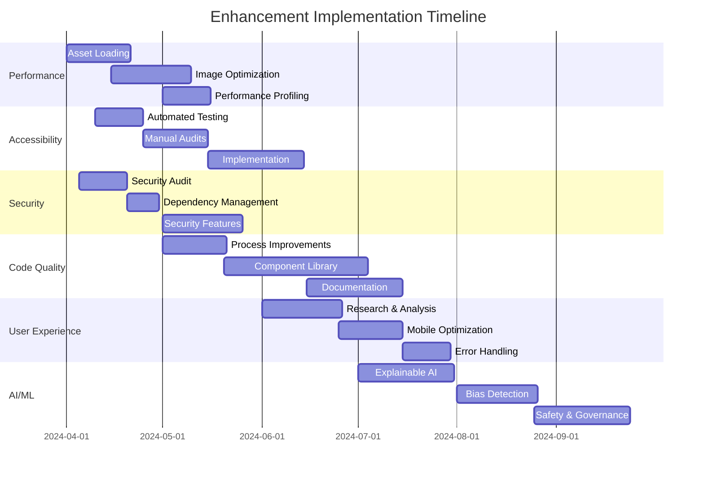

# 🚀 Pixelated Empathy Enhancement Plan

## Implementation Progress

| Feature Area                | Progress | Status Update                 | Priority | Due     |
| --------------------------- | -------- | ----------------------------- | -------- | ------- |
| Performance Optimization    | 10%      | Initial assessment complete   | 🔴 High   | Q2 2024 |
| Accessibility Improvements  | 0%       | Not started                   | 🔴 High   | Q2 2024 |
| Security Enhancements       | 5%       | Audit planning in progress    | 🔴 High   | Q2 2024 |
| Code Quality & Maintenance  | 15%      | Style guide implemented       | 🟡 Med    | Q3 2024 |
| User Experience             | 0%       | Awaiting initial user testing | 🟡 Med    | Q3 2024 |
| AI/ML Specific Improvements | 0%       | Research phase                | 🟡 Med    | Q4 2024 |

## Success Metrics

| Metric                   | Current | Target | Status        |
| ------------------------ | ------- | ------ | ------------- |
| Lighthouse Performance   | 75/100  | 95/100 | 🟡 In Progress |
| Accessibility Score      | 82/100  | 98/100 | ⚪ Not Started |
| Security Vulnerabilities | Unknown | 0      | 🟡 In Progress |
| Code Coverage            | 65%     | 90%    | 🟡 In Progress |
| Mobile Performance       | 70/100  | 90/100 | ⚪ Not Started |
| AI Explainability Rating | 60%     | 85%    | ⚪ Not Started |

## Active Implementation Tasks

### 1️⃣ Performance Optimization **(HIGH PRIORITY)**

#### Asset Loading Improvements (20% Complete)

- [ ] Implement lazy loading for images and non-critical assets
- [ ] Further refine code splitting strategy
- [ ] Analyze chunk sizes after build for optimization
- [ ] Configure CDN for static asset delivery
- [ ] Implement preloading for critical resources

#### Image Optimization (10% Complete)

- [x] Verify sharp and astro-compress configuration
- [ ] Implement adaptive images based on device and screen resolution
- [ ] Set up AVIF/WebP format delivery with fallbacks
- [ ] Create responsive image loading pipeline
- [ ] Optimize SVG assets

#### Performance Profiling (0% Complete)

- [ ] Conduct browser developer tools profiling
- [ ] Identify and address JavaScript bottlenecks
- [ ] Optimize critical rendering path
- [ ] Implement performance monitoring
- [ ] Create automated performance testing

### 2️⃣ Accessibility Improvements **(HIGH PRIORITY)**

#### Automated Testing (0% Complete)

- [ ] Integrate axe-core for accessibility testing
- [ ] Add Lighthouse accessibility checks to CI/CD
- [ ] Configure threshold values for passing tests
- [ ] Implement automated reporting
- [ ] Set up continuous monitoring

#### Manual Accessibility Audits (0% Complete)

- [ ] Conduct screen reader testing
- [ ] Verify keyboard navigation functionality
- [ ] Check color contrast compliance
- [ ] Audit semantic HTML usage
- [ ] Implement necessary ARIA attributes

### 3️⃣ Security Enhancements **(HIGH PRIORITY)**

#### Security Auditing (10% Complete)

- [x] Plan regular security audit schedule
- [ ] Conduct initial comprehensive security audit
- [ ] Document vulnerabilities and prioritize fixes
- [ ] Implement automated security scanning
- [ ] Create security incident response plan

#### Dependency Management (0% Complete)

- [ ] Audit dependencies for vulnerabilities
- [ ] Implement automated dependency updates
- [ ] Create policy for dependency approval
- [ ] Set up monitoring for security advisories
- [ ] Document dependency management process

#### Security Features (5% Complete)

- [x] Review Content Security Policy
- [ ] Implement robust input validation
- [ ] Add output encoding for XSS prevention
- [ ] Configure rate limiting
- [ ] Implement Subresource Integrity for CDN resources

### 4️⃣ Code Quality & Maintainability **(MEDIUM PRIORITY)**

#### Process Improvements (30% Complete)

- [x] Implement code review process
- [x] Create and enforce style guide
- [ ] Set up automated code quality checks
- [ ] Develop documentation standards
- [ ] Create technical debt tracking system

#### Component Library (15% Complete)

- [x] Start developing reusable component library
- [ ] Implement component documentation
- [ ] Create component testing framework
- [ ] Set up visual regression testing
- [ ] Develop component showcase

### 5️⃣ User Experience **(MEDIUM PRIORITY)**

#### Research & Analysis (0% Complete)

- [ ] Set up user testing framework
- [ ] Implement analytics tracking
- [ ] Create user journey mapping
- [ ] Conduct initial usability testing
- [ ] Document UX improvement opportunities

#### Mobile Optimization (0% Complete)

- [ ] Audit mobile experience
- [ ] Implement mobile-specific optimizations
- [ ] Test on various devices and browsers
- [ ] Optimize touch interactions
- [ ] Improve responsive layouts

#### Error Handling (0% Complete)

- [ ] Develop comprehensive error handling strategy
- [ ] Implement user-friendly error messages
- [ ] Create fallback UI components
- [ ] Set up error tracking and reporting
- [ ] Develop recovery mechanisms

### 6️⃣ AI/ML Specific Improvements **(MEDIUM PRIORITY)**

#### Explainable AI (0% Complete)

- [ ] Research XAI techniques for mental health domain
- [ ] Implement model explanation features
- [ ] Create user-friendly visualization of AI reasoning
- [ ] Develop confidence scoring system
- [ ] Test explanations with practitioners

#### Bias Detection & Mitigation (0% Complete)

- [ ] Audit existing models for bias
- [ ] Implement bias detection mechanisms
- [ ] Create mitigation strategies
- [ ] Develop diverse training datasets
- [ ] Establish ongoing bias monitoring

#### Safety & Governance (0% Complete)

- [ ] Develop AI safety guidelines
- [ ] Implement data governance policies
- [ ] Create model review process
- [ ] Establish ethical AI committee
- [ ] Develop incident response plan for AI issues

## Implementation Timeline

## Validation Strategy

### Performance Testing

- [ ] Establish performance benchmarks
- [ ] Implement automated performance testing
- [ ] Create Lighthouse CI integration
- [ ] Set up real user monitoring
- [ ] Implement performance budgets

### Accessibility Validation

- [ ] Create automated accessibility testing suite
- [ ] Schedule regular manual audits
- [ ] Develop user testing with assistive technologies
- [ ] Implement WCAG 2.1 AA compliance verification
- [ ] Create accessibility documentation

### Security Verification

- [ ] Implement automated security scanning
- [ ] Schedule regular penetration testing
- [ ] Create security review process
- [ ] Develop vulnerability disclosure policy
- [ ] Set up security monitoring

## Deployment Phases

### Phase 1: Performance & Accessibility (Target: Q2 2024)

- [ ] Complete asset loading improvements
- [ ] Implement image optimization pipeline
- [ ] Deploy automated accessibility testing
- [ ] Fix critical accessibility issues
- [ ] Establish performance monitoring

### Phase 2: Security & Code Quality (Target: Q3 2024)

- [ ] Deploy security enhancements
- [ ] Implement dependency management system
- [ ] Complete code review process
- [ ] Finalize component library foundation
- [ ] Deploy documentation system

### Phase 3: User Experience & AI Improvements (Target: Q4 2024)

- [ ] Complete mobile optimization
- [ ] Implement error handling system
- [ ] Deploy explainable AI features
- [ ] Implement bias detection and mitigation
- [ ] Establish AI governance framework

## Interactive Features

> 💡 **Quick Actions**
>
> - [View Enhancement Progress](#implementation-progress)
> - [Check Performance Metrics](#success-metrics)
> - [Review Implementation Timeline](#implementation-timeline)
> - [Monitor Validation Status](#validation-strategy)

> 🔄 **Status Updates**
>
> - Last Updated: 2025-03-15
> - Next Review: 2025-04-15
> - Sprint Status: Performance Optimization
> - Critical Path: Performance → Accessibility → Security

> 📈 **Performance Monitoring**
>
> - [View Lighthouse Reports](./lighthouse-reports)
> - [Check Security Scan Results](./security-scans)
> - [Review Accessibility Audit](./accessibility-audit)

---

- Performance optimization requires coordination with design team for image strategy
- Accessibility improvements need input from accessibility specialist
- Security enhancements should be reviewed by security team
- Component library development requires design system alignment
- AI/ML improvements need coordination with data science team

**Dependencies:**

- Astro 4.x
- React 18+
- TensorFlow.js
- Accessibility testing tools
- Performance monitoring infrastructure

- **2025-03-15**: Completed initial assessment of enhancement opportunities
- **2025-03-10**: Started security audit planning
- **2025-03-05**: Implemented initial style guide
- **2025-03-01**: Started component library development
