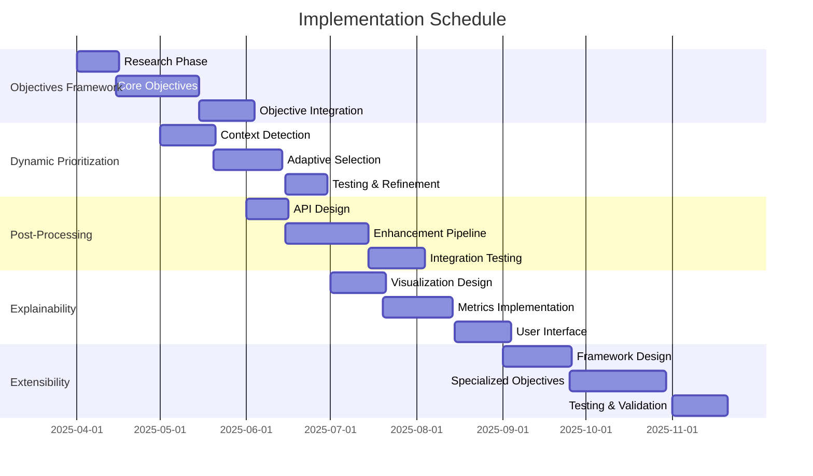

# 🧠 AI Implementation Roadmap

## Implementation Progress

|---------------------------------|----------|----------------------------------------|----------|---------|
| Feature Area                      | Progress   | Status Update                            | Priority   | Due       |
| --------------------------------- | ---------- | ---------------------------------------- | ---------- | --------- |
| Multi-Objective Analysis          | 0%         | Planning phase                           | 🔴 High     | Q2 2024   |
| Dynamic Objective Prioritization  | 0%         | Awaiting multi-objective implementation  | 🔴 High     | Q2 2024   |
| Post-Processing Enhancement       | 0%         | Planning phase                           | 🟡 Med      | Q3 2024   |
| Explainable Alignment             | 0%         | Awaiting core implementation             | 🟡 Med      | Q3 2024   |
| Unseen Mental Health Objectives   | 0%         | Planning for future capabilities         | 🟢 Low      | Q4 2024   |
| --------------------------------- | ---------- | ---------------------------------------- | ---------- | --------- |

## Success Metrics

|--------------------------------|---------|-----------|-----------------|
| Metric                           | Current   | Target      | Status            |
| -------------------------------- | --------- | ----------- | ----------------- |
| Alignment Score                  | N/A       | >85%        | ⚪ Not Started     |
| Objective Balance Rating         | N/A       | >80%        | ⚪ Not Started     |
| Response Quality Improvement     | 0%        | >30%        | ⚪ Not Started     |
| Clinician Satisfaction           | N/A       | >8/10       | ⚪ Not Started     |
| Adaptation to New Objectives     | N/A       | under 24h   | ⚪ Not Started     |
| -------------------------------- | --------- | ----------- | ----------------- |

## Active Implementation Tasks

### 1️⃣ Multi-Objective Analysis Alignment **(HIGH PRIORITY)**

#### Core Objectives Framework (0% Complete)

- [ ] Define correctness objective for mental health assessments
- [ ] Implement informativeness objective for detailed information
- [ ] Create professionalism objective for clinical tone
- [ ] Develop empathy objective for demonstrating understanding
- [ ] Implement safety objective for avoiding harmful suggestions

#### Objective Integration (0% Complete)

- [ ] Create objective definition system
- [ ] Implement objective balancing mechanism
- [ ] Develop objective weighting framework
- [ ] Set up objective evaluation metrics
- [ ] Create visualization of objective influence

### 2️⃣ Dynamic Objective Prioritization **(HIGH PRIORITY)**

#### Context Detection (0% Complete)

- [ ] Implement crisis situation detection
- [ ] Create educational context recognition
- [ ] Develop support context identification
- [ ] Set up clinical assessment detection
- [ ] Implement informational query detection

#### Adaptive Selection (0% Complete)

- [ ] Create context-to-objective mapping system
- [ ] Implement dynamic weighting algorithms
- [ ] Develop context transition detection
- [ ] Create objective switching mechanism
- [ ] Implement user preference incorporation

### 3️⃣ Post-Processing Enhancement **(MEDIUM PRIORITY)**

#### Integration Framework (0% Complete)

- [ ] Design API interface for existing LLM outputs
- [ ] Create input/output format standardization
- [ ] Implement batched processing capabilities
- [ ] Develop streaming response compatibility
- [ ] Set up error handling and fallbacks

#### Enhancement Pipeline (0% Complete)

- [ ] Create query preparation system
- [ ] Implement objective inclusion mechanism
- [ ] Develop context formatting
- [ ] Create response enhancement processor
- [ ] Implement quality validation system

### 4️⃣ Explainable Alignment **(MEDIUM PRIORITY)**

#### Transparency Tools (0% Complete)

- [ ] Create objective influence visualization
- [ ] Implement before/after comparison view
- [ ] Develop objective contribution metrics
- [ ] Set up detailed alignment explanations
- [ ] Create user-friendly explanation interface

#### Metrics Implementation (0% Complete)

- [ ] Implement objective scoring system
- [ ] Create improvement calculation mechanism
- [ ] Develop comparative analysis tools
- [ ] Set up alignment quality metrics
- [ ] Create user satisfaction measurement

### 5️⃣ Unseen Mental Health Objectives **(LOW PRIORITY)**

#### Extensibility Framework (0% Complete)

- [ ] Design objective definition interface
- [ ] Implement zero-shot objective handling
- [ ] Create new objective testing framework
- [ ] Develop objective effectiveness scoring
- [ ] Set up objective refinement pipeline

#### Specialized Objectives (0% Complete)

- [ ] Create cultural sensitivity objective
- [ ] Implement demographic-specific objectives
- [ ] Develop emerging concern objectives
- [ ] Set up specialized clinical objectives
- [ ] Create customizable objective templates

## Implementation Timeline

## Validation Strategy

### Alignment Evaluation

- [ ] Develop human evaluation protocol for alignment quality
- [ ] Create automated alignment metrics
- [ ] Implement comparative testing with unaligned responses
- [ ] Design objective balance assessment
- [ ] Set up continuous monitoring system

### Clinical Validation

- [ ] Create clinician review protocol
- [ ] Design clinical usefulness metrics
- [ ] Implement harmful response detection
- [ ] Develop professional tone evaluation
- [ ] Set up empathy and understanding assessment

## Deployment Phases

### Phase 1: Alpha (Target: Q2 2025)

- [ ] Implement core objectives framework
- [ ] Develop basic post-processing pipeline
- [ ] Create initial alignment metrics
- [ ] Set up integration with existing models
- [ ] Deploy in controlled test environment

### Phase 2: Beta (Target: Q3 2025)

- [ ] Deploy dynamic objective prioritization
- [ ] Implement explainable alignment tools
- [ ] Enhance post-processing capabilities
- [ ] Integrate with user interfaces
- [ ] Scale to broader model coverage

### Phase 3: Production (Target: Q4 2025)

- [ ] Deploy unseen objective framework
- [ ] Implement specialized objective creation
- [ ] Develop objective effectiveness metrics
- [ ] Create self-improvement mechanisms
- [ ] Support custom objective definitions

## Interactive Features

> 💡 **Quick Actions**
>
> - [View Progress Charts](#implementation-progress)
> - [Check Success Metrics](#success-metrics)
> - [Review Timeline](#implementation-timeline)
> - [Monitor Validation](#validation-strategy)

> 🔄 **Status Updates**
>
> - Last Updated: 2025-05-12
> - Next Review: 2025-06-15
> - Sprint Status: Planning Multi-Objective Analysis
> - Critical Path: Objectives Framework → Post-Processing → Explainability

> 📈 **Performance Tracking**
>
> - [View Metrics Dashboard](./alignment-dashboard)
> - [Check Objective Balance](./objective-balance)
> - [Review Response Quality](./response-quality)

---

- **CRITICAL NOTE**: The IMHI dataset used to train MetaAligner-IMHI is not publicly available
- _Alternatives_: Consider leveraging public datasets such as [CLPsych 2015 Shared Task](https://clpsych.org/shared-task-2015/), [EmpatheticDialogues](https://github.com/facebookresearch/EmpatheticDialogues), [Mental Health Reddit Dataset](https://zenodo.org/record/3609856), or internal datasets that meet privacy and compliance requirements. For proprietary or restricted datasets, reference or initiate [data-access requests](https://www.nimh.nih.gov/data/data-access-requests) as appropriate.
- Integration should focus on the general MetaAligner approach rather than the specialized IMHI variant
- Custom objective framework needed rather than relying on their specific trained objectives
- Post-processing approach allows integration with any existing model
- Consider using general MetaAligner models without relying on the specialized IMHI variant

**Dependencies:**

- Underlying LLM for initial response generation
- Objective definition framework
- Alignment evaluation metrics
- Integration with current mental health analysis system
- User interface for explainable alignment

- **2025-05-12**: Updated integration plan timeline and review schedule
- **2025-03-15**: Initial integration plan drafted
- **2025-03-10**: Completed research on MetaAligner capabilities
- **2025-03-05**: Confirmed IMHI dataset unavailability and adjusted strategy
- **2025-03-01**: Started planning integration approach using general MetaAligner methodology
