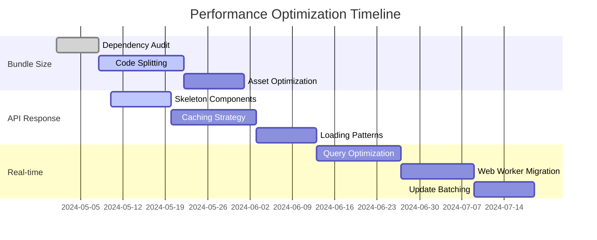

# ⚡ Performance Optimization Plan

## Implementation Progress

| Feature Area              | Progress | Status Update                                      | Priority | Due     |
| ------------------------- | -------- | -------------------------------------------------- | -------- | ------- |
| Bundle Size Reduction     | 40%      | Code splitting implemented, dependencies in review | 🔴 High   | Q2 2024 |
| API Response Optimization | 20%      | Skeleton components in progress                    | 🔴 High   | Q2 2024 |
| Real-time Data Efficiency | 10%      | Update batching partially implemented              | 🟡 Med    | Q3 2024 |
| Asset Optimization        | 30%      | Responsive images pipeline created                 | 🟡 Med    | Q2 2024 |

## Success Metrics

| Metric              | Current | Target  | Status        |
| ------------------- | ------- | ------- | ------------- |
| Lighthouse Score    | 87/100  | >95/100 | 🟡 In Progress |
| Bundle Size         | 1.2MB   | 450KB   | 🟡 In Progress |
| Time to First Byte  | 320ms   | 180ms   | 🟡 In Progress |
| Time to Interactive | 3.2s    | 1.8s    | 🟡 In Progress |
| API Response Time   | 450ms   | 180ms   | 🟡 In Progress |
| Memory Usage        | 75MB    | 45MB    | 🟡 In Progress |
| CPU Utilization     | 35%     | 20%     | 🟡 In Progress |

## Active Implementation Tasks

### 1️⃣ Bundle Size Reduction **(HIGH PRIORITY)**

#### Code Splitting (40% Complete)

- [x] Implement route-based splitting with dynamic imports for page components
- [x] Create separate chunks for authentication flows
- [ ] Implement prefetching for critical paths
- [x] Create lazy-loaded versions of heavy components
- [ ] Implement suspense boundaries with fallbacks
- [ ] Set up component preloading on user intent

#### Dependency Optimization (10% Complete)

- [ ] Perform comprehensive dependency analysis
- [ ] Replace heavy libraries with lightweight alternatives
- [ ] Implement tree-shaking for all imports
- [x] Create responsive image pipeline
- [x] Implement modern format conversion (WebP, AVIF)
- [ ] Set up font subsetting and optimization

### 2️⃣ API Response Optimization **(HIGH PRIORITY)**

#### Loading Patterns (0% Complete)

- [ ] Implement staggered data fetching pattern
- [ ] Create priority-based loading queue
- [ ] Develop partial render strategy

#### Visual Feedback (40% Complete)

- [x] Design comprehensive skeleton component system
- [ ] Implement predictive prefetching based on user behavior
- [ ] Create optimistic UI updates for common actions

#### Caching Strategy (0% Complete)

- [ ] Implement SWR pattern for data fetching
- [ ] Create smart cache invalidation rules
- [ ] Develop offline-first capabilities
- [ ] Configure edge caching for non-sensitive data
- [ ] Implement cache control headers
- [ ] Create cache warming strategy for common queries

### 3️⃣ Real-time Data Efficiency **(MEDIUM PRIORITY)**

#### Query Optimization (0% Complete)

- [ ] Implement field selection to minimize data transfer
- [ ] Create compound queries to reduce roundtrips
- [ ] Design view-specific projections

#### Subscription Management (0% Complete)

- [ ] Implement dynamic subscription scoping
- [ ] Create subscription consolidation strategy
- [ ] Develop selective updates mechanism

#### Processing Strategies (20% Complete)

- [ ] Move intensive operations to web workers
- [ ] Implement requestIdleCallback for non-critical tasks
- [ ] Create chunked processing for large datasets
- [x] Implement debounced real-time updates
- [ ] Create update coalescence mechanism

## Implementation Timeline

## Validation Strategy

### Test Data Pipeline

- [ ] Create automated performance testing suite
- [ ] Implement CI/CD performance benchmark checks
- [ ] Configure real user monitoring (RUM)
- [ ] Set up synthetic monitoring for critical user flows

### Performance Metrics Tracking

- [ ] Core Web Vitals monitoring
- [ ] Custom metrics for application-specific features
- [ ] Implement performance budget alerts
- [ ] Create dashboard for performance trends

## Deployment Phases

### Phase 1: Initial Optimizations (Target: Q2 2024)

- [ ] Complete code splitting implementation
- [ ] Finish skeleton component system
- [ ] Implement basic caching strategy
- [ ] Deploy asset optimization pipeline

### Phase 2: Advanced Techniques (Target: Q3 2024)

- [ ] Implement SWR pattern for all API requests
- [ ] Complete web worker migration
- [ ] Deploy subscription optimization
- [ ] Implement prefetching strategies

### Phase 3: Fine-Tuning (Target: Q4 2024)

- [ ] Optimize edge caching configuration
- [ ] Implement predictive prefetching
- [ ] Fine-tune update coalescence
- [ ] Complete font optimization

## Interactive Features

> 💡 **Quick Actions**
>
> - [View Performance Dashboard](#implementation-progress)
> - [Check Core Web Vitals](#success-metrics)
> - [Review Optimization Timeline](#implementation-timeline)
> - [Monitor Real User Metrics](#validation-strategy)

> 🔄 **Status Updates**
>
> - Last Updated: 2025-03-15
> - Next Review: 2025-04-15
> - Sprint Status: Implementing Bundle Size Reduction
> - Critical Path: Code Splitting → Caching Strategy → Query Optimization

> 📈 **Performance Tracking**
>
> - [View Lighthouse Reports](./lighthouse-reports)
> - [Check Bundle Analysis](./bundle-analysis)
> - [Review API Performance](./api-performance)

---

- Performance optimization requires coordination with feature development teams
- API optimization dependent on backend team capacity
- Edge caching implementation requires DevOps support
- Web worker migration may impact existing debugging workflows

**Dependencies:**

- Astro 2.0+
- Convex Query Optimization
- Redis Cache Configuration
- Vercel Edge Functions

- **2025-03-15**: Completed initial code splitting implementation
- **2025-03-10**: Identified opportunity for additional image optimization
- **2025-03-05**: Started implementing skeleton component system
- **2025-03-01**: Completed performance audit and identified key bottlenecks
