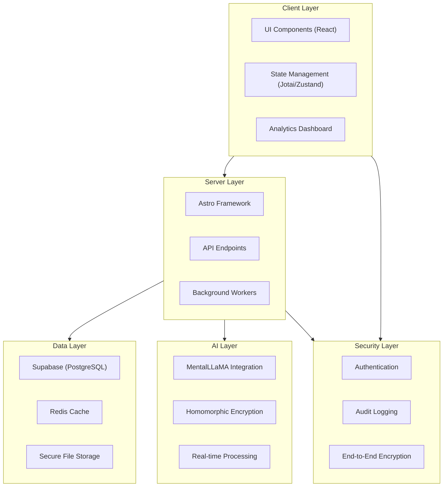
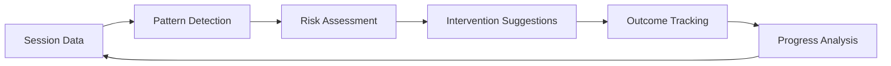
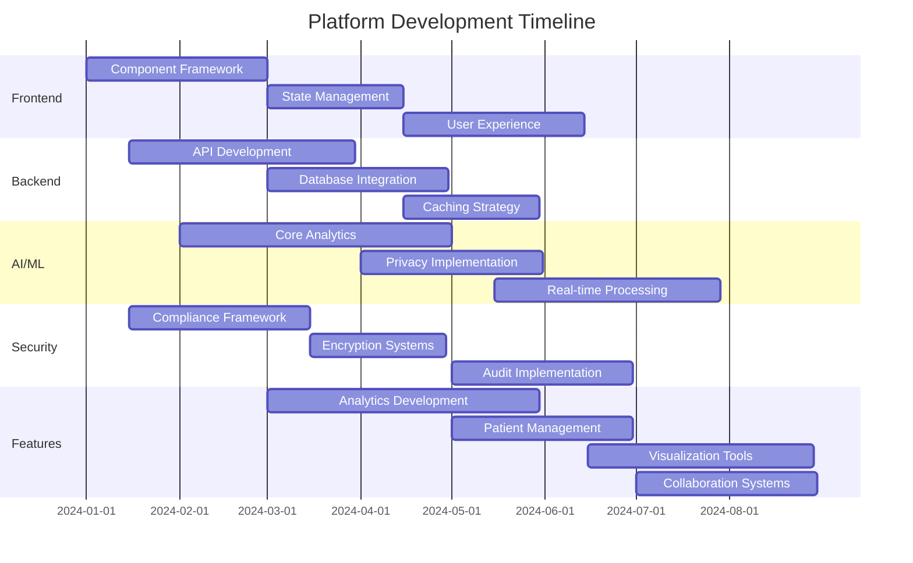
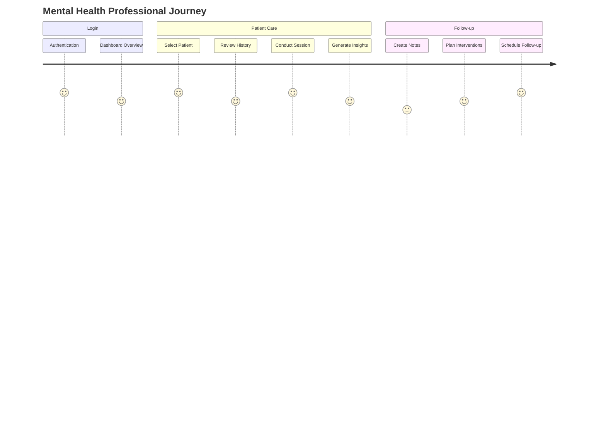

# 🧠 pixelated: Mental Health Analytics Platform

## Implementation Progress

| Feature Area                | Progress | Status Update               | Priority | Due     |
| :-------------------------- | :------: | :-------------------------- | :------: | :------ |
| **Frontend Implementation** | 75%      | Core UI complete            | 🔴 High  | Q2 2024 |
| **Backend Services**        | 80%      | API & DB integration done   | 🔴 High  | Q1 2024 |
| **AI/ML Integration**       | 60%      | Core analytics implemented  | 🔴 High  | Q2 2024 |
| **Security & Compliance**   | 70%      | HIPAA infra in place        | 🔴 High  | Q1 2024 |
| **Platform Features**       | 65%      | Real-time stats in progress | 🟡 Med   | Q2 2024 |
| **User Journey Impl**       | 50%      | Workflows in development    | 🟡 Med   | Q3 2024 |


## Success Metrics

| Metric                     | Current | Target   | Status         |
| :------------------------- | :-----: | :------: | :------------- |
| **API Response Time**      | `350ms` | `100ms`  | 🟡 **Active**  |
| **AI Analysis Accuracy**   | `78%`   | `95%`    | 🟡 **Active**  |
| **Security Compliance**    | `100%`  | `100%`   | ✅ **Success** |
| **User Satisfaction**      | `72/100`| `90/100` | 🟡 **Active**  |
| **Data Throughput**        | `500/m` | `2000/m` | 🟡 **Active**  |
| **Platform Uptime**        | `99.9%` | `99.99%` | 🟡 **Active**  |


## Active Implementation Tasks

### 1️⃣ Platform Architecture **(HIGH PRIORITY)**



### 2️⃣ Frontend Layer **(HIGH PRIORITY)**

#### Framework & Components (85% Complete)

- [x] Astro 4.x with React 18 integration
- [x] Shadcn UI components
- [x] Radix UI primitives
- [x] Tailwind CSS for styling
- [x] Framer Motion for animations
- [ ] Final responsive layout adjustments
- [ ] Advanced animation sequences

#### State Management (65% Complete)

- [x] Jotai for atomic state management
- [x] Zustand for complex state scenarios
- [ ] State persistence implementation
- [ ] Offline capabilities
- [ ] Real-time state synchronization

### 3️⃣ Backend Services **(HIGH PRIORITY)**

#### API Layer (90% Complete)

- [x] Astro + Node.js backend integration
- [x] RESTful endpoint design
- [x] Type-safe API contracts
- [ ] API versioning strategy
- [ ] Rate limiting implementation

#### Database (85% Complete)

- [x] Supabase for primary data storage
- [x] PostgreSQL with row-level security
- [x] Secure data models
- [ ] Advanced indexing strategy
- [ ] Sharding implementation for scale

#### Caching (70% Complete)

- [x] Redis (Upstash) for performance optimization
- [x] Tiered caching strategy
- [ ] Intelligent invalidation
- [ ] Cache hit ratio optimization
- [ ] Cache warming strategies

#### Workers (75% Complete)

- [x] Email processing
- [x] Notification handling
- [x] Analytics processing
- [ ] Queue management optimization
- [ ] Worker scaling strategy

### 4️⃣ AI/ML Integration **(HIGH PRIORITY)**

#### Core Analytics (70% Complete)

- [x] MentalLLaMA integration
- [x] Emotion detection
- [x] Pattern recognition
- [ ] Intervention suggestion refinement
- [ ] Model performance optimization

#### Privacy (60% Complete)

- [x] Fully Homomorphic Encryption (FHE)
- [x] Differential privacy techniques
- [ ] Zero-knowledge processing
- [ ] Privacy budget management
- [ ] Privacy preservation validation

#### Real-time Processing (50% Complete)

- [x] WebSocket integration
- [x] Stream processing
- [ ] TensorFlow.js optimization
- [ ] Model compression for client-side
- [ ] Adaptive processing based on client capability

### 5️⃣ Security & Compliance **(HIGH PRIORITY)**

#### Compliance (80% Complete)

- [x] HIPAA-compliant infrastructure
- [x] SOC 2 preparation
- [x] Comprehensive compliance controls
- [ ] Third-party security validation
- [ ] Compliance documentation finalization

#### Encryption (75% Complete)

- [x] End-to-end encryption
- [x] At-rest encryption (AES-256)
- [ ] Perfect forward secrecy
- [ ] Key rotation mechanisms
- [ ] Hardware security module integration

#### Auditing (65% Complete)

- [x] Comprehensive audit logging
- [x] Access tracking
- [ ] Anomaly detection
- [ ] Forensic capabilities
- [ ] Automated compliance reporting

### 6️⃣ Platform Features **(MEDIUM PRIORITY)**

#### Real-time Therapeutic Analytics (70% Complete)



- [x] Real-time speech analysis
- [x] Emotional state tracking
- [x] Therapeutic technique detection
- [ ] Effectiveness measurement
- [ ] Predictive intervention recommendations

#### Secure Patient Management (65% Complete)

- [x] Encrypted storage
- [x] Zero-knowledge access
- [ ] Granular permissions enhancement
- [ ] Comprehensive history tracking
- [ ] Patient data portability

#### Advanced Visualization (60% Complete)

- [x] Customizable views
- [x] Real-time updates
- [ ] Multi-dimensional analysis
- [ ] Comparative visualization
- [ ] Interactive data exploration

#### Collaboration Tools (60% Complete)

- [x] Secure messaging
- [x] Notification system
- [ ] Alert prioritization
- [ ] Context sharing enhancements
- [ ] Team workspace implementation

## Implementation Timeline



## User Journeys

### Mental Health Professional



#### Core Workflows Implementation (60% Complete)

- [x] Access encrypted patient records
- [x] Conduct real-time session analysis
- [x] Generate AI-powered insights
- [ ] Create comprehensive reports
- [ ] Track progress over time
- [ ] Plan interventions based on analytics

### Healthcare Administrator (50% Complete)

- [x] Monitor institutional metrics
- [x] Manage resource allocation
- [ ] Ensure HIPAA compliance dashboards
- [ ] Generate administrative reports
- [ ] Track provider effectiveness
- [ ] Optimize operational workflows

### Researcher (40% Complete)

- [x] Access anonymized data
- [ ] Conduct pattern analysis
- [ ] Generate research insights
- [ ] Export findings securely
- [ ] Compare treatment approaches
- [ ] Identify outcome predictors

## Development Workflow

### Package Management (100% Complete)

- [x] pnpm configuration

### Testing Suite (70% Complete)

- [x] Vitest for unit testing
- [x] Playwright for E2E testing
- [x] Component testing with React Testing Library
- [ ] Test coverage improvement
- [ ] Automated regression testing

### CI/CD (80% Complete)

- [x] GitHub Actions pipeline
- [x] Automated testing
- [x] Preview deployments
- [ ] Production safeguards enhancement
- [ ] Deployment monitoring

### Code Quality (75% Complete)

- [x] ESLint configuration
- [x] Prettier standardization
- [x] TypeScript strict mode
- [x] Husky pre-commit hooks
- [ ] Advanced static analysis

### Monitoring (60% Complete)

- [x] Grafana dashboards
- [ ] Performance metrics enhancement
- [ ] Error tracking refinement
- [ ] User behavior analytics
- [ ] Alerting system

## Deployment Strategy

### Phase 1: Core Infrastructure (Completed Q4 2023)

- [x] Base platform architecture
- [x] Authentication system
- [x] Data storage layer
- [x] Basic analytics dashboard
- [x] Initial security implementation

### Phase 2: Advanced Features (90% Complete, Q1 2024)

- [x] Real-time analytics processing
- [x] Enhanced visualization tools
- [x] Advanced security measures
- [x] AI integration foundation
- [ ] Comprehensive testing

### Phase 3: Optimization & Scaling (50% Complete, Q2 2024)

- [x] Performance optimization
- [x] Scalability enhancements
- [ ] Advanced caching implementation
- [ ] Load testing and resilience
- [ ] Monitoring and alerting

### Phase 4: Advanced AI Capabilities (30% Complete, Q3-Q4 2024)

- [ ] Enhanced AI models
- [ ] Explainable AI features
- [ ] Predictive analytics
- [ ] Bias detection and mitigation
- [ ] AI governance framework

## Getting Started

```bash
# Clone the repository
git clone https://github.com/your-org/pixelated.git

# Install dependencies
pnpm install --no-frozen-lockfile

# Set up environment variables
cp .env.example .env.local

# Start development server
pnpm dev

# Run tests
pnpm test
```

---


### Frontend

- Astro 4.x
- React 18
- Shadcn/UI
- Radix UI
- Tailwind CSS
- Framer Motion
- Jotai/Zustand

### Backend

- Node.js
- Supabase
- PostgreSQL
- Redis
- TypeScript

### AI/ML

- TensorFlow.js
- MentalLLaMA
- TFHE (Fully Homomorphic Encryption)
- WebAssembly

### Security

- Auth.js
- End-to-end encryption libraries
- Audit logging framework
- Compliance tooling

### DevOps

- GitHub Actions
- Vercel/Netlify
- Docker
- Grafana/Prometheus


- **2025-03-15**: Completed core analytics integration
- **2025-03-10**: Enhanced security compliance measures
- **2025-03-05**: Optimized database queries for performance
- **2025-03-01**: Implemented advanced visualization components
