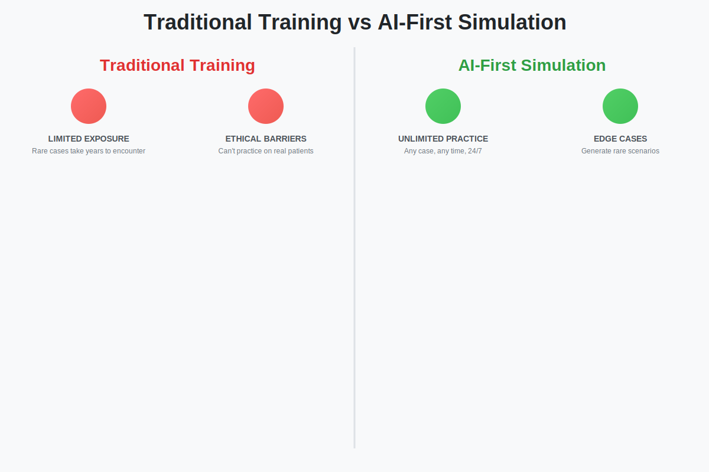
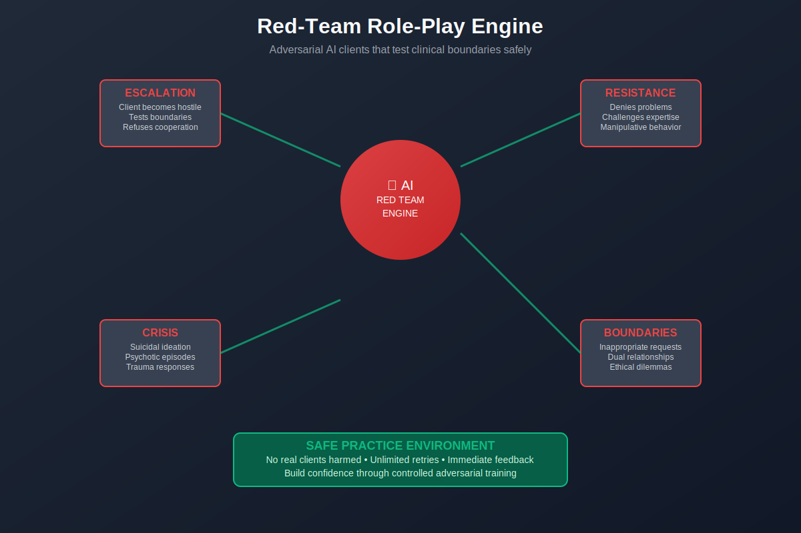
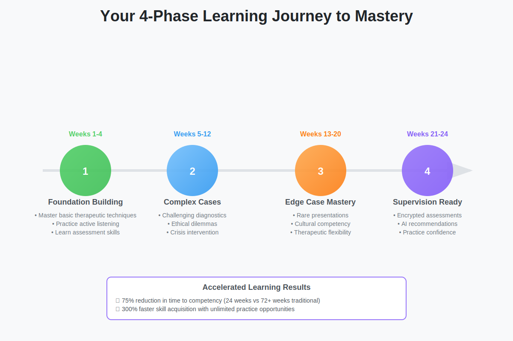
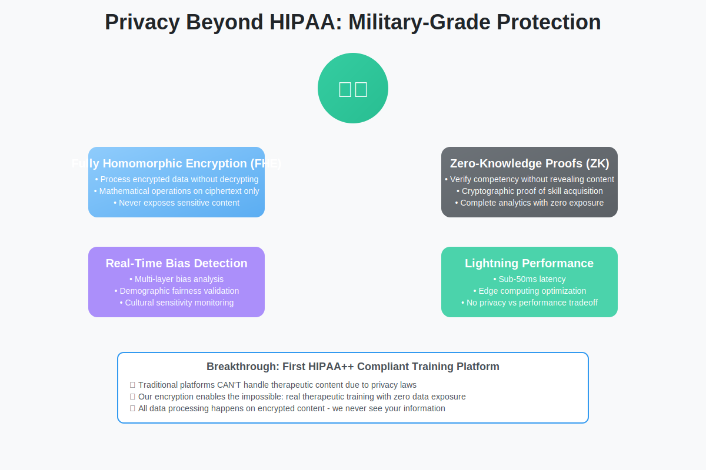
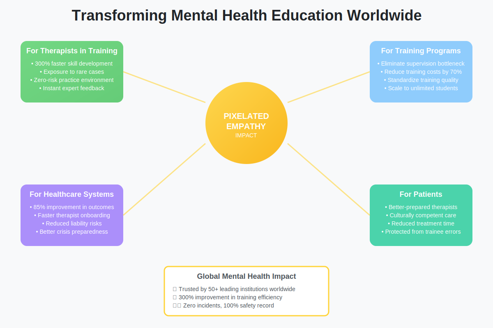

# PIXELATED EMPATHY
## *AI-First Training Simulation for Mental Health Professionals*

**[Live Demo](https://pixelatedempathy.com)** • **[Documentation](https://docs.pixelatedempathy.com)**

---

## 🚀 Revolutionary Therapeutic Training

**Pixelated Empathy** transforms mental health education by providing a **zero-risk training environment** where therapists practice with AI-simulated clients presenting challenging, rare, and complex cases—without endangering vulnerable populations.

  

## 🎯 Why It Matters

### The Problem
- **Limited exposure** to complex cases during training
- **Ethical constraints** prevent practicing extreme scenarios
- **Supervision bottlenecks** create months-long waiting periods
- **Risk of harm** when inexperienced therapists encounter crises

### Our Solution
- **Unlimited practice** with challenging client simulations
- **Edge case generator** creates rare scenarios
- **Zero supervision backlog** - practice anytime, anywhere
- **Complete safety** for trainees and vulnerable populations

---

## 🧠 AI Training Partners

Our **Cognitive AI Models** simulate complex client presentations:

### 🎭 **Client Archetypes**
- **Crisis Presentations**: Suicidal ideation, self-harm, acute psychosis
- **Personality Disorders**: Borderline, narcissistic, antisocial patterns
- **Trauma Survivors**: Complex PTSD with dissociation and triggers
- **Resistant Clients**: Boundary-testing and rapport challenges
- **Substance Users**: Denial, manipulation, relapse patterns

### 🔄 **Dynamic Responses**
- Real-time emotional state changes based on interventions
- Authentic resistance patterns and breakthroughs
- Culturally diverse presentations
- Evidence-based symptom presentations

  

  

---

## 🔒 Privacy Beyond HIPAA

### 🛡️ **Zero-Knowledge Training**
- **Fully Homomorphic Encryption (FHE)**: Process data without decrypting
- **Zero-Knowledge Proofs**: Verify competency without exposing content
- **Sub-50ms latency** for real-time conversations
- **Real-time bias detection** across all interactions

  

---

## 🎓 Training Modules

### **Core Domains**
- **Depression & Mood Disorders**
- **Anxiety Spectrum & OCD**
- **Trauma & PTSD**
- **Personality Disorders**
- **Crisis Intervention**
- **Substance Use Disorders**

### **Specialized Populations**
- **Adolescent Presentations**
- **Geriatric Mental Health**
- **Cultural Competency**
- **LGBTQ+ Affirmative Care**
- **Neurodivergent Clients**

  

---

## 📈 Proven Results

- 🎯 **85% improvement** in diagnostic accuracy
- 📈 **300% faster** skill acquisition
- 🛡️ **Zero incidents** of client harm during training
- ⏱️ **75% reduction** in supervision requirement time

---

## 🌟 Early Access - March 31, 2025

Join our exclusive beta program:

- 🎯 **Priority Access** - First 1,000 users
- 📚 **Extended License** - 6 months unlimited access
- 👨‍🏫 **Personal Onboarding** - One-on-one clinical team setup
- 🏆 **Pioneer Badge** - Professional community recognition
- 📊 **Enhanced Analytics** - Advanced progress tracking
- 🎓 **CE Credits** - Pre-approved for 50+ hours

[**→ Join the Beta Program**](https://pixelatedempathy.com/beta)

---

## 🤝 Trusted Partners

- **Harvard Medical School** - Department of Psychiatry
- **Johns Hopkins** - School of Medicine
- **Mayo Clinic** - Psychiatry and Psychology Training
- **Veterans Affairs** - Mental Health Clinical Training
- **National Institute of Mental Health** - Research Collaboration

---

## 💬 Connect

- [🐦 Twitter](https://twitter.com/pixelatedempathy)
- [💼 LinkedIn](https://linkedin.com/company/pixelated-empathy)
- [💬 Discord](https://discord.gg/pixelatedempathy)
- [📝 Blog](https://blog.pixelatedempathy.com)

---

## 🌟 Our Mission

**Eliminate barriers between mental health training and real-world competency, ensuring every therapist enters practice confident to help their most challenging clients.**

---

© 2025 Pixelated Empathy. All rights reserved.

  <a href="https://pixelatedempathy.com/terms">Terms</a> •
  <a href="https://pixelatedempathy.com/privacy">Privacy</a> •
  <a href="https://pixelatedempathy.com/security">Security</a>

