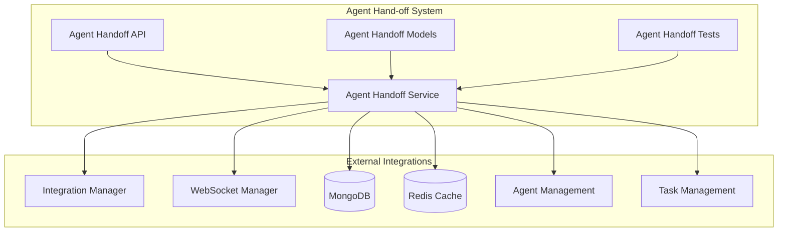
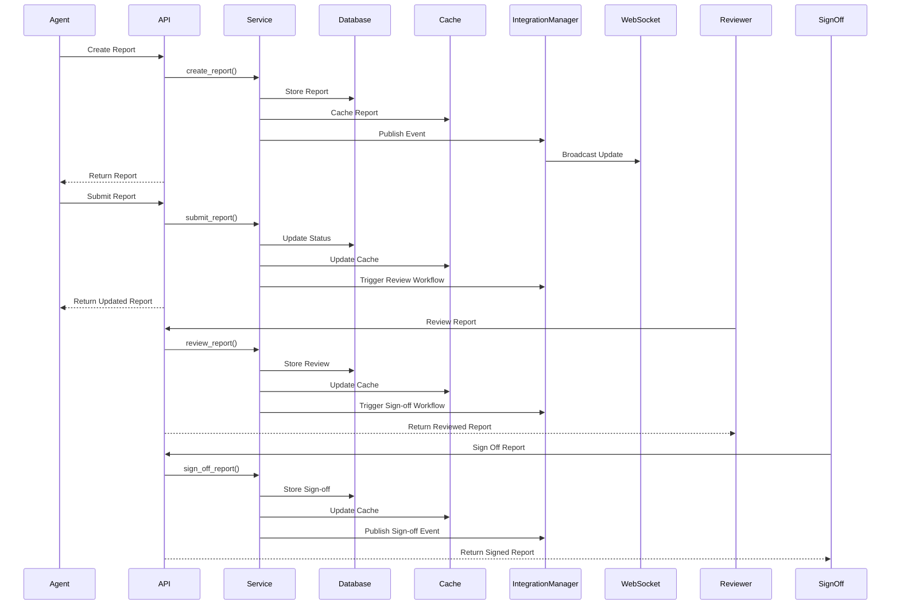

# Agent Hand-off System Documentation

## Overview

The Agent Hand-off System provides comprehensive report collection, Phase 6 MCP server component completion tracking, and sign-off workflows for the Pixelated platform. This system ensures seamless agent transitions, maintains audit trails, and tracks progress across all Phase 6 components including error handling, API contracts, retry mechanisms, circuit breakers, validation layers, monitoring hooks, security enhancements, and integration tests.

## Architecture

### System Components



### Data Flow



## Features

### 1. Report Management

- **Create Reports**: Agents can create comprehensive hand-off reports with work summaries, achievements, challenges, and technical details
- **Update Reports**: Real-time updates to report content, metrics, and component progress
- **Submit Reports**: Formal submission for review with validation of completeness and Phase 6 completion
- **Report Retrieval**: Fast access to reports with Redis caching and MongoDB persistence

### 2. Phase 6 Component Tracking

- **Component Progress**: Track completion of all 8 Phase 6 components:
  - Error Handling
  - API Contracts
  - Retry Mechanisms
  - Circuit Breaker
  - Validation Layer
  - Monitoring Hooks
  - Security Enhancements
  - Integration Tests
- **Progress Calculation**: Automatic calculation of overall Phase 6 progress based on individual component completion
- **Dependency Management**: Track component dependencies and blockers
- **Quality Metrics**: Integration with test results, code review status, and security review status

### 3. Review Workflow

- **Multi-stage Review**: Support for approved, rejected, and amendments-required statuses
- **Quality Scoring**: Assign quality scores to reports during review
- **Amendment Tracking**: Track required amendments and resubmission cycles
- **Review Comments**: Detailed feedback and improvement suggestions

### 4. Sign-off Workflow

- **Role-based Sign-offs**: Support for multiple sign-off roles:
  - Developer
  - Tech Lead
  - QA Engineer
  - Security Reviewer
  - Product Owner
  - Architect
- **Conditional Approvals**: Support for approvals with conditions
- **Expiration Management**: Configurable sign-off expiration periods
- **Completion Tracking**: Automatic tracking of sign-off completion status

### 5. Dashboard and Analytics

- **Real-time Statistics**: Live statistics on report counts, status distribution, and completion rates
- **Component Completion Rates**: Track completion rates for each Phase 6 component
- **Quality Metrics**: Average quality scores, test coverage, and performance benchmarks
- **Timeline Analytics**: Review times, approval times, and bottlenecks
- **Export Capabilities**: Export reports and analytics data

## API Endpoints

### Report Management

#### Create Report
```http
POST /api/v1/agent-handoff/reports
Content-Type: application/json

{
  "pipeline_id": "pipeline_123",
  "task_id": "task_456",
  "work_summary": "Detailed work summary...",
  "achievements": ["Achievement 1", "Achievement 2"],
  "challenges_encountered": ["Challenge 1"],
  "lessons_learned": ["Lesson 1"],
  "components_implemented": ["Component 1"],
  "apis_integrated": ["API 1"],
  "services_configured": ["Service 1"],
  "tests_written": ["Test 1"],
  "documentation_created": ["Doc 1"],
  "quality_score": 0.9,
  "test_coverage_percentage": 85.0
}
```

#### Get Report
```http
GET /api/v1/agent-handoff/reports/{report_id}
```

#### Update Report
```http
PUT /api/v1/agent-handoff/reports/{report_id}
Content-Type: application/json

{
  "work_summary": "Updated work summary...",
  "quality_score": 0.95,
  "test_coverage_percentage": 90.0
}
```

#### Submit Report
```http
POST /api/v1/agent-handoff/reports/{report_id}/submit
Content-Type: application/json

{
  "submission_notes": "Ready for review",
  "attachments": ["path/to/attachment1", "path/to/attachment2"]
}
```

### Review Workflow

#### Review Report
```http
POST /api/v1/agent-handoff/reports/{report_id}/review
Content-Type: application/json

{
  "review_status": "approved",
  "review_comments": "Excellent work! All requirements met.",
  "quality_score": 0.95
}
```

### Sign-off Workflow

#### Sign Off Report
```http
POST /api/v1/agent-handoff/reports/{report_id}/sign-off
Content-Type: application/json

{
  "sign_off_role": "developer",
  "status": "approved",
  "comments": "Code review passed",
  "conditions": ["Deploy during maintenance window"]
}
```

### Component Progress

#### Update Component Progress
```http
PUT /api/v1/agent-handoff/reports/{report_id}/components/{component_type}
Content-Type: application/json

{
  "status": "completed",
  "progress_percentage": 100.0,
  "completed_at": "2024-01-15T10:30:00Z",
  "notes": "Implementation completed successfully",
  "test_results": {"coverage": 95, "passed": 50, "failed": 0},
  "code_review_status": "approved",
  "security_review_status": "approved"
}
```

### Analytics and Dashboard

#### Get Dashboard Data
```http
GET /api/v1/agent-handoff/dashboard?force_refresh=false
```

#### Get Statistics
```http
GET /api/v1/agent-handoff/statistics
```

#### Get Component Status Summary
```http
GET /api/v1/agent-handoff/components/status
```

## Configuration

### Environment Variables

```bash
# Agent Hand-off Service Configuration
AGENT_HANDOFF_MAX_REPORT_SIZE_MB=10
AGENT_HANDOFF_REVIEW_TIMEOUT_DAYS=7
AGENT_HANDOFF_SIGN_OFF_EXPIRY_DAYS=30
AGENT_HANDOFF_AUTO_APPROVAL_THRESHOLD=0.9
AGENT_HANDOFF_ENABLE_NOTIFICATIONS=true
AGENT_HANDOFF_ENABLE_AUTO_VALIDATION=true

# Required sign-off roles (comma-separated)
AGENT_HANDOFF_REQUIRED_SIGN_OFFS=developer,tech_lead,qa_engineer
```

### Service Configuration

```python
@dataclass
class HandoffServiceConfig:
    max_report_size_mb: int = 10
    review_timeout_days: int = 7
    sign_off_expiry_days: int = 30
    auto_approval_threshold: float = 0.9
    required_sign_offs: List[str] = None
    enable_notifications: bool = True
    enable_auto_validation: bool = True
```

## Integration Guide

### 1. Service Integration

```python
from mcp_server.services.agent_handoff_service import AgentHandoffService
from mcp_server.config import MCPConfig

# Initialize service
config = MCPConfig()
handoff_service = AgentHandoffService(config, database, redis_client)
await handoff_service.initialize()

# Store in app state for API access
app.state.handoff_service = handoff_service
```

### 2. API Integration

```python
from mcp_server.api.agent_handoff import router

# Include router in FastAPI app
app.include_router(router)
```

### 3. Integration Manager Integration

```python
from mcp_server.services.integration_manager import IntegrationManager

# Register event handlers
integration_manager.register_event_handler(
    "handoff:report_created",
    handle_report_created
)
integration_manager.register_event_handler(
    "handoff:report_submitted",
    handle_report_submitted
)
```

### 4. WebSocket Integration

```python
from mcp_server.services.websocket_manager import WebSocketManager

# Register WebSocket event handlers
websocket_manager.register_event_handler(
    "handoff:report_updated",
    handle_report_updated
)
```

## Data Models

### Core Models

- **AgentHandoffReport**: Main report model with comprehensive tracking
- **Phase6ComponentProgress**: Individual component progress tracking
- **SignOffRecord**: Sign-off transaction records
- **HandoffReportMetrics**: Performance and quality metrics

### Status Enums

- **HandoffReportStatus**: DRAFT, SUBMITTED, UNDER_REVIEW, APPROVED, REJECTED, AMENDMENTS_REQUIRED
- **Phase6ComponentStatus**: NOT_STARTED, IN_PROGRESS, COMPLETED, BLOCKED, FAILED, VERIFIED
- **ComponentType**: ERROR_HANDLING, API_CONTRACTS, RETRY_MECHANISMS, CIRCUIT_BREAKER, VALIDATION_LAYER, MONITORING_HOOKS, SECURITY_ENHANCEMENTS, INTEGRATION_TESTS
- **SignOffRole**: DEVELOPER, TECH_LEAD, QA_ENGINEER, SECURITY_REVIEWER, PRODUCT_OWNER, ARCHITECT

## Security Considerations

### Authentication and Authorization

- All endpoints require authenticated agents
- Role-based access control for reviews and sign-offs
- Agent ownership validation for report modifications
- Admin role for cross-agent report access

### Data Protection

- Sensitive data exclusion from API responses
- API key hashing for secure storage
- Audit logging for all report operations
- HIPAA-compliant data handling

### Input Validation

- Comprehensive input validation using Pydantic models
- File size limits for attachments
- Content sanitization for user inputs
- SQL injection prevention through parameterized queries

## Performance Optimization

### Caching Strategy

- Redis caching for frequently accessed reports
- Dashboard data caching with 5-minute TTL
- Statistics caching with configurable refresh intervals
- Cache invalidation on report updates

### Database Optimization

- Indexed queries for fast report retrieval
- Aggregation pipelines for statistics calculation
- Connection pooling for database operations
- Batch operations for bulk updates

### Monitoring and Alerting

- Health check endpoints for service monitoring
- Performance metrics collection
- Error rate monitoring and alerting
- Review timeout and escalation tracking

## Testing

### Unit Tests

- Comprehensive test coverage for all service methods
- Mock-based testing for external dependencies
- Validation testing for all input scenarios
- Error handling and edge case testing

### Integration Tests

- End-to-end workflow testing
- Database integration testing
- Redis caching integration testing
- API endpoint integration testing

### Load Testing

- Concurrent report creation testing
- Dashboard performance under load
- Statistics calculation performance
- Cache performance under high load

## Deployment

### Docker Configuration

```dockerfile
# Multi-stage build for optimized deployment
FROM python:3.11-slim as builder
# Install dependencies and build application

FROM python:3.11-slim as runtime
# Copy built application and configure runtime
```

### Kubernetes Deployment

```yaml
apiVersion: apps/v1
kind: Deployment
metadata:
  name: agent-handoff-service
spec:
  replicas: 3
  template:
    spec:
      containers:
      - name: agent-handoff
        image: pixelated/agent-handoff:latest
        env:
        - name: MONGODB_URI
          valueFrom: { secretKeyRef: { name: mongodb-secret, key: uri } }
        - name: REDIS_URL
          valueFrom: { secretKeyRef: { name: redis-secret, key: url } }
```

### Health Checks

```yaml
livenessProbe:
  httpGet:
    path: /api/v1/agent-handoff/health
    port: 8000
  initialDelaySeconds: 30
  periodSeconds: 10

readinessProbe:
  httpGet:
    path: /api/v1/agent-handoff/health
    port: 8000
  initialDelaySeconds: 5
  periodSeconds: 5
```

## Troubleshooting

### Common Issues

1. **Report Creation Fails**
   - Check agent authentication and permissions
   - Validate pipeline and task existence
   - Verify work summary minimum length requirement

2. **Report Submission Fails**
   - Ensure all Phase 6 components are completed
   - Check report completeness validation
   - Verify agent ownership

3. **Review Workflow Issues**
   - Check report status (must be UNDER_REVIEW)
   - Validate reviewer permissions
   - Ensure review comments meet minimum length

4. **Sign-off Issues**
   - Verify sign-off role requirements
   - Check report approval status
   - Validate sign-off permissions

### Debug Mode

Enable debug logging:
```python
import logging
logging.basicConfig(level=logging.DEBUG)
```

### Performance Issues

- Check Redis connection and cache hit rates
- Monitor database query performance
- Review aggregation pipeline efficiency
- Analyze WebSocket connection health

## Future Enhancements

### Planned Features

1. **Advanced Analytics**
   - Machine learning-based quality prediction
   - Automated report summarization
   - Trend analysis and forecasting
   - Comparative performance metrics

2. **Enhanced Integration**
   - Slack/Teams notifications
   - Email workflow integration
   - Calendar integration for deadlines
   - Project management tool integration

3. **Mobile Support**
   - Mobile-optimized dashboard
   - Push notifications
   - Offline report editing
   - Mobile app development

4. **Advanced Security**
   - Multi-factor authentication
   - Digital signatures
   - Blockchain-based audit trails
   - Advanced encryption options

### API Versioning

- Semantic versioning for API endpoints
- Backward compatibility maintenance
- Deprecation notices and migration guides
- Version-specific documentation

## Support

For technical support and questions:
- Review this documentation
- Check the troubleshooting section
- Run health checks and diagnostics
- Contact the development team
- Submit issues through the project repository

## License

This system is part of the Pixelated platform and follows the same licensing terms. See the main project documentation for license details.