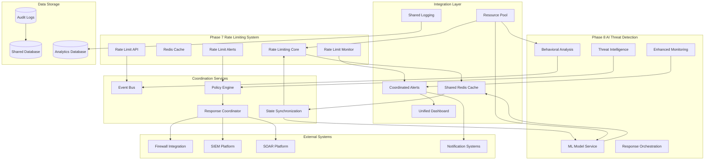

# Phase 8: Phase 7 Integration Architecture

## 🎯 Overview

The Phase 7 Integration Architecture provides seamless integration between the new Phase 8 AI Threat Detection system and the existing Phase 7 rate limiting infrastructure. This architecture ensures coordinated threat response, shared monitoring capabilities, unified alerting, and efficient resource utilization while maintaining backward compatibility and system stability.

## 🏗️ Integration Architecture Overview

### Phase 7 & 8 Integration Architecture



## 🔗 Core Integration Components

### 1. Shared Redis Cache Integration

#### Coordinated Rate Limiting and Threat Detection

```typescript
// shared_redis_integration.ts
interface SharedRedisIntegration {
  // Share rate limiting data
  shareRateLimitData(data: RateLimitData): Promise<SharingResult>
  
  // Share threat intelligence
  shareThreatIntelligence(intel: ThreatIntelligence): Promise<SharingResult>
  
  // Coordinate responses
  coordinateResponse(response: CoordinatedResponse): Promise<CoordinationResult>
  
  // Synchronize state
  synchronizeState(state: SystemState): Promise<SynchronizationResult>
  
  // Manage shared resources
  manageSharedResources(resources: SharedResources): Promise<ResourceManagementResult>
}

interface SharedCacheConfig {
  redis: {
    primary: RedisConfig
    secondary: RedisConfig
    sentinel: SentinelConfig
  }
  sharing: {
    ttl: number
    encryption: boolean
    compression: boolean
    partitioning: boolean
  }
  coordination: {
    lockTimeout: number
    syncInterval: number
    conflictResolution: ConflictResolutionStrategy
  }
}

class AdvancedSharedRedisIntegration implements SharedRedisIntegration {
  private redisManager: RedisClusterManager
  private sharingEngine: DataSharingEngine
  private coordinationService: CoordinationService
  private stateSynchronizer: StateSynchronizer
  private resourceManager: SharedResourceManager
  
  constructor(config: SharedCacheConfig) {
    this.redisManager = new RedisClusterManager(config.redis)
    this.sharingEngine = new DataSharingEngine(config.sharing)
    this.coordinationService = new CoordinationService(config.coordination)
    this.stateSynchronizer = new StateSynchronizer(config.coordination)
    this.resourceManager = new SharedResourceManager(config.coordination)
  }
  
  async shareRateLimitData(data: RateLimitData): Promise<SharingResult> {
    try {
      // Validate data format
      const validation = await this.validateRateLimitData(data)
      if (!validation.isValid) {
        throw new Error(`Invalid rate limit data: ${validation.errors.join(', ')}`)
      }
      
      // Encrypt sensitive data
      const encryptedData = await this.sharingEngine.encryptData(data)
      
      // Compress large datasets
      const compressedData = await this.sharingEngine.compressData(encryptedData)
      
      // Partition data by user/service
      const partitions = await this.sharingEngine.partitionData(compressedData)
      
      // Store in shared cache with appropriate TTL
      const storageResults = await Promise.all(
        partitions.map(partition => 
          this.redisManager.storeSharedData(
            `rate_limit:${partition.key}`,
            partition.data,
            { ttl: partition.ttl || 3600 }
          )
        )
      )
      
      // Notify other services of new data
      await this.coordinationService.notifyDataUpdate('rate_limit', {
        keys: partitions.map(p => p.key),
        timestamp: new Date(),
        source: 'rate_limiting_service'
      })
      
      return {
        sharingId: this.generateSharingId(),
        partitionsStored: storageResults.length,
        totalSize: partitions.reduce((sum, p) => sum + p.size, 0),
        encryptionUsed: true,
        compressionUsed: true,
        timestamp: new Date()
      }
      
    } catch (error) {
      throw new Error(`Rate limit data sharing failed: ${error.message}`)
    }
  }
  
  async coordinateResponse(response: CoordinatedResponse): Promise<CoordinationResult> {
    try {
      // Acquire distributed lock
      const lock = await this.coordinationService.acquireLock(
        `response_coordination:${response.threatId}`,
        { timeout: 30000 }
      )
      
      try {
        // Check for conflicting responses
        const existingResponses = await this.getExistingResponses(response.threatId)
        const conflicts = await this.detectConflicts(response, existingResponses)
        
        if (conflicts.length > 0) {
          // Resolve conflicts using configured strategy
          const resolution = await this.resolveConflicts(conflicts, response)
          if (!resolution.approved) {
            return {
              coordinationId: this.generateCoordinationId(),
              status: 'REJECTED',
              reason: 'Conflict resolution failed',
              conflicts: conflicts,
              timestamp: new Date()
            }
          }
        }
        
        // Store coordinated response
        await this.storeCoordinatedResponse(response)
        
        // Execute coordinated actions
        const executionResults = await this.executeCoordinatedActions(response)
        
        // Update shared state
        await this.stateSynchronizer.updateSharedState({
          threatId: response.threatId,
          responseId: response.responseId,
          actions: executionResults,
          timestamp: new Date()
        })
        
        return {
          coordinationId: this.generateCoordinationId(),
          status: 'SUCCESS',
          actionsExecuted: executionResults.length,
          conflictsResolved: conflicts.length,
          executionResults: executionResults,
          timestamp: new Date()
        }
        
      } finally {
        // Release lock
        await this.coordinationService.releaseLock(lock)
      }
      
    } catch (error) {
      throw new Error(`Response coordination failed: ${error.message}`)
    }
  }
  
  private async detectConflicts(newResponse: CoordinatedResponse, existingResponses: CoordinatedResponse[]): Promise<Conflict[]> {
    const conflicts: Conflict[] = []
    
    for (const existing of existingResponses) {
      // Check for action conflicts
      for (const newAction of newResponse.actions) {
        for (const existingAction of existing.actions) {
          if (this.actionsConflict(newAction, existingAction)) {
            conflicts.push({
              type: 'ACTION_CONFLICT',
              details: {
                newAction: newAction,
                existingAction: existingAction,
                existingResponseId: existing.responseId
              },
              severity: this.calculateConflictSeverity(newAction, existingAction)
            })
          }
        }
      }
      
      // Check for timing conflicts
      if (this.responsesOverlapInTime(newResponse, existing)) {
        conflicts.push({
          type: 'TIMING_CONFLICT',
          details: {
            newResponseTime: newResponse.timestamp,
            existingResponseTime: existing.timestamp,
            overlapDuration: this.calculateOverlapDuration(newResponse, existing)
          },
          severity: 'MEDIUM'
        })
      }
    }
    
    return conflicts
  }
  
  private actionsConflict(action1: ResponseAction, action2: ResponseAction): boolean {
    // Check if actions target the same resource
    if (action1.target !== action2.target) {
      return false
    }
    
    // Check if actions are mutually exclusive
    const mutuallyExclusiveActions = [
      ['BLOCK_IP', 'ALLOW_IP'],
      ['RATE_LIMIT', 'UNLIMIT'],
      ['QUARANTINE', 'RELEASE']
    ]
    
    for (const [actionA, actionB] of mutuallyExclusiveActions) {
      if (
        (action1.type === actionA && action2.type === actionB) ||
        (action1.type === actionB && action2.type === actionA)
      ) {
        return true
      }
    }
    
    return false
  }
}
```

### 2. Unified Alerting System

#### Coordinated Alert Management

```typescript
// unified_alerting_system.ts
interface UnifiedAlertingSystem {
  // Process rate limit alerts
  processRateLimitAlert(alert: RateLimitAlert): Promise<AlertProcessingResult>
  
  // Process threat detection alerts
  processThreatAlert(alert: ThreatAlert): Promise<AlertProcessingResult>
  
  // Correlate alerts
  correlateAlerts(alerts: Alert[]): Promise<AlertCorrelationResult>
  
  // Manage alert lifecycle
  manageAlertLifecycle(alert: Alert, action: AlertAction): Promise<AlertLifecycleResult>
  
  // Generate unified notifications
  generateUnifiedNotification(correlation: AlertCorrelation): Promise<NotificationResult>
}

interface AlertCorrelationConfig {
  correlation: {
    timeWindow: number
    similarityThreshold: number
    severityWeight: number
    sourceWeight: number
  }
  deduplication: {
    enabled: boolean
    timeWindow: number
    similarityThreshold: number
  }
  escalation: {
    enabled: boolean
    thresholds: EscalationThreshold[]
    notificationChannels: NotificationChannel[]
  }
}

class AdvancedUnifiedAlertingSystem implements UnifiedAlertingSystem {
  private alertProcessor: AlertProcessor
  private correlationEngine: AlertCorrelationEngine
  private lifecycleManager: AlertLifecycleManager
  private notificationService: UnifiedNotificationService
  private escalationEngine: EscalationEngine
  
  constructor(config: AlertCorrelationConfig) {
    this.alertProcessor = new AlertProcessor()
    this.correlationEngine = new AlertCorrelationEngine(config.correlation)
    this.lifecycleManager = new AlertLifecycleManager()
    this.notificationService = new UnifiedNotificationService()
    this.escalationEngine = new EscalationEngine(config.escalation)
  }
  
  async processRateLimitAlert(alert: RateLimitAlert): Promise<AlertProcessingResult> {
    try {
      // Validate alert format
      const validation = await this.validateRateLimitAlert(alert)
      if (!validation.isValid) {
        throw new Error(`Invalid rate limit alert: ${validation.errors.join(', ')}`)
      }
      
      // Enrich alert with additional context
      const enrichedAlert = await this.enrichRateLimitAlert(alert)
      
      // Check for similar alerts
      const similarAlerts = await this.findSimilarAlerts(enrichedAlert)
      
      // Apply deduplication
      if (similarAlerts.length > 0) {
        const deduplication = await this.applyDeduplication(enrichedAlert, similarAlerts)
        if (deduplication.isDuplicate) {
          return {
            processingId: this.generateProcessingId(),
            status: 'DUPLICATE',
            reason: 'Similar alert already exists',
            existingAlertId: deduplication.existingAlertId,
            timestamp: new Date()
          }
        }
      }
      
      // Store alert
      const storedAlert = await this.storeAlert(enrichedAlert)
      
      // Check for correlations
      const correlations = await this.correlationEngine.findCorrelations(storedAlert)
      
      // Process correlations
      if (correlations.length > 0) {
        const correlationResult = await this.processCorrelations(correlations, storedAlert)
        return {
          processingId: this.generateProcessingId(),
          status: 'CORRELATED',
          alertId: storedAlert.alertId,
          correlations: correlations.length,
          correlationResult: correlationResult,
          timestamp: new Date()
        }
      }
      
      // Check for escalation
      const escalation = await this.escalationEngine.checkEscalation(storedAlert)
      if (escalation.required) {
        await this.escalationEngine.executeEscalation(storedAlert, escalation)
      }
      
      return {
        processingId: this.generateProcessingId(),
        status: 'PROCESSED',
        alertId: storedAlert.alertId,
        correlations: 0,
        escalation: escalation.required,
        timestamp: new Date()
      }
      
    } catch (error) {
      throw new Error(`Rate limit alert processing failed: ${error.message}`)
    }
  }
  
  async correlateAlerts(alerts: Alert[]): Promise<AlertCorrelationResult> {
    try {
      // Group alerts by time window
      const timeGroups = await this.groupAlertsByTimeWindow(alerts)
      
      const correlations: AlertCorrelation[] = []
      
      for (const [timeWindow, windowAlerts] of Object.entries(timeGroups)) {
        // Find correlations within time window
        const windowCorrelations = await this.correlationEngine.correlateAlerts(windowAlerts)
        
        for (const correlation of windowCorrelations) {
          // Calculate correlation confidence
          const confidence = await this.calculateCorrelationConfidence(correlation)
          
          // Generate correlation summary
          const summary = await this.generateCorrelationSummary(correlation)
          
          // Determine response actions
          const actions = await this.determineCorrelationActions(correlation)
          
          correlations.push({
            correlationId: this.generateCorrelationId(),
            alerts: correlation.alerts,
            confidence: confidence,
            summary: summary,
            recommendedActions: actions,
            severity: this.calculateOverallSeverity(correlation.alerts),
            timestamp: new Date()
          })
        }
      }
      
      // Merge overlapping correlations
      const mergedCorrelations = await this.mergeOverlappingCorrelations(correlations)
      
      // Generate unified notifications
      const notifications = await Promise.all(
        mergedCorrelations.map(correlation => 
          this.generateUnifiedNotification(correlation)
        )
      )
      
      return {
        correlationId: this.generateCorrelationId(),
        totalAlerts: alerts.length,
        correlationsFound: mergedCorrelations.length,
        correlations: mergedCorrelations,
        notifications: notifications,
        timestamp: new Date()
      }
      
    } catch (error) {
      throw new Error(`Alert correlation failed: ${error.message}`)
    }
  }
  
  private async calculateCorrelationConfidence(correlation: AlertCorrelation): Promise<number> {
    let confidence = 0
    
    // Time-based correlation
    const timeCorrelation = this.calculateTimeCorrelation(correlation.alerts)
    confidence += timeCorrelation * 0.3
    
    // Source-based correlation
    const sourceCorrelation = this.calculateSourceCorrelation(correlation.alerts)
    confidence += sourceCorrelation * 0.2
    
    // Severity-based correlation
    const severityCorrelation = this.calculateSeverityCorrelation(correlation.alerts)
    confidence += severityCorrelation * 0.2
    
    // Content-based correlation
    const contentCorrelation = await this.calculateContentCorrelation(correlation.alerts)
    confidence += contentCorrelation * 0.3
    
    return Math.min(confidence, 1.0)
  }
  
  private async calculateContentCorrelation(alerts: Alert[]): Promise<number> {
    // Extract common entities
    const entities = await this.extractEntities(alerts)
    
    // Calculate entity overlap
    const entityOverlap = this.calculateEntityOverlap(entities)
    
    // Extract common patterns
    const patterns = await this.extractPatterns(alerts)
    
    // Calculate pattern similarity
    const patternSimilarity = this.calculatePatternSimilarity(patterns)
    
    // Combine scores
    return (entityOverlap * 0.6) + (patternSimilarity * 0.4)
  }
  
  private async generateCorrelationSummary(correlation: AlertCorrelation): Promise<CorrelationSummary> {
    // Analyze alert patterns
    const patterns = await this.analyzeAlertPatterns(correlation.alerts)
    
    // Identify common entities
    const entities = await this.identifyCommonEntities(correlation.alerts)
    
    // Determine root cause
    const rootCause = await this.determineRootCause(correlation.alerts)
    
    // Assess impact
    const impact = await this.assessImpact(correlation.alerts)
    
    return {
      title: this.generateSummaryTitle(patterns, entities),
      description: this.generateSummaryDescription(patterns, rootCause),
      affectedEntities: entities,
      rootCause: rootCause,
      impact: impact,
      recommendedActions: this.generateRecommendedActions(patterns, rootCause),
      confidence: correlation.confidence
    }
  }
}
```

### 3. Unified Dashboard Integration

#### Coordinated Monitoring and Visualization

```typescript
// unified_dashboard_integration.ts
interface UnifiedDashboardIntegration {
  // Aggregate metrics from both systems
  aggregateMetrics(metrics: SystemMetrics[]): Promise<AggregatedMetrics>
  
  // Create unified visualizations
  createUnifiedVisualizations(data: AggregatedData): Promise<Visualization[]>
  
  // Provide cross-system insights
  provideCrossSystemInsights(data: CrossSystemData): Promise<SystemInsights>
  
  // Manage dashboard state
  manageDashboardState(state: DashboardState): Promise<StateManagementResult>
  
  // Generate unified reports
  generateUnifiedReports(config: ReportConfig): Promise<Report[]>
}

interface DashboardIntegrationConfig {
  dataSources: {
    rateLimiting: DataSourceConfig
    threatDetection: DataSourceConfig
    sharedMetrics: DataSourceConfig
  }
  visualization: {
    enabled: boolean
    refreshInterval: number
    chartTypes: ChartType[]
    customization: CustomizationOptions
  }
  insights: {
    correlationAnalysis: boolean
    trendAnalysis: boolean
    anomalyDetection: boolean
    predictiveAnalysis: boolean
  }
  reporting: {
    enabled: boolean
    formats: ReportFormat[]
    schedule: ReportSchedule
    distribution: DistributionConfig
  }
}

class AdvancedUnifiedDashboardIntegration implements UnifiedDashboardIntegration {
  private dataAggregator: MetricsAggregator
  private visualizationEngine: VisualizationEngine
  private insightsGenerator: InsightsGenerator
  private stateManager: DashboardStateManager
  private reportGenerator: UnifiedReportGenerator
  
  constructor(config: DashboardIntegrationConfig) {
    this.dataAggregator = new MetricsAggregator(config.dataSources)
    this.visualizationEngine = new VisualizationEngine(config.visualization)
    this.insightsGenerator = new InsightsGenerator(config.insights)
    this.stateManager = new DashboardStateManager()
    this.reportGenerator = new UnifiedReportGenerator(config.reporting)
  }
  
  async aggregateMetrics(metrics: SystemMetrics[]): Promise<AggregatedMetrics> {
    try {
      // Validate metrics format
      const validation = await this.validateMetrics(metrics)
      if (!validation.isValid) {
        throw new Error(`Invalid metrics: ${validation.errors.join(', ')}`)
      }
      
      // Normalize metrics from different sources
      const normalizedMetrics = await this.normalizeMetrics(metrics)
      
      // Correlate metrics across systems
      const correlatedMetrics = await this.correlateMetrics(normalizedMetrics)
      
      // Calculate derived metrics
      const derivedMetrics = await this.calculateDerivedMetrics(correlatedMetrics)
      
      // Apply time-based aggregation
      const timeAggregated = await this.aggregateByTime(derivedMetrics)
      
      // Apply system-based aggregation
      const systemAggregated = await this.aggregateBySystem(timeAggregated)
      
      // Generate summary statistics
      const summary = await this.generateSummaryStatistics(systemAggregated)
      
      return {
        aggregationId: this.generateAggregationId(),
        timestamp: new Date(),
        sources: metrics.length,
        dataPoints: this.countDataPoints(systemAggregated),
        correlatedMetrics: correlatedMetrics.length,
        derivedMetrics: derivedMetrics.length,
        summary: summary,
        data: systemAggregated
      }
      
    } catch (error) {
      throw new Error(`Metrics aggregation failed: ${error.message}`)
    }
  }
  
  async createUnifiedVisualizations(data: AggregatedData): Promise<Visualization[]> {
    const visualizations: Visualization[] = []
    
    try {
      // Create overview dashboard
      const overviewViz = await this.visualizationEngine.createOverviewVisualization(data)
      visualizations.push(overviewViz)
      
      // Create rate limiting performance visualization
      const rateLimitViz = await this.visualizationEngine.createRateLimitVisualization(data)
      visualizations.push(rateLimitViz)
      
      // Create threat detection performance visualization
      const threatViz = await this.visualizationEngine.createThreatVisualization(data)
      visualizations.push(threatViz)
      
      // Create correlation visualization
      const correlationViz = await this.visualizationEngine.createCorrelationVisualization(data)
      visualizations.push(correlationViz)
      
      // Create system health visualization
      const healthViz = await this.visualizationEngine.createHealthVisualization(data)
      visualizations.push(healthViz)
      
      // Create trend analysis visualization
      const trendViz = await this.visualizationEngine.createTrendVisualization(data)
      visualizations.push(trendViz)
      
      // Create anomaly detection visualization
      const anomalyViz = await this.visualizationEngine.createAnomalyVisualization(data)
      visualizations.push(anomalyViz)
      
      // Create predictive analysis visualization
      const predictiveViz = await this.visualizationEngine.createPredictiveVisualization(data)
      visualizations.push(predictiveViz)
      
      return visualizations
      
    } catch (error) {
      throw new Error(`Visualization creation failed: ${error.message}`)
    }
  }
  
  async provideCrossSystemInsights(data: CrossSystemData): Promise<SystemInsights> {
    try {
      // Analyze system interactions
      const interactions = await this.analyzeSystemInteractions(data)
      
      // Identify performance bottlenecks
      const bottlenecks = await this.identifyBottlenecks(data)
      
      // Detect anomalies across systems
      const anomalies = await this.detectCrossSystemAnomalies(data)
      
      // Analyze resource utilization patterns
      const resourcePatterns = await this.analyzeResourcePatterns(data)
      
      // Generate optimization recommendations
      const optimizations = await this.generateOptimizationRecommendations({
        interactions,
        bottlenecks,
        anomalies,
        resourcePatterns
      })
      
      // Predict future trends
      const predictions = await this.predictFutureTrends(data)
      
      // Assess system health
      const healthAssessment = await this.assessSystemHealth(data)
      
      return {
        insightsId: this.generateInsightsId(),
        timestamp: new Date(),
        interactions: interactions,
        bottlenecks: bottlenecks,
        anomalies: anomalies,
        resourcePatterns: resourcePatterns,
        optimizations: optimizations,
        predictions: predictions,
        healthAssessment: healthAssessment,
        confidence: this.calculateInsightsConfidence(data)
      }
      
    } catch (error) {
      throw new Error(`Cross-system insights generation failed: ${error.message}`)
    }
  }
  
  private async analyzeSystemInteractions(data: CrossSystemData): Promise<SystemInteraction[]> {
    const interactions: SystemInteraction[] = []
    
    // Analyze API calls between systems
    const apiInteractions = await this.analyzeAPIInteractions(data)
    interactions.push(...apiInteractions)
    
    // Analyze shared resource usage
    const resourceInteractions = await this.analyzeResourceInteractions(data)
    interactions.push(...resourceInteractions)
    
    // Analyze data flow patterns
    const dataFlowInteractions = await this.analyzeDataFlowInteractions(data)
    interactions.push(...dataFlowInteractions)
    
    // Analyze timing dependencies
    const timingInteractions = await this.analyzeTimingInteractions(data)
    interactions.push(...timingInteractions)
    
    return interactions
  }
  
  private async identifyBottlenecks(data: CrossSystemData): Promise<PerformanceBottleneck[]> {
    const bottlenecks: PerformanceBottleneck[] = []
    
    // Analyze response times
    const responseTimeBottlenecks = await this.identifyResponseTimeBottlenecks(data)
    bottlenecks.push(...responseTimeBottlenecks)
    
    // Analyze throughput limitations
    const throughputBottlenecks = await this.identifyThroughputBottlenecks(data)
    bottlenecks.push(...throughputBottlenecks)
    
    // Analyze resource constraints
    const resourceBottlenecks = await this.identifyResourceBottlenecks(data)
    bottlenecks.push(...resourceBottlenecks)
    
    // Analyze queue backlogs
    const queueBottlenecks = await this.identifyQueueBottlenecks(data)
    bottlenecks.push(...queueBottlenecks)
    
    return bottlenecks
  }
  
  private async generateOptimizationRecommendations(analysis: CrossSystemAnalysis): Promise<OptimizationRecommendation[]> {
    const recommendations: OptimizationRecommendation[] = []
    
    // Resource optimization recommendations
    const resourceRecommendations = await this.generateResourceRecommendations(analysis.resourcePatterns)
    recommendations.push(...resourceRecommendations)
    
    // Performance optimization recommendations
    const performanceRecommendations = await this.generatePerformanceRecommendations(analysis.bottlenecks)
    recommendations.push(...performanceRecommendations)
    
    // Scaling optimization recommendations
    const scalingRecommendations = await this.generateScalingRecommendations(analysis.interactions)
    recommendations.push(...scalingRecommendations)
    
    // Cost optimization recommendations
    const costRecommendations = await this.generateCostRecommendations(analysis)
    recommendations.push(...costRecommendations)
    
    // Security optimization recommendations
    const securityRecommendations = await this.generateSecurityRecommendations(analysis)
    recommendations.push(...securityRecommendations)
    
    return recommendations.sort((a, b) => b.impact - a.impact)
  }
}
```

### 4. Resource Pool Management

#### Shared Resource Optimization

```typescript
// resource_pool_management.ts
interface ResourcePoolManagement {
  // Allocate shared resources
  allocateResources(request: ResourceRequest): Promise<ResourceAllocation>
  
  // Monitor resource usage
  monitorResourceUsage(): Promise<ResourceUsageMetrics>
  
  // Optimize resource allocation
  optimizeAllocation(): Promise<OptimizationResult>
  
  // Handle resource conflicts
  handleResourceConflicts(conflicts: ResourceConflict[]): Promise<ConflictResolution>
  
  // Scale shared resources
  scaleResources(scaling: ScalingRequest): Promise<ScalingResult>
}

interface ResourcePoolConfig {
  pools: {
    compute: ComputePoolConfig
    memory: MemoryPoolConfig
    storage: StoragePoolConfig
    network: NetworkPoolConfig
  }
  allocation: {
    strategy: AllocationStrategy
    priority: PriorityConfig
    limits: ResourceLimits
  }
  monitoring: {
    enabled: boolean
    interval: number
    thresholds: MonitoringThresholds
  }
  optimization: {
    enabled: boolean
    interval: number
    algorithms: OptimizationAlgorithm[]
  }
}

class AdvancedResourcePoolManagement implements ResourcePoolManagement {
  private computePool: ComputeResourcePool
  private memoryPool: MemoryResourcePool
  private storagePool: StorageResourcePool
  private networkPool: NetworkResourcePool
  private allocationEngine: ResourceAllocationEngine
  private monitoringService: ResourceMonitoringService
  private optimizationEngine: ResourceOptimizationEngine
  private conflictResolver: ResourceConflictResolver
  
  constructor(config: ResourcePoolConfig) {
    this.computePool = new ComputeResourcePool(config.pools.compute)
    this.memoryPool = new MemoryResourcePool(config.pools.memory)
    this.storagePool = new StorageResourcePool(config.pools.storage)
    this.networkPool = new NetworkResourcePool(config.pools.network)
    this.allocationEngine = new ResourceAllocationEngine(config.allocation)
    this.monitoringService = new ResourceMonitoringService(config.monitoring)
    this.optimizationEngine = new ResourceOptimizationEngine(config.optimization)
    this.conflictResolver = new ResourceConflictResolver()
  }
  
  async allocateResources(request: ResourceRequest): Promise<ResourceAllocation> {
    try {
      // Validate request
      const validation = await this.validateResourceRequest(request)
      if (!validation.isValid) {
        throw new Error(`Invalid resource request: ${validation.errors.join(', ')}`)
      }
      
      // Check resource availability
      const availability = await this.checkResourceAvailability(request)
      if (!availability.isAvailable) {
        // Try to free up resources
        const freedResources = await this.freeUpResources(request)
        if (!freedResources.sufficient) {
          return {
            allocationId: this.generateAllocationId(),
            status: 'INSUFFICIENT_RESOURCES',
            reason: 'Not enough resources available',
            requested: request,
            available: availability.available,
            timestamp: new Date()
          }
        }
      }
      
      // Allocate resources from appropriate pools
      const allocations: ResourceAllocation[] = []
      
      if (request.compute) {
        const computeAllocation = await this.computePool.allocate(request.compute)
        allocations.push(computeAllocation)
      }
      
      if (request.memory) {
        const memoryAllocation = await this.memoryPool.allocate(request.memory)
        allocations.push(memoryAllocation)
      }
      
      if (request.storage) {
        const storageAllocation = await this.storagePool.allocate(request.storage)
        allocations.push(storageAllocation)
      }
      
      if (request.network) {
        const networkAllocation = await this.networkPool.allocate(request.network)
        allocations.push(networkAllocation)
      }
      
      // Register allocation
      const registration = await this.registerAllocation({
        request: request,
        allocations: allocations,
        priority: request.priority || 'NORMAL'
      })
      
      // Start monitoring
      await this.monitoringService.startMonitoring(registration.allocationId)
      
      return {
        allocationId: registration.allocationId,
        status: 'SUCCESS',
        allocations: allocations,
        totalCost: this.calculateTotalCost(allocations),
        monitoringEnabled: true,
        timestamp: new Date()
      }
      
    } catch (error) {
      throw new Error(`Resource allocation failed: ${error.message}`)
    }
  }
  
  async optimizeAllocation(): Promise<OptimizationResult> {
    try {
      // Get current usage metrics
      const usageMetrics = await this.monitoringService.getUsageMetrics()
      
      // Analyze usage patterns
      const usagePatterns = await this.analyzeUsagePatterns(usageMetrics)
      
      // Identify optimization opportunities
      const opportunities = await this.identifyOptimizationOpportunities(usagePatterns)
      
      // Generate optimization recommendations
      const recommendations = await this.optimizationEngine.generateRecommendations(opportunities)
      
      // Apply optimizations
      const appliedOptimizations = await this.applyOptimizations(recommendations)
      
      // Measure improvement
      const improvement = await this.measureImprovement(appliedOptimizations)
      
      return {
        optimizationId: this.generateOptimizationId(),
        timestamp: new Date(),
        opportunitiesIdentified: opportunities.length,
        recommendationsGenerated: recommendations.length,
        optimizationsApplied: appliedOptimizations.length,
        improvement: improvement,
        costSavings: this.calculateCostSavings(appliedOptimizations),
        performanceGain: this.calculatePerformanceGain(appliedOptimizations)
      }
      
    } catch (error) {
      throw new Error(`Allocation optimization failed: ${error.message}`)
    }
  }
  
  async handleResourceConflicts(conflicts: ResourceConflict[]): Promise<ConflictResolution> {
    const resolutions: ConflictResolution[] = []
    
    for (const conflict of conflicts) {
      try {
        // Analyze conflict type
        const conflictAnalysis = await this.analyzeConflict(conflict)
        
        // Determine resolution strategy
        const strategy = await this.determineResolutionStrategy(conflictAnalysis)
        
        // Apply resolution
        const resolution = await this.applyResolutionStrategy(strategy, conflict)
        
        // Validate resolution
        const validation = await this.validateResolution(resolution)
        
        resolutions.push({
          conflictId: conflict.conflictId,
          resolution: resolution,
          strategy: strategy,
          validation: validation,
          timestamp: new Date()
        })
        
      } catch (error) {
        console.error(`Failed to resolve conflict ${conflict.conflictId}: ${error.message}`)
      }
    }
    
    return {
      resolutionId: this.generateResolutionId(),
      totalConflicts: conflicts.length,
      resolvedConflicts: resolutions.length,
      resolutions: resolutions,
      timestamp: new Date()
    }
  }
  
  private async identifyOptimizationOpportunities(usagePatterns: UsagePattern[]): Promise<OptimizationOpportunity[]> {
    const opportunities: OptimizationOpportunity[] = []
    
    // Identify over-provisioned resources
    const overProvisioned = await this.identifyOverProvisionedResources(usagePatterns)
    opportunities.push(...overProvisioned)
    
    // Identify under-utilized resources
    const underUtilized = await this.identifyUnderUtilizedResources(usagePatterns)
    opportunities.push(...underUtilized)
    
    // Identify resource fragmentation
    const fragmented = await this.identifyFragmentedResources(usagePatterns)
    opportunities.push(...fragmented)
    
    // Identify scaling opportunities
    const scaling = await this.identifyScalingOpportunities(usagePatterns)
    opportunities.push(...scaling)
    
    // Identify cost optimization opportunities
    const costOptimization = await this.identifyCostOptimizationOpportunities(usagePatterns)
    opportunities.push(...costOptimization)
    
    return opportunities.sort((a, b) => b.potentialSavings - a.potentialSavings)
  }
  
  private async applyOptimizations(recommendations: OptimizationRecommendation[]): Promise<AppliedOptimization[]> {
    const applied: AppliedOptimization[] = []
    
    for (const recommendation of recommendations) {
      try {
        // Validate recommendation
        const validation = await this.validateRecommendation(recommendation)
        if (!validation.isValid) {
          continue
        }
        
        // Check safety constraints
        const safetyCheck = await this.checkSafetyConstraints(recommendation)
        if (!safetyCheck.isSafe) {
          continue
        }
        
        // Apply optimization
        const result = await this.executeOptimization(recommendation)
        
        applied.push({
          recommendationId: recommendation.recommendationId,
          type: recommendation.type,
          result: result,
          safetyVerified: true,
          timestamp: new Date()
        })
        
      } catch (error) {
        console.error(`Failed to apply optimization ${recommendation.recommendationId}: ${error.message}`)
      }
    }
    
    return applied
  }
}
```

## 📊 Integration Success Metrics

### Key Performance Indicators

```typescript
// integration_metrics.ts
interface IntegrationMetrics {
  // Data sharing metrics
  dataSharingEfficiency: number
  cacheHitRate: number
  synchronizationLatency: number
  
  // Alert coordination metrics
  alertCorrelationAccuracy: number
  falsePositiveReduction: number
  responseCoordinationTime: number
  
  // Dashboard integration metrics
  dashboardLoadTime: number
  visualizationAccuracy: number
  insightGenerationTime: number
  
  // Resource sharing metrics
  resourceUtilization: number
  allocationEfficiency: number
  costOptimization: number
  
  // Overall integration metrics
  systemCompatibility: number
  integrationUptime: number
  crossSystemPerformance: number
}

class IntegrationMetricsCollector {
  private targets = {
    dataSharingEfficiency: 0.95,
    cacheHitRate: 0.9,
    synchronizationLatency: 100, // milliseconds
    alertCorrelationAccuracy: 0.95,
    falsePositiveReduction: 0.5,
    responseCoordinationTime: 30, // seconds
    dashboardLoadTime: 2000, // milliseconds
    visualizationAccuracy: 0.98,
    insightGenerationTime: 5000, // milliseconds
    resourceUtilization: 0.8,
    allocationEfficiency: 0.9,
    costOptimization: 0.3,
    systemCompatibility: 0.99,
    integrationUptime: 0.999,
    crossSystemPerformance: 0.95
  }
  
  async collectMetrics(): Promise<IntegrationMetrics> {
    return {
      dataSharingEfficiency: await this.calculateDataSharingEfficiency(),
      cacheHitRate: await this.calculateCacheHitRate(),
      synchronizationLatency: await this.calculateSynchronizationLatency(),
      alertCorrelationAccuracy: await this.calculateAlertCorrelationAccuracy(),
      falsePositiveReduction: await this.calculateFalsePositiveReduction(),
      responseCoordinationTime: await this.calculateResponseCoordinationTime(),
      dashboardLoadTime: await this.calculateDashboardLoadTime(),
      visualizationAccuracy: await this.calculateVisualizationAccuracy(),
      insightGenerationTime: await this.calculateInsightGenerationTime(),
      resourceUtilization: await this.calculateResourceUtilization(),
      allocationEfficiency: await this.calculateAllocationEfficiency(),
      costOptimization: await this.calculateCostOptimization(),
      systemCompatibility: await this.calculateSystemCompatibility(),
      integrationUptime: await this.calculateIntegrationUptime(),
      crossSystemPerformance: await this.calculateCrossSystemPerformance()
    }
  }
}
```

## 🚀 Integration Deployment Configuration

### Kubernetes Integration Services

```yaml
# integration-services.yaml
apiVersion: apps/v1
kind: Deployment
metadata:
  name: integration-services
  namespace: threat-detection
spec:
  replicas: 2
  selector:
    matchLabels:
      app: integration-services
  template:
    metadata:
      labels:
        app: integration-services
    spec:
      containers:
      - name: shared-cache-service
        image: pixelated/shared-cache-service:v1.0.0
        ports:
        - containerPort: 8080
          name: cache-api
        env:
        - name: REDIS_CLUSTER_URL
          value: "redis://redis-cluster:6379"
        - name: SHARING_ENCRYPTION_KEY
          valueFrom:
            secretKeyRef:
              name: sharing-encryption-secret
              key: key
        resources:
          requests:
            memory: "2Gi"
            cpu: "1000m"
          limits:
            memory: "4Gi"
            cpu: "2000m"
            
      - name: unified-alerting-service
        image: pixelated/unified-alerting-service:v1.0.0
        ports:
        - containerPort: 8081
          name: alerting-api
        env:
        - name: ALERT_DB_URL
          valueFrom:
            secretKeyRef:
              name: alert-db-secret
              key: connection-string
        - name: CORRELATION_ENGINE_URL
          value: "http://correlation-engine:8080"
        resources:
          requests:
            memory: "3Gi"
            cpu: "1500m"
          limits:
            memory: "6Gi"
            cpu: "3000m"
            
      - name: dashboard-integration-service
        image: pixelated/dashboard-integration-service:v1.0.0
        ports:
        - containerPort: 8082
          name: dashboard-api
        env:
        - name: DASHBOARD_DB_URL
          valueFrom:
            secretKeyRef:
              name: dashboard-db-secret
              key: connection-string
        - name: VISUALIZATION_ENGINE_URL
          value: "http://visualization-engine:8080"
        resources:
          requests:
            memory: "2Gi"
            cpu: "1000m"
          limits:
            memory: "4Gi"
            cpu: "2000m"
            
      - name: resource-pool-manager
        image: pixelated/resource-pool-manager:v1.0.0
        ports:
        - containerPort: 8083
          name: resource-api
        env:
        - name: RESOURCE_DB_URL
          valueFrom:
            secretKeyRef:
              name: resource-db-secret
              key: connection-string
        - name: OPTIMIZATION_ENGINE_URL
          value: "http://optimization-engine:8080"
        resources:
          requests:
            memory: "1Gi"
            cpu: "500m"
          limits:
            memory: "2Gi"
            cpu: "1000m"
            
---
apiVersion: v1
kind: Service
metadata:
  name: integration-services
  namespace: threat-detection
spec:
  type: ClusterIP
  ports:
  - port: 8080
    targetPort: 8080
    name: cache-api
  - port: 8081
    targetPort: 8081
    name: alerting-api
  - port: 8082
    targetPort: 8082
    name: dashboard-api
  - port: 8083
    targetPort: 8083
    name: resource-api
  selector:
    app: integration-services
```

## 📈 Integration Success Metrics

### Key Performance Indicators

1. **Data Sharing Performance**
   - Sharing Efficiency: > 95%
   - Cache Hit Rate: > 90%
   - Synchronization Latency: < 100ms

2. **Alert Coordination Performance**
   - Correlation Accuracy: > 95%
   - False Positive Reduction: > 50%
   - Response Coordination Time: < 30 seconds

3. **Dashboard Integration Performance**
   - Dashboard Load Time: < 2 seconds
   - Visualization Accuracy: > 98%
   - Insight Generation Time: < 5 seconds

4. **Resource Sharing Performance**
   - Resource Utilization: 80%
   - Allocation Efficiency: > 90%
   - Cost Optimization: > 30%

5. **Overall Integration Performance**
   - System Compatibility: > 99%
   - Integration Uptime: 99.9%
   - Cross-System Performance: > 95%

This comprehensive Phase 7 Integration Architecture provides seamless coordination between the existing rate limiting system and the new AI threat detection capabilities, ensuring optimal performance, resource utilization, and unified system management.