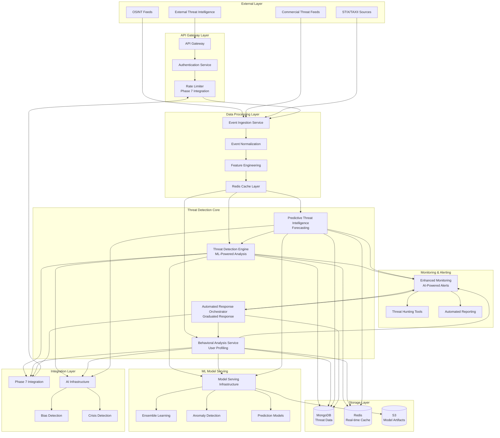
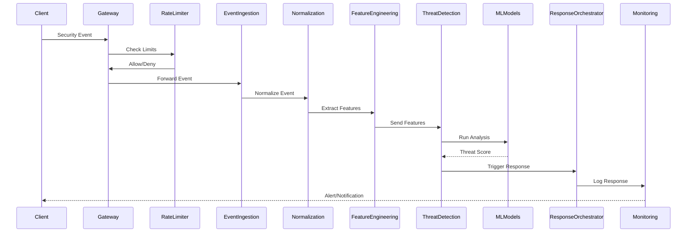
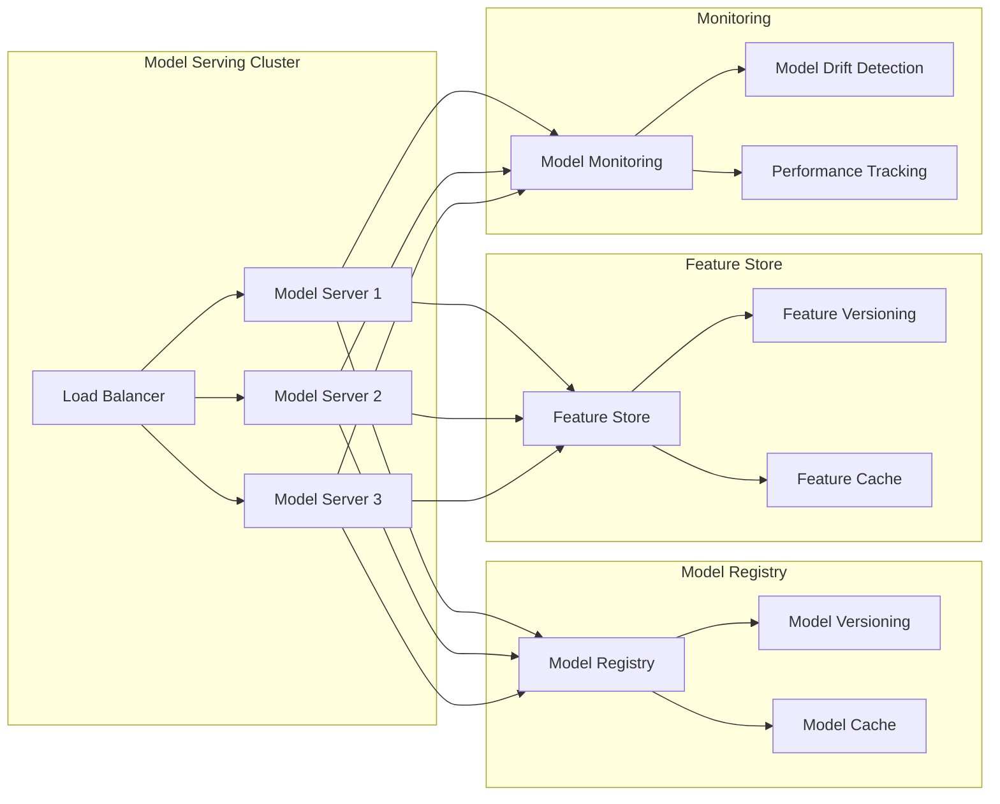

# Phase 8: Advanced AI Threat Detection & Response System - System Architecture

## 🏗️ System Architecture Overview

The Phase 8 AI Threat Detection system implements a comprehensive microservices architecture that builds upon the existing Pixelated infrastructure while introducing advanced ML capabilities for threat detection, behavioral analysis, predictive intelligence, and automated response orchestration.

## 🎯 Architectural Principles

1. **Modular Design**: Single-responsibility components with clear boundaries
2. **Scalable Architecture**: Horizontal scaling with event-driven processing
3. **AI-First**: Machine learning at the core of threat detection
4. **Privacy-Preserving**: HIPAA-compliant with differential privacy
5. **Ethical AI**: Bias detection and fairness monitoring
6. **Real-Time Processing**: Sub-100ms threat detection latency
7. **Fault Tolerance**: Resilient architecture with graceful degradation

## 📐 System Architecture Diagram



## 🔧 Core Component Architecture

### 1. Threat Detection Engine (TDE)

**Location**: `src/lib/threat-detection/engine/`

```typescript
interface ThreatDetectionEngine {
  // Real-time threat analysis
  analyzeThreat(event: SecurityEvent): Promise<ThreatAnalysis>
  
  // Multi-model ensemble detection
  analyzeWithEnsemble(events: SecurityEvent[]): Promise<EnsembleThreatAnalysis>
  
  // Zero-day anomaly detection
  detectZeroDayAnomalies(patterns: ThreatPattern[]): Promise<ZeroDayDetection>
  
  // Threat scoring with confidence intervals
  calculateThreatScore(indicators: ThreatIndicator[]): Promise<ThreatScore>
  
  // Model management
  updateModels(models: MLModel[]): Promise<void>
  
  // Performance monitoring
  getPerformanceMetrics(): Promise<PerformanceMetrics>
}
```

**Key Features**:
- Multi-layered ML models for threat pattern recognition
- Real-time threat scoring with confidence intervals
- Zero-day attack detection through anomaly detection
- Behavioral fingerprinting of attackers
- Ensemble learning for improved detection accuracy

### 2. Behavioral Analysis Service (BAS)

**Location**: `src/lib/threat-detection/behavioral/`

```typescript
interface BehavioralAnalysisService {
  // User behavior profiling
  createBehaviorProfile(userId: string, events: SecurityEvent[]): Promise<BehaviorProfile>
  
  // Anomaly detection
  detectAnomalies(profile: BehaviorProfile, currentEvents: SecurityEvent[]): Promise<Anomaly[]>
  
  // Risk scoring
  calculateBehavioralRisk(profile: BehaviorProfile, events: SecurityEvent[]): Promise<RiskScore>
  
  // Sequential pattern mining
  mineBehavioralPatterns(sequences: BehavioralSequence[]): Promise<BehavioralPattern[]>
  
  // Graph-based behavior analysis
  analyzeBehaviorGraph(events: SecurityEvent[]): Promise<BehaviorGraph>
  
  // Privacy-preserving analysis
  analyzeWithPrivacy(events: SecurityEvent[]): Promise<PrivateBehavioralAnalysis>
}
```

**Key Features**:
- Comprehensive user behavior profiling
- Real-time anomaly detection
- Sequential pattern mining with privacy preservation
- Graph-based behavioral relationship analysis
- Differential privacy for data protection

### 3. Predictive Threat Intelligence (PTI)

**Location**: `src/lib/threat-detection/predictive/`

```typescript
interface PredictiveThreatIntelligence {
  // Threat trend prediction
  predictThreatTrends(historicalData: ThreatData[], timeframe: TimeWindow): Promise<ThreatForecast>
  
  // Emerging threat detection
  detectEmergingThreats(currentData: ThreatData[], baseline: ThreatData[]): Promise<NovelThreat[]>
  
  // Threat propagation modeling
  modelThreatPropagation(initialThreat: Threat, network: NetworkGraph): Promise<PropagationModel>
  
  // Seasonal pattern recognition
  identifySeasonalPatterns(data: ThreatData[]): Promise<SeasonalPattern[]>
  
  // Risk assessment
  assessRisk(threats: Threat[], context: SecurityContext): Promise<RiskAssessment>
  
  // Time series forecasting
  forecastThreatTimeSeries(series: ThreatTimeSeries[]): Promise<TimeSeriesForecast>
}
```

**Key Features**:
- Advanced time series forecasting
- Emerging threat detection with novelty algorithms
- Threat propagation modeling through networks
- Seasonal and cyclical pattern recognition
- Probabilistic risk assessment with uncertainty quantification

### 4. Automated Response Orchestrator (ARO)

**Location**: `src/lib/threat-detection/response/`

```typescript
interface AutomatedResponseOrchestrator {
  // Intelligent response selection
  selectOptimalResponse(threat: Threat, context: ResponseContext): Promise<OptimalResponse>
  
  // Graduated response execution
  executeGraduatedResponse(threat: Threat, severity: ThreatSeverity): Promise<GraduatedResponse>
  
  // Multi-system coordination
  coordinateMultiSystemResponse(threat: Threat, systems: SecuritySystem[]): Promise<CoordinatedResponse>
  
  // Response effectiveness tracking
  trackResponseEffectiveness(response: Response, outcome: ResponseOutcome): Promise<EffectivenessTracking>
  
  // Human-AI collaboration
  facilitateHumanAIDecision(threat: Threat, recommendation: AIRecommendation): Promise<HumanAIDecision>
  
  // Contextual adaptation
  adaptResponseToContext(response: Response, context: ResponseContext): Promise<ContextuallyAdaptedResponse>
}
```

**Key Features**:
- AI-powered response optimization
- Graduated response with escalation paths
- Multi-system coordination and orchestration
- Human-in-the-loop decision making
- Real-time effectiveness tracking and learning

## 🔄 Data Flow Architecture

### Event Processing Pipeline



### Real-time Processing Flow

1. **Event Ingestion**: Raw security events → Normalized events
2. **Feature Engineering**: Events → ML-ready features
3. **Threat Analysis**: Features → Threat indicators → Threat analysis
4. **Response Decision**: Threat analysis → Response strategy → Automated action
5. **Feedback Loop**: Response outcomes → Model training → Improved detection

## 🛡️ Security and Privacy Architecture

### HIPAA Compliance Layer

```typescript
interface HIPAAComplianceLayer {
  // Data encryption
  encryptThreatData(data: ThreatData): Promise<EncryptedData>
  
  // Audit logging
  logThreatActivity(activity: ThreatActivity): Promise<AuditLog>
  
  // Access control
  controlAccess(user: User, resource: ThreatResource): Promise<AccessDecision>
  
  // Data retention
  manageDataRetention(data: ThreatData, policy: RetentionPolicy): Promise<void>
  
  // Privacy preservation
  applyPrivacyPreservation(data: ThreatData): Promise<PrivateData>
}
```

### AI Ethics and Bias Prevention

```typescript
interface AIEthicsLayer {
  // Bias detection
  detectBias(model: MLModel, data: ThreatData): Promise<BiasResult>
  
  // Fairness monitoring
  monitorFairness(decisions: ThreatDecision[]): Promise<FairnessMetrics>
  
  // Explainability
  explainDecision(decision: ThreatDecision): Promise<Explanation>
  
  // Human oversight
  integrateHumanOversight(decision: CriticalThreatDecision): Promise<void>
  
  // Transparency
  ensureTransparency(model: MLModel): Promise<TransparencyReport>
}
```

## 📊 ML Model Serving Infrastructure

### Model Serving Architecture



### Model Management Components

1. **Model Registry**: Centralized model storage with versioning
2. **Feature Store**: Consistent feature engineering across models
3. **Model Serving**: Scalable inference infrastructure
4. **Model Monitoring**: Real-time performance and drift detection
5. **A/B Testing**: Model comparison and validation framework

## 🔗 Integration Architecture

### Phase 7 Rate Limiting Integration

```typescript
interface Phase7Integration {
  // Analytics sharing
  shareAnalyticsData(data: RateLimitAnalytics): Promise<void>
  
  // Coordinated alerting
  coordinateAlerts(alert: ThreatAlert): Promise<void>
  
  // Redis resource sharing
  shareRedisResources(key: string, data: any): Promise<void>
  
  // Monitoring integration
  integrateMonitoring(metrics: ThreatMetrics): Promise<void>
  
  // Response coordination
  coordinateResponse(response: ThreatResponse): Promise<void>
}
```

### AI Infrastructure Integration

```typescript
interface AIInfrastructureIntegration {
  // Bias detection coordination
  coordinateBiasDetection(analysis: ThreatAnalysis): Promise<BiasResult>
  
  // Model serving integration
  integrateModelServing(model: MLModel): Promise<void>
  
  // Crisis detection coordination
  coordinateCrisisDetection(threat: Threat): Promise<CrisisResult>
  
  // Emotion synthesis
  synthesizeThreatActorEmotion(threat: Threat): Promise<EmotionProfile>
  
  // Shared learning
  shareLearningInsights(insights: LearningInsights): Promise<void>
}
```

## 🚀 Performance and Scalability

### Scalability Design

- **Horizontal Scaling**: Microservices with independent scaling
- **Load Balancing**: Intelligent distribution of threat processing
- **Caching Strategy**: Multi-level caching for threat intelligence
- **Async Processing**: Event-driven architecture for real-time processing
- **Resource Optimization**: Dynamic allocation based on threat volume

### Performance Targets

- **Detection Latency**: < 100ms for 95th percentile
- **Throughput**: 100,000+ events/second
- **Concurrent Analysis**: 10,000+ simultaneous threat analyses
- **False Positive Rate**: < 1% for critical threats
- **True Positive Rate**: > 95% for known attack patterns

## 📈 Deployment Architecture

### Container Architecture

```yaml
# docker-compose.threat-detection.yml
version: '3.8'
services:
  threat-detection-engine:
    image: pixelated/threat-detection-engine:latest
    replicas: 3
    environment:
      - MONGODB_URI=${MONGODB_URI}
      - REDIS_URL=${REDIS_URL}
      - MODEL_SERVING_URL=${MODEL_SERVING_URL}
    depends_on:
      - mongodb
      - redis
      - model-server
  
  behavioral-analysis:
    image: pixelated/behavioral-analysis:latest
    replicas: 2
    environment:
      - MONGODB_URI=${MONGODB_URI}
      - REDIS_URL=${REDIS_URL}
    depends_on:
      - mongodb
      - redis
  
  predictive-intelligence:
    image: pixelated/predictive-intelligence:latest
    replicas: 2
    environment:
      - MONGODB_URI=${MONGODB_URI}
      - REDIS_URL=${REDIS_URL}
    depends_on:
      - mongodb
      - redis
  
  response-orchestrator:
    image: pixelated/response-orchestrator:latest
    replicas: 2
    environment:
      - MONGODB_URI=${MONGODB_URI}
      - REDIS_URL=${REDIS_URL}
    depends_on:
      - mongodb
      - redis
  
  model-server:
    image: pixelated/model-server:latest
    replicas: 3
    environment:
      - MODEL_REGISTRY_URL=${MODEL_REGISTRY_URL}
      - FEATURE_STORE_URL=${FEATURE_STORE_URL}
    volumes:
      - model-cache:/app/models
  
  monitoring-dashboard:
    image: pixelated/monitoring-dashboard:latest
    replicas: 1
    environment:
      - GRAFANA_URL=${GRAFANA_URL}
      - PROMETHEUS_URL=${PROMETHEUS_URL}
    ports:
      - "3000:3000"

volumes:
  model-cache:
```

### Environment Strategy

- **Development**: Local development with mock services
- **Staging**: Full integration testing environment
- **Production**: High-availability multi-region deployment
- **Disaster Recovery**: Automated failover and data recovery

## 🧪 Testing Architecture

### Model Testing Framework

```typescript
interface ModelTestingFramework {
  // Adversarial testing
  testAdversarialRobustness(model: MLModel): Promise<AdversarialTestResult>
  
  // Performance testing
  testModelPerformance(model: MLModel): Promise<PerformanceTestResult>
  
  // Bias testing
  testModelBias(model: MLModel): Promise<BiasTestResult>
  
  // Drift detection
  detectModelDrift(model: MLModel): Promise<DriftDetectionResult>
  
  // Integration testing
  testSystemIntegration(models: MLModel[]): Promise<IntegrationTestResult>
}
```

### System Integration Testing

- **End-to-End Testing**: Complete threat detection workflows
- **Performance Testing**: High-volume threat processing
- **Security Testing**: Vulnerability assessment and penetration testing
- **Chaos Testing**: Resilience under failure conditions
- **Compliance Testing**: HIPAA and AI ethics validation

## 📊 Monitoring and Observability

### Comprehensive Monitoring Stack

```typescript
interface MonitoringStack {
  // Metrics collection
  collectMetrics(metrics: SystemMetrics[]): Promise<void>
  
  // Alert generation
  generateAlerts(events: MonitoringEvent[]): Promise<Alert[]>
  
  // Performance tracking
  trackPerformance(performance: PerformanceData[]): Promise<PerformanceReport>
  
  // Health monitoring
  monitorHealth(components: SystemComponent[]): Promise<HealthReport>
  
  // Anomaly detection
  detectAnomalies(data: MonitoringData[]): Promise<Anomaly[]>
}
```

### Key Monitoring Components

1. **Prometheus**: Metrics collection and storage
2. **Grafana**: Visualization and dashboards
3. **Jaeger**: Distributed tracing
4. **ELK Stack**: Log aggregation and analysis
5. **Custom AI Monitoring**: Model performance and drift detection

## 🎯 Conclusion

This architecture provides a robust, scalable, and ethical foundation for advanced AI-powered threat detection while maintaining seamless integration with existing Pixelated infrastructure. The design emphasizes:

- **Modularity**: Clear component boundaries and responsibilities
- **Scalability**: Horizontal scaling with event-driven architecture
- **Performance**: Sub-100ms detection latency with high throughput
- **Security**: HIPAA compliance with comprehensive privacy protection
- **Ethics**: Bias detection and fairness monitoring throughout
- **Integration**: Seamless coordination with Phase 7 rate limiting
- **Observability**: Comprehensive monitoring and alerting capabilities

The architecture supports the project's mental health focus by ensuring all threat detection activities maintain patient privacy and adhere to ethical AI principles while providing robust security protection.