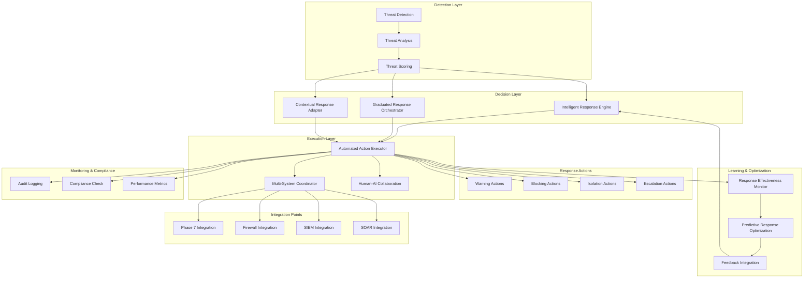

# Phase 8: Automated Response Orchestration Framework Architecture

## 🎯 Overview

The Automated Response Orchestration Framework provides intelligent, graduated, and context-aware automated responses to detected threats while maintaining human oversight capabilities and ethical decision-making principles. This framework coordinates multi-system responses, implements escalation paths, and learns from response outcomes to continuously improve effectiveness.

## 🏗️ Framework Architecture

### Response Orchestration Architecture Diagram



## 🔧 Core Response Components

### 1. Intelligent Response Engine (IRE)

#### AI-Powered Response Decision Making

```typescript
// intelligent_response_engine.ts
interface IntelligentResponseEngine {
  // Intelligent response selection
  selectOptimalResponse(threat: Threat, context: ResponseContext): Promise<OptimalResponse>
  
  // Multi-criteria decision analysis
  analyzeResponseOptions(threat: Threat, availableResponses: ResponseOption[]): Promise<ResponseAnalysis>
  
  // Context-aware response adaptation
  adaptResponseToContext(baseResponse: Response, context: ResponseContext): Promise<AdaptedResponse>
  
  // Learning from response outcomes
  learnFromResponseOutcome(response: Response, outcome: ResponseOutcome): Promise<LearningUpdate>
  
  // Ethical response validation
  validateResponseEthically(response: Response): Promise<EthicalValidation>
  
  // Real-time response optimization
  optimizeResponseRealTime(threat: Threat, feedback: RealTimeFeedback): Promise<RealTimeOptimizedResponse>
}

interface OptimalResponse {
  responseId: string
  selectedResponse: Response
  decisionRationale: DecisionRationale
  confidenceScore: number
  alternativeOptions: AlternativeOption[]
  expectedOutcome: ExpectedOutcome
  riskAssessment: ResponseRiskAssessment
  ethicalConsiderations: EthicalConsideration[]
  performanceMetrics: ResponsePerformanceMetrics
}

class AdvancedIntelligentResponseEngine implements IntelligentResponseEngine {
  private decisionModels: DecisionModel[]
  private multiCriteriaAnalyzer: MultiCriteriaAnalyzer
  private contextAdapter: ContextAdapter
  private reinforcementLearner: ReinforcementLearner
  private ethicalValidator: EthicalValidator
  private realTimeOptimizer: RealTimeOptimizer
  
  constructor(config: IntelligentResponseConfig) {
    this.decisionModels = this.initializeDecisionModels(config)
    this.multiCriteriaAnalyzer = new MultiCriteriaAnalyzer(config.mcdaConfig)
    this.contextAdapter = new ContextAdapter(config.contextConfig)
    this.reinforcementLearner = new ReinforcementLearner(config.rlConfig)
    this.ethicalValidator = new EthicalValidator(config.ethicalConfig)
    this.realTimeOptimizer = new RealTimeOptimizer(config.optimizationConfig)
  }
  
  async selectOptimalResponse(threat: Threat, context: ResponseContext): Promise<OptimalResponse> {
    // Analyze threat characteristics
    const threatAnalysis = await this.analyzeThreatCharacteristics(threat)
    
    // Generate candidate responses
    const candidateResponses = await this.generateCandidateResponses(threat, context)
    
    // Evaluate responses using multiple criteria
    const responseEvaluations = await Promise.all(
      candidateResponses.map(response => 
        this.evaluateResponse(response, threat, context)
      )
    )
    
    // Apply decision models
    const modelDecisions = await Promise.all(
      this.decisionModels.map(model => 
        this.applyDecisionModel(model, responseEvaluations, threatAnalysis)
      )
    )
    
    // Ensemble decision making
    const ensembleDecision = this.ensembleDecisions(modelDecisions)
    
    // Validate ethical considerations
    const ethicalValidation = await this.ethicalValidator.validate(ensembleDecision.selectedResponse)
    
    // Calculate confidence and expected outcomes
    const confidenceScore = this.calculateConfidenceScore(ensembleDecision, responseEvaluations)
    const expectedOutcome = await this.predictExpectedOutcome(ensembleDecision.selectedResponse, threat)
    
    // Generate decision rationale
    const decisionRationale = this.generateDecisionRationale(ensembleDecision, modelDecisions)
    
    return {
      responseId: this.generateResponseId(),
      selectedResponse: ensembleDecision.selectedResponse,
      decisionRationale,
      confidenceScore,
      alternativeOptions: this.formatAlternativeOptions(responseEvaluations, ensembleDecision),
      expectedOutcome,
      riskAssessment: await this.assessResponseRisk(ensembleDecision.selectedResponse, threat),
      ethicalConsiderations: ethicalValidation.considerations,
      performanceMetrics: this.calculatePerformanceMetrics(ensembleDecision)
    }
  }
  
  private async evaluateResponse(
    response: Response, 
    threat: Threat, 
    context: ResponseContext
  ): Promise<ResponseEvaluation> {
    // Evaluate effectiveness
    const effectiveness = await this.evaluateEffectiveness(response, threat)
    
    // Evaluate cost-benefit
    const costBenefit = await this.evaluateCostBenefit(response, threat)
    
    // Evaluate risk
    const risk = await this.evaluateRisk(response, threat)
    
    // Evaluate timeliness
    const timeliness = this.evaluateTimeliness(response, context)
    
    // Evaluate resource requirements
    const resourceRequirements = await this.evaluateResourceRequirements(response)
    
    // Evaluate side effects
    const sideEffects = await this.evaluateSideEffects(response)
    
    // Calculate overall score
    const overallScore = this.calculateOverallScore({
      effectiveness,
      costBenefit,
      risk,
      timeliness,
      resourceRequirements,
      sideEffects
    })
    
    return {
      responseId: response.id,
      evaluation: {
        effectiveness,
        costBenefit,
        risk,
        timeliness,
        resourceRequirements,
        sideEffects
      },
      overallScore,
      ranking: 0, // Will be set after sorting
      confidence: this.calculateEvaluationConfidence(response, threat)
    }
  }
  
  private calculateOverallScore(metrics: ResponseMetrics): number {
    const weights = {
      effectiveness: 0.3,
      costBenefit: 0.2,
      risk: 0.25,
      timeliness: 0.15,
      resourceRequirements: 0.05,
      sideEffects: 0.05
    }
    
    return (
      metrics.effectiveness.score * weights.effectiveness +
      metrics.costBenefit.score * weights.costBenefit +
      (1 - metrics.risk.score) * weights.risk + // Lower risk is better
      metrics.timeliness.score * weights.timeliness +
      (1 - metrics.resourceRequirements.score) * weights.resourceRequirements + // Lower requirements better
      (1 - metrics.sideEffects.score) * weights.sideEffects // Lower side effects better
    )
  }
  
  async learnFromResponseOutcome(response: Response, outcome: ResponseOutcome): Promise<LearningUpdate> {
    // Extract learning signals
    const learningSignals = this.extractLearningSignals(response, outcome)
    
    // Update reinforcement learning model
    const rlUpdate = await this.reinforcementLearner.update(learningSignals)
    
    // Update decision models
    const modelUpdates = await Promise.all(
      this.decisionModels.map(model => 
        this.updateDecisionModel(model, learningSignals)
      )
    )
    
    // Generate learning insights
    const insights = this.generateLearningInsights(learningSignals, rlUpdate, modelUpdates)
    
    // Update response effectiveness database
    await this.updateEffectivenessDatabase(response, outcome, insights)
    
    return {
      updateId: this.generateUpdateId(),
      learningSignals,
      reinforcementLearningUpdate: rlUpdate,
      modelUpdates,
      insights,
      timestamp: Date.now()
    }
  }
  
  private extractLearningSignals(response: Response, outcome: ResponseOutcome): LearningSignals {
    return {
      responseEffectiveness: outcome.effectiveness,
      threatNeutralized: outcome.threatNeutralized,
      responseTime: outcome.responseTime,
      resourceUtilization: outcome.resourceUtilization,
      sideEffects: outcome.sideEffects,
      userFeedback: outcome.userFeedback,
      falsePositive: outcome.falsePositive,
      escalationRequired: outcome.escalationRequired,
      context: outcome.context
    }
  }
}
```

### 2. Graduated Response Orchestrator (GRO)

#### Multi-Level Response Management

```typescript
// graduated_response_orchestrator.ts
interface GraduatedResponseOrchestrator {
  // Graduated response execution
  executeGraduatedResponse(threat: Threat, severity: ThreatSeverity): Promise<GraduatedResponse>
  
  // Response escalation management
  manageEscalation(currentResponse: Response, threatEvolution: ThreatEvolution): Promise<ResponseEscalation>
  
  // Response de-escalation
  manageDeescalation(currentResponse: Response, threatMitigation: ThreatMitigation): Promise<ResponseDeescalation>
  
  // Multi-level response coordination
  coordinateMultiLevelResponse(threat: Threat): Promise<MultiLevelResponse>
  
  // Human escalation decision
  decideHumanEscalation(response: Response, context: ResponseContext): Promise<HumanEscalationDecision>
  
  // Response effectiveness tracking
  trackResponseEffectiveness(response: Response, outcome: ResponseOutcome): Promise<EffectivenessTracking>
}

interface GraduatedResponse {
  responseId: string
  currentLevel: EscalationLevel
  responseActions: ResponseAction[]
  escalationPath: EscalationPath
  deescalationConditions: DeescalationCondition[]
  humanOversightPoints: HumanOversightPoint[]
  resourceRequirements: ResourceRequirement[]
  timeline: ResponseTimeline
  successCriteria: SuccessCriterion[]
}

class AdvancedGraduatedResponseOrchestrator implements GraduatedResponseOrchestrator {
  private escalationLevels: EscalationLevel[]
  private escalationCriteria: EscalationCriterion[]
  private responseActions: Map<EscalationLevel, ResponseAction[]>
  deescalationTriggers: DeescalationTrigger[]
  private humanInTheLoop: HumanInTheLoopConfig
  private effectivenessTracker: EffectivenessTracker
  
  constructor(config: GraduatedResponseConfig) {
    this.escalationLevels = config.escalationLevels
    this.escalationCriteria = config.escalationCriteria
    this.responseActions = this.initializeResponseActions(config)
    this.deescalationTriggers = config.deescalationTriggers
    this.humanInTheLoop = config.humanInTheLoop
    this.effectivenessTracker = new EffectivenessTracker(config.effectivenessConfig)
  }
  
  async executeGraduatedResponse(threat: Threat, severity: ThreatSeverity): Promise<GraduatedResponse> {
    // Determine initial response level based on threat severity
    const initialLevel = this.determineInitialResponseLevel(severity)
    
    // Get response actions for initial level
    const initialActions = this.getResponseActionsForLevel(initialLevel)
    
    // Create response timeline
    const timeline = this.createResponseTimeline(initialLevel, initialActions)
    
    // Define escalation path
    const escalationPath = this.createEscalationPath(initialLevel)
    
    // Define de-escalation conditions
    const deescalationConditions = this.createDeescalationConditions(initialLevel)
    
    // Identify human oversight points
    const humanOversightPoints = this.identifyHumanOversightPoints(initialLevel, escalationPath)
    
    // Calculate resource requirements
    const resourceRequirements = this.calculateResourceRequirements(initialActions)
    
    // Define success criteria
    const successCriteria = this.defineSuccessCriteria(initialLevel)
    
    return {
      responseId: this.generateResponseId(),
      currentLevel: initialLevel,
      responseActions: initialActions,
      escalationPath,
      deescalationConditions,
      humanOversightPoints,
      resourceRequirements,
      timeline,
      successCriteria
    }
  }
  
  async manageEscalation(
    currentResponse: Response, 
    threatEvolution: ThreatEvolution
  ): Promise<ResponseEscalation> {
    // Evaluate escalation criteria
    const escalationEvaluation = await this.evaluateEscalationCriteria(
      currentResponse,
      threatEvolution
    )
    
    if (!escalationEvaluation.shouldEscalate) {
      return {
        escalationId: this.generateEscalationId(),
        escalationRequired: false,
        reason: escalationEvaluation.reason,
        currentResponse: currentResponse
      }
    }
    
    // Determine next escalation level
    const nextLevel = this.determineNextEscalationLevel(currentResponse.currentLevel)
    
    // Get response actions for next level
    const nextLevelActions = this.getResponseActionsForLevel(nextLevel)
    
    // Create escalation plan
    const escalationPlan = this.createEscalationPlan(
      currentResponse,
      nextLevel,
      nextLevelActions,
      escalationEvaluation
    )
    
    // Check if human oversight is required
    const humanOversightRequired = this.isHumanOversightRequired(nextLevel)
    
    if (humanOversightRequired) {
      const humanDecision = await this.requestHumanOversight(escalationPlan)
      if (!humanDecision.approved) {
        return {
          escalationId: this.generateEscalationId(),
          escalationRequired: false,
          reason: 'Human oversight denied escalation',
          currentResponse: currentResponse
        }
      }
    }
    
    // Execute escalation
    const escalatedResponse = await this.executeEscalation(escalationPlan)
    
    return {
      escalationId: this.generateEscalationId(),
      escalationRequired: true,
      previousLevel: currentResponse.currentLevel,
      newLevel: nextLevel,
      escalatedResponse,
      humanOversightRequired,
      escalationReason: escalationEvaluation.reason,
      timeline: escalationPlan.timeline
    }
  }
  
  private async evaluateEscalationCriteria(
    currentResponse: Response,
    threatEvolution: ThreatEvolution
  ): Promise<EscalationEvaluation> {
    const criteriaEvaluations: CriterionEvaluation[] = []
    
    for (const criterion of this.escalationCriteria) {
      const evaluation = await this.evaluateCriterion(criterion, currentResponse, threatEvolution)
      criteriaEvaluations.push(evaluation)
    }
    
    // Determine if escalation is required based on criteria
    const shouldEscalate = criteriaEvaluations.some(evaluation => 
      evaluation.result === 'TRIGGER_ESCALATION'
    )
    
    const triggeringCriteria = criteriaEvaluations
      .filter(evaluation => evaluation.result === 'TRIGGER_ESCALATION')
      .map(evaluation => evaluation.criterionName)
    
    return {
      shouldEscalate,
      reason: shouldEscalate 
        ? `Criteria triggered: ${triggeringCriteria.join(', ')}`
        : 'No escalation criteria triggered',
      criteriaEvaluations,
      threatSeverity: threatEvolution.currentSeverity,
      confidence: this.calculateEscalationConfidence(criteriaEvaluations)
    }
  }
  
  private createEscalationPath(initialLevel: EscalationLevel): EscalationPath {
    const path: EscalationPath = {
      currentLevel: initialLevel,
      nextLevels: [],
      escalationTriggers: [],
      humanOversightPoints: []
    }
    
    const currentIndex = this.escalationLevels.findIndex(level => 
      level.name === initialLevel.name
    )
    
    // Define next levels in escalation path
    for (let i = currentIndex + 1; i < this.escalationLevels.length; i++) {
      const nextLevel = this.escalationLevels[i]
      path.nextLevels.push({
        level: nextLevel,
        escalationTrigger: this.getEscalationTriggerForLevel(nextLevel),
        humanOversightRequired: nextLevel.requiresHumanApproval,
        estimatedTimeline: this.estimateEscalationTimeline(nextLevel),
        resourceRequirements: this.getResourceRequirementsForLevel(nextLevel)
      })
    }
    
    return path
  }
  
  async trackResponseEffectiveness(response: Response, outcome: ResponseOutcome): Promise<EffectivenessTracking> {
    // Calculate effectiveness metrics
    const effectivenessMetrics = await this.calculateEffectivenessMetrics(response, outcome)
    
    // Compare with baseline
    const baselineComparison = await this.compareWithBaseline(response, effectivenessMetrics)
    
    // Identify improvement opportunities
    const improvementOpportunities = this.identifyImprovementOpportunities(response, outcome)
    
    // Generate recommendations
    const recommendations = await this.generateEffectivenessRecommendations(
      effectivenessMetrics,
      baselineComparison,
      improvementOpportunities
    )
    
    // Update effectiveness database
    await this.effectivenessTracker.recordEffectiveness({
      responseId: response.id,
      metrics: effectivenessMetrics,
      comparison: baselineComparison,
      opportunities: improvementOpportunities,
      recommendations
    })
    
    return {
      trackingId: this.generateTrackingId(),
      responseId: response.id,
      effectivenessScore: effectivenessMetrics.overallScore,
      successIndicators: effectivenessMetrics.successIndicators,
      failureAnalysis: effectivenessMetrics.failureAnalysis,
      performanceBenchmarks: baselineComparison,
      comparativeResults: this.generateComparativeResults(effectivenessMetrics),
      improvementRecommendations: recommendations,
      confidenceLevel: effectivenessMetrics.confidenceLevel
    }
  }
}
```

### 3. Automated Action Executor (AAE)

#### Multi-System Action Execution

```typescript
// automated_action_executor.ts
interface AutomatedActionExecutor {
  // Execute automated actions
  executeActions(actions: AutomatedAction[]): Promise<ActionExecutionResult[]>
  
  // Coordinated multi-system action execution
  executeCoordinatedActions(coordinatedActions: CoordinatedAction[]): Promise<CoordinatedExecutionResult>
  
  // Action rollback
  rollbackActions(actions: AutomatedAction[], rollbackPoint: RollbackPoint): Promise<RollbackResult>
  
  // Validate actions before execution
  validateActions(actions: AutomatedAction[]): Promise<ActionValidationResult>
  
  // Monitor action execution
  monitorActionExecution(executionId: string): Promise<ActionExecutionStatus>
  
  // Optimize action execution
  optimizeActionExecution(actions: AutomatedAction[]): Promise<OptimizedExecutionPlan>
}

interface ActionExecutionResult {
  executionId: string
  actionResults: IndividualActionResult[]
  overallSuccess: boolean
  executionTime: number
  resourceUsage: ResourceUsage
  sideEffects: SideEffect[]
  auditTrail: ActionAuditTrail
  performanceMetrics: ExecutionPerformanceMetrics
}

class AdvancedAutomatedActionExecutor implements AutomatedActionExecutor {
  private actionValidators: Map<string, ActionValidator>
  private systemIntegrations: Map<string, SystemIntegration>
  private executionEngine: ExecutionEngine
  private rollbackManager: RollbackManager
  private monitoringService: MonitoringService
  private optimizationEngine: OptimizationEngine
  
  constructor(config: AutomatedActionConfig) {
    this.actionValidators = this.initializeActionValidators(config)
    this.systemIntegrations = this.initializeSystemIntegrations(config)
    this.executionEngine = new ExecutionEngine(config.executionConfig)
    this.rollbackManager = new RollbackManager(config.rollbackConfig)
    this.monitoringService = new MonitoringService(config.monitoringConfig)
    this.optimizationEngine = new OptimizationEngine(config.optimizationConfig)
  }
  
  async executeActions(actions: AutomatedAction[]): Promise<ActionExecutionResult[]> {
    const executionResults: ActionExecutionResult[] = []
    
    // Validate actions before execution
    const validationResults = await this.validateActions(actions)
    const validActions = actions.filter((_, index) => validationResults[index].isValid)
    
    if (validActions.length === 0) {
      throw new Error('No valid actions to execute')
    }
    
    // Optimize execution plan
    const optimizedPlan = await this.optimizationEngine.optimize(validActions)
    
    // Execute actions according to optimized plan
    for (const batch of optimizedPlan.executionBatches) {
      const batchResults = await this.executeActionBatch(batch)
      executionResults.push(...batchResults)
    }
    
    // Monitor execution
    await this.monitoringService.monitorExecution(executionResults)
    
    return executionResults
  }
  
  private async executeActionBatch(batch: ActionBatch): Promise<ActionExecutionResult[]> {
    const batchResults: ActionExecutionResult[] = []
    
    // Execute actions in batch (parallel execution)
    const executionPromises = batch.actions.map(action => 
      this.executeIndividualAction(action)
    )
    
    const results = await Promise.allSettled(executionPromises)
    
    // Process results
    for (let i = 0; i < results.length; i++) {
      const result = results[i]
      const action = batch.actions[i]
      
      if (result.status === 'fulfilled') {
        batchResults.push(result.value)
      } else {
        // Handle failed action
        const failedResult: ActionExecutionResult = {
          executionId: this.generateExecutionId(),
          actionResults: [{
            actionId: action.id,
            success: false,
            error: result.reason.message,
            executionTime: 0,
            resourceUsage: {},
            sideEffects: []
          }],
          overallSuccess: false,
          executionTime: 0,
          resourceUsage: {},
          sideEffects: [],
          auditTrail: this.createFailureAuditTrail(action, result.reason),
          performanceMetrics: this.createFailureMetrics(result.reason)
        }
        batchResults.push(failedResult)
      }
    }
    
    return batchResults
  }
  
  private async executeIndividualAction(action: AutomatedAction): Promise<ActionExecutionResult> {
    const startTime = Date.now()
    const actionResults: IndividualActionResult[] = []
    const sideEffects: SideEffect[] = []
    
    try {
      // Get appropriate system integration
      const systemIntegration = this.systemIntegrations.get(action.targetSystem)
      if (!systemIntegration) {
        throw new Error(`No integration available for system: ${action.targetSystem}`)
      }
      
      // Execute action through system integration
      const result = await systemIntegration.executeAction(action)
      
      actionResults.push({
        actionId: action.id,
        success: result.success,
        result: result.data,
        executionTime: Date.now() - startTime,
        resourceUsage: result.resourceUsage,
        sideEffects: result.sideEffects
      })
      
      sideEffects.push(...result.sideEffects)
      
      // Create audit trail
      const auditTrail = this.createActionAuditTrail(action, result)
      
      return {
        executionId: this.generateExecutionId(),
        actionResults,
        overallSuccess: result.success,
        executionTime: Date.now() - startTime,
        resourceUsage: result.resourceUsage,
        sideEffects,
        auditTrail,
        performanceMetrics: this.calculatePerformanceMetrics(result)
      }
      
    } catch (error) {
      // Handle execution error
      const errorResult: IndividualActionResult = {
        actionId: action.id,
        success: false,
        error: error.message,
        executionTime: Date.now() - startTime,
        resourceUsage: {},
        sideEffects: []
      }
      
      return {
        executionId: this.generateExecutionId(),
        actionResults: [errorResult],
        overallSuccess: false,
        executionTime: Date.now() - startTime,
        resourceUsage: {},
        sideEffects: [],
        auditTrail: this.createErrorAuditTrail(action, error),
        performanceMetrics: this.createErrorMetrics(error)
      }
    }
  }
  
  async executeCoordinatedActions(coordinatedActions: CoordinatedAction[]): Promise<CoordinatedExecutionResult> {
    const coordinationId = this.generateCoordinationId()
    const executionResults: ActionExecutionResult[] = []
    const coordinationLog: CoordinationLog[] = []
    
    try {
      // Validate coordination dependencies
      const validationResult = await this.validateCoordinationDependencies(coordinatedActions)
      if (!validationResult.isValid) {
        throw new Error(`Invalid coordination: ${validationResult.errors.join(', ')}`)
      }
      
      // Create execution plan with dependencies
      const executionPlan = await this.createCoordinationExecutionPlan(coordinatedActions)
      
      // Execute coordinated actions
      for (const phase of executionPlan.phases) {
        const phaseResults = await this.executeCoordinationPhase(phase)
        executionResults.push(...phaseResults)
        
        // Log coordination events
        coordinationLog.push({
          phase: phase.phaseId,
          timestamp: Date.now(),
          actions: phaseResults.map(r => r.executionId),
          status: 'COMPLETED'
        })
        
        // Check for failures that might affect downstream actions
        const failedActions = phaseResults.filter(r => !r.overallSuccess)
        if (failedActions.length > 0 && phase.criticalPhase) {
          throw new Error(`Critical phase failed: ${phase.phaseId}`)
        }
      }
      
      // Synchronize final state
      const finalSynchronization = await this.synchronizeFinalState(coordinatedActions)
      
      return {
        coordinationId,
        executionResults,
        overallSuccess: true,
        coordinationLog,
        finalSynchronization,
        totalExecutionTime: this.calculateTotalExecutionTime(executionResults),
        resourceUtilization: this.aggregateResourceUtilization(executionResults)
      }
      
    } catch (error) {
      // Handle coordination failure
      await this.handleCoordinationFailure(coordinationId, coordinatedActions, error)
      
      return {
        coordinationId,
        executionResults,
        overallSuccess: false,
        coordinationLog,
        error: error.message,
        rollbackActions: await this.getRollbackActions(coordinationId)
      }
    }
  }
  
  async rollbackActions(actions: AutomatedAction[], rollbackPoint: RollbackPoint): Promise<RollbackResult> {
    const rollbackResults: RollbackActionResult[] = []
    
    // Execute rollback in reverse order
    const rollbackActions = this.createRollbackActions(actions, rollbackPoint)
    
    for (const rollbackAction of rollbackActions) {
      try {
        const result = await this.executeRollbackAction(rollbackAction)
        rollbackResults.push({
          rollbackActionId: rollbackAction.id,
          success: result.success,
          originalActionId: rollbackAction.originalActionId,
          restorationStatus: result.restorationStatus,
          timestamp: Date.now()
        })
      } catch (error) {
        rollbackResults.push({
          rollbackActionId: rollbackAction.id,
          success: false,
          originalActionId: rollbackAction.originalActionId,
          error: error.message,
          timestamp: Date.now()
        })
      }
    }
    
    return {
      rollbackId: this.generateRollbackId(),
      rollbackPoint: rollbackPoint,
      rollbackResults,
      overallSuccess: rollbackResults.every(r => r.success),
      restorationCompleteness: this.calculateRestorationCompleteness(rollbackResults),
      timestamp: Date.now()
    }
  }
  
  private initializeSystemIntegrations(config: AutomatedActionConfig): Map<string, SystemIntegration> {
    const integrations = new Map()
    
    // Phase 7 Rate Limiting Integration
    integrations.set('rate_limiting', new Phase7RateLimitingIntegration({
      apiEndpoint: config.phase7Config.apiEndpoint,
      authToken: config.phase7Config.authToken,
      timeout: config.phase7Config.timeout
    }))
    
    // Firewall Integration
    integrations.set('firewall', new FirewallIntegration({
      firewallType: config.firewallConfig.type,
      apiEndpoint: config.firewallConfig.apiEndpoint,
      credentials: config.firewallConfig.credentials
    }))
    
    // SIEM Integration
    integrations.set('siem', new SIEMIntegration({
      siemType: config.siemConfig.type,
      apiEndpoint: config.siemConfig.apiEndpoint,
      eventFormat: config.siemConfig.eventFormat
    }))
    
    // SOAR Integration
    integrations.set('soar', new SOARIntegration({
      soarPlatform: config.soarConfig.platform,
      apiEndpoint: config.soarConfig.apiEndpoint,
      workflowTriggers: config.soarConfig.workflowTriggers
    }))
    
    // Identity Management Integration
    integrations.set('identity', new IdentityManagementIntegration({
      idmSystem: config.identityConfig.system,
      apiEndpoint: config.identityConfig.apiEndpoint,
      provisioningEnabled: config.identityConfig.provisioningEnabled
    }))
    
    // Network Security Integration
    integrations.set('network', new NetworkSecurityIntegration({
      networkSystem: config.networkConfig.system,
      apiEndpoint: config.networkConfig.apiEndpoint,
      segmentationEnabled: config.networkConfig.segmentationEnabled
    }))
    
    return integrations
  }
}
```

### 4. Contextual Response Adapter (CRA)

#### Dynamic Context-Aware Response Adaptation

```typescript
// contextual_response_adapter.ts
interface ContextualResponseAdapter {
  // Adapt response to context
  adaptResponseToContext(baseResponse: Response, context: ResponseContext): Promise<ContextuallyAdaptedResponse>
  
  // Multi-dimensional context analysis
  analyzeMultiDimensionalContext(threat: Threat, environment: Environment): Promise<MultiDimensionalContext>
  
  // Dynamic context tracking
  trackContextDynamically(contextStream: ContextStream): Promise<DynamicContextTracking>
  
  // Context-aware response optimization
  optimizeResponseContextually(response: Response, context: ResponseContext): Promise<ContextuallyOptimizedResponse>
  
  // Context prediction for proactive adaptation
  predictContextChanges(currentContext: ResponseContext): Promise<PredictedContext>
  
  // Cross-context response consistency
  ensureCrossContextConsistency(responses: Response[], contexts: ResponseContext[]): Promise<ContextConsistencyAnalysis>
}

interface ContextuallyAdaptedResponse {
  adaptationId: string
  originalResponse: Response
  adaptedResponse: Response
  adaptationRationale: AdaptationRationale
  contextInfluence: ContextInfluence
  adaptationConfidence: number
  contextStability: ContextStability
  rollbackInformation: RollbackInformation
}

class AdvancedContextualResponseAdapter implements ContextualResponseAdapter {
  private contextAnalyzers: Map<string, ContextAnalyzer>
  private adaptationStrategies: Map<string, AdaptationStrategy>
  private contextPredictor: ContextPredictor
  private consistencyChecker: ConsistencyChecker
  private optimizationEngine: ContextualOptimizationEngine
  
  constructor(config: ContextualResponseConfig) {
    this.contextAnalyzers = this.initializeContextAnalyzers(config)
    this.adaptationStrategies = this.initializeAdaptationStrategies(config)
    this.contextPredictor = new ContextPredictor(config.predictionConfig)
    this.consistencyChecker = new ConsistencyChecker(config.consistencyConfig)
    this.optimizationEngine = new ContextualOptimizationEngine(config.optimizationConfig)
  }
  
  async adaptResponseToContext(
    baseResponse: Response, 
    context: ResponseContext
  ): Promise<ContextuallyAdaptedResponse> {
    // Analyze multi-dimensional context
    const contextAnalysis = await this.analyzeMultiDimensionalContext(
      context.threat, 
      context.environment
    )
    
    // Determine relevant adaptation strategies
    const relevantStrategies = this.selectAdaptationStrategies(contextAnalysis)
    
    // Apply adaptations
    const adaptations = await Promise.all(
      relevantStrategies.map(strategy => 
        this.applyAdaptationStrategy(strategy, baseResponse, contextAnalysis)
      )
    )
    
    // Combine adaptations
    const adaptedResponse = this.combineAdaptations(baseResponse, adaptations)
    
    // Validate adapted response
    const validation = await this.validateAdaptedResponse(adaptedResponse, baseResponse)
    
    // Calculate adaptation metrics
    const adaptationMetrics = this.calculateAdaptationMetrics(adaptations, contextAnalysis)
    
    return {
      adaptationId: this.generateAdaptationId(),
      originalResponse: baseResponse,
      adaptedResponse,
      adaptationRationale: this.generateAdaptationRationale(adaptations, contextAnalysis),
      contextInfluence: adaptationMetrics.contextInfluence,
      adaptationConfidence: adaptationMetrics.confidence,
      contextStability: await this.assessContextStability(contextAnalysis),
      rollbackInformation: this.prepareRollbackInformation(baseResponse, adaptations)
    }
  }
  
  private async analyzeMultiDimensionalContext(
    threat: Threat, 
    environment: Environment
  ): Promise<MultiDimensionalContext> {
    const contextDimensions: ContextDimension[] = []
    
    // Temporal context
    const temporalContext = await this.contextAnalyzers.get('temporal')!.analyze({
      currentTime: new Date(),
      businessHours: environment.businessHours,
      maintenanceWindows: environment.maintenanceWindows,
      peakActivityPeriods: environment.peakActivityPeriods
    })
    contextDimensions.push(temporalContext)
    
    // Spatial context
    const spatialContext = await this.contextAnalyzers.get('spatial')!.analyze({
      geographicLocation: environment.location,
      networkTopology: environment.networkTopology,
      infrastructureDistribution: environment.infrastructureDistribution
    })
    contextDimensions.push(spatialContext)
    
    // Environmental context
    const environmentalContext = await this.contextAnalyzers.get('environmental')!.analyze({
      systemLoad: environment.systemLoad,
      networkConditions: environment.networkConditions,
      externalDependencies: environment.externalDependencies,
      weatherConditions: environment.weatherConditions
    })
    contextDimensions.push(environmentalContext)
    
    // Business context
    const businessContext = await this.contextAnalyzers.get('business')!.analyze({
      businessCriticality: environment.businessCriticality,
      revenueImpact: environment.revenueImpact,
      complianceRequirements: environment.complianceRequirements,
      serviceLevelAgreements: environment.serviceLevelAgreements
    })
    contextDimensions.push(businessContext)
    
    // User context
    const userContext = await this.contextAnalyzers.get('user')!.analyze({
      userDemographics: environment.userDemographics,
      userBehaviorPatterns: environment.userBehaviorPatterns,
      userPreferences: environment.userPreferences,
      accessibilityRequirements: environment.accessibilityRequirements
    })
    contextDimensions.push(userContext)
    
    // Threat context
    const threatContext = await this.contextAnalyzers.get('threat')!.analyze({
      threatType: threat.type,
      threatSeverity: threat.severity,
      threatConfidence: threat.confidence,
      threatTimeline: threat.timeline,
      threatAttribution: threat.attribution
    })
    contextDimensions.push(threatContext)
    
    return {
      contextId: this.generateContextId(),
      dimensions: contextDimensions,
      interDimensionalRelationships: this.analyzeInterDimensionalRelationships(contextDimensions),
      overallContextScore: this.calculateOverallContextScore(contextDimensions),
      contextStability: this.assessContextStability(contextDimensions),
      predictionConfidence: await this.contextPredictor.predictConfidence(contextDimensions)
    }
  }
  
  private selectAdaptationStrategies(contextAnalysis: MultiDimensionalContext): AdaptationStrategy[] {
    const strategies: AdaptationStrategy[] = []
    
    // Select strategies based on context dimensions
    for (const dimension of contextAnalysis.dimensions) {
      const dimensionStrategies = this.getStrategiesForDimension(dimension)
      strategies.push(...dimensionStrategies)
    }
    
    // Select strategies based on inter-dimensional relationships
    const relationshipStrategies = this.getStrategiesForRelationships(
      contextAnalysis.interDimensionalRelationships
    )
    strategies.push(...relationshipStrategies)
    
    // Remove duplicate strategies and prioritize
    const uniqueStrategies = this.removeDuplicateStrategies(strategies)
    const prioritizedStrategies = this.prioritizeStrategies(uniqueStrategies, contextAnalysis)
    
    return prioritizedStrategies
  }
  
  private async applyAdaptationStrategy(
    strategy: AdaptationStrategy,
    baseResponse: Response,
    contextAnalysis: MultiDimensionalContext
  ): Promise<ResponseAdaptation> {
    switch (strategy.type) {
      case 'TIMING_ADJUSTMENT':
        return await this.applyTimingAdjustment(baseResponse, contextAnalysis)
        
      case 'INTENSITY_MODIFICATION':
        return await this.applyIntensityModification(baseResponse, contextAnalysis)
        
      case 'SCOPE_ADJUSTMENT':
        return await this.applyScopeAdjustment(baseResponse, contextAnalysis)
        
      case 'METHOD_ALTERNATION':
        return await this.applyMethodAlternation(baseResponse, contextAnalysis)
        
      case 'RESOURCE_REALLOCATION':
        return await this.applyResourceReallocation(baseResponse, contextAnalysis)
        
      case 'COMMUNICATION_ADJUSTMENT':
        return await this.applyCommunicationAdjustment(baseResponse, contextAnalysis)
        
      default:
        throw new Error(`Unknown adaptation strategy: ${strategy.type}`)
    }
  }
  
  private async applyTimingAdjustment(
    baseResponse: Response, 
    context: MultiDimensionalContext
  ): Promise<ResponseAdaptation> {
    const temporalContext = context.dimensions.find(d => d.type === 'temporal')
    if (!temporalContext) return { type: 'TIMING_ADJUSTMENT', applied: false }
    
    // Adjust response timing based on temporal context
    const timingAdjustments = this.calculateTimingAdjustments(temporalContext)
    
    return {
      type: 'TIMING_ADJUSTMENT',
      applied: true,
      adjustments: timingAdjustments,
      rationale: `Adjusted timing based on ${temporalContext.factors.join(', ')}`,
      confidence: temporalContext.confidence
    }
  }
  
  async predictContextChanges(currentContext: ResponseContext): Promise<PredictedContext> {
    // Extract historical context patterns
    const historicalPatterns = await this.extractHistoricalPatterns(currentContext)
    
    // Apply time series forecasting to context dimensions
    const predictions = await Promise.all(
      currentContext.dimensions.map(dimension => 
        this.predictDimensionChanges(dimension, historicalPatterns)
      )
    )
    
    // Analyze prediction confidence
    const predictionConfidence = this.calculatePredictionConfidence(predictions)
    
    // Identify potential context transitions
    const transitions = this.identifyContextTransitions(predictions)
    
    // Generate adaptation recommendations
    const recommendations = this.generateAdaptationRecommendations(predictions, transitions)
    
    return {
      predictionId: this.generatePredictionId(),
      predictedDimensions: predictions,
      confidence: predictionConfidence,
      transitions,
      recommendations,
      predictionHorizon: this.determinePredictionHorizon(predictions),
      uncertaintyBounds: this.calculateUncertaintyBounds(predictions)
    }
  }
  
  async ensureCrossContextConsistency(
    responses: Response[], 
    contexts: ResponseContext[]
  ): Promise<ContextConsistencyAnalysis> {
    const consistencyIssues: ConsistencyIssue[] = []
    const consistencyScore = 0
    
    // Analyze response consistency across contexts
    for (let i = 0; i < responses.length; i++) {
      for (let j = i + 1; j < responses.length; j++) {
        const consistency = await this.analyzePairwiseConsistency(
          responses[i],
          responses[j],
          contexts[i],
          contexts[j]
        )
        
        if (!consistency.isConsistent) {
          consistencyIssues.push({
            responsePair: [responses[i].id, responses[j].id],
            inconsistencyType: consistency.inconsistencyType,
            severity: consistency.severity,
            recommendation: consistency.recommendation
          })
        }
        
        consistencyScore += consistency.consistencyScore
      }
    }
    
    const averageConsistency = consistencyScore / (responses.length * (responses.length - 1) / 2)
    
    return {
      analysisId: this.generateAnalysisId(),
      totalResponses: responses.length,
      consistencyScore: averageConsistency,
      consistencyLevel: this.determineConsistencyLevel(averageConsistency),
      issues: consistencyIssues,
      recommendations: this.generateConsistencyRecommendations(consistencyIssues),
      contextCompatibility: this.assessContextCompatibility(contexts)
    }
  }
}
```

### 5. Response Effectiveness Monitor (REM)

#### Comprehensive Response Performance Tracking

```typescript
// response_effectiveness_monitor.ts
interface ResponseEffectivenessMonitor {
  // Measure response effectiveness
  measureEffectiveness(response: Response, outcome: ResponseOutcome): Promise<EffectivenessMeasurement>
  
  // Continuous effectiveness monitoring
  monitorEffectivenessContinuously(response: Response): Promise<ContinuousEffectivenessMetrics>
  
  // Compare response effectiveness
  compareEffectiveness(responses: Response[]): Promise<EffectivenessComparison>
  
  // Analyze effectiveness trends
  analyzeEffectivenessTrends(responseType: ResponseType, timeframe: TimeWindow): Promise<EffectivenessTrendAnalysis>
  
  // Generate effectiveness reports
  generateEffectivenessReport(metrics: EffectivenessMetric[]): Promise<EffectivenessReport>
  
  // Provide effectiveness feedback
  provideEffectivenessFeedback(measurement: EffectivenessMeasurement): Promise<EffectivenessFeedback>
}

interface EffectivenessMeasurement {
  measurementId: string
  effectivenessScore: number
  successIndicators: SuccessIndicator[]
  failureAnalysis: FailureAnalysis
  performanceBenchmarks: PerformanceBenchmark[]
  comparativeResults: ComparativeResult[]
  improvementRecommendations: ImprovementRecommendation[]
  confidenceLevel: number
}

class AdvancedResponseEffectivenessMonitor implements ResponseEffectivenessMonitor {
  private effectivenessMetrics: Map<string, EffectivenessMetricCalculator>
  private baselineManager: BaselineManager
  private trendAnalyzer: TrendAnalyzer
  private reportGenerator: ReportGenerator
  private feedbackProcessor: FeedbackProcessor
  
  constructor(config: EffectivenessMonitoringConfig) {
    this.effectivenessMetrics = this.initializeMetrics(config)
    this.baselineManager = new BaselineManager(config.baselineConfig)
    this.trendAnalyzer = new TrendAnalyzer(config.trendConfig)
    this.reportGenerator = new ReportGenerator(config.reportConfig)
    this.feedbackProcessor = new FeedbackProcessor(config.feedbackConfig)
  }
  
  async measureEffectiveness(response: Response, outcome: ResponseOutcome): Promise<EffectivenessMeasurement> {
    // Calculate primary effectiveness metrics
    const primaryMetrics = await this.calculatePrimaryMetrics(response, outcome)
    
    // Calculate secondary effectiveness metrics
    const secondaryMetrics = await this.calculateSecondaryMetrics(response, outcome)
    
    // Calculate composite effectiveness score
    const effectivenessScore = this.calculateCompositeScore(primaryMetrics, secondaryMetrics)
    
    // Identify success indicators
    const successIndicators = this.identifySuccessIndicators(primaryMetrics, secondaryMetrics)
    
    // Perform failure analysis if applicable
    const failureAnalysis = outcome.success ? null : await this.analyzeFailures(response, outcome)
    
    // Compare with performance benchmarks
    const performanceBenchmarks = await this.compareWithBenchmarks(primaryMetrics, secondaryMetrics)
    
    // Generate comparative results
    const comparativeResults = await this.generateComparativeResults(response, effectivenessScore)
    
    // Generate improvement recommendations
    const improvementRecommendations = await this.generateImprovementRecommendations(
      primaryMetrics,
      secondaryMetrics,
      performanceBenchmarks
    )
    
    // Calculate confidence level
    const confidenceLevel = this.calculateConfidenceLevel(primaryMetrics, secondaryMetrics)
    
    return {
      measurementId: this.generateMeasurementId(),
      effectivenessScore,
      successIndicators,
      failureAnalysis,
      performanceBenchmarks,
      comparativeResults,
      improvementRecommendations,
      confidenceLevel
    }
  }
  
  private async calculatePrimaryMetrics(response: Response, outcome: ResponseOutcome): Promise<PrimaryMetrics> {
    return {
      // Threat neutralization effectiveness
      threatNeutralizationRate: this.calculateThreatNeutralizationRate(outcome),
      
      // Response accuracy
      responseAccuracy: this.calculateResponseAccuracy(response, outcome),
      
      // Response precision
      responsePrecision: this.calculateResponsePrecision(response, outcome),
      
      // Response recall
      responseRecall: this.calculateResponseRecall(response, outcome),
      
      // Response timeliness
      responseTimeliness: this.calculateResponseTimeliness(response, outcome),
      
      // Resource efficiency
      resourceEfficiency: this.calculateResourceEfficiency(response, outcome)
    }
  }
  
  private calculateThreatNeutralizationRate(outcome: ResponseOutcome): number {
    if (!outcome.threatNeutralized && !outcome.escalationRequired) {
      return 0 // Threat not neutralized, no escalation
    }
    
    if (outcome.threatNeutralized) {
      return 1 // Complete neutralization
    }
    
    if (outcome.escalationRequired) {
      return 0.5 // Partial effectiveness through escalation
    }
    
    return 0
  }
  
  private calculateResponseAccuracy(response: Response, outcome: ResponseOutcome): number {
    // Calculate based on false positive/negative rates
    const falsePositive = outcome.falsePositive ? 1 : 0
    const falseNegative = outcome.threatNeutralized ? 0 : 1
    
    return 1 - (falsePositive + falseNegative) / 2
  }
  
  private async calculateSecondaryMetrics(response: Response, outcome: ResponseOutcome): Promise<SecondaryMetrics> {
    return {
      // User experience impact
      userExperienceImpact: await this.assessUserExperienceImpact(outcome),
      
      // Business continuity impact
      businessContinuityImpact: await this.assessBusinessContinuityImpact(outcome),
      
      // Compliance adherence
      complianceAdherence: await this.assessComplianceAdherence(response, outcome),
      
      // Learning and adaptation
      learningEffectiveness: await this.assessLearningEffectiveness(response, outcome),
      
      // Scalability impact
      scalabilityImpact: await this.assessScalabilityImpact(outcome),
      
      // Reputation impact
      reputationImpact: await this.assessReputationImpact(outcome)
    }
  }
  
  private async assessUserExperienceImpact(outcome: ResponseOutcome): Promise<UserExperienceMetric> {
    const metrics: UserExperienceMetric = {
      disruptionLevel: this.calculateDisruptionLevel(outcome),
      userSatisfaction: await this.measureUserSatisfaction(outcome),
      accessibilityImpact: this.assessAccessibilityImpact(outcome),
      performanceImpact: this.assessPerformanceImpact(outcome),
      communicationEffectiveness: this.assessCommunicationEffectiveness(outcome)
    }
    
    // Calculate overall user experience score
    metrics.overallScore = (
      (1 - metrics.disruptionLevel) * 0.3 +
      metrics.userSatisfaction * 0.25 +
      (1 - metrics.accessibilityImpact) * 0.15 +
      (1 - metrics.performanceImpact) * 0.15 +
      metrics.communicationEffectiveness * 0.15
    )
    
    return metrics
  }
  
  private calculateCompositeScore(primary: PrimaryMetrics, secondary: SecondaryMetrics): number {
    const primaryWeight = 0.7
    const secondaryWeight = 0.3
    
    // Calculate primary score
    const primaryScore = (
      primary.threatNeutralizationRate * 0.3 +
      primary.responseAccuracy * 0.2 +
      primary.responsePrecision * 0.15 +
      primary.responseRecall * 0.15 +
      primary.responseTimeliness * 0.1 +
      primary.resourceEfficiency * 0.1
    )
    
    // Calculate secondary score
    const secondaryScore = (
      secondary.userExperienceImpact.overallScore * 0.25 +
      secondary.businessContinuityImpact * 0.2 +
      secondary.complianceAdherence * 0.2 +
      secondary.learningEffectiveness * 0.15 +
      secondary.scalabilityImpact * 0.1 +
      secondary.reputationImpact * 0.1
    )
    
    return primaryScore * primaryWeight + secondaryScore * secondaryWeight
  }
  
  async analyzeEffectivenessTrends(
    responseType: ResponseType, 
    timeframe: TimeWindow
  ): Promise<EffectivenessTrendAnalysis> {
    // Retrieve historical effectiveness data
    const historicalData = await this.getHistoricalEffectivenessData(responseType, timeframe)
    
    // Perform trend analysis
    const trendAnalysis = await this.trendAnalyzer.analyze(historicalData)
    
    // Identify trend patterns
    const patterns = this.identifyTrendPatterns(trendAnalysis)
    
    // Detect anomalies in trends
    const anomalies = await this.detectTrendAnomalies(trendAnalysis)
    
    // Predict future trends
    const predictions = await this.predictFutureTrends(trendAnalysis)
    
    // Generate trend insights
    const insights = this.generateTrendInsights(trendAnalysis, patterns, anomalies)
    
    return {
      analysisId: this.generateAnalysisId(),
      responseType,
      timeframe,
      trendAnalysis,
      patterns,
      anomalies,
      predictions,
      insights,
      recommendations: this.generateTrendRecommendations(trendAnalysis, patterns, predictions)
    }
  }
  
  async generateEffectivenessReport(metrics: EffectivenessMetric[]): Promise<EffectivenessReport> {
    // Aggregate metrics
    const aggregatedMetrics = this.aggregateMetrics(metrics)
    
    // Calculate summary statistics
    const summaryStatistics = this.calculateSummaryStatistics(aggregatedMetrics)
    
    // Identify key insights
    const keyInsights = this.identifyKeyInsights(aggregatedMetrics, summaryStatistics)
    
    // Generate visualizations
    const visualizations = await this.generateVisualizations(aggregatedMetrics)
    
    // Create executive summary
    const executiveSummary = this.createExecutiveSummary(summaryStatistics, keyInsights)
    
    // Generate detailed findings
    const detailedFindings = this.generateDetailedFindings(aggregatedMetrics, keyInsights)
    
    // Provide recommendations
    const recommendations = this.generateReportRecommendations(keyInsights, summaryStatistics)
    
    return {
      reportId: this.generateReportId(),
      generationDate: new Date(),
      summaryStatistics,
      keyInsights,
      visualizations,
      executiveSummary,
      detailedFindings,
      recommendations,
      appendix: this.generateReportAppendix(aggregatedMetrics)
    }
  }
}
```

## 🔒 Security and Compliance in Response Orchestration

### Response Security Framework

```typescript
// response_security_framework.ts
interface ResponseSecurityFramework {
  // Validate response security
  validateResponseSecurity(response: Response): Promise<ResponseSecurityValidation>
  
  // Access control for responses
  controlResponseAccess(accessRequest: ResponseAccessRequest): Promise<AccessControlDecision>
  
  // Audit response actions
  auditResponseActions(actions: ResponseAction[]): Promise<ResponseAuditTrail>
  
  // Ensure response compliance
  ensureResponseCompliance(response: Response): Promise<ComplianceVerification>
  
  // Protect against malicious responses
  protectAgainstMaliciousResponses(response: Response): Promise<MaliciousResponseProtection>
  
  // Secure response communication
  secureResponseCommunication(response: Response): Promise<SecureCommunicationChannel>
}

class ComprehensiveResponseSecurity implements ResponseSecurityFramework {
  async validateResponseSecurity(response: Response): Promise<ResponseSecurityValidation> {
    const validations: SecurityValidation[] = []
    
    // Validate action integrity
    const integrityValidation = await this.validateActionIntegrity(response.actions)
    validations.push(integrityValidation)
    
    // Validate target system permissions
    const permissionValidation = await this.validateTargetPermissions(response.actions)
    validations.push(permissionValidation)
    
    // Validate response scope
    const scopeValidation = await this.validateResponseScope(response)
    validations.push(scopeValidation)
    
    // Validate against known attack patterns
    const patternValidation = await this.validateAgainstAttackPatterns(response)
    validations.push(patternValidation)
    
    // Check for potential security risks
    const riskAssessment = await this.assessSecurityRisks(response)
    
    return {
      validationId: this.generateValidationId(),
      responseId: response.id,
      validations,
      overallSecurity: this.calculateOverallSecurity(validations),
      riskAssessment,
      recommendations: this.generateSecurityRecommendations(validations, riskAssessment),
      timestamp: Date.now()
    }
  }
  
  private async validateActionIntegrity(actions: ResponseAction[]): Promise<SecurityValidation> {
    const issues: SecurityIssue[] = []
    
    for (const action of actions) {
      // Check for injection vulnerabilities
      if (this.containsInjectionVulnerabilities(action)) {
        issues.push({
          severity: 'HIGH',
          type: 'INJECTION_VULNERABILITY',
          description: `Action ${action.id} contains potential injection vulnerabilities`,
          remediation: 'Sanitize all user inputs and validate action parameters'
        })
      }
      
      // Check for privilege escalation
      if (this.potentialPrivilegeEscalation(action)) {
        issues.push({
          severity: 'CRITICAL',
          type: 'PRIVILEGE_ESCALATION',
          description: `Action ${action.id} may lead to privilege escalation`,
          remediation: 'Review action permissions and implement principle of least privilege'
        })
      }
      
      // Check for data exposure
      if (this.potentialDataExposure(action)) {
        issues.push({
          severity: 'HIGH',
          type: 'DATA_EXPOSURE',
          description: `Action ${action.id} may expose sensitive data`,
          remediation: 'Implement data classification and access controls'
        })
      }
    }
    
    return {
      validationType: 'ACTION_INTEGRITY',
      passed: issues.length === 0,
      issues,
      confidence: this.calculateValidationConfidence(issues)
    }
  }
}
```

## 📊 Performance Metrics and KPIs

### Response Performance Dashboard

```typescript
// response_performance_metrics.ts
interface ResponsePerformanceMetrics {
  // Effectiveness metrics
  threatNeutralizationRate: number
  falsePositiveResponseRate: number
  responseSuccessRate: number
  meanTimeToResponse: number
  
  // Efficiency metrics
  resourceUtilization: number
  costPerResponse: number
  automationLevel: number
  humanInterventionRate: number
  
  // Quality metrics
  responseAccuracy: number
  responsePrecision: number
  responseRecall: number
  responseF1Score: number
  
  // Temporal metrics
  responseLatency: number
  executionTime: number
  escalationTime: number
  resolutionTime: number
  
  // Learning metrics
  adaptationSpeed: number
  learningRate: number
  improvementRate: number
  knowledgeRetention: number
}

class ResponsePerformanceDashboard {
  generateKPIDashboard(): Dashboard {
    return {
      title: "Response Orchestration Performance Dashboard",
      panels: [
        {
          title: "Threat Neutralization Rate",
          type: "gauge",
          metric: "threatNeutralizationRate",
          target: 0.95,
          thresholds: [0.8, 0.9, 0.95]
        },
        {
          title: "Response Time Distribution",
          type: "histogram",
          metric: "responseLatency",
          buckets: [100, 500, 1000, 5000, 10000]
        },
        {
          title: "Automation vs Human Intervention",
          type: "pie",
          metrics: ["automationLevel", "humanInterventionRate"]
        },
        {
          title: "Response Effectiveness Trend",
          type: "line",
          metric: "responseSuccessRate",
          timeWindow: "7d"
        }
      ]
    }
  }
}
```

This comprehensive automated response orchestration framework provides intelligent, ethical, and secure automated threat response capabilities while maintaining human oversight and seamless integration with existing security infrastructure.