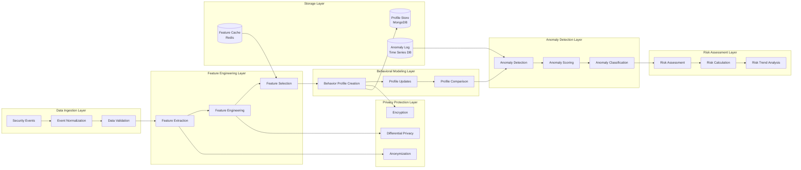

# Phase 8: Behavioral Analysis Pipeline Architecture

## 🎯 Overview

The Behavioral Analysis Pipeline provides comprehensive user behavior profiling, anomaly detection, and risk assessment capabilities while maintaining privacy and ethical AI principles. This pipeline processes security events in real-time to create behavioral fingerprints, detect deviations, and assess behavioral risks.

## 🏗️ Pipeline Architecture

### Behavioral Analysis Pipeline Flow



## 🔧 Core Pipeline Components

### 1. Event Ingestion and Normalization

#### Event Ingestion Service

```typescript
// event_ingestion_service.ts
interface EventIngestionService {
  // Ingest security events
  ingestEvents(events: SecurityEvent[]): Promise<IngestionResult>
  
  // Validate event format and content
  validateEvents(events: SecurityEvent[]): Promise<ValidationResult>
  
  // Normalize events to standard format
  normalizeEvents(events: SecurityEvent[]): Promise<NormalizedEvent[]>
  
  // Handle event streaming
  processEventStream(stream: EventStream): Promise<void>
  
  // Manage event backpressure
  handleBackpressure(metrics: IngestionMetrics): Promise<void>
}

class BehavioralEventIngestion implements EventIngestionService {
  private eventValidator: EventValidator
  private normalizer: EventNormalizer
  private streamProcessor: StreamProcessor
  private metricsCollector: MetricsCollector
  
  constructor(config: IngestionConfig) {
    this.eventValidator = new EventValidator(config.validationRules)
    this.normalizer = new EventNormalizer(config.normalizationSchema)
    this.streamProcessor = new StreamProcessor(config.streamConfig)
    this.metricsCollector = new MetricsCollector()
  }
  
  async ingestEvents(events: SecurityEvent[]): Promise<IngestionResult> {
    const startTime = Date.now()
    const results: IngestionResult = {
      totalEvents: events.length,
      validEvents: 0,
      invalidEvents: 0,
      normalizedEvents: [],
      errors: []
    }
    
    // Process events in batches for efficiency
    const batchSize = 1000
    for (let i = 0; i < events.length; i += batchSize) {
      const batch = events.slice(i, i + batchSize)
      
      try {
        // Validate batch
        const validationResult = await this.validateEvents(batch)
        results.validEvents += validationResult.validCount
        results.invalidEvents += validationResult.invalidCount
        
        // Normalize valid events
        const normalizedBatch = await this.normalizeEvents(validationResult.validEvents)
        results.normalizedEvents.push(...normalizedBatch)
        
      } catch (error) {
        results.errors.push({
          batchIndex: i,
          error: error.message,
          timestamp: Date.now()
        })
      }
    }
    
    // Collect metrics
    const processingTime = Date.now() - startTime
    await this.metricsCollector.recordIngestionMetrics({
      totalEvents: results.totalEvents,
      validEvents: results.validEvents,
      processingTime,
      throughput: results.totalEvents / (processingTime / 1000)
    })
    
    return results
  }
  
  async validateEvents(events: SecurityEvent[]): Promise<ValidationResult> {
    const validationTasks = events.map(event => this.eventValidator.validate(event))
    const results = await Promise.allSettled(validationTasks)
    
    const validEvents = []
    const invalidEvents = []
    const validationErrors = []
    
    results.forEach((result, index) => {
      if (result.status === 'fulfilled' && result.value.isValid) {
        validEvents.push(events[index])
      } else {
        invalidEvents.push(events[index])
        validationErrors.push({
          eventId: events[index].id,
          error: result.status === 'rejected' ? result.reason : result.value.errors
        })
      }
    })
    
    return {
      validCount: validEvents.length,
      invalidCount: invalidEvents.length,
      validEvents,
      invalidEvents,
      validationErrors
    }
  }
  
  async normalizeEvents(events: SecurityEvent[]): Promise<NormalizedEvent[]> {
    return Promise.all(events.map(event => this.normalizer.normalize(event)))
  }
}
```

#### Event Normalization Schema

```typescript
// normalization_schema.ts
interface NormalizationSchema {
  eventTypes: {
    [eventType: string]: {
      requiredFields: string[]
      optionalFields: string[]
      fieldMappings: { [sourceField: string]: string }
      valueTransformations: { [field: string]: ValueTransformer }
    }
  }
  commonFields: string[]
  timestampFormat: string
  userIdMapping: string
  sessionIdMapping: string
}

const behavioralAnalysisNormalizationSchema: NormalizationSchema = {
  eventTypes: {
    'login_attempt': {
      requiredFields: ['user_id', 'timestamp', 'ip_address', 'success'],
      optionalFields: ['user_agent', 'location', 'device_info'],
      fieldMappings: {
        'userAgent': 'user_agent',
        'ipAddress': 'ip_address',
        'isSuccess': 'success'
      },
      valueTransformations: {
        'timestamp': 'iso8601',
        'success': 'boolean',
        'location': 'geojson'
      }
    },
    'page_view': {
      requiredFields: ['user_id', 'timestamp', 'page_url', 'session_id'],
      optionalFields: ['referrer', 'time_on_page', 'interactions'],
      fieldMappings: {
        'pageUrl': 'page_url',
        'timeOnPage': 'time_on_page'
      },
      valueTransformations: {
        'timestamp': 'iso8601',
        'time_on_page': 'integer',
        'interactions': 'json'
      }
    },
    'api_call': {
      requiredFields: ['user_id', 'timestamp', 'endpoint', 'method', 'status_code'],
      optionalFields: ['response_time', 'payload_size', 'error_details'],
      fieldMappings: {
        'endpoint': 'endpoint',
        'method': 'method',
        'statusCode': 'status_code',
        'responseTime': 'response_time'
      },
      valueTransformations: {
        'timestamp': 'iso8601',
        'response_time': 'float',
        'payload_size': 'integer'
      }
    }
  },
  commonFields: ['user_id', 'session_id', 'timestamp', 'event_type'],
  timestampFormat: 'ISO8601',
  userIdMapping: 'user_id',
  sessionIdMapping: 'session_id'
}
```

### 2. Feature Engineering Pipeline

#### Feature Engineering Service

```typescript
// feature_engineering_service.ts
interface FeatureEngineeringService {
  // Extract features from normalized events
  extractFeatures(events: NormalizedEvent[]): Promise<FeatureVector>
  
  // Engineer behavioral features
  engineerBehavioralFeatures(events: NormalizedEvent[]): Promise<BehavioralFeatures>
  
  // Create temporal features
  createTemporalFeatures(events: NormalizedEvent[]): Promise<TemporalFeatures>
  
  // Generate aggregate features
  generateAggregateFeatures(events: NormalizedEvent[]): Promise<AggregateFeatures>
  
  // Select relevant features
  selectFeatures(features: FeatureVector): Promise<SelectedFeatures>
}

class BehavioralFeatureEngineering implements FeatureEngineeringService {
  private featureExtractors: Map<string, FeatureExtractor>
  private featureSelectors: FeatureSelector[]
  private dimensionalityReducer: DimensionalityReducer
  
  constructor(config: FeatureEngineeringConfig) {
    this.featureExtractors = this.initializeExtractors()
    this.featureSelectors = this.initializeSelectors()
    this.dimensionalityReducer = new DimensionalityReducer(config.reductionConfig)
  }
  
  async extractFeatures(events: NormalizedEvent[]): Promise<FeatureVector> {
    const features: FeatureVector = {
      userId: events[0]?.user_id,
      sessionId: events[0]?.session_id,
      temporal: await this.createTemporalFeatures(events),
      behavioral: await this.engineerBehavioralFeatures(events),
      aggregate: await this.generateAggregateFeatures(events),
      contextual: await this.extractContextualFeatures(events),
      timestamp: Date.now()
    }
    
    return features
  }
  
  async engineerBehavioralFeatures(events: NormalizedEvent[]): Promise<BehavioralFeatures> {
    const loginEvents = events.filter(e => e.event_type === 'login_attempt')
    const pageViewEvents = events.filter(e => e.event_type === 'page_view')
    const apiEvents = events.filter(e => e.event_type === 'api_call')
    
    return {
      // Login behavior features
      loginFrequency: this.calculateLoginFrequency(loginEvents),
      failedLoginRate: this.calculateFailedLoginRate(loginEvents),
      loginTimePatterns: this.analyzeLoginTimePatterns(loginEvents),
      geographicLoginPatterns: this.analyzeGeographicPatterns(loginEvents),
      
      // Navigation behavior features
      pageViewSequence: this.extractPageViewSequence(pageViewEvents),
      navigationDepth: this.calculateNavigationDepth(pageViewEvents),
      timeOnPageDistribution: this.analyzeTimeOnPage(pageViewEvents),
      interactionPatterns: this.extractInteractionPatterns(pageViewEvents),
      
      // API usage features
      apiCallFrequency: this.calculateApiCallFrequency(apiEvents),
      apiUsagePatterns: this.analyzeApiUsagePatterns(apiEvents),
      errorRate: this.calculateErrorRate(apiEvents),
      responseTimePatterns: this.analyzeResponseTimes(apiEvents),
      
      // Cross-behavioral features
      sessionConsistency: this.calculateSessionConsistency(events),
      behaviorEntropy: this.calculateBehaviorEntropy(events),
      routineDeviation: this.detectRoutineDeviation(events)
    }
  }
  
  private calculateLoginFrequency(events: NormalizedEvent[]): number {
    const timeWindow = 24 * 60 * 60 * 1000 // 24 hours
    const recentLogins = events.filter(e => 
      Date.now() - new Date(e.timestamp).getTime() < timeWindow
    )
    return recentLogins.length
  }
  
  private calculateFailedLoginRate(events: NormalizedEvent[]): number {
    if (events.length === 0) return 0
    const failedLogins = events.filter(e => !e.success)
    return failedLogins.length / events.length
  }
  
  private analyzeLoginTimePatterns(events: NormalizedEvent[]): TimePattern {
    const loginTimes = events.map(e => new Date(e.timestamp).getHours())
    const timeDistribution = this.calculateTimeDistribution(loginTimes)
    
    return {
      preferredHour: this.findMode(loginTimes),
      timeDistribution,
      entropy: this.calculateEntropy(timeDistribution),
      regularityScore: this.calculateRegularity(timeDistribution)
    }
  }
  
  private extractPageViewSequence(events: NormalizedEvent[]): string[] {
    return events
      .sort((a, b) => new Date(a.timestamp).getTime() - new Date(b.timestamp).getTime())
      .map(e => e.page_url)
  }
  
  private calculateBehaviorEntropy(events: NormalizedEvent[]): number {
    const eventTypes = events.map(e => e.event_type)
    const typeDistribution = this.calculateDistribution(eventTypes)
    return this.calculateEntropy(typeDistribution)
  }
}
```

#### Feature Selection and Dimensionality Reduction

```typescript
// feature_selection_service.ts
interface FeatureSelectionService {
  // Select most relevant features
  selectFeatures(features: FeatureVector[], labels: number[]): Promise<SelectedFeatures>
  
  // Apply dimensionality reduction
  reduceDimensionality(features: number[][]): Promise<ReducedFeatures>
  
  // Calculate feature importance
  calculateFeatureImportance(features: FeatureVector[], labels: number[]): Promise<FeatureImportance[]>
  
  // Remove correlated features
  removeCorrelatedFeatures(features: FeatureVector[]): Promise<FeatureVector[]>
  
  // Validate feature quality
  validateFeatureQuality(features: FeatureVector[]): Promise<FeatureQualityReport>
}

class BehavioralFeatureSelector implements FeatureSelectionService {
  private selectors: FeatureSelector[]
  private reducers: DimensionalityReducer[]
  
  constructor(config: FeatureSelectionConfig) {
    this.selectors = this.initializeSelectors(config)
    this.reducers = this.initializeReducers(config)
  }
  
  async selectFeatures(features: FeatureVector[], labels: number[]): Promise<SelectedFeatures> {
    // Convert features to numerical matrix
    const featureMatrix = this.convertToMatrix(features)
    
    // Apply multiple selection methods
    const selectionResults = await Promise.all(
      this.selectors.map(selector => selector.select(featureMatrix, labels))
    )
    
    // Combine selection results
    const selectedIndices = this.combineSelections(selectionResults)
    const selectedFeatures = this.selectFeaturesByIndex(features, selectedIndices)
    
    // Calculate feature importance scores
    const importanceScores = await this.calculateFeatureImportance(features, labels)
    
    return {
      selectedFeatures,
      selectedIndices,
      importanceScores,
      selectionMethod: 'ensemble',
      featureCount: selectedFeatures.length,
      originalCount: features.length
    }
  }
  
  async reduceDimensionality(features: number[][]): Promise<ReducedFeatures> {
    // Apply PCA for dimensionality reduction
    const pcaResult = await this.applyPCA(features, {
      nComponents: 0.95, // Keep 95% of variance
      whiten: true,
      svdSolver: 'auto'
    })
    
    // Apply t-SNE for visualization
    const tsneResult = await this.applyTSNE(features, {
      nComponents: 2,
      perplexity: 30,
      learningRate: 200,
      nIter: 1000
    })
    
    return {
      reducedFeatures: pcaResult.transformed,
      explainedVariance: pcaResult.explainedVariance,
      components: pcaResult.components,
      visualization: tsneResult.embedding,
      reductionMethod: 'PCA+t-SNE'
    }
  }
  
  private async applyPCA(data: number[][], config: PCAConfig): Promise<PCAResult> {
    // Implementation using scikit-learn via Python service
    const response = await this.pythonService.call('sklearn.decomposition.PCA', {
      data,
      config
    })
    
    return {
      transformed: response.transformed_data,
      explainedVariance: response.explained_variance_ratio,
      components: response.components_,
      singularValues: response.singular_values_
    }
  }
}
```

### 3. Behavioral Profile Creation and Management

#### User Behavior Profiler

```typescript
// user_behavior_profiler.ts
interface UserBehaviorProfiler {
  // Create comprehensive behavior profile
  createProfile(userId: string, events: NormalizedEvent[]): Promise<BehaviorProfile>
  
  // Update existing profile with new events
  updateProfile(profile: BehaviorProfile, newEvents: NormalizedEvent[]): Promise<BehaviorProfile>
  
  // Compare two behavior profiles
  compareProfiles(profile1: BehaviorProfile, profile2: BehaviorProfile): Promise<ProfileSimilarity>
  
  // Track profile evolution over time
  trackEvolution(userId: string, timeframe: TimeWindow): Promise<ProfileEvolution>
  
  // Create privacy-preserving profile
  createPrivateProfile(events: NormalizedEvent[]): Promise<PrivateBehaviorProfile>
}

interface BehaviorProfile {
  profileId: string
  userId: string
  temporalFingerprint: TemporalFingerprint
  behavioralFingerprint: BehavioralFingerprint
  geographicFingerprint: GeographicFingerprint
  deviceFingerprint: DeviceFingerprint
  networkFingerprint: NetworkFingerprint
  confidenceScore: number
  lastUpdated: Date
  privacyLevel: PrivacyLevel
  version: number
}

class ComprehensiveBehaviorProfiler implements UserBehaviorProfiler {
  private profileBuilders: Map<string, ProfileBuilder>
  private similarityCalculator: SimilarityCalculator
  private privacyPreserver: PrivacyPreserver
  
  constructor(config: ProfilerConfig) {
    this.profileBuilders = this.initializeBuilders()
    this.similarityCalculator = new SimilarityCalculator()
    this.privacyPreserver = new PrivacyPreserver(config.privacyConfig)
  }
  
  async createProfile(userId: string, events: NormalizedEvent[]): Promise<BehaviorProfile> {
    // Group events by type for specialized processing
    const eventGroups = this.groupEventsByType(events)
    
    // Build comprehensive fingerprint
    const temporalFingerprint = await this.buildTemporalFingerprint(eventGroups)
    const behavioralFingerprint = await this.buildBehavioralFingerprint(eventGroups)
    const geographicFingerprint = await this.buildGeographicFingerprint(eventGroups)
    const deviceFingerprint = await this.buildDeviceFingerprint(eventGroups)
    const networkFingerprint = await this.buildNetworkFingerprint(eventGroups)
    
    // Calculate confidence score
    const confidenceScore = this.calculateConfidenceScore({
      temporalFingerprint,
      behavioralFingerprint,
      geographicFingerprint,
      deviceFingerprint,
      networkFingerprint
    }, events.length)
    
    return {
      profileId: this.generateProfileId(userId),
      userId,
      temporalFingerprint,
      behavioralFingerprint,
      geographicFingerprint,
      deviceFingerprint,
      networkFingerprint,
      confidenceScore,
      lastUpdated: new Date(),
      privacyLevel: 'standard',
      version: 1
    }
  }
  
  private async buildTemporalFingerprint(eventGroups: EventGroups): Promise<TemporalFingerprint> {
    const allEvents = Object.values(eventGroups).flat()
    
    return {
      // Daily patterns
      dailyActivityPattern: this.analyzeDailyPatterns(allEvents),
      weeklyActivityPattern: this.analyzeWeeklyPatterns(allEvents),
      monthlyActivityPattern: this.analyzeMonthlyPatterns(allEvents),
      
      // Session patterns
      sessionDurationDistribution: this.analyzeSessionDurations(allEvents),
      interSessionIntervals: this.analyzeInterSessionIntervals(allEvents),
      peakActivityHours: this.findPeakActivityHours(allEvents),
      
      // Routine indicators
      routineConsistency: this.calculateRoutineConsistency(allEvents),
      patternStability: this.calculatePatternStability(allEvents),
      predictabilityScore: this.calculatePredictability(allEvents)
    }
  }
  
  private async buildBehavioralFingerprint(eventGroups: EventGroups): Promise<BehavioralFingerprint> {
    const loginEvents = eventGroups.login_attempt || []
    const pageViewEvents = eventGroups.page_view || []
    const apiEvents = eventGroups.api_call || []
    
    return {
      // Login behavior
      loginPatterns: this.analyzeLoginPatterns(loginEvents),
      authenticationBehavior: this.analyzeAuthenticationBehavior(loginEvents),
      passwordResetFrequency: this.calculatePasswordResetFrequency(loginEvents),
      
      // Navigation behavior
      navigationSequences: this.extractNavigationSequences(pageViewEvents),
      pageInteractionPatterns: this.analyzePageInteractions(pageViewEvents),
      contentPreferences: this.identifyContentPreferences(pageViewEvents),
      
      // API usage behavior
      apiUsagePatterns: this.analyzeApiUsagePatterns(apiEvents),
      endpointPreferences: this.identifyEndpointPreferences(apiEvents),
      errorResponseBehavior: this.analyzeErrorResponses(apiEvents),
      
      // Cross-behavioral patterns
      multiStepProcessCompletion: this.analyzeMultiStepProcesses(eventGroups),
      taskSwitchingFrequency: this.calculateTaskSwitching(eventGroups),
      behavioralConsistency: this.measureBehavioralConsistency(eventGroups)
    }
  }
  
  private analyzeDailyPatterns(events: NormalizedEvent[]): DailyPattern {
    const hourlyDistribution = new Array(24).fill(0)
    const dayOfWeekDistribution = new Array(7).fill(0)
    
    events.forEach(event => {
      const date = new Date(event.timestamp)
      hourlyDistribution[date.getHours()]++
      dayOfWeekDistribution[date.getDay()]++
    })
    
    return {
      hourlyActivity: hourlyDistribution,
      dayOfWeekActivity: dayOfWeekDistribution,
      preferredActivityHours: this.findTopN(hourlyDistribution, 3),
      preferredDays: this.findTopN(dayOfWeekDistribution, 2),
      activityEntropy: this.calculateEntropy(hourlyDistribution)
    }
  }
  
  private calculateRoutineConsistency(events: NormalizedEvent[]): number {
    const dailyPatterns = this.groupByDay(events)
    const patternSimilarities = []
    
    for (let i = 1; i < dailyPatterns.length; i++) {
      const similarity = this.calculatePatternSimilarity(
        dailyPatterns[i - 1],
        dailyPatterns[i]
      )
      patternSimilarities.push(similarity)
    }
    
    return patternSimilarities.length > 0 
      ? patternSimilarities.reduce((a, b) => a + b, 0) / patternSimilarities.length
      : 0
  }
}
```

### 4. Anomaly Detection Engine

#### Multi-Algorithm Anomaly Detection

```typescript
// anomaly_detection_engine.ts
interface AnomalyDetectionEngine {
  // Detect anomalies using multiple algorithms
  detectAnomalies(profile: BehaviorProfile, currentEvents: NormalizedEvent[]): Promise<Anomaly[]>
  
  // Real-time anomaly detection
  detectAnomaliesRealtime(eventStream: EventStream): Promise<RealtimeAnomaly[]>
  
  // Score anomaly severity
  scoreAnomaly(anomaly: Anomaly): Promise<AnomalyScore>
  
  // Classify anomaly type
  classifyAnomaly(anomaly: Anomaly): Promise<AnomalyClassification>
  
  // Adaptive threshold adjustment
  adaptThresholds(feedback: AnomalyFeedback): Promise<void>
}

interface Anomaly {
  anomalyId: string
  anomalyType: AnomalyType
  severity: SeverityLevel
  confidence: number
  deviationScore: number
  affectedBehaviors: BehaviorType[]
  contextualInformation: ContextualInfo
  temporalInformation: TemporalInfo
  explanation: AnomalyExplanation
}

class BehavioralAnomalyDetectionEngine implements AnomalyDetectionEngine {
  private detectors: Map<string, AnomalyDetector>
  private ensembleVoter: EnsembleVoter
  private thresholdManager: AdaptiveThresholdManager
  private explanationGenerator: ExplanationGenerator
  
  constructor(config: AnomalyDetectionConfig) {
    this.detectors = this.initializeDetectors(config)
    this.ensembleVoter = new EnsembleVoter(config.ensembleConfig)
    this.thresholdManager = new AdaptiveThresholdManager(config.thresholdConfig)
    this.explanationGenerator = new ExplanationGenerator()
  }
  
  async detectAnomalies(profile: BehaviorProfile, currentEvents: NormalizedEvent[]): Promise<Anomaly[]> {
    // Extract current behavior features
    const currentFeatures = await this.extractCurrentFeatures(currentEvents)
    
    // Run multiple detection algorithms
    const detectionPromises = Array.from(this.detectors.values()).map(detector =>
      detector.detect(profile, currentFeatures)
    )
    
    const detectionResults = await Promise.all(detectionPromises)
    
    // Ensemble voting
    const ensembleResults = await this.ensembleVoter.vote(detectionResults)
    
    // Filter by adaptive thresholds
    const filteredAnomalies = await this.thresholdManager.filterByThresholds(ensembleResults)
    
    // Generate explanations
    const anomaliesWithExplanations = await Promise.all(
      filteredAnomalies.map(async anomaly => ({
        ...anomaly,
        explanation: await this.explanationGenerator.generate(anomaly)
      }))
    )
    
    return anomaliesWithExplanations
  }
  
  private initializeDetectors(config: AnomalyDetectionConfig): Map<string, AnomalyDetector> {
    const detectors = new Map()
    
    // Statistical-based detectors
    detectors.set('statistical', new StatisticalAnomalyDetector(config.statisticalConfig))
    detectors.set('zscore', new ZScoreAnomalyDetector(config.zscoreConfig))
    detectors.set('iqr', new IQRAnomalyDetector(config.iqrConfig))
    
    // Machine learning detectors
    detectors.set('isolation_forest', new IsolationForestDetector(config.isolationForestConfig))
    detectors.set('one_class_svm', new OneClassSVMDetector(config.svmConfig))
    detectors.set('autoencoder', new AutoencoderAnomalyDetector(config.autoencoderConfig))
    
    // Time series detectors
    detectors.set('prophet', new ProphetAnomalyDetector(config.prophetConfig))
    detectors.set('lstm', new LSTMAnomalyDetector(config.lstmConfig))
    
    // Graph-based detectors
    detectors.set('graph_based', new GraphBasedAnomalyDetector(config.graphConfig))
    
    return detectors
  }
}

// Statistical Anomaly Detector
class StatisticalAnomalyDetector implements AnomalyDetector {
  async detect(profile: BehaviorProfile, currentFeatures: FeatureVector): Promise<AnomalyDetection> {
    const anomalies: Anomaly[] = []
    
    // Z-score based detection
    const zscoreAnomalies = this.detectZscoreAnomalies(profile, currentFeatures)
    anomalies.push(...zscoreAnomalies)
    
    // Interquartile Range (IQR) based detection
    const iqrAnomalies = this.detectIQRAnomalies(profile, currentFeatures)
    anomalies.push(...iqrAnomalies)
    
    // Statistical tests
    const testAnomalies = this.performStatisticalTests(profile, currentFeatures)
    anomalies.push(...testAnomalies)
    
    return {
      detectorName: 'statistical',
      anomalies,
      confidence: this.calculateOverallConfidence(anomalies),
      processingTime: Date.now()
    }
  }
  
  private detectZscoreAnomalies(profile: BehaviorProfile, features: FeatureVector): Anomaly[] {
    const anomalies: Anomaly[] = []
    const threshold = 2.5 // Z-score threshold
    
    // Compare each feature with profile baseline
    Object.entries(features.behavioral).forEach(([feature, value]) => {
      const baseline = this.getBaselineValue(profile, feature)
      const zscore = Math.abs((value - baseline.mean) / baseline.std)
      
      if (zscore > threshold) {
        anomalies.push({
          anomalyId: this.generateAnomalyId('zscore', feature),
          anomalyType: 'STATISTICAL_DEVIATION',
          severity: this.calculateSeverityFromZscore(zscore),
          confidence: Math.min(zscore / 4, 1.0), // Normalize confidence
          deviationScore: zscore,
          affectedBehaviors: [feature as BehaviorType],
          contextualInformation: {
            expectedValue: baseline.mean,
            actualValue: value,
            deviation: value - baseline.mean,
            standardDeviations: zscore
          },
          temporalInformation: {
            detectionTime: Date.now(),
            baselinePeriod: baseline.period
          },
          explanation: {
            type: 'ZSCORE_DEVIATION',
            description: `Feature ${feature} deviates ${zscore.toFixed(2)} standard deviations from baseline`,
            contributingFactors: [`Unexpected value: ${value}`, `Expected range: ${baseline.mean} ± ${threshold * baseline.std}`]
          }
        })
      }
    })
    
    return anomalies
  }
}

// Machine Learning Anomaly Detector
class IsolationForestDetector implements AnomalyDetector {
  private model: any // Isolation Forest model
  private featureScaler: any // Feature scaler
  
  constructor(config: IsolationForestConfig) {
    this.initializeModel(config)
  }
  
  async detect(profile: BehaviorProfile, currentFeatures: FeatureVector): Promise<AnomalyDetection> {
    // Prepare features for model
    const featureVector = this.prepareFeatureVector(currentFeatures)
    const scaledFeatures = this.featureScaler.transform(featureVector)
    
    // Predict anomaly score
    const anomalyScore = this.model.decision_function(scaledFeatures)[0]
    const isAnomaly = this.model.predict(scaledFeatures)[0] === -1
    
    if (isAnomaly) {
      const anomaly: Anomaly = {
        anomalyId: this.generateAnomalyId('isolation_forest'),
        anomalyType: 'ML_ISOLATION',
        severity: this.calculateSeverityFromScore(anomalyScore),
        confidence: Math.abs(anomalyScore),
        deviationScore: Math.abs(anomalyScore),
        affectedBehaviors: this.identifyAffectedBehaviors(currentFeatures, anomalyScore),
        contextualInformation: {
          isolationScore: anomalyScore,
          modelType: 'IsolationForest',
          featureContributions: this.getFeatureContributions(scaledFeatures)
        },
        temporalInformation: {
          detectionTime: Date.now(),
          modelTrainingTime: this.model.trainingTime
        },
        explanation: {
          type: 'ISOLATION_FOREST',
          description: 'Behavior pattern isolated as anomalous by ensemble trees',
          contributingFactors: this.generateMLContributingFactors(scaledFeatures, anomalyScore)
        }
      }
      
      return {
        detectorName: 'isolation_forest',
        anomalies: [anomaly],
        confidence: Math.abs(anomalyScore),
        processingTime: Date.now()
      }
    }
    
    return {
      detectorName: 'isolation_forest',
      anomalies: [],
      confidence: 1.0 - Math.abs(anomalyScore),
      processingTime: Date.now()
    }
  }
}
```

### 5. Risk Assessment Engine

#### Behavioral Risk Calculator

```typescript
// risk_assessment_engine.ts
interface RiskAssessmentEngine {
  // Assess risk based on behavioral anomalies
  assessRisk(profile: BehaviorProfile, anomalies: Anomaly[]): Promise<RiskAssessment>
  
  // Calculate dynamic risk score
  calculateDynamicRisk(currentBehavior: NormalizedEvent[], historicalProfile: BehaviorProfile): Promise<DynamicRiskScore>
  
  // Analyze risk trends
  analyzeRiskTrends(userId: string, timeframe: TimeWindow): Promise<RiskTrendAnalysis>
  
  // Identify risk factors
  identifyRiskFactors(profile: BehaviorProfile): Promise<RiskFactor[]>
  
  // Recommend risk mitigations
  recommendMitigations(riskAssessment: RiskAssessment): Promise<RiskMitigation[]>
}

interface RiskAssessment {
  riskScore: number
  riskLevel: RiskLevel
  confidence: number
  contributingFactors: RiskFactor[]
  temporalTrend: RiskTrend
  mitigationRecommendations: RiskMitigation[]
  explanation: RiskExplanation
  lastCalculated: Date
}

class BehavioralRiskAssessmentEngine implements RiskAssessmentEngine {
  private riskCalculators: Map<string, RiskCalculator>
  private trendAnalyzer: RiskTrendAnalyzer
  private mitigationRecommender: MitigationRecommender
  private confidenceEstimator: ConfidenceEstimator
  
  constructor(config: RiskAssessmentConfig) {
    this.riskCalculators = this.initializeRiskCalculators(config)
    this.trendAnalyzer = new RiskTrendAnalyzer(config.trendConfig)
    this.mitigationRecommender = new MitigationRecommender(config.mitigationConfig)
    this.confidenceEstimator = new ConfidenceEstimator(config.confidenceConfig)
  }
  
  async assessRisk(profile: BehaviorProfile, anomalies: Anomaly[]): Promise<RiskAssessment> {
    // Calculate base risk from anomalies
    const anomalyRisk = this.calculateAnomalyRisk(anomalies)
    
    // Calculate behavioral risk
    const behavioralRisk = this.calculateBehavioralRisk(profile)
    
    // Calculate contextual risk
    const contextualRisk = this.calculateContextualRisk(profile, anomalies)
    
    // Combine risk factors
    const combinedRisk = this.combineRiskFactors([
      { type: 'anomaly', score: anomalyRisk.score, weight: anomalyRisk.weight },
      { type: 'behavioral', score: behavioralRisk.score, weight: behavioralRisk.weight },
      { type: 'contextual', score: contextualRisk.score, weight: contextualRisk.weight }
    ])
    
    // Identify contributing factors
    const contributingFactors = this.identifyContributingFactors(
      anomalies, profile, combinedRisk
    )
    
    // Calculate confidence
    const confidence = await this.confidenceEstimator.estimate(
      profile, anomalies, contributingFactors
    )
    
    // Generate explanation
    const explanation = this.generateRiskExplanation(
      combinedRisk, contributingFactors, confidence
    )
    
    return {
      riskScore: combinedRisk.finalScore,
      riskLevel: this.determineRiskLevel(combinedRisk.finalScore),
      confidence,
      contributingFactors,
      temporalTrend: await this.trendAnalyzer.analyze(profile.userId),
      mitigationRecommendations: await this.mitigationRecommender.recommend(combinedRisk),
      explanation,
      lastCalculated: new Date()
    }
  }
  
  private calculateAnomalyRisk(anomalies: Anomaly[]): RiskComponent {
    if (anomalies.length === 0) {
      return { score: 0, weight: 0.4 }
    }
    
    // Weight anomalies by severity and confidence
    const weightedScore = anomalies.reduce((total, anomaly) => {
      const severityWeight = this.getSeverityWeight(anomaly.severity)
      const confidenceWeight = anomaly.confidence
      return total + (severityWeight * confidenceWeight)
    }, 0)
    
    // Normalize by number of anomalies (with diminishing returns)
    const normalizedScore = Math.min(weightedScore / Math.log(anomalies.length + 1), 1)
    
    return {
      score: normalizedScore,
      weight: 0.4,
      details: {
        anomalyCount: anomalies.length,
        severityDistribution: this.analyzeSeverityDistribution(anomalies),
        confidenceDistribution: this.analyzeConfidenceDistribution(anomalies)
      }
    }
  }
  
  private calculateBehavioralRisk(profile: BehaviorProfile): RiskComponent {
    const riskIndicators = []
    
    // Analyze temporal patterns
    const temporalRisk = this.assessTemporalRisk(profile.temporalFingerprint)
    riskIndicators.push(temporalRisk)
    
    // Analyze behavioral patterns
    const behavioralRisk = this.assessBehavioralRisk(profile.behavioralFingerprint)
    riskIndicators.push(behavioralRisk)
    
    // Analyze geographic patterns
    const geographicRisk = this.assessGeographicRisk(profile.geographicFingerprint)
    riskIndicators.push(geographicRisk)
    
    // Analyze device patterns
    const deviceRisk = this.assessDeviceRisk(profile.deviceFingerprint)
    riskIndicators.push(deviceRisk)
    
    // Combine risk indicators
    const combinedScore = this.combineRiskIndicators(riskIndicators)
    
    return {
      score: combinedScore,
      weight: 0.35,
      details: {
        riskIndicators,
        confidenceScore: profile.confidenceScore,
        profileAge: Date.now() - profile.lastUpdated.getTime()
      }
    }
  }
  
  private assessTemporalRisk(temporalFingerprint: TemporalFingerprint): RiskIndicator {
    const riskFactors = []
    let riskScore = 0
    
    // Check for unusual activity times
    const currentHour = new Date().getHours()
    if (!temporalFingerprint.preferredActivityHours.includes(currentHour)) {
      riskFactors.push('activity_outside_preferred_hours')
      riskScore += 0.3
    }
    
    // Check for low routine consistency
    if (temporalFingerprint.routineConsistency < 0.5) {
      riskFactors.push('low_routine_consistency')
      riskScore += 0.2
    }
    
    // Check for high entropy (unpredictable behavior)
    if (temporalFingerprint.dailyActivityPattern.activityEntropy > 0.8) {
      riskFactors.push('high_behavioral_entropy')
      riskScore += 0.25
    }
    
    return {
      type: 'temporal',
      score: Math.min(riskScore, 1),
      factors: riskFactors,
      description: 'Risk based on temporal behavior patterns'
    }
  }
  
  private combineRiskFactors(factors: RiskFactor[]): CombinedRisk {
    // Weighted average of risk factors
    const totalWeight = factors.reduce((sum, factor) => sum + factor.weight, 0)
    const weightedScore = factors.reduce((sum, factor) => 
      sum + (factor.score * factor.weight), 0
    )
    
    const finalScore = weightedScore / totalWeight
    
    return {
      finalScore,
      components: factors,
      calculationMethod: 'weighted_average',
      timestamp: Date.now()
    }
  }
  
  private determineRiskLevel(score: number): RiskLevel {
    if (score >= 0.8) return 'CRITICAL'
    if (score >= 0.6) return 'HIGH'
    if (score >= 0.4) return 'MEDIUM'
    if (score >= 0.2) return 'LOW'
    return 'MINIMAL'
  }
}
```

## 🔒 Privacy-Preserving Behavioral Analysis

### Differential Privacy Implementation

```typescript
// differential_privacy_service.ts
interface DifferentialPrivacyService {
  // Apply differential privacy to behavioral data
  applyDifferentialPrivacy(data: BehavioralData[], epsilon: number): Promise<PrivateBehavioralData[]>
  
  // Manage privacy budget
  managePrivacyBudget(queries: BehavioralQuery[]): Promise<BudgetAllocation>
  
  // Calculate privacy loss
  calculatePrivacyLoss(interactions: PrivacyInteraction[]): Promise<PrivacyLossReport>
  
  // Optimize privacy-utility tradeoff
  optimizePrivacyUtility(analysis: BehavioralAnalysis, privacyBudget: number): Promise<OptimizedPrivateAnalysis>
}

class BehavioralDifferentialPrivacy implements DifferentialPrivacyService {
  private privacyBudgetManager: PrivacyBudgetManager
  private noiseGenerator: NoiseGenerator
  private sensitivityAnalyzer: SensitivityAnalyzer
  
  constructor(config: DifferentialPrivacyConfig) {
    this.privacyBudgetManager = new PrivacyBudgetManager(config.budgetConfig)
    this.noiseGenerator = new NoiseGenerator(config.noiseConfig)
    this.sensitivityAnalyzer = new SensitivityAnalyzer()
  }
  
  async applyDifferentialPrivacy(
    data: BehavioralData[], 
    epsilon: number
  ): Promise<PrivateBehavioralData[]> {
    const privateData: PrivateBehavioralData[] = []
    
    for (const record of data) {
      // Calculate sensitivity for each feature
      const sensitivities = await this.sensitivityAnalyzer.calculateSensitivities(record)
      
      // Generate noise for each feature
      const noisyRecord: PrivateBehavioralData = {
        userId: this.hashUserId(record.userId), // Anonymize user ID
        temporalFeatures: await this.addNoise(record.temporalFeatures, sensitivities.temporal, epsilon),
        behavioralFeatures: await this.addNoise(record.behavioralFeatures, sensitivities.behavioral, epsilon),
        aggregateFeatures: await this.addNoise(record.aggregateFeatures, sensitivities.aggregate, epsilon),
        privacyParameters: {
          epsilon,
          sensitivity: sensitivities,
          noiseMechanism: 'Laplace'
        },
        timestamp: record.timestamp
      }
      
      privateData.push(noisyRecord)
    }
    
    return privateData
  }
  
  private async addNoise(
    features: Record<string, number>, 
    sensitivities: Record<string, number>, 
    epsilon: number
  ): Promise<Record<string, number>> {
    const noisyFeatures: Record<string, number> = {}
    
    for (const [feature, value] of Object.entries(features)) {
      const sensitivity = sensitivities[feature] || 1.0
      const scale = sensitivity / epsilon
      
      // Add Laplace noise
      const noise = this.noiseGenerator.generateLaplaceNoise(0, scale)
      noisyFeatures[feature] = value + noise
    }
    
    return noisyFeatures
  }
  
  private hashUserId(userId: string): string {
    // Use cryptographic hash for user ID anonymization
    return crypto.createHash('sha256').update(userId).digest('hex')
  }
}
```

## 📊 Performance Optimization

### Pipeline Performance Metrics

```typescript
// pipeline_performance_metrics.ts
interface PipelinePerformanceMetrics {
  // Processing metrics
  ingestionThroughput: number
  processingLatency: number
  featureExtractionTime: number
  anomalyDetectionTime: number
  riskAssessmentTime: number
  
  // Accuracy metrics
  anomalyDetectionAccuracy: number
  falsePositiveRate: number
  falseNegativeRate: number
  riskPredictionAccuracy: number
  
  // Resource metrics
  memoryUsage: number
  cpuUtilization: number
  storageUtilization: number
  networkBandwidth: number
  
  // Privacy metrics
  privacyLoss: number
  differentialPrivacyEpsilon: number
  anonymizationEffectiveness: number
}
```

### Caching and Optimization Strategies

```typescript
// caching_service.ts
interface BehavioralCachingService {
  // Cache behavior profiles
  cacheProfile(profile: BehaviorProfile): Promise<void>
  
  // Cache feature vectors
  cacheFeatures(features: FeatureVector): Promise<void>
  
  // Cache anomaly detection results
  cacheAnomalyResult(result: AnomalyDetection): Promise<void>
  
  // Implement intelligent cache eviction
  evictStaleData(): Promise<void>
  
  // Precompute common patterns
  precomputePatterns(): Promise<void>
}

class IntelligentBehavioralCache implements BehavioralCachingService {
  private redisClient: RedisClient
  private localCache: Map<string, CachedItem>
  private patternCache: Map<string, PatternCache>
  
  async cacheProfile(profile: BehaviorProfile): Promise<void> {
    const cacheKey = `profile:${profile.userId}:${profile.version}`
    const cacheValue = {
      profile,
      timestamp: Date.now(),
      ttl: 24 * 60 * 60 * 1000 // 24 hours
    }
    
    // Cache in Redis with TTL
    await this.redisClient.setex(
      cacheKey,
      86400, // 24 hours
      JSON.stringify(cacheValue)
    )
    
    // Cache locally for fast access
    this.localCache.set(cacheKey, cacheValue)
  }
  
  async precomputePatterns(): Promise<void> {
    // Precompute common behavioral patterns
    const commonPatterns = [
      'normal_login_pattern',
      'weekend_activity_pattern',
      'business_hours_pattern',
      'mobile_device_pattern',
      'api_usage_pattern'
    ]
    
    for (const pattern of commonPatterns) {
      const precomputed = await this.computePattern(pattern)
      await this.cachePattern(pattern, precomputed)
    }
  }
}
```

## 🚀 Deployment Architecture

### Kubernetes Deployment for Behavioral Pipeline

```yaml
# behavioral-pipeline-deployment.yaml
apiVersion: apps/v1
kind: Deployment
metadata:
  name: behavioral-analysis-pipeline
  namespace: threat-detection
spec:
  replicas: 5
  selector:
    matchLabels:
      app: behavioral-analysis-pipeline
  template:
    metadata:
      labels:
        app: behavioral-analysis-pipeline
    spec:
      containers:
      - name: event-ingestion
        image: pixelated/behavioral-event-ingestion:latest
        ports:
        - containerPort: 8080
          name: ingestion-api
        env:
        - name: KAFKA_BROKERS
          value: "kafka-cluster:9092"
        - name: REDIS_URL
          value: "redis://redis-cluster:6379"
        - name: MONGODB_URI
          value: "mongodb://mongodb:27017/behavioral_analysis"
        resources:
          requests:
            memory: "1Gi"
            cpu: "500m"
          limits:
            memory: "2Gi"
            cpu: "1000m"
            
      - name: feature-engineering
        image: pixelated/behavioral-feature-engineering:latest
        ports:
        - containerPort: 8081
          name: feature-api
        env:
        - name: FEATURE_STORE_URL
          value: "redis://feature-store:6379"
        - name: MODEL_SERVING_URL
          value: "http://model-server:8501"
        resources:
          requests:
            memory: "2Gi"
            cpu: "1000m"
          limits:
            memory: "4Gi"
            cpu: "2000m"
            
      - name: anomaly-detection
        image: pixelated/behavioral-anomaly-detection:latest
        ports:
        - containerPort: 8082
          name: anomaly-api
        env:
        - name: DETECTION_MODELS_PATH
          value: "/models/anomaly_detection"
        - name: GPU_ENABLED
          value: "true"
        resources:
          requests:
            memory: "4Gi"
            cpu: "2000m"
            nvidia.com/gpu: "1"
          limits:
            memory: "8Gi"
            cpu: "4000m"
            nvidia.com/gpu: "1"
            
      - name: risk-assessment
        image: pixelated/behavioral-risk-assessment:latest
        ports:
        - containerPort: 8083
          name: risk-api
        env:
        - name: RISK_MODELS_PATH
          value: "/models/risk_assessment"
        - name: THRESHOLDS_CONFIG
          value: "/config/risk_thresholds.json"
        resources:
          requests:
            memory: "1Gi"
            cpu: "500m"
          limits:
            memory: "2Gi"
            cpu: "1000m"
```

This comprehensive behavioral analysis pipeline architecture provides robust, scalable, and privacy-preserving behavioral analysis capabilities while maintaining high performance and accuracy for the Phase 8 threat detection system.