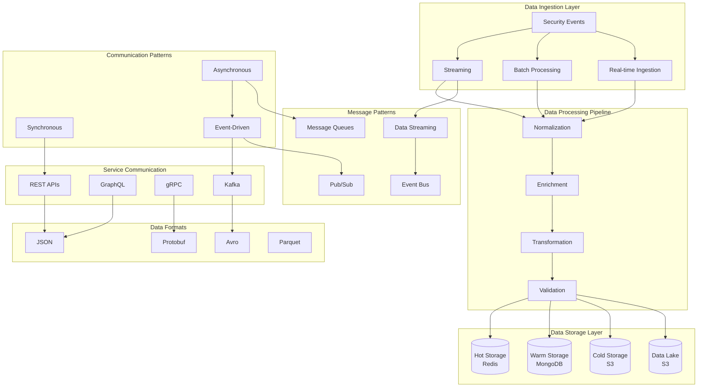

# Phase 8: Data Flow and Communication Patterns Architecture

## 🎯 Overview

The Data Flow and Communication Patterns architecture defines how data moves through the Phase 8 AI Threat Detection system, establishing clear communication protocols, data transformation pipelines, event-driven architectures, and real-time streaming patterns. This ensures efficient, reliable, and secure data flow while maintaining system performance and data integrity.

## 🏗️ Data Flow Architecture

### System-Wide Data Flow Overview



## 🔧 Core Data Flow Components

### 1. Event Streaming Architecture

#### Real-time Event Processing Pipeline

```typescript
// event_streaming_architecture.ts
interface EventStreamingArchitecture {
  // Publish events to stream
  publishEvent(event: SecurityEvent): Promise<PublishResult>
  
  // Subscribe to event streams
  subscribeToStream(streamConfig: StreamConfig): Promise<EventSubscription>
  
  // Process event streams
  processEventStream(processingConfig: ProcessingConfig): Promise<ProcessingResult>
  
  // Manage stream state
  manageStreamState(streamId: string): Promise<StreamState>
  
  // Handle stream failures
  handleStreamFailure(failure: StreamFailure): Promise<FailureRecovery>
}

interface SecurityEvent {
  eventId: string
  eventType: EventType
  timestamp: Date
  source: EventSource
  data: EventData
  metadata: EventMetadata
  correlationId: string
}

class AdvancedEventStreamingArchitecture implements EventStreamingArchitecture {
  private kafkaProducer: KafkaProducer
  private kafkaConsumer: KafkaConsumer
  private streamProcessor: StreamProcessor
  private stateManager: StreamStateManager
  private failureHandler: StreamFailureHandler
  
  constructor(config: EventStreamingConfig) {
    this.kafkaProducer = new KafkaProducer(config.kafkaConfig)
    this.kafkaConsumer = new KafkaConsumer(config.kafkaConfig)
    this.streamProcessor = new StreamProcessor(config.processingConfig)
    this.stateManager = new StreamStateManager(config.stateConfig)
    this.failureHandler = new StreamFailureHandler(config.failureConfig)
  }
  
  async publishEvent(event: SecurityEvent): Promise<PublishResult> {
    try {
      // Validate event
      const validation = await this.validateEvent(event)
      if (!validation.isValid) {
        throw new Error(`Event validation failed: ${validation.errors.join(', ')}`)
      }
      
      // Enrich event with metadata
      const enrichedEvent = await this.enrichEvent(event)
      
      // Serialize event
      const serializedEvent = this.serializeEvent(enrichedEvent)
      
      // Publish to appropriate topic
      const topic = this.determineTopic(event.eventType)
      const publishResult = await this.kafkaProducer.publish(topic, serializedEvent)
      
      // Update stream state
      await this.stateManager.updateState(event.correlationId, {
        lastEvent: event,
        publishTimestamp: new Date(),
        topic: topic
      })
      
      return {
        success: true,
        eventId: event.eventId,
        publishTimestamp: new Date(),
        topic: topic,
        partition: publishResult.partition,
        offset: publishResult.offset
      }
      
    } catch (error) {
      // Handle publishing failure
      await this.failureHandler.handlePublishingFailure(event, error)
      
      return {
        success: false,
        eventId: event.eventId,
        error: error.message,
        timestamp: new Date()
      }
    }
  }
  
  async subscribeToStream(streamConfig: StreamConfig): Promise<EventSubscription> {
    // Create consumer group
    const consumerGroup = this.createConsumerGroup(streamConfig)
    
    // Subscribe to topics
    const topics = this.determineTopics(streamConfig.eventTypes)
    
    // Set up stream processing
    const processingPipeline = await this.setupProcessingPipeline(streamConfig)
    
    // Create subscription
    const subscription = await this.kafkaConsumer.subscribe({
      topics,
      groupId: consumerGroup,
      processingPipeline,
      autoCommit: streamConfig.autoCommit || false,
      maxBatchSize: streamConfig.maxBatchSize || 100,
      processingTimeout: streamConfig.processingTimeout || 30000
    })
    
    return {
      subscriptionId: subscription.id,
      consumerGroup,
      topics,
      processingPipeline,
      status: 'ACTIVE',
      createdAt: new Date()
    }
  }
  
  private async setupProcessingPipeline(config: ProcessingConfig): Promise<ProcessingPipeline> {
    const pipeline: ProcessingPipeline = {
      stages: [],
      errorHandling: config.errorHandling,
      performance: config.performance
    }
    
    // Add deserialization stage
    pipeline.stages.push({
      name: 'deserialization',
      processor: async (event) => this.deserializeEvent(event),
      errorPolicy: 'retry',
      maxRetries: 3
    })
    
    // Add validation stage
    pipeline.stages.push({
      name: 'validation',
      processor: async (event) => this.validateEventData(event),
      errorPolicy: 'skip',
      maxRetries: 1
    })
    
    // Add enrichment stage
    pipeline.stages.push({
      name: 'enrichment',
      processor: async (event) => this.enrichEventData(event),
      errorPolicy: 'continue',
      maxRetries: 2
    })
    
    // Add transformation stage
    pipeline.stages.push({
      name: 'transformation',
      processor: async (event) => this.transformEvent(event),
      errorPolicy: 'retry',
      maxRetries: 3
    })
    
    // Add routing stage
    pipeline.stages.push({
      name: 'routing',
      processor: async (event) => this.routeEvent(event),
      errorPolicy: 'continue',
      maxRetries: 1
    })
    
    return pipeline
  }
  
  async processEventStream(processingConfig: ProcessingConfig): Promise<ProcessingResult> {
    const startTime = Date.now()
    const results: ProcessingResult[] = []
    
    try {
      // Set up processing pipeline
      const pipeline = await this.setupProcessingPipeline(processingConfig)
      
      // Process events in stream
      for await (const eventBatch of this.kafkaConsumer.consume()) {
        const batchResults = await this.processBatch(eventBatch, pipeline)
        results.push(...batchResults)
        
        // Commit offsets if auto-commit is disabled
        if (!processingConfig.autoCommit) {
          await this.kafkaConsumer.commitOffsets()
        }
      }
      
      return {
        success: true,
        processedEvents: results.length,
        processingTime: Date.now() - startTime,
        results: results,
        errors: results.filter(r => !r.success)
      }
      
    } catch (error) {
      return {
        success: false,
        processedEvents: results.length,
        processingTime: Date.now() - startTime,
        error: error.message,
        results: results
      }
    }
  }
  
  private async processBatch(batch: EventBatch, pipeline: ProcessingPipeline): Promise<ProcessingResult[]> {
    const batchResults: ProcessingResult[] = []
    
    for (const event of batch.events) {
      try {
        let processedEvent = event
        
        // Execute pipeline stages
        for (const stage of pipeline.stages) {
          try {
            processedEvent = await stage.processor(processedEvent)
          } catch (error) {
            if (stage.errorPolicy === 'retry') {
              processedEvent = await this.retryStage(stage, processedEvent, error)
            } else if (stage.errorPolicy === 'skip') {
              break
            } else if (stage.errorPolicy === 'continue') {
              // Continue with original event
              processedEvent = event
            } else {
              throw error
            }
          }
        }
        
        batchResults.push({
          success: true,
          eventId: event.eventId,
          processingTime: Date.now() - event.timestamp.getTime(),
          result: processedEvent
        })
        
      } catch (error) {
        batchResults.push({
          success: false,
          eventId: event.eventId,
          error: error.message,
          processingTime: Date.now() - event.timestamp.getTime()
        })
      }
    }
    
    return batchResults
  }
}
```

### 2. Data Transformation Pipeline

#### Multi-Stage Data Processing

```typescript
// data_transformation_pipeline.ts
interface DataTransformationPipeline {
  // Transform data through pipeline
  transformData(data: RawData, config: TransformationConfig): Promise<TransformedData>
  
  // Validate transformation results
  validateTransformation(result: TransformedData): Promise<ValidationResult>
  
  // Optimize transformation performance
  optimizeTransformation(pipeline: TransformationPipeline): Promise<OptimizedPipeline>
  
  // Handle transformation errors
  handleTransformationError(error: TransformationError): Promise<ErrorRecovery>
  
  // Monitor transformation metrics
  getTransformationMetrics(): Promise<TransformationMetrics>
}

interface TransformationPipeline {
  pipelineId: string
  stages: TransformationStage[]
  config: TransformationConfig
  metrics: PipelineMetrics
  errorHandling: ErrorHandlingConfig
}

class AdvancedDataTransformationPipeline implements DataTransformationPipeline {
  private transformationStages: Map<string, TransformationStage>
  private validationEngine: ValidationEngine
  private optimizationEngine: OptimizationEngine
  private errorHandler: TransformationErrorHandler
  private metricsCollector: TransformationMetricsCollector
  
  constructor(config: PipelineConfig) {
    this.transformationStages = this.initializeTransformationStages(config)
    this.validationEngine = new ValidationEngine(config.validationConfig)
    this.optimizationEngine = new OptimizationEngine(config.optimizationConfig)
    this.errorHandler = new TransformationErrorHandler(config.errorConfig)
    this.metricsCollector = new TransformationMetricsCollector(config.metricsConfig)
  }
  
  async transformData(data: RawData, config: TransformationConfig): Promise<TransformedData> {
    const startTime = Date.now()
    const transformationLog: TransformationLog[] = []
    
    try {
      let currentData = data
      
      // Execute transformation stages
      for (const stage of config.stages) {
        const stageStartTime = Date.now()
        
        try {
          // Apply transformation
          const stageResult = await this.executeTransformationStage(stage, currentData)
          
          // Validate stage result
          const validation = await this.validationEngine.validate(stageResult)
          
          if (!validation.isValid) {
            throw new Error(`Stage validation failed: ${validation.errors.join(', ')}`)
          }
          
          // Update current data
          currentData = stageResult.transformedData
          
          // Log transformation
          transformationLog.push({
            stageId: stage.stageId,
            inputSize: this.calculateDataSize(data),
            outputSize: this.calculateDataSize(currentData),
            processingTime: Date.now() - stageStartTime,
            success: true,
            validationScore: validation.score
          })
          
        } catch (error) {
          // Handle stage error
          const recovery = await this.errorHandler.handleStageError(stage, error, currentData)
          
          if (recovery.strategy === 'RETRY') {
            currentData = await this.retryStage(stage, currentData, error)
          } else if (recovery.strategy === 'SKIP') {
            continue
          } else if (recovery.strategy === 'FALLBACK') {
            currentData = recovery.fallbackData
          } else {
            throw error
          }
          
          transformationLog.push({
            stageId: stage.stageId,
            inputSize: this.calculateDataSize(data),
            outputSize: this.calculateDataSize(currentData),
            processingTime: Date.now() - stageStartTime,
            success: false,
            error: error.message,
            recoveryStrategy: recovery.strategy
          })
        }
      }
      
      // Collect final metrics
      const finalMetrics = await this.metricsCollector.collectMetrics({
        pipelineId: config.pipelineId,
        inputData: data,
        outputData: currentData,
        processingTime: Date.now() - startTime,
        transformationLog
      })
      
      return {
        transformedData: currentData,
        transformationLog,
        metrics: finalMetrics,
        processingTime: Date.now() - startTime,
        success: true
      }
      
    } catch (error) {
      return {
        transformedData: null,
        transformationLog,
        metrics: await this.metricsCollector.collectErrorMetrics(error),
        processingTime: Date.now() - startTime,
        success: false,
        error: error.message
      }
    }
  }
  
  private initializeTransformationStages(config: PipelineConfig): Map<string, TransformationStage> {
    const stages = new Map()
    
    // Normalization stage
    stages.set('normalization', new NormalizationStage({
      fieldMappings: config.fieldMappings,
      dataTypes: config.dataTypes,
      validationRules: config.normalizationRules
    }))
    
    // Enrichment stage
    stages.set('enrichment', new EnrichmentStage({
      enrichmentSources: config.enrichmentSources,
      enrichmentRules: config.enrichmentRules,
      cacheConfig: config.enrichmentCache
    }))
    
    // Aggregation stage
    stages.set('aggregation', new AggregationStage({
      aggregationFunctions: config.aggregationFunctions,
      groupingFields: config.groupingFields,
      timeWindows: config.timeWindows
    }))
    
    // Filtering stage
    stages.set('filtering', new FilteringStage({
      filterCriteria: config.filterCriteria,
      filterLogic: config.filterLogic,
      performanceOptimization: config.filterOptimization
    }))
    
    // Anonymization stage
    stages.set('anonymization', new AnonymizationStage({
      anonymizationRules: config.anonymizationRules,
      privacyConfig: config.privacyConfig,
      differentialPrivacy: config.differentialPrivacy
    }))
    
    return stages
  }
  
  private async executeTransformationStage(stage: TransformationStage, data: any): Promise<TransformationStageResult> {
    const stageStartTime = performance.now()
    
    try {
      // Apply transformation
      const transformedData = await stage.transform(data)
      
      // Validate transformation
      const validation = await this.validationEngine.validateStageResult({
        stageId: stage.stageId,
        inputData: data,
        outputData: transformedData,
        transformationType: stage.type
      })
      
      return {
        stageId: stage.stageId,
        transformedData,
        validation,
        processingTime: performance.now() - stageStartTime,
        success: true
      }
      
    } catch (error) {
      return {
        stageId: stage.stageId,
        transformedData: null,
        validation: null,
        processingTime: performance.now() - stageStartTime,
        success: false,
        error: error.message
      }
    }
  }
  
  async optimizeTransformation(pipeline: TransformationPipeline): Promise<OptimizedPipeline> {
    // Analyze current pipeline performance
    const performanceAnalysis = await this.analyzePipelinePerformance(pipeline)
    
    // Identify bottlenecks
    const bottlenecks = await this.identifyBottlenecks(performanceAnalysis)
    
    // Generate optimization recommendations
    const optimizations = await this.generateOptimizations(bottlenecks)
    
    // Apply optimizations
    const optimizedPipeline = await this.applyOptimizations(pipeline, optimizations)
    
    // Validate optimized pipeline
    const validation = await this.validateOptimizedPipeline(optimizedPipeline)
    
    return {
      originalPipelineId: pipeline.pipelineId,
      optimizedPipelineId: optimizedPipeline.pipelineId,
      optimizationsApplied: optimizations,
      performanceImprovement: this.calculatePerformanceImprovement(pipeline, optimizedPipeline),
      validationResult: validation,
      estimatedPerformanceGain: this.estimatePerformanceGain(optimizations)
    }
  }
}
```

### 3. Communication Patterns

#### Multi-Protocol Communication Framework

```typescript
// communication_patterns.ts
interface CommunicationPatterns {
  // Synchronous communication
  executeSynchronousCall(request: SyncRequest): Promise<SyncResponse>
  
  // Asynchronous communication
  executeAsynchronousCall(request: AsyncRequest): Promise<AsyncResponse>
  
  // Event-driven communication
  publishEvent(event: SystemEvent): Promise<EventPublishResult>
  
  // Streaming communication
  establishStreamConnection(config: StreamConfig): Promise<StreamConnection>
  
  // Handle communication failures
  handleCommunicationFailure(failure: CommunicationFailure): Promise<FailureRecovery>
}

interface CommunicationChannel {
  channelId: string
  channelType: ChannelType
  protocol: CommunicationProtocol
  configuration: ChannelConfiguration
  status: ChannelStatus
  metrics: ChannelMetrics
}

class AdvancedCommunicationPatterns implements CommunicationPatterns {
  private restClient: RESTClient
  private grpcClient: gRPCClient
  private kafkaClient: KafkaClient
  private websocketClient: WebSocketClient
  private graphqlClient: GraphQLClient
  private failureHandler: CommunicationFailureHandler
  
  constructor(config: CommunicationConfig) {
    this.restClient = new RESTClient(config.restConfig)
    this.grpcClient = new gRPCClient(config.grpcConfig)
    this.kafkaClient = new KafkaClient(config.kafkaConfig)
    this.websocketClient = new WebSocketClient(config.websocketConfig)
    this.graphqlClient = new GraphQLClient(config.graphqlConfig)
    this.failureHandler = new CommunicationFailureHandler(config.failureConfig)
  }
  
  async executeSynchronousCall(request: SyncRequest): Promise<SyncResponse> {
    const startTime = Date.now()
    
    try {
      // Determine appropriate client based on request
      const client = this.selectClient(request.protocol)
      
      // Prepare request
      const preparedRequest = await this.prepareRequest(request)
      
      // Execute synchronous call
      const response = await client.execute(preparedRequest)
      
      // Process response
      const processedResponse = await this.processResponse(response)
      
      // Record metrics
      await this.recordMetrics({
        protocol: request.protocol,
        duration: Date.now() - startTime,
        success: true,
        requestSize: this.calculateRequestSize(preparedRequest),
        responseSize: this.calculateResponseSize(processedResponse)
      })
      
      return {
        success: true,
        data: processedResponse,
        metadata: {
          duration: Date.now() - startTime,
          protocol: request.protocol,
          timestamp: new Date()
        }
      }
      
    } catch (error) {
      // Handle synchronous call failure
      const recovery = await this.failureHandler.handleSyncFailure(request, error)
      
      if (recovery.strategy === 'RETRY') {
        return await this.retrySynchronousCall(request, recovery.retryConfig)
      } else if (recovery.strategy === 'FALLBACK') {
        return recovery.fallbackResponse
      } else {
        await this.recordMetrics({
          protocol: request.protocol,
          duration: Date.now() - startTime,
          success: false,
          error: error.message
        })
        
        throw error
      }
    }
  }
  
  async publishEvent(event: SystemEvent): Promise<EventPublishResult> {
    try {
      // Determine appropriate event bus
      const eventBus = this.selectEventBus(event.eventType)
      
      // Serialize event
      const serializedEvent = this.serializeEvent(event)
      
      // Publish to event bus
      const publishResult = await eventBus.publish(serializedEvent)
      
      // Update event tracking
      await this.updateEventTracking(event.eventId, publishResult)
      
      return {
        success: true,
        eventId: event.eventId,
        publishTimestamp: new Date(),
        eventBus: eventBus.name,
        partition: publishResult.partition,
        offset: publishResult.offset
      }
      
    } catch (error) {
      // Handle event publishing failure
      await this.failureHandler.handleEventFailure(event, error)
      
      return {
        success: false,
        eventId: event.eventId,
        error: error.message,
        timestamp: new Date()
      }
    }
  }
  
  async establishStreamConnection(config: StreamConfig): Promise<StreamConnection> {
    // Determine appropriate streaming client
    const streamingClient = this.selectStreamingClient(config.streamType)
    
    // Establish connection
    const connection = await streamingClient.connect(config)
    
    // Set up stream handlers
    await this.setupStreamHandlers(connection, config)
    
    // Configure stream processing
    await this.configureStreamProcessing(connection, config)
    
    return {
      connectionId: connection.id,
      streamType: config.streamType,
      endpoint: connection.endpoint,
      status: 'CONNECTED',
      establishedAt: new Date(),
      configuration: config
    }
  }
  
  private selectClient(protocol: CommunicationProtocol): CommunicationClient {
    switch (protocol) {
      case 'REST':
        return this.restClient
      case 'gRPC':
        return this.grpcClient
      case 'GraphQL':
        return this.graphqlClient
      case 'WebSocket':
        return this.websocketClient
      default:
        throw new Error(`Unsupported protocol: ${protocol}`)
    }
  }
  
  private selectEventBus(eventType: EventType): EventBus {
    switch (eventType) {
      case 'SECURITY_EVENT':
        return this.kafkaClient
      case 'SYSTEM_EVENT':
        return this.kafkaClient
      case 'REAL_TIME_EVENT':
        return this.websocketClient
      default:
        return this.kafkaClient
    }
  }
}
```

### 4. Data Storage and Retrieval Patterns

#### Multi-Tier Storage Architecture

```typescript
// data_storage_patterns.ts
interface DataStoragePatterns {
  // Hot storage operations
  storeInHotStorage(data: HotData): Promise<HotStorageResult>
  retrieveFromHotStorage(key: string): Promise<HotData>
  
  // Warm storage operations
  storeInWarmStorage(data: WarmData): Promise<WarmStorageResult>
  retrieveFromWarmStorage(query: StorageQuery): Promise<WarmData[]>
  
  // Cold storage operations
  archiveToColdStorage(data: ColdData): Promise<ColdStorageResult>
  retrieveFromColdStorage(query: ArchiveQuery): Promise<ColdData[]>
  
  // Data lake operations
  storeInDataLake(data: LakeData): Promise<LakeStorageResult>
  queryDataLake(query: LakeQuery): Promise<LakeData[]>
  
  // Storage optimization
  optimizeStorage(): Promise<StorageOptimization>
}

interface StorageTier {
  tierName: string
  accessPattern: AccessPattern
  performance: PerformanceCharacteristics
  cost: CostCharacteristics
  retention: RetentionPolicy
}

class AdvancedDataStoragePatterns implements DataStoragePatterns {
  private redisClient: RedisClient
  private mongodbClient: MongoDBClient
  private s3Client: S3Client
  private datalakeClient: DataLakeClient
  private cacheManager: CacheManager
  private optimizationEngine: StorageOptimizationEngine
  
  constructor(config: StorageConfig) {
    this.redisClient = new RedisClient(config.redisConfig)
    this.mongodbClient = new MongoDBClient(config.mongodbConfig)
    this.s3Client = new S3Client(config.s3Config)
    this.datalakeClient = new DataLakeClient(config.datalakeConfig)
    this.cacheManager = new CacheManager(config.cacheConfig)
    this.optimizationEngine = new StorageOptimizationEngine(config.optimizationConfig)
  }
  
  async storeInHotStorage(data: HotData): Promise<HotStorageResult> {
    try {
      // Serialize data
      const serializedData = this.serializeData(data)
      
      // Apply compression
      const compressedData = await this.compressData(serializedData)
      
      // Store in Redis with TTL
      const storageKey = this.generateStorageKey(data)
      const ttl = this.calculateTTL(data)
      
      await this.redisClient.setex(storageKey, ttl, compressedData)
      
      // Update cache metadata
      await this.cacheManager.updateMetadata(storageKey, {
        dataType: data.type,
        size: compressedData.length,
        ttl: ttl,
        accessCount: 0,
        lastAccessed: new Date()
      })
      
      return {
        success: true,
        storageKey,
        size: compressedData.length,
        compressionRatio: serializedData.length / compressedData.length,
        ttl: ttl,
        timestamp: new Date()
      }
      
    } catch (error) {
      return {
        success: false,
        error: error.message,
        timestamp: new Date()
      }
    }
  }
  
  async retrieveFromHotStorage(key: string): Promise<HotData> {
    try {
      // Check cache first
      const cachedData = await this.cacheManager.get(key)
      if (cachedData) {
        await this.cacheManager.updateAccessStats(key)
        return cachedData
      }
      
      // Retrieve from Redis
      const compressedData = await this.redisClient.get(key)
      
      if (!compressedData) {
        throw new Error(`Data not found for key: ${key}`)
      }
      
      // Decompress data
      const decompressedData = await this.decompressData(compressedData)
      
      // Deserialize data
      const data = this.deserializeData(decompressedData)
      
      // Update access statistics
      await this.cacheManager.updateAccessStats(key)
      
      return data
      
    } catch (error) {
      throw new Error(`Failed to retrieve from hot storage: ${error.message}`)
    }
  }
  
  async storeInWarmStorage(data: WarmData): Promise<WarmStorageResult> {
    try {
      // Prepare data for MongoDB
      const document = this.prepareMongoDocument(data)
      
      // Apply indexing strategy
      const indexes = this.determineIndexes(data)
      
      // Insert with indexes
      const insertResult = await this.mongodbClient.insert(document, {
        indexes: indexes,
        writeConcern: { w: 'majority', j: true }
      })
      
      // Update storage metadata
      await this.updateStorageMetadata('warm', {
        collection: insertResult.collection,
        documentId: insertResult.documentId,
        size: JSON.stringify(document).length,
        indexes: indexes.length
      })
      
      return {
        success: true,
        documentId: insertResult.documentId,
        collection: insertResult.collection,
        size: JSON.stringify(document).length,
        indexCount: indexes.length,
        timestamp: new Date()
      }
      
    } catch (error) {
      return {
        success: false,
        error: error.message,
        timestamp: new Date()
      }
    }
  }
  
  async queryDataLake(query: LakeQuery): Promise<LakeData[]> {
    try {
      // Optimize query for data lake
      const optimizedQuery = await this.optimizationEngine.optimizeQuery(query)
      
      // Execute query on data lake
      const queryResult = await this.datalakeClient.query(optimizedQuery)
      
      // Process results
      const processedResults = await this.processLakeResults(queryResult)
      
      // Apply post-processing
      const finalResults = await this.applyPostProcessing(processedResults, query)
      
      return finalResults
      
    } catch (error) {
      throw new Error(`Data lake query failed: ${error.message}`)
    }
  }
  
  async optimizeStorage(): Promise<StorageOptimization> {
    // Analyze current storage usage
    const usageAnalysis = await this.analyzeStorageUsage()
    
    // Identify optimization opportunities
    const optimizationOpportunities = await this.identifyOptimizationOpportunities(usageAnalysis)
    
    // Generate optimization recommendations
    const recommendations = await this.generateOptimizationRecommendations(optimizationOpportunities)
    
    // Apply optimizations
    const appliedOptimizations = await this.applyOptimizations(recommendations)
    
    // Measure optimization impact
    const impact = await this.measureOptimizationImpact(appliedOptimizations)
    
    return {
      optimizationId: this.generateOptimizationId(),
      recommendations,
      appliedOptimizations,
      impact,
      costSavings: this.calculateCostSavings(impact),
      performanceImprovement: this.calculatePerformanceImprovement(impact)
    }
  }
}
```

## 📊 Data Flow Performance Metrics

### Performance Monitoring Framework

```typescript
// data_flow_performance_metrics.ts
interface DataFlowPerformanceMetrics {
  // Ingestion metrics
  ingestionRate: number
  ingestionLatency: number
  ingestionSuccessRate: number
  
  // Processing metrics
  processingThroughput: number
  processingLatency: number
  transformationSuccessRate: number
  
  // Storage metrics
  storageUtilization: number
  storageLatency: number
  cacheHitRate: number
  
  // Communication metrics
  communicationLatency: number
  communicationSuccessRate: number
  messageDeliveryRate: number
  
  // Overall system metrics
  systemAvailability: number
  dataFreshness: number
  endToEndLatency: number
}

class DataFlowPerformanceMonitor {
  private metricsCollector: MetricsCollector
  private alertingEngine: AlertingEngine
  private dashboardUpdater: DashboardUpdater
  
  async collectPerformanceMetrics(): Promise<DataFlowPerformanceMetrics> {
    // Collect ingestion metrics
    const ingestionMetrics = await this.collectIngestionMetrics()
    
    // Collect processing metrics
    const processingMetrics = await this.collectProcessingMetrics()
    
    // Collect storage metrics
    const storageMetrics = await this.collectStorageMetrics()
    
    // Collect communication metrics
    const communicationMetrics = await this.collectCommunicationMetrics()
    
    // Calculate overall system metrics
    const systemMetrics = await this.calculateSystemMetrics({
      ingestionMetrics,
      processingMetrics,
      storageMetrics,
      communicationMetrics
    })
    
    return {
      ingestionRate: ingestionMetrics.rate,
      ingestionLatency: ingestionMetrics.latency,
      ingestionSuccessRate: ingestionMetrics.successRate,
      
      processingThroughput: processingMetrics.throughput,
      processingLatency: processingMetrics.latency,
      transformationSuccessRate: processingMetrics.successRate,
      
      storageUtilization: storageMetrics.utilization,
      storageLatency: storageMetrics.latency,
      cacheHitRate: storageMetrics.cacheHitRate,
      
      communicationLatency: communicationMetrics.latency,
      communicationSuccessRate: communicationMetrics.successRate,
      messageDeliveryRate: communicationMetrics.deliveryRate,
      
      systemAvailability: systemMetrics.availability,
      dataFreshness: systemMetrics.freshness,
      endToEndLatency: systemMetrics.endToEndLatency
    }
  }
  
  private async collectIngestionMetrics(): Promise<IngestionMetrics> {
    const kafkaMetrics = await this.kafkaClient.getMetrics()
    const redisMetrics = await this.redisClient.getMetrics()
    
    return {
      rate: kafkaMetrics.ingestionRate + redisMetrics.ingestionRate,
      latency: Math.max(kafkaMetrics.ingestionLatency, redisMetrics.ingestionLatency),
      successRate: (kafkaMetrics.ingestionSuccessRate + redisMetrics.ingestionSuccessRate) / 2
    }
  }
  
  private async calculateSystemMetrics(componentMetrics: ComponentMetrics): Promise<SystemMetrics> {
    // Calculate availability
    const availability = this.calculateAvailability(componentMetrics)
    
    // Calculate data freshness
    const freshness = this.calculateDataFreshness(componentMetrics)
    
    // Calculate end-to-end latency
    const endToEndLatency = this.calculateEndToEndLatency(componentMetrics)
    
    return {
      availability,
      freshness,
      endToEndLatency
    }
  }
}
```

## 🚀 Deployment Configuration

### Kubernetes Data Flow Deployment

```yaml
# data-flow-deployment.yaml
apiVersion: apps/v1
kind: Deployment
metadata:
  name: data-flow-system
  namespace: threat-detection
spec:
  replicas: 3
  selector:
    matchLabels:
      app: data-flow-system
  template:
    metadata:
      labels:
        app: data-flow-system
    spec:
      containers:
      - name: event-streaming
        image: pixelated/event-streaming:latest
        ports:
        - containerPort: 8080
          name: streaming-api
        env:
        - name: KAFKA_BROKERS
          value: "kafka-cluster:9092"
        - name: REDIS_URL
          value: "redis://redis-cluster:6379"
        resources:
          requests:
            memory: "2Gi"
            cpu: "1000m"
          limits:
            memory: "4Gi"
            cpu: "2000m"
            
      - name: transformation-pipeline
        image: pixelated/transformation-pipeline:latest
        ports:
        - containerPort: 8081
          name: transformation-api
        env:
        - name: PIPELINE_DB_URL
          value: "postgres://pipeline-db:5430/pipeline"
        - name: TRANSFORMATION_RULES_PATH
          value: "/config/transformation-rules"
        resources:
          requests:
            memory: "3Gi"
            cpu: "1500m"
          limits:
            memory: "6Gi"
            cpu: "3000m"
            
      - name: communication-gateway
        image: pixelated/communication-gateway:latest
        ports:
        - containerPort: 8082
          name: gateway-api
        env:
        - name: GATEWAY_CONFIG_PATH
          value: "/config/gateway-config.json"
        - name: SERVICE_DISCOVERY_URL
          value: "http://service-discovery:8080"
        resources:
          requests:
            memory: "1Gi"
            cpu: "500m"
          limits:
            memory: "2Gi"
            cpu: "1000m"
            
      - name: storage-manager
        image: pixelated/storage-manager:latest
        ports:
        - containerPort: 8083
          name: storage-api
        env:
        - name: MONGODB_URI
          value: "mongodb://mongodb:27017/threat_data"
        - name: S3_BUCKET
          value: "threat-data-storage"
        resources:
          requests:
            memory: "2Gi"
            cpu: "1000m"
          limits:
            memory: "4Gi"
            cpu: "2000m"
            
---
apiVersion: v1
kind: Service
metadata:
  name: data-flow-service
  namespace: threat-detection
spec:
  selector:
    app: data-flow-system
  ports:
  - name: streaming-api
    port: 8080
    targetPort: 8080
  - name: transformation-api
    port: 8081
    targetPort: 8081
  - name: gateway-api
    port: 8082
    targetPort: 8082
  - name: storage-api
    port: 8083
    targetPort: 8083
  type: ClusterIP
```

## 📈 Data Flow Success Metrics

### Key Performance Indicators

1. **Ingestion Performance**
   - Ingestion Rate: > 100,000 events/second
   - Ingestion Latency: < 100ms
   - Success Rate: > 99.5%

2. **Processing Performance**
   - Throughput: > 50,000 transformations/second
   - Latency: < 200ms
   - Success Rate: > 99%

3. **Storage Performance**
   - Query Response Time: < 500ms
   - Cache Hit Rate: > 85%
   - Storage Utilization: < 80%

4. **Communication Performance**
   - API Response Time: < 200ms
   - Message Delivery Rate: > 99.9%
   - Connection Reliability: > 99.9%

This comprehensive data flow and communication patterns architecture ensures efficient, reliable, and secure data movement throughout the Phase 8 threat detection system while maintaining optimal performance and data integrity.