# Phase 8: Deployment and Scaling Architecture

## 🎯 Overview

The Deployment and Scaling Architecture provides comprehensive infrastructure for deploying, scaling, and managing the Phase 8 AI Threat Detection system across multiple environments. This architecture ensures high availability, performance, security, and cost-effectiveness while supporting both horizontal and vertical scaling patterns.

## 🏗️ Deployment Architecture Overview

### Multi-Environment Deployment Architecture

```mermaid
graph TB
    subgraph "Development Environment"
        DEV[Development Cluster]
        DEV_DB[(Dev Database)]
        DEV_CACHE[(Dev Cache)]
        DEV_MONITOR[Dev Monitoring]
    end
    
    subgraph "Staging Environment"
        STAGE[Staging Cluster]
        STAGE_DB[(Staging Database)]
        STAGE_CACHE[(Staging Cache)]
        STAGE_MONITOR[Staging Monitoring]
    end
    
    subgraph "Production Environment"
        subgraph "Primary Region"
            PROD_PRIMARY[Primary Cluster]
            PROD_DB_PRIMARY[(Primary DB)]
            PROD_CACHE_PRIMARY[(Primary Cache)]
            PROD_MONITOR_PRIMARY[Primary Monitoring]
        end
        
        subgraph "Secondary Region"
            PROD_SECONDARY[Secondary Cluster]
            PROD_DB_SECONDARY[(Secondary DB)]
            PROD_CACHE_SECONDARY[(Secondary Cache)]
            PROD_MONITOR_SECONDARY[Secondary Monitoring]
        end
    end
    
    subgraph "Edge Infrastructure"
        CDN[Global CDN]
        LB[Load Balancers]
        WAF[Web Application Firewall]
        DNS[Global DNS]
    end
    
    subgraph "CI/CD Pipeline"
        GIT[Git Repository]
        BUILD[Build System]
        TEST[Test Suite]
        DEPLOY[Deployment System]
        ROLLBACK[Rollback System]
    end
    
    subgraph "Infrastructure Management"
        TERRAFORM[Terraform]
        KUBERNETES[Kubernetes]
        HELM[Helm Charts]
        ANSIBLE[Ansible]
    end
    
    subgraph "Monitoring & Observability"
        PROMETHEUS[Prometheus]
        GRAFANA[Grafana]
        ELASTIC[Elastic Stack]
        SENTRY[Sentry]
    end
    
    GIT --> BUILD
    BUILD --> TEST
    TEST --> DEPLOY
    DEPLOY --> DEV
    DEPLOY --> STAGE
    DEPLOY --> PROD_PRIMARY
    DEPLOY --> PROD_SECONDARY
    
    DEV --> DEV_DB
    DEV --> DEV_CACHE
    DEV --> DEV_MONITOR
    
    STAGE --> STAGE_DB
    STAGE --> STAGE_CACHE
    STAGE --> STAGE_MONITOR
    
    PROD_PRIMARY --> PROD_DB_PRIMARY
    PROD_PRIMARY --> PROD_CACHE_PRIMARY
    PROD_PRIMARY --> PROD_MONITOR_PRIMARY
    
    PROD_SECONDARY --> PROD_DB_SECONDARY
    PROD_SECONDARY --> PROD_CACHE_SECONDARY
    PROD_SECONDARY --> PROD_MONITOR_SECONDARY
    
    PROD_PRIMARY -.->|Replication| PROD_DB_SECONDARY
    PROD_DB_PRIMARY -.->|Backup| PROD_DB_SECONDARY
    
    DNS --> CDN
    CDN --> WAF
    WAF --> LB
    LB --> PROD_PRIMARY
    LB --> PROD_SECONDARY
    
    TERRAFORM --> KUBERNETES
    KUBERNETES --> HELM
    HELM --> ANSIBLE
    
    PROMETHEUS --> GRAFANA
    GRAFANA --> ELASTIC
    ELASTIC --> SENTRY
```



## 🚀 Core Deployment Components

### 1. Container Orchestration Architecture

#### Kubernetes-Based Microservices Deployment

```yaml
# kubernetes-deployment.yaml
apiVersion: apps/v1
kind: Deployment
metadata:
  name: threat-detection-system
  namespace: threat-detection
  labels:
    app: threat-detection
    version: v1.0.0
    environment: production
spec:
  replicas: 3
  strategy:
    type: RollingUpdate
    rollingUpdate:
      maxSurge: 1
      maxUnavailable: 0
  selector:
    matchLabels:
      app: threat-detection
  template:
    metadata:
      labels:
        app: threat-detection
        version: v1.0.0
      annotations:
        prometheus.io/scrape: "true"
        prometheus.io/port: "8080"
        prometheus.io/path: "/metrics"
    spec:
      serviceAccountName: threat-detection-sa
      securityContext:
        runAsNonRoot: true
        runAsUser: 1000
        fsGroup: 2000
      containers:
      - name: ml-model-service
        image: pixelated/ml-model-service:v1.0.0
        ports:
        - containerPort: 8080
          name: http
          protocol: TCP
        - containerPort: 8081
          name: grpc
          protocol: TCP
        env:
        - name: NODE_ENV
          value: "production"
        - name: MODEL_REGISTRY_URL
          value: "http://model-registry:8080"
        - name: FEATURE_STORE_URL
          value: "http://feature-store:8080"
        - name: REDIS_URL
          value: "redis://redis-cluster:6379"
        - name: MONGODB_URI
          valueFrom:
            secretKeyRef:
              name: mongodb-secret
              key: connection-string
        - name: ENCRYPTION_KEY
          valueFrom:
            secretKeyRef:
              name: encryption-secret
              key: key
        resources:
          requests:
            memory: "4Gi"
            cpu: "2000m"
            nvidia.com/gpu: "1"
          limits:
            memory: "8Gi"
            cpu: "4000m"
            nvidia.com/gpu: "1"
        livenessProbe:
          httpGet:
            path: /health
            port: 8080
          initialDelaySeconds: 30
          periodSeconds: 10
          timeoutSeconds: 5
          failureThreshold: 3
        readinessProbe:
          httpGet:
            path: /ready
            port: 8080
          initialDelaySeconds: 20
          periodSeconds: 5
          timeoutSeconds: 3
          failureThreshold: 3
        startupProbe:
          httpGet:
            path: /startup
            port: 8080
          initialDelaySeconds: 10
          periodSeconds: 5
          timeoutSeconds: 3
          failureThreshold: 30
        volumeMounts:
        - name: model-storage
          mountPath: /app/models
        - name: config-volume
          mountPath: /app/config
          readOnly: true
        - name: tmp-volume
          mountPath: /tmp
          
      - name: behavioral-analysis-service
        image: pixelated/behavioral-analysis-service:v1.0.0
        ports:
        - containerPort: 8082
          name: http
          protocol: TCP
        env:
        - name: NODE_ENV
          value: "production"
        - name: ANALYTICS_DB_URL
          valueFrom:
            secretKeyRef:
              name: analytics-db-secret
              key: connection-string
        - name: REDIS_URL
          value: "redis://redis-cluster:6379"
        resources:
          requests:
            memory: "2Gi"
            cpu: "1000m"
          limits:
            memory: "4Gi"
            cpu: "2000m"
        livenessProbe:
          httpGet:
            path: /health
            port: 8082
          initialDelaySeconds: 30
          periodSeconds: 10
        readinessProbe:
          httpGet:
            path: /ready
            port: 8082
          initialDelaySeconds: 20
          periodSeconds: 5
          
      - name: threat-intelligence-service
        image: pixelated/threat-intelligence-service:v1.0.0
        ports:
        - containerPort: 8083
          name: http
          protocol: TCP
        env:
        - name: NODE_ENV
          value: "production"
        - name: INTELLIGENCE_DB_URL
          valueFrom:
            secretKeyRef:
              name: intelligence-db-secret
              key: connection-string
        - name: EXTERNAL_API_KEY
          valueFrom:
            secretKeyRef:
              name: external-api-secret
              key: api-key
        resources:
          requests:
            memory: "3Gi"
            cpu: "1500m"
          limits:
            memory: "6Gi"
            cpu: "3000m"
            
      - name: response-orchestration-service
        image: pixelated/response-orchestration-service:v1.0.0
        ports:
        - containerPort: 8084
          name: http
          protocol: TCP
        env:
        - name: NODE_ENV
          value: "production"
        - name: ORCHESTRATION_DB_URL
          valueFrom:
            secretKeyRef:
              name: orchestration-db-secret
              key: connection-string
        - name: FIREWALL_API_KEY
          valueFrom:
            secretKeyRef:
              name: firewall-api-secret
              key: api-key
        resources:
          requests:
            memory: "2Gi"
            cpu: "1000m"
          limits:
            memory: "4Gi"
            cpu: "2000m"
            
      volumes:
      - name: model-storage
        persistentVolumeClaim:
          claimName: model-storage-pvc
      - name: config-volume
        configMap:
          name: threat-detection-config
      - name: tmp-volume
        emptyDir: {}
        
---
apiVersion: v1
kind: Service
metadata:
  name: threat-detection-service
  namespace: threat-detection
  labels:
    app: threat-detection
spec:
  type: ClusterIP
  ports:
  - port: 8080
    targetPort: 8080
    protocol: TCP
    name: ml-model
  - port: 8081
    targetPort: 8081
    protocol: TCP
    name: grpc
  - port: 8082
    targetPort: 8082
    protocol: TCP
    name: behavioral-analysis
  - port: 8083
    targetPort: 8083
    protocol: TCP
    name: threat-intelligence
  - port: 8084
    targetPort: 8084
    protocol: TCP
    name: response-orchestration
  selector:
    app: threat-detection
    
---
apiVersion: v1
kind: PersistentVolumeClaim
metadata:
  name: model-storage-pvc
  namespace: threat-detection
spec:
  accessModes:
    - ReadWriteOnce
  resources:
    requests:
      storage: 100Gi
  storageClassName: fast-ssd
```

### 2. Auto-Scaling Architecture

#### Horizontal Pod Autoscaler Configuration

```yaml
# horizontal-pod-autoscaler.yaml
apiVersion: autoscaling/v2
kind: HorizontalPodAutoscaler
metadata:
  name: ml-model-service-hpa
  namespace: threat-detection
spec:
  scaleTargetRef:
    apiVersion: apps/v1
    kind: Deployment
    name: threat-detection-system
  minReplicas: 3
  maxReplicas: 50
  metrics:
  - type: Resource
    resource:
      name: cpu
      target:
        type: Utilization
        averageUtilization: 70
  - type: Resource
    resource:
      name: memory
      target:
        type: Utilization
        averageUtilization: 80
  - type: Pods
    pods:
      metric:
        name: http_requests_per_second
      target:
        type: AverageValue
        averageValue: "1000"
  - type: External
    external:
      metric:
        name: pubsub.googleapis.com|subscription|num_undelivered_messages
        selector:
          matchLabels:
            resource.labels.subscription_id: "threat-events-subscription"
      target:
        type: Value
        value: "30"
  behavior:
    scaleDown:
      stabilizationWindowSeconds: 300
      policies:
      - type: Percent
        value: 10
        periodSeconds: 60
    scaleUp:
      stabilizationWindowSeconds: 60
      policies:
      - type: Percent
        value: 50
        periodSeconds: 60
      - type: Pods
        value: 5
        periodSeconds: 60
      selectPolicy: Max
        
---
apiVersion: autoscaling/v2
kind: HorizontalPodAutoscaler
metadata:
  name: behavioral-analysis-hpa
  namespace: threat-detection
spec:
  scaleTargetRef:
    apiVersion: apps/v1
    kind: Deployment
    name: behavioral-analysis-service
  minReplicas: 2
  maxReplicas: 20
  metrics:
  - type: Resource
    resource:
      name: cpu
      target:
        type: Utilization
        averageUtilization: 75
  - type: Resource
    resource:
      name: memory
      target:
        type: Utilization
        averageUtilization: 85
  behavior:
    scaleDown:
      stabilizationWindowSeconds: 300
      policies:
      - type: Percent
        value: 20
        periodSeconds: 60
    scaleUp:
      stabilizationWindowSeconds: 60
      policies:
      - type: Percent
        value: 100
        periodSeconds: 60
```

### 3. Multi-Region Deployment Architecture

#### Global Load Balancing and Failover

```typescript
// multi_region_deployment.ts
interface MultiRegionDeployment {
  // Deploy to primary region
  deployToPrimaryRegion(deployment: DeploymentConfig): Promise<DeploymentResult>
  
  // Deploy to secondary region
  deployToSecondaryRegion(deployment: DeploymentConfig): Promise<DeploymentResult>
  
  // Configure global load balancing
  configureGlobalLoadBalancing(config: LoadBalancingConfig): Promise<LoadBalancingResult>
  
  // Set up cross-region replication
  setupCrossRegionReplication(config: ReplicationConfig): Promise<ReplicationResult>
  
  // Configure disaster recovery
  configureDisasterRecovery(config: DRConfig): Promise<DRResult>
}

interface RegionConfig {
  primary: {
    region: string
    zone: string
    cluster: string
    priority: number
  }
  secondary: {
    region: string
    zone: string
    cluster: string
    priority: number
  }
  tertiary?: {
    region: string
    zone: string
    cluster: string
    priority: number
  }
}

class AdvancedMultiRegionDeployment implements MultiRegionDeployment {
  private primaryRegion: RegionManager
  private secondaryRegion: RegionManager
  private tertiaryRegion?: RegionManager
  private loadBalancer: GlobalLoadBalancer
  private replicationManager: CrossRegionReplicationManager
  private disasterRecovery: DisasterRecoveryManager
  
  constructor(config: MultiRegionConfig) {
    this.primaryRegion = new RegionManager(config.primary)
    this.secondaryRegion = new RegionManager(config.secondary)
    if (config.tertiary) {
      this.tertiaryRegion = new RegionManager(config.tertiary)
    }
    this.loadBalancer = new GlobalLoadBalancer(config.loadBalancing)
    this.replicationManager = new CrossRegionReplicationManager(config.replication)
    this.disasterRecovery = new DisasterRecoveryManager(config.disasterRecovery)
  }
  
  async deployToPrimaryRegion(deployment: DeploymentConfig): Promise<DeploymentResult> {
    try {
      // Validate deployment configuration
      const validation = await this.validateDeploymentConfig(deployment)
      if (!validation.isValid) {
        throw new Error(`Invalid deployment configuration: ${validation.errors.join(', ')}`)
      }
      
      // Prepare primary region
      await this.primaryRegion.prepareRegion(deployment)
      
      // Deploy infrastructure
      const infrastructure = await this.primaryRegion.deployInfrastructure(deployment.infrastructure)
      
      // Deploy applications
      const applications = await this.primaryRegion.deployApplications(deployment.applications)
      
      // Configure networking
      const networking = await this.primaryRegion.configureNetworking(deployment.networking)
      
      // Set up monitoring
      const monitoring = await this.primaryRegion.setupMonitoring(deployment.monitoring)
      
      // Validate deployment
      const validationResult = await this.primaryRegion.validateDeployment({
        infrastructure,
        applications,
        networking,
        monitoring
      })
      
      // Configure load balancing
      await this.loadBalancer.registerPrimaryRegion(this.primaryRegion.getRegionInfo())
      
      return {
        deploymentId: this.generateDeploymentId(),
        region: this.primaryRegion.getRegionName(),
        status: 'SUCCESS',
        components: {
          infrastructure,
          applications,
          networking,
          monitoring
        },
        validationResult,
        timestamp: new Date()
      }
      
    } catch (error) {
      throw new Error(`Primary region deployment failed: ${error.message}`)
    }
  }
  
  async configureGlobalLoadBalancing(config: LoadBalancingConfig): Promise<LoadBalancingResult> {
    try {
      // Configure health checks
      const healthChecks = await this.loadBalancer.configureHealthChecks({
        primary: this.primaryRegion.getHealthCheckConfig(),
        secondary: this.secondaryRegion.getHealthCheckConfig(),
        tertiary: this.tertiaryRegion?.getHealthCheckConfig()
      })
      
      // Configure traffic distribution
      const trafficDistribution = await this.loadBalancer.configureTrafficDistribution({
        primary: 60,
        secondary: 40,
        tertiary: 0 // Standby
      })
      
      // Configure failover rules
      const failoverRules = await this.loadBalancer.configureFailoverRules({
        primary: {
          failoverThreshold: 3,
          failoverWindow: 300, // 5 minutes
          recoveryThreshold: 2,
          recoveryWindow: 600 // 10 minutes
        },
        secondary: {
          failoverThreshold: 2,
          failoverWindow: 180, // 3 minutes
          recoveryThreshold: 3,
          recoveryWindow: 900 // 15 minutes
        }
      })
      
      // Configure geographic routing
      const geoRouting = await this.loadBalancer.configureGeographicRouting({
        northAmerica: 'primary',
        europe: 'secondary',
        asiaPacific: 'tertiary',
        default: 'primary'
      })
      
      // Set up monitoring
      const monitoring = await this.loadBalancer.setupLoadBalancingMonitoring()
      
      return {
        configurationId: this.generateConfigurationId(),
        healthChecks,
        trafficDistribution,
        failoverRules,
        geoRouting,
        monitoring,
        status: 'ACTIVE',
        timestamp: new Date()
      }
      
    } catch (error) {
      throw new Error(`Global load balancing configuration failed: ${error.message}`)
    }
  }
  
  async setupCrossRegionReplication(config: ReplicationConfig): Promise<ReplicationResult> {
    try {
      // Configure database replication
      const dbReplication = await this.replicationManager.setupDatabaseReplication({
        primary: this.primaryRegion.getDatabaseConfig(),
        secondary: this.secondaryRegion.getDatabaseConfig(),
        tertiary: this.tertiaryRegion?.getDatabaseConfig()
      })
      
      // Configure cache replication
      const cacheReplication = await this.replicationManager.setupCacheReplication({
        primary: this.primaryRegion.getCacheConfig(),
        secondary: this.secondaryRegion.getCacheConfig(),
        tertiary: this.tertiaryRegion?.getCacheConfig()
      })
      
      // Configure object storage replication
      const storageReplication = await this.replicationManager.setupStorageReplication({
        primary: this.primaryRegion.getStorageConfig(),
        secondary: this.secondaryRegion.getStorageConfig(),
        tertiary: this.tertiaryRegion?.getStorageConfig()
      })
      
      // Configure message queue replication
      const queueReplication = await this.replicationManager.setupQueueReplication({
        primary: this.primaryRegion.getQueueConfig(),
        secondary: this.secondaryRegion.getQueueConfig(),
        tertiary: this.tertiaryRegion?.getQueueConfig()
      })
      
      // Set up replication monitoring
      const monitoring = await this.replicationManager.setupReplicationMonitoring()
      
      return {
        replicationId: this.generateReplicationId(),
        databaseReplication: dbReplication,
        cacheReplication: cacheReplication,
        storageReplication: storageReplication,
        queueReplication: queueReplication,
        monitoring: monitoring,
        status: 'ACTIVE',
        timestamp: new Date()
      }
      
    } catch (error) {
      throw new Error(`Cross-region replication setup failed: ${error.message}`)
    }
  }
}
```

### 4. Infrastructure as Code Architecture

#### Terraform-Based Infrastructure Management

```hcl
# infrastructure.tf
terraform {
  required_version = ">= 1.0"
  required_providers {
    google = {
      source  = "hashicorp/google"
      version = "~> 4.0"
    }
    kubernetes = {
      source  = "hashicorp/kubernetes"
      version = "~> 2.0"
    }
    helm = {
      source  = "hashicorp/helm"
      version = "~> 2.0"
    }
  }
}

# Configure providers
provider "google" {
  project = var.project_id
  region  = var.region
}

provider "kubernetes" {
  host                   = "https://${module.gke.endpoint}"
  token                  = data.google_client_config.default.access_token
  cluster_ca_certificate = base64decode(module.gke.cluster_ca_certificate)
}

provider "helm" {
  kubernetes {
    host                   = "https://${module.gke.endpoint}"
    token                  = data.google_client_config.default.access_token
    cluster_ca_certificate = base64decode(module.gke.cluster_ca_certificate)
  }
}

# Data sources
data "google_client_config" "default" {}

data "google_compute_zones" "available" {
  region = var.region
}

# Variables
variable "project_id" {
  description = "GCP project ID"
  type        = string
}

variable "region" {
  description = "GCP region"
  type        = string
  default     = "us-central1"
}

variable "cluster_name" {
  description = "GKE cluster name"
  type        = string
  default     = "threat-detection-cluster"
}

variable "node_count" {
  description = "Number of nodes per zone"
  type        = number
  default     = 3
}

variable "machine_type" {
  description = "Machine type for nodes"
  type        = string
  default     = "n2-standard-8"
}

variable "disk_size" {
  description = "Disk size for nodes (GB)"
  type        = number
  default     = 100
}

variable "disk_type" {
  description = "Disk type for nodes"
  type        = string
  default     = "pd-ssd"
}

# GKE Cluster Module
module "gke" {
  source  = "terraform-google-modules/kubernetes-engine/google//modules/beta-private-cluster"
  version = "~> 24.0"

  project_id                        = var.project_id
  name                              = var.cluster_name
  region                            = var.region
  zones                             = data.google_compute_zones.available.names
  network                           = google_compute_network.vpc.name
  subnetwork                        = google_compute_subnetwork.subnet.name
  ip_range_pods                     = google_compute_subnetwork.subnet.secondary_ip_range[0].range_name
  ip_range_services                 = google_compute_subnetwork.subnet.secondary_ip_range[1].range_name
  enable_private_endpoint           = true
  enable_private_nodes              = true
  master_ipv4_cidr_block           = "172.16.0.0/28"
  master_authorized_networks = [
    {
      cidr_block   = "10.0.0.0/8"
      display_name = "internal"
    }
  ]

  node_pools = [
    {
      name               = "ml-pool"
      machine_type       = "n1-highmem-8"
      node_locations     = "us-central1-a,us-central1-b,us-central1-c"
      min_count          = 1
      max_count          = 10
      disk_size_gb       = 200
      disk_type          = "pd-ssd"
      auto_upgrade       = true
      auto_repair        = true
      preemptible        = false
      initial_node_count = 3
      
      guest_accelerator = [
        {
          type  = "nvidia-tesla-t4"
          count = 1
        }
      ]
      
      labels = {
        workload-type = "ml"
        gpu-enabled   = "true"
      }
      
      taints = [
        {
          key    = "nvidia.com/gpu"
          value  = "present"
          effect = "NO_SCHEDULE"
        }
      ]
      
      tags = ["ml-workload", "gpu-enabled"]
    },
    {
      name               = "standard-pool"
      machine_type       = "n2-standard-8"
      node_locations     = "us-central1-a,us-central1-b,us-central1-c"
      min_count          = 2
      max_count          = 20
      disk_size_gb       = 100
      disk_type          = "pd-ssd"
      auto_upgrade       = true
      auto_repair        = true
      preemptible        = false
      initial_node_count = 3
      
      labels = {
        workload-type = "standard"
      }
      
      tags = ["standard-workload"]
    }
  ]

  node_pools_oauth_scopes = [
    "https://www.googleapis.com/auth/cloud-platform"
  ]

  node_pools_labels = {
    all = {
      cluster = var.cluster_name
    }
  }

  node_pools_metadata = {
    all = {}
  }

  node_pools_taints = {
    all = []
  }

  node_pools_tags = {
    all = ["gke-node", var.cluster_name]
  }
}

# VPC Network
resource "google_compute_network" "vpc" {
  name                    = "${var.cluster_name}-vpc"
  auto_create_subnetworks = false
  routing_mode            = "REGIONAL"
}

# Subnet
resource "google_compute_subnetwork" "subnet" {
  name          = "${var.cluster_name}-subnet"
  ip_cidr_range = "10.0.0.0/17"
  region        = var.region
  network       = google_compute_network.vpc.name
  secondary_ip_range {
    range_name    = "pods"
    ip_cidr_range = "10.48.0.0/14"
  }
  secondary_ip_range {
    range_name    = "services"
    ip_cidr_range = "10.52.0.0/20"
  }
}

# Cloud Router
resource "google_compute_router" "router" {
  name    = "${var.cluster_name}-router"
  region  = var.region
  network = google_compute_network.vpc.name
}

# NAT Gateway
resource "google_compute_router_nat" "nat" {
  name                               = "${var.cluster_name}-nat"
  router                             = google_compute_router.router.name
  region                             = var.region
  nat_ip_allocate_option             = "AUTO_ONLY"
  source_subnetwork_ip_ranges_to_nat = "ALL_SUBNETWORKS_ALL_IP_RANGES"
}

# Cloud SQL Instance
resource "google_sql_database_instance" "postgres" {
  name             = "${var.cluster_name}-postgres"
  database_version = "POSTGRES_14"
  region           = var.region
  
  settings {
    tier              = "db-n1-standard-4"
    disk_size         = 100
    disk_type         = "PD_SSD"
    availability_type = "REGIONAL"
    
    backup_configuration {
      enabled                        = true
      start_time                     = "03:00"
      point_in_time_recovery_enabled = true
      transaction_log_retention_days = 7
      backup_retention_settings {
        retained_backups = 30
      }
    }
    
    ip_configuration {
      ipv4_enabled    = false
      private_network = google_compute_network.vpc.id
    }
    
    database_flags {
      name  = "max_connections"
      value = "2000"
    }
    
    database_flags {
      name  = "shared_preload_libraries"
      value = "pg_stat_statements"
    }
  }
  
  deletion_protection = true
}

# Redis Instance
resource "google_redis_instance" "redis" {
  name           = "${var.cluster_name}-redis"
  tier           = "STANDARD_HA"
  memory_size_gb = 16
  region         = var.region
  
  authorized_network = google_compute_network.vpc.id
  connect_mode       = "PRIVATE_SERVICE_ACCESS"
  
  redis_version = "REDIS_6_X"
  display_name  = "Threat Detection Redis"
  
  persistence_config {
    persistence_mode    = "RDB"
    rdb_snapshot_period = "ONE_HOUR"
  }
}

# Cloud Storage Bucket
resource "google_storage_bucket" "models" {
  name          = "${var.project_id}-ml-models"
  location      = var.region
  force_destroy = false
  
  versioning {
    enabled = true
  }
  
  lifecycle_rule {
    condition {
      age = 90
    }
    action {
      type = "Delete"
    }
  }
  
  lifecycle_rule {
    condition {
      num_newer_versions = 5
    }
    action {
      type = "Delete"
    }
  }
}

# IAM Service Account
resource "google_service_account" "threat_detection_sa" {
  account_id   = "threat-detection-sa"
  display_name = "Threat Detection Service Account"
  description  = "Service account for threat detection system"
}

# IAM Bindings
resource "google_project_iam_member" "threat_detection_roles" {
  for_each = toset([
    "roles/cloudsql.client",
    "roles/redis.viewer",
    "roles/storage.objectAdmin",
    "roles/logging.logWriter",
    "roles/monitoring.metricWriter",
    "roles/stackdriver.resourceMetadata.writer"
  ])
  
  project = var.project_id
  role    = each.key
  member  = "serviceAccount:${google_service_account.threat_detection_sa.email}"
}

# Helm Release for Application
resource "helm_release" "threat_detection" {
  name       = "threat-detection"
  repository = "https://pixelated-charts.storage.googleapis.com"
  chart      = "threat-detection"
  namespace  = "threat-detection"
  version    = "1.0.0"
  
  create_namespace = true
  
  values = [
    yamlencode({
      global = {
        imageRegistry = "gcr.io/${var.project_id}"
        imageTag      = "v1.0.0"
      }
      
      mlModelService = {
        replicaCount = 3
        resources = {
          requests = {
            memory = "4Gi"
            cpu    = "2000m"
          }
          limits = {
            memory = "8Gi"
            cpu    = "4000m"
          }
        }
        autoscaling = {
          enabled   = true
          minReplicas = 3
          maxReplicas = 50
          targetCPUUtilizationPercentage = 70
        }
      }
      
      behavioralAnalysisService = {
        replicaCount = 2
        resources = {
          requests = {
            memory = "2Gi"
            cpu    = "1000m"
          }
          limits = {
            memory = "4Gi"
            cpu    = "2000m"
          }
        }
      }
      
      threatIntelligenceService = {
        replicaCount = 2
        resources = {
          requests = {
            memory = "3Gi"
            cpu    = "1500m"
          }
          limits = {
            memory = "6Gi"
            cpu    = "3000m"
          }
        }
      }
      
      responseOrchestrationService = {
        replicaCount = 2
        resources = {
          requests = {
            memory = "2Gi"
            cpu    = "1000m"
          }
          limits = {
            memory = "4Gi"
            cpu    = "2000m"
          }
        }
      }
      
      persistence = {
        enabled = true
        storageClass = "fast-ssd"
        size = "100Gi"
      }
      
      redis = {
        enabled = true
        architecture = "replication"
        auth = {
          enabled = true
          password = random_password.redis_password.result
        }
        master = {
          persistence = {
            enabled = true
            size = "16Gi"
          }
        }
      }
      
      postgresql = {
        enabled = true
        architecture = "replication"
        auth = {
          postgresPassword = random_password.postgres_password.result
          database = "threat_detection"
        }
        primary = {
          persistence = {
            enabled = true
            size = "100Gi"
          }
        }
      }
    })
  ]
  
  depends_on = [
    module.gke,
    google_sql_database_instance.postgres,
    google_redis_instance.redis
  ]
}

# Random Passwords
resource "random_password" "postgres_password" {
  length  = 32
  special = true
}

resource "random_password" "redis_password" {
  length  = 32
  special = true
}

# Outputs
output "cluster_endpoint" {
  description = "GKE cluster endpoint"
  value       = module.gke.endpoint
}

output "cluster_name" {
  description = "GKE cluster name"
  value       = module.gke.name
}

output "cluster_ca_certificate" {
  description = "GKE cluster CA certificate"
  value       = module.gke.cluster_ca_certificate
}

output "postgres_connection_name" {
  description = "Cloud SQL connection name"
  value       = google_sql_database_instance.postgres.connection_name
}

output "redis_host" {
  description = "Redis instance host"
  value       = google_redis_instance.redis.host
}

output "storage_bucket_name" {
  description = "Cloud Storage bucket name"
  value       = google_storage_bucket.models.name
}
```

### 5. Monitoring and Observability Architecture

#### Comprehensive Monitoring Stack

```yaml
# monitoring-stack.yaml
apiVersion: v1
kind: Namespace
metadata:
  name: monitoring
  labels:
    name: monitoring
    
---
apiVersion: apps/v1
kind: Deployment
metadata:
  name: prometheus
  namespace: monitoring
spec:
  replicas: 1
  selector:
    matchLabels:
      app: prometheus
  template:
    metadata:
      labels:
        app: prometheus
    spec:
      serviceAccountName: prometheus
      containers:
      - name: prometheus
        image: prom/prometheus:v2.40.0
        args:
          - '--config.file=/etc/prometheus/prometheus.yml'
          - '--storage.tsdb.path=/prometheus/'
          - '--storage.tsdb.retention.time=30d'
          - '--web.enable-lifecycle'
          - '--web.enable-admin-api'
        ports:
        - containerPort: 9090
          name: web
        resources:
          requests:
            memory: "4Gi"
            cpu: "2000m"
          limits:
            memory: "8Gi"
            cpu: "4000m"
        volumeMounts:
        - name: prometheus-config
          mountPath: /etc/prometheus
        - name: prometheus-storage
          mountPath: /prometheus
        livenessProbe:
          httpGet:
            path: /-/healthy
            port: 9090
          initialDelaySeconds: 30
          periodSeconds: 10
        readinessProbe:
          httpGet:
            path: /-/ready
            port: 9090
          initialDelaySeconds: 5
          periodSeconds: 5
      volumes:
      - name: prometheus-config
        configMap:
          name: prometheus-config
      - name: prometheus-storage
        persistentVolumeClaim:
          claimName: prometheus-storage-pvc
          
---
apiVersion: v1
kind: ConfigMap
metadata:
  name: prometheus-config
  namespace: monitoring
data:
  prometheus.yml: |
    global:
      scrape_interval: 15s
      evaluation_interval: 15s
      external_labels:
        cluster: 'threat-detection'
        region: 'us-central1'
        
    alerting:
      alertmanagers:
      - static_configs:
        - targets:
          - alertmanager:9093
          
    rule_files:
      - '/etc/prometheus/rules/*.yml'
      
    scrape_configs:
      # Kubernetes API server
      - job_name: 'kubernetes-apiservers'
        kubernetes_sd_configs:
        - role: endpoints
        scheme: https
        tls_config:
          ca_file: /var/run/secrets/kubernetes.io/serviceaccount/ca.crt
        bearer_token_file: /var/run/secrets/kubernetes.io/serviceaccount/token
        relabel_configs:
        - source_labels: [__meta_kubernetes_namespace, __meta_kubernetes_service_name, __meta_kubernetes_endpoint_port_name]
          action: keep
          regex: default;kubernetes;https
          
      # Kubernetes nodes
      - job_name: 'kubernetes-nodes'
        kubernetes_sd_configs:
        - role: node
        scheme: https
        tls_config:
          ca_file: /var/run/secrets/kubernetes.io/serviceaccount/ca.crt
        bearer_token_file: /var/run/secrets/kubernetes.io/serviceaccount/token
        relabel_configs:
        - action: labelmap
          regex: __meta_kubernetes_node_label_(.+)
          
      # Kubernetes pods
      - job_name: 'kubernetes-pods'
        kubernetes_sd_configs:
        - role: pod
        relabel_configs:
        - source_labels: [__meta_kubernetes_pod_annotation_prometheus_io_scrape]
          action: keep
          regex: true
        - source_labels: [__meta_kubernetes_pod_annotation_prometheus_io_path]
          action: replace
          target_label: __metrics_path__
          regex: (.+)
        - source_labels: [__address__, __meta_kubernetes_pod_annotation_prometheus_io_port]
          action: replace
          regex: ([^:]+)(?::\d+)?;(\d+)
          replacement: $1:$2
          target_label: __address__
        - action: labelmap
          regex: __meta_kubernetes_pod_label_(.+)
        - source_labels: [__meta_kubernetes_namespace]
          action: replace
          target_label: kubernetes_namespace
        - source_labels: [__meta_kubernetes_pod_name]
          action: replace
          target_label: kubernetes_pod_name
          
      # ML Model Service
      - job_name: 'ml-model-service'
        kubernetes_sd_configs:
        - role: pod
          namespaces:
            names:
            - threat-detection
        relabel_configs:
        - source_labels: [__meta_kubernetes_pod_label_app]
          action: keep
          regex: threat-detection
        - source_labels: [__meta_kubernetes_pod_container_port_name]
          action: keep
          regex: http
        - source_labels: [__meta_kubernetes_pod_name]
          target_label: pod
        - source_labels: [__meta_kubernetes_namespace]
          target_label: namespace
          
      # Behavioral Analysis Service
      - job_name: 'behavioral-analysis-service'
        kubernetes_sd_configs:
        - role: pod
          namespaces:
            names:
            - threat-detection
        relabel_configs:
        - source_labels: [__meta_kubernetes_pod_label_app]
          action: keep
          regex: threat-detection
        - source_labels: [__meta_kubernetes_pod_container_port_name]
          action: keep
          regex: behavioral-analysis
        - source_labels: [__meta_kubernetes_pod_name]
          target_label: pod
        - source_labels: [__meta_kubernetes_namespace]
          target_label: namespace
          
      # Redis
      - job_name: 'redis'
        static_configs:
        - targets: ['redis-cluster:6379']
        metrics_path: /metrics
        
      # PostgreSQL
      - job_name: 'postgresql'
        static_configs:
        - targets: ['postgres-exporter:9187']
        
      # Node Exporter
      - job_name: 'node-exporter'
        kubernetes_sd_configs:
        - role: pod
          namespaces:
            names:
            - monitoring
        relabel_configs:
        - source_labels: [__meta_kubernetes_pod_label_app]
          action: keep
          regex: node-exporter
          
    recording_rules:
      - name: threat_detection.rules
        rules:
        - record: threat_detection:request_rate
          expr: rate(http_requests_total[5m])
        - record: threat_detection:error_rate
          expr: rate(http_requests_total{status=~"5.."}[5m])
        - record: threat_detection:latency_p95
          expr: histogram_quantile(0.95, rate(http_request_duration_seconds_bucket[5m]))
        - record: threat_detection:cpu_usage
          expr: rate(container_cpu_usage_seconds_total[5m])
        - record: threat_detection:memory_usage
          expr: container_memory_usage_bytes / container_spec_memory_limit_bytes
          
    alerting_rules:
      - name: threat_detection.alerts
        rules:
        - alert: HighErrorRate
          expr: threat_detection:error_rate > 0.05
          for: 5m
          labels:
            severity: critical
          annotations:
            summary: "High error rate detected"
            description: "Error rate is {{ $value }} for {{ $labels.service }}"
            
        - alert: HighLatency
          expr: threat_detection:latency_p95 > 1
          for: 5m
          labels:
            severity: warning
          annotations:
            summary: "High latency detected"
            description: "95th percentile latency is {{ $value }}s for {{ $labels.service }}"
            
        - alert: HighCPUUsage
          expr: threat_detection:cpu_usage > 0.8
          for: 10m
          labels:
            severity: warning
          annotations:
            summary: "High CPU usage detected"
            description: "CPU usage is {{ $value }} for {{ $labels.pod }}"
            
        - alert: HighMemoryUsage
          expr: threat_detection:memory_usage > 0.9
          for: 5m
          labels:
            severity: critical
          annotations:
            summary: "High memory usage detected"
            description: "Memory usage is {{ $value }} for {{ $labels.pod }}"
            
        - alert: PodCrashLooping
          expr: rate(kube_pod_container_status_restarts_total[15m]) > 0
          for: 5m
          labels:
            severity: critical
          annotations:
            summary: "Pod is crash looping"
            description: "Pod {{ $labels.pod }} is crash looping"
            
        - alert: PodNotReady
          expr: kube_pod_status_ready{condition="false"} == 1
          for: 10m
          labels:
            severity: warning
          annotations:
            summary: "Pod is not ready"
            description: "Pod {{ $labels.pod }} is not ready"
            
        - alert: PersistentVolumeClaimPending
          expr: kube_persistentvolumeclaim_status_phase{phase="Pending"} == 1
          for: 5m
          labels:
            severity: warning
          annotations:
            summary: "Persistent volume claim is pending"
            description: "PVC {{ $labels.persistentvolumeclaim }} is pending"
            
        - alert: NodeNotReady
          expr: kube_node_status_condition{condition="Ready",status="false"} == 1
          for: 10m
          labels:
            severity: critical
          annotations:
            summary: "Node is not ready"
            description: "Node {{ $labels.node }} is not ready"
            
---
apiVersion: apps/v1
kind: Deployment
metadata:
  name: grafana
  namespace: monitoring
spec:
  replicas: 1
  selector:
    matchLabels:
      app: grafana
  template:
    metadata:
      labels:
        app: grafana
    spec:
      containers:
      - name: grafana
        image: grafana/grafana:9.3.0
        ports:
        - containerPort: 3000
          name: web
        env:
        - name: GF_SECURITY_ADMIN_PASSWORD
          valueFrom:
            secretKeyRef:
              name: grafana-secret
              key: admin-password
        - name: GF_INSTALL_PLUGINS
          value: "grafana-piechart-panel,grafana-worldmap-panel"
        resources:
          requests:
            memory: "1Gi"
            cpu: "500m"
          limits:
            memory: "2Gi"
            cpu: "1000m"
        volumeMounts:
        - name: grafana-storage
          mountPath: /var/lib/grafana
        - name: grafana-config
          mountPath: /etc/grafana/provisioning/datasources
        - name: grafana-dashboards
          mountPath: /etc/grafana/provisioning/dashboards
        livenessProbe:
          httpGet:
            path: /api/health
            port: 3000
          initialDelaySeconds: 30
          periodSeconds: 10
        readinessProbe:
          httpGet:
            path: /api/health
            port: 3000
          initialDelaySeconds: 5
          periodSeconds: 5
      volumes:
      - name: grafana-storage
        persistentVolumeClaim:
          claimName: grafana-storage-pvc
      - name: grafana-config
        configMap:
          name: grafana-datasources
      - name: grafana-dashboards
        configMap:
          name: grafana-dashboards
          
---
apiVersion: v1
kind: Service
metadata:
  name: prometheus
  namespace: monitoring
spec:
  type: ClusterIP
  ports:
  - port: 9090
    targetPort: 9090
    name: web
  selector:
    app: prometheus
    
---
apiVersion: v1
kind: Service
metadata:
  name: grafana
  namespace: monitoring
spec:
  type: LoadBalancer
  ports:
  - port: 3000
    targetPort: 3000
    name: web
  selector:
    app: grafana
```

## 📊 Deployment and Scaling Metrics

### Performance KPIs

```typescript
// deployment_scaling_metrics.ts
interface DeploymentScalingMetrics {
  // Deployment metrics
  deploymentSuccessRate: number
  deploymentTime: number
  rollbackTime: number
  availability: number
  
  // Scaling metrics
  scalingResponseTime: number
  resourceUtilization: number
  costPerRequest: number
  scalingEfficiency: number
  
  // Performance metrics
  responseTime: number
  throughput: number
  errorRate: number
  saturation: number
}

class DeploymentScalingMetricsCollector {
  private targets = {
    deploymentSuccessRate: 0.99,
    deploymentTime: 300, // seconds
    rollbackTime: 60, // seconds
    availability: 0.999,
    scalingResponseTime: 30, // seconds
    resourceUtilization: 0.8,
    costPerRequest: 0.001, // dollars
    scalingEfficiency: 0.9,
    responseTime: 100, // milliseconds
    throughput: 100000, // requests per second
    errorRate: 0.01,
    saturation: 0.85
  }
  
  async collectMetrics(): Promise<DeploymentScalingMetrics> {
    return {
      deploymentSuccessRate: await this.calculateDeploymentSuccessRate(),
      deploymentTime: await this.calculateDeploymentTime(),
      rollbackTime: await this.calculateRollbackTime(),
      availability: await this.calculateAvailability(),
      scalingResponseTime: await this.calculateScalingResponseTime(),
      resourceUtilization: await this.calculateResourceUtilization(),
      costPerRequest: await this.calculateCostPerRequest(),
      scalingEfficiency: await this.calculateScalingEfficiency(),
      responseTime: await this.calculateResponseTime(),
      throughput: await this.calculateThroughput(),
      errorRate: await this.calculateErrorRate(),
      saturation: await this.calculateSaturation()
    }
  }
}
```

## 🚀 Deployment Success Metrics

### Key Performance Indicators

1. **Deployment Performance**
   - Success Rate: > 99%
   - Deployment Time: < 5 minutes
   - Rollback Time: < 1 minute
   - Availability: 99.9%

2. **Scaling Performance**
   - Scaling Response Time: < 30 seconds
   - Resource Utilization: 80%
   - Cost Per Request: < $0.001
   - Scaling Efficiency: > 90%

3. **System Performance**
   - Response Time: < 100ms
   - Throughput: 100,000+ requests/second
   - Error Rate: < 1%
   - Saturation: < 85%

4. **Infrastructure Efficiency**
   - Resource Optimization: > 80%
   - Cost Optimization: 30% savings
   - Energy Efficiency: > 90%
   - Carbon Footprint: Minimized

This comprehensive deployment and scaling architecture provides a robust, scalable, and cost-effective foundation for the Phase 8 AI Threat Detection system, ensuring high availability, performance, and operational excellence across multiple environments and regions.