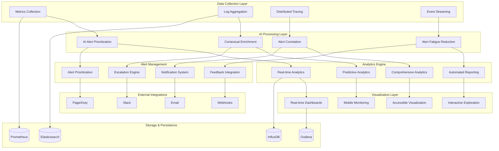

# Phase 8: Enhanced Monitoring and Alerting System Architecture

## 🎯 Overview

The Enhanced Monitoring and Alerting System provides AI-powered intelligent alerting, contextual enrichment, correlation analysis, and fatigue reduction while maintaining real-time performance and comprehensive observability across all threat detection components. This system builds upon the existing monitoring infrastructure while introducing advanced analytics and intelligent alerting capabilities.

## 🏗️ System Architecture

### Enhanced Monitoring Architecture Diagram



## 🔧 Core Monitoring Components

### 1. AI-Powered Alert Prioritization Engine (APE)

#### Intelligent Alert Ranking System

```typescript
// ai_powered_alert_prioritization.ts
interface AIPoweredAlertPrioritizationEngine {
  // Prioritize alerts using AI
  prioritizeAlertsAI(alerts: SecurityAlert[]): Promise<PrioritizedAlert[]>
  
  // Calculate alert severity scores
  calculateAlertSeverity(alert: SecurityAlert): Promise<AlertSeverityScore>
  
  // Contextual alert ranking
  rankAlertsContextually(alerts: SecurityAlert[]): Promise<ContextuallyRankedAlerts>
  
  // Adaptive alert prioritization
  adaptPrioritization(feedback: PrioritizationFeedback): Promise<AdaptedPrioritization>
  
  // Predict alert impact
  predictAlertImpact(alert: SecurityAlert): Promise<AlertImpactPrediction>
  
  // Generate prioritization explanations
  explainPrioritization(prioritization: AlertPrioritization): Promise<PrioritizationExplanation>
}

interface PrioritizedAlert {
  alertId: string
  priorityScore: number
  severityLevel: SeverityLevel
  contextualFactors: ContextualFactor[]
  threatRelevance: ThreatRelevance
  businessImpact: BusinessImpact
  confidenceLevel: number
  explanation: PrioritizationExplanation
  recommendedActions: RecommendedAction[]
}

class AdvancedAIPoweredAlertPrioritization implements AIPoweredAlertPrioritizationEngine {
  private prioritizationModels: PrioritizationModel[]
  private featureEngineer: FeatureEngineer
  private contextualAnalyzer: ContextualAnalyzer
  private impactPredictor: ImpactPredictor
  private explanationGenerator: ExplanationGenerator
  
  constructor(config: AIPrioritizationConfig) {
    this.prioritizationModels = this.initializeModels(config)
    this.featureEngineer = new FeatureEngineer(config.featureConfig)
    this.contextualAnalyzer = new ContextualAnalyzer(config.contextualConfig)
    this.impactPredictor = new ImpactPredictor(config.impactConfig)
    this.explanationGenerator = new ExplanationGenerator(config.explanationConfig)
  }
  
  async prioritizeAlertsAI(alerts: SecurityAlert[]): Promise<PrioritizedAlert[]> {
    // Extract features from alerts
    const features = await this.featureEngineer.extractAlertFeatures(alerts)
    
    // Analyze contextual factors
    const contextualFactors = await this.contextualAnalyzer.analyzeAlerts(alerts)
    
    // Run multiple prioritization models
    const modelResults = await Promise.all(
      this.prioritizationModels.map(model => 
        this.runPrioritizationModel(model, features, contextualFactors)
      )
    )
    
    // Ensemble prioritization
    const ensemblePrioritization = this.ensemblePrioritizations(modelResults)
    
    // Generate prioritized alerts
    const prioritizedAlerts: PrioritizedAlert[] = []
    
    for (let i = 0; i < alerts.length; i++) {
      const alert = alerts[i]
      const prioritization = ensemblePrioritization[i]
      
      // Predict impact
      const impactPrediction = await this.impactPredictor.predict(alert, prioritization)
      
      // Generate explanation
      const explanation = await this.explanationGenerator.generate(
        alert, 
        prioritization, 
        modelResults.map(r => r.explanations[i])
      )
      
      prioritizedAlerts.push({
        alertId: alert.id,
        priorityScore: prioritization.score,
        severityLevel: this.determineSeverityLevel(prioritization.score),
        contextualFactors: contextualFactors[i],
        threatRelevance: prioritization.threatRelevance,
        businessImpact: impactPrediction.businessImpact,
        confidenceLevel: prioritization.confidence,
        explanation,
        recommendedActions: this.generateRecommendedActions(alert, prioritization)
      })
    }
    
    // Sort by priority score
    return prioritizedAlerts.sort((a, b) => b.priorityScore - a.priorityScore)
  }
  
  private initializeModels(config: AIPrioritizationConfig): PrioritizationModel[] {
    const models: PrioritizationModel[] = []
    
    // Random Forest for feature-based prioritization
    models.push(new RandomForestPrioritizationModel({
      nEstimators: 100,
      maxDepth: 10,
      minSamplesSplit: 5,
      minSamplesLeaf: 2
    }))
    
    // Gradient Boosting for ensemble learning
    models.push(new GradientBoostingPrioritizationModel({
      nEstimators: 100,
      learningRate: 0.1,
      maxDepth: 6
    }))
    
    // Neural Network for complex pattern recognition
    models.push(new NeuralNetworkPrioritizationModel({
      hiddenLayers: [128, 64, 32],
      activation: 'relu',
      optimizer: 'adam',
      epochs: 50
    }))
    
    // XGBoost for gradient boosting
    models.push(new XGBoostPrioritizationModel({
      nEstimators: 100,
      maxDepth: 6,
      learningRate: 0.1,
      objective: 'binary:logistic'
    }))
    
    return models
  }
  
  private async runPrioritizationModel(
    model: PrioritizationModel,
    features: AlertFeatures[],
    contextualFactors: ContextualFactor[]
  ): Promise<ModelPrioritizationResult> {
    const startTime = Date.now()
    
    try {
      const predictions = await model.predict(features, contextualFactors)
      
      return {
        modelName: model.name,
        predictions,
        confidence: this.calculateModelConfidence(predictions),
        processingTime: Date.now() - startTime,
        success: true
      }
    } catch (error) {
      return {
        modelName: model.name,
        predictions: [],
        confidence: 0,
        processingTime: Date.now() - startTime,
        success: false,
        error: error.message
      }
    }
  }
  
  async adaptPrioritization(feedback: PrioritizationFeedback): Promise<AdaptedPrioritization> {
    // Update models based on feedback
    const modelUpdates = await Promise.all(
      this.prioritizationModels.map(model => 
        this.updateModelWithFeedback(model, feedback)
      )
    )
    
    // Adjust feature weights
    const featureAdjustments = await this.adjustFeatureWeights(feedback)
    
    // Update contextual analysis parameters
    const contextualAdjustments = await this.adjustContextualAnalysis(feedback)
    
    return {
      adaptationId: this.generateAdaptationId(),
      modelUpdates,
      featureAdjustments,
      contextualAdjustments,
      learningRate: this.calculateLearningRate(feedback),
      timestamp: Date.now()
    }
  }
}
```

### 2. Contextual Alert Enrichment System (CAES)

#### Multi-Dimensional Context Analysis

```typescript
// contextual_alert_enrichment.ts
interface ContextualAlertEnrichmentSystem {
  // Enrich alerts with context
  enrichAlertWithContext(alert: SecurityAlert): Promise<ContextuallyEnrichedAlert>
  
  // Multi-source data fusion
  fuseMultiSourceData(sources: DataSource[]): Promise<FusedData>
  
  // Threat intelligence enrichment
  enrichWithThreatIntelligence(alert: SecurityAlert): Promise<IntelligenceEnrichedAlert>
  
  // Real-time context updates
  updateContextRealTime(context: AlertContext): Promise<RealTimeContextUpdate>
  
  // Generate contextual narratives
  generateContextualNarrative(enrichedAlert: ContextuallyEnrichedAlert): Promise<ContextualNarrative>
  
  // Validate enrichment accuracy
  validateEnrichmentAccuracy(enrichment: AlertEnrichment): Promise<EnrichmentValidation>
}

interface ContextuallyEnrichedAlert {
  enrichedAlertId: string
  originalAlert: SecurityAlert
  contextualInformation: ContextualInformation
  threatIntelligence: ThreatIntelligenceData
  assetContext: AssetContext
  temporalContext: TemporalContext
  spatialContext: SpatialContext
  enrichmentConfidence: number
  dataSources: DataSource[]
  narrative: ContextualNarrative
}

class AdvancedContextualAlertEnrichment implements ContextualAlertEnrichmentSystem {
  private enrichmentSources: Map<string, EnrichmentSource>
  private dataFusionEngine: DataFusionEngine
  private threatIntelligenceService: ThreatIntelligenceService
  private contextManager: ContextManager
  private narrativeGenerator: NarrativeGenerator
  
  constructor(config: ContextualEnrichmentConfig) {
    this.enrichmentSources = this.initializeEnrichmentSources(config)
    this.dataFusionEngine = new DataFusionEngine(config.fusionConfig)
    this.threatIntelligenceService = new ThreatIntelligenceService(config.intelligenceConfig)
    this.contextManager = new ContextManager(config.contextConfig)
    this.narrativeGenerator = new NarrativeGenerator(config.narrativeConfig)
  }
  
  async enrichAlertWithContext(alert: SecurityAlert): Promise<ContextuallyEnrichedAlert> {
    // Collect data from multiple sources
    const enrichmentData = await this.collectEnrichmentData(alert)
    
    // Fuse multi-source data
    const fusedData = await this.dataFusionEngine.fuse(enrichmentData)
    
    // Enrich with threat intelligence
    const intelligenceEnriched = await this.threatIntelligenceService.enrich(alert, fusedData)
    
    // Build contextual information
    const contextualInfo = await this.buildContextualInformation(alert, intelligenceEnriched)
    
    // Generate contextual narrative
    const narrative = await this.narrativeGenerator.generate(contextualInfo)
    
    // Calculate enrichment confidence
    const confidence = await this.calculateEnrichmentConfidence(enrichmentData, contextualInfo)
    
    return {
      enrichedAlertId: this.generateEnrichmentId(),
      originalAlert: alert,
      contextualInformation: contextualInfo,
      threatIntelligence: intelligenceEnriched.threatData,
      assetContext: contextualInfo.assetContext,
      temporalContext: contextualInfo.temporalContext,
      spatialContext: contextualInfo.spatialContext,
      enrichmentConfidence: confidence,
      dataSources: enrichmentData.sources,
      narrative
    }
  }
  
  private async collectEnrichmentData(alert: SecurityAlert): Promise<EnrichmentData> {
    const enrichmentTasks: Promise<EnrichmentData>[] = []
    
    // Collect from each enrichment source
    for (const [sourceName, source] of this.enrichmentSources) {
      enrichmentTasks.push(
        this.collectFromSource(source, alert).catch(error => ({
          source: sourceName,
          data: null,
          error: error.message
        }))
      )
    }
    
    const results = await Promise.allSettled(enrichmentTasks)
    
    const successfulEnrichments: EnrichmentData[] = []
    const failedEnrichments: FailedEnrichment[] = []
    
    results.forEach((result, index) => {
      if (result.status === 'fulfilled' && result.value.data) {
        successfulEnrichments.push(result.value)
      } else {
        failedEnrichments.push({
          source: Array.from(this.enrichmentSources.keys())[index],
          error: result.status === 'rejected' ? result.reason : 'No data returned'
        })
      }
    })
    
    return {
      sources: successfulEnrichments.map(e => e.source),
      data: successfulEnrichments.reduce((acc, curr) => ({ ...acc, ...curr.data }), {}),
      failedSources: failedEnrichments,
      collectionTimestamp: Date.now()
    }
  }
  
  private initializeEnrichmentSources(config: ContextualEnrichmentConfig): Map<string, EnrichmentSource> {
    const sources = new Map()
    
    // Asset information source
    sources.set('asset', new AssetInformationSource({
      apiEndpoint: config.assetApiEndpoint,
      cacheTtl: 300,
      batchSize: 100
    }))
    
    // Threat intelligence source
    sources.set('threat_intel', new ThreatIntelligenceSource({
      feeds: config.threatFeeds,
      apiKeys: config.threatApiKeys,
      updateFrequency: 300
    }))
    
    // Geographic information source
    sources.set('geographic', new GeographicInformationSource({
      geoIpDatabase: config.geoIpDatabase,
      accuracyLevel: 'high',
      cacheSize: 10000
    }))
    
    // Temporal context source
    sources.set('temporal', new TemporalContextSource({
      timezoneDatabase: config.timezoneDatabase,
      businessHoursConfig: config.businessHours,
      holidayCalendar: config.holidayCalendar
    }))
    
    // Network topology source
    sources.set('network', new NetworkTopologySource({
      topologyApi: config.networkTopologyApi,
      refreshInterval: 600,
      cacheEnabled: true
    }))
    
    return sources
  }
  
  async fuseMultiSourceData(sources: DataSource[]): Promise<FusedData> {
    // Normalize data formats
    const normalizedData = await this.normalizeDataFormats(sources)
    
    // Resolve conflicts and inconsistencies
    const resolvedData = await this.resolveDataConflicts(normalizedData)
    
    // Combine complementary information
    const combinedData = await this.combineComplementaryData(resolvedData)
    
    // Validate fused data
    const validation = await this.validateFusedData(combinedData)
    
    return {
      fusedDataId: this.generateFusedDataId(),
      data: combinedData,
      confidence: validation.confidence,
      sources: sources.map(s => s.sourceId),
      fusionTimestamp: Date.now(),
      validationResult: validation
    }
  }
  
  async validateEnrichmentAccuracy(enrichment: AlertEnrichment): Promise<EnrichmentValidation> {
    // Cross-validate with multiple sources
    const validationResults = await this.crossValidateEnrichment(enrichment)
    
    // Check for inconsistencies
    const inconsistencies = await this.identifyInconsistencies(validationResults)
    
    // Calculate overall accuracy
    const accuracy = await this.calculateEnrichmentAccuracy(validationResults)
    
    return {
      validationId: this.generateValidationId(),
      enrichmentId: enrichment.enrichedAlertId,
      accuracy,
      inconsistencies,
      validationResults,
      recommendation: this.generateValidationRecommendation(accuracy, inconsistencies),
      timestamp: Date.now()
    }
  }
}
```

### 3. Alert Correlation and Fusion Engine (ACFE)

#### Multi-Dimensional Alert Correlation

```typescript
// alert_correlation_fusion_engine.ts
interface AlertCorrelationFusionEngine {
  // Correlate alerts across sources
  correlateAlertsAcrossSources(alerts: SecurityAlert[]): Promise<CorrelatedAlerts>
  
  // Fuse related alerts
  fuseRelatedAlerts(correlatedAlerts: CorrelatedAlert[]): Promise<FusedAlert>
  
  // Detect alert patterns
  detectAlertPatterns(alerts: SecurityAlert[]): Promise<AlertPattern[]>
  
  // Temporal sequence analysis
  analyzeTemporalSequences(alertSequences: AlertSequence[]): Promise<TemporalAnalysis>
  
  // Multi-dimensional correlation
  correlateMultiDimensional(alerts: SecurityAlert[]): Promise<MultiDimensionalCorrelation>
  
  // Validate correlation accuracy
  validateCorrelationAccuracy(correlation: AlertCorrelation): Promise<CorrelationValidation>
}

interface CorrelatedAlerts {
  correlationId: string
  alertClusters: AlertCluster[]
  correlationStrength: number
  temporalPatterns: TemporalPattern[]
  causalRelationships: CausalRelationship[]
  confidenceScore: number
  supportingEvidence: SupportingEvidence[]
  fusionRecommendations: FusionRecommendation[]
}

class AdvancedAlertCorrelationFusionEngine implements AlertCorrelationFusionEngine {
  private correlationAlgorithms: CorrelationAlgorithm[]
  private fusionStrategies: FusionStrategy[]
  private patternDetectors: PatternDetector[]
  private sequenceAnalyzer: SequenceAnalyzer
  private multiDimensionalCorrelator: MultiDimensionalCorrelator
  
  constructor(config: AlertCorrelationConfig) {
    this.correlationAlgorithms = this.initializeCorrelationAlgorithms(config)
    this.fusionStrategies = this.initializeFusionStrategies(config)
    this.patternDetectors = this.initializePatternDetectors(config)
    this.sequenceAnalyzer = new SequenceAnalyzer(config.sequenceConfig)
    this.multiDimensionalCorrelator = new MultiDimensionalCorrelator(config.multiDimConfig)
  }
  
  async correlateAlertsAcrossSources(alerts: SecurityAlert[]): Promise<CorrelatedAlerts> {
    // Preprocess alerts
    const processedAlerts = await this.preprocessAlerts(alerts)
    
    // Run multiple correlation algorithms
    const correlationResults = await Promise.all(
      this.correlationAlgorithms.map(algorithm => 
        algorithm.correlate(processedAlerts)
      )
    )
    
    // Ensemble correlation results
    const ensembleCorrelation = this.ensembleCorrelations(correlationResults)
    
    // Detect temporal patterns
    const temporalPatterns = await this.detectTemporalPatterns(ensembleCorrelation)
    
    // Identify causal relationships
    const causalRelationships = await this.identifyCausalRelationships(ensembleCorrelation)
    
    // Calculate overall confidence
    const confidenceScore = this.calculateCorrelationConfidence(ensembleCorrelation, correlationResults)
    
    // Generate fusion recommendations
    const fusionRecommendations = this.generateFusionRecommendations(ensembleCorrelation)
    
    return {
      correlationId: this.generateCorrelationId(),
      alertClusters: ensembleCorrelation.clusters,
      correlationStrength: ensembleCorrelation.strength,
      temporalPatterns,
      causalRelationships,
      confidenceScore,
      supportingEvidence: ensembleCorrelation.evidence,
      fusionRecommendations
    }
  }
  
  private initializeCorrelationAlgorithms(config: AlertCorrelationConfig): CorrelationAlgorithm[] {
    const algorithms: CorrelationAlgorithm[] = []
    
    // Similarity-based correlation
    algorithms.push(new SimilarityCorrelationAlgorithm({
      similarityThreshold: 0.7,
      features: ['source_ip', 'destination_ip', 'alert_type', 'timestamp'],
      weighting: 'equal'
    }))
    
    // Temporal correlation
    algorithms.push(new TemporalCorrelationAlgorithm({
      timeWindow: 300000, // 5 minutes
      temporalThreshold: 0.8,
      sequenceMatching: true
    }))
    
    // Graph-based correlation
    algorithms.push(new GraphBasedCorrelationAlgorithm({
      graphType: 'knowledge_graph',
      relationshipTypes: ['causes', 'precedes', 'related_to'],
      centralityMeasures: ['degree', 'betweenness', 'closeness']
    }))
    
    // Statistical correlation
    algorithms.push(new StatisticalCorrelationAlgorithm({
      correlationMethod: 'pearson',
      significanceLevel: 0.05,
      minCorrelationStrength: 0.6
    }))
    
    // Machine learning correlation
    algorithms.push(new MLCorrelationAlgorithm({
      modelType: 'clustering',
      algorithm: 'dbscan',
      eps: 0.5,
      minSamples: 5
    }))
    
    return algorithms
  }
  
  async fuseRelatedAlerts(correlatedAlerts: CorrelatedAlert[]): Promise<FusedAlert> {
    if (correlatedAlerts.length === 0) {
      throw new Error('No correlated alerts to fuse')
    }
    
    // Group alerts by correlation strength
    const groupedAlerts = this.groupByCorrelationStrength(correlatedAlerts)
    
    // Apply fusion strategies
    const fusionResults = await Promise.all(
      this.fusionStrategies.map(strategy => 
        this.applyFusionStrategy(strategy, groupedAlerts)
      )
    )
    
    // Ensemble fusion results
    const ensembleFusion = this.ensembleFusions(fusionResults)
    
    // Generate fused alert
    const fusedAlert = await this.generateFusedAlert(ensembleFusion)
    
    return fusedAlert
  }
  
  private async applyFusionStrategy(
    strategy: FusionStrategy,
    groupedAlerts: GroupedAlerts
  ): Promise<FusionResult> {
    switch (strategy.type) {
      case 'WEIGHTED_AVERAGE':
        return await this.applyWeightedAverageFusion(groupedAlerts, strategy)
      case 'VOTING':
        return await this.applyVotingFusion(groupedAlerts, strategy)
      case 'BAYESIAN':
        return await this.applyBayesianFusion(groupedAlerts, strategy)
      case 'EVIDENCE_THEORY':
        return await this.applyEvidenceTheoryFusion(groupedAlerts, strategy)
      default:
        throw new Error(`Unknown fusion strategy: ${strategy.type}`)
    }
  }
  
  async analyzeTemporalSequences(alertSequences: AlertSequence[]): Promise<TemporalAnalysis> {
    // Extract temporal features
    const temporalFeatures = await this.extractTemporalFeatures(alertSequences)
    
    // Detect sequential patterns
    const sequentialPatterns = await this.sequenceAnalyzer.detectPatterns(temporalFeatures)
    
    // Analyze timing relationships
    const timingRelationships = await this.analyzeTimingRelationships(alertSequences)
    
    // Identify attack progression
    const attackProgression = await this.identifyAttackProgression(sequentialPatterns)
    
    // Calculate temporal significance
    const temporalSignificance = await this.calculateTemporalSignificance(timingRelationships)
    
    return {
      analysisId: this.generateAnalysisId(),
      sequences: alertSequences,
      patterns: sequentialPatterns,
      timingRelationships,
      attackProgression,
      temporalSignificance,
      confidence: this.calculateTemporalConfidence(sequentialPatterns, timingRelationships)
    }
  }
  
  async correlateMultiDimensional(alerts: SecurityAlert[]): Promise<MultiDimensionalCorrelation> {
    // Extract multi-dimensional features
    const multiDimFeatures = await this.extractMultiDimensionalFeatures(alerts)
    
    // Perform dimensional analysis
    const dimensionalAnalysis = await this.multiDimensionalCorrelator.analyze(multiDimFeatures)
    
    // Identify cross-dimensional patterns
    const crossDimensionalPatterns = await this.identifyCrossDimensionalPatterns(dimensionalAnalysis)
    
    // Calculate multi-dimensional correlation strength
    const correlationStrength = await this.calculateMultiDimensionalCorrelationStrength(dimensionalAnalysis)
    
    return {
      correlationId: this.generateCorrelationId(),
      dimensions: dimensionalAnalysis.dimensions,
      crossDimensionalPatterns,
      correlationStrength,
      significance: this.calculateMultiDimensionalSignificance(crossDimensionalPatterns),
      recommendations: this.generateMultiDimensionalRecommendations(crossDimensionalPatterns)
    }
  }
}
```

### 4. Real-Time Threat Monitoring Dashboard (RTTMD)

#### Interactive Visualization System

```typescript
// real_time_threat_monitoring.ts
interface RealTimeThreatMonitoringDashboard {
  // Create real-time dashboard
  createRealTimeDashboard(metrics: ThreatMetrics[]): Promise<RealTimeDashboard>
  
  // Update dashboard in real-time
  updateDashboardRealTime(updates: DashboardUpdate[]): Promise<RealTimeUpdate>
  
  // Visualize threat patterns
  visualizeThreatPatterns(patterns: ThreatPattern[]): Promise<ThreatVisualization>
  
  // Interactive threat exploration
  enableInteractiveExploration(threatData: ThreatData[]): Promise<InteractiveExploration>
  
  // Mobile-responsive monitoring
  createMobileMonitoring(mobileData: MobileThreatData[]): Promise<MobileMonitoring>
  
  // Accessibility-compliant visualization
  createAccessibleVisualization(data: ThreatData[]): Promise<AccessibleVisualization>
}

interface RealTimeDashboard {
  dashboardId: string
  realTimeMetrics: RealTimeMetric[]
  visualizationComponents: VisualizationComponent[]
  interactiveElements: InteractiveElement[]
  updateFrequency: number
  performanceMetrics: DashboardPerformanceMetrics
  userEngagement: UserEngagementMetrics
  accessibilityFeatures: AccessibilityFeature[]
}

class AdvancedRealTimeThreatMonitoring implements RealTimeThreatMonitoringDashboard {
  private dashboardEngine: DashboardEngine
  private visualizationLibrary: VisualizationLibrary
  private interactionManager: InteractionManager
  mobileRenderer: MobileRenderer
  private accessibilityEngine: AccessibilityEngine
  
  constructor(config: RealTimeMonitoringConfig) {
    this.dashboardEngine = new DashboardEngine(config.dashboardConfig)
    this.visualizationLibrary = new VisualizationLibrary(config.visualizationConfig)
    this.interactionManager = new InteractionManager(config.interactionConfig)
    this.mobileRenderer = new MobileRenderer(config.mobileConfig)
    this.accessibilityEngine = new AccessibilityEngine(config.accessibilityConfig)
  }
  
  async createRealTimeDashboard(metrics: ThreatMetrics[]): Promise<RealTimeDashboard> {
    // Create dashboard layout
    const layout = await this.createDashboardLayout(metrics)
    
    // Generate visualization components
    const components = await this.generateVisualizationComponents(metrics)
    
    // Add interactive elements
    const interactiveElements = await this.addInteractiveElements(components)
    
    // Optimize for performance
    const optimizedDashboard = await this.optimizeDashboardPerformance(layout, components)
    
    // Add accessibility features
    const accessibleDashboard = await this.addAccessibilityFeatures(optimizedDashboard)
    
    return {
      dashboardId: this.generateDashboardId(),
      realTimeMetrics: this.convertToRealTimeMetrics(metrics),
      visualizationComponents: components,
      interactiveElements,
      updateFrequency: config.updateFrequency || 1000,
      performanceMetrics: await this.measureDashboardPerformance(accessibleDashboard),
      userEngagement: await this.initializeUserEngagementTracking(),
      accessibilityFeatures: accessibleDashboard.accessibilityFeatures
    }
  }
  
  private async generateVisualizationComponents(metrics: ThreatMetrics[]): Promise<VisualizationComponent[]> {
    const components: VisualizationComponent[] = []
    
    // Threat timeline visualization
    components.push(await this.createThreatTimeline(metrics))
    
    // Geographic threat map
    components.push(await this.createGeographicThreatMap(metrics))
    
    // Real-time metrics gauges
    components.push(await this.createMetricsGauges(metrics))
    
    // Alert correlation network
    components.push(await this.createAlertCorrelationNetwork(metrics))
    
    // Threat pattern heatmap
    components.push(await this.createThreatPatternHeatmap(metrics))
    
    // Predictive analytics charts
    components.push(await this.createPredictiveAnalyticsCharts(metrics))
    
    // Interactive threat explorer
    components.push(await this.createInteractiveThreatExplorer(metrics))
    
    return components
  }
  
  private async createThreatTimeline(metrics: ThreatMetrics[]): Promise<VisualizationComponent> {
    return {
      componentId: 'threat_timeline',
      type: 'timeline',
      title: 'Threat Activity Timeline',
      data: this.prepareTimelineData(metrics),
      configuration: {
        timeRange: '24h',
        granularity: 'minute',
        colorScheme: 'threat_severity',
        interactive: true,
        realTimeUpdates: true
      },
      performance: {
        renderTime: '< 100ms',
        updateFrequency: 1000,
        maxDataPoints: 10000
      }
    }
  }
  
  private async createGeographicThreatMap(metrics: ThreatMetrics[]): Promise<VisualizationComponent> {
    return {
      componentId: 'geographic_threat_map',
      type: 'map',
      title: 'Geographic Threat Distribution',
      data: this.prepareGeographicData(metrics),
      configuration: {
        mapType: 'world',
        clustering: true,
        heatmap: true,
        realTimeUpdates: true,
        interactive: true
      },
      performance: {
        renderTime: '< 200ms',
        updateFrequency: 5000,
        maxMarkers: 5000
      }
    }
  }
  
  async enableInteractiveExploration(threatData: ThreatData[]): Promise<InteractiveExploration> {
    // Create interactive filtering system
    const filteringSystem = await this.createInteractiveFiltering(threatData)
    
    // Add drill-down capabilities
    const drillDownSystem = await this.createDrillDownCapabilities(threatData)
    
    // Implement real-time search
    const searchSystem = await this.createRealTimeSearch(threatData)
    
    // Add comparison tools
    const comparisonTools = await this.createComparisonTools(threatData)
    
    return {
      explorationId: this.generateExplorationId(),
      filteringSystem,
      drillDownSystem,
      searchSystem,
      comparisonTools,
      userActions: await this.trackUserActions(),
      performanceMetrics: await this.measureExplorationPerformance()
    }
  }
  
  async createAccessibleVisualization(data: ThreatData[]): Promise<AccessibleVisualization> {
    // Generate screen reader compatible descriptions
    const screenReaderDescriptions = await this.generateScreenReaderDescriptions(data)
    
    // Create high contrast versions
    const highContrastVersion = await this.createHighContrastVersion(data)
    
    // Add keyboard navigation
    const keyboardNavigation = await this.addKeyboardNavigation(data)
    
    // Implement voice control
    const voiceControl = await this.addVoiceControl(data)
    
    // Add haptic feedback for mobile
    const hapticFeedback = await this.addHapticFeedback(data)
    
    return {
      visualizationId: this.generateVisualizationId(),
      screenReaderDescriptions,
      highContrastVersion,
      keyboardNavigation,
      voiceControl,
      hapticFeedback,
      wcagCompliance: 'AA',
      accessibilityScore: await this.calculateAccessibilityScore(data)
    }
  }
}
```

### 5. Predictive Monitoring Engine (PME)

#### Proactive System Monitoring

```typescript
// predictive_monitoring_engine.ts
interface PredictiveMonitoringEngine {
  // Predict system performance
  predictSystemPerformance(historicalData: PerformanceData[]): Promise<PerformancePrediction>
  
  // Forecast monitoring anomalies
  forecastMonitoringAnomalies(anomalyData: AnomalyData[]): Promise<AnomalyForecast>
  
  // Predict alert patterns
  predictAlertPatterns(alertHistory: AlertHistory[]): Promise<AlertPatternPrediction>
  
  // Capacity planning predictions
  predictCapacityNeeds(usageData: UsageData[]): Promise<CapacityPrediction>
  
  // Self-healing predictions
  predictSelfHealingNeeds(systemState: SystemState[]): Promise<SelfHealingPrediction>
  
  // Generate predictive insights
  generatePredictiveInsights(predictions: Prediction[]): Promise<PredictiveInsight[]>
}

interface PerformancePrediction {
  predictionId: string
  predictedMetrics: PredictedMetric[]
  confidenceIntervals: ConfidenceInterval[]
  trendAnalysis: TrendAnalysis
  anomalyForecasts: AnomalyForecast[]
  capacityProjections: CapacityProjection[]
  selfHealingRecommendations: SelfHealingRecommendation[]
  uncertaintyQuantification: UncertaintyQuantification
}

class AdvancedPredictiveMonitoringEngine implements PredictiveMonitoringEngine {
  private performanceModels: Map<string, PerformanceModel>
  private anomalyForecasters: AnomalyForecaster[]
  private patternPredictors: PatternPredictor[]
  private capacityPlanner: CapacityPlanner
  private selfHealingPredictor: SelfHealingPredictor
  
  constructor(config: PredictiveMonitoringConfig) {
    this.performanceModels = this.initializePerformanceModels(config)
    this.anomalyForecasters = this.initializeAnomalyForecasters(config)
    this.patternPredictors = this.initializePatternPredictors(config)
    this.capacityPlanner = new CapacityPlanner(config.capacityConfig)
    this.selfHealingPredictor = new SelfHealingPredictor(config.selfHealingConfig)
  }
  
  async predictSystemPerformance(historicalData: PerformanceData[]): Promise<PerformancePrediction> {
    // Prepare time series data
    const timeSeries = this.prepareTimeSeriesData(historicalData)
    
    // Run multiple prediction models
    const modelPredictions = await Promise.all(
      Array.from(this.performanceModels.values()).map(model => 
        this.runPerformanceModel(model, timeSeries)
      )
    )
    
    // Ensemble predictions
    const ensemblePrediction = this.ensemblePerformancePredictions(modelPredictions)
    
    // Forecast anomalies
    const anomalyForecasts = await this.forecastMonitoringAnomalies(
      historicalData.map(d => ({ timestamp: d.timestamp, value: d.anomalyScore }))
    )
    
    // Generate capacity projections
    const capacityProjections = await this.predictCapacityNeeds(
      historicalData.map(d => ({ timestamp: d.timestamp, usage: d.resourceUsage }))
    )
    
    // Calculate uncertainty
    const uncertainty = await this.calculatePredictionUncertainty(modelPredictions)
    
    return {
      predictionId: this.generatePredictionId(),
      predictedMetrics: ensemblePrediction.metrics,
      confidenceIntervals: ensemblePrediction.confidenceIntervals,
      trendAnalysis: ensemblePrediction.trendAnalysis,
      anomalyForecasts,
      capacityProjections,
      selfHealingRecommendations: await this.predictSelfHealingNeeds(
        historicalData.map(d => ({ timestamp: d.timestamp, state: d.systemState }))
      ),
      uncertaintyQuantification: uncertainty
    }
  }
  
  private initializePerformanceModels(config: PredictiveMonitoringConfig): Map<string, PerformanceModel> {
    const models = new Map()
    
    // Prophet for time series forecasting
    models.set('prophet', new ProphetPerformanceModel({
      growth: 'linear',
      seasonalityMode: 'multiplicative',
      yearlySeasonality: true,
      weeklySeasonality: true,
      dailySeasonality: true,
      intervalWidth: 0.95
    }))
    
    // LSTM for complex temporal patterns
    models.set('lstm', new LSTMPerformanceModel({
      layers: [128, 64, 32],
      dropout: 0.2,
      recurrentDropout: 0.2,
      optimizer: 'adam',
      loss: 'mse',
      epochs: 100
    }))
    
    // ARIMA for traditional time series analysis
    models.set('arima', new ARIMAPerformanceModel({
      order: [2, 1, 2],
      seasonalOrder: [1, 1, 1, 24],
      trend: 'c',
      enforceStationarity: true
    }))
    
    // XGBoost for feature-based prediction
    models.set('xgboost', new XGBoostPerformanceModel({
      nEstimators: 1000,
      maxDepth: 6,
      learningRate: 0.1,
      objective: 'reg:squarederror'
    }))
    
    return models
  }
  
  async forecastMonitoringAnomalies(anomalyData: AnomalyData[]): Promise<AnomalyForecast> {
    const forecasts: AnomalyForecast[] = []
    
    for (const forecaster of this.anomalyForecasters) {
      const forecast = await forecaster.forecast(anomalyData)
      forecasts.push(forecast)
    }
    
    // Ensemble anomaly forecasts
    const ensembleForecast = this.ensembleAnomalyForecasts(forecasts)
    
    return {
      forecastId: this.generateForecastId(),
      predictedAnomalies: ensembleForecast.predictions,
      confidenceIntervals: ensembleForecast.confidenceIntervals,
      forecastHorizon: ensembleForecast.horizon,
      anomalyTypes: ensembleForecast.anomalyTypes,
      severityPredictions: ensembleForecast.severityPredictions,
      recommendedActions: ensembleForecast.recommendations
    }
  }
  
  async generatePredictiveInsights(predictions: Prediction[]): Promise<PredictiveInsight[]> {
    const insights: PredictiveInsight[] = []
    
    for (const prediction of predictions) {
      // Analyze prediction patterns
      const patternAnalysis = await this.analyzePredictionPatterns(prediction)
      
      // Identify actionable insights
      const actionableInsights = await this.identifyActionableInsights(patternAnalysis)
      
      // Generate business recommendations
      const recommendations = await this.generateBusinessRecommendations(actionableInsights)
      
      insights.push({
        insightId: this.generateInsightId(),
        predictionId: prediction.id,
        insightType: actionableInsights.type,
        description: actionableInsights.description,
        confidence: actionableInsights.confidence,
        recommendations,
        businessImpact: await this.assessBusinessImpact(actionableInsights),
        timeline: actionableInsights.timeline
      })
    }
    
    return insights.sort((a, b) => b.confidence - a.confidence)
  }
}
```

### 6. Comprehensive Analytics Engine (CAE)

#### Advanced Analytics Framework

```typescript
// comprehensive_analytics_engine.ts
interface ComprehensiveAnalyticsEngine {
  // Generate comprehensive analytics
  generateComprehensiveAnalytics(data: MonitoringData[]): Promise<ComprehensiveAnalytics>
  
  // Perform statistical analysis
  performStatisticalAnalysis(dataset: MonitoringDataset): Promise<StatisticalAnalysis>
  
  // Apply machine learning analytics
  applyMLAnalytics(data: MonitoringData[]): Promise<MLAnalyticsResult>
  
  // Create interactive visualizations
  createInteractiveVisualizations(analytics: AnalyticsResult): Promise<InteractiveVisualization>
  
  // Generate analytical narratives
  generateAnalyticalNarrative(analytics: ComprehensiveAnalytics): Promise<AnalyticalNarrative>
  
  // Optimize analytical performance
  optimizeAnalyticalPerformance(analytics: AnalyticsProcess): Promise<OptimizedAnalytics>
}

interface ComprehensiveAnalytics {
  analyticsId: string
  statisticalSummaries: StatisticalSummary[]
  machineLearningInsights: MLInsight[]
  trendAnalyses: TrendAnalysis[]
  patternRecognitions: PatternRecognition[]
  predictiveModels: PredictiveModel[]
  interactiveVisualizations: InteractiveVisualization[]
  narrativeReports: NarrativeReport[]
}

class AdvancedComprehensiveAnalyticsEngine implements ComprehensiveAnalyticsEngine {
  private analyticalDimensions: AnalyticalDimension[]
  private statisticalMethods: StatisticalMethod[]
  private mlModels: MLModel[]
  private visualizationEngine: VisualizationEngine
  private narrativeEngine: NarrativeEngine
  private optimizationEngine: AnalyticsOptimizationEngine
  
  constructor(config: ComprehensiveAnalyticsConfig) {
    this.analyticalDimensions = config.analyticalDimensions
    this.statisticalMethods = this.initializeStatisticalMethods(config)
    this.mlModels = this.initializeMLModels(config)
    this.visualizationEngine = new VisualizationEngine(config.visualizationConfig)
    this.narrativeEngine = new NarrativeEngine(config.narrativeConfig)
    this.optimizationEngine = new AnalyticsOptimizationEngine(config.optimizationConfig)
  }
  
  async generateComprehensiveAnalytics(data: MonitoringData[]): Promise<ComprehensiveAnalytics> {
    // Perform multi-dimensional analysis
    const dimensionalAnalysis = await this.performDimensionalAnalysis(data)
    
    // Apply statistical methods
    const statisticalSummaries = await this.performStatisticalAnalysis({
      data,
      dimensions: dimensionalAnalysis.dimensions
    })
    
    // Apply machine learning analytics
    const mlInsights = await this.applyMLAnalytics(data)
    
    // Perform trend analysis
    const trendAnalyses = await this.performTrendAnalysis(data)
    
    // Recognize patterns
    const patternRecognitions = await this.recognizePatterns(data)
    
    // Build predictive models
    const predictiveModels = await this.buildPredictiveModels(data)
    
    // Create interactive visualizations
    const visualizations = await this.createInteractiveVisualizations({
      statisticalSummaries,
      mlInsights,
      trendAnalyses,
      patternRecognitions,
      predictiveModels
    })
    
    // Generate narrative reports
    const narrativeReports = await this.generateAnalyticalNarrative({
      statisticalSummaries,
      mlInsights,
      trendAnalyses,
      patternRecognitions,
      predictiveModels
    })
    
    return {
      analyticsId: this.generateAnalyticsId(),
      statisticalSummaries,
      machineLearningInsights: mlInsights,
      trendAnalyses,
      patternRecognitions,
      predictiveModels,
      interactiveVisualizations: visualizations,
      narrativeReports
    }
  }
  
  private initializeStatisticalMethods(config: ComprehensiveAnalyticsConfig): StatisticalMethod[] {
    const methods: StatisticalMethod[] = []
    
    // Descriptive statistics
    methods.push(new DescriptiveStatistics({
      measures: ['mean', 'median', 'mode', 'std', 'variance', 'skewness', 'kurtosis'],
      groupBy: config.groupingDimensions
    }))
    
    // Inferential statistics
    methods.push(new InferentialStatistics({
      tests: ['t-test', 'chi-square', 'anova', 'regression'],
      confidenceLevel: 0.95,
      significanceLevel: 0.05
    }))
    
    // Time series analysis
    methods.push(new TimeSeriesAnalysis({
      decomposition: true,
      seasonalityDetection: true,
      trendAnalysis: true,
      forecasting: true
    }))
    
    // Multivariate analysis
    methods.push(new MultivariateAnalysis({
      techniques: ['pca', 'factor_analysis', 'cluster_analysis', 'discriminant_analysis']
    }))
    
    return methods
  }
  
  async createInteractiveVisualizations(analytics: AnalyticsResult): Promise<InteractiveVisualization> {
    // Create base visualizations
    const baseVisualizations = await this.visualizationEngine.createBaseVisualizations(analytics)
    
    // Add interactivity
    const interactiveElements = await this.addInteractiveElements(baseVisualizations)
    
    // Optimize for performance
    const optimizedVisualizations = await this.optimizeVisualizationPerformance(interactiveElements)
    
    // Add storytelling elements
    const storyVisualizations = await this.addStorytellingElements(optimizedVisualizations)
    
    return {
      visualizationId: this.generateVisualizationId(),
      components: storyVisualizations,
      interactivity: {
        filtering: true,
        drilling: true,
        zooming: true,
        panning: true,
        selection: true,
        realTimeUpdates: true
      },
      performance: await this.measureVisualizationPerformance(storyVisualizations),
      accessibility: await this.ensureAccessibility(storyVisualizations),
      narrative: await this.generateVisualizationNarrative(storyVisualizations)
    }
  }
  
  async generateAnalyticalNarrative(analytics: ComprehensiveAnalytics): Promise<AnalyticalNarrative> {
    // Identify key findings
    const keyFindings = await this.identifyKeyFindings(analytics)
    
    // Structure the narrative
    const narrativeStructure = await this.structureNarrative(keyFindings)
    
    // Generate natural language descriptions
    const descriptions = await this.generateNaturalLanguageDescriptions(narrativeStructure)
    
    // Add contextual information
    const contextualNarrative = await this.addContextualInformation(descriptions)
    
    // Create executive summary
    const executiveSummary = await this.createExecutiveSummary(contextualNarrative)
    
    return {
      narrativeId: this.generateNarrativeId(),
      title: "Comprehensive Threat Detection Analytics Report",
      executiveSummary,
      sections: contextualNarrative.sections,
      keyFindings: keyFindings,
      recommendations: await this.generateRecommendations(keyFindings),
      visualReferences: await this.linkToVisualizations(contextualNarrative),
      timestamp: Date.now()
    }
  }
}
```

## 📊 Performance and Scalability

### Monitoring Performance Metrics

```typescript
// monitoring_performance_metrics.ts
interface MonitoringPerformanceMetrics {
  // Dashboard performance
  dashboardLoadTime: number
  visualizationRenderTime: number
  realTimeUpdateLatency: number
  userInteractionResponseTime: number
  
  // AI processing performance
  alertPrioritizationTime: number
  contextualEnrichmentTime: number
  correlationAnalysisTime: number
  predictionGenerationTime: number
  
  // System performance
  dataIngestionRate: number
  queryResponseTime: number
  storageUtilization: number
  memoryUsage: number
  
  // Scalability metrics
  concurrentUsers: number
  dataThroughput: number
  horizontalScalingEfficiency: number
  verticalScalingEfficiency: number
}

class MonitoringPerformanceMonitor {
  async collectPerformanceMetrics(): Promise<MonitoringPerformanceMetrics> {
    return {
      dashboardLoadTime: await this.measureDashboardLoadTime(),
      visualizationRenderTime: await this.measureVisualizationRenderTime(),
      realTimeUpdateLatency: await this.measureRealTimeUpdateLatency(),
      userInteractionResponseTime: await this.measureUserInteractionResponseTime(),
      
      alertPrioritizationTime: await this.measureAlertPrioritizationTime(),
      contextualEnrichmentTime: await this.measureContextualEnrichmentTime(),
      correlationAnalysisTime: await this.measureCorrelationAnalysisTime(),
      predictionGenerationTime: await this.measurePredictionGenerationTime(),
      
      dataIngestionRate: await this.measureDataIngestionRate(),
      queryResponseTime: await this.measureQueryResponseTime(),
      storageUtilization: await this.measureStorageUtilization(),
      memoryUsage: await this.measureMemoryUsage(),
      
      concurrentUsers: await this.getConcurrentUsers(),
      dataThroughput: await this.measureDataThroughput(),
      horizontalScalingEfficiency: await this.calculateHorizontalScalingEfficiency(),
      verticalScalingEfficiency: await this.calculateVerticalScalingEfficiency()
    }
  }
  
  private async measureDashboardLoadTime(): Promise<number> {
    const startTime = performance.now()
    
    // Simulate dashboard load
    await this.loadDashboard()
    
    return performance.now() - startTime
  }
  
  private async measureRealTimeUpdateLatency(): Promise<number> {
    const updates = await this.getRecentUpdates()
    const latencies = updates.map(update => update.latency)
    
    return latencies.length > 0 ? 
      latencies.reduce((sum, latency) => sum + latency, 0) / latencies.length : 0
  }
}
```

## 🚀 Deployment Configuration

### Kubernetes Deployment for Enhanced Monitoring

```yaml
# enhanced-monitoring-deployment.yaml
apiVersion: apps/v1
kind: Deployment
metadata:
  name: enhanced-monitoring-system
  namespace: threat-detection
spec:
  replicas: 3
  selector:
    matchLabels:
      app: enhanced-monitoring-system
  template:
    metadata:
      labels:
        app: enhanced-monitoring-system
    spec:
      containers:
      - name: ai-prioritization
        image: pixelated/ai-prioritization:latest
        ports:
        - containerPort: 8080
          name: prioritization-api
        env:
        - name: MODEL_REGISTRY_URL
          value: "http://mlflow-registry:5000"
        - name: FEATURE_STORE_URL
          value: "redis://feature-store-redis:6379"
        - name: GPU_ENABLED
          value: "true"
        resources:
          requests:
            memory: "4Gi"
            cpu: "2000m"
            nvidia.com/gpu: "1"
          limits:
            memory: "8Gi"
            cpu: "4000m"
            nvidia.com/gpu: "1"
            
      - name: contextual-enrichment
        image: pixelated/contextual-enrichment:latest
        ports:
        - containerPort: 8081
          name: enrichment-api
        env:
        - name: ENRICHMENT_DB_URL
          value: "postgres://enrichment-db:5432/enrichment"
        - name: THREAT_INTEL_API_URL
          value: "http://threat-intel-api:8080"
        resources:
          requests:
            memory: "2Gi"
            cpu: "1000m"
          limits:
            memory: "4Gi"
            cpu: "2000m"
            
      - name: correlation-fusion
        image: pixelated/correlation-fusion:latest
        ports:
        - containerPort: 8082
          name: correlation-api
        env:
        - name: CORRELATION_DB_URL
          value: "postgres://correlation-db:5432/correlation"
        - name: GRAPH_DB_URL
          value: "neo4j://graph-db:7687"
        resources:
          requests:
            memory: "3Gi"
            cpu: "1500m"
          limits:
            memory: "6Gi"
            cpu: "3000m"
            
      - name: real-time-dashboard
        image: pixelated/real-time-dashboard:latest
        ports:
        - containerPort: 8083
          name: dashboard-api
        env:
        - name: DASHBOARD_DB_URL
          value: "postgres://dashboard-db:5432/dashboard"
        - name: WEBSOCKET_URL
          value: "ws://websocket-server:8080"
        resources:
          requests:
            memory: "1Gi"
            cpu: "500m"
          limits:
            memory: "2Gi"
            cpu: "1000m"
            
      - name: predictive-monitoring
        image: pixelated/predictive-monitoring:latest
        ports:
        - containerPort: 8084
          name: predictive-api
        env:
        - name: PREDICTION_MODELS_PATH
          value: "/models/predictive_monitoring"
        - name: HISTORICAL_DATA_URL
          value: "http://historical-data-service:8080"
        resources:
          requests:
            memory: "2Gi"
            cpu: "1000m"
          limits:
            memory: "4Gi"
            cpu: "2000m"
            
      - name: comprehensive-analytics
        image: pixelated/comprehensive-analytics:latest
        ports:
        - containerPort: 8085
          name: analytics-api
        env:
        - name: ANALYTICS_DB_URL
          value: "postgres://analytics-db:5432/analytics"
        - name: REPORT_STORAGE_URL
          value: "s3://analytics-reports"
        resources:
          requests:
            memory: "2Gi"
            cpu: "1000m"
          limits:
            memory: "4Gi"
            cpu: "2000m"
            
---
apiVersion: v1
kind: Service
metadata:
  name: enhanced-monitoring-service
  namespace: threat-detection
spec:
  selector:
    app: enhanced-monitoring-system
  ports:
  - name: prioritization-api
    port: 8080
    targetPort: 8080
  - name: enrichment-api
    port: 8081
    targetPort: 8081
  - name: correlation-api
    port: 8082
    targetPort: 8082
  - name: dashboard-api
    port: 8083
    targetPort: 8083
  - name: predictive-api
    port: 8084
    targetPort: 8084
  - name: analytics-api
    port: 8085
    targetPort: 8085
  type: ClusterIP
```

## 📈 Success Metrics and KPIs

### Enhanced Monitoring Performance Targets

```typescript
// monitoring_kpis.ts
interface MonitoringKPIs {
  // AI Prioritization Performance
  alertPrioritizationAccuracy: number
  falsePositiveReduction: number
  alertFatigueReduction: number
  
  // Contextual Enrichment Performance
  enrichmentCoverage: number
  enrichmentAccuracy: number
  enrichmentSpeed: number
  
  // Correlation Performance
  correlationAccuracy: number
  patternDetectionRate: number
  fusionEffectiveness: number
  
  // Real-time Performance
  dashboardLoadTime: number
  realTimeUpdateLatency: number
  visualizationRenderTime: number
  
  // Predictive Analytics Performance
  predictionAccuracy: number
  forecastReliability: number
  anomalyDetectionRate: number
  
  // Overall System Performance
  systemAvailability: number
  dataProcessingThroughput: number
  userSatisfaction: number
}

class MonitoringKPITracker {
  private targets = {
    alertPrioritizationAccuracy: 0.95,
    falsePositiveReduction: 0.8,
    alertFatigueReduction: 0.7,
    enrichmentCoverage: 0.9,
    enrichmentAccuracy: 0.85,
    enrichmentSpeed: 100, // ms
    correlationAccuracy: 0.88,
    patternDetectionRate: 0.92,
    fusionEffectiveness: 0.85,
    dashboardLoadTime: 2000, // ms
    realTimeUpdateLatency: 500, // ms
    visualizationRenderTime: 100, // ms
    predictionAccuracy: 0.9,
    forecastReliability: 0.85,
    anomalyDetectionRate: 0.95,
    systemAvailability: 0.999,
    dataProcessingThroughput: 10000, // events/second
    userSatisfaction: 4.5 // out of 5
  }
  
  async calculateKPIPerformance(): Promise<KPIPerformance> {
    const currentMetrics = await this.collectCurrentMetrics()
    
    return {
      timestamp: Date.now(),
      kpis: {
        alertPrioritizationAccuracy: currentMetrics.alertPrioritizationAccuracy,
        falsePositiveReduction: currentMetrics.falsePositiveReduction,
        alertFatigueReduction: currentMetrics.alertFatigueReduction,
        enrichmentCoverage: currentMetrics.enrichmentCoverage,
        enrichmentAccuracy: currentMetrics.enrichmentAccuracy,
        enrichmentSpeed: currentMetrics.enrichmentSpeed,
        correlationAccuracy: currentMetrics.correlationAccuracy,
        patternDetectionRate: currentMetrics.patternDetectionRate,
        fusionEffectiveness: currentMetrics.fusionEffectiveness,
        dashboardLoadTime: currentMetrics.dashboardLoadTime,
        realTimeUpdateLatency: currentMetrics.realTimeUpdateLatency,
        visualizationRenderTime: currentMetrics.visualizationRenderTime,
        predictionAccuracy: currentMetrics.predictionAccuracy,
        forecastReliability: currentMetrics.forecastReliability,
        anomalyDetectionRate: currentMetrics.anomalyDetectionRate,
        systemAvailability: currentMetrics.systemAvailability,
        dataProcessingThroughput: currentMetrics.dataProcessingThroughput,
        userSatisfaction: currentMetrics.userSatisfaction
      },
      performanceAgainstTargets: this.calculatePerformanceAgainstTargets(currentMetrics),
      recommendations: this.generateKPIRecommendations(currentMetrics)
    }
  }
}
```

This comprehensive enhanced monitoring and alerting system architecture provides intelligent, contextual, and privacy-preserving monitoring capabilities while maintaining seamless integration with existing infrastructure and ensuring optimal user experience.