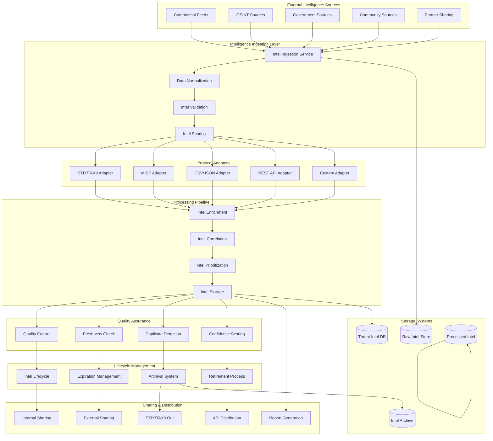

# Phase 8: External Threat Intelligence Integration Architecture

## 🎯 Overview

The External Threat Intelligence Integration system provides comprehensive integration with commercial threat feeds, open-source intelligence (OSINT), STIX/TAXII protocol support, threat intelligence scoring and validation, and threat intelligence lifecycle management. This system enables the Phase 8 threat detection system to leverage external intelligence sources while maintaining data quality, privacy, and operational efficiency.

## 🏗️ Integration Architecture

### External Threat Intelligence Integration Overview



## 🔧 Core Integration Components

### 1. Intelligence Ingestion Service

#### Multi-Source Intelligence Collection

```typescript
// intelligence_ingestion_service.ts
interface IntelligenceIngestionService {
  // Ingest intelligence from multiple sources
  ingestIntelligence(source: IntelligenceSource): Promise<IntelligenceIngestionResult>
  
  // Schedule regular ingestion
  scheduleIngestion(source: IntelligenceSource, schedule: IngestionSchedule): Promise<void>
  
  // Handle ingestion failures
  handleIngestionFailure(failure: IngestionFailure): Promise<FailureRecovery>
  
  // Monitor ingestion health
  monitorIngestionHealth(): Promise<IngestionHealth>
  
  // Manage ingestion quotas
  manageIngestionQuotas(sourceId: string): Promise<QuotaStatus>
}

interface IntelligenceIngestionResult {
  ingestionId: string
  sourceId: string
  itemsIngested: number
  itemsProcessed: number
  itemsFailed: number
  processingTime: number
  nextIngestionTime: Date
  status: IngestionStatus
}

class AdvancedIntelligenceIngestionService implements IntelligenceIngestionService {
  private sourceAdapters: Map<string, IntelligenceSourceAdapter>
  private ingestionScheduler: IngestionScheduler
  private failureRecoveryManager: FailureRecoveryManager
  private healthMonitor: IngestionHealthMonitor
  private quotaManager: IngestionQuotaManager
  
  constructor(config: IngestionConfig) {
    this.sourceAdapters = this.initializeSourceAdapters(config)
    this.ingestionScheduler = new IngestionScheduler(config.schedulerConfig)
    this.failureRecoveryManager = new FailureRecoveryManager(config.failureConfig)
    this.healthMonitor = new IngestionHealthMonitor(config.healthConfig)
    this.quotaManager = new IngestionQuotaManager(config.quotaConfig)
  }
  
  async ingestIntelligence(source: IntelligenceSource): Promise<IntelligenceIngestionResult> {
    const startTime = Date.now()
    
    try {
      // Check quota limits
      const quotaStatus = await this.quotaManager.checkQuota(source.sourceId)
      if (!quotaStatus.hasRemainingQuota) {
        throw new Error(`Quota exceeded for source: ${source.sourceId}`)
      }
      
      // Get appropriate adapter
      const adapter = this.sourceAdapters.get(source.sourceType)
      if (!adapter) {
        throw new Error(`No adapter available for source type: ${source.sourceType}`)
      }
      
      // Fetch intelligence data
      const rawData = await adapter.fetchIntelligence(source)
      
      // Process and normalize data
      const processedData = await this.processIntelligenceData(rawData, source)
      
      // Validate processed data
      const validation = await this.validateIntelligenceData(processedData)
      
      if (!validation.isValid) {
        throw new Error(`Intelligence validation failed: ${validation.errors.join(', ')}`)
      }
      
      // Store processed intelligence
      const storageResult = await this.storeIntelligence(processedData)
      
      // Update quota usage
      await this.quotaManager.updateQuotaUsage(source.sourceId, processedData.length)
      
      return {
        ingestionId: this.generateIngestionId(),
        sourceId: source.sourceId,
        itemsIngested: rawData.length,
        itemsProcessed: processedData.length,
        itemsFailed: validation.failedItems,
        processingTime: Date.now() - startTime,
        nextIngestionTime: await this.calculateNextIngestionTime(source),
        status: 'SUCCESS'
      }
      
    } catch (error) {
      // Handle ingestion failure
      await this.failureRecoveryManager.handleFailure({
        sourceId: source.sourceId,
        error: error.message,
        timestamp: Date.now()
      })
      
      return {
        ingestionId: this.generateIngestionId(),
        sourceId: source.sourceId,
        itemsIngested: 0,
        itemsProcessed: 0,
        itemsFailed: 0,
        processingTime: Date.now() - startTime,
        nextIngestionTime: await this.calculateRetryTime(source),
        status: 'FAILED',
        error: error.message
      }
    }
  }
  
  private initializeSourceAdapters(config: IngestionConfig): Map<string, IntelligenceSourceAdapter> {
    const adapters = new Map()
    
    // STIX/TAXII adapter
    adapters.set('STIX_TAXII', new STIXTAXIIAdapter({
      endpoint: config.stixTaxiiConfig.endpoint,
      username: config.stixTaxiiConfig.username,
      password: config.stixTaxiiConfig.password,
      collection: config.stixTaxiiConfig.collection,
      version: config.stixTaxiiConfig.version
    }))
    
    // MISP adapter
    adapters.set('MISP', new MISPAdapter({
      baseUrl: config.mispConfig.baseUrl,
      apiKey: config.mispConfig.apiKey,
      sslVerify: config.mispConfig.sslVerify,
      debug: config.mispConfig.debug
    }))
    
    // REST API adapter
    adapters.set('REST_API', new RESTAPIAdapter({
      baseUrl: config.restApiConfig.baseUrl,
      headers: config.restApiConfig.headers,
      authMethod: config.restApiConfig.authMethod,
      rateLimit: config.restApiConfig.rateLimit
    }))
    
    // CSV/JSON adapter
    adapters.set('CSV_JSON', new CSVJSONAdapter({
      format: config.csvJsonConfig.format,
      delimiter: config.csvJsonConfig.delimiter,
      encoding: config.csvJsonConfig.encoding,
      validation: config.csvJsonConfig.validation
    }))
    
    // Custom adapter
    adapters.set('CUSTOM', new CustomAdapter({
      adapterClass: config.customConfig.adapterClass,
      configuration: config.customConfig.configuration
    }))
    
    return adapters
  }
  
  private async processIntelligenceData(rawData: any[], source: IntelligenceSource): Promise<ProcessedIntelligence[]> {
    const processedData: ProcessedIntelligence[] = []
    
    for (const item of rawData) {
      try {
        // Normalize data format
        const normalizedItem = await this.normalizeIntelligenceItem(item, source)
        
        // Extract relevant fields
        const extractedItem = await this.extractRelevantFields(normalizedItem, source)
        
        // Apply source-specific processing
        const processedItem = await this.applySourceProcessing(extractedItem, source)
        
        processedData.push(processedItem)
        
      } catch (error) {
        // Log processing error but continue with other items
        console.error(`Error processing intelligence item: ${error.message}`)
      }
    }
    
    return processedData
  }
}
```

### 2. STIX/TAXII Protocol Implementation

#### STIX 2.1 and TAXII 2.1 Support

```typescript
// stix_taxii_implementation.ts
interface STIXTAXIIImplementation {
  // Poll TAXII collections
  pollCollection(collectionId: string, options: PollOptions): Promise<TAXIIPollResult>
  
  // Get STIX objects
  getSTIXObjects(filters: STIXFilters): Promise<STIXObject[]>
  
  // Push STIX objects
  pushSTIXObjects(objects: STIXObject[]): Promise<PushResult>
  
  // Manage TAXII collections
  manageCollections(action: CollectionAction): Promise<CollectionResult>
  
  // Validate STIX objects
  validateSTIXObjects(objects: STIXObject[]): Promise<ValidationResult>
}

interface TAXIIPollResult {
  collectionId: string
  objects: STIXObject[]
  more: boolean
  next: string | null
    timestamp: Date
}

class AdvancedSTIXTAXIIImplementation implements STIXTAXIIImplementation {
  private taxiiClient: TAXIIClient
  private stixValidator: STIXValidator
  private collectionManager: CollectionManager
  private objectProcessor: STIXObjectProcessor
  
  constructor(config: STIXTAXIIConfig) {
    this.taxiiClient = new TAXIIClient(config.taxiiConfig)
    this.stixValidator = new STIXValidator(config.stixConfig)
    this.collectionManager = new CollectionManager(config.collectionConfig)
    this.objectProcessor = new STIXObjectProcessor(config.processingConfig)
  }
  
  async pollCollection(collectionId: string, options: PollOptions): Promise<TAXIIPollResult> {
    try {
      // Get collection information
      const collection = await this.taxiiClient.getCollection(collectionId)
      
      // Validate collection access
      if (!this.hasCollectionAccess(collection)) {
        throw new Error(`No access to collection: ${collectionId}`)
      }
      
      // Build poll request
      const pollRequest = this.buildPollRequest(options)
      
      // Execute poll
      const pollResponse = await this.taxiiClient.pollCollection(collectionId, pollRequest)
      
      // Process returned objects
      const processedObjects = await this.processSTIXObjects(pollResponse.objects)
      
      // Validate processed objects
      const validation = await this.stixValidator.validateObjects(processedObjects)
      
      if (!validation.isValid) {
        console.warn(`STIX validation warnings: ${validation.warnings.join(', ')}`)
      }
      
      return {
        collectionId,
        objects: processedObjects,
        more: pollResponse.more,
        next: pollResponse.next,
        timestamp: new Date()
      }
      
    } catch (error) {
      throw new Error(`TAXII poll failed: ${error.message}`)
    }
  }
  
  private buildPollRequest(options: PollOptions): TAXIIPollRequest {
    return {
      collectionId: options.collectionId,
      begin: options.begin || new Date(Date.now() - 24 * 60 * 60 * 1000), // 24 hours ago
      end: options.end || new Date(),
      limit: options.limit || 100,
      next: options.next || null,
      added_after: options.addedAfter || null,
      match: options.filters || {}
    }
  }
  
  async processSTIXObjects(objects: any[]): Promise<STIXObject[]> {
    const processedObjects: STIXObject[] = []
    
    for (const obj of objects) {
      try {
        // Validate STIX object structure
        const validation = await this.stixValidator.validateObject(obj)
        
        if (!validation.isValid) {
          console.warn(`Invalid STIX object: ${validation.errors.join(', ')}`)
          continue
        }
        
        // Process object based on type
        const processedObj = await this.processObjectByType(obj)
        
        // Enrich with additional context
        const enrichedObj = await this.enrichSTIXObject(processedObj)
        
        processedObjects.push(enrichedObj)
        
      } catch (error) {
        console.error(`Error processing STIX object: ${error.message}`)
      }
    }
    
    return processedObjects
  }
  
  private async processObjectByType(obj: any): Promise<STIXObject> {
    switch (obj.type) {
      case 'indicator':
        return await this.processIndicator(obj)
      case 'malware':
        return await this.processMalware(obj)
      case 'threat-actor':
        return await this.processThreatActor(obj)
      case 'attack-pattern':
        return await this.processAttackPattern(obj)
      case 'intrusion-set':
        return await this.processIntrusionSet(obj)
      case 'campaign':
        return await this.processCampaign(obj)
      case 'course-of-action':
        return await this.processCourseOfAction(obj)
      case 'tool':
        return await this.processTool(obj)
      case 'vulnerability':
        return await this.processVulnerability(obj)
      default:
        return await this.processGenericObject(obj)
    }
  }
  
  private async processIndicator(indicator: any): Promise<STIXIndicator> {
    return {
      id: indicator.id,
      type: 'indicator',
      spec_version: indicator.spec_version || '2.1',
      created: indicator.created,
      modified: indicator.modified,
      created_by_ref: indicator.created_by_ref,
      labels: indicator.labels || [],
      pattern: indicator.pattern,
      valid_from: indicator.valid_from,
      valid_until: indicator.valid_until,
      kill_chain_phases: indicator.kill_chain_phases || [],
      object_marking_refs: indicator.object_marking_refs || [],
      granular_markings: indicator.granular_markings || [],
      extensions: indicator.extensions || {},
      confidence: indicator.confidence || 50,
      lang: indicator.lang || 'en',
      external_references: indicator.external_references || [],
      description: indicator.description || ''
    }
  }
  
  async pushSTIXObjects(objects: STIXObject[]): Promise<PushResult> {
    const results: PushResult = {
      success: true,
      pushedObjects: [],
      failedObjects: [],
      warnings: []
    }
    
    for (const obj of objects) {
      try {
        // Validate object before pushing
        const validation = await this.stixValidator.validateObject(obj)
        
        if (!validation.isValid) {
          results.failedObjects.push({
            object: obj,
            error: `Validation failed: ${validation.errors.join(', ')}`
          })
          continue
        }
        
        // Prepare object for pushing
        const preparedObject = await this.prepareObjectForPush(obj)
        
        // Push to TAXII server
        const pushResponse = await this.taxiiClient.pushObject(preparedObject)
        
        results.pushedObjects.push({
          object: obj,
          status: pushResponse.status,
          id: pushResponse.id
        })
        
      } catch (error) {
        results.failedObjects.push({
          object: obj,
          error: error.message
        })
      }
    }
    
    results.success = results.failedObjects.length === 0
    return results
  }
}
```

### 3. Intelligence Validation and Scoring

#### Quality Assurance Framework

```typescript
// intelligence_validation_scoring.ts
interface IntelligenceValidationScoring {
  // Validate intelligence quality
  validateIntelligence(intelligence: ThreatIntelligence): Promise<IntelligenceValidation>
  
  // Score intelligence reliability
  scoreIntelligenceReliability(intelligence: ThreatIntelligence): Promise<ReliabilityScore>
  
  // Assess source credibility
  assessSourceCredibility(source: IntelligenceSource): Promise<SourceCredibility>
  
  // Check intelligence freshness
  checkIntelligenceFreshness(intelligence: ThreatIntelligence): Promise<FreshnessCheck>
  
  // Detect duplicate intelligence
  detectDuplicates(intelligence: ThreatIntelligence): Promise<DuplicateDetection>
  
  // Calculate confidence score
  calculateConfidenceScore(intelligence: ThreatIntelligence): Promise<ConfidenceScore>
}

interface IntelligenceValidation {
  validationId: string
  intelligenceId: string
  isValid: boolean
  validationChecks: ValidationCheck[]
  overallScore: number
  reliabilityScore: ReliabilityScore
  credibilityAssessment: SourceCredibility
  recommendations: ValidationRecommendation[]
  timestamp: Date
}

class AdvancedIntelligenceValidationScoring implements IntelligenceValidationScoring {
  private validationRules: ValidationRule[]
  private reliabilityCalculator: ReliabilityCalculator
  private credibilityAssessor: CredibilityAssessor
  private freshnessChecker: FreshnessChecker
  private duplicateDetector: DuplicateDetector
  private confidenceCalculator: ConfidenceCalculator
  
  constructor(config: ValidationScoringConfig) {
    this.validationRules = this.initializeValidationRules(config)
    this.reliabilityCalculator = new ReliabilityCalculator(config.reliabilityConfig)
    this.credibilityAssessor = new CredibilityAssessor(config.credibilityConfig)
    this.freshnessChecker = new FreshnessChecker(config.freshnessConfig)
    this.duplicateDetector = new DuplicateDetector(config.duplicateConfig)
    this.confidenceCalculator = new ConfidenceCalculator(config.confidenceConfig)
  }
  
  async validateIntelligence(intelligence: ThreatIntelligence): Promise<IntelligenceValidation> {
    const validationChecks: ValidationCheck[] = []
    
    // Format validation
    const formatCheck = await this.validateFormat(intelligence)
    validationChecks.push(formatCheck)
    
    // Schema validation
    const schemaCheck = await this.validateSchema(intelligence)
    validationChecks.push(schemaCheck)
    
    // Content validation
    const contentCheck = await this.validateContent(intelligence)
    validationChecks.push(contentCheck)
    
    // Source validation
    const sourceCheck = await this.validateSource(intelligence)
    validationChecks.push(sourceCheck)
    
    // Temporal validation
    const temporalCheck = await this.validateTemporalConsistency(intelligence)
    validationChecks.push(temporalCheck)
    
    // Cross-reference validation
    const crossRefCheck = await this.validateCrossReferences(intelligence)
    validationChecks.push(crossRefCheck)
    
    // Calculate overall validation score
    const overallScore = this.calculateOverallScore(validationChecks)
    
    // Generate recommendations
    const recommendations = this.generateValidationRecommendations(validationChecks)
    
    return {
      validationId: this.generateValidationId(),
      intelligenceId: intelligence.id,
      isValid: overallScore >= config.validationThreshold,
      validationChecks,
      overallScore,
      reliabilityScore: await this.scoreIntelligenceReliability(intelligence),
      credibilityAssessment: await this.assessSourceCredibility(intelligence.source),
      recommendations,
      timestamp: new Date()
    }
  }
  
  private async validateFormat(intelligence: ThreatIntelligence): Promise<ValidationCheck> {
    const checks = []
    let score = 100
    
    // Check required fields
    const requiredFields = ['id', 'type', 'created', 'modified']
    for (const field of requiredFields) {
      if (!intelligence[field]) {
        checks.push(`Missing required field: ${field}`)
        score -= 10
      }
    }
    
    // Check field formats
    if (intelligence.created && !this.isValidTimestamp(intelligence.created)) {
      checks.push('Invalid created timestamp format')
      score -= 5
    }
    
    // Check ID format
    if (intelligence.id && !this.isValidSTIXID(intelligence.id)) {
      checks.push('Invalid STIX ID format')
      score -= 5
    }
    
    return {
      checkType: 'FORMAT',
      passed: score >= 70,
      score,
      details: checks,
      recommendations: this.generateFormatRecommendations(checks)
    }
  }
  
  async scoreIntelligenceReliability(intelligence: ThreatIntelligence): Promise<ReliabilityScore> {
    const factors: ReliabilityFactor[] = []
    
    // Source reliability
    const sourceReliability = await this.assessSourceReliability(intelligence.source)
    factors.push({
      factor: 'SOURCE_RELIABILITY',
      score: sourceReliability.score,
      weight: 0.3,
      explanation: sourceReliability.explanation
    })
    
    // Information age
    const ageScore = this.calculateAgeScore(intelligence.created, intelligence.modified)
    factors.push({
      factor: 'INFORMATION_AGE',
      score: ageScore,
      weight: 0.2,
      explanation: `Information age: ${this.calculateAge(intelligence.created)} days`
    })
    
    // Corroboration level
    const corroborationScore = await this.calculateCorroborationScore(intelligence)
    factors.push({
      factor: 'CORROBORATION_LEVEL',
      score: corroborationScore,
      weight: 0.25,
      explanation: `Corroborated by ${corroborationScore.supportingSources} sources`
    })
    
    // Consistency check
    const consistencyScore = await this.calculateConsistencyScore(intelligence)
    factors.push({
      factor: 'CONSISTENCY',
      score: consistencyScore,
      weight: 0.15,
      explanation: 'Consistency with existing intelligence'
    })
    
    // Completeness
    const completenessScore = this.calculateCompletenessScore(intelligence)
    factors.push({
      factor: 'COMPLETENESS',
      score: completenessScore,
      weight: 0.1,
      explanation: 'Completeness of provided information'
    })
    
    // Calculate weighted score
    const weightedScore = factors.reduce((total, factor) => 
      total + (factor.score * factor.weight), 0
    )
    
    return {
      score: weightedScore,
      level: this.determineReliabilityLevel(weightedScore),
      factors,
      confidence: this.calculateReliabilityConfidence(factors),
      methodology: 'WEIGHTED_FACTORS',
      timestamp: new Date()
    }
  }
  
  async checkIntelligenceFreshness(intelligence: ThreatIntelligence): Promise<FreshnessCheck> {
    const now = new Date()
    const created = new Date(intelligence.created)
    const modified = new Date(intelligence.modified)
    
    const ageInHours = (now.getTime() - created.getTime()) / (1000 * 60 * 60)
    const modificationAgeInHours = (now.getTime() - modified.getTime()) / (1000 * 60 * 60)
    
    // Determine freshness based on intelligence type
    const maxAge = this.getMaxAgeForType(intelligence.type)
    const modificationThreshold = this.getModificationThresholdForType(intelligence.type)
    
    const isFresh = ageInHours <= maxAge
    const isRecentlyModified = modificationAgeInHours <= modificationThreshold
    
    return {
      checkId: this.generateCheckId(),
      intelligenceId: intelligence.id,
      isFresh,
      ageInHours,
      modificationAgeInHours,
      freshnessScore: this.calculateFreshnessScore(ageInHours, maxAge),
      recommendations: this.generateFreshnessRecommendations(isFresh, ageInHours, maxAge),
      timestamp: now
    }
  }
  
  async detectDuplicates(intelligence: ThreatIntelligence): Promise<DuplicateDetection> {
    // Find similar intelligence items
    const similarItems = await this.findSimilarIntelligence(intelligence)
    
    // Calculate similarity scores
    const similarities = await Promise.all(
      similarItems.map(item => this.calculateSimilarity(intelligence, item))
    )
    
    // Identify duplicates based on similarity threshold
    const duplicates = similarities.filter(sim => sim.score >= config.duplicateThreshold)
    
    return {
      detectionId: this.generateDetectionId(),
      intelligenceId: intelligence.id,
      hasDuplicates: duplicates.length > 0,
      duplicates: duplicates.map(sim => ({
        similarIntelligenceId: sim.intelligenceId,
        similarityScore: sim.score,
        similarityType: sim.type,
        confidence: sim.confidence
      })),
      uniquenessScore: this.calculateUniquenessScore(duplicates.length, similarItems.length),
      recommendations: this.generateDuplicateRecommendations(duplicates)
    }
  }
  
  async calculateConfidenceScore(intelligence: ThreatIntelligence): Promise<ConfidenceScore> {
    // Combine all validation and scoring results
    const validation = await this.validateIntelligence(intelligence)
    const reliability = await this.scoreIntelligenceReliability(intelligence)
    const credibility = await this.assessSourceCredibility(intelligence.source)
    const freshness = await this.checkIntelligenceFreshness(intelligence)
    const duplicates = await this.detectDuplicates(intelligence)
    
    // Calculate weighted confidence score
    const weights = {
      validation: 0.25,
      reliability: 0.3,
      credibility: 0.2,
      freshness: 0.15,
      uniqueness: 0.1
    }
    
    const validationScore = validation.overallScore / 100
    const reliabilityScore = reliability.score / 100
    const credibilityScore = credibility.score / 100
    const freshnessScore = freshness.freshnessScore
    const uniquenessScore = duplicates.uniquenessScore
    
    const weightedScore = (
      validationScore * weights.validation +
      reliabilityScore * weights.reliability +
      credibilityScore * weights.credibility +
      freshnessScore * weights.freshness +
      uniquenessScore * weights.uniqueness
    )
    
    return {
      score: weightedScore,
      level: this.determineConfidenceLevel(weightedScore),
      components: {
        validation: validationScore,
        reliability: reliabilityScore,
        credibility: credibilityScore,
        freshness: freshnessScore,
        uniqueness: uniquenessScore
      },
      methodology: 'WEIGHTED_COMPONENTS',
      timestamp: new Date()
    }
  }
}
```

### 4. Intelligence Lifecycle Management

#### End-to-End Lifecycle Orchestration

```typescript
// intelligence_lifecycle_management.ts
interface IntelligenceLifecycleManagement {
  // Manage intelligence lifecycle
  manageLifecycle(intelligence: ThreatIntelligence): Promise<LifecycleResult>
  
  // Handle intelligence expiration
  handleExpiration(intelligenceId: string): Promise<ExpirationResult>
  
  // Archive intelligence
  archiveIntelligence(intelligenceId: string): Promise<ArchivalResult>
  
  // Retire intelligence
  retireIntelligence(intelligenceId: string): Promise<RetirementResult>
  
  // Update intelligence status
  updateIntelligenceStatus(intelligenceId: string, status: IntelligenceStatus): Promise<StatusUpdateResult>
  
  // Generate lifecycle reports
  generateLifecycleReport(filters: LifecycleReportFilters): Promise<LifecycleReport>
}

interface LifecycleResult {
  lifecycleId: string
  intelligenceId: string
  currentStage: LifecycleStage
  nextStage: LifecycleStage
  actionsTaken: LifecycleAction[]
  recommendations: LifecycleRecommendation[]
  timestamp: Date
}

class AdvancedIntelligenceLifecycleManagement implements IntelligenceLifecycleManagement {
  private lifecycleEngine: LifecycleEngine
  private expirationManager: ExpirationManager
  private archivalSystem: ArchivalSystem
  private retirementManager: RetirementManager
  private statusManager: StatusManager
  private reportGenerator: LifecycleReportGenerator
  
  constructor(config: LifecycleManagementConfig) {
    this.lifecycleEngine = new LifecycleEngine(config.lifecycleConfig)
    this.expirationManager = new ExpirationManager(config.expirationConfig)
    this.archivalSystem = new ArchivalSystem(config.archivalConfig)
    this.retirementManager = new RetirementManager(config.retirementConfig)
    this.statusManager = new StatusManager(config.statusConfig)
    this.reportGenerator = new LifecycleReportGenerator(config.reportConfig)
  }
  
  async manageLifecycle(intelligence: ThreatIntelligence): Promise<LifecycleResult> {
    // Determine current lifecycle stage
    const currentStage = await this.determineCurrentStage(intelligence)
    
    // Determine next appropriate stage
    const nextStage = await this.determineNextStage(intelligence, currentStage)
    
    // Execute lifecycle transition
    const transitionResult = await this.executeLifecycleTransition(intelligence, currentStage, nextStage)
    
    // Generate recommendations for next actions
    const recommendations = await this.generateLifecycleRecommendations(intelligence, nextStage)
    
    return {
      lifecycleId: this.generateLifecycleId(),
      intelligenceId: intelligence.id,
      currentStage,
      nextStage,
      actionsTaken: transitionResult.actions,
      recommendations,
      timestamp: new Date()
    }
  }
  
  private async determineCurrentStage(intelligence: ThreatIntelligence): Promise<LifecycleStage> {
    const now = new Date()
    const created = new Date(intelligence.created)
    const modified = new Date(intelligence.modified)
    
    const ageInDays = (now.getTime() - created.getTime()) / (1000 * 60 * 60 * 24)
    const modificationAgeInDays = (now.getTime() - modified.getTime()) / (1000 * 60 * 60 * 24)
    
    // Check for expiration
    if (await this.isExpired(intelligence)) {
      return 'EXPIRED'
    }
    
    // Check for archival
    if (ageInDays > config.archivalThreshold) {
      return 'ARCHIVAL_CANDIDATE'
    }
    
    // Check for retirement
    if (ageInDays > config.retirementThreshold) {
      return 'RETIREMENT_CANDIDATE'
    }
    
    // Check usage patterns
    const usageStats = await this.getUsageStatistics(intelligence.id)
    
    if (usageStats.lastAccessed && modificationAgeInDays > config.inactivityThreshold) {
      return 'INACTIVE'
    }
    
    // Check confidence and validation status
    const validation = await this.getLatestValidation(intelligence.id)
    
    if (validation && validation.overallScore < config.minimumConfidenceScore) {
      return 'REVIEW_REQUIRED'
    }
    
    return 'ACTIVE'
  }
  
  async handleExpiration(intelligenceId: string): Promise<ExpirationResult> {
    const intelligence = await this.getIntelligence(intelligenceId)
    
    // Check if intelligence is actually expired
    const isExpired = await this.isExpired(intelligence)
    
    if (!isExpired) {
      return {
        expirationId: this.generateExpirationId(),
        intelligenceId,
        expired: false,
        reason: 'NOT_EXPIRED',
        actionsTaken: []
      }
    }
    
    // Execute expiration workflow
    const expirationActions: ExpirationAction[] = []
    
    // Mark as expired
    await this.markAsExpired(intelligenceId)
    expirationActions.push({
      action: 'MARK_EXPIRED',
      timestamp: new Date(),
      details: 'Intelligence marked as expired'
    })
    
    // Notify stakeholders
    const notifications = await this.notifyStakeholders(intelligenceId, 'EXPIRED')
    expirationActions.push({
      action: 'NOTIFY_STAKEHOLDERS',
      timestamp: new Date(),
      details: `Notified ${notifications.length} stakeholders`
    })
    
    // Archive expired intelligence
    const archivalResult = await this.archiveIntelligence(intelligenceId)
    expirationActions.push({
      action: 'ARCHIVE_INTELLIGENCE',
      timestamp: new Date(),
      details: `Intelligence archived with ID: ${archivalResult.archivalId}`
    })
    
    return {
      expirationId: this.generateExpirationId(),
      intelligenceId,
      expired: true,
      reason: await this.determineExpirationReason(intelligence),
      actionsTaken: expirationActions,
      archivalId: archivalResult.archivalId
    }
  }
  
  async archiveIntelligence(intelligenceId: string): Promise<ArchivalResult> {
    const intelligence = await this.getIntelligence(intelligenceId)
    
    // Prepare intelligence for archival
    const archivalPackage = await this.prepareArchivalPackage(intelligence)
    
    // Store in archival system
    const archivalId = await this.archivalSystem.store(archivalPackage)
    
    // Update intelligence status
    await this.statusManager.updateStatus(intelligenceId, 'ARCHIVED')
    
    // Clean up active storage
    await this.cleanupActiveStorage(intelligenceId)
    
    // Generate archival metadata
    const metadata = await this.generateArchivalMetadata(intelligence, archivalId)
    
    return {
      archivalId,
      intelligenceId,
      archivalTimestamp: new Date(),
      packageSize: archivalPackage.size,
      retentionPeriod: config.archivalRetentionPeriod,
      metadata
    }
  }
  
  async generateLifecycleReport(filters: LifecycleReportFilters): Promise<LifecycleReport> {
    // Collect lifecycle data
    const lifecycleData = await this.collectLifecycleData(filters)
    
    // Analyze lifecycle patterns
    const lifecycleAnalysis = await this.analyzeLifecyclePatterns(lifecycleData)
    
    // Calculate lifecycle metrics
    const metrics = await this.calculateLifecycleMetrics(lifecycleData)
    
    // Generate insights
    const insights = await this.generateLifecycleInsights(lifecycleAnalysis, metrics)
    
    // Create visualizations
    const visualizations = await this.createLifecycleVisualizations(lifecycleData)
    
    return {
      reportId: this.generateReportId(),
      timeframe: filters.timeframe,
      lifecycleData,
      analysis: lifecycleAnalysis,
      metrics,
      insights,
      visualizations,
      recommendations: this.generateLifecycleRecommendations(insights)
    }
  }
}
```

### 5. External Intelligence Sharing

#### Secure Intelligence Distribution

```typescript
// external_intelligence_sharing.ts
interface ExternalIntelligenceSharing {
  // Share intelligence externally
  shareIntelligence(intelligence: ThreatIntelligence[], sharingConfig: SharingConfig): Promise<SharingResult>
  
  // Manage sharing agreements
  manageSharingAgreement(agreement: SharingAgreement): Promise<AgreementResult>
  
  // Track shared intelligence
  trackSharedIntelligence(sharingId: string): Promise<SharingTracking>
  
  // Handle sharing feedback
  handleSharingFeedback(feedback: SharingFeedback): Promise<FeedbackResult>
  
  // Generate sharing reports
  generateSharingReport(filters: SharingReportFilters): Promise<SharingReport>
  
  // Manage sharing permissions
  manageSharingPermissions(permissions: SharingPermissions): Promise<PermissionResult>
}

interface SharingResult {
  sharingId: string
  results: IndividualSharingResult[]
  totalShared: number
  successRate: number
  sharingTimestamp: Date
}

class AdvancedExternalIntelligenceSharing implements ExternalIntelligenceSharing {
  private sharingEngine: SharingEngine
  private agreementManager: SharingAgreementManager
  private trackingSystem: SharingTrackingSystem
  private feedbackProcessor: SharingFeedbackProcessor
  private reportGenerator: SharingReportGenerator
  private permissionManager: SharingPermissionManager
  
  constructor(config: ExternalSharingConfig) {
    this.sharingEngine = new SharingEngine(config.sharingConfig)
    this.agreementManager = new SharingAgreementManager(config.agreementConfig)
    this.trackingSystem = new SharingTrackingSystem(config.trackingConfig)
    this.feedbackProcessor = new SharingFeedbackProcessor(config.feedbackConfig)
    this.reportGenerator = new SharingReportGenerator(config.reportConfig)
    this.permissionManager = new SharingPermissionManager(config.permissionConfig)
  }
  
  async shareIntelligence(intelligence: ThreatIntelligence[], sharingConfig: SharingConfig): Promise<SharingResult> {
    const sharingResults: IndividualSharingResult[] = []
    
    // Validate sharing permissions
    const permissionValidation = await this.permissionManager.validateSharing(intelligence, sharingConfig)
    
    if (!permissionValidation.isValid) {
      throw new Error(`Sharing permission validation failed: ${permissionValidation.errors.join(', ')}`)
    }
    
    // Process each sharing target
    for (const target of sharingConfig.targets) {
      try {
        // Check sharing agreement
        const agreement = await this.agreementManager.getAgreement(target.organizationId)
        
        if (!agreement || agreement.status !== 'ACTIVE') {
          sharingResults.push({
            target: target.name,
            success: false,
            error: 'No active sharing agreement',
            timestamp: new Date()
          })
          continue
        }
        
        // Filter intelligence based on agreement
        const filteredIntelligence = await this.filterIntelligenceByAgreement(intelligence, agreement)
        
        if (filteredIntelligence.length === 0) {
          sharingResults.push({
            target: target.name,
            success: true,
            sharedItems: 0,
            message: 'No intelligence to share based on agreement',
            timestamp: new Date()
          })
          continue
        }
        
        // Apply sharing policies
        const policyAppliedIntelligence = await this.applySharingPolicies(filteredIntelligence, target)
        
        // Encrypt sensitive data
        const encryptedIntelligence = await this.encryptIntelligence(policyAppliedIntelligence, target)
        
        // Format for target system
        const formattedIntelligence = await this.formatForTarget(encryptedIntelligence, target)
        
        // Send to target
        const sharingResponse = await this.sendToTarget(formattedIntelligence, target)
        
        sharingResults.push({
          target: target.name,
          success: true,
          sharedItems: filteredIntelligence.length,
          sharingId: sharingResponse.sharingId,
          timestamp: new Date()
        })
        
        // Track sharing
        await this.trackingSystem.trackSharing({
          sharingId: sharingResponse.sharingId,
          target: target,
          intelligence: filteredIntelligence,
          timestamp: new Date()
        })
        
      } catch (error) {
        sharingResults.push({
          target: target.name,
          success: false,
          error: error.message,
          timestamp: new Date()
        })
      }
    }
    
    return {
      sharingId: this.generateSharingId(),
      results: sharingResults,
      totalShared: sharingResults.filter(r => r.success).reduce((sum, r) => sum + (r.sharedItems || 0), 0),
      successRate: sharingResults.filter(r => r.success).length / sharingResults.length,
      sharingTimestamp: new Date()
    }
  }
  
  private async filterIntelligenceByAgreement(intelligence: ThreatIntelligence[], agreement: SharingAgreement): Promise<ThreatIntelligence[]> {
    const filteredIntelligence: ThreatIntelligence[] = []
    
    for (const intel of intelligence) {
      // Check classification level
      if (!this.isClassificationAllowed(intel.classification, agreement.allowedClassifications)) {
        continue
      }
      
      // Check intelligence types
      if (!agreement.allowedTypes.includes(intel.type)) {
        continue
      }
      
      // Check confidence level
      if (intel.confidence && intel.confidence < agreement.minimumConfidence) {
        continue
      }
      
      // Check age restrictions
      const ageInDays = (Date.now() - new Date(intelligence.created).getTime()) / (1000 * 60 * 60 * 24)
      if (ageInDays > agreement.maximumAge) {
        continue
      }
      
      // Check source restrictions
      if (agreement.excludedSources.includes(intel.source)) {
        continue
      }
      
      filteredIntelligence.push(intel)
    }
    
    return filteredIntelligence
  }
  
  async manageSharingAgreement(agreement: SharingAgreement): Promise<AgreementResult> {
    // Validate agreement terms
    const validation = await this.validateAgreementTerms(agreement)
    
    if (!validation.isValid) {
      return {
        success: false,
        error: `Agreement validation failed: ${validation.errors.join(', ')}`,
        agreementId: null
      }
    }
    
    // Check for conflicts with existing agreements
    const conflictCheck = await this.checkAgreementConflicts(agreement)
    
    if (conflictCheck.hasConflicts) {
      return {
        success: false,
        error: `Agreement conflicts detected: ${conflictCheck.conflicts.join(', ')}`,
        agreementId: null
      }
    }
    
    // Store agreement
    const storedAgreement = await this.agreementManager.storeAgreement(agreement)
    
    // Set up agreement monitoring
    await this.setupAgreementMonitoring(storedAgreement.agreementId)
    
    // Notify relevant parties
    await this.notifyAgreementParties(storedAgreement)
    
    return {
      success: true,
      agreementId: storedAgreement.agreementId,
      status: storedAgreement.status,
      effectiveDate: storedAgreement.effectiveDate,
      expiryDate: storedAgreement.expiryDate
    }
  }
  
  async trackSharedIntelligence(sharingId: string): Promise<SharingTracking> {
    const trackingData = await this.trackingSystem.getTrackingData(sharingId)
    
    // Calculate delivery metrics
    const deliveryMetrics = await this.calculateDeliveryMetrics(trackingData)
    
    // Calculate engagement metrics
    const engagementMetrics = await this.calculateEngagementMetrics(trackingData)
    
    // Calculate impact metrics
    const impactMetrics = await this.calculateImpactMetrics(trackingData)
    
    return {
      trackingId: sharingId,
      sharingDetails: trackingData.sharingDetails,
      deliveryMetrics,
      engagementMetrics,
      impactMetrics,
      lastUpdate: new Date(),
      status: this.determineTrackingStatus(trackingData)
    }
  }
  
  async generateSharingReport(filters: SharingReportFilters): Promise<SharingReport> {
    // Collect sharing data
    const sharingData = await this.collectSharingData(filters)
    
    // Analyze sharing patterns
    const patternAnalysis = await this.analyzeSharingPatterns(sharingData)
    
    // Calculate sharing metrics
    const metrics = await this.calculateSharingMetrics(sharingData)
    
    // Generate insights
    const insights = await this.generateSharingInsights(patternAnalysis, metrics)
    
    // Create visualizations
    const visualizations = await this.createSharingVisualizations(sharingData)
    
    return {
      reportId: this.generateReportId(),
      timeframe: filters.timeframe,
      sharingData,
      analysis: patternAnalysis,
      metrics,
      insights,
      visualizations,
      recommendations: this.generateSharingRecommendations(insights)
    }
  }
}
```

## 📊 Intelligence Quality Metrics

### Intelligence Quality KPIs

```typescript
// intelligence_quality_metrics.ts
interface IntelligenceQualityMetrics {
  // Validation metrics
  validationSuccessRate: number
  validationScore: number
  schemaComplianceRate: number
  
  // Reliability metrics
  reliabilityScore: number
  sourceCredibilityScore: number
  informationAccuracy: number
  
  // Freshness metrics
  freshnessScore: number
  averageAge: number
  updateFrequency: number
  
  // Uniqueness metrics
  uniquenessScore: number
  duplicateDetectionRate: number
  deduplicationEfficiency: number
  
  // Sharing metrics
  sharingSuccessRate: number
  sharingSpeed: number
  partnerSatisfaction: number
}

class IntelligenceQualityMetricsCollector {
  private targets = {
    validationSuccessRate: 0.95,
    validationScore: 0.85,
    schemaComplianceRate: 0.98,
    reliabilityScore: 0.8,
    sourceCredibilityScore: 0.75,
    informationAccuracy: 0.9,
    freshnessScore: 0.85,
    averageAge: 24, // hours
    updateFrequency: 4, // hours
    uniquenessScore: 0.9,
    duplicateDetectionRate: 0.95,
    deduplicationEfficiency: 0.88,
    sharingSuccessRate: 0.92,
    sharingSpeed: 300, // seconds
    partnerSatisfaction: 4.2 // out of 5
  }
  
  async collectIntelligenceMetrics(): Promise<IntelligenceQualityMetrics> {
    return {
      validationSuccessRate: await this.calculateValidationSuccessRate(),
      validationScore: await this.calculateValidationScore(),
      schemaComplianceRate: await this.calculateSchemaComplianceRate(),
      reliabilityScore: await this.calculateReliabilityScore(),
      sourceCredibilityScore: await this.calculateSourceCredibilityScore(),
      informationAccuracy: await this.calculateInformationAccuracy(),
      freshnessScore: await this.calculateFreshnessScore(),
      averageAge: await this.calculateAverageAge(),
      updateFrequency: await this.calculateUpdateFrequency(),
      uniquenessScore: await this.calculateUniquenessScore(),
      duplicateDetectionRate: await this.calculateDuplicateDetectionRate(),
      deduplicationEfficiency: await this.calculateDeduplicationEfficiency(),
      sharingSuccessRate: await this.calculateSharingSuccessRate(),
      sharingSpeed: await this.calculateSharingSpeed(),
      partnerSatisfaction: await this.calculatePartnerSatisfaction()
    }
  }
}
```

## 🚀 Deployment Configuration

### Kubernetes Deployment for External Intelligence

```yaml
# external-intelligence-deployment.yaml
apiVersion: apps/v1
kind: Deployment
metadata:
  name: external-intelligence-system
  namespace: threat-detection
spec:
  replicas: 3
  selector:
    matchLabels:
      app: external-intelligence-system
  template:
    metadata:
      labels:
        app: external-intelligence-system
    spec:
      containers:
      - name: intelligence-ingestion
        image: pixelated/intelligence-ingestion:latest
        ports:
        - containerPort: 8080
          name: ingestion-api
        env:
        - name: INGESTION_DB_URL
          value: "postgres://ingestion-db:5432/ingestion"
        - name: STIX_TAXII_CONFIG
          value: "/config/stix-taxii.json"
        resources:
          requests:
            memory: "2Gi"
            cpu: "1000m"
          limits:
            memory: "4Gi"
            cpu: "2000m"
            
      - name: stix-taxii-service
        image: pixelated/stix-taxii-service:latest
        ports:
        - containerPort: 8081
          name: stix-taxii-api
        env:
        - name: TAXII_SERVER_URL
          value: "http://taxii-server:8080"
        - name: STIX_VALIDATION_ENABLED
          value: "true"
        resources:
          requests:
            memory: "1Gi"
            cpu: "500m"
          limits:
            memory: "2Gi"
            cpu: "1000m"
            
      - name: validation-scoring
        image: pixelated/validation-scoring:latest
        ports:
        - containerPort: 8082
          name: validation-api
        env:
        - name: VALIDATION_DB_URL
          value: "postgres://validation-db:5432/validation"
        - name: ML_MODELS_PATH
          value: "/models/validation"
        resources:
          requests:
            memory: "3Gi"
            cpu: "1500m"
          limits:
            memory: "6Gi"
            cpu: "3000m"
            
      - name: lifecycle-management
        image: pixelated/lifecycle-management:latest
        ports:
        - containerPort: 8083
          name: lifecycle-api
        env:
        - name: LIFECYCLE_DB_URL
          value: "postgres://lifecycle-db:5432/lifecycle"
        - name: ARCHIVAL_STORAGE_URL
          value: "s3://intelligence-archive"
        resources:
          requests:
            memory: "1Gi"
            cpu: "500m"
          limits:
            memory: "2Gi"
            cpu: "1000m"
            
      - name: sharing-service
        image: pixelated/sharing-service:latest
        ports:
        - containerPort: 8084
          name: sharing-api
        env:
        - name: SHARING_DB_URL
          value: "postgres://sharing-db:5432/sharing"
        - name: ENCRYPTION_KEY
          valueFrom:
            secretKeyRef:
              name: sharing-encryption-key
              key: key
        resources:
          requests:
            memory: "1Gi"
            cpu: "500m"
          limits:
            memory: "2Gi"
            cpu: "1000m"
            
---
apiVersion: v1
kind: Service
metadata:
  name: external-intelligence-service
  namespace: threat-detection
spec:
  selector:
    app: external-intelligence-system
  ports:
  - name: ingestion-api
    port: 8080
    targetPort: 8080
  - name: stix-taxii-api
    port: 8081
    targetPort: 8081
  - name: validation-api
    port: 8082
    targetPort: 8082
  - name: lifecycle-api
    port: 8083
    targetPort: 8083
  - name: sharing-api
    port: 8084
    targetPort: 8084
  type: ClusterIP
```

## 📈 External Intelligence Success Metrics

### Key Performance Indicators

1. **Ingestion Performance**
   - Ingestion Success Rate: > 95%
   - Processing Time: < 5 minutes per batch
   - Data Quality Score: > 85%

2. **Validation & Scoring**
   - Validation Success Rate: > 98%
   - Reliability Score: > 80%
   - False Positive Rate: < 5%

3. **Lifecycle Management**
   - Lifecycle Efficiency: > 90%
   - Expiration Accuracy: > 95%
   - Archival Completeness: > 99%

4. **Sharing & Distribution**
   - Sharing Success Rate: > 92%
   - Partner Satisfaction: > 4.2/5
   - Protocol Compliance: 100%

This comprehensive external threat intelligence integration architecture provides robust, scalable, and secure integration with external intelligence sources while maintaining data quality, privacy, and operational efficiency throughout the Phase 8 threat detection system.