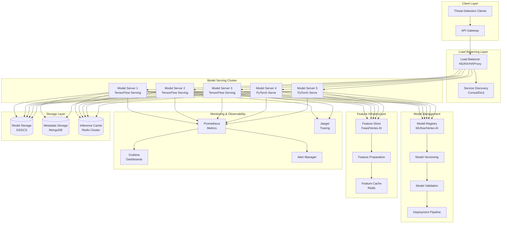

# Phase 8: ML Model Serving Infrastructure Design

## 🎯 Overview

The ML Model Serving Infrastructure provides scalable, high-performance model inference capabilities for the Phase 8 AI Threat Detection system. This infrastructure supports multiple ML models, ensemble learning, real-time inference, and seamless model updates while maintaining sub-100ms detection latency requirements.

## 🏗️ Architecture Components

### Model Serving Architecture Diagram



## 🔧 Core Model Serving Components

### 1. Model Server Infrastructure

#### TensorFlow Serving Configuration

```yaml
# tensorflow-serving-config.yaml
model_config_list {
  config {
    name: 'threat_detection_cnn'
    base_path: '/models/threat_detection/cnn'
    model_platform: 'tensorflow'
    model_version_policy {
      specific {
        versions: 1
        versions: 2
      }
    }
  }
  config {
    name: 'behavioral_analysis_lstm'
    base_path: '/models/behavioral/lstm'
    model_platform: 'tensorflow'
    model_version_policy {
      specific {
        versions: 1
      }
    }
  }
  config {
    name: 'ensemble_threat_scoring'
    base_path: '/models/ensemble/threat_scoring'
    model_platform: 'tensorflow'
    model_version_policy {
      latest {
        num_versions: 2
      }
    }
  }
}

monitoring_config {
  enable: true
  prometheus_config {
    enable: true
    path: "/monitoring/prometheus/metrics"
  }
}
```

#### PyTorch Serve Configuration

```yaml
# pytorch-serve-config.yaml
models:
  threat_detection_transformer:
    model-file: threat_detection_transformer.mar
    batch-size: 32
    max-batch-delay: 50
    response-timeout: 100
    device-map: auto
    parallel-type: pp
    
  anomaly_detection_autoencoder:
    model-file: anomaly_detection_autoencoder.mar
    batch-size: 64
    max-batch-delay: 30
    response-timeout: 80
    device-map: auto
    
  predictive_intelligence_prophet:
    model-file: predictive_intelligence_prophet.mar
    batch-size: 16
    max-batch-delay: 100
    response-timeout: 200
    device-map: auto

metrics:
  enable: true
  metric-endpoint: prometheus
  metric-port: 8082
```

### 2. Model Registry and Versioning

#### MLflow Model Registry Setup

```python
# model_registry_config.py
import mlflow
from mlflow.tracking import MlflowClient
from mlflow.entities.model_registry import ModelVersion

class ThreatDetectionModelRegistry:
    def __init__(self, tracking_uri: str, registry_uri: str):
        self.tracking_uri = tracking_uri
        self.registry_uri = registry_uri
        mlflow.set_tracking_uri(tracking_uri)
        self.client = MlflowClient()
    
    def register_threat_model(self, model_name: str, model_path: str, 
                            metrics: dict, tags: dict) -> ModelVersion:
        """Register a new threat detection model"""
        model_version = mlflow.register_model(
            model_uri=model_path,
            name=model_name,
            tags=tags
        )
        
        # Set model version metrics
        for metric_name, metric_value in metrics.items():
            self.client.set_model_version_tag(
                name=model_name,
                version=model_version.version,
                key=metric_name,
                value=str(metric_value)
            )
        
        return model_version
    
    def transition_model_stage(self, model_name: str, version: int, 
                              stage: str, description: str) -> ModelVersion:
        """Transition model to production stage"""
        return self.client.transition_model_version_stage(
            name=model_name,
            version=version,
            stage=stage,
            archive_existing_versions=True,
            description=description
        )
    
    def get_production_models(self) -> list[ModelVersion]:
        """Get all models in production"""
        return self.client.get_latest_versions(
            name="threat_detection_%",
            stages=["Production"]
        )
    
    def validate_model_performance(self, model_name: str, version: int,
                                 validation_data: dict) -> bool:
        """Validate model performance before production deployment"""
        model_version = self.client.get_model_version(
            name=model_name,
            version=version
        )
        
        # Check performance metrics
        required_metrics = ['accuracy', 'precision', 'recall', 'f1_score']
        for metric in required_metrics:
            if metric not in model_version.tags:
                return False
            
            value = float(model_version.tags[metric])
            thresholds = {
                'accuracy': 0.95,
                'precision': 0.90,
                'recall': 0.85,
                'f1_score': 0.88
            }
            
            if value < thresholds.get(metric, 0.8):
                return False
        
        return True
```

### 3. Feature Store Architecture

#### Feast Feature Store Configuration

```yaml
# feature_store.yaml
project: threat_detection_features
registry: s3://threat-detection-features/registry.db
provider: aws
online_store:
  type: redis
  connection_string: redis://redis-cluster:6379
offline_store:
  type: redshift
  host: redshift-cluster.amazonaws.com
  port: 5439
  database: threat_detection
  user: feast_user
  password: ${REDSHIFT_PASSWORD}

entities:
  - name: user
    join_key: user_id
    value_type: string
  - name: ip_address
    join_key: ip_id
    value_type: string
  - name: session
    join_key: session_id
    value_type: string

feature_views:
  - name: user_behavior_features
    entities: [user]
    ttl: 86400
    features:
      - name: login_frequency_24h
        dtype: float32
      - name: failed_login_rate
        dtype: float32
      - name: average_session_duration
        dtype: float32
      - name: risk_score
        dtype: float32
    batch_source:
      type: redshift
      query: >
        SELECT user_id, login_frequency_24h, failed_login_rate,
               average_session_duration, risk_score, created_timestamp
        FROM user_behavior_features
    online: true
    
  - name: network_features
    entities: [ip_address]
    ttl: 3600
    features:
      - name: ip_reputation_score
        dtype: float32
      - name: geographic_anomaly_score
        dtype: float32
      - name: threat_history_count
        dtype: int32
    batch_source:
      type: redshift
      query: >
        SELECT ip_id, ip_reputation_score, geographic_anomaly_score,
               threat_history_count, created_timestamp
        FROM network_features
    online: true
    
  - name: temporal_features
    entities: [session]
    ttl: 1800
    features:
      - name: time_of_day_sin
        dtype: float32
      - name: time_of_day_cos
        dtype: float32
      - name: day_of_week
        dtype: int32
      - name: is_weekend
        dtype: bool
    batch_source:
      type: redshift
      query: >
        SELECT session_id, time_of_day_sin, time_of_day_cos,
               day_of_week, is_weekend, created_timestamp
        FROM temporal_features
    online: true
```

#### Feature Serving API

```typescript
// feature_serving_service.ts
interface FeatureServingService {
  // Get online features for inference
  getOnlineFeatures(featureRequest: FeatureRequest): Promise<FeatureVector>
  
  // Get batch features for training
  getBatchFeatures(batchRequest: BatchFeatureRequest): Promise<BatchFeatureVector>
  
  // Update feature values
  updateFeatures(updateRequest: FeatureUpdateRequest): Promise<void>
  
  // Get feature metadata
  getFeatureMetadata(featureName: string): Promise<FeatureMetadata>
  
  // Validate feature schema
  validateFeatureSchema(features: FeatureVector): Promise<ValidationResult>
}

class ThreatDetectionFeatureService implements FeatureServingService {
  private feastClient: FeastClient
  private redisClient: RedisClient
  private featureCache: Map<string, FeatureVector>
  
  constructor(feastConfig: FeastConfig, redisConfig: RedisConfig) {
    this.feastClient = new FeastClient(feastConfig)
    this.redisClient = new RedisClient(redisConfig)
    this.featureCache = new Map()
  }
  
  async getOnlineFeatures(request: FeatureRequest): Promise<FeatureVector> {
    const cacheKey = this.generateCacheKey(request)
    
    // Check cache first
    const cachedFeatures = this.featureCache.get(cacheKey)
    if (cachedFeatures && this.isCacheValid(cachedFeatures)) {
      return cachedFeatures
    }
    
    // Get from Redis cache
    const redisFeatures = await this.redisClient.get(cacheKey)
    if (redisFeatures) {
      const features = JSON.parse(redisFeatures)
      this.featureCache.set(cacheKey, features)
      return features
    }
    
    // Get from Feast feature store
    const features = await this.feastClient.getOnlineFeatures({
      featureRefs: request.featureRefs,
      entities: request.entities
    })
    
    // Cache for future use
    await this.redisClient.setex(cacheKey, 300, JSON.stringify(features))
    this.featureCache.set(cacheKey, features)
    
    return features
  }
  
  private generateCacheKey(request: FeatureRequest): string {
    const entityStr = Object.entries(request.entities)
      .sort()
      .map(([k, v]) => `${k}:${v}`)
      .join('|')
    return `features:${request.featureRefs.join(',')}:${entityStr}`
  }
  
  private isCacheValid(features: FeatureVector): boolean {
    const maxAge = 5 * 60 * 1000 // 5 minutes
    return Date.now() - features.timestamp < maxAge
  }
}
```

### 4. Ensemble Learning Infrastructure

#### Ensemble Model Architecture

```typescript
// ensemble_model_service.ts
interface EnsembleModelService {
  // Register ensemble models
  registerEnsemble(ensemble: EnsembleConfig): Promise<EnsembleModel>
  
  // Execute ensemble inference
  predictEnsemble(input: ModelInput): Promise<EnsemblePrediction>
  
  // Update ensemble weights
  updateWeights(ensembleId: string, weights: ModelWeights): Promise<void>
  
  // Get ensemble performance metrics
  getEnsembleMetrics(ensembleId: string): Promise<EnsembleMetrics>
  
  // Validate ensemble configuration
  validateEnsemble(config: EnsembleConfig): Promise<ValidationResult>
}

interface EnsembleConfig {
  ensembleId: string
  modelConfigs: ModelConfig[]
  votingStrategy: VotingStrategy
  weightingStrategy: WeightingStrategy
  aggregationMethod: AggregationMethod
  performanceThresholds: PerformanceThresholds
}

class ThreatDetectionEnsembleService implements EnsembleModelService {
  private models: Map<string, ModelServer>
  private ensembleConfigs: Map<string, EnsembleConfig>
  private performanceTracker: PerformanceTracker
  
  constructor() {
    this.models = new Map()
    this.ensembleConfigs = new Map()
    this.performanceTracker = new PerformanceTracker()
  }
  
  async predictEnsemble(input: ModelInput): Promise<EnsemblePrediction> {
    const ensembleId = input.ensembleId
    const config = this.ensembleConfigs.get(ensembleId)
    
    if (!config) {
      throw new Error(`Ensemble ${ensembleId} not found`)
    }
    
    // Execute parallel model inference
    const modelPromises = config.modelConfigs.map(async (modelConfig) => {
      const modelServer = this.models.get(modelConfig.modelId)
      if (!modelServer) {
        throw new Error(`Model ${modelConfig.modelId} not available`)
      }
      
      const startTime = Date.now()
      const prediction = await modelServer.predict(input.features)
      const latency = Date.now() - startTime
      
      return {
        modelId: modelConfig.modelId,
        prediction,
        latency,
        confidence: prediction.confidence
      }
    })
    
    const modelResults = await Promise.all(modelPromises)
    
    // Apply voting strategy
    const ensemblePrediction = this.applyVotingStrategy(
      modelResults,
      config.votingStrategy,
      config.weightingStrategy
    )
    
    // Track performance
    this.performanceTracker.trackEnsemblePerformance({
      ensembleId,
      modelResults,
      finalPrediction: ensemblePrediction,
      timestamp: Date.now()
    })
    
    return ensemblePrediction
  }
  
  private applyVotingStrategy(
    results: ModelResult[],
    votingStrategy: VotingStrategy,
    weightingStrategy: WeightingStrategy
  ): EnsemblePrediction {
    switch (votingStrategy) {
      case 'majority':
        return this.majorityVoting(results, weightingStrategy)
      case 'weighted':
        return this.weightedVoting(results, weightingStrategy)
      case 'stacking':
        return this.stackingVoting(results, weightingStrategy)
      default:
        throw new Error(`Unsupported voting strategy: ${votingStrategy}`)
    }
  }
  
  private majorityVoting(results: ModelResult[], weighting: WeightingStrategy): EnsemblePrediction {
    const predictions = results.map(r => r.prediction.class)
    const predictionCounts = new Map<string, number>()
    
    predictions.forEach(pred => {
      predictionCounts.set(pred, (predictionCounts.get(pred) || 0) + 1)
    })
    
    const majorityPrediction = Array.from(predictionCounts.entries())
      .sort(([,a], [,b]) => b - a)[0][0]
    
    const confidence = predictionCounts.get(majorityPrediction)! / results.length
    
    return {
      prediction: majorityPrediction,
      confidence,
      modelContributions: results.map(r => ({
        modelId: r.modelId,
        contribution: r.prediction.class === majorityPrediction ? 1 : 0
      }))
    }
  }
}
```

### 5. Model Performance Monitoring

#### Real-time Model Monitoring

```typescript
// model_monitoring_service.ts
interface ModelMonitoringService {
  // Monitor model performance
  monitorPerformance(modelId: string, metrics: PerformanceMetrics): Promise<void>
  
  // Detect model drift
  detectDrift(modelId: string, currentData: ModelData[]): Promise<DriftDetection>
  
  // Track prediction latency
  trackLatency(modelId: string, latency: number): Promise<void>
  
  // Monitor resource usage
  monitorResources(modelId: string): Promise<ResourceUsage>
  
  // Generate performance reports
  generateReport(modelId: string, timeframe: TimeWindow): Promise<PerformanceReport>
}

class ThreatDetectionModelMonitor implements ModelMonitoringService {
  private metricsCollector: MetricsCollector
  private driftDetector: DriftDetector
  private alertManager: AlertManager
  private prometheusClient: PrometheusClient
  
  constructor(config: MonitoringConfig) {
    this.metricsCollector = new MetricsCollector(config.metricsConfig)
    this.driftDetector = new DriftDetector(config.driftConfig)
    this.alertManager = new AlertManager(config.alertConfig)
    this.prometheusClient = new PrometheusClient(config.prometheusConfig)
  }
  
  async monitorPerformance(modelId: string, metrics: PerformanceMetrics): Promise<void> {
    // Collect metrics
    await this.metricsCollector.collect({
      modelId,
      timestamp: Date.now(),
      metrics: {
        accuracy: metrics.accuracy,
        precision: metrics.precision,
        recall: metrics.recall,
        f1Score: metrics.f1Score,
        latency: metrics.latency,
        throughput: metrics.throughput
      }
    })
    
    // Send to Prometheus
    await this.prometheusClient.recordMetrics({
      model_accuracy: metrics.accuracy,
      model_precision: metrics.precision,
      model_recall: metrics.recall,
      model_f1_score: metrics.f1Score,
      model_latency_ms: metrics.latency,
      model_throughput_rps: metrics.throughput
    }, {
      model_id: modelId,
      model_version: metrics.modelVersion
    })
    
    // Check performance thresholds
    if (this.isPerformanceDegraded(metrics)) {
      await this.alertManager.sendAlert({
        type: 'PERFORMANCE_DEGRADATION',
        modelId,
        severity: 'HIGH',
        message: `Model ${modelId} performance degraded below thresholds`,
        metrics
      })
    }
  }
  
  async detectDrift(modelId: string, currentData: ModelData[]): Promise<DriftDetection> {
    const driftResult = await this.driftDetector.detect({
      modelId,
      currentData,
      referenceData: await this.getReferenceData(modelId),
      detectionMethod: 'KS_TEST' // Kolmogorov-Smirnov test
    })
    
    if (driftResult.isDriftDetected) {
      await this.alertManager.sendAlert({
        type: 'MODEL_DRIFT',
        modelId,
        severity: driftResult.severity,
        message: `Model drift detected for ${modelId}`,
        driftMetrics: driftResult.metrics
      })
    }
    
    return driftResult
  }
  
  private isPerformanceDegraded(metrics: PerformanceMetrics): boolean {
    const thresholds = {
      accuracy: 0.95,
      precision: 0.90,
      recall: 0.85,
      latency: 100 // ms
    }
    
    return metrics.accuracy < thresholds.accuracy ||
           metrics.precision < thresholds.precision ||
           metrics.recall < thresholds.recall ||
           metrics.latency > thresholds.latency
  }
}
```

## 📊 Performance Optimization

### Model Optimization Strategies

```typescript
// model_optimization_service.ts
interface ModelOptimizationService {
  // Optimize model for inference
  optimizeModel(model: MLModel): Promise<OptimizedModel>
  
  // Apply quantization
  quantizeModel(model: MLModel, quantizationConfig: QuantizationConfig): Promise<QuantizedModel>
  
  // Apply pruning
  pruneModel(model: MLModel, pruningConfig: PruningConfig): Promise<PrunedModel>
  
  // Optimize for specific hardware
  optimizeForHardware(model: MLModel, hardware: HardwareTarget): Promise<HardwareOptimizedModel>
  
  // Benchmark model performance
  benchmarkModel(model: MLModel): Promise<BenchmarkResult>
}

class ThreatDetectionModelOptimizer implements ModelOptimizationService {
  async optimizeModel(model: MLModel): Promise<OptimizedModel> {
    const optimizations = []
    
    // Apply quantization
    const quantizedModel = await this.quantizeModel(model, {
      quantizationType: 'INT8',
      calibrationDataset: 'threat_detection_calibration',
      preserveAccuracy: 0.99
    })
    optimizations.push('quantization')
    
    // Apply pruning
    const prunedModel = await this.pruneModel(quantizedModel, {
      pruningRatio: 0.3,
      structuredPruning: true,
      fineTuningEpochs: 5
    })
    optimizations.push('pruning')
    
    // Optimize graph
    const optimizedGraph = await this.optimizeGraph(prunedModel)
    optimizations.push('graph_optimization')
    
    return {
      modelId: model.id,
      originalSize: model.size,
      optimizedSize: optimizedGraph.size,
      optimizationTechniques: optimizations,
      performanceImprovement: this.calculateImprovement(model, optimizedGraph),
      accuracyRetention: await this.validateAccuracy(model, optimizedGraph)
    }
  }
  
  async quantizeModel(model: MLModel, config: QuantizationConfig): Promise<QuantizedModel> {
    // Use TensorFlow Lite for quantization
    const converter = tf.lite.TFLiteConverter.from_saved_model(model.path)
    converter.optimizations = [tf.lite.Optimize.DEFAULT]
    converter.target_spec.supported_types = [tf.int8]
    converter.inference_input_type = tf.int8
    converter.inference_output_type = tf.int8
    
    // Calibration for quantization
    converter.representative_dataset = this.getRepresentativeDataset(config.calibrationDataset)
    
    const quantizedModel = await converter.convert()
    
    return {
      modelId: model.id,
      quantizedModel,
      quantizationType: config.quantizationType,
      sizeReduction: (model.size - quantizedModel.byteLength) / model.size,
      accuracy: await this.validateQuantizedAccuracy(model, quantizedModel)
    }
  }
}
```

## 🚀 Deployment and Scaling

### Kubernetes Deployment Configuration

```yaml
# model-serving-deployment.yaml
apiVersion: apps/v1
kind: Deployment
metadata:
  name: threat-detection-model-server
  namespace: threat-detection
spec:
  replicas: 3
  selector:
    matchLabels:
      app: threat-detection-model-server
  template:
    metadata:
      labels:
        app: threat-detection-model-server
    spec:
      containers:
      - name: tensorflow-serving
        image: tensorflow/serving:2.11.0
        ports:
        - containerPort: 8501
          name: rest-api
        - containerPort: 8500
          name: grpc
        command:
        - "/usr/bin/tensorflow_model_server"
        args:
        - "--model_config_file=/models/model_config.conf"
        - "--monitoring_config_file=/config/monitoring.conf"
        - "--rest_api_timeout_in_ms=10000"
        - "--enable_batching=true"
        - "--batching_parameters_file=/config/batching.conf"
        resources:
          requests:
            memory: "2Gi"
            cpu: "1000m"
            nvidia.com/gpu: "1"
          limits:
            memory: "4Gi"
            cpu: "2000m"
            nvidia.com/gpu: "1"
        volumeMounts:
        - name: model-storage
          mountPath: /models
        - name: config-volume
          mountPath: /config
        env:
        - name: MODEL_NAME
          value: "threat_detection_models"
        - name: CUDA_VISIBLE_DEVICES
          value: "0"
        
      - name: model-agent
        image: pixelated/model-agent:latest
        ports:
        - containerPort: 8080
          name: agent-api
        env:
        - name: MODEL_REGISTRY_URL
          value: "http://mlflow-registry:5000"
        - name: FEATURE_STORE_URL
          value: "redis://feature-store-redis:6379"
        - name: PROMETHEUS_GATEWAY
          value: "prometheus-pushgateway:9091"
        resources:
          requests:
            memory: "512Mi"
            cpu: "250m"
          limits:
            memory: "1Gi"
            cpu: "500m"
            
      volumes:
      - name: model-storage
        persistentVolumeClaim:
          claimName: model-storage-pvc
      - name: config-volume
        configMap:
          name: model-server-config
          
---
apiVersion: v1
kind: Service
metadata:
  name: threat-detection-model-service
  namespace: threat-detection
spec:
  selector:
    app: threat-detection-model-server
  ports:
  - name: rest-api
    port: 8501
    targetPort: 8501
  - name: grpc
    port: 8500
    targetPort: 8500
  - name: agent-api
    port: 8080
    targetPort: 8080
  type: ClusterIP
```

### Horizontal Pod Autoscaler

```yaml
# model-server-hpa.yaml
apiVersion: autoscaling/v2
kind: HorizontalPodAutoscaler
metadata:
  name: threat-detection-model-server-hpa
  namespace: threat-detection
spec:
  scaleTargetRef:
    apiVersion: apps/v1
    kind: Deployment
    name: threat-detection-model-server
  minReplicas: 3
  maxReplicas: 20
  metrics:
  - type: Resource
    resource:
      name: cpu
      target:
        type: Utilization
        averageUtilization: 70
  - type: Resource
    resource:
      name: memory
      target:
        type: Utilization
        averageUtilization: 80
  - type: Pods
    pods:
      metric:
        name: tensorflow_serving_requests_per_second
      target:
        type: AverageValue
        averageValue: "100"
  - type: External
    external:
      metric:
        name: pubsub.googleapis.com|subscription|num_undelivered_messages
        selector:
          matchLabels:
            resource.labels.subscription_id: "threat-detection-events"
      target:
        type: Value
        value: "1000"
  behavior:
    scaleDown:
      stabilizationWindowSeconds: 300
      policies:
      - type: Percent
        value: 50
        periodSeconds: 60
    scaleUp:
      stabilizationWindowSeconds: 60
      policies:
      - type: Percent
        value: 100
        periodSeconds: 30
      - type: Pods
        value: 5
        periodSeconds: 60
```

## 📈 Monitoring and Observability

### Prometheus Metrics Configuration

```yaml
# prometheus-rules.yaml
groups:
- name: threat_detection_models
  rules:
  - alert: HighModelLatency
    expr: tensorflow_serving_request_latency_bucket{le="100"} < 0.95
    for: 5m
    labels:
      severity: warning
    annotations:
      summary: "High model inference latency"
      description: "Model {{ $labels.model_name }} latency is above 100ms for more than 5% of requests"
      
  - alert: ModelAccuracyDegradation
    expr: model_accuracy < 0.95
    for: 10m
    labels:
      severity: critical
    annotations:
      summary: "Model accuracy degradation detected"
      description: "Model {{ $labels.model_name }} accuracy has dropped below 95%"
      
  - alert: HighResourceUsage
    expr: container_memory_usage_bytes / container_spec_memory_limit_bytes > 0.9
    for: 5m
    labels:
      severity: warning
    annotations:
      summary: "High memory usage on model server"
      description: "Model server {{ $labels.pod }} is using more than 90% of memory"
      
  - alert: ModelDriftDetected
    expr: model_drift_score > 0.8
    for: 15m
    labels:
      severity: critical
    annotations:
      summary: "Model drift detected"
      description: "Significant drift detected in model {{ $labels.model_name }}"
      
  - alert: LowModelAvailability
    expr: up{job="tensorflow-serving"} < 0.8
    for: 2m
    labels:
      severity: critical
    annotations:
      summary: "Low model server availability"
      description: "Less than 80% of model servers are available"
```

### Grafana Dashboard Configuration

```json
{
  "dashboard": {
    "title": "Threat Detection Model Serving",
    "panels": [
      {
        "title": "Model Inference Latency",
        "type": "graph",
        "targets": [
          {
            "expr": "histogram_quantile(0.95, tensorflow_serving_request_latency_bucket)",
            "legendFormat": "95th percentile"
          },
          {
            "expr": "histogram_quantile(0.50, tensorflow_serving_request_latency_bucket)",
            "legendFormat": "50th percentile"
          }
        ],
        "yAxes": [
          {
            "label": "Latency (ms)",
            "max": 200,
            "min": 0
          }
        ]
      },
      {
        "title": "Model Accuracy Over Time",
        "type": "graph",
        "targets": [
          {
            "expr": "model_accuracy",
            "legendFormat": "{{model_name}} accuracy"
          }
        ],
        "yAxes": [
          {
            "label": "Accuracy",
            "max": 1,
            "min": 0.8
          }
        ]
      },
      {
        "title": "Request Volume",
        "type": "graph",
        "targets": [
          {
            "expr": "rate(tensorflow_serving_request_count[5m])",
            "legendFormat": "{{model_name}} requests/sec"
          }
        ],
        "yAxes": [
          {
            "label": "Requests/sec"
          }
        ]
      },
      {
        "title": "Model Drift Score",
        "type": "graph",
        "targets": [
          {
            "expr": "model_drift_score",
            "legendFormat": "{{model_name}} drift score"
          }
        ],
        "yAxes": [
          {
            "label": "Drift Score",
            "max": 1,
            "min": 0
          }
        ]
      }
    ]
  }
}
```

## 🔒 Security and Compliance

### Model Security Framework

```typescript
// model_security_service.ts
interface ModelSecurityService {
  // Validate model integrity
  validateModelIntegrity(model: MLModel): Promise<IntegrityValidation>
  
  // Scan for adversarial vulnerabilities
  scanForAdversarialVulnerabilities(model: MLModel): Promise<VulnerabilityScan>
  
  // Implement model access control
  controlModelAccess(accessRequest: ModelAccessRequest): Promise<AccessDecision>
  
  // Encrypt model artifacts
  encryptModel(model: MLModel): Promise<EncryptedModel>
  
  // Audit model usage
  auditModelUsage(usage: ModelUsage): Promise<AuditLog>
}

class ThreatDetectionModelSecurity implements ModelSecurityService {
  async validateModelIntegrity(model: MLModel): Promise<IntegrityValidation> {
    // Calculate model hash
    const calculatedHash = await this.calculateModelHash(model)
    
    // Compare with stored hash
    const storedHash = await this.getStoredHash(model.id)
    
    const isValid = calculatedHash === storedHash
    
    if (!isValid) {
      await this.alertManager.sendAlert({
        type: 'MODEL_INTEGRITY_VIOLATION',
        modelId: model.id,
        severity: 'CRITICAL',
        message: 'Model integrity validation failed'
      })
    }
    
    return {
      modelId: model.id,
      isValid,
      calculatedHash,
      storedHash,
      validationTimestamp: Date.now()
    }
  }
  
  async scanForAdversarialVulnerabilities(model: MLModel): Promise<VulnerabilityScan> {
    // Implement adversarial testing
    const adversarialTests = [
      'FGSM_ATTACK',
      'PGD_ATTACK',
      'BIM_ATTACK',
      'CW_ATTACK'
    ]
    
    const vulnerabilityResults = await Promise.all(
      adversarialTests.map(test => this.runAdversarialTest(model, test))
    )
    
    const vulnerabilities = vulnerabilityResults
      .filter(result => result.isVulnerable)
      .map(result => ({
        attackType: result.attackType,
        successRate: result.successRate,
        severity: this.calculateSeverity(result.successRate)
      }))
    
    return {
      modelId: model.id,
      vulnerabilities,
      overallRiskScore: this.calculateOverallRisk(vulnerabilities),
      recommendations: this.generateSecurityRecommendations(vulnerabilities)
    }
  }
}
```

## 📋 Deployment Checklist

### Pre-deployment Validation

- [ ] Model performance validation completed
- [ ] Security vulnerability scanning passed
- [ ] Load testing with expected traffic volumes
- [ ] GPU resource allocation verified
- [ ] Model registry connectivity tested
- [ ] Feature store synchronization verified
- [ ] Monitoring dashboards configured
- [ ] Alert rules validated
- [ ] Backup and recovery procedures tested
- [ ] Rollback strategy documented

### Production Deployment Steps

1. **Model Preparation**
   - Validate model artifacts in registry
   - Verify feature store synchronization
   - Test model serving endpoints
   - Validate performance benchmarks

2. **Infrastructure Setup**
   - Deploy model serving cluster
   - Configure load balancers
   - Set up monitoring and alerting
   - Configure auto-scaling policies

3. **Security Configuration**
   - Enable model encryption
   - Configure access controls
   - Set up audit logging
   - Validate security scanning

4. **Performance Optimization**
   - Apply model optimizations
   - Configure caching strategies
   - Optimize batch processing
   - Tune resource allocation

5. **Monitoring Activation**
   - Enable performance metrics
   - Configure drift detection
   - Set up alerting rules
   - Validate dashboard functionality

This comprehensive ML model serving infrastructure provides the foundation for scalable, secure, and high-performance threat detection while maintaining the strict latency and accuracy requirements of the Phase 8 system.