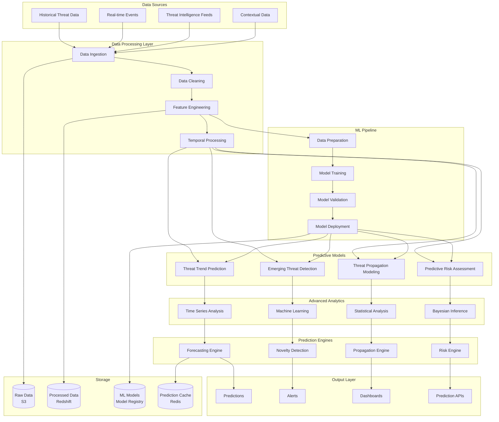

# Phase 8: Predictive Threat Intelligence System Architecture

## 🎯 Overview

The Predictive Threat Intelligence System provides advanced forecasting capabilities for threat trends, emerging attack patterns, and proactive security insights. This system employs sophisticated machine learning models, statistical analysis, and temporal modeling to predict future threats while maintaining privacy and ethical AI principles.

## 🏗️ System Architecture

### Predictive Intelligence Architecture Diagram



## 🔧 Core Predictive Components

### 1. Threat Trend Prediction Engine (TTPE)

#### Time Series Forecasting Architecture

```typescript
// threat_trend_prediction_engine.ts
interface ThreatTrendPredictionEngine {
  // Threat frequency prediction
  predictThreatFrequency(historicalData: ThreatData[], horizon: TimeHorizon): Promise<ThreatFrequencyPrediction>
  
  // Attack trend forecasting
  forecastAttackTrends(threatData: ThreatData[], context: SecurityContext): Promise<AttackTrendForecast>
  
  // Seasonal pattern recognition
  identifySeasonalPatterns(data: ThreatData[]): Promise<SeasonalPattern[]>
  
  // Multi-horizon prediction
  predictMultipleHorizons(data: ThreatData[], horizons: TimeHorizon[]): Promise<MultiHorizonPrediction>
  
  // Uncertainty quantification
  quantifyPredictionUncertainty(predictions: ThreatPrediction[]): Promise<UncertaintyQuantification>
}

interface ThreatFrequencyPrediction {
  predictionId: string
  timeHorizon: TimeHorizon
  predictedFrequencies: PredictedFrequency[]
  confidenceIntervals: ConfidenceInterval[]
  trendDirection: TrendDirection
  seasonalComponents: SeasonalComponent[]
  uncertaintyMetrics: UncertaintyMetric[]
  explanatoryFactors: ExplanatoryFactor[]
  modelPerformance: ModelPerformance
}

class AdvancedThreatTrendPrediction implements ThreatTrendPredictionEngine {
  private models: Map<string, TimeSeriesModel>
  private ensembleMethods: EnsembleMethod[]
  private featureEngineer: FeatureEngineer
  private uncertaintyQuantifier: UncertaintyQuantifier
  
  constructor(config: ThreatTrendConfig) {
    this.models = this.initializeModels(config)
    this.ensembleMethods = config.ensembleMethods
    this.featureEngineer = new FeatureEngineer(config.featureConfig)
    this.uncertaintyQuantifier = new UncertaintyQuantifier(config.uncertaintyConfig)
  }
  
  async predictThreatFrequency(
    historicalData: ThreatData[], 
    horizon: TimeHorizon
  ): Promise<ThreatFrequencyPrediction> {
    // Prepare time series data
    const timeSeries = this.prepareTimeSeries(historicalData, 'threat_frequency')
    
    // Engineer features
    const features = await this.featureEngineer.engineerTimeSeriesFeatures(timeSeries, {
      lagFeatures: [1, 2, 3, 7, 14, 30],
      rollingStatistics: [
        { window: 7, statistics: ['mean', 'std', 'min', 'max'] },
        { window: 30, statistics: ['mean', 'std', 'skew', 'kurtosis'] }
      ],
      dateFeatures: ['hour', 'day_of_week', 'month', 'quarter'],
      exogenousVariables: ['holiday_indicator', 'system_load', 'user_activity']
    })
    
    // Run multiple models
    const modelPredictions = await Promise.all(
      Array.from(this.models.values()).map(model => 
        this.runModelPrediction(model, features, horizon)
      )
    )
    
    // Ensemble predictions
    const ensemblePrediction = this.ensemblePredictions(modelPredictions)
    
    // Quantify uncertainty
    const uncertainty = await this.uncertaintyQuantifier.quantify({
      predictions: modelPredictions,
      ensemblePrediction,
      confidenceLevel: 0.95
    })
    
    // Identify seasonal patterns
    const seasonalPatterns = await this.identifySeasonalPatterns(historicalData)
    
    return {
      predictionId: this.generatePredictionId(),
      timeHorizon: horizon,
      predictedFrequencies: ensemblePrediction.pointPredictions,
      confidenceIntervals: uncertainty.confidenceIntervals,
      trendDirection: this.determineTrendDirection(ensemblePrediction),
      seasonalComponents: seasonalPatterns,
      uncertaintyMetrics: uncertainty.metrics,
      explanatoryFactors: this.identifyExplanatoryFactors(features, ensemblePrediction),
      modelPerformance: await this.evaluateModelPerformance(modelPredictions, historicalData)
    }
  }
  
  private initializeModels(config: ThreatTrendConfig): Map<string, TimeSeriesModel> {
    const models = new Map()
    
    // Prophet model for trend and seasonality
    models.set('prophet', new ProphetModel({
      growth: 'linear',
      seasonalityMode: 'multiplicative',
      yearlySeasonality: true,
      weeklySeasonality: true,
      dailySeasonality: true,
      intervalWidth: 0.95
    }))
    
    // LSTM for complex temporal patterns
    models.set('lstm', new LSTMModel({
      layers: [128, 64, 32],
      dropout: 0.2,
      recurrentDropout: 0.2,
      optimizer: 'adam',
      loss: 'mse',
      epochs: 100,
      batchSize: 32
    }))
    
    // ARIMA for traditional time series analysis
    models.set('arima', new ARIMAModel({
      order: [2, 1, 2],
      seasonalOrder: [1, 1, 1, 24],
      trend: 'c',
      enforceStationarity: true,
      enforceInvertibility: true
    }))
    
    // XGBoost for feature-based predictions
    models.set('xgboost', new XGBoostModel({
      nEstimators: 1000,
      maxDepth: 6,
      learningRate: 0.1,
      subsample: 0.8,
      colsampleBytree: 0.8,
      objective: 'reg:squarederror'
    }))
    
    return models
  }
  
  private async runModelPrediction(
    model: TimeSeriesModel, 
    features: TimeSeriesFeatures, 
    horizon: TimeHorizon
  ): Promise<ModelPrediction> {
    const startTime = Date.now()
    
    try {
      const prediction = await model.predict(features, horizon)
      const processingTime = Date.now() - startTime
      
      return {
        modelName: model.name,
        predictions: prediction.values,
        confidenceIntervals: prediction.intervals,
        modelSpecificMetrics: prediction.metrics,
        processingTime,
        success: true
      }
    } catch (error) {
      return {
        modelName: model.name,
        predictions: [],
        confidenceIntervals: [],
        modelSpecificMetrics: {},
        processingTime: Date.now() - startTime,
        success: false,
        error: error.message
      }
    }
  }
  
  private ensemblePredictions(predictions: ModelPrediction[]): EnsemblePrediction {
    const successfulPredictions = predictions.filter(p => p.success)
    
    if (successfulPredictions.length === 0) {
      throw new Error('All models failed to produce predictions')
    }
    
    // Weighted average ensemble
    const weights = this.calculateModelWeights(successfulPredictions)
    const ensembleValues = this.weightedAverageEnsemble(successfulPredictions, weights)
    
    // Combine confidence intervals
    const ensembleIntervals = this.combineConfidenceIntervals(successfulPredictions, weights)
    
    return {
      pointPredictions: ensembleValues,
      confidenceIntervals: ensembleIntervals,
      ensembleWeights: weights,
      modelContributions: successfulPredictions.map(p => ({
        modelName: p.modelName,
        weight: weights[p.modelName] || 0,
        contribution: this.calculateContribution(p, weights)
      }))
    }
  }
  
  private calculateModelWeights(predictions: ModelPrediction[]): Record<string, number> {
    // Calculate weights based on historical performance and current predictions
    const weights: Record<string, number> = {}
    let totalWeight = 0
    
    for (const prediction of predictions) {
      // Weight based on inverse of processing time (faster models get higher weight)
      const speedWeight = 1 / (prediction.processingTime + 1)
      
      // Weight based on model confidence (if available)
      const confidenceWeight = prediction.modelSpecificMetrics.confidence || 0.5
      
      // Weight based on historical accuracy (from model registry)
      const historicalWeight = this.getHistoricalAccuracy(prediction.modelName)
      
      // Combined weight
      const combinedWeight = (speedWeight * 0.2 + confidenceWeight * 0.3 + historicalWeight * 0.5)
      weights[prediction.modelName] = combinedWeight
      totalWeight += combinedWeight
    }
    
    // Normalize weights
    for (const modelName in weights) {
      weights[modelName] = weights[modelName] / totalWeight
    }
    
    return weights
  }
}
```

### 2. Emerging Threat Detection System (ETDS)

#### Novelty Detection Architecture

```typescript
// emerging_threat_detection_system.ts
interface EmergingThreatDetectionSystem {
  // Novel threat detection
  detectNovelThreats(currentData: ThreatData[], historicalBaseline: ThreatData[]): Promise<NovelThreat[]>
  
  // Emerging pattern identification
  identifyEmergingPatterns(threatStream: ThreatStream): Promise<EmergingPattern[]>
  
  // Zero-day attack prediction
  predictZeroDayAttacks(anomalyData: AnomalyData[]): Promise<ZeroDayPrediction[]>
  
  // Concept drift detection
  detectConceptDrift(currentPatterns: ThreatPattern[], historicalPatterns: ThreatPattern[]): Promise<ConceptDrift[]>
  
  // Cross-domain threat correlation
  correlateCrossDomainThreats(domains: SecurityDomain[]): Promise<CrossDomainCorrelation[]>
}

interface NovelThreat {
  threatId: string
  noveltyScore: number
  emergenceRate: number
  confidence: number
  supportingEvidence: SupportingEvidence[]
  potentialImpact: PotentialImpact
  recommendedActions: RecommendedAction[]
  temporalCharacteristics: TemporalCharacteristics
  relatedPatterns: RelatedPattern[]
}

class AdvancedEmergingThreatDetection implements EmergingThreatDetectionSystem {
  private noveltyDetectors: NoveltyDetector[]
  private patternMiners: PatternMiner[]
  private driftDetectors: DriftDetector[]
  private crossDomainCorrelator: CrossDomainCorrelator
  
  constructor(config: EmergingThreatConfig) {
    this.noveltyDetectors = this.initializeNoveltyDetectors(config)
    this.patternMiners = this.initializePatternMiners(config)
    this.driftDetectors = this.initializeDriftDetectors(config)
    this.crossDomainCorrelator = new CrossDomainCorrelator(config.crossDomainConfig)
  }
  
  async detectNovelThreats(
    currentData: ThreatData[], 
    historicalBaseline: ThreatData[]
  ): Promise<NovelThreat[]> {
    const novelThreats: NovelThreat[] = []
    
    // Run multiple novelty detection algorithms
    const noveltyResults = await Promise.all(
      this.noveltyDetectors.map(detector => 
        detector.detectNovelty(currentData, historicalBaseline)
      )
    )
    
    // Ensemble voting on novelty scores
    const ensembleNovelty = this.ensembleNoveltyScores(noveltyResults)
    
    // Identify potential novel threats
    for (const dataPoint of currentData) {
      const noveltyScore = ensembleNovelty.get(dataPoint.id)
      
      if (noveltyScore && noveltyScore > config.noveltyThreshold) {
        // Analyze emergence characteristics
        const emergenceAnalysis = await this.analyzeEmergenceCharacteristics(
          dataPoint, 
          historicalBaseline
        )
        
        // Predict potential impact
        const impactPrediction = await this.predictPotentialImpact(dataPoint)
        
        // Generate recommendations
        const recommendations = await this.generateRecommendations(dataPoint, noveltyScore)
        
        novelThreats.push({
          threatId: dataPoint.id,
          noveltyScore,
          emergenceRate: emergenceAnalysis.emergenceRate,
          confidence: noveltyScore, // Use novelty score as confidence
          supportingEvidence: emergenceAnalysis.evidence,
          potentialImpact: impactPrediction,
          recommendedActions: recommendations,
          temporalCharacteristics: emergenceAnalysis.temporal,
          relatedPatterns: emergenceAnalysis.patterns
        })
      }
    }
    
    return novelThreats.sort((a, b) => b.noveltyScore - a.noveltyScore)
  }
  
  private initializeNoveltyDetectors(config: EmergingThreatConfig): NoveltyDetector[] {
    const detectors: NoveltyDetector[] = []
    
    // Local Outlier Factor (LOF)
    detectors.push(new LOFNoveltyDetector({
      nNeighbors: 20,
      contamination: 0.1,
      algorithm: 'auto',
      metric: 'minkowski',
      p: 2
    }))
    
    // One-Class SVM
    detectors.push(new OneClassSVMNoveltyDetector({
      kernel: 'rbf',
      gamma: 'scale',
      nu: 0.1,
      shrinking: true
    }))
    
    // Isolation Forest for novelty detection
    detectors.push(new IsolationForestNoveltyDetector({
      nEstimators: 100,
      contamination: 0.1,
      maxSamples: 'auto',
      randomState: 42
    }))
    
    // Autoencoder-based novelty detection
    detectors.push(new AutoencoderNoveltyDetector({
      encoderLayers: [64, 32, 16],
      decoderLayers: [32, 64],
      latentDim: 16,
      activation: 'relu',
      optimizer: 'adam',
      loss: 'mse',
      epochs: 100
    }))
    
    return detectors
  }
  
  private ensembleNoveltyScores(results: NoveltyResult[]): Map<string, number> {
    const ensembleScores = new Map<string, number>()
    
    // Collect all unique data point IDs
    const allIds = new Set<string>()
    results.forEach(result => {
      result.scores.forEach((_, id) => allIds.add(id))
    })
    
    // Calculate ensemble score for each data point
    allIds.forEach(id => {
      const scores = results.map(result => result.scores.get(id) || 0)
      const weights = results.map(result => result.detectorWeight || 1)
      
      // Weighted average ensemble
      const ensembleScore = scores.reduce((sum, score, index) => 
        sum + (score * weights[index]), 0
      ) / weights.reduce((sum, weight) => sum + weight, 0)
      
      ensembleScores.set(id, ensembleScore)
    })
    
    return ensembleScores
  }
  
  async identifyEmergingPatterns(threatStream: ThreatStream): Promise<EmergingPattern[]> {
    const emergingPatterns: EmergingPattern[] = []
    
    // Process streaming data
    const windowedData = this.createSlidingWindows(threatStream, {
      windowSize: 3600000, // 1 hour
      slideInterval: 300000, // 5 minutes
      minObservations: 100
    })
    
    for (const window of windowedData) {
      // Run pattern mining algorithms
      const patternResults = await Promise.all(
        this.patternMiners.map(miner => miner.minePatterns(window.data))
      )
      
      // Identify emerging patterns
      for (const result of patternResults) {
        for (const pattern of result.patterns) {
          if (this.isEmergingPattern(pattern, window)) {
            const emergenceScore = this.calculateEmergenceScore(pattern, window)
            
            emergingPatterns.push({
              patternId: pattern.id,
              patternType: pattern.type,
              patternDescription: pattern.description,
              emergenceScore,
              supportingEvidence: pattern.evidence,
              temporalWindow: window,
              confidence: pattern.confidence,
              trendDirection: this.determineTrendDirection(pattern),
              growthRate: this.calculateGrowthRate(pattern)
            })
          }
        }
      }
    }
    
    return emergingPatterns.sort((a, b) => b.emergenceScore - a.emergenceScore)
  }
  
  private isEmergingPattern(pattern: ThreatPattern, window: TemporalWindow): boolean {
    // Check if pattern is showing significant growth
    const growthRate = this.calculateGrowthRate(pattern)
    const recency = this.calculateRecency(pattern)
    const frequency = this.calculateFrequency(pattern)
    
    // Emerging pattern criteria
    return growthRate > config.emergenceThresholds.growthRate &&
           recency < config.emergenceThresholds.recency &&
           frequency > config.emergenceThresholds.frequency
  }
}
```

### 3. Threat Propagation Modeling Engine (TPME)

#### Network-Based Threat Spread Analysis

```typescript
// threat_propagation_modeling_engine.ts
interface ThreatPropagationModelingEngine {
  // Propagation simulation
  simulateThreatPropagation(initialThreat: Threat, network: NetworkGraph): Promise<PropagationSimulation>
  
  // Network vulnerability assessment
  assessNetworkVulnerability(network: NetworkGraph, threatTypes: ThreatType[]): Promise<NetworkVulnerability>
  
  // Cascade failure prediction
  predictCascadeFailures(initialFailure: SystemFailure, dependencies: DependencyGraph): Promise<CascadePrediction>
  
  // Contagion modeling
  modelThreatContagion(threat: Threat, population: Population): Promise<ContagionModel>
  
  // Resilience analysis
  analyzeNetworkResilience(network: NetworkGraph, attackScenarios: AttackScenario[]): Promise<ResilienceAnalysis>
}

interface PropagationSimulation {
  simulationId: string
  initialConditions: InitialConditions
  propagationTimeline: PropagationEvent[]
  finalState: FinalState
  infectionCurves: InfectionCurve[]
  networkMetrics: NetworkMetric[]
  criticalPaths: CriticalPath[]
  interventionPoints: InterventionPoint[]
  confidenceIntervals: ConfidenceInterval[]
}

class AdvancedThreatPropagationModeling implements ThreatPropagationModelingEngine {
  private propagationModels: PropagationModel[]
  private graphAnalyzers: GraphAnalyzer[]
  private simulationEngine: SimulationEngine
  private resilienceCalculator: ResilienceCalculator
  
  constructor(config: PropagationModelingConfig) {
    this.propagationModels = this.initializePropagationModels(config)
    this.graphAnalyzers = this.initializeGraphAnalyzers(config)
    this.simulationEngine = new SimulationEngine(config.simulationConfig)
    this.resilienceCalculator = new ResilienceCalculator(config.resilienceConfig)
  }
  
  async simulateThreatPropagation(
    initialThreat: Threat, 
    network: NetworkGraph
  ): Promise<PropagationSimulation> {
    // Prepare network for simulation
    const preparedNetwork = this.prepareNetworkForSimulation(network)
    
    // Run multiple propagation models
    const modelSimulations = await Promise.all(
      this.propagationModels.map(model => 
        this.runPropagationModel(model, initialThreat, preparedNetwork)
      )
    )
    
    // Ensemble simulation results
    const ensembleSimulation = this.ensembleSimulations(modelSimulations)
    
    // Identify critical paths and intervention points
    const criticalPaths = this.identifyCriticalPaths(ensembleSimulation)
    const interventionPoints = this.identifyInterventionPoints(ensembleSimulation)
    
    // Calculate confidence intervals
    const confidenceIntervals = this.calculateConfidenceIntervals(modelSimulations)
    
    return {
      simulationId: this.generateSimulationId(),
      initialConditions: {
        threat: initialThreat,
        network: preparedNetwork,
        startTime: Date.now()
      },
      propagationTimeline: ensembleSimulation.timeline,
      finalState: ensembleSimulation.finalState,
      infectionCurves: ensembleSimulation.infectionCurves,
      networkMetrics: ensembleSimulation.networkMetrics,
      criticalPaths,
      interventionPoints,
      confidenceIntervals
    }
  }
  
  private initializePropagationModels(config: PropagationModelingConfig): PropagationModel[] {
    const models: PropagationModel[] = []
    
    // SIR (Susceptible-Infected-Recovered) model
    models.push(new SIRModel({
      infectionRate: 0.3,
      recoveryRate: 0.1,
      initialInfected: 0.01,
      networkTopology: 'scale_free'
    }))
    
    // SEIR (Susceptible-Exposed-Infected-Recovered) model
    models.push(new SEIRModel({
      infectionRate: 0.3,
      exposureRate: 0.2,
      recoveryRate: 0.1,
      initialExposed: 0.005,
      initialInfected: 0.005
    }))
    
    // Independent Cascade model
    models.push(new IndependentCascadeModel({
      activationProbability: 0.5,
      seedSelection: 'degree_centrality',
      maxIterations: 100
    }))
    
    // Linear Threshold model
    models.push(new LinearThresholdModel({
      thresholdDistribution: 'uniform',
      thresholdRange: [0, 1],
      influenceWeights: 'degree_based'
    }))
    
    // Custom threat-specific propagation model
    models.push(new ThreatSpecificPropagationModel({
      threatType: 'cyber',
      propagationVector: 'network',
      vulnerabilityThreshold: 0.7,
      patchRate: 0.05
    }))
    
    return models
  }
  
  private async runPropagationModel(
    model: PropagationModel,
    initialThreat: Threat,
    network: NetworkGraph
  ): Promise<ModelSimulation> {
    const startTime = Date.now()
    
    try {
      // Configure model with initial conditions
      const modelConfig = this.configureModel(model, initialThreat, network)
      
      // Run simulation
      const simulation = await this.simulationEngine.run(model, modelConfig)
      
      // Extract results
      const timeline = this.extractPropagationTimeline(simulation)
      const finalState = this.extractFinalState(simulation)
      const infectionCurves = this.generateInfectionCurves(simulation)
      const networkMetrics = this.calculateNetworkMetrics(simulation, network)
      
      return {
        modelName: model.name,
        timeline,
        finalState,
        infectionCurves,
        networkMetrics,
        success: true,
        processingTime: Date.now() - startTime
      }
    } catch (error) {
      return {
        modelName: model.name,
        timeline: [],
        finalState: {},
        infectionCurves: [],
        networkMetrics: {},
        success: false,
        error: error.message,
        processingTime: Date.now() - startTime
      }
    }
  }
  
  async assessNetworkVulnerability(
    network: NetworkGraph, 
    threatTypes: ThreatType[]
  ): Promise<NetworkVulnerability> {
    // Analyze network topology
    const topologyAnalysis = await this.analyzeNetworkTopology(network)
    
    // Calculate centrality measures
    const centralityMeasures = await this.calculateCentralityMeasures(network)
    
    // Identify critical nodes
    const criticalNodes = this.identifyCriticalNodes(network, centralityMeasures)
    
    // Assess vulnerability for each threat type
    const vulnerabilityByThreat = await Promise.all(
      threatTypes.map(threatType => 
        this.assessVulnerabilityForThreat(network, threatType)
      )
    )
    
    // Calculate overall vulnerability score
    const overallVulnerability = this.calculateOverallVulnerability(
      topologyAnalysis,
      centralityMeasures,
      vulnerabilityByThreat
    )
    
    return {
      networkId: network.id,
      vulnerabilityScore: overallVulnerability.score,
      vulnerabilityLevel: overallVulnerability.level,
      topologyAnalysis,
      centralityMeasures,
      criticalNodes,
      vulnerabilityByThreat: new Map(vulnerabilityByThreat.map(v => [v.threatType, v])),
      recommendations: this.generateVulnerabilityRecommendations(
        topologyAnalysis,
        criticalNodes,
        vulnerabilityByThreat
      )
    }
  }
  
  private identifyCriticalPaths(simulation: EnsembleSimulation): CriticalPath[] {
    const criticalPaths: CriticalPath[] = []
    
    // Analyze propagation timeline to identify critical paths
    const propagationGraph = this.buildPropagationGraph(simulation.timeline)
    
    // Find paths with highest propagation probability
    const sourceNodes = this.identifySourceNodes(propagationGraph)
    const targetNodes = this.identifyHighImpactNodes(propagationGraph)
    
    for (const source of sourceNodes) {
      for (const target of targetNodes) {
        const paths = this.findPaths(propagationGraph, source, target)
        const criticalPath = this.selectMostCriticalPath(paths)
        
        if (criticalPath) {
          criticalPaths.push({
            pathId: this.generatePathId(source, target),
            sourceNode: source,
            targetNode: target,
            path: criticalPath.nodes,
            propagationProbability: criticalPath.probability,
            averagePropagationTime: criticalPath.avgTime,
            criticalNodes: criticalPath.criticalNodes,
            interventionPoints: this.identifyInterventionPointsOnPath(criticalPath)
          })
        }
      }
    }
    
    return criticalPaths.sort((a, b) => 
      b.propagationProbability - a.propagationProbability
    )
  }
}
```

### 4. Predictive Risk Assessment Engine (PRAE)

#### Probabilistic Risk Analysis

```typescript
// predictive_risk_assessment_engine.ts
interface PredictiveRiskAssessmentEngine {
  // Risk prediction
  predictRisk(threats: Threat[], assets: Asset[], timeframe: TimeHorizon): Promise<RiskPrediction>
  
  // Scenario-based risk analysis
  analyzeRiskScenarios(baseScenario: RiskScenario, variations: ScenarioVariation[]): Promise<ScenarioRiskAnalysis>
  
  // Business impact prediction
  predictBusinessImpact(risks: Risk[], businessProcesses: BusinessProcess[]): Promise<BusinessImpactPrediction>
  
  // Risk aggregation and correlation
  aggregateRisks(individualRisks: IndividualRisk[]): Promise<AggregatedRisk>
  
  // Uncertainty quantification in risk
  quantifyRiskUncertainty(riskAssessment: RiskAssessment): Promise<RiskUncertaintyQuantification>
}

interface RiskPrediction {
  predictionId: string
  riskScores: RiskScore[]
  riskCategories: RiskCategory[]
  temporalEvolution: TemporalRiskEvolution
  confidenceIntervals: RiskConfidenceInterval[]
  contributingFactors: RiskContributingFactor[]
  mitigationRecommendations: RiskMitigation[]
  businessImpact: BusinessImpactAssessment
  uncertaintyQuantification: RiskUncertainty
}

class AdvancedPredictiveRiskAssessment implements PredictiveRiskAssessmentEngine {
  private riskModels: Map<string, RiskModel>
  private scenarioGenerator: ScenarioGenerator
  private impactPredictor: ImpactPredictor
  private uncertaintyQuantifier: RiskUncertaintyQuantifier
  
  constructor(config: PredictiveRiskConfig) {
    this.riskModels = this.initializeRiskModels(config)
    this.scenarioGenerator = new ScenarioGenerator(config.scenarioConfig)
    this.impactPredictor = new ImpactPredictor(config.impactConfig)
    this.uncertaintyQuantifier = new RiskUncertaintyQuantifier(config.uncertaintyConfig)
  }
  
  async predictRisk(
    threats: Threat[], 
    assets: Asset[], 
    timeframe: TimeHorizon
  ): Promise<RiskPrediction> {
    // Assess individual risks
    const individualRiskAssessments = await Promise.all(
      threats.map(threat => 
        this.assessIndividualRisk(threat, assets, timeframe)
      )
    )
    
    // Aggregate risks considering correlations
    const aggregatedRisk = await this.aggregateRisks(individualRiskAssessments)
    
    // Predict temporal evolution
    const temporalEvolution = await this.predictTemporalEvolution(
      aggregatedRisk,
      timeframe
    )
    
    // Quantify uncertainty
    const uncertainty = await this.uncertaintyQuantifier.quantify({
      individualAssessments: individualRiskAssessments,
      aggregatedRisk,
      temporalEvolution
    })
    
    // Generate mitigation recommendations
    const mitigations = await this.generateMitigationRecommendations(
      aggregatedRisk,
      uncertainty
    )
    
    // Assess business impact
    const businessImpact = await this.impactPredictor.predictBusinessImpact(
      aggregatedRisk,
      await this.getBusinessProcesses()
    )
    
    return {
      predictionId: this.generatePredictionId(),
      riskScores: aggregatedRisk.riskScores,
      riskCategories: aggregatedRisk.categories,
      temporalEvolution,
      confidenceIntervals: uncertainty.confidenceIntervals,
      contributingFactors: aggregatedRisk.contributingFactors,
      mitigationRecommendations: mitigations,
      businessImpact,
      uncertaintyQuantification: uncertainty
    }
  }
  
  private initializeRiskModels(config: PredictiveRiskConfig): Map<string, RiskModel> {
    const models = new Map()
    
    // Bayesian Network for probabilistic risk assessment
    models.set('bayesian_network', new BayesianRiskModel({
      networkStructure: 'expert_defined',
      priorKnowledge: true,
      learningAlgorithm: 'EM',
      inferenceAlgorithm: 'junction_tree'
    }))
    
    // Monte Carlo simulation for risk scenarios
    models.set('monte_carlo', new MonteCarloRiskModel({
      simulationRuns: 10000,
      samplingMethod: 'latin_hypercube',
      convergenceCriteria: 0.01,
      confidenceLevel: 0.95
    }))
    
    // Machine learning risk prediction
    models.set('ml_ensemble', new MLRiskEnsembleModel({
      baseModels: ['random_forest', 'gradient_boosting', 'neural_network'],
      ensembleMethod: 'stacking',
      metaLearner: 'logistic_regression',
      featureSelection: true
    }))
    
    // Game theory model for adversarial risk assessment
    models.set('game_theory', new GameTheoryRiskModel({
      gameType: 'stackelberg',
      playerStrategies: ['defender', 'attacker'],
      payoffMatrix: 'security_game',
      equilibriumConcept: 'stackelberg_equilibrium'
    }))
    
    return models
  }
  
  private async assessIndividualRisk(
    threat: Threat, 
    assets: Asset[], 
    timeframe: TimeHorizon
  ): Promise<IndividualRiskAssessment> {
    // Run multiple risk models
    const modelResults = await Promise.all(
      Array.from(this.riskModels.values()).map(model => 
        this.runRiskModel(model, threat, assets, timeframe)
      )
    )
    
    // Ensemble risk assessment
    const ensembleRisk = this.ensembleRiskAssessments(modelResults)
    
    // Identify contributing factors
    const contributingFactors = this.identifyRiskContributingFactors(
      threat, 
      assets, 
      modelResults
    )
    
    return {
      threatId: threat.id,
      riskScore: ensembleRisk.score,
      riskLevel: ensembleRisk.level,
      confidence: ensembleRisk.confidence,
      modelResults,
      contributingFactors,
      temporalFactors: this.analyzeTemporalFactors(threat, timeframe),
      contextualFactors: this.analyzeContextualFactors(threat, assets)
    }
  }
  
  async analyzeRiskScenarios(
    baseScenario: RiskScenario, 
    variations: ScenarioVariation[]
  ): Promise<ScenarioRiskAnalysis> {
    const scenarioResults: ScenarioResult[] = []
    
    // Analyze base scenario
    const baseResult = await this.analyzeScenario(baseScenario)
    scenarioResults.push(baseResult)
    
    // Analyze scenario variations
    for (const variation of variations) {
      const modifiedScenario = this.applyVariation(baseScenario, variation)
      const variationResult = await this.analyzeScenario(modifiedScenario)
      
      scenarioResults.push({
        ...variationResult,
        variationId: variation.id,
        variationDescription: variation.description,
        comparisonToBase: this.compareScenarios(variationResult, baseResult)
      })
    }
    
    // Sensitivity analysis
    const sensitivityAnalysis = this.performSensitivityAnalysis(scenarioResults)
    
    // Identify optimal scenarios
    const optimalScenarios = this.identifyOptimalScenarios(scenarioResults)
    
    return {
      analysisId: this.generateAnalysisId(),
      baseScenario: baseResult,
      scenarioVariations: scenarioResults.slice(1),
      sensitivityAnalysis,
      optimalScenarios,
      recommendations: this.generateScenarioRecommendations(scenarioResults)
    }
  }
  
  private async runRiskModel(
    model: RiskModel,
    threat: Threat,
    assets: Asset[],
    timeframe: TimeHorizon
  ): Promise<ModelRiskResult> {
    try {
      const startTime = Date.now()
      
      // Prepare input data
      const modelInput = this.prepareRiskModelInput(threat, assets, timeframe)
      
      // Run risk model
      const result = await model.assess(modelInput)
      
      return {
        modelName: model.name,
        riskScore: result.riskScore,
        riskLevel: result.riskLevel,
        confidence: result.confidence,
        probabilityDistribution: result.probabilityDistribution,
        keyFactors: result.keyFactors,
        processingTime: Date.now() - startTime,
        success: true
      }
    } catch (error) {
      return {
        modelName: model.name,
        riskScore: 0,
        riskLevel: 'UNKNOWN',
        confidence: 0,
        probabilityDistribution: {},
        keyFactors: [],
        processingTime: Date.now() - startTime,
        success: false,
        error: error.message
      }
    }
  }
  
  private ensembleRiskAssessments(results: ModelRiskResult[]): EnsembleRiskResult {
    const successfulResults = results.filter(r => r.success)
    
    if (successfulResults.length === 0) {
      return {
        score: 0,
        level: 'UNKNOWN',
        confidence: 0,
        consensus: 'NO_CONSENSUS'
      }
    }
    
    // Calculate weighted average of risk scores
    const weights = this.calculateRiskModelWeights(successfulResults)
    const weightedScore = successfulResults.reduce((sum, result) => {
      const weight = weights[result.modelName] || 1 / successfulResults.length
      return sum + (result.riskScore * weight)
    }, 0) / successfulResults.length
    
    // Determine risk level based on ensemble
    const ensembleLevel = this.determineEnsembleRiskLevel(successfulResults)
    
    // Calculate ensemble confidence
    const ensembleConfidence = this.calculateEnsembleConfidence(successfulResults)
    
    // Assess consensus
    const consensus = this.assessModelConsensus(successfulResults)
    
    return {
      score: weightedScore,
      level: ensembleLevel,
      confidence: ensembleConfidence,
      consensus,
      modelContributions: successfulResults.map(r => ({
        modelName: r.modelName,
        contribution: weights[r.modelName] || 1 / successfulResults.length,
        riskScore: r.riskScore
      }))
    }
  }
}
```

## 🔮 Advanced Analytics Integration

### Time Series Analysis Framework

```typescript
// time_series_analysis_framework.ts
interface TimeSeriesAnalysisFramework {
  // Multi-variate time series analysis
  analyzeMultivariateTimeSeries(series: ThreatTimeSeries[]): Promise<MultivariateAnalysis>
  
  // Seasonal decomposition
  performSeasonalDecomposition(series: ThreatTimeSeries[]): Promise<SeasonalDecomposition>
  
  // Changepoint detection
  detectChangepoints(series: ThreatTimeSeries[]): Promise<ChangepointDetection>
  
  // Causal impact analysis
  analyzeCausalImpact(treatment: Treatment, series: ThreatTimeSeries[]): Promise<CausalImpact>
  
  // Probabilistic forecasting
  generateProbabilisticForecasts(series: ThreatTimeSeries[]): Promise<ProbabilisticForecast>
}

class AdvancedTimeSeriesAnalysis implements TimeSeriesAnalysisFramework {
  private decompositionMethods: DecompositionMethod[]
  private changepointDetectors: ChangepointDetector[]
  private causalAnalysis: CausalAnalysis[]
  private probabilisticModels: ProbabilisticModel[]
  
  constructor(config: TimeSeriesConfig) {
    this.decompositionMethods = this.initializeDecompositionMethods(config)
    this.changepointDetectors = this.initializeChangepointDetectors(config)
    this.causalAnalysis = this.initializeCausalAnalysis(config)
    this.probabilisticModels = this.initializeProbabilisticModels(config)
  }
  
  async analyzeMultivariateTimeSeries(series: ThreatTimeSeries[]): Promise<MultivariateAnalysis> {
    // Prepare multivariate data
    const multivariateData = this.prepareMultivariateData(series)
    
    // Perform VAR (Vector AutoRegression) analysis
    const varResult = await this.performVARAnalysis(multivariateData)
    
    // Perform Granger causality tests
    const grangerResults = await this.performGrangerCausalityTests(multivariateData)
    
    // Analyze cross-correlations
    const crossCorrelations = await this.analyzeCrossCorrelations(multivariateData)
    
    // Perform cointegration analysis
    const cointegration = await this.performCointegrationAnalysis(multivariateData)
    
    return {
      analysisId: this.generateAnalysisId(),
      varResults: varResult,
      grangerCausality: grangerResults,
      crossCorrelations,
      cointegration,
      stationarityTests: await this.performStationarityTests(multivariateData),
      forecast: await this.forecastMultivariate(multivariateData)
    }
  }
  
  async performSeasonalDecomposition(series: ThreatTimeSeries[]): Promise<SeasonalDecomposition> {
    const decompositions: SeasonalComponent[] = []
    
    for (const method of this.decompositionMethods) {
      const decomposition = await method.decompose(series)
      decompositions.push({
        method: method.name,
        trend: decomposition.trend,
        seasonal: decomposition.seasonal,
        residual: decomposition.residual,
        strength: decomposition.seasonalStrength
      })
    }
    
    // Ensemble seasonal decomposition
    const ensembleDecomposition = this.ensembleSeasonalDecomposition(decompositions)
    
    return {
      series: series,
      decompositions: decompositions,
      ensemble: ensembleDecomposition,
      seasonalStrength: this.calculateSeasonalStrength(ensembleDecomposition),
      trendAnalysis: await this.analyzeTrend(ensembleDecomposition.trend)
    }
  }
  
  private async performVARAnalysis(data: MultivariateData): Promise<VARResult> {
    // Use Python statsmodels via service call
    const varModel = await this.pythonService.fitVAR({
      data: data.values,
      maxlags: 15,
      ic: 'aic'
    })
    
    // Perform stability analysis
    const stability = await this.analyzeVARStability(varModel)
    
    // Generate forecasts
    const forecast = await this.generateVARForecast(varModel, {
      steps: 24,
      alpha: 0.05
    })
    
    return {
      model: varModel,
      stability,
      forecast,
      impulseResponse: await this.calculateImpulseResponse(varModel),
      forecastErrorVariance: await this.calculateForecastErrorVariance(varModel)
    }
  }
}
```

## 📊 Performance and Scalability

### Distributed Computing Architecture

```typescript
// distributed_prediction_service.ts
interface DistributedPredictionService {
  // Distribute prediction workload
  distributePredictionWorkload(request: PredictionRequest): Promise<DistributedPredictionResult>
  
  // Parallel model training
  trainModelsInParallel(models: MLModel[], data: TrainingData[]): Promise<ParallelTrainingResult>
  
  // Real-time prediction scaling
  scaleRealTimePredictions(predictions: PredictionRequest[]): Promise<ScaledPredictionResult>
  
  // Model partitioning for large datasets
  partitionModelsForLargeData(models: MLModel[], dataSize: number): Promise<ModelPartitioning>
}

class DistributedThreatPrediction implements DistributedPredictionService {
  private clusterManager: ClusterManager
  private taskScheduler: TaskScheduler
  private resultAggregator: ResultAggregator
  
  async distributePredictionWorkload(request: PredictionRequest): Promise<DistributedPredictionResult> {
    // Partition the workload
    const partitions = this.partitionWorkload(request)
    
    // Schedule tasks across cluster
    const scheduledTasks = await this.taskScheduler.schedule(partitions)
    
    // Execute tasks in parallel
    const taskResults = await Promise.allSettled(
      scheduledTasks.map(task => this.executeTask(task))
    )
    
    // Aggregate results
    const aggregatedResult = await this.resultAggregator.aggregate(taskResults)
    
    return {
      predictionId: request.predictionId,
      results: aggregatedResult.predictions,
      processingTime: aggregatedResult.totalTime,
      clusterUtilization: aggregatedResult.utilization,
      taskDistribution: aggregatedResult.distribution
    }
  }
}
```

## 🚀 Deployment and Operations

### Kubernetes Configuration for Predictive Services

```yaml
# predictive-intelligence-deployment.yaml
apiVersion: apps/v1
kind: Deployment
metadata:
  name: predictive-threat-intelligence
  namespace: threat-detection
spec:
  replicas: 3
  selector:
    matchLabels:
      app: predictive-threat-intelligence
  template:
    metadata:
      labels:
        app: predictive-threat-intelligence
    spec:
      containers:
      - name: threat-trend-prediction
        image: pixelated/threat-trend-prediction:latest
        ports:
        - containerPort: 8080
          name: trend-api
        env:
        - name: MODEL_REGISTRY_URL
          value: "http://mlflow-registry:5000"
        - name: FEATURE_STORE_URL
          value: "redis://feature-store:6379"
        - name: GPU_ENABLED
          value: "true"
        resources:
          requests:
            memory: "4Gi"
            cpu: "2000m"
            nvidia.com/gpu: "1"
          limits:
            memory: "8Gi"
            cpu: "4000m"
            nvidia.com/gpu: "1"
            
      - name: emerging-threat-detection
        image: pixelated/emerging-threat-detection:latest
        ports:
        - containerPort: 8081
          name: novelty-api
        env:
        - name: NOVELTY_MODELS_PATH
          value: "/models/novelty_detection"
        - name: KAFKA_BROKERS
          value: "kafka-cluster:9092"
        resources:
          requests:
            memory: "2Gi"
            cpu: "1000m"
          limits:
            memory: "4Gi"
            cpu: "2000m"
            
      - name: propagation-modeling
        image: pixelated/propagation-modeling:latest
        ports:
        - containerPort: 8082
          name: propagation-api
        env:
        - name: NETWORK_DATA_PATH
          value: "/data/network_graphs"
        - name: SIMULATION_ENGINE
          value: "distributed"
        resources:
          requests:
            memory: "3Gi"
            cpu: "1500m"
          limits:
            memory: "6Gi"
            cpu: "3000m"
            
      - name: risk-assessment-prediction
        image: pixelated/risk-assessment-prediction:latest
        ports:
        - containerPort: 8083
          name: risk-api
        env:
        - name: RISK_MODELS_PATH
          value: "/models/risk_assessment"
        - name: MONTE_CARLO_WORKERS
          value: "16"
        resources:
          requests:
            memory: "2Gi"
            cpu: "1000m"
          limits:
            memory: "4Gi"
            cpu: "2000m"
```

This comprehensive predictive threat intelligence system architecture provides advanced forecasting capabilities while maintaining scalability, accuracy, and ethical AI principles throughout the Phase 8 threat detection system.