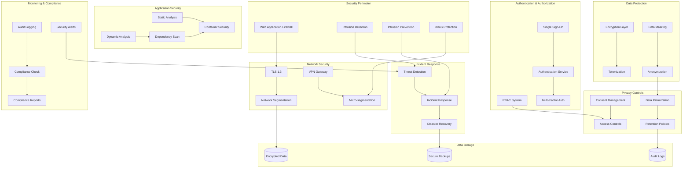

# Phase 8: Security and Privacy Architecture

## 🎯 Overview

The Security and Privacy Architecture provides comprehensive protection for the Phase 8 AI Threat Detection system, ensuring HIPAA compliance, implementing advanced encryption, managing access controls, and maintaining privacy throughout all data flows. This architecture addresses both security threats and privacy concerns while maintaining system performance and usability.

## 🏗️ Security Architecture Overview

### Security and Privacy Architecture Diagram



## 🔒 Core Security Components

### 1. Authentication and Authorization System

#### Multi-Factor Authentication with RBAC

```typescript
// authentication_authorization_system.ts
interface AuthenticationAuthorizationSystem {
  // Authenticate user
  authenticateUser(credentials: UserCredentials): Promise<AuthenticationResult>
  
  // Authorize access
  authorizeAccess(userId: string, resource: string, action: string): Promise<AuthorizationResult>
  
  // Manage user sessions
  manageSession(sessionId: string, action: SessionAction): Promise<SessionResult>
  
  // Handle MFA
  handleMFA(userId: string, mfaCode: string): Promise<MFAResult>
  
  // Audit access
  auditAccess(accessEvent: AccessEvent): Promise<AuditResult>
}

interface AuthenticationResult {
  success: boolean
  user: User
  session: Session
  mfaRequired: boolean
  tokens: SecurityTokens
  auditTrail: AuditEntry
}

class AdvancedAuthenticationAuthorizationSystem implements AuthenticationAuthorizationSystem {
  private authenticationService: AuthenticationService
  private authorizationEngine: AuthorizationEngine
  private sessionManager: SessionManager
  private mfaManager: MFAManager
  private auditLogger: AuditLogger
  private rbacManager: RBACManager
  
  constructor(config: AuthConfig) {
    this.authenticationService = new AuthenticationService(config.authConfig)
    this.authorizationEngine = new AuthorizationEngine(config.authzConfig)
    this.sessionManager = new SessionManager(config.sessionConfig)
    this.mfaManager = new MFAManager(config.mfaConfig)
    this.auditLogger = new AuditLogger(config.auditConfig)
    this.rbacManager = new RBACManager(config.rbacConfig)
  }
  
  async authenticateUser(credentials: UserCredentials): Promise<AuthenticationResult> {
    try {
      // Validate credentials format
      const validation = await this.validateCredentials(credentials)
      if (!validation.isValid) {
        throw new Error(`Invalid credentials: ${validation.errors.join(', ')}`)
      }
      
      // Check for brute force attempts
      const bruteForceCheck = await this.checkBruteForce(credentials.username)
      if (bruteForceCheck.isBlocked) {
        throw new Error('Account temporarily blocked due to suspicious activity')
      }
      
      // Authenticate against user store
      const authResult = await this.authenticationService.authenticate(credentials)
      
      if (!authResult.success) {
        // Log failed authentication attempt
        await this.auditLogger.logAuthenticationFailure(credentials.username, authResult.reason)
        throw new Error('Authentication failed')
      }
      
      // Generate session
      const session = await this.sessionManager.createSession(authResult.user)
      
      // Check if MFA is required
      const mfaRequired = await this.determineMFARequirement(authResult.user)
      
      // Generate security tokens
      const tokens = await this.generateSecurityTokens(authResult.user, session)
      
      // Log successful authentication
      await this.auditLogger.logAuthenticationSuccess(authResult.user.id, session.sessionId)
      
      return {
        success: true,
        user: authResult.user,
        session: session,
        mfaRequired: mfaRequired,
        tokens: tokens,
        auditTrail: await this.auditLogger.getLatestEntry(authResult.user.id)
      }
      
    } catch (error) {
      await this.auditLogger.logAuthenticationFailure(credentials.username, error.message)
      throw error
    }
  }
  
  async authorizeAccess(userId: string, resource: string, action: string): Promise<AuthorizationResult> {
    try {
      // Get user roles and permissions
      const userRoles = await this.rbacManager.getUserRoles(userId)
      const userPermissions = await this.rbacManager.getUserPermissions(userId)
      
      // Check resource-specific permissions
      const resourcePermissions = await this.authorizationEngine.checkPermissions(
        userId,
        resource,
        action,
        { roles: userRoles, permissions: userPermissions }
      )
      
      // Apply dynamic authorization rules
      const dynamicAuth = await this.applyDynamicAuthorizationRules(userId, resource, action)
      
      // Combine static and dynamic authorization
      const finalDecision = this.combineAuthorizationDecisions(resourcePermissions, dynamicAuth)
      
      // Log authorization decision
      await this.auditLogger.logAuthorizationDecision(userId, resource, action, finalDecision)
      
      return {
        success: finalDecision.allowed,
        userId: userId,
        resource: resource,
        action: action,
        decision: finalDecision.decision,
        reason: finalDecision.reason,
        permissions: finalDecision.permissions
      }
      
    } catch (error) {
      await this.auditLogger.logAuthorizationFailure(userId, resource, action, error.message)
      throw error
    }
  }
  
  private async determineMFARequirement(user: User): Promise<boolean> {
    // Check user role
    if (user.role === 'ADMIN' || user.role === 'SECURITY_ANALYST') {
      return true
    }
    
    // Check recent suspicious activity
    const recentActivity = await this.getRecentActivity(user.id)
    if (recentActivity.hasSuspiciousActivity) {
      return true
    }
    
    // Check device fingerprint
    const deviceFingerprint = await this.getDeviceFingerprint(user.id)
    if (deviceFingerprint.isNewDevice) {
      return true
    }
    
    // Check location
    const currentLocation = await this.getCurrentLocation(user.id)
    const usualLocation = await this.getUsualLocation(user.id)
    if (this.isLocationAnomalous(currentLocation, usualLocation)) {
      return true
    }
    
    return false
  }
}
```

### 2. Data Encryption and Protection

#### Multi-Layer Encryption Architecture

```typescript
// data_encryption_protection.ts
interface DataEncryptionProtection {
  // Encrypt data at rest
  encryptDataAtRest(data: any, keyId: string): Promise<EncryptedData>
  
  // Encrypt data in transit
  encryptDataInTransit(data: any): Promise<EncryptedData>
  
  // Decrypt data
  decryptData(encryptedData: EncryptedData, keyId: string): Promise<any>
  
  // Manage encryption keys
  manageEncryptionKeys(operation: KeyOperation): Promise<KeyManagementResult>
  
  // Apply data masking
  applyDataMasking(data: any, maskingRules: MaskingRules): Promise<MaskedData>
  
  // Tokenize sensitive data
  tokenizeData(data: SensitiveData): Promise<TokenizedData>
}

interface EncryptionResult {
  encryptedData: EncryptedData
  encryptionMethod: EncryptionMethod
  keyId: string
  timestamp: Date
  integrityHash: string
}

class AdvancedDataEncryptionProtection implements DataEncryptionProtection {
  private encryptionEngine: EncryptionEngine
  private keyManager: KeyManager
  private maskingEngine: MaskingEngine
  private tokenizationService: TokenizationService
  private integrityChecker: IntegrityChecker
  
  constructor(config: EncryptionConfig) {
    this.encryptionEngine = new EncryptionEngine(config.encryptionConfig)
    this.keyManager = new KeyManager(config.keyConfig)
    this.maskingEngine = new MaskingEngine(config.maskingConfig)
    this.tokenizationService = new TokenizationService(config.tokenizationConfig)
    this.integrityChecker = new IntegrityChecker(config.integrityConfig)
  }
  
  async encryptDataAtRest(data: any, keyId: string): Promise<EncryptionResult> {
    try {
      // Get encryption key
      const encryptionKey = await this.keyManager.getKey(keyId)
      
      // Serialize data
      const serializedData = this.serializeData(data)
      
      // Apply compression
      const compressedData = await this.compressData(serializedData)
      
      // Encrypt with AES-256-GCM
      const encryptedData = await this.encryptionEngine.encryptAES256GCM(
        compressedData,
        encryptionKey
      )
      
      // Calculate integrity hash
      const integrityHash = await this.integrityChecker.calculateHash(encryptedData)
      
      // Store encryption metadata
      const metadata = await this.storeEncryptionMetadata({
        keyId: keyId,
        encryptionMethod: 'AES-256-GCM',
        timestamp: new Date(),
        integrityHash: integrityHash,
        originalSize: serializedData.length,
        compressedSize: compressedData.length
      })
      
      return {
        encryptedData: encryptedData,
        encryptionMethod: 'AES-256-GCM',
        keyId: keyId,
        timestamp: new Date(),
        integrityHash: integrityHash
      }
      
    } catch (error) {
      throw new Error(`Data encryption failed: ${error.message}`)
    }
  }
  
  async applyDataMasking(data: any, maskingRules: MaskingRules): Promise<MaskedData> {
    const maskedData: MaskedData = {
      originalData: data,
      maskedFields: {},
      maskingMetadata: {}
    }
    
    // Apply field-level masking
    for (const rule of maskingRules.fieldRules) {
      if (data[rule.fieldName]) {
        const maskedValue = await this.applyFieldMasking(data[rule.fieldName], rule)
        maskedData.maskedFields[rule.fieldName] = maskedValue
        maskedData.maskingMetadata[rule.fieldName] = {
          maskingType: rule.maskingType,
          preservationLevel: rule.preservationLevel,
          reversibility: rule.reversible
        }
      }
    }
    
    // Apply record-level masking
    if (maskingRules.recordRules) {
      for (const rule of maskingRules.recordRules) {
        const maskedRecord = await this.applyRecordMasking(data, rule)
        maskedData.maskedFields[rule.recordType] = maskedRecord
      }
    }
    
    // Apply format-preserving masking
    if (maskingRules.formatPreservingRules) {
      for (const rule of maskingRules.formatPreservingRules) {
        const maskedValue = await this.applyFormatPreservingMasking(data[rule.fieldName], rule)
        maskedData.maskedFields[rule.fieldName] = maskedValue
      }
    }
    
    return maskedData
  }
  
  async tokenizeData(data: SensitiveData): Promise<TokenizedData> {
    try {
      // Generate unique token
      const token = await this.tokenizationService.generateToken()
      
      // Store mapping securely
      const mapping = await this.tokenizationService.storeMapping(token, data)
      
      // Apply tokenization based on data type
      let tokenizedData: any
      
      switch (data.type) {
        case 'PII':
          tokenizedData = await this.tokenizePII(data)
          break
        case 'PHI':
          tokenizedData = await this.tokenizePHI(data)
          break
        case 'FINANCIAL':
          tokenizedData = await this.tokenizeFinancialData(data)
          break
        default:
          tokenizedData = await this.tokenizeGenericData(data)
      }
      
      return {
        token: token,
        tokenizedData: tokenizedData,
        mappingId: mapping.mappingId,
        tokenizationTimestamp: new Date(),
        reversibility: mapping.reversible
      }
      
    } catch (error) {
      throw new Error(`Tokenization failed: ${error.message}`)
    }
  }
}
```

### 3. Network Security Architecture

#### Zero Trust Network Implementation

```typescript
// network_security_architecture.ts
interface NetworkSecurityArchitecture {
  // Implement TLS encryption
  implementTLSEncryption(connection: NetworkConnection): Promise<TLSConnection>
  
  // Manage network segmentation
  manageNetworkSegmentation(segment: NetworkSegment): Promise<SegmentationResult>
  
  // Handle VPN connections
  handleVPNConnection(connection: VPNConnection): Promise<VPNResult>
  
  // Monitor network traffic
  monitorNetworkTraffic(monitoringConfig: MonitoringConfig): Promise<TrafficAnalysis>
  
  // Implement micro-segmentation
  implementMicroSegmentation(config: MicroSegmentationConfig): Promise<SegmentationResult>
}

interface NetworkSecurityConfig {
  tlsConfig: TLSConfiguration
  segmentationConfig: SegmentationConfiguration
  vpnConfig: VPNConfiguration
  monitoringConfig: NetworkMonitoringConfiguration
  microSegmentationConfig: MicroSegmentationConfiguration
}

class AdvancedNetworkSecurityArchitecture implements NetworkSecurityArchitecture {
  private tlsManager: TLSManager
  private segmentationManager: SegmentationManager
  private vpnManager: VPNManager
  private trafficMonitor: TrafficMonitor
  private microSegmentationEngine: MicroSegmentationEngine
  
  constructor(config: NetworkSecurityConfig) {
    this.tlsManager = new TLSManager(config.tlsConfig)
    this.segmentationManager = new SegmentationManager(config.segmentationConfig)
    this.vpnManager = new VPNManager(config.vpnConfig)
    this.trafficMonitor = new TrafficMonitor(config.monitoringConfig)
    this.microSegmentationEngine = new MicroSegmentationEngine(config.microSegmentationConfig)
  }
  
  async implementTLSEncryption(connection: NetworkConnection): Promise<TLSConnection> {
    try {
      // Validate connection parameters
      const validation = await this.validateConnection(connection)
      if (!validation.isValid) {
        throw new Error(`Invalid connection parameters: ${validation.errors.join(', ')}`)
      }
      
      // Generate TLS certificate if needed
      let certificate = connection.certificate
      if (!certificate || this.isCertificateExpired(certificate)) {
        certificate = await this.tlsManager.generateCertificate({
          domain: connection.domain,
          validityPeriod: 365, // days
          keySize: 2048,
          algorithm: 'RSA'
        })
      }
      
      // Configure TLS settings
      const tlsConfig = await this.configureTLS(connection, certificate)
      
      // Establish TLS connection
      const tlsConnection = await this.tlsManager.establishConnection(tlsConfig)
      
      // Verify TLS implementation
      const verification = await this.verifyTLSImplementation(tlsConnection)
      
      if (!verification.isValid) {
        throw new Error(`TLS verification failed: ${verification.errors.join(', ')}`)
      }
      
      // Monitor TLS connection
      await this.trafficMonitor.monitorTLSConnection(tlsConnection)
      
      return {
        connectionId: tlsConnection.id,
        certificate: certificate,
        tlsVersion: '1.3',
        cipherSuite: tlsConnection.cipherSuite,
        establishedAt: new Date(),
        verificationStatus: verification.status
      }
      
    } catch (error) {
      throw new Error(`TLS implementation failed: ${error.message}`)
    }
  }
  
  async implementMicroSegmentation(config: MicroSegmentationConfig): Promise<SegmentationResult> {
    try {
      // Analyze current network topology
      const topology = await this.analyzeNetworkTopology()
      
      // Define micro-segments based on security requirements
      const segments = await this.defineMicroSegments(topology, config)
      
      // Create security policies for each segment
      const policies = await this.createSegmentSecurityPolicies(segments)
      
      // Deploy micro-segmentation rules
      const deployment = await this.deploySegmentationRules(policies)
      
      // Validate segmentation implementation
      const validation = await this.validateSegmentation(segments, policies)
      
      // Monitor segment traffic
      await this.monitorSegmentTraffic(segments)
      
      return {
        segmentationId: deployment.segmentationId,
        segments: segments,
        policies: policies,
        deploymentStatus: deployment.status,
        validationResult: validation,
        monitoringEnabled: true
      }
      
    } catch (error) {
      throw new Error(`Micro-segmentation implementation failed: ${error.message}`)
    }
  }
  
  private async defineMicroSegments(topology: NetworkTopology, config: MicroSegmentationConfig): Promise<NetworkSegment[]> {
    const segments: NetworkSegment[] = []
    
    // Create segments based on application tiers
    const appSegments = await this.createApplicationSegments(topology, config)
    segments.push(...appSegments)
    
    // Create segments based on data sensitivity
    const dataSegments = await this.createDataSensitivitySegments(topology, config)
    segments.push(...dataSegments)
    
    // Create segments based on user roles
    const roleSegments = await this.createRoleBasedSegments(topology, config)
    segments.push(...roleSegments)
    
    // Create segments for external communications
    const externalSegments = await this.createExternalCommunicationSegments(topology, config)
    segments.push(...externalSegments)
    
    return segments
  }
  
  private async createSegmentSecurityPolicies(segments: NetworkSegment[]): Promise<SecurityPolicy[]> {
    const policies: SecurityPolicy[] = []
    
    for (const segment of segments) {
      // Create ingress policy
      const ingressPolicy = await this.createIngressPolicy(segment)
      policies.push(ingressPolicy)
      
      // Create egress policy
      const egressPolicy = await this.createEgressPolicy(segment)
      policies.push(egressPolicy)
      
      // Create lateral movement policy
      const lateralPolicy = await this.createLateralMovementPolicy(segment)
      policies.push(lateralPolicy)
    }
    
    return policies
  }
}
```

### 4. Application Security Framework

#### Comprehensive Security Testing

```typescript
// application_security_framework.ts
interface ApplicationSecurityFramework {
  // Perform static analysis
  performStaticAnalysis(code: string): Promise<StaticAnalysisResult>
  
  // Perform dynamic analysis
  performDynamicAnalysis(application: Application): Promise<DynamicAnalysisResult>
  
  // Scan dependencies
  scanDependencies(dependencies: Dependency[]): Promise<DependencyScanResult>
  
  // Test container security
  testContainerSecurity(container: Container): Promise<ContainerSecurityResult>
  
  // Generate security report
  generateSecurityReport(findings: SecurityFinding[]): Promise<SecurityReport>
}

interface SecurityTestingConfig {
  staticAnalysis: StaticAnalysisConfig
  dynamicAnalysis: DynamicAnalysisConfig
  dependencyScanning: DependencyScanningConfig
  containerSecurity: ContainerSecurityConfig
  reporting: SecurityReportingConfig
}

class AdvancedApplicationSecurityFramework implements ApplicationSecurityFramework {
  private staticAnalyzer: StaticAnalyzer
  private dynamicAnalyzer: DynamicAnalyzer
  private dependencyScanner: DependencyScanner
  private containerSecurityTester: ContainerSecurityTester
  private reportGenerator: SecurityReportGenerator
  
  constructor(config: SecurityTestingConfig) {
    this.staticAnalyzer = new StaticAnalyzer(config.staticAnalysis)
    this.dynamicAnalyzer = new DynamicAnalyzer(config.dynamicAnalysis)
    this.dependencyScanner = new DependencyScanner(config.dependencyScanning)
    this.containerSecurityTester = new ContainerSecurityTester(config.containerSecurity)
    this.reportGenerator = new SecurityReportGenerator(config.reporting)
  }
  
  async performStaticAnalysis(code: string): Promise<StaticAnalysisResult> {
    try {
      // Parse code into AST
      const ast = await this.staticAnalyzer.parseCode(code)
      
      // Run security rule checks
      const securityIssues = await this.staticAnalyzer.checkSecurityRules(ast)
      
      // Check for code quality issues
      const qualityIssues = await this.staticAnalyzer.checkCodeQuality(ast)
      
      // Check for compliance issues
      const complianceIssues = await this.staticAnalyzer.checkCompliance(ast)
      
      // Check for performance issues
      const performanceIssues = await this.staticAnalyzer.checkPerformance(ast)
      
      // Calculate risk scores
      const riskAssessment = await this.calculateRiskScores({
        securityIssues,
        qualityIssues,
        complianceIssues,
        performanceIssues
      })
      
      return {
        analysisId: this.generateAnalysisId(),
        codeHash: this.calculateCodeHash(code),
        securityIssues,
        qualityIssues,
        complianceIssues,
        performanceIssues,
        riskAssessment,
        recommendations: this.generateStaticAnalysisRecommendations(securityIssues),
        timestamp: new Date()
      }
      
    } catch (error) {
      throw new Error(`Static analysis failed: ${error.message}`)
    }
  }
  
  async performDynamicAnalysis(application: Application): Promise<DynamicAnalysisResult> {
    try {
      // Set up test environment
      const testEnvironment = await this.dynamicAnalyzer.setupTestEnvironment(application)
      
      // Run security tests
      const securityTests = await this.dynamicAnalyzer.runSecurityTests(testEnvironment)
      
      // Run penetration tests
      const penetrationTests = await this.dynamicAnalyzer.runPenetrationTests(testEnvironment)
      
      // Run fuzzing tests
      const fuzzingTests = await this.dynamicAnalyzer.runFuzzingTests(testEnvironment)
      
      // Run load tests with security focus
      const loadTests = await this.dynamicAnalyzer.runLoadTests(testEnvironment)
      
      // Analyze test results
      const analysis = await this.analyzeDynamicTestResults({
        securityTests,
        penetrationTests,
        fuzzingTests,
        loadTests
      })
      
      return {
        analysisId: this.generateAnalysisId(),
        applicationId: application.id,
        testEnvironment: testEnvironment,
        securityFindings: analysis.securityFindings,
        vulnerabilityAssessment: analysis.vulnerabilityAssessment,
        performanceImpact: analysis.performanceImpact,
        recommendations: analysis.recommendations,
        timestamp: new Date()
      }
      
    } catch (error) {
      throw new Error(`Dynamic analysis failed: ${error.message}`)
    }
  }
  
  async scanDependencies(dependencies: Dependency[]): Promise<DependencyScanResult> {
    const findings: DependencyFinding[] = []
    
    for (const dependency of dependencies) {
      try {
        // Check for known vulnerabilities
        const vulnFindings = await this.dependencyScanner.checkVulnerabilities(dependency)
        findings.push(...vulnFindings)
        
        // Check for license compliance issues
        const licenseFindings = await this.dependencyScanner.checkLicenseCompliance(dependency)
        findings.push(...licenseFindings)
        
        // Check for outdated dependencies
        const outdatedFindings = await this.dependencyScanner.checkOutdatedDependencies(dependency)
        findings.push(...outdatedFindings)
        
        // Check for malicious packages
        const maliciousFindings = await this.dependencyScanner.checkMaliciousPackages(dependency)
        findings.push(...maliciousFindings)
        
      } catch (error) {
        console.error(`Error scanning dependency ${dependency.name}: ${error.message}`)
      }
    }
    
    // Calculate risk scores
    const riskAssessment = await this.calculateDependencyRisk(findings)
    
    // Generate remediation recommendations
    const recommendations = await this.generateDependencyRecommendations(findings)
    
    return {
      scanId: this.generateScanId(),
      dependencies: dependencies,
      findings: findings,
      riskAssessment: riskAssessment,
      recommendations: recommendations,
      timestamp: new Date()
    }
  }
  
  async testContainerSecurity(container: Container): Promise<ContainerSecurityResult> {
    try {
      // Scan container image
      const imageScan = await this.containerSecurityTester.scanImage(container.image)
      
      // Check container runtime security
      const runtimeSecurity = await this.containerSecurityTester.checkRuntimeSecurity(container)
      
      // Check network security
      const networkSecurity = await this.containerSecurityTester.checkNetworkSecurity(container)
      
      // Check file system security
      const filesystemSecurity = await this.containerSecurityTester.checkFilesystemSecurity(container)
      
      // Check process security
      const processSecurity = await this.containerSecurityTester.checkProcessSecurity(container)
      
      // Check secret management
      const secretManagement = await this.containerSecurityTester.checkSecretManagement(container)
      
      // Compile comprehensive security assessment
      const securityAssessment = await this.compileContainerSecurityAssessment({
        imageScan,
        runtimeSecurity,
        networkSecurity,
        filesystemSecurity,
        processSecurity,
        secretManagement
      })
      
      return {
        scanId: this.generateScanId(),
        containerId: container.id,
        imageScan: imageScan,
        runtimeSecurity: runtimeSecurity,
        networkSecurity: networkSecurity,
        filesystemSecurity: filesystemSecurity,
        processSecurity: processSecurity,
        secretManagement: secretManagement,
        overallScore: securityAssessment.overallScore,
        recommendations: securityAssessment.recommendations,
        timestamp: new Date()
      }
      
    } catch (error) {
      throw new Error(`Container security testing failed: ${error.message}`)
    }
  }
}
```

## 📊 Security and Privacy Metrics

### Security Performance KPIs

```typescript
// security_privacy_metrics.ts
interface SecurityPrivacyMetrics {
  // Authentication metrics
  authenticationSuccessRate: number
  mfaAdoptionRate: number
  accountLockoutRate: number
  
  // Authorization metrics
  authorizationSuccessRate: number
  privilegeEscalationAttempts: number
  roleAssignmentAccuracy: number
  
  // Encryption metrics
  encryptionCoverage: number
  keyRotationCompliance: number
  encryptionPerformance: number
  
  // Network security metrics
  tlsComplianceRate: number
  networkSegmentationEffectiveness: number
  intrusionDetectionRate: number
  
  // Application security metrics
  vulnerabilityDetectionRate: number
  patchComplianceRate: number
  staticAnalysisCoverage: number
  
  // Privacy metrics
  dataMinimizationCompliance: number
  consentComplianceRate: number
  dataRetentionCompliance: number
  
  // Compliance metrics
  hipaaComplianceScore: number
  auditTrailCompleteness: number
  incidentResponseTime: number
}

class SecurityPrivacyMetricsCollector {
  private targets = {
    authenticationSuccessRate: 0.99,
    mfaAdoptionRate: 0.95,
    accountLockoutRate: 0.01,
    authorizationSuccessRate: 0.98,
    privilegeEscalationAttempts: 0,
    roleAssignmentAccuracy: 0.99,
    encryptionCoverage: 1.0,
    keyRotationCompliance: 1.0,
    encryptionPerformance: 0.95,
    tlsComplianceRate: 1.0,
    networkSegmentationEffectiveness: 0.9,
    intrusionDetectionRate: 0.95,
    vulnerabilityDetectionRate: 0.9,
    patchComplianceRate: 0.98,
    staticAnalysisCoverage: 1.0,
    dataMinimizationCompliance: 1.0,
    consentComplianceRate: 1.0,
    dataRetentionCompliance: 1.0,
    hipaaComplianceScore: 1.0,
    auditTrailCompleteness: 1.0,
    incidentResponseTime: 300 // seconds
  }
  
  async collectSecurityMetrics(): Promise<SecurityPrivacyMetrics> {
    return {
      authenticationSuccessRate: await this.calculateAuthSuccessRate(),
      mfaAdoptionRate: await this.calculateMFAAdoptionRate(),
      accountLockoutRate: await this.calculateAccountLockoutRate(),
      authorizationSuccessRate: await this.calculateAuthzSuccessRate(),
      privilegeEscalationAttempts: await this.countPrivilegeEscalationAttempts(),
      roleAssignmentAccuracy: await this.calculateRoleAssignmentAccuracy(),
      encryptionCoverage: await this.calculateEncryptionCoverage(),
      keyRotationCompliance: await this.calculateKeyRotationCompliance(),
      encryptionPerformance: await this.calculateEncryptionPerformance(),
      tlsComplianceRate: await this.calculateTLSComplianceRate(),
      networkSegmentationEffectiveness: await this.calculateSegmentationEffectiveness(),
      intrusionDetectionRate: await this.calculateIntrusionDetectionRate(),
      vulnerabilityDetectionRate: await this.calculateVulnerabilityDetectionRate(),
      patchComplianceRate: await this.calculatePatchComplianceRate(),
      staticAnalysisCoverage: await this.calculateStaticAnalysisCoverage(),
      dataMinimizationCompliance: await this.calculateDataMinimizationCompliance(),
      consentComplianceRate: await this.calculateConsentComplianceRate(),
      dataRetentionCompliance: await this.calculateDataRetentionCompliance(),
      hipaaComplianceScore: await this.calculateHIPAAComplianceScore(),
      auditTrailCompleteness: await this.calculateAuditTrailCompleteness(),
      incidentResponseTime: await this.calculateIncidentResponseTime()
    }
  }
}
```

## 🚀 Security Deployment Configuration

### Kubernetes Security Deployment

```yaml
# security-deployment.yaml
apiVersion: apps/v1
kind: Deployment
metadata:
  name: security-system
  namespace: threat-detection
spec:
  replicas: 2
  selector:
    matchLabels:
      app: security-system
  template:
    metadata:
      labels:
        app: security-system
    spec:
      containers:
      - name: authentication-service
        image: pixelated/authentication-service:latest
        ports:
        - containerPort: 8080
          name: auth-api
        env:
        - name: AUTH_DB_URL
          value: "postgres://auth-db:5432/auth"
        - name: ENCRYPTION_KEY
          valueFrom:
            secretKeyRef:
              name: encryption-key
              key: key
        resources:
          requests:
            memory: "2Gi"
            cpu: "1000m"
          limits:
            memory: "4Gi"
            cpu: "2000m"
            
      - name: encryption-service
        image: pixelated/encryption-service:latest
        ports:
        - containerPort: 8081
          name: encryption-api
        env:
        - name: KEY_MANAGEMENT_URL
          value: "http://key-management:8080"
        - name: HSM_ENABLED
          value: "true"
        resources:
          requests:
            memory: "1Gi"
            cpu: "500m"
          limits:
            memory: "2Gi"
            cpu: "1000m"
            
      - name: network-security
        image: pixelated/network-security:latest
        ports:
        - containerPort: 8082
          name: network-api
        env:
        - name: NETWORK_CONFIG_PATH
          value: "/config/network-security.json"
        - name: VPN_GATEWAY_URL
          value: "https://vpn-gateway:8443"
        resources:
          requests:
            memory: "1Gi"
            cpu: "500m"
          limits:
            memory: "2Gi"
            cpu: "1000m"
            
      - name: security-testing
        image: pixelated/security-testing:latest
        ports:
        - containerPort: 8083
          name: testing-api
        env:
        - name: TESTING_DB_URL
          value: "postgres://testing-db:5432/testing"
        - name: SCANNER_CONFIG_PATH
          value: "/config/scanner-config.json"
        resources:
          requests:
            memory: "3Gi"
            cpu: "1500m"
          limits:
            memory: "6Gi"
            cpu: "3000m"
            
---
apiVersion: v1
kind: Service
metadata:
  name: security-service
  namespace: threat-detection
spec:
  selector:
    app: security-system
  ports:
  - name: auth-api
    port: 8080
    targetPort: 8080
  - name: encryption-api
    port: 8081
    targetPort: 8081
  - name: network-api
    port: 8082
    targetPort: 8082
  - name: testing-api
    port: 8083
    targetPort: 8083
  type: ClusterIP
```

## 📈 Security and Privacy Success Metrics

### Key Performance Indicators

1. **Authentication Performance**
   - Success Rate: > 99%
   - MFA Adoption: > 95%
   - Response Time: < 500ms

2. **Encryption Performance**
   - Coverage: 100%
   - Performance Impact: < 5%
   - Key Rotation: 100% compliance

3. **Network Security**
   - TLS Compliance: 100%
   - Intrusion Detection: > 95%
   - Segmentation Effectiveness: > 90%

4. **Application Security**
   - Vulnerability Detection: > 90%
   - Patch Compliance: > 98%
   - Static Analysis Coverage: 100%

5. **Privacy Compliance**
   - Data Minimization: 100%
   - Consent Compliance: 100%
   - HIPAA Compliance: 100%

This comprehensive security and privacy architecture provides robust protection for the Phase 8 AI Threat Detection system while maintaining HIPAA compliance, implementing advanced encryption, managing access controls, and ensuring privacy throughout all data flows.