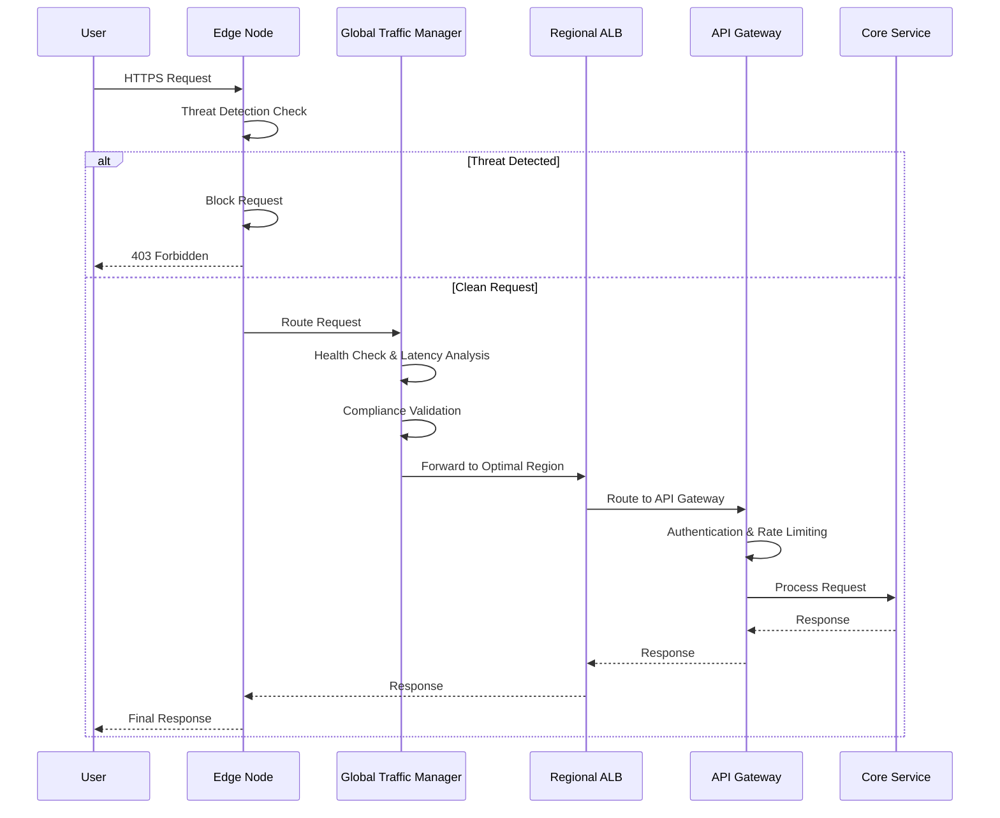
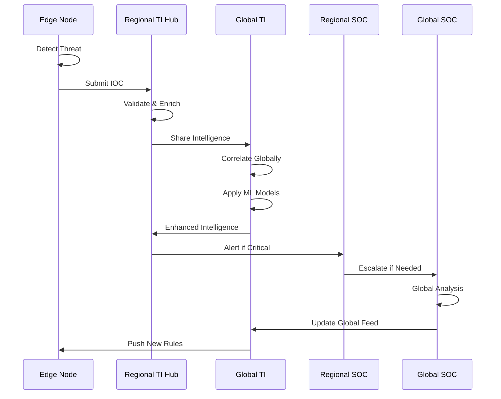
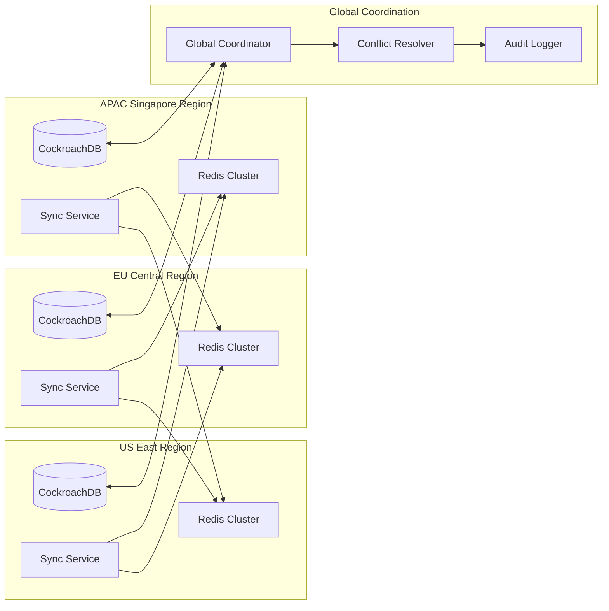
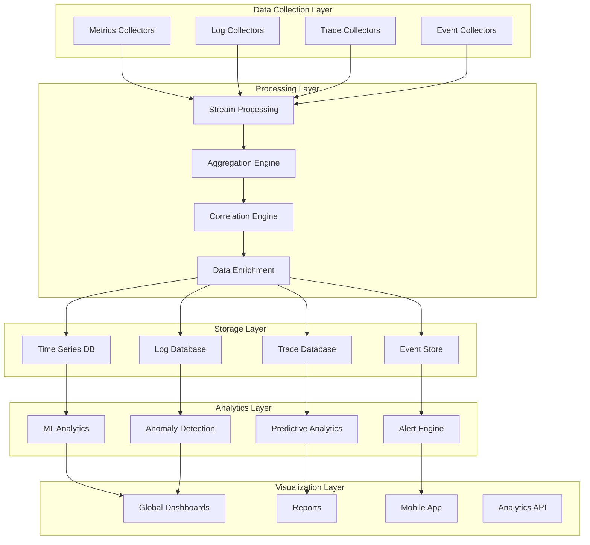
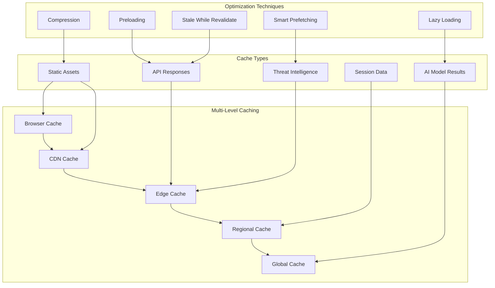
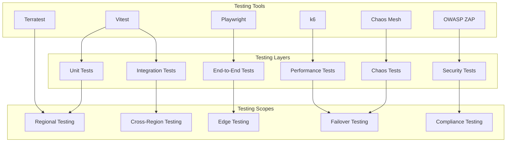

# Phase 9: Multi-Region Deployment & Global Threat Intelligence Network - Implementation Architecture

## Executive Summary

This document presents the comprehensive implementation architecture for Phase 9 of the Pixelated platform, delivering a globally distributed, secure, and compliant multi-region deployment with advanced threat intelligence capabilities. The architecture ensures 99.99% availability, <100ms global latency, and full regulatory compliance while maintaining the platform's AI-powered mental health focus.

## 1. System Architecture & Service Boundaries

### 1.1 High-Level Architecture Overview

```mermaid
graph TB
    subgraph "Global Edge Network"
        EDGE1[Edge Node - US East]
        EDGE2[Edge Node - US West]
        EDGE3[Edge Node - EU Central]
        EDGE4[Edge Node - APAC Singapore]
        EDGE5[Edge Node - APAC Tokyo]
        CDN[Global CDN Network]
    end
    
    subgraph "Regional Infrastructure"
        subgraph "US East Region"
            ALB1[Application Load Balancer]
            API1[API Gateway]
            SVC1[Core Services]
            DB1[(Regional Database)]
            CACHE1[Redis Cache]
            SOC1[Regional SOC]
        end
        
        subgraph "EU Central Region"
            ALB2[Application Load Balancer]
            API2[API Gateway]
            SVC2[Core Services]
            DB2[(Regional Database)]
            CACHE2[Redis Cache]
            SOC2[Regional SOC]
        end
        
        subgraph "APAC Singapore Region"
            ALB3[Application Load Balancer]
            API3[API Gateway]
            SVC3[Core Services]
            DB3[(Regional Database)]
            CACHE3[Redis Cache]
            SOC3[Regional SOC]
        end
    end
    
    subgraph "Global Services"
        GTM[Global Traffic Manager]
        GTI[Global Threat Intelligence]
        GSOC[Global SOC]
        GRC[Global Replication Controller]
        GCM[Global Compliance Manager]
    end
    
    subgraph "External Integrations"
        THREAT_FEEDS[External Threat Feeds]
        CLOUD_PROVIDERS[Multi-Cloud Infrastructure]
        COMPLIANCE_TOOLS[Compliance & Audit Tools]
    end
    
    %% Edge to Regional connections
    EDGE1 --> ALB1
    EDGE2 --> ALB1
    EDGE3 --> ALB2
    EDGE4 --> ALB3
    EDGE5 --> ALB3
    
    %% Regional to Global services
    ALB1 --> GTM
    ALB2 --> GTM
    ALB3 --> GTM
    
    SOC1 --> GSOC
    SOC2 --> GSOC
    SOC3 --> GSOC
    
    DB1 --> GRC
    DB2 --> GRC
    DB3 --> GRC
    
    %% Global service interconnections
    GTI --> GSOC
    GCM --> GRC
    
    %% External integrations
    THREAT_FEEDS --> GTI
    CLOUD_PROVIDERS --> ALB1
    CLOUD_PROVIDERS --> ALB2
    CLOUD_PROVIDERS --> ALB3
    COMPLIANCE_TOOLS --> GCM
```



### 1.2 Service Boundary Definition

#### Core Regional Services
| Service | Responsibility | Data Ownership | Scaling Strategy |
|---------|---------------|----------------|------------------|
| **API Gateway** | Request routing, authentication, rate limiting | Configuration data | Auto-scaling based on request volume |
| **Core Services** | Business logic, AI processing, user management | Regional user data | Horizontal scaling with load balancing |
| **Regional Database** | Data persistence, replication, consistency | Regional data partitions | Multi-master with read replicas |
| **Redis Cache** | Session management, performance caching | Cache data | Cluster mode with sharding |
| **Regional SOC** | Security monitoring, incident response | Security events | Dedicated security infrastructure |

#### Global Services
| Service | Responsibility | Data Ownership | Deployment Strategy |
|---------|---------------|----------------|-------------------|
| **Global Traffic Manager** | Intelligent routing, health monitoring | Routing configurations | Active-active across regions |
| **Global Threat Intelligence** | Threat aggregation, correlation, sharing | Threat intelligence data | Distributed with central coordination |
| **Global SOC** | Unified security operations, incident coordination | Security incidents | Primary-secondary with failover |
| **Global Replication Controller** | Data synchronization, conflict resolution | Replication metadata | Active-active with consensus |
| **Global Compliance Manager** | Regulatory compliance, audit coordination | Compliance policies | Distributed with regional enforcement |

## 2. Technology Stack Selection

### 2.1 Infrastructure & Platform Layer

#### Cloud Providers (Multi-Cloud Strategy)
- **Primary**: AWS (US-East, US-West, EU-Central)
- **Secondary**: Google Cloud Platform (APAC-Singapore, APAC-Tokyo)
- **Edge**: Cloudflare Workers (50+ global edge locations)

#### Container Orchestration
```yaml
# Kubernetes Configuration
kubernetes:
  version: "1.28"
  networking:
    cni: "Calico"
    service_mesh: "Istio"
  security:
    policy_engine: "OPA Gatekeeper"
    runtime_security: "Falco"
  monitoring:
    metrics: "Prometheus"
    logging: "Fluentd + Elasticsearch"
    tracing: "Jaeger"
```

#### Edge Computing Platform
```javascript
// Cloudflare Workers Configuration
const edgeConfig = {
  runtime: "v8_isolate",
  memory: "128MB",
  cpu_time: "50ms",
  regions: ["global"],
  kv_namespaces: ["threat_intelligence", "user_sessions"],
  durable_objects: ["edge_coordinator", "threat_detector"]
}
```

### 2.2 Data Layer Technologies

#### Multi-Master Database Architecture
```yaml
# CockroachDB Configuration for Global Distribution
cockroachdb:
  version: "23.1"
  topology:
    regions:
      - name: "us-east"
        nodes: 3
        datacenter: "us-east-1a,us-east-1b,us-east-1c"
      - name: "eu-central"
        nodes: 3
        datacenter: "eu-central-1a,eu-central-1b,eu-central-1c"
      - name: "apac-singapore"
        nodes: 3
        datacenter: "ap-southeast-1a,ap-southeast-1b,ap-southeast-1c"
  consistency:
    level: "global_reads"
    isolation: "serializable"
  partitioning:
    strategy: "regional"
    tables: ["users", "sessions", "threat_events"]
```

#### Redis Enterprise for Global Caching
```yaml
redis_enterprise:
  version: "7.2"
  deployment:
    type: "active-active"
    crdt: true
  clustering:
    shards: 12
    replicas: 2
  persistence:
    aof: true
    snapshot: "6hours"
```

### 2.3 AI/ML Platform

#### Edge AI Inference
```python
# TensorFlow Lite Configuration for Edge Deployment
edge_ai_config = {
    "model_format": "tflite",
    "quantization": "int8",
    "pruning": 0.3,
    "cache_size": "50MB",
    "inference_time": "<100ms",
    "models": [
        "threat_detection_v2.1.tflite",
        "bias_detection_v1.8.tflite",
        "behavioral_analysis_v2.0.tflite"
    ]
}
```

#### Centralized Model Training
```yaml
# MLflow Configuration
mlflow:
  backend: "postgresql"
  artifact_store: "s3://pixelated-ml-artifacts"
  registry: "postgresql"
  tracking_server:
    replicas: 3
    resources:
      cpu: "4 cores"
      memory: "16GB"
```

### 2.4 Security Technology Stack

#### Threat Intelligence Platform
```yaml
# MISP Integration Configuration
misp:
  version: "2.4"
  correlation:
    engine: "similarity"
    threshold: 0.85
  feeds:
    - name: "commercial_threat_intel"
      source: "vendor_api"
      frequency: "15min"
    - name: "open_source_intel"
      source: "stix_taxii"
      frequency: "1hour"
  sharing:
    protocol: "stix2.1"
    encryption: "aes-256-gcm"
```

#### Security Orchestration
```yaml
# Apache Kafka for Security Event Streaming
security_kafka:
  version: "3.5"
  topics:
    - name: "security.events.raw"
      partitions: 12
      replication: 3
    - name: "security.events.enriched"
      partitions: 12
      replication: 3
    - name: "threat.intelligence.feed"
      partitions: 6
      replication: 3
  streams:
    - name: "threat_correlation"
      processing: "kafka_streams"
    - name: "behavioral_analysis"
      processing: "kafka_streams"
```

## 3. Data Flow & Communication Patterns

### 3.1 Global Traffic Routing Flow



### 3.2 Threat Intelligence Sharing Flow



### 3.3 Cross-Region Data Synchronization



## 4. Security Architecture & Compliance Integration

### 4.1 Zero-Trust Security Model

```mermaid
graph TB
    subgraph "Identity & Access Management"
        IAM[IAM Service]
        MFA[Multi-Factor Auth]
        RBAC[Role-Based Access]
        JIT[Just-In-Time Access]
    end
    
    subgraph "Network Security"
        ZTN[Zero Trust Network]
        SEG[Network Segmentation]
        FW[Next-Gen Firewall]
        WAF[Web Application Firewall]
    end
    
    subgraph "Data Security"
        FHE[Fully Homomorphic Encryption]
        KM[Key Management Service]
        DLP[Data Loss Prevention]
        TOKEN[Tokenization Service]
    end
    
    subgraph "Threat Detection"
        UEBA[User Behavior Analytics]
        NTA[Network Traffic Analysis]
        EDR[Endpoint Detection]
        NIDS[Network IDS]
    end
    
    subgraph "Compliance Controls"
        GDPR[GDPR Compliance]
        HIPAA[HIPAA Controls]
        CCPA[CCPA Requirements]
        AUDIT[Audit Framework]
    end
    
    %% Security enforcement flows
    IAM --> RBAC
    MFA --> IAM
    JIT --> RBAC
    
    ZTN --> SEG
    FW --> ZTN
    WAF --> FW
    
    FHE --> KM
    DLP --> TOKEN
    
    UEBA --> EDR
    NTA --> NIDS
    
    GDPR --> AUDIT
    HIPAA --> AUDIT
    CCPA --> AUDIT
```



### 4.2 Regional Compliance Framework

```python
# Compliance Framework Configuration
compliance_frameworks = {
    "gdpr": {
        "data_residency": ["eu-central-1", "eu-west-1"],
        "retention_periods": {
            "user_data": "26_months",
            "session_data": "12_months",
            "audit_logs": "36_months"
        },
        "subject_rights": ["access", "rectification", "erasure", "portability"],
        "encryption_requirements": "aes-256",
        "cross_border_restrictions": True
    },
    "hipaa": {
        "data_residency": ["us-east-1", "us-west-1"],
        "retention_periods": {
            "phi_data": "84_months",
            "audit_logs": "72_months"
        },
        "access_controls": ["role_based", "need_to_know"],
        "encryption_requirements": "fips-140-2",
        "audit_frequency": "annual"
    },
    "ccpa": {
        "data_residency": ["us-west-1"],
        "subject_rights": ["access", "deletion", "opt_out"],
        "third_party_restrictions": True,
        "data_sale_prohibition": True
    }
}
```

### 4.3 Data Sovereignty Controls

```yaml
# Data Sovereignty Configuration
data_sovereignty:
  geographic_boundaries:
    eu_data:
      permitted_regions: ["eu-central-1", "eu-west-1"]
      restricted_regions: ["us-*", "ap-*"]
      transfer_mechanisms: ["adequacy_decision", "standard_contractual_clauses"]
    
    healthcare_data:
      permitted_regions: ["us-east-1", "us-west-1"]
      encryption_requirement: "fips_140_2"
      access_logging: "mandatory"
      
  cross_border_controls:
    approval_workflow: "multi_party_approval"
    audit_trail: "comprehensive"
    encryption_in_transit: "aes-256-gcm"
    data_minimization: "enabled"
```

## 5. Deployment Strategy & Infrastructure Requirements

### 5.1 Multi-Region Deployment Topology

```yaml
# Infrastructure as Code - Terraform Configuration
infrastructure:
  regions:
    us_east:
      provider: "aws"
      availability_zones: ["us-east-1a", "us-east-1b", "us-east-1c"]
      kubernetes_clusters: 2
      database_nodes: 3
      edge_locations: 8
      
    us_west:
      provider: "aws"
      availability_zones: ["us-west-2a", "us-west-2b", "us-west-2c"]
      kubernetes_clusters: 2
      database_nodes: 3
      edge_locations: 6
      
    eu_central:
      provider: "gcp"
      availability_zones: ["europe-west3-a", "europe-west3-b", "europe-west3-c"]
      kubernetes_clusters: 2
      database_nodes: 3
      edge_locations: 10
      
    apac_singapore:
      provider: "gcp"
      availability_zones: ["asia-southeast1-a", "asia-southeast1-b", "asia-southeast1-c"]
      kubernetes_clusters: 2
      database_nodes: 3
      edge_locations: 12
      
    apac_tokyo:
      provider: "aws"
      availability_zones: ["ap-northeast-1a", "ap-northeast-1c", "ap-northeast-1d"]
      kubernetes_clusters: 2
      database_nodes: 3
      edge_locations: 8
```

### 5.2 Edge Computing Deployment

```javascript
// Cloudflare Workers Deployment Script
export default {
  async fetch(request, env, ctx) {
    const country = request.cf.country;
    const colo = request.cf.colo;
    
    // Threat detection at edge
    const threatCheck = await detectThreats(request, env);
    if (threatCheck.blocked) {
      return new Response('Access Denied', { status: 403 });
    }
    
    // Route to optimal region
    const targetRegion = await routeToOptimalRegion(country, colo);
    const regionalUrl = await getRegionalEndpoint(targetRegion);
    
    // Forward request with edge context
    const modifiedRequest = new Request(regionalUrl, request);
    modifiedRequest.headers.set('X-Edge-Location', colo);
    modifiedRequest.headers.set('X-Threat-Score', threatCheck.score);
    
    return fetch(modifiedRequest);
  }
};
```

### 5.3 Infrastructure Requirements

#### Compute Requirements
| Component | CPU | Memory | Storage | Network |
|-----------|-----|--------|---------|---------|
| **API Gateway** | 4 cores | 8GB | 100GB SSD | 1 Gbps |
| **Core Services** | 8 cores | 32GB | 500GB SSD | 10 Gbps |
| **AI/ML Services** | 16 cores | 64GB | 1TB SSD | 25 Gbps |
| **Database** | 16 cores | 64GB | 2TB NVMe | 25 Gbps |
| **Edge Nodes** | 2 cores | 4GB | 50GB SSD | 1 Gbps |

#### Storage Requirements
```yaml
storage_requirements:
  database:
    capacity: "10TB per region"
    iops: "50000"
    throughput: "1000MB/s"
    backup_retention: "30_days"
    
  object_storage:
    capacity: "100TB global"
    regions: ["us-east-1", "eu-central-1", "ap-southeast-1"]
    encryption: "aes-256"
    versioning: "enabled"
    
  cache_storage:
    capacity: "1TB per region"
    memory_type: "ram_ssd_hybrid"
    replication: "cross_region"
```

## 6. Monitoring & Observability Framework

### 6.1 Unified Monitoring Architecture



### 6.2 Key Performance Indicators (KPIs)

```yaml
# Monitoring KPIs Configuration
performance_kpis:
  availability:
    target: "99.99%"
    measurement: "regional_weighted_average"
    alerting_threshold: "99.95%"
    
  latency:
    target: "100ms_p95"
    measurement: "end_to_end_response_time"
    regions: ["global", "per_region"]
    
  throughput:
    target: "100000_requests_per_second"
    measurement: "sustained_load"
    scaling_threshold: "80%"
    
security_kpis:
  threat_detection:
    target: "1_second_edge"
    measurement: "mean_detection_time"
    accuracy_target: "99.5%"
    
  mttr:
    target: "15_minutes"
    measurement: "incident_response_time"
    escalation_threshold: "30_minutes"
    
  false_positives:
    target: "<1%"
    measurement: "alert_accuracy"
    tuning_frequency: "weekly"
```

### 6.3 Alerting & Incident Response

```python
# Alerting Configuration
alerting_rules = {
    "critical": {
        "conditions": [
            "availability < 99.9%",
            "latency > 500ms p99",
            "security_breach_detected",
            "data_loss_detected"
        ],
        "notification_channels": ["pagerduty", "slack", "email"],
        "escalation_time": "5_minutes",
        "response_team": "incident_commanders"
    },
    
    "high": {
        "conditions": [
            "availability < 99.95%",
            "latency > 200ms p95",
            "threat_detected",
            "capacity_utilization > 90%"
        ],
        "notification_channels": ["slack", "email"],
        "escalation_time": "15_minutes",
        "response_team": "regional_ops"
    },
    
    "medium": {
        "conditions": [
            "availability < 99.99%",
            "latency > 100ms p95",
            "error_rate > 1%",
            "capacity_utilization > 80%"
        ],
        "notification_channels": ["slack"],
        "escalation_time": "30_minutes",
        "response_team": "platform_team"
    }
}
```

## 7. Performance Optimization Strategies

### 7.1 Global Caching Strategy



### 7.2 Database Performance Optimization

```sql
-- Regional Partitioning Strategy
CREATE TABLE users (
    user_id UUID PRIMARY KEY,
    region VARCHAR(20) NOT NULL,
    email VARCHAR(255) UNIQUE,
    created_at TIMESTAMP DEFAULT CURRENT_TIMESTAMP,
    updated_at TIMESTAMP DEFAULT CURRENT_TIMESTAMP,
    data JSONB
) PARTITION BY LIST (region);

-- Create regional partitions
CREATE TABLE users_us_east PARTITION OF users
    FOR VALUES IN ('us-east-1');
    
CREATE TABLE users_eu_central PARTITION OF users
    FOR VALUES IN ('eu-central-1');
    
CREATE TABLE users_apac_singapore PARTITION OF users
    FOR VALUES IN ('ap-southeast-1');

-- Regional indexes
CREATE INDEX idx_users_region_email ON users (region, email);
CREATE INDEX idx_users_region_created ON users (region, created_at);

-- Threat intelligence optimization
CREATE TABLE threat_intelligence (
    threat_id UUID PRIMARY KEY,
    ioc_type VARCHAR(50),
    ioc_value VARCHAR(500),
    severity INTEGER,
    confidence DECIMAL(3,2),
    regions TEXT[],
    expires_at TIMESTAMP,
    created_at TIMESTAMP DEFAULT CURRENT_TIMESTAMP
) PARTITION BY RANGE (created_at);

-- Create time-based partitions
CREATE TABLE threat_intelligence_2024_q1 PARTITION OF threat_intelligence
    FOR VALUES FROM ('2024-01-01') TO ('2024-04-01');
```

### 7.3 AI Model Optimization

```python
# AI Model Performance Configuration
model_optimization = {
    "threat_detection": {
        "model_format": "tensorflow_lite",
        "quantization": "int8",
        "pruning_ratio": 0.3,
        "cache_size": "100MB",
        "inference_time": "<50ms",
        "accuracy_threshold": 0.995
    },
    
    "bias_detection": {
        "model_format": "onnx",
        "optimization": "tensorrt",
        "batch_size": 32,
        "gpu_memory": "4GB",
        "inference_time": "<200ms",
        "accuracy_threshold": 0.98
    },
    
    "behavioral_analysis": {
        "model_format": "pytorch_jit",
        "quantization": "dynamic",
        "sequence_length": 512,
        "cache_predictions": True,
        "inference_time": "<100ms",
        "accuracy_threshold": 0.95
    }
}
```

## 8. Testing Architecture & Validation Approaches

### 8.1 Comprehensive Testing Strategy



### 8.2 Performance Testing Framework

```javascript
// k6 Performance Test Configuration
import http from 'k6/http';
import { check, sleep } from 'k6';

export const options = {
  stages: [
    { duration: '5m', target: 100 },   // Ramp up
    { duration: '10m', target: 1000 }, // Peak load
    { duration: '5m', target: 5000 },  // Stress test
    { duration: '5m', target: 0 },     // Ramp down
  ],
  
  thresholds: {
    http_req_duration: ['p(95)<100'], // 95% of requests under 100ms
    http_req_failed: ['rate<0.001'],  // Error rate under 0.1%
    http_req_waiting: ['p(99)<50'],   // Time to first byte under 50ms
  },
  
  ext: {
    loadimpact: {
      name: 'Multi-Region Load Test',
      distribution: {
        'amazon:us:ashburn': { loadZone: 'us-east-1', percent: 40 },
        'amazon:gb:london': { loadZone: 'eu-west-1', percent: 30 },
        'amazon:sg:singapore': { loadZone: 'ap-southeast-1', percent: 30 },
      },
    },
  },
};

export default function () {
  const regions = ['us-east-1', 'eu-central-1', 'ap-southeast-1'];
  const region = regions[Math.floor(Math.random() * regions.length)];
  
  const response = http.get(`https://api-${region}.pixelated.com/health`, {
    headers: {
      'X-Test-Scenario': 'multi-region-load',
      'X-Region-Preference': region,
    },
  });
  
  check(response, {
    'status is 200': (r) => r.status === 200,
    'response time < 100ms': (r) => r.timings.duration < 100,
    'region header present': (r) => r.headers['X-Served-Region'] !== undefined,
  });
  
  sleep(1);
}
```

### 8.3 Security Testing Framework

```python
# Security Test Suite Configuration
security_test_suite = {
    "vulnerability_scanning": {
        "tool": "owasp_zap",
        "frequency": "daily",
        "targets": ["api", "web_app", "edge_nodes"],
        "severity_threshold": "medium"
    },
    
    "penetration_testing": {
        "tool": "metasploit",
        "frequency": "monthly",
        "scopes": ["external", "internal", "wireless"],
        "methodology": "owasp_testing_guide"
    },
    
    "compliance_testing": {
        "gdpr": {
            "tools": ["gdpr_compliance_checker"],
            "checks": ["data_residency", "subject_rights", "consent_management"]
        },
        "hipaa": {
            "tools": ["hipaa_audit_tool"],
            "checks": ["access_controls", "audit_logging", "encryption"]
        }
    },
    
    "threat_simulation": {
        "tools": ["atomic_red_team", "caldera"],
        "scenarios": ["apt_attack", "insider_threat", "ddos_attack"],
        "frequency": "weekly"
    }
}
```

### 8.4 Chaos Engineering Framework

```yaml
# Chaos Engineering Configuration
chaos_engineering:
  experiments:
    - name: "regional_failure"
      type: "region_termination"
      targets: ["us-east-1", "eu-central-1", "ap-southeast-1"]
      duration: "30m"
      impact: "service_degradation"
      
    - name: "network_partition"
      type: "network_isolation"
      targets: ["cross_region_communication"]
      duration: "15m"
      impact: "split_brain_scenario"
      
    - name: "database_corruption"
      type: "data_corruption"
      targets: ["regional_database"]
      duration: "10m"
      impact: "consistency_violation"
      
    - name: "edge_node_failure"
      type: "service_termination"
      targets: ["edge_nodes"]
      duration: "20m"
      impact: "increased_latency"
      
  monitoring:
    metrics: ["availability", "latency", "error_rate", "recovery_time"]
    alerting: "enabled"
    auto_rollback: "enabled"
    
  validation:
    success_criteria:
      - "availability > 99.9%"
      - "recovery_time < 5m"
      - "zero_data_loss"
      - "automatic_failover_triggered"
```

## 9. Implementation Roadmap & Milestones

### 9.1 Phase 1: Foundation (Months 1-2)
- [ ] Infrastructure provisioning across 5 regions
- [ ] Kubernetes cluster deployment and configuration
- [ ] Basic networking and security setup
- [ ] Database cluster initialization
- [ ] Edge node deployment (25 locations)

### 9.2 Phase 2: Core Services (Months 3-4)
- [ ] API Gateway deployment and configuration
- [ ] Core services containerization
- [ ] Regional service mesh implementation
- [ ] Basic load balancing and routing
- [ ] Initial monitoring setup

### 9.3 Phase 3: Intelligence & Security (Months 5-6)
- [ ] Threat intelligence platform deployment
- [ ] Edge AI model deployment
- [ ] SOC integration and tooling
- [ ] Security monitoring implementation
- [ ] Threat detection rules configuration

### 9.4 Phase 4: Data & Compliance (Months 7-8)
- [ ] Cross-region data synchronization
- [ ] Compliance framework implementation
- [ ] Data sovereignty controls
- [ ] Audit logging and reporting
- [ ] Backup and disaster recovery

### 9.5 Phase 5: Optimization & Testing (Months 9-10)
- [ ] Performance optimization implementation
- [ ] Comprehensive testing execution
- [ ] Chaos engineering validation
- [ ] Load testing and capacity planning
- [ ] Security assessment completion

### 9.6 Phase 6: Production Readiness (Months 11-12)
- [ ] Production deployment
- [ ] Monitoring and alerting fine-tuning
- [ ] Documentation completion
- [ ] Team training and handover
- [ ] Go-live and hypercare support

## 10. Risk Assessment & Mitigation

### 10.1 High-Risk Items

| Risk | Probability | Impact | Mitigation Strategy |
|------|-------------|--------|-------------------|
| **Cross-region data consistency failures** | Medium | High | Implement CRDT-based conflict resolution, comprehensive testing |
| **Compliance violations during data transfer** | Low | Critical | Automated compliance checking, data residency enforcement |
| **Security breaches in multi-region setup** | Medium | Critical | Zero-trust architecture, regular security assessments |
| **Performance degradation during migration** | High | Medium | Gradual rollout, performance monitoring, rollback procedures |
| **Operational complexity increase** | High | Medium | Automation, comprehensive documentation, team training |

### 10.2 Business Continuity Plan

```yaml
disaster_recovery:
  recovery_objectives:
    rto: "4_hours"  # Recovery Time Objective
    rpo: "15_minutes"  # Recovery Point Objective
    
  backup_strategy:
    frequency: "continuous"
    retention: "30_days"
    locations: ["cross_region", "offline_storage"]
    encryption: "aes-256"
    
  failover_procedures:
    automated: true
    manual_override: true
    testing_frequency: "monthly"
    documentation: "comprehensive"
    
  communication_plan:
    stakeholders: ["executive_team", "operations", "customers"]
    notification_channels: ["email", "sms", "slack", "status_page"]
    escalation_matrix: "defined"
    external_communications: "prepared_templates"
```

## 11. Success Metrics & KPIs

### 11.1 Technical Success Metrics

- **Availability**: 99.99% uptime across all regions
- **Latency**: <100ms global latency for 95th percentile
- **Throughput**: 100,000+ concurrent users per region
- **Scalability**: Auto-scale to 10x capacity within 5 minutes
- **Security**: Zero successful security breaches
- **Compliance**: 100% adherence to all regional regulations

### 11.2 Operational Success Metrics

- **MTTD**: <1 minute mean time to detection
- **MTTR**: <15 minutes mean time to response
- **False Positive Rate**: <1% for security alerts
- **Automation Level**: >90% of operations automated
- **Incident Escalation**: <5% of incidents require manual escalation

### 11.3 Business Success Metrics

- **User Experience**: Improved global performance by 50%
- **Cost Efficiency**: 30% reduction in operational costs
- **Market Expansion**: Support for 50+ countries
- **Compliance Achievement**: All required certifications obtained
- **Customer Satisfaction**: >95% satisfaction score

## 12. Conclusion

This comprehensive implementation architecture for Phase 9 delivers a robust, scalable, and secure multi-region deployment with global threat intelligence capabilities. The design ensures:

- **Global Scale**: Active-active deployment across 5+ regions with 50+ edge locations
- **Security First**: Zero-trust architecture with advanced threat detection
- **Compliance Ready**: Full adherence to GDPR, HIPAA, CCPA, and regional regulations
- **Performance Optimized**: <100ms latency with intelligent routing and caching
- **Operational Excellence**: 99.99% availability with automated failover
- **Future Proof**: Modular architecture supporting continued growth and evolution

The architecture maintains Pixelated's commitment to ethical AI, privacy protection, and mental health support while scaling globally to serve users worldwide with the highest standards of security, performance, and reliability.

---

**Document Version**: 1.0  
**Last Updated**: 2025-09-27  
**Next Review**: 2025-10-27  
**Owner**: Architecture Team  
**Stakeholders**: Engineering, Security, Operations, Compliance