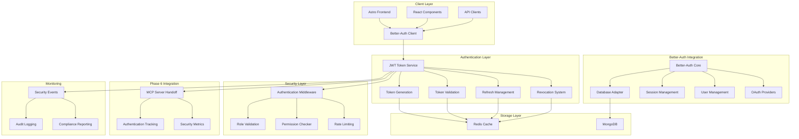
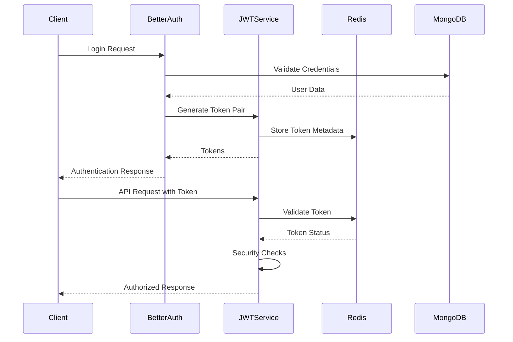

## 🎯 Executive Summary

This architecture document defines the comprehensive JWT authentication system for Phase 7, replacing legacy external auth integrations with Better-Auth integration while maintaining seamless compatibility with existing systems and HIPAA compliance requirements.

## 🏗️ System Architecture Overview

### High-Level Architecture


## 🔧 Core Components

### 1. JWT Token Service Architecture
```typescript
// Core JWT service with Better-Auth integration
interface JWTTokenService {
  // Token lifecycle management
  generateTokenPair(userId: string, role: UserRole, clientInfo: ClientInfo): TokenPair
  validateToken(token: string, tokenType: TokenType): TokenValidationResult
  refreshAccessToken(refreshToken: string, clientInfo: ClientInfo): TokenPair
  revokeToken(tokenId: string, reason: string): void
  
  // Security features
  validateTokenSecurity(payload: JWTPayload, metadata: TokenMetadata): boolean
  detectReplayAttack(payload: JWTPayload): boolean
  cleanupExpiredTokens(): CleanupResult
}
```

### 2. Better-Auth Integration Layer
```typescript
// Better-Auth integration service
interface BetterAuthIntegrationService {
  // User management
  createUser(userData: UserRegistrationData): Promise<User>
  authenticateUser(credentials: LoginCredentials): Promise<AuthenticationResult>
  updateUserProfile(userId: string, updates: UserUpdates): Promise<User>
  
  // Session management
  createSession(userId: string, clientInfo: ClientInfo): Promise<Session>
  validateSession(sessionId: string): Promise<SessionValidation>
  revokeSession(sessionId: string, reason: string): Promise<void>
  
  // OAuth integration
  handleOAuthCallback(provider: OAuthProvider, code: string): Promise<OAuthResult>
  linkOAuthAccount(userId: string, provider: OAuthProvider, tokens: OAuthTokens): Promise<void>
}
```

### 3. Authentication Middleware
```typescript
// Expressive authentication middleware
interface AuthenticationMiddleware {
  // Request authentication
  authenticateRequest(request: Request, response: Response, next: NextFunction): void
  requireRole(requiredRole: UserRole): MiddlewareFunction
  requirePermission(permission: Permission): MiddlewareFunction
  
  // Security validation
  validateCSRFToken(request: Request): boolean
  validateRateLimit(userId: string, endpoint: string): RateLimitResult
  extractTokenFromRequest(request: Request): string | null
}
```

## 🔐 Security Architecture

### Token Security Model
```typescript
interface TokenSecurityConfig {
  // JWT configuration
  algorithm: 'HS256' | 'RS256'
  accessTokenExpiry: number // seconds
  refreshTokenExpiry: number // seconds
  issuer: string
  audience: string
  
  // Security features
  requireSessionBinding: boolean
  enableIPValidation: boolean
  enableUserAgentValidation: boolean
  enableReplayProtection: boolean
  
  // Key management
  keyRotationInterval: number // days
  keyVersioning: boolean
  secureKeyStorage: boolean
}
```

### Data Flow Security


## 📊 Performance Architecture

### Caching Strategy
```typescript
interface TokenCachingStrategy {
  // Redis-based token storage
  storeTokenMetadata(tokenId: string, metadata: TokenMetadata): Promise<void>
  getTokenMetadata(tokenId: string): Promise<TokenMetadata | null>
  revokeToken(tokenId: string, reason: string): Promise<void>
  isTokenRevoked(tokenId: string): Promise<boolean>
  
  // Performance optimization
  batchValidateTokens(tokenIds: string[]): Promise<TokenValidationResult[]>
  cleanupExpiredTokens(): Promise<CleanupResult>
  getTokenStatistics(): Promise<TokenStatistics>
}
```

### Performance Targets
- **Token Generation**: <100ms average response time
- **Token Validation**: <50ms average response time
- **Rate Limiting**: <10ms average response time
- **Concurrent Users**: 10,000+ authenticated users
- **Request Throughput**: 1,000 requests/second

## 🔗 Integration Architecture

### Phase 6 MCP Server Integration
```typescript
interface Phase6IntegrationService {
  // Authentication tracking
  trackAuthenticationProgress(userId: string, event: AuthenticationEvent): void
  updateSecurityMetrics(metrics: SecurityMetrics): void
  reportSecurityIncident(incident: SecurityIncident): void
  
  // Enhanced hand-off workflows
  validateAgentCredentials(agentId: string, credentials: AgentCredentials): boolean
  trackMultiRoleSignOff(signOff: EnhancedSignOffRecord): void
  updateComponentProgress(component: Phase7Component, progress: number): void
}
```

### Existing System Compatibility
```typescript
interface LegacySystemAdapter {
  // Legacy compatibility layer (e.g., migrate from previous third-party providers)
  migrateFromLegacyProvider(legacyUserId: string): Promise<User>
  syncLegacyProviderData(userId: string): Promise<void>
  handleLegacyProviderWebhook(event: LegacyProviderWebhookEvent): Promise<void>
  
  // Session migration
  migrateSessions(legacySessionId: string): Promise<Session>
  validateLegacySession(sessionData: LegacySession): Promise<boolean>
}
```

## 🏥 HIPAA Compliance Architecture

### Data Protection
```typescript
interface HIPAAComplianceService {
  // Encryption management
  encryptPHI(data: any, encryptionLevel: EncryptionLevel): Promise<EncryptedData>
  decryptPHI(encryptedData: EncryptedData): Promise<any>
  rotateEncryptionKeys(): Promise<void>
  
  // Audit logging
  logPHIAccess(userId: string, action: string, data: any): Promise<void>
  generateAuditReport(startDate: Date, endDate: Date): Promise<AuditReport>
  validateAuditTrail(): Promise<AuditValidationResult>
  
  // Compliance validation
  validateHIPAACompliance(): Promise<ComplianceResult>
  generateComplianceReport(): Promise<ComplianceReport>
  trackComplianceViolations(): Promise<ViolationReport>
}
```

### Privacy Controls
```typescript
interface PrivacyControlService {
  // Data minimization
  applyMinimumNecessaryPrinciple(userId: string, requestedData: any): Promise<any>
  validateDataAccessRequest(request: DataAccessRequest): Promise<ValidationResult>
  implementDataRetentionPolicies(): Promise<void>
  
  // User consent management
  recordUserConsent(userId: string, consent: UserConsent): Promise<void>
  validateUserConsent(userId: string, action: string): Promise<boolean>
  manageConsentWithdrawal(userId: string): Promise<void>
}
```

## 🧪 Testing Architecture

### Test Strategy
```typescript
interface AuthenticationTestSuite {
  // Unit tests
  testTokenGeneration(): Promise<TestResult>
  testTokenValidation(): Promise<TestResult>
  testTokenRefresh(): Promise<TestResult>
  testTokenRevocation(): Promise<TestResult>
  
  // Integration tests
  testBetterAuthIntegration(): Promise<TestResult>
  testPhase6Integration(): Promise<TestResult>
  testRedisIntegration(): Promise<TestResult>
  testMongoDBIntegration(): Promise<TestResult>
  
  // Security tests
  testSecurityVulnerabilities(): Promise<SecurityTestResult>
  testRateLimiting(): Promise<TestResult>
  testCSRFProtection(): Promise<TestResult>
  testInputValidation(): Promise<TestResult>
  
  // Performance tests
  testTokenPerformance(): Promise<PerformanceResult>
  testConcurrentUsers(): Promise<PerformanceResult>
  testLoadHandling(): Promise<PerformanceResult>
}
```

### Test Coverage Requirements
- **Unit Test Coverage**: 95% minimum
- **Integration Test Coverage**: 90% minimum
- **Security Test Coverage**: 100% for authentication logic
- **Performance Test Coverage**: All critical paths tested

## 🚀 Deployment Architecture

### Environment Configuration
```typescript
interface DeploymentConfiguration {
  // Environment-specific settings
  development: EnvironmentConfig
  staging: EnvironmentConfig
  production: EnvironmentConfig
  
  // Security configurations
  jwtSecret: string
  encryptionKeys: EncryptionKeyConfig
  rateLimitConfig: RateLimitConfig
  
  // Database configurations
  redisConfig: RedisConfig
  mongoConfig: MongoDBConfig
  
  // Monitoring configurations
  sentryConfig: SentryConfig
  loggingConfig: LoggingConfig
}
```

### Rollback Strategy
```typescript
interface RollbackStrategy {
  // Version management
  maintainVersionHistory(): Promise<void>
  validateRollbackCompatibility(version: string): Promise<boolean>
  executeRollback(targetVersion: string): Promise<RollbackResult>
  
  // Data consistency
  backupAuthenticationData(): Promise<BackupResult>
  restoreAuthenticationData(backup: BackupResult): Promise<void>
  validateDataIntegrity(): Promise<IntegrityResult>
}
```

## 📈 Monitoring and Observability

### Security Monitoring
```typescript
interface SecurityMonitoringService {
  // Real-time monitoring
  monitorAuthenticationEvents(): Promise<MonitoringStream>
  detectSecurityThreats(): Promise<ThreatDetectionResult>
  generateSecurityAlerts(): Promise<Alert[]>
  
  // Analytics and reporting
  generateSecurityMetrics(): Promise<SecurityMetrics>
  createSecurityDashboard(): Promise<DashboardData>
  exportSecurityReports(): Promise<Report[]>
}
```

### Performance Monitoring
```typescript
interface PerformanceMonitoringService {
  // Performance metrics
  trackTokenGenerationTime(): Promise<PerformanceMetric>
  trackTokenValidationTime(): Promise<PerformanceMetric>
  trackAuthenticationSuccessRate(): Promise<SuccessRateMetric>
  
  // Capacity planning
  monitorResourceUsage(): Promise<ResourceUsage>
  predictCapacityNeeds(): Promise<CapacityPrediction>
  optimizePerformance(): Promise<OptimizationResult>
}
```

## 🎯 Success Criteria

### Technical Success Metrics
- ✅ JWT authentication operational with <100ms response time
- ✅ Better-Auth integration seamless with existing systems
- ✅ Token refresh mechanism with single-use enforcement
- ✅ Rate limiting active on all protected endpoints
- ✅ Phase 6 integration completed with authentication tracking
- ✅ 95% test coverage across all components
- ✅ Zero critical security vulnerabilities
- ✅ HIPAA compliance validated and maintained

### Business Success Metrics
- ✅ Seamless user experience with secure authentication
- ✅ Admin dashboard provides real-time security visibility
- ✅ Multi-role authentication workflows operational
- ✅ System ready for production deployment
- ✅ Compliance reporting automated and accurate

## 📋 Implementation Roadmap

### Phase 7.1: Foundation (Weeks 1-2)
1. **Better-Auth Integration Setup**
   - Configure Better-Auth with existing database
   - Implement user migration from Clerk
   - Set up OAuth providers integration

2. **Core JWT Service Implementation**
   - Implement token generation and validation
   - Create refresh token mechanism
   - Build token revocation system

### Phase 7.2: Security Hardening (Weeks 2-3)
1. **Authentication Middleware**
   - Implement request authentication validation
   - Create role-based authorization
   - Add permission checking system

2. **Security Features**
   - Implement CSRF protection
   - Add rate limiting with Redis
   - Create input validation system

### Phase 7.3: Integration and Testing (Weeks 3-4)
1. **Phase 6 Integration**
   - Extend MCP server with authentication tracking
   - Implement security metrics integration
   - Add enhanced sign-off workflows

2. **Comprehensive Testing**
   - Achieve 95% test coverage
   - Perform security penetration testing
   - Validate HIPAA compliance

### Phase 7.4: Monitoring and Deployment (Week 4)
1. **Monitoring and Dashboard**
   - Implement real-time security monitoring
   - Create authentication metrics dashboard
   - Set up automated alerting

2. **Production Deployment**
   - Deploy to staging environment
   - Perform final security validation
   - Execute production deployment

This architecture provides a comprehensive foundation for implementing enterprise-grade JWT authentication with Better-Auth integration while maintaining HIPAA compliance and seamless integration with the existing Phase 6 MCP server infrastructure.
