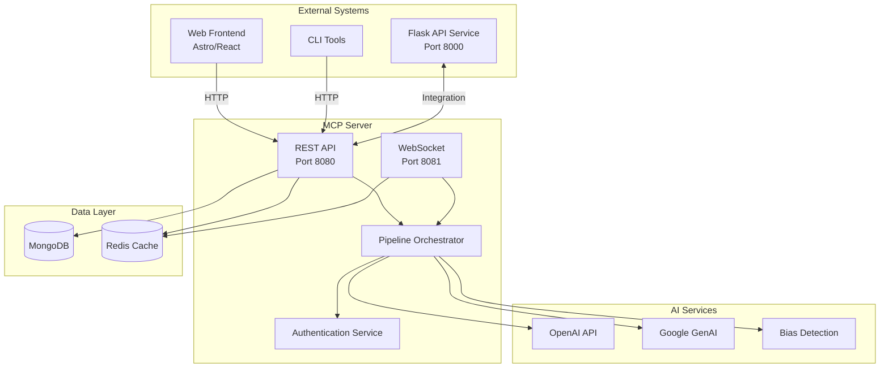

## MCP Server Architecture Summary

## Executive Summary

The Management Control Panel (MCP) server architecture provides a comprehensive, secure, and scalable solution for managing AI agents and orchestrating the 6-stage TechDeck-Python pipeline integration. Built with FastAPI and WebSocket support, the system follows established patterns from the Pixelated mental health platform while ensuring HIPAA compliance and enterprise-grade security.

## Architecture Overview

### System Context



## Key Components

### 1. Service Boundaries & Responsibilities

| Component | Responsibility | Technology |
|-----------|---------------|------------|
| **API Gateway** | RESTful endpoints, request routing, rate limiting | FastAPI |
| **WebSocket Server** | Real-time agent communication, event streaming | Socket.IO |
| **Agent Manager** | Agent registration, discovery, lifecycle management | Python/FastAPI |
| **Task Manager** | Task delegation, status tracking, queue management | Redis + MongoDB |
| **Pipeline Orchestrator** | 6-stage pipeline coordination, workflow execution | Python/AsyncIO |
| **Authentication Service** | JWT-based auth, role-based permissions | Python/JWT |
| **AI Service Hub** | Multi-provider AI integration, fallback logic | Python/aiohttp |
| **Security Service** | Encryption, data protection, audit logging | Python/Cryptography |

### 2. API Design Summary

#### RESTful Endpoints
- **Agent Management**: `/api/v1/agents/*` - Registration, discovery, health monitoring
- **Task Management**: `/api/v1/tasks/*` - Creation, delegation, completion tracking
- **Pipeline Orchestration**: `/api/v1/pipelines/*` - 6-stage pipeline coordination
- **Discovery & Health**: `/api/v1/health`, `/api/v1/discovery/*` - Service discovery

#### WebSocket Events
- **Agent Communication**: Real-time task delegation and progress updates
- **Pipeline Events**: Stage completion, error notifications
- **System Events**: Health checks, configuration updates

### 3. Database Schema Highlights

#### MongoDB Collections
- **agents**: Agent registration, capabilities, performance metrics
- **tasks**: Task lifecycle, assignments, results, error tracking
- **pipelines**: 6-stage pipeline configuration and execution state
- **events**: System events for monitoring and auditing
- **audit_logs**: HIPAA-compliant audit trail
- **metrics**: Performance and business metrics

#### Redis Cache Structures
- **Agent Registry**: Active agents, capabilities index
- **Task Queues**: Priority-based task distribution
- **Pipeline Progress**: Real-time progress tracking
- **Rate Limiting**: API protection and abuse prevention
- **Session Management**: WebSocket connection tracking

### 4. Security Architecture

#### Authentication & Authorization
- **JWT-based Authentication**: Secure token-based agent authentication
- **Role-based Permissions**: Worker, Supervisor, Admin, System roles
- **API Rate Limiting**: Request throttling per agent and endpoint
- **Resource-level Authorization**: Fine-grained access control

#### Data Protection
- **Encryption at Rest**: MongoDB encryption + field-level encryption
- **Encryption in Transit**: TLS 1.3 for all communications
- **FHE Support**: Fully Homomorphic Encryption for PHI data
- **Data Masking**: Automatic masking of sensitive data for non-privileged access

#### HIPAA Compliance
- **Audit Logging**: All data access logged with user identification
- **Data Classification**: Public, Internal, Confidential, Restricted, PHI
- **Retention Policies**: Configurable data retention with automatic cleanup
- **Breach Detection**: Real-time security monitoring and alerting

### 5. Integration Patterns

#### Flask Service Integration
- **Adapter Pattern**: Clean separation between MCP and Flask services
- **Circuit Breaker**: Protection against external service failures
- **Response Caching**: Redis-based caching for performance optimization
- **Health Monitoring**: Continuous health checks with automatic failover

#### AI Service Hub
- **Multi-provider Support**: OpenAI, Google GenAI, custom models
- **Fallback Strategy**: Automatic failover between AI providers
- **Rate Limiting**: Provider-specific rate limit management
- **Quality Monitoring**: Performance tracking and optimization

### 6. Error Handling & Resilience

#### Retry Strategy
- **Exponential Backoff**: Progressive delay increase for retries
- **Circuit Breaker**: Automatic service isolation during failures
- **Error Classification**: Network, timeout, validation, authentication, etc.
- **Customizable Retry Policies**: Per-service and per-operation configuration

#### Error Types & Handling
- **Network Errors**: Automatic retry with circuit breaker protection
- **Timeout Errors**: Configurable timeouts with graceful degradation
- **Validation Errors**: Immediate failure with detailed error messages
- **Authentication Errors**: Secure error handling without information leakage
- **External Service Errors**: Fallback mechanisms and service degradation

### 7. Performance Targets

| Metric | Target | Measurement |
|--------|--------|-------------|
| API Response Time | < 200ms (95th percentile) | Prometheus metrics |
| WebSocket Latency | < 50ms | Real-time monitoring |
| Task Processing | < 5 seconds (standard tasks) | Task duration histogram |
| Pipeline Completion | < 30 seconds (6-stage) | Pipeline metrics |
| Concurrent Agents | 1000+ active agents | Agent registry metrics |
| Task Throughput | 10,000+ tasks/minute | Throughput counters |

### 8. Deployment Architecture

#### Container Architecture
- **MCP Server**: Main API service (FastAPI)
- **WebSocket Server**: Real-time communication service
- **MongoDB**: Primary database with replication
- **Redis**: Cache layer with clustering support
- **Nginx**: Load balancer and SSL termination

#### Scaling Strategy
- **Horizontal Scaling**: Multiple MCP server instances
- **Database Sharding**: MongoDB sharding for large datasets
- **Redis Clustering**: High availability and performance
- **Auto-scaling**: Kubernetes HPA based on CPU/memory metrics
- **CDN Integration**: Static asset delivery optimization

## Security Features

### Data Protection
- ✅ **HIPAA Compliant**: Full healthcare data protection standards
- ✅ **FHE Support**: Fully Homomorphic Encryption for sensitive data
- ✅ **Encryption**: End-to-end encryption for all data
- ✅ **Access Controls**: Role-based access control (RBAC)
- ✅ **Audit Logging**: Comprehensive audit trail for compliance

### Network Security
- ✅ **TLS 1.3**: Latest encryption for all communications
- ✅ **Certificate Pinning**: Production certificate validation
- ✅ **Rate Limiting**: API protection against abuse
- ✅ **Input Validation**: Comprehensive input sanitization
- ✅ **CORS Configuration**: Secure cross-origin resource sharing

### Authentication Security
- ✅ **JWT Tokens**: Secure token-based authentication
- ✅ **Token Rotation**: Automatic token refresh mechanism
- ✅ **Session Management**: Secure session handling
- ✅ **Password Hashing**: bcrypt with salt and pepper
- ✅ **Multi-factor Authentication**: Support for MFA integration

## Integration Points

### Flask Service Integration
```python
# Example integration pattern
async def analyze_with_flask(text: str, context: Dict) -> Dict:
    """Analyze text using Flask emotional pipeline"""
    adapter = FlaskServiceAdapter(config, redis_client)
    
    async with adapter:
        result = await adapter.analyze_text(text, context)
        return result
```

### WebSocket Communication
```javascript
// Example WebSocket client
const socket = io('wss://api.pixelatedempathy.com/mcp/ws', {
  auth: { token: 'jwt_token_here' }
});

socket.on('task:delegate', async (task) => {
  const result = await processTask(task);
  socket.emit('task:result', {
    task_id: task.task_id,
    result: result
  });
});
```

### AI Service Integration
```python
# Example AI service usage
result = await ai_service_hub.process_task(
    task_type="bias_detection",
    input_data={
        "text": "Patient seems anxious about treatment",
        "context": {"session_type": "therapy"}
    }
)
```

## Monitoring & Observability

### Metrics Collection
- **Business Metrics**: Task completion rates, agent performance, pipeline success
- **System Metrics**: Response times, error rates, resource utilization
- **Security Metrics**: Authentication attempts, authorization failures, audit events
- **Performance Metrics**: Queue depths, processing times, throughput rates

### Logging Strategy
- **Structured Logging**: JSON-formatted logs with consistent schema
- **Log Levels**: DEBUG, INFO, WARNING, ERROR, CRITICAL
- **Log Aggregation**: Centralized logging with ELK stack
- **Security Logging**: HIPAA-compliant audit logging

### Alerting
- **Health Checks**: Automated service health monitoring
- **Error Alerts**: Real-time error notification
- **Performance Alerts**: Threshold-based performance monitoring
- **Security Alerts**: Unauthorized access and breach detection

## Development Workflow

### Local Development
```bash
# Start all services
pnpm dev:all-services

# Run tests
pnpm test:all

# Security scan
pnpm security:scan

# Performance test
pnpm performance:test
```

### Deployment Process
```bash
# Deploy to staging
pnpm deploy

# Deploy to production
pnpm deploy:prod

# Rollback if needed
pnpm rollback:prod
```

## Compliance & Governance

### HIPAA Compliance Checklist
- ✅ **Data Encryption**: All PHI encrypted at rest and in transit
- ✅ **Access Controls**: Role-based access with audit trails
- ✅ **Audit Logging**: Complete audit trail for all data access
- ✅ **Data Retention**: Configurable retention policies
- ✅ **Breach Detection**: Real-time security monitoring
- ✅ **Incident Response**: Defined incident response procedures

### Security Governance
- **Security Reviews**: Regular security audits and penetration testing
- **Code Reviews**: Mandatory security-focused code reviews
- **Dependency Management**: Automated vulnerability scanning
- **Compliance Monitoring**: Continuous compliance validation
- **Training**: Security awareness training for developers

## Future Enhancements

### Phase 2 Features
- **Advanced Analytics**: Machine learning-based performance optimization
- **Plugin System**: Extensible architecture for custom integrations
- **Multi-tenancy**: Support for multiple organizations
- **Advanced Scheduling**: AI-powered task scheduling optimization
- **Edge Computing**: Distributed processing capabilities

### Scalability Improvements
- **Microservices Architecture**: Service decomposition for better scaling
- **Event Sourcing**: Complete audit trail with event sourcing
- **CQRS Pattern**: Separate read and write models for performance
- **GraphQL API**: Flexible query interface for complex data requirements

## Conclusion

The MCP server architecture provides a robust, secure, and scalable foundation for managing AI agents and orchestrating complex mental health analysis pipelines. The design emphasizes:

1. **Security First**: HIPAA-compliant with comprehensive security controls
2. **Scalability**: Container-based architecture with horizontal scaling
3. **Reliability**: Comprehensive error handling and retry mechanisms
4. **Performance**: Optimized for high-throughput agent communication
5. **Maintainability**: Clear separation of concerns and modular design
6. **Compliance**: Full audit trail and regulatory compliance support

The architecture successfully bridges the existing Flask service with modern agent management capabilities while maintaining compatibility with the established Pixelated platform patterns and ensuring enterprise-grade security and performance.

## Documentation References

- **[Main Architecture](mcp-server-architecture.md)**: Comprehensive system design
- **[API Specification](mcp-api-specification.md)**: Detailed API documentation
- **[Database Schema](mcp-database-schema.md)**: Complete database design
- **[Integration & Security](mcp-integration-security.md)**: Security architecture and integration patterns

## Support & Maintenance

- **Documentation**: Available at `/docs` endpoint when running locally
- **Health Monitoring**: Comprehensive health checks and monitoring
- **Support**: api-support@pixelatedempathy.com
- **Status Page**: [https://status.pixelatedempathy.com](https://status.pixelatedempathy.com)
- **Issue Tracking**: [GitHub Issues](https://github.com/) with security classification

---

This architecture represents a production-ready solution for AI agent management in healthcare environments, with strong emphasis on security, compliance, and scalability while maintaining the ethical standards required for mental health applications.
