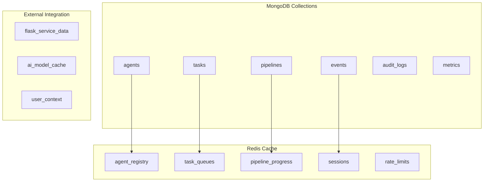
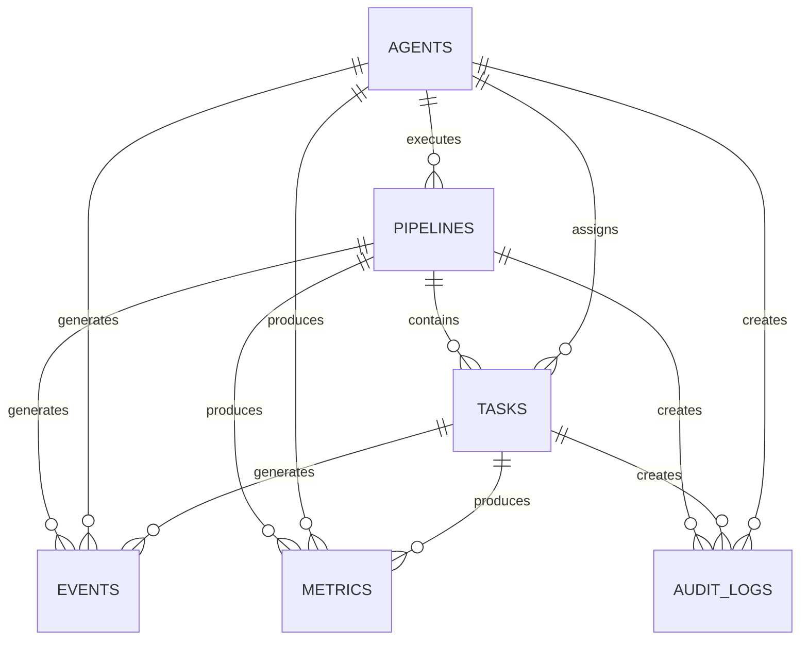

## MCP Server Database Schema Design

## Overview

This document defines the comprehensive database schema for the Management Control Panel (MCP) server, including MongoDB collections, Redis data structures, indexing strategies, and data relationships for the TechDeck-Python pipeline system.

## Database Architecture

### Technology Stack

- **Primary Database**: MongoDB 6.0+
- **Cache Layer**: Redis 7.0+
- **ODM**: Motor (Async MongoDB driver for Python)
- **Migration Tool**: Alembic for schema versioning

### Data Distribution Strategy



## MongoDB Collections

### 1. Agents Collection

#### Schema
```javascript
{
  _id: ObjectId,
  agent_id: String, // Unique identifier (indexed)
  name: String, // Display name
  type: String, // 'bias-detector', 'emotion-analyzer', 'therapist', 'general'
  capabilities: [String], // Array of capability strings
  status: String, // 'active', 'inactive', 'busy', 'error', 'maintenance'
  
  // Authentication
  auth_token: String, // Hashed authentication token
  permissions: [String], // Permission strings
  api_key: String, // Optional API key (hashed)
  
  // Versioning
  version: String, // Semantic version
  schema_version: Number, // Internal schema version
  
  // Network Configuration
  endpoint_url: String, // Agent service endpoint
  health_check_url: String, // Health check endpoint
  websocket_url: String, // WebSocket connection URL
  
  // Performance Metrics
  performance_metrics: {
    tasks_completed: Number,
    tasks_failed: Number,
    average_response_time: Number, // seconds
    success_rate: Number, // 0.0 to 1.0
    last_24h: {
      tasks_completed: Number,
      average_response_time: Number,
      peak_load: Number
    },
    last_7d: {
      tasks_completed: Number,
      average_response_time: Number,
      availability: Number // percentage
    }
  },
  
  // Resource Limits
  resource_limits: {
    max_concurrent_tasks: Number,
    max_memory_mb: Number,
    max_cpu_percent: Number,
    timeout_seconds: Number
  },
  
  // Scheduling
  scheduling_config: {
    priority: Number, // 1-10
    timezone: String,
    working_hours: {
      start: String, // "09:00"
      end: String, // "17:00"
      days: [String] // ["mon", "tue", "wed", "thu", "fri"]
    },
    maintenance_window: {
      start: String, // "02:00"
      duration_minutes: Number // 60
    }
  },
  
  // Metadata
  metadata: Object, // Flexible metadata storage
  tags: [String], // Searchable tags
  
  // Timestamps
  registered_at: Date,
  last_heartbeat: Date,
  last_task_completed: Date,
  updated_at: Date,
  created_at: Date,
  
  // Audit
  created_by: String, // User/agent who registered this agent
  updated_by: String,
  
  // Soft Delete
  is_deleted: Boolean,
  deleted_at: Date
}
```

#### Indexes
```javascript
// Primary indexes
db.agents.createIndex({ agent_id: 1 }, { unique: true })
db.agents.createIndex({ type: 1, status: 1 })
db.agents.createIndex({ capabilities: 1 })
db.agents.createIndex({ last_heartbeat: 1 }, { expireAfterSeconds: 300 }) // 5min TTL

// Performance indexes
db.agents.createIndex({ "performance_metrics.success_rate": -1 })
db.agents.createIndex({ "performance_metrics.tasks_completed": -1 })

// Search indexes
db.agents.createIndex({ name: "text", capabilities: "text", tags: "text" })

// Compound indexes for queries
db.agents.createIndex({ type: 1, status: 1, "performance_metrics.success_rate": -1 })
db.agents.createIndex({ status: 1, last_heartbeat: -1 })
```

### 2. Tasks Collection

#### Schema
```javascript
{
  _id: ObjectId,
  task_id: String, // Unique identifier (indexed)
  pipeline_id: String, // Reference to pipeline
  parent_task_id: String, // For subtasks
  
  // Task Definition
  stage: Number, // 1-6 for 6-stage pipeline
  task_type: String, // 'bias_detection', 'emotion_analysis', etc.
  task_category: String, // 'ai_analysis', 'data_processing', 'reporting'
  
  // Status Management
  status: String, // 'pending', 'assigned', 'running', 'completed', 'failed', 'cancelled', 'retry'
  substatus: String, // More granular status
  retry_count: Number,
  max_retries: Number,
  
  // Assignment
  assigned_agent_id: String, // Reference to agent
  assignment_history: [{
    agent_id: String,
    assigned_at: Date,
    released_at: Date,
    reason: String
  }],
  
  // Task Parameters
  parameters: Object, // Task-specific parameters
  input_data: Object, // Input data snapshot
  expected_output: Object, // Expected output schema
  
  // Results
  result: Object, // Task execution result
  result_metadata: Object, // Result metadata (confidence, etc.)
  output_data: Object, // Processed output data
  
  // Error Handling
  error: {
    code: String,
    message: String,
    stack_trace: String,
    details: Object,
    is_retryable: Boolean
  },
  
  // Performance
  performance_metrics: {
    queue_time: Number, // seconds
    processing_time: Number, // seconds
    total_time: Number, // seconds
    memory_usage_mb: Number,
    cpu_usage_percent: Number
  },
  
  // Scheduling
  priority: Number, // 1-10 (higher is more important)
  deadline: Date,
  estimated_duration: Number, // seconds
  dependencies: [String], // Task IDs that must complete first
  dependent_tasks: [String], // Task IDs that depend on this one
  
  // Pipeline Context
  pipeline_context: {
    stage_name: String,
    stage_dependencies: [Number],
    is_critical_path: Boolean
  },
  
  // Resource Requirements
  resource_requirements: {
    memory_mb: Number,
    cpu_cores: Number,
    gpu_required: Boolean,
    estimated_duration: Number
  },
  
  // Quality Assurance
  quality_scores: {
    accuracy: Number,
    completeness: Number,
    relevance: Number,
    overall: Number
  },
  validation_results: [{
    validator: String,
    passed: Boolean,
    score: Number,
    details: Object
  }],
  
  // Metadata
  metadata: Object,
  tags: [String],
  
  // Timestamps
  created_at: Date,
  updated_at: Date,
  assigned_at: Date,
  started_at: Date,
  completed_at: Date,
  deadline_at: Date,
  
  // Audit
  created_by: String,
  updated_by: String,
  
  // Soft Delete
  is_deleted: Boolean,
  deleted_at: Date
}
```

#### Indexes
```javascript
// Primary indexes
db.tasks.createIndex({ task_id: 1 }, { unique: true })
db.tasks.createIndex({ pipeline_id: 1, stage: 1 })
db.tasks.createIndex({ assigned_agent_id: 1, status: 1 })
db.tasks.createIndex({ status: 1, priority: -1, created_at: 1 })

// Status-based indexes
db.tasks.createIndex({ status: 1, deadline: 1 })
db.tasks.createIndex({ status: 1, task_type: 1 })

// Time-based indexes
db.tasks.createIndex({ created_at: -1 })
db.tasks.createIndex({ deadline: 1 }, { sparse: true })
db.tasks.createIndex({ completed_at: -1 }, { sparse: true })

// Performance indexes
db.tasks.createIndex({ "performance_metrics.processing_time": -1 })
db.tasks.createIndex({ "quality_scores.overall": -1 })

// Compound indexes for complex queries
db.tasks.createIndex({ pipeline_id: 1, status: 1, priority: -1 })
db.tasks.createIndex({ assigned_agent_id: 1, status: 1, created_at: -1 })
```

### 3. Pipelines Collection

#### Schema
```javascript
{
  _id: ObjectId,
  pipeline_id: String, // Unique identifier (indexed)
  name: String,
  description: String,
  
  // Pipeline Configuration
  type: String, // 'mental_health_analysis', 'bias_detection', 'custom'
  configuration: {
    stages: [{
      stage: Number,
      name: String,
      task_type: String,
      dependencies: [Number],
      is_parallel: Boolean,
      timeout_seconds: Number,
      retry_config: {
        max_retries: Number,
        backoff_strategy: String,
        delay_seconds: Number
      }
    }],
    routing_rules: Object, // Dynamic routing configuration
    quality_thresholds: Object // Minimum quality scores
  },
  
  // Execution Status
  status: String, // 'created', 'running', 'completed', 'failed', 'cancelled', 'paused'
  progress: Number, // 0.0 to 1.0
  current_stage: Number,
  
  // Stage Tracking
  stages: [{
    stage: Number,
    name: String,
    status: String, // 'pending', 'running', 'completed', 'failed'
    tasks: [String], // Task IDs
    progress: Number, // 0.0 to 1.0
    started_at: Date,
    completed_at: Date,
    estimated_duration: Number, // seconds
    actual_duration: Number, // seconds
    results: Object,
    errors: [Object]
  }],
  
  // Input/Output
  input_data: Object, // Original input data
  output_data: Object, // Final output data
  intermediate_results: Object, // Stage-by-stage results
  
  // Performance Metrics
  performance_metrics: {
    total_duration: Number, // seconds
    stage_durations: [Number], // per stage
    task_success_rate: Number, // 0.0 to 1.0
    average_task_time: Number, // seconds
    peak_memory_usage: Number, // MB
    total_tasks: Number
  },
  
  // Resource Usage
  resource_usage: {
    total_cpu_seconds: Number,
    total_memory_mb: Number,
    peak_concurrent_tasks: Number,
    agent_utilization: Object // Per agent usage stats
  },
  
  // Error Handling
  error_strategy: {
    on_stage_failure: String, // 'continue', 'stop', 'rollback'
    max_failed_tasks: Number,
    retry_failed_stages: Boolean
  },
  errors: [{
    stage: Number,
    task_id: String,
    error: Object,
    handled: Boolean
  }],
  
  // Scheduling
  priority: Number, // 1-10
  scheduled_start: Date,
  deadline: Date,
  
  // Context
  context: Object, // Runtime context
  metadata: Object,
  tags: [String],
  
  // Security & Compliance
  security_level: String, // 'standard', 'hipaa', 'fhe'
  encryption_enabled: Boolean,
  audit_trail: [{
    action: String,
    timestamp: Date,
    user: String,
    details: Object
  }],
  
  // Timestamps
  created_at: Date,
  updated_at: Date,
  started_at: Date,
  completed_at: Date,
  
  // Audit
  created_by: String,
  updated_by: String,
  
  // Soft Delete
  is_deleted: Boolean,
  deleted_at: Date
}
```

#### Indexes
```javascript
// Primary indexes
db.pipelines.createIndex({ pipeline_id: 1 }, { unique: true })
db.pipelines.createIndex({ status: 1, created_at: -1 })
db.pipelines.createIndex({ created_by: 1, created_at: -1 })

// Status and progress indexes
db.pipelines.createIndex({ status: 1, priority: -1 })
db.pipelines.createIndex({ status: 1, current_stage: 1 })

// Time-based indexes
db.pipelines.createIndex({ created_at: -1 })
db.pipelines.createIndex({ deadline: 1 }, { sparse: true })
db.pipelines.createIndex({ completed_at: -1 }, { sparse: true })

// Search indexes
db.pipelines.createIndex({ name: "text", description: "text", tags: "text" })

// Compound indexes
db.pipelines.createIndex({ status: 1, priority: -1, created_at: -1 })
```

### 4. Events Collection

#### Schema
```javascript
{
  _id: ObjectId,
  event_id: String, // Unique identifier (indexed)
  event_type: String, // 'task_created', 'agent_registered', etc.
  event_category: String, // 'system', 'task', 'agent', 'pipeline'
  
  // Event Source
  source: {
    type: String, // 'agent', 'user', 'system', 'external'
    id: String, // Source identifier
    ip_address: String,
    user_agent: String
  },
  
  // Event Target
  target: {
    type: String, // 'task', 'agent', 'pipeline'
    id: String // Target identifier
  },
  
  // Event Data
  payload: Object, // Event-specific data
  metadata: Object, // Additional metadata
  
  // Event Context
  context: {
    request_id: String,
    session_id: String,
    pipeline_id: String,
    stage: Number,
    correlation_id: String
  },
  
  // Processing
  processed: Boolean,
  processing_errors: [Object],
  retry_count: Number,
  
  // Timestamps
  created_at: Date,
  processed_at: Date,
  
  // TTL for old events
  expires_at: Date
}
```

#### Indexes
```javascript
// Primary indexes
db.events.createIndex({ event_id: 1 }, { unique: true })
db.events.createIndex({ event_type: 1, created_at: -1 })
db.events.createIndex({ "target.type": 1, "target.id": 1, created_at: -1 })

// Time-based indexes
db.events.createIndex({ created_at: -1 })
db.events.createIndex({ expires_at: 1 }, { expireAfterSeconds: 0 })

// Processing indexes
db.events.createIndex({ processed: 1, created_at: 1 })
db.events.createIndex({ "context.correlation_id": 1 })

// Compound indexes
db.events.createIndex({ event_type: 1, processed: 1, created_at: -1 })
```

### 5. Audit Logs Collection

#### Schema (HIPAA Compliant)
```javascript
{
  _id: ObjectId,
  audit_id: String, // Unique identifier (indexed)
  
  // Audit Event
  action: String, // 'create', 'read', 'update', 'delete', 'execute'
  resource_type: String, // 'task', 'agent', 'pipeline', 'user_data'
  resource_id: String,
  
  // Actor Information
  actor: {
    type: String, // 'user', 'agent', 'system'
    id: String,
    roles: [String],
    ip_address: String,
    user_agent: String
  },
  
  // Data Accessed
  data_accessed: {
    fields: [String], // Fields that were accessed
    records_count: Number,
    data_classification: String // 'public', 'internal', 'confidential', 'restricted'
  },
  
  // Before/After State (for updates)
  before_state: Object, // Optional, for updates
  after_state: Object, // Optional, for updates
  
  // Security Context
  security_context: {
    authentication_method: String,
    authorization_level: String,
    encryption_applied: Boolean,
    data_masking_applied: Boolean
  },
  
  // Compliance
  compliance_flags: {
    hipaa_relevant: Boolean,
    phi_involved: Boolean,
    consent_required: Boolean,
    retention_required: Boolean
  },
  
  // Risk Assessment
  risk_level: String, // 'low', 'medium', 'high', 'critical'
  risk_factors: [String],
  
  // Metadata
  metadata: Object,
  session_id: String,
  request_id: String,
  
  // Timestamps
  timestamp: Date,
  created_at: Date,
  
  // Retention
  retention_until: Date,
  deletion_reason: String
}
```

#### Indexes
```javascript
// Primary indexes
db.audit_logs.createIndex({ audit_id: 1 }, { unique: true })
db.audit_logs.createIndex({ actor.id: 1, timestamp: -1 })
db.audit_logs.createIndex({ resource_type: 1, resource_id: 1, timestamp: -1 })

// Compliance indexes
db.audit_logs.createIndex({ "compliance_flags.hipaa_relevant": 1, timestamp: -1 })
db.audit_logs.createIndex({ "security_context.data_classification": 1, timestamp: -1 })

// Time-based indexes
db.audit_logs.createIndex({ timestamp: -1 })
db.audit_logs.createIndex({ retention_until: 1 }, { sparse: true })

// Security indexes
db.audit_logs.createIndex({ risk_level: 1, timestamp: -1 })
db.audit_logs.createIndex({ action: 1, "actor.type": 1, timestamp: -1 })
```

### 6. Metrics Collection

#### Schema
```javascript
{
  _id: ObjectId,
  metric_id: String, // Unique identifier (indexed)
  metric_name: String, // 'task_completion_rate', 'agent_response_time', etc.
  metric_type: String, // 'gauge', 'counter', 'histogram', 'summary'
  
  // Metric Value
  value: Number,
  value_type: String, // 'current', 'average', 'percentile', 'rate'
  
  // Dimensions
  dimensions: {
    agent_id: String,
    agent_type: String,
    task_type: String,
    pipeline_id: String,
    stage: Number,
    environment: String, // 'production', 'staging', 'development'
    region: String
  },
  
  // Time Window
  window_start: Date,
  window_end: Date,
  window_duration: Number, // seconds
  
  // Statistical Data
  statistics: {
    count: Number,
    sum: Number,
    min: Number,
    max: Number,
    avg: Number,
    std_dev: Number,
    percentiles: {
      p50: Number,
      p90: Number,
      p95: Number,
      p99: Number
    }
  },
  
  // Quality Indicators
  quality_score: Number, // 0.0 to 1.0
  confidence_level: Number, // 0.0 to 1.0
  
  // Metadata
  metadata: Object,
  tags: [String],
  
  // Timestamps
  created_at: Date,
  
  // TTL for aggregated metrics
  expires_at: Date
}
```

#### Indexes
```javascript
// Primary indexes
db.metrics.createIndex({ metric_id: 1 }, { unique: true })
db.metrics.createIndex({ metric_name: 1, "dimensions.agent_id": 1, window_start: -1 })

// Time-based indexes
db.metrics.createIndex({ window_start: -1, window_end: -1 })
db.metrics.createIndex({ created_at: -1 })
db.metrics.createIndex({ expires_at: 1 }, { expireAfterSeconds: 0 })

// Dimension-based indexes
db.metrics.createIndex({ "dimensions.agent_type": 1, metric_name: 1, window_start: -1 })
db.metrics.createIndex({ "dimensions.task_type": 1, metric_name: 1, window_start: -1 })
db.metrics.createIndex({ "dimensions.pipeline_id": 1, metric_name: 1, window_start: -1 })

// Compound indexes
db.metrics.createIndex({ metric_name: 1, "dimensions.environment": 1, window_start: -1 })
```

## Redis Data Structures

### 1. Agent Registry Cache

#### Agent Status
```
Key: agents:status:{agent_id}
Value: {
  "status": "active",
  "last_heartbeat": "2024-01-15T10:30:00Z",
  "current_tasks": 2,
  "performance_score": 0.95,
  "capabilities": ["bias_detection", "text_analysis"],
  "endpoint_url": "http://agent:8000",
  "version": "1.0.0"
}
TTL: 300 seconds (5 minutes)
```

#### Agent Capabilities Index
```
Key: agents:capabilities:{capability}
Value: Sorted Set of {agent_id: performance_score}
Example: agents:capabilities:bias_detection = {
  "bias-detector-001": 0.95,
  "bias-detector-002": 0.87
}
```

#### Active Agents Set
```
Key: agents:active
Value: Set of active agent IDs
TTL: Updated every 30 seconds
```

### 2. Task Queue System

#### Pending Tasks Queue
```
Key: tasks:pending:{priority}
Value: Priority Queue (sorted by deadline, created_at)
Example: tasks:pending:5 = [
  "{task_id: 'task-123', deadline: '2024-01-15T11:00:00Z', created_at: '2024-01-15T10:00:00Z'}",
  "{task_id: 'task-124', deadline: '2024-01-15T11:30:00Z', created_at: '2024-01-15T10:15:00Z'}"
]
```

#### Running Tasks
```
Key: tasks:running
Value: Set of running task IDs
```

#### Agent Task Assignment
```
Key: tasks:assigned:{agent_id}
Value: Set of task IDs assigned to agent
TTL: Updated when tasks are completed or reassigned
```

#### Task Status Cache
```
Key: tasks:status:{task_id}
Value: {
  "status": "running",
  "agent_id": "agent-001",
  "progress": 0.75,
  "started_at": "2024-01-15T10:30:00Z",
  "estimated_completion": "2024-01-15T10:32:00Z"
}
TTL: 3600 seconds (1 hour)
```

### 3. Pipeline Progress Cache

#### Pipeline Status
```
Key: pipeline:{pipeline_id}:status
Value: {
  "status": "running",
  "progress": 0.65,
  "current_stage": 4,
  "started_at": "2024-01-15T10:30:00Z",
  "estimated_completion": "2024-01-15T10:35:00Z"
}
TTL: 600 seconds (10 minutes)
```

#### Stage Progress
```
Key: pipeline:{pipeline_id}:stage:{stage_number}
Value: {
  "status": "running",
  "progress": 0.8,
  "tasks_total": 5,
  "tasks_completed": 4,
  "started_at": "2024-01-15T10:32:00Z"
}
TTL: 600 seconds (10 minutes)
```

### 4. Rate Limiting

#### API Rate Limits
```
Key: rate_limit:{endpoint}:{actor_id}
Value: {
  "count": 45,
  "window_start": "2024-01-15T10:00:00Z",
  "window_end": "2024-01-15T10:01:00Z"
}
TTL: 60 seconds (1 minute window)
```

#### WebSocket Connection Limits
```
Key: ws:connections:{agent_id}
Value: Number of active connections
TTL: 300 seconds (5 minutes)
```

### 5. Session Management

#### WebSocket Sessions
```
Key: ws:session:{session_id}
Value: {
  "agent_id": "agent-001",
  "connected_at": "2024-01-15T10:30:00Z",
  "last_activity": "2024-01-15T10:35:00Z",
  "permissions": ["task:execute", "task:read"]
}
TTL: 1800 seconds (30 minutes)
```

### 6. Distributed Locking

#### Task Processing Locks
```
Key: lock:task:{task_id}
Value: {
  "agent_id": "agent-001",
  "locked_at": "2024-01-15T10:30:00Z",
  "expires_at": "2024-01-15T10:35:00Z"
}
TTL: 300 seconds (5 minutes)
```

#### Pipeline Execution Locks
```
Key: lock:pipeline:{pipeline_id}:stage:{stage}
Value: {
  "agent_id": "agent-001",
  "locked_at": "2024-01-15T10:30:00Z",
  "expires_at": "2024-01-15T10:40:00Z"
}
TTL: 600 seconds (10 minutes)
```

## Data Relationships

### Entity Relationship Diagram



### Relationship Details

#### Agent → Tasks (One-to-Many)
- An agent can be assigned multiple tasks
- Tasks have a reference to their assigned agent
- Assignment history is tracked in the task document

#### Pipeline → Tasks (One-to-Many)
- A pipeline contains multiple tasks organized by stages
- Tasks reference their parent pipeline
- Stage relationships are maintained in the pipeline configuration

#### Entities → Events (One-to-Many)
- All entities generate events for state changes
- Events maintain references to their source entities
- Events enable real-time monitoring and auditing

#### Entities → Metrics (One-to-Many)
- All entities generate performance metrics
- Metrics are aggregated by time windows
- Metrics enable performance monitoring and optimization

#### Entities → Audit Logs (One-to-Many)
- All data access is logged for compliance
- Audit logs maintain references to accessed entities
- Audit logs support HIPAA compliance requirements

## Data Consistency Patterns

### Eventual Consistency Model

1. **Primary Data**: MongoDB serves as the source of truth
2. **Cache Layer**: Redis provides fast access to frequently used data
3. **Event System**: Events propagate changes across the system
4. **Audit Trail**: All changes are logged for compliance

### Consistency Strategies

#### Write-Through Cache
- Updates go to MongoDB first, then cache is updated
- Ensures cache consistency with database
- Used for agent status and task assignments

#### Write-Behind Cache
- Updates go to cache first, then asynchronously to MongoDB
- Used for metrics and non-critical data
- Improves performance for high-frequency updates

#### Cache-Aside Pattern
- Application checks cache first, falls back to database
- Cache is populated on first access
- Used for configuration and reference data

## Data Migration Strategy

### Version Management

```javascript
// Schema version tracking
{
  _id: "schema_version",
  current_version: 2,
  migrations: [{
    version: 1,
    description: "Initial schema",
    applied_at: "2024-01-01T00:00:00Z"
  }, {
    version: 2,
    description: "Add performance metrics",
    applied_at: "2024-02-01T00:00:00Z"
  }]
}
```

### Migration Process

1. **Backup**: Full database backup before migration
2. **Validation**: Schema validation and data integrity checks
3. **Migration**: Incremental migration with rollback capability
4. **Verification**: Post-migration validation and testing
5. **Cleanup**: Removal of deprecated fields and indexes

## Performance Optimization

### Indexing Strategy

#### Selective Indexing
- Index only frequently queried fields
- Use compound indexes for complex queries
- Monitor index usage and remove unused indexes

#### Index Types
- **Single Field**: For simple equality queries
- **Compound**: For multi-field queries with sorting
- **Text**: For full-text search capabilities
- **TTL**: For automatic data expiration
- **Sparse**: For fields with many null values

### Query Optimization

#### Projection
- Always specify required fields in queries
- Avoid returning large documents
- Use aggregation pipelines for complex data processing

#### Aggregation Pipeline
```javascript
// Example: Pipeline performance summary
db.pipelines.aggregate([
  { $match: { status: "completed", created_at: { $gte: startDate } } },
  { $project: {
    pipeline_id: 1,
    total_duration: { $subtract: ["$completed_at", "$started_at"] },
    success_rate: { $divide: ["$performance_metrics.successful_tasks", "$performance_metrics.total_tasks"] }
  }},
  { $group: {
    _id: null,
    avg_duration: { $avg: "$total_duration" },
    avg_success_rate: { $avg: "$success_rate" },
    total_pipelines: { $sum: 1 }
  }}
])
```

### Data Archiving

#### Archival Strategy
- Move old data to archive collections
- Compress large documents
- Maintain aggregated summaries
- Ensure compliance with retention policies

#### Archive Collections
```javascript
// tasks_archive - for completed tasks older than 90 days
// pipelines_archive - for completed pipelines older than 180 days
// events_archive - for events older than 30 days
// metrics_archive - for detailed metrics older than 7 days
```

## Security Considerations

### Data Encryption

#### At-Rest Encryption
- MongoDB encryption at rest enabled
- Sensitive fields encrypted using FHE
- Key rotation every 90 days
- Secure key management using HashiCorp Vault

#### In-Transit Encryption
- TLS 1.3 for all database connections
- Certificate pinning for production
- Encrypted backup storage

### Access Control

#### Database Users
- **Application User**: Read/write access to application collections
- **Analytics User**: Read-only access with row-level security
- **Backup User**: Read-only access for backup operations
- **Admin User**: Full administrative access (restricted)

#### Field-Level Security
```javascript
// Sensitive data access control
{
  _id: ObjectId,
  public_data: Object, // Always accessible
  sensitive_data: Object, // Requires elevated permissions
  encrypted_data: String, // Encrypted sensitive data
  data_classification: String // 'public', 'internal', 'confidential', 'restricted'
}
```

### Audit Compliance

#### HIPAA Compliance
- All PHI access logged with user identification
- Encryption of all PHI data
- Audit logs retained for 6 years
- Regular compliance audits and reporting

#### Data Retention
- Task data: 90 days (extendable based on compliance requirements)
- Pipeline data: 180 days
- Audit logs: 6 years (HIPAA requirement)
- Metrics data: 2 years (aggregated), 30 days (detailed)

## Monitoring and Maintenance

### Database Monitoring

#### Performance Metrics
- Query performance and slow query log
- Index usage and efficiency
- Connection pool utilization
- Replication lag (if applicable)
- Storage usage and growth trends

#### Health Checks
- Database connectivity
- Collection statistics
- Index fragmentation
- Memory usage
- Disk I/O performance

### Maintenance Procedures

#### Regular Maintenance
- Index optimization and rebuilding
- Statistics update
- Log rotation and cleanup
- Backup verification
- Performance tuning

#### Capacity Planning
- Storage growth projections
- Performance trend analysis
- Scaling requirements assessment
- Resource utilization optimization

## Conclusion

This database schema design provides a robust, scalable, and secure foundation for the MCP server system. The design emphasizes:

1. **Performance**: Optimized indexing and query patterns
2. **Scalability**: Sharding-ready design with proper data distribution
3. **Security**: HIPAA-compliant with encryption and access controls
4. **Reliability**: Comprehensive backup and disaster recovery
5. **Maintainability**: Clear documentation and migration strategies
6. **Compliance**: Full audit trail and data retention policies

The schema supports the complex requirements of the TechDeck-Python pipeline system while maintaining flexibility for future enhancements and scaling needs.
