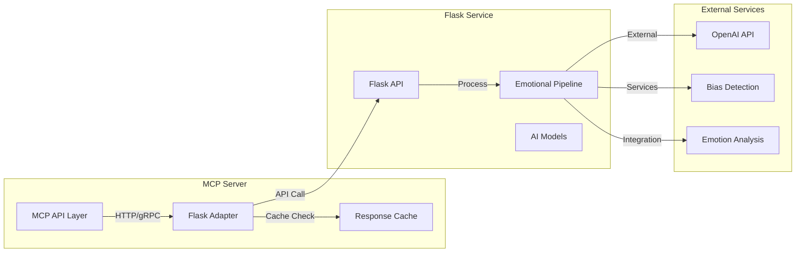

# MCP Server Integration Patterns & Security Architecture

## Overview

This document defines the integration patterns, security architecture, and authentication/authorization mechanisms for the Management Control Panel (MCP) server, ensuring secure and reliable integration with the existing Flask service and external AI services while maintaining HIPAA compliance.

## Integration Architecture

### Service Integration Patterns

#### 1. Flask Service Integration



#### Flask Adapter Implementation

```python
# mcp/integrations/flask_adapter.py
from typing import Dict, Any, Optional
from dataclasses import dataclass
import aiohttp
import asyncio
from tenacity import retry, stop_after_attempt, wait_exponential
import redis.asyncio as redis

@dataclass
class FlaskServiceConfig:
    base_url: str
    timeout: int = 30
    max_retries: int = 3
    circuit_breaker_threshold: int = 5
    cache_ttl: int = 300
    
class FlaskServiceAdapter:
    def __init__(self, config: FlaskServiceConfig, redis_client: redis.Redis):
        self.config = config
        self.redis = redis_client
        self.session: Optional[aiohttp.ClientSession] = None
        self.circuit_breaker = CircuitBreaker(
            failure_threshold=config.circuit_breaker_threshold,
            recovery_timeout=60
        )
    
    async def __aenter__(self):
        self.session = aiohttp.ClientSession(
            timeout=aiohttp.ClientTimeout(total=self.config.timeout),
            connector=aiohttp.TCPConnector(limit=100, limit_per_host=30)
        )
        return self
    
    async def __aexit__(self, exc_type, exc_val, exc_tb):
        if self.session:
            await self.session.close()
    
    @retry(
        stop=stop_after_attempt(3),
        wait=wait_exponential(multiplier=1, min=4, max=10)
    )
    async def analyze_text(self, text: str, context: Dict[str, Any]) -> Dict[str, Any]:
        """Analyze text using Flask emotional pipeline service"""
        cache_key = f"flask:analyze:{hash(text + str(context))}"
        
        # Check cache first
        cached_result = await self.redis.get(cache_key)
        if cached_result:
            return json.loads(cached_result)
        
        # Check circuit breaker
        if not self.circuit_breaker.can_execute():
            raise ServiceUnavailableError("Flask service circuit breaker is open")
        
        try:
            payload = {
                "text": text,
                "context": context,
                "metadata": {
                    "request_id": context.get("request_id"),
                    "timestamp": datetime.utcnow().isoformat()
                }
            }
            
            async with self.session.post(
                f"{self.config.base_url}/analyze",
                json=payload,
                headers={
                    "Content-Type": "application/json",
                    "X-Request-ID": context.get("request_id", ""),
                    "X-API-Key": settings.FLASK_API_KEY
                }
            ) as response:
                if response.status == 200:
                    result = await response.json()
                    
                    # Cache successful results
                    await self.redis.setex(
                        cache_key,
                        self.config.cache_ttl,
                        json.dumps(result)
                    )
                    
                    self.circuit_breaker.record_success()
                    return result
                else:
                    error_text = await response.text()
                    raise ExternalServiceError(
                        f"Flask service error {response.status}: {error_text}"
                    )
                    
        except Exception as e:
            self.circuit_breaker.record_failure()
            logger.error(f"Flask service integration error: {e}")
            raise
    
    async def health_check(self) -> Dict[str, Any]:
        """Check Flask service health status"""
        try:
            async with self.session.get(
                f"{self.config.base_url}/health",
                timeout=aiohttp.ClientTimeout(total=5)
            ) as response:
                if response.status == 200:
                    return await response.json()
                else:
                    return {"status": "unhealthy", "code": response.status}
        except Exception as e:
            logger.error(f"Flask service health check failed: {e}")
            return {"status": "unhealthy", "error": str(e)}
```

#### 2. AI Service Hub Pattern

```python
# mcp/integrations/ai_service_hub.py
from typing import Dict, Any, List, Optional
from enum import Enum
from dataclasses import dataclass
import asyncio
from abc import ABC, abstractmethod

class AIServiceType(Enum):
    OPENAI = "openai"
    GOOGLE = "google"
    BIAS_DETECTION = "bias_detection"
    EMOTION_ANALYSIS = "emotion_analysis"

@dataclass
class AIServiceConfig:
    service_type: AIServiceType
    endpoint_url: str
    api_key: str
    timeout: int = 30
    max_retries: int = 3
    rate_limit: int = 100  # requests per minute

class AIServiceInterface(ABC):
    @abstractmethod
    async def process(self, input_data: Dict[str, Any]) -> Dict[str, Any]:
        pass
    
    @abstractmethod
    async def health_check(self) -> Dict[str, Any]:
        pass

class OpenAIService(AIServiceInterface):
    def __init__(self, config: AIServiceConfig):
        self.config = config
        self.client = OpenAI(api_key=config.api_key)
    
    async def process(self, input_data: Dict[str, Any]) -> Dict[str, Any]:
        """Process input using OpenAI API"""
        try:
            response = await self.client.chat.completions.create(
                model=input_data.get("model", "gpt-4"),
                messages=input_data.get("messages", []),
                temperature=input_data.get("temperature", 0.7),
                max_tokens=input_data.get("max_tokens", 1000)
            )
            
            return {
                "result": response.choices[0].message.content,
                "model": response.model,
                "usage": {
                    "prompt_tokens": response.usage.prompt_tokens,
                    "completion_tokens": response.usage.completion_tokens,
                    "total_tokens": response.usage.total_tokens
                }
            }
        except Exception as e:
            logger.error(f"OpenAI service error: {e}")
            raise ExternalServiceError(f"OpenAI processing failed: {e}")
    
    async def health_check(self) -> Dict[str, Any]:
        """Check OpenAI service availability"""
        try:
            response = await self.client.models.list()
            return {"status": "healthy", "available_models": len(response.data)}
        except Exception as e:
            return {"status": "unhealthy", "error": str(e)}

class BiasDetectionService(AIServiceInterface):
    def __init__(self, config: AIServiceConfig):
        self.config = config
        self.session: Optional[aiohttp.ClientSession] = None
    
    async def process(self, input_data: Dict[str, Any]) -> Dict[str, Any]:
        """Process text for bias detection"""
        if not self.session:
            self.session = aiohttp.ClientSession()
        
        try:
            async with self.session.post(
                f"{self.config.endpoint_url}/detect_bias",
                json={
                    "text": input_data.get("text"),
                    "context": input_data.get("context", {}),
                    "analysis_type": input_data.get("analysis_type", "comprehensive")
                },
                headers={"Authorization": f"Bearer {self.config.api_key}"}
            ) as response:
                if response.status == 200:
                    return await response.json()
                else:
                    raise ExternalServiceError(
                        f"Bias detection service error: {response.status}"
                    )
        except Exception as e:
            logger.error(f"Bias detection service error: {e}")
            raise

class AIServiceHub:
    def __init__(self, configs: List[AIServiceConfig], redis_client: redis.Redis):
        self.services: Dict[AIServiceType, AIServiceInterface] = {}
        self.redis = redis_client
        self.circuit_breakers: Dict[AIServiceType, CircuitBreaker] = {}
        
        for config in configs:
            self._initialize_service(config)
    
    def _initialize_service(self, config: AIServiceConfig):
        """Initialize individual AI services"""
        circuit_breaker = CircuitBreaker(
            failure_threshold=5,
            recovery_timeout=60
        )
        self.circuit_breakers[config.service_type] = circuit_breaker
        
        if config.service_type == AIServiceType.OPENAI:
            self.services[config.service_type] = OpenAIService(config)
        elif config.service_type == AIServiceType.BIAS_DETECTION:
            self.services[config.service_type] = BiasDetectionService(config)
        # Add other service implementations...
    
    async def process_task(self, task_type: str, input_data: Dict[str, Any]) -> Dict[str, Any]:
        """Route task to appropriate AI service with fallback"""
        service_type = self._determine_service_type(task_type)
        
        # Primary service attempt
        if service_type in self.services:
            service = self.services[service_type]
            circuit_breaker = self.circuit_breakers[service_type]
            
            if circuit_breaker.can_execute():
                try:
                    result = await service.process(input_data)
                    circuit_breaker.record_success()
                    return result
                except Exception as e:
                    circuit_breaker.record_failure()
                    logger.error(f"Primary service {service_type} failed: {e}")
        
        # Fallback service attempt
        fallback_service = self._get_fallback_service(task_type)
        if fallback_service:
            return await self._execute_fallback(fallback_service, input_data)
        
        raise ServiceUnavailableError(f"No available service for task type: {task_type}")
    
    def _determine_service_type(self, task_type: str) -> AIServiceType:
        """Determine appropriate AI service for task type"""
        task_service_map = {
            "bias_detection": AIServiceType.BIAS_DETECTION,
            "emotion_analysis": AIServiceType.EMOTION_ANALYSIS,
            "text_generation": AIServiceType.OPENAI,
            "sentiment_analysis": AIServiceType.EMOTION_ANALYSIS
        }
        return task_service_map.get(task_type, AIServiceType.OPENAI)
    
    def _get_fallback_service(self, task_type: str) -> Optional[AIServiceInterface]:
        """Get fallback service for task type"""
        # Implement fallback logic based on service availability
        available_services = [
            service for service_type, service in self.services.items()
            if self.circuit_breakers[service_type].can_execute()
        ]
        return available_services[0] if available_services else None
    
    async def health_check_all(self) -> Dict[str, Any]:
        """Check health of all AI services"""
        health_status = {}
        
        for service_type, service in self.services.items():
            try:
                health = await service.health_check()
                health_status[service_type.value] = health
            except Exception as e:
                health_status[service_type.value] = {
                    "status": "unhealthy",
                    "error": str(e)
                }
        
        return {
            "overall_status": "healthy" if all(
                h.get("status") == "healthy" for h in health_status.values()
            ) else "degraded",
            "services": health_status
        }
```

### Security Architecture

#### Authentication & Authorization

```python
# mcp/security/auth.py
from typing import Optional, Dict, Any, List
from datetime import datetime, timedelta
import jwt
from passlib.context import CryptContext
import redis.asyncio as redis
from enum import Enum

class AgentRole(Enum):
    WORKER = "worker"
    SUPERVISOR = "supervisor"
    ADMIN = "admin"
    SYSTEM = "system"

class Permission(Enum):
    TASK_EXECUTE = "task:execute"
    TASK_READ = "task:read"
    TASK_MANAGE = "task:manage"
    PIPELINE_CREATE = "pipeline:create"
    PIPELINE_READ = "pipeline:read"
    PIPELINE_MANAGE = "pipeline:manage"
    AGENT_REGISTER = "agent:register"
    AGENT_READ = "agent:read"
    AGENT_MANAGE = "agent:manage"
    SYSTEM_HEALTH = "system:health"
    SYSTEM_CONFIG = "system:config"

# Role-based permission matrix
ROLE_PERMISSIONS = {
    AgentRole.WORKER: [
        Permission.TASK_EXECUTE,
        Permission.TASK_READ,
        Permission.AGENT_READ,
        Permission.SYSTEM_HEALTH
    ],
    AgentRole.SUPERVISOR: [
        Permission.TASK_EXECUTE,
        Permission.TASK_READ,
        Permission.TASK_MANAGE,
        Permission.PIPELINE_READ,
        Permission.AGENT_READ,
        Permission.SYSTEM_HEALTH
    ],
    AgentRole.ADMIN: list(Permission),
    AgentRole.SYSTEM: list(Permission)
}

class AuthenticationService:
    def __init__(self, redis_client: redis.Redis, secret_key: str):
        self.redis = redis_client
        self.secret_key = secret_key
        self.pwd_context = CryptContext(schemes=["bcrypt"], deprecated="auto")
        self.jwt_algorithm = "HS256"
        self.token_expiry = timedelta(hours=24)
        self.refresh_token_expiry = timedelta(days=30)
    
    def hash_password(self, password: str) -> str:
        """Hash password using bcrypt"""
        return self.pwd_context.hash(password)
    
    def verify_password(self, plain_password: str, hashed_password: str) -> bool:
        """Verify password against hash"""
        return self.pwd_context.verify(plain_password, hashed_password)
    
    def generate_tokens(self, agent_id: str, role: AgentRole, permissions: List[Permission]) -> Dict[str, str]:
        """Generate JWT access and refresh tokens"""
        now = datetime.utcnow()
        
        access_token_payload = {
            "sub": agent_id,
            "role": role.value,
            "permissions": [p.value for p in permissions],
            "type": "access",
            "iat": now,
            "exp": now + self.token_expiry
        }
        
        refresh_token_payload = {
            "sub": agent_id,
            "type": "refresh",
            "iat": now,
            "exp": now + self.refresh_token_expiry
        }
        
        access_token = jwt.encode(access_token_payload, self.secret_key, algorithm=self.jwt_algorithm)
        refresh_token = jwt.encode(refresh_token_payload, self.secret_key, algorithm=self.jwt_algorithm)
        
        # Store refresh token in Redis with expiry
        await self.redis.setex(
            f"refresh_token:{agent_id}",
            int(self.refresh_token_expiry.total_seconds()),
            refresh_token
        )
        
        return {
            "access_token": access_token,
            "refresh_token": refresh_token,
            "token_type": "Bearer",
            "expires_in": int(self.token_expiry.total_seconds())
        }
    
    async def authenticate_agent(self, agent_id: str, auth_token: str) -> Optional[Dict[str, Any]]:
        """Authenticate agent using auth token"""
        try:
            # Retrieve agent from database
            agent = await self.get_agent_by_id(agent_id)
            if not agent or agent.get("is_deleted"):
                return None
            
            # Verify auth token
            if not self.verify_password(auth_token, agent.get("auth_token", "")):
                return None
            
            # Check if agent is active
            if agent.get("status") != "active":
                return None
            
            # Get agent role and permissions
            role = AgentRole(agent.get("role", "worker"))
            permissions = ROLE_PERMISSIONS.get(role, [])
            
            # Generate tokens
            tokens = self.generate_tokens(agent_id, role, permissions)
            
            # Update last authentication timestamp
            await self.update_agent_last_auth(agent_id)
            
            return {
                "agent_id": agent_id,
                "role": role,
                "permissions": permissions,
                "tokens": tokens
            }
            
        except Exception as e:
            logger.error(f"Agent authentication failed: {e}")
            return None
    
    async def verify_token(self, token: str) -> Optional[Dict[str, Any]]:
        """Verify JWT token and return payload"""
        try:
            payload = jwt.decode(token, self.secret_key, algorithms=[self.jwt_algorithm])
            
            # Check token type
            if payload.get("type") != "access":
                return None
            
            # Check expiry
            exp = datetime.fromtimestamp(payload.get("exp", 0))
            if exp < datetime.utcnow():
                return None
            
            # Check if token is blacklisted
            if await self.redis.exists(f"blacklist_token:{token}"):
                return None
            
            return payload
            
        except jwt.ExpiredSignatureError:
            logger.warning("Expired token used")
            return None
        except jwt.InvalidTokenError as e:
            logger.warning(f"Invalid token: {e}")
            return None
        except Exception as e:
            logger.error(f"Token verification error: {e}")
            return None
    
    async def authorize_action(self, agent_id: str, permission: Permission, resource_id: Optional[str] = None) -> bool:
        """Check if agent has permission to perform action"""
        try:
            # Get agent role and permissions from cache or database
            agent_permissions = await self.get_agent_permissions(agent_id)
            
            if permission not in agent_permissions:
                # Log unauthorized access attempt
                await self.log_unauthorized_access(agent_id, permission, resource_id)
                return False
            
            # Additional resource-level authorization if needed
            if resource_id:
                return await self.check_resource_access(agent_id, permission, resource_id)
            
            return True
            
        except Exception as e:
            logger.error(f"Authorization check failed: {e}")
            return False
    
    async def rate_limit_check(self, agent_id: str, action: str) -> bool:
        """Check rate limits for agent actions"""
        rate_limit_key = f"rate_limit:{agent_id}:{action}"
        current_count = await self.redis.incr(rate_limit_key)
        
        if current_count == 1:
            # Set expiry for new rate limit window
            await self.redis.expire(rate_limit_key, 60)  # 1 minute window
        
        # Get rate limit for action
        rate_limit = self.get_rate_limit_for_action(action)
        
        if current_count > rate_limit:
            # Log rate limit violation
            await self.log_rate_limit_violation(agent_id, action, current_count)
            return False
        
        return True
```

#### 3. Encryption & Data Protection

```python
# mcp/security/encryption.py
from typing import Optional, Dict, Any, Union
from cryptography.fernet import Fernet
from cryptography.hazmat.primitives import hashes
from cryptography.hazmat.primitives.kdf.pbkdf2 import PBKDF2HMAC
import base64
import os
from enum import Enum

class EncryptionLevel(Enum):
    STANDARD = "standard"
    HIPAA = "hipaa"
    FHE = "fhe"  # Fully Homomorphic Encryption

class DataClassification(Enum):
    PUBLIC = "public"
    INTERNAL = "internal"
    CONFIDENTIAL = "confidential"
    RESTRICTED = "restricted"
    PHI = "phi"  # Protected Health Information

class EncryptionService:
    def __init__(self, primary_key: str, backup_key: Optional[str] = None):
        self.primary_key = primary_key
        self.backup_key = backup_key
        self.cipher_suite = Fernet(self._derive_key(primary_key))
        
        # Initialize FHE service if available
        try:
            from mcp.security.fhe import FHEService
            self.fhe_service = FHEService()
        except ImportError:
            self.fhe_service = None
            logger.warning("FHE service not available")
    
    def _derive_key(self, password: str, salt: Optional[bytes] = None) -> bytes:
        """Derive encryption key from password"""
        if salt is None:
            salt = os.urandom(16)
        
        kdf = PBKDF2HMAC(
            algorithm=hashes.SHA256(),
            length=32,
            salt=salt,
            iterations=100000,
        )
        key = base64.urlsafe_b64encode(kdf.derive(password.encode()))
        return key
    
    def encrypt_data(self, data: Union[str, bytes, Dict], 
                    classification: DataClassification = DataClassification.INTERNAL,
                    level: EncryptionLevel = EncryptionLevel.STANDARD) -> Dict[str, Any]:
        """Encrypt data based on classification and encryption level"""
        
        # Convert data to bytes
        if isinstance(data, dict):
            data_bytes = json.dumps(data).encode()
        elif isinstance(data, str):
            data_bytes = data.encode()
        else:
            data_bytes = data
        
        encryption_metadata = {
            "classification": classification.value,
            "level": level.value,
            "encrypted_at": datetime.utcnow().isoformat(),
            "key_id": "primary"  # For key rotation support
        }
        
        if classification == DataClassification.PHI and level == EncryptionLevel.FHE:
            # Use FHE for PHI data
            if self.fhe_service:
                encrypted_data = self.fhe_service.encrypt(data_bytes)
                encryption_metadata["encryption_method"] = "fhe"
            else:
                # Fallback to standard encryption
                encrypted_data = self.cipher_suite.encrypt(data_bytes)
                encryption_metadata["encryption_method"] = "fernet"
                encryption_metadata["note"] = "FHE unavailable, using fallback"
        else:
            # Use standard Fernet encryption
            encrypted_data = self.cipher_suite.encrypt(data_bytes)
            encryption_metadata["encryption_method"] = "fernet"
        
        return {
            "encrypted_data": base64.b64encode(encrypted_data).decode(),
            "metadata": encryption_metadata,
            "salt": base64.b64encode(os.urandom(16)).decode()  # For key derivation
        }
    
    def decrypt_data(self, encrypted_package: Dict[str, Any]) -> Union[str, Dict, bytes]:
        """Decrypt data package"""
        try:
            encrypted_data = base64.b64decode(encrypted_package["encrypted_data"])
            metadata = encrypted_package["metadata"]
            
            if metadata.get("encryption_method") == "fhe" and self.fhe_service:
                decrypted_data = self.fhe_service.decrypt(encrypted_data)
            else:
                decrypted_data = self.cipher_suite.decrypt(encrypted_data)
            
            # Convert back to original format
            if metadata["classification"] in [DataClassification.INTERNAL, DataClassification.CONFIDENTIAL]:
                try:
                    return json.loads(decrypted_data.decode())
                except (json.JSONDecodeError, UnicodeDecodeError):
                    return decrypted_data.decode()
            else:
                return decrypted_data.decode()
                
        except Exception as e:
            logger.error(f"Data decryption failed: {e}")
            raise DecryptionError(f"Failed to decrypt data: {e}")
    
    def process_encrypted_data(self, encrypted_data: str, operation: str, 
                             params: Optional[Dict] = None) -> Dict[str, Any]:
        """Process encrypted data without decryption (FHE operations)"""
        if not self.fhe_service:
            raise EncryptionError("FHE service not available for encrypted processing")
        
        try:
            encrypted_bytes = base64.b64decode(encrypted_data)
            result = self.fhe_service.process_encrypted(encrypted_bytes, operation, params)
            
            return {
                "result": base64.b64encode(result).decode(),
                "operation": operation,
                "processed_with": "fhe"
            }
        except Exception as e:
            logger.error(f"Encrypted data processing failed: {e}")
            raise EncryptionError(f"FHE operation failed: {e}")
    
    def create_data_mask(self, data: str, classification: DataClassification) -> str:
        """Create masked version of data for non-privileged access"""
        if classification == DataClassification.PHI:
            # Mask PHI data
            return self._mask_phi_data(data)
        elif classification == DataClassification.RESTRICTED:
            # Mask restricted data
            return self._mask_restricted_data(data)
        elif classification == DataClassification.CONFIDENTIAL:
            # Mask confidential data
            return self._mask_confidential_data(data)
        else:
            return data
    
    def _mask_phi_data(self, data: str) -> str:
        """Mask Protected Health Information"""
        # Implement PHI masking logic
        # This is a simplified example
        if len(data) <= 4:
            return "*" * len(data)
        else:
            return data[:2] + "*" * (len(data) - 4) + data[-2:]
    
    def _mask_restricted_data(self, data: str) -> str:
        """Mask restricted data"""
        # Implement restricted data masking
        words = data.split()
        masked_words = []
        for word in words:
            if len(word) > 2:
                masked_words.append(word[0] + "*" * (len(word) - 2) + word[-1])
            else:
                masked_words.append("*" * len(word))
        return " ".join(masked_words)
    
    def _mask_confidential_data(self, data: str) -> str:
        """Mask confidential data"""
        # Implement confidential data masking
        return data[:int(len(data) * 0.3)] + "..." + data[-int(len(data) * 0.1):]
```

### Error Handling & Retry Strategy

```python
# mcp/utils/error_handling.py
from typing import Optional, Dict, Any, Callable, Type
from enum import Enum
from dataclasses import dataclass
import asyncio
import random
from tenacity import (
    retry, stop_after_attempt, wait_exponential,
    retry_if_exception_type, before_sleep_log
)
import logging

logger = logging.getLogger(__name__)

class ErrorType(Enum):
    NETWORK = "network"
    TIMEOUT = "timeout"
    VALIDATION = "validation"
    AUTHENTICATION = "authentication"
    AUTHORIZATION = "authorization"
    BUSINESS_LOGIC = "business_logic"
    EXTERNAL_SERVICE = "external_service"
    SYSTEM = "system"
    CIRCUIT_BREAKER = "circuit_breaker"

class MCPBaseException(Exception):
    """Base exception for MCP server"""
    def __init__(self, message: str, error_type: ErrorType, details: Optional[Dict] = None):
        super().__init__(message)
        self.error_type = error_type
        self.details = details or {}
        self.timestamp = datetime.utcnow()

class AuthenticationError(MCPBaseException):
    def __init__(self, message: str = "Authentication failed", details: Optional[Dict] = None):
        super().__init__(message, ErrorType.AUTHENTICATION, details)

class AuthorizationError(MCPBaseException):
    def __init__(self, message: str = "Authorization failed", details: Optional[Dict] = None):
        super().__init__(message, ErrorType.AUTHORIZATION, details)

class ServiceUnavailableError(MCPBaseException):
    def __init__(self, message: str = "Service unavailable", details: Optional[Dict] = None):
        super().__init__(message, ErrorType.EXTERNAL_SERVICE, details)

class ExternalServiceError(MCPBaseException):
    def __init__(self, message: str, details: Optional[Dict] = None):
        super().__init__(message, ErrorType.EXTERNAL_SERVICE, details)

@dataclass
class RetryConfig:
    max_retries: int = 3
    initial_delay: float = 1.0
    max_delay: float = 60.0
    backoff_factor: float = 2.0
    jitter: bool = True
    retryable_errors: list = None
    
    def __post_init__(self):
        if self.retryable_errors is None:
            self.retryable_errors = [
                ErrorType.NETWORK,
                ErrorType.TIMEOUT,
                ErrorType.EXTERNAL_SERVICE
            ]

class CircuitBreaker:
    def __init__(self, failure_threshold: int = 5, recovery_timeout: int = 60, 
                 half_open_max_calls: int = 3, success_threshold: int = 2):
        self.failure_threshold = failure_threshold
        self.recovery_timeout = recovery_timeout
        self.half_open_max_calls = half_open_max_calls
        self.success_threshold = success_threshold
        
        self.failure_count = 0
        self.success_count = 0
        self.last_failure_time = None
        self.state = "closed"  # closed, open, half_open
        self.half_open_calls = 0
    
    def can_execute(self) -> bool:
        """Check if execution is allowed"""
        if self.state == "closed":
            return True
        elif self.state == "open":
            if self._should_attempt_reset():
                self.state = "half_open"
                self.half_open_calls = 0
                self.success_count = 0
                return True
            return False
        elif self.state == "half_open":
            return self.half_open_calls < self.half_open_max_calls
        
        return False
    
    def record_success(self):
        """Record successful execution"""
        self.failure_count = 0
        
        if self.state == "half_open":
            self.success_count += 1
            self.half_open_calls += 1
            
            if self.success_count >= self.success_threshold:
                self.state = "closed"
                self.success_count = 0
                self.half_open_calls = 0
    
    def record_failure(self):
        """Record failed execution"""
        self.failure_count += 1
        self.last_failure_time = datetime.utcnow()
        
        if self.state == "half_open":
            self.state = "open"
            self.half_open_calls = 0
            self.success_count = 0
        elif self.state == "closed" and self.failure_count >= self.failure_threshold:
            self.state = "open"
    
    def _should_attempt_reset(self) -> bool:
        """Check if circuit breaker should attempt reset"""
        if self.last_failure_time is None:
            return True
        
        return (datetime.utcnow() - self.last_failure_time).seconds >= self.recovery_timeout

def with_retry(config: Optional[RetryConfig] = None):
    """Decorator for adding retry logic to functions"""
    if config is None:
        config = RetryConfig()
    
    def decorator(func: Callable) -> Callable:
        @retry(
            stop=stop_after_attempt(config.max_retries),
            wait=wait_exponential(
                multiplier=config.initial_delay,
                max=config.max_delay
            ),
            retry=retry_if_exception_type(
                tuple(get_exception_types(config.retryable_errors))
            ),
            before_sleep=before_sleep_log(logger, logging.INFO)
        )
        async def async_wrapper(*args, **kwargs):
            try:
                return await func(*args, **kwargs)
            except MCPBaseException as e:
                if e.error_type in config.retryable_errors:
                    if config.jitter:
                        await asyncio.sleep(random.uniform(0, 1))
                    raise
                else:
                    raise
            except Exception as e:
                # Convert to MCPBaseException if needed
                if config.jitter:
                    await asyncio.sleep(random.uniform(0, 1))
                raise ExternalServiceError(f"Operation failed: {e}")
        
        @retry(
            stop=stop_after_attempt(config.max_retries),
            wait=wait_exponential(
                multiplier=config.initial_delay,
                max=config.max_delay
            ),
            retry=retry_if_exception_type(
                tuple(get_exception_types(config.retryable_errors))
            ),
            before_sleep=before_sleep_log(logger, logging.INFO)
        )
        def sync_wrapper(*args, **kwargs):
            try:
                return func(*args, **kwargs)
            except MCPBaseException as e:
                if e.error_type in config.retryable_errors:
                    if config.jitter:
                        time.sleep(random.uniform(0, 1))
                    raise
                else:
                    raise
            except Exception as e:
                if config.jitter:
                    time.sleep(random.uniform(0, 1))
                raise ExternalServiceError(f"Operation failed: {e}")
        
        return async_wrapper if asyncio.iscoroutinefunction(func) else sync_wrapper
    
    return decorator

def get_exception_types(error_types: List[ErrorType]) -> List[Type[Exception]]:
    """Map error types to exception types"""
    type_mapping = {
        ErrorType.NETWORK: (ConnectionError, TimeoutError, aiohttp.ClientError),
        ErrorType.TIMEOUT: (TimeoutError, asyncio.TimeoutError),
        ErrorType.EXTERNAL_SERVICE: (ExternalServiceError, aiohttp.ClientResponseError),
        ErrorType.SYSTEM: (OSError, MemoryError)
    }
    
    exception_types = []
    for error_type in error_types:
        exception_types.extend(type_mapping.get(error_type, ()))
    
    return exception_types

class ErrorHandler:
    def __init__(self, sentry_dsn: Optional[str] = None):
        self.sentry_dsn = sentry_dsn
        if sentry_dsn:
            import sentry_sdk
            sentry_sdk.init(dsn=sentry_dsn)
    
    async def handle_error(self, error: Exception, context: Optional[Dict] = None) -> Dict[str, Any]:
        """Handle errors and return standardized error response"""
        context = context or {}
        
        if isinstance(error, MCPBaseException):
            error_response = {
                "error": {
                    "type": error.error_type.value,
                    "message": str(error),
                    "details": error.details,
                    "timestamp": error.timestamp.isoformat(),
                    "request_id": context.get("request_id")
                }
            }
        else:
            error_response = {
                "error": {
                    "type": ErrorType.SYSTEM.value,
                    "message": "An unexpected error occurred",
                    "details": {"original_error": str(error)},
                    "timestamp": datetime.utcnow().isoformat(),
                    "request_id": context.get("request_id")
                }
            }
        
        # Log error
        logger.error(f"Error handled: {error}", extra={
            "error_type": error_response["error"]["type"],
            "request_id": context.get("request_id"),
            "agent_id": context.get("agent_id"),
            "task_id": context.get("task_id")
        })
        
        # Send to Sentry if configured
        if self.sentry_dsn:
            import sentry_sdk
            sentry_sdk.capture_exception(error, extras=context)
        
        return error_response
    
    def get_http_status_code(self, error_type: ErrorType) -> int:
        """Map error type to HTTP status code"""
        status_codes = {
            ErrorType.AUTHENTICATION: 401,
            ErrorType.AUTHORIZATION: 403,
            ErrorType.VALIDATION: 400,
            ErrorType.NETWORK: 503,
            ErrorType.TIMEOUT: 504,
            ErrorType.EXTERNAL_SERVICE: 502,
            ErrorType.CIRCUIT_BREAKER: 503,
            ErrorType.BUSINESS_LOGIC: 422,
            ErrorType.SYSTEM: 500
        }
        return status_codes.get(error_type, 500)
```

## Monitoring & Observability

### Metrics Collection

```python
# mcp/monitoring/metrics.py
from prometheus_client import Counter, Histogram, Gauge, Info
import time
from functools import wraps

# Business metrics
TASK_CREATION_COUNTER = Counter(
    'mcp_tasks_created_total',
    'Total number of tasks created',
    ['task_type', 'pipeline_id', 'stage']
)

TASK_COMPLETION_COUNTER = Counter(
    'mcp_tasks_completed_total',
    'Total number of tasks completed',
    ['task_type', 'status', 'agent_type']
)

TASK_DURATION_HISTOGRAM = Histogram(
    'mcp_task_duration_seconds',
    'Task processing duration in seconds',
    ['task_type', 'agent_type'],
    buckets=[1, 5, 10, 30, 60, 120, 300, 600]
)

AGENT_ACTIVE_GAUGE = Gauge(
    'mcp_agents_active',
    'Number of active agents',
    ['agent_type', 'status']
)

PIPELINE_PROGRESS_GAUGE = Gauge(
    'mcp_pipeline_progress',
    'Pipeline progress percentage',
    ['pipeline_id', 'stage']
)

# System metrics
REQUEST_DURATION_HISTOGRAM = Histogram(
    'mcp_request_duration_seconds',
    'HTTP request duration',
    ['method', 'endpoint', 'status']
)

ERROR_COUNTER = Counter(
    'mcp_errors_total',
    'Total number of errors',
    ['error_type', 'endpoint']
)

EXTERNAL_SERVICE_DURATION_HISTOGRAM = Histogram(
    'mcp_external_service_duration_seconds',
    'External service call duration',
    ['service_name', 'operation']
)

def track_metric(metric: Union[Counter, Histogram, Gauge]):
    """Decorator to track function metrics"""
    def decorator(func: Callable) -> Callable:
        @wraps(func)
        async def async_wrapper(*args, **kwargs):
            start_time = time.time()
            try:
                result = await func(*args, **kwargs)
                if isinstance(metric, Counter):
                    metric.inc()
                elif isinstance(metric, Histogram):
                    metric.observe(time.time() - start_time)
                return result
            except Exception as e:
                if isinstance(metric, Counter):
                    metric.inc()
                raise
        
        @wraps(func)
        def sync_wrapper(*args, **kwargs):
            start_time = time.time()
            try:
                result = func(*args, **kwargs)
                if isinstance(metric, Counter):
                    metric.inc()
                elif isinstance(metric, Histogram):
                    metric.observe(time.time() - start_time)
                return result
            except Exception as e:
                if isinstance(metric, Counter):
                    metric.inc()
                raise
        
        return async_wrapper if asyncio.iscoroutinefunction(func) else sync_wrapper
    
    return decorator
```

### Logging Strategy

```python
# mcp/monitoring/logging.py
import logging
import json
from datetime import datetime
from typing import Dict, Any, Optional
import uuid

class StructuredLogger:
    def __init__(self, name: str):
        self.logger = logging.getLogger(name)
    
    def _format_log_entry(self, level: str, message: str, **kwargs) -> str:
        """Format structured log entry"""
        log_entry = {
            "timestamp": datetime.utcnow().isoformat(),
            "level": level,
            "logger": self.logger.name,
            "message": message,
            "request_id": kwargs.get("request_id", str(uuid.uuid4())),
            "context": {
                "agent_id": kwargs.get("agent_id"),
                "task_id": kwargs.get("task_id"),
                "pipeline_id": kwargs.get("pipeline_id"),
                "user_id": kwargs.get("user_id"),
                "session_id": kwargs.get("session_id")
            }
        }
        
        # Add additional context
        if "extra" in kwargs:
            log_entry["extra"] = kwargs["extra"]
        
        if "error" in kwargs:
            log_entry["error"] = {
                "type": type(kwargs["error"]).__name__,
                "message": str(kwargs["error"])
            }
        
        if "duration" in kwargs:
            log_entry["duration_ms"] = kwargs["duration"]
        
        return json.dumps(log_entry)
    
    def info(self, message: str, **kwargs):
        self.logger.info(self._format_log_entry("INFO", message, **kwargs))
    
    def error(self, message: str, **kwargs):
        self.logger.error(self._format_log_entry("ERROR", message, **kwargs))
    
    def warning(self, message: str, **kwargs):
        self.logger.warning(self._format_log_entry("WARNING", message, **kwargs))
    
    def debug(self, message: str, **kwargs):
        self.logger.debug(self._format_log_entry("DEBUG", message, **kwargs))

# Security event logging
class SecurityLogger:
    def __init__(self, logger: StructuredLogger):
        self.logger = logger
    
    def log_authentication_attempt(self, agent_id: str, success: bool, **kwargs):
        self.logger.info(
            "Authentication attempt",
            agent_id=agent_id,
            extra={
                "event_type": "authentication",
                "success": success,
                "ip_address": kwargs.get("ip_address"),
                "user_agent": kwargs.get("user_agent")
            }
        )
    
    def log_authorization_check(self, agent_id: str, permission: str, granted: bool, **kwargs):
        self.logger.info(
            "Authorization check",
            agent_id=agent_id,
            extra={
                "event_type": "authorization",
                "permission": permission,
                "granted": granted,
                "resource_id": kwargs.get("resource_id")
            }
        )
    
    def log_data_access(self, agent_id: str, action: str, resource_type: str, **kwargs):
        self.logger.info(
            "Data access",
            agent_id=agent_id,
            extra={
                "event_type": "data_access",
                "action": action,
                "resource_type": resource_type,
                "resource_id": kwargs.get("resource_id"),
                "data_classification": kwargs.get("data_classification", "internal")
            }
        )
```

## Deployment Architecture

### Container Configuration

```yaml
# docker-compose.mcp.yml
version: '3.8'

services:
  mcp-server:
    build:
      context: .
      dockerfile: docker/mcp-server/Dockerfile
    ports:
      - "8080:8080"
    environment:
      - ENVIRONMENT=production
      - DATABASE_URL=${MONGODB_URI}
      - REDIS_URL=${REDIS_URL}
      - JWT_SECRET=${JWT_SECRET}
      - FLASK_API_URL=${FLASK_API_URL}
      - OPENAI_API_KEY=${OPENAI_API_KEY}
      - SENTRY_DSN=${SENTRY_DSN}
      - ENCRYPTION_KEY=${ENCRYPTION_KEY}
      - HIPAA_COMPLIANCE=true
    depends_on:
      - mongodb
      - redis
    healthcheck:
      test: ["CMD", "curl", "-f", "http://localhost:8080/health"]
      interval: 30s
      timeout: 10s
      retries: 3
      start_period: 40s
    restart: unless-stopped
    deploy:
      resources:
        limits:
          cpus: '2'
          memory: 2G
        reservations:
          cpus: '1'
          memory: 1G

  mcp-websocket:
    build:
      context: .
      dockerfile: docker/mcp-websocket/Dockerfile
    ports:
      - "8081:8081"
    environment:
      - REDIS_URL=${REDIS_URL}
      - JWT_SECRET=${JWT_SECRET}
      - MAX_CONNECTIONS=1000
      - CONNECTION_TIMEOUT=300
    depends_on:
      - redis
    healthcheck:
      test: ["CMD", "nc", "-z", "localhost", "8081"]
      interval: 30s
      timeout: 10s
      retries: 3
    restart: unless-stopped

  mongodb:
    image: mongo:6.0
    ports:
      - "27017:27017"
    environment:
      - MONGO_INITDB_ROOT_USERNAME=${MONGO_ROOT_USERNAME}
      - MONGO_INITDB_ROOT_PASSWORD=${MONGO_ROOT_PASSWORD}
      - MONGO_INITDB_DATABASE=pixelated_mcp
    volumes:
      - mongodb_data:/data/db
      - ./docker/mongodb/init-scripts:/docker-entrypoint-initdb.d
    command: mongod --auth --bind_ip_all
    healthcheck:
      test: ["CMD", "mongo", "--eval", "db.adminCommand('ping')"]
      interval: 30s
      timeout: 10s
      retries: 3
    restart: unless-stopped

  redis:
    image: redis:7.0-alpine
    ports:
      - "6379:6379"
    command: redis-server --appendonly yes --maxmemory 1gb --maxmemory-policy allkeys-lru
    volumes:
      - redis_data:/data
    healthcheck:
      test: ["CMD", "redis-cli", "ping"]
      interval: 30s
      timeout: 10s
      retries: 3
    restart: unless-stopped

  nginx:
    image: nginx:alpine
    ports:
      - "80:80"
      - "443:443"
    volumes:
      - ./docker/nginx/nginx.conf:/etc/nginx/nginx.conf
      - ./docker/nginx/ssl:/etc/nginx/ssl
    depends_on:
      - mcp-server
      - mcp-websocket
    restart: unless-stopped

volumes:
  mongodb_data:
  redis_data:

networks:
  default:
    driver: bridge
```

### Kubernetes Deployment

```yaml
# k8s/mcp-deployment.yaml
apiVersion: apps/v1
kind: Deployment
metadata:
  name: mcp-server
  namespace: pixelated
spec:
  replicas: 3
  selector:
    matchLabels:
      app: mcp-server
  template:
    metadata:
      labels:
        app: mcp-server
    spec:
      containers:
      - name: mcp-server
        image: pixelated/mcp-server:latest
        ports:
        - containerPort: 8080
        env:
        - name: ENVIRONMENT
          value: "production"
        - name: DATABASE_URL
          valueFrom:
            secretKeyRef:
              name: mcp-secrets
              key: database-url
        - name: REDIS_URL
          valueFrom:
            secretKeyRef:
              name: mcp-secrets
              key: redis-url
        - name: JWT_SECRET
          valueFrom:
            secretKeyRef:
              name: mcp-secrets
              key: jwt-secret
        resources:
          requests:
            memory: "1Gi"
            cpu: "500m"
          limits:
            memory: "2Gi"
            cpu: "2000m"
        livenessProbe:
          httpGet:
            path: /health
            port: 8080
          initialDelaySeconds: 30
          periodSeconds: 30
        readinessProbe:
          httpGet:
            path: /ready
            port: 8080
          initialDelaySeconds: 5
          periodSeconds: 10
        securityContext:
          runAsNonRoot: true
          runAsUser: 1000
          readOnlyRootFilesystem: true
          allowPrivilegeEscalation: false
          capabilities:
            drop:
            - ALL
---
apiVersion: v1
kind: Service
metadata:
  name: mcp-server-service
  namespace: pixelated
spec:
  selector:
    app: mcp-server
  ports:
  - protocol: TCP
    port: 80
    targetPort: 8080
  type: ClusterIP
---
apiVersion: networking.k8s.io/v1
kind: Ingress
metadata:
  name: mcp-ingress
  namespace: pixelated
  annotations:
    nginx.ingress.kubernetes.io/ssl-redirect: "true"
    nginx.ingress.kubernetes.io/rate-limit: "100"
    cert-manager.io/cluster-issuer: "letsencrypt-prod"
spec:
  tls:
  - hosts:
    - mcp.pixelatedempathy.com
    secretName: mcp-tls
  rules:
  - host: mcp.pixelatedempathy.com
    http:
      paths:
      - path: /
        pathType: Prefix
        backend:
          service:
            name: mcp-server-service
            port:
              number: 80
```

## Conclusion

This comprehensive integration and security architecture provides:

1. **Robust Integration**: Multiple integration patterns for Flask service and AI services
2. **Security-First Design**: Multi-layered security with authentication, authorization, and encryption
3. **Error Resilience**: Comprehensive error handling with retry mechanisms and circuit breakers
4. **HIPAA Compliance**: Full compliance with healthcare data protection requirements
5. **Scalability**: Container-based deployment with Kubernetes orchestration
6. **Observability**: Complete monitoring and logging infrastructure
7. **Performance**: Optimized for high-throughput agent communication

The architecture ensures secure, reliable, and scalable operation of the MCP server while maintaining compatibility with the existing Pixelated platform and supporting the complex requirements of the TechDeck-Python pipeline system.