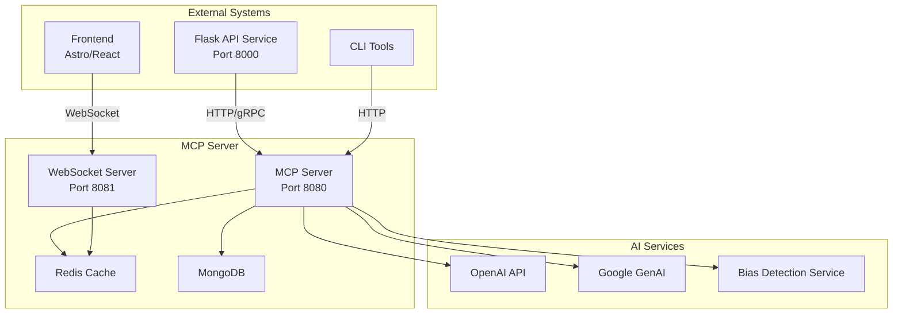
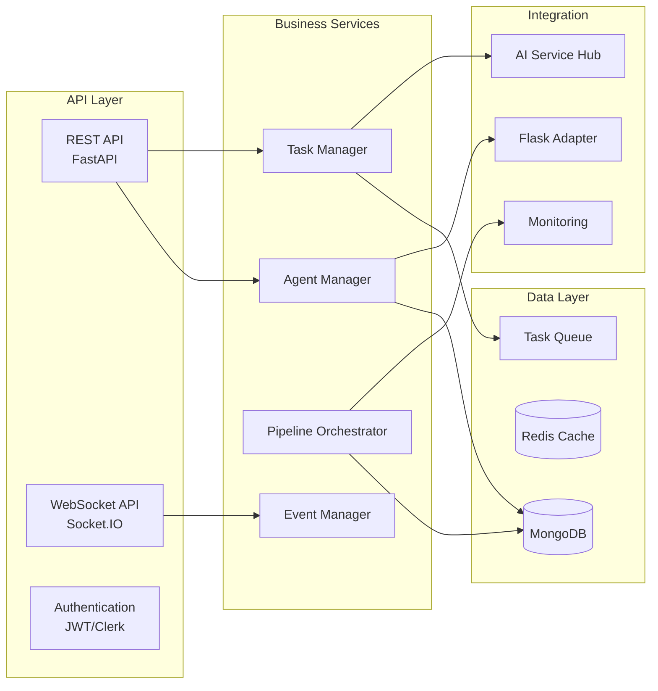

# MCP (Management Control Panel) Server Architecture

## Executive Summary

The MCP server provides agent registration, discovery, task delegation, and pipeline orchestration for the TechDeck-Python 6-stage pipeline integration. Built with FastAPI and WebSocket support, it follows the established project patterns from the Pixelated mental health platform while ensuring HIPAA compliance and security standards.

## Architecture Overview

### System Context



### Service Boundaries

The MCP server is organized into distinct service layers:

1. **API Layer**: RESTful endpoints and WebSocket connections
2. **Business Logic Layer**: Agent management, task orchestration, pipeline coordination
3. **Data Access Layer**: MongoDB for persistent storage, Redis for caching
4. **Integration Layer**: External service connections and adapters

## Component Architecture

### Core Components



## API Design

### RESTful Endpoints

#### Agent Management
- `POST /api/v1/agents/register` - Register new agent
- `GET /api/v1/agents` - List all agents
- `GET /api/v1/agents/{agent_id}` - Get agent details
- `PUT /api/v1/agents/{agent_id}` - Update agent
- `DELETE /api/v1/agents/{agent_id}` - Unregister agent
- `POST /api/v1/agents/{agent_id}/heartbeat` - Agent health check

#### Task Management
- `POST /api/v1/tasks` - Create new task
- `GET /api/v1/tasks` - List tasks with filtering
- `GET /api/v1/tasks/{task_id}` - Get task details
- `PUT /api/v1/tasks/{task_id}` - Update task
- `POST /api/v1/tasks/{task_id}/delegate` - Delegate task to agent
- `POST /api/v1/tasks/{task_id}/complete` - Mark task complete

#### Pipeline Orchestration
- `POST /api/v1/pipelines` - Create pipeline instance
- `GET /api/v1/pipelines/{pipeline_id}` - Get pipeline status
- `POST /api/v1/pipelines/{pipeline_id}/stages/{stage}/execute` - Execute stage
- `GET /api/v1/pipelines/{pipeline_id}/progress` - Get progress tracking

#### Discovery & Health
- `GET /api/v1/health` - Service health check
- `GET /api/v1/discovery/services` - Discover available services
- `GET /api/v1/discovery/agents` - Discover available agents

### WebSocket Events

#### Agent Communication
```typescript
// Agent registration
interface AgentRegisterEvent {
  type: 'agent:register'
  payload: {
    agentId: string
    agentType: 'bias-detector' | 'emotion-analyzer' | 'therapist'
    capabilities: string[]
    metadata: Record<string, unknown>
  }
}

// Task delegation
interface TaskDelegateEvent {
  type: 'task:delegate'
  payload: {
    taskId: string
    agentId: string
    taskType: string
    parameters: Record<string, unknown>
    deadline?: string
  }
}

// Progress updates
interface ProgressUpdateEvent {
  type: 'progress:update'
  payload: {
    taskId: string
    pipelineId: string
    stage: number
    progress: number
    status: 'pending' | 'running' | 'completed' | 'failed'
    message?: string
  }
}
```

## Database Schema

### MongoDB Collections

#### Agents Collection
```javascript
{
  _id: ObjectId,
  agent_id: String, // Unique identifier
  name: String,
  type: String, // 'bias-detector', 'emotion-analyzer', 'therapist'
  capabilities: [String],
  status: 'active' | 'inactive' | 'busy' | 'error',
  last_heartbeat: Date,
  registered_at: Date,
  metadata: Object,
  auth_token: String, // Hashed
  permissions: [String],
  version: String,
  endpoint_url: String,
  health_check_url: String
}
```

#### Tasks Collection
```javascript
{
  _id: ObjectId,
  task_id: String, // Unique identifier
  pipeline_id: String, // Reference to pipeline
  stage: Number, // 1-6 for 6-stage pipeline
  task_type: String,
  status: 'pending' | 'assigned' | 'running' | 'completed' | 'failed' | 'retry',
  assigned_agent_id: String,
  parameters: Object,
  result: Object,
  error: Object,
  retry_count: Number,
  max_retries: Number,
  created_at: Date,
  updated_at: Date,
  started_at: Date,
  completed_at: Date,
  deadline: Date,
  priority: Number,
  dependencies: [String] // Task IDs
}
```

#### Pipelines Collection
```javascript
{
  _id: ObjectId,
  pipeline_id: String, // Unique identifier
  name: String,
  description: String,
  status: 'created' | 'running' | 'completed' | 'failed' | 'cancelled',
  stages: [{
    stage: Number,
    name: String,
    status: 'pending' | 'running' | 'completed' | 'failed',
    tasks: [String], // Task IDs
    dependencies: [Number], // Stage numbers
    started_at: Date,
    completed_at: Date
  }],
  input_data: Object,
  output_data: Object,
  metadata: Object,
  created_at: Date,
  updated_at: Date,
  started_at: Date,
  completed_at: Date,
  created_by: String,
  tags: [String]
}
```

### Redis Cache Structure

#### Agent Registry Cache
```
agents:active -> Set of active agent IDs
agents:capabilities:{capability} -> Set of agent IDs with capability
agents:status:{agent_id} -> Current status and metadata
```

#### Task Queue
```
tasks:pending -> List of pending task IDs
tasks:running -> List of running task IDs
tasks:assigned:{agent_id} -> List of tasks assigned to agent
```

#### Pipeline Progress
```
pipeline:{pipeline_id}:progress -> Current progress percentage
pipeline:{pipeline_id}:stage:{stage}:status -> Stage status
```

## Security Architecture

### Authentication & Authorization

#### Agent Authentication
```typescript
interface AgentAuthConfig {
  method: 'jwt' | 'api_key' | 'oauth2'
  jwtSecret: string
  apiKeyHeader: string
  tokenExpiration: string
  refreshTokenExpiration: string
}
```

#### Permission Model
```typescript
enum AgentPermission {
  TASK_EXECUTE = 'task:execute',
  TASK_READ = 'task:read',
  PIPELINE_CREATE = 'pipeline:create',
  PIPELINE_READ = 'pipeline:read',
  AGENT_REGISTER = 'agent:register',
  AGENT_READ = 'agent:read',
  SYSTEM_HEALTH = 'system:health'
}
```

### Security Measures

1. **JWT-based Authentication**: Secure token-based authentication for agents
2. **API Rate Limiting**: Prevent abuse with rate limiting per agent
3. **Input Validation**: Comprehensive input sanitization and validation
4. **Audit Logging**: All security events logged for compliance
5. **Encryption**: Sensitive data encrypted using FHE (Fully Homomorphic Encryption)
6. **Network Security**: TLS/SSL for all communications
7. **Secret Management**: Environment-based secret management

## Error Handling & Retry Strategy

### Error Classification

```typescript
enum ErrorType {
  NETWORK = 'network',
  TIMEOUT = 'timeout',
  VALIDATION = 'validation',
  AUTHENTICATION = 'authentication',
  AUTHORIZATION = 'authorization',
  BUSINESS_LOGIC = 'business_logic',
  EXTERNAL_SERVICE = 'external_service',
  SYSTEM = 'system'
}
```

### Retry Configuration

```typescript
interface RetryConfig {
  maxRetries: number
  initialDelay: number // milliseconds
  maxDelay: number // milliseconds
  backoffStrategy: 'linear' | 'exponential' | 'fixed'
  retryableErrors: ErrorType[]
}
```

### Circuit Breaker Pattern

```typescript
interface CircuitBreakerConfig {
  failureThreshold: number
  recoveryTimeout: number // milliseconds
  halfOpenMaxCalls: number
  successThreshold: number
}
```

## Integration Patterns

### Flask Service Integration

```typescript
interface FlaskServiceAdapter {
  baseUrl: string
  endpoints: {
    analyze: '/analyze'
    health: '/health'
  }
  timeout: number
  retryConfig: RetryConfig
  circuitBreaker: CircuitBreakerConfig
}
```

### AI Service Hub

```typescript
interface AIServiceHub {
  providers: {
    openai: OpenAIConfig
    google: GoogleAIConfig
    bias_detection: BiasDetectionConfig
  }
  fallbackStrategy: 'round_robin' | 'priority' | 'random'
  healthCheckInterval: number
}
```

## Monitoring & Logging

### Metrics Collection

```typescript
interface MCPMetrics {
  // Agent metrics
  activeAgents: Gauge
  taskCompletionRate: Histogram
  agentResponseTime: Histogram
  
  // Task metrics
  taskQueueSize: Gauge
  taskProcessingTime: Histogram
  taskFailureRate: Gauge
  
  // Pipeline metrics
  pipelineSuccessRate: Gauge
  stageCompletionTime: Histogram
  overallPipelineTime: Histogram
  
  // System metrics
  requestCount: Counter
  errorCount: Counter
  responseTime: Histogram
}
```

### Logging Structure

```typescript
interface LogEntry {
  timestamp: string
  level: 'debug' | 'info' | 'warn' | 'error' | 'critical'
  component: string
  message: string
  context: {
    requestId?: string
    agentId?: string
    taskId?: string
    pipelineId?: string
    userId?: string
    [key: string]: unknown
  }
  metadata?: Record<string, unknown>
}
```

### Health Checks

```typescript
interface HealthCheck {
  service: string
  status: 'healthy' | 'degraded' | 'unhealthy'
  timestamp: string
  checks: {
    database: HealthStatus
    redis: HealthStatus
    external_services: HealthStatus
    system_resources: HealthStatus
  }
}
```

## Deployment Architecture

### Container Architecture

```yaml
# docker-compose.mcp.yml
version: '3.8'
services:
  mcp-server:
    build: ./docker/mcp-server
    ports:
      - "8080:8080"
    environment:
      - MONGODB_URI=${MONGODB_URI}
      - REDIS_URL=${REDIS_URL}
      - JWT_SECRET=${JWT_SECRET}
      - FLASK_API_URL=${FLASK_API_URL}
    depends_on:
      - mongodb
      - redis
    healthcheck:
      test: ["CMD", "curl", "-f", "http://localhost:8080/health"]
      interval: 30s
      timeout: 10s
      retries: 3
  
  mcp-websocket:
    build: ./docker/mcp-websocket
    ports:
      - "8081:8081"
    environment:
      - REDIS_URL=${REDIS_URL}
      - JWT_SECRET=${JWT_SECRET}
    depends_on:
      - redis
```

### Scaling Strategy

1. **Horizontal Scaling**: Multiple MCP server instances behind load balancer
2. **Database Sharding**: MongoDB sharding for large-scale data
3. **Redis Clustering**: High availability and performance
4. **CDN Integration**: Static asset delivery optimization
5. **Auto-scaling**: Kubernetes HPA based on CPU/memory metrics

## Performance Considerations

### Optimization Strategies

1. **Connection Pooling**: Database and Redis connection pools
2. **Caching Strategy**: Multi-level caching (Redis, in-memory)
3. **Async Processing**: Background job processing for heavy tasks
4. **Batch Operations**: Bulk database operations
5. **Index Optimization**: Proper database indexing
6. **Query Optimization**: Efficient MongoDB queries with projections

### Performance Targets

- API Response Time: < 200ms for 95th percentile
- WebSocket Latency: < 50ms for real-time events
- Task Processing: < 5 seconds for standard tasks
- Pipeline Completion: < 30 seconds for 6-stage pipeline
- Concurrent Agents: Support for 1000+ active agents
- Task Throughput: 10,000+ tasks per minute

## Security Compliance

### HIPAA Compliance

1. **Data Encryption**: FHE for sensitive mental health data
2. **Access Controls**: Role-based access control (RBAC)
3. **Audit Trails**: Comprehensive logging of all data access
4. **Data Retention**: Configurable data retention policies
5. **Breach Detection**: Real-time security monitoring
6. **Incident Response**: Automated incident response procedures

### Data Privacy

1. **Data Minimization**: Only collect necessary data
2. **Purpose Limitation**: Use data only for specified purposes
3. **Consent Management**: User consent tracking and management
4. **Right to Deletion**: Data deletion capabilities
5. **Data Portability**: Export user data on request

## Testing Strategy

### Test Coverage

1. **Unit Tests**: 80%+ code coverage
2. **Integration Tests**: API and database integration
3. **End-to-End Tests**: Full pipeline testing
4. **Performance Tests**: Load and stress testing
5. **Security Tests**: Vulnerability scanning and penetration testing

### Test Environments

1. **Development**: Local development with mock services
2. **Staging**: Production-like environment with test data
3. **Production**: Live environment with monitoring

## Maintenance & Operations

### Operational Procedures

1. **Deployment**: Automated CI/CD pipeline
2. **Monitoring**: 24/7 system monitoring and alerting
3. **Backup**: Regular database backups and disaster recovery
4. **Updates**: Rolling updates with zero downtime
5. **Scaling**: Auto-scaling based on demand
6. **Incident Response**: Defined incident response procedures

### Maintenance Tasks

1. **Database Maintenance**: Index optimization, cleanup
2. **Cache Management**: Redis memory management
3. **Log Rotation**: Automated log cleanup and archiving
4. **Security Updates**: Regular security patch management
5. **Performance Tuning**: Continuous performance optimization

## Conclusion

The MCP server architecture provides a robust, scalable, and secure foundation for managing AI agents and orchestrating the 6-stage TechDeck-Python pipeline. By following established patterns from the Pixelated platform and incorporating modern architectural principles, the system ensures reliability, performance, and maintainability while maintaining HIPAA compliance and security standards.

The modular design allows for easy extension and modification as requirements evolve, while the comprehensive monitoring and error handling ensures high availability and reliability in production environments.