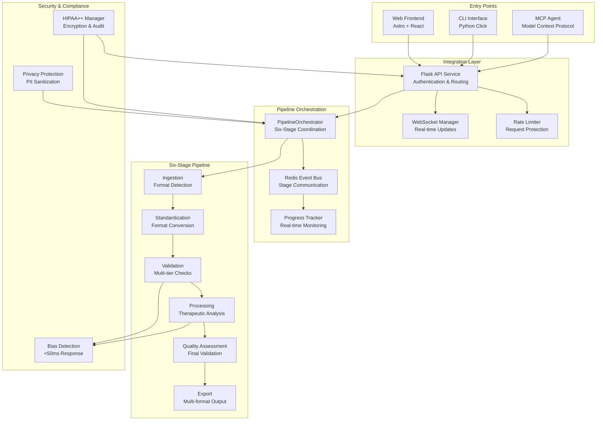
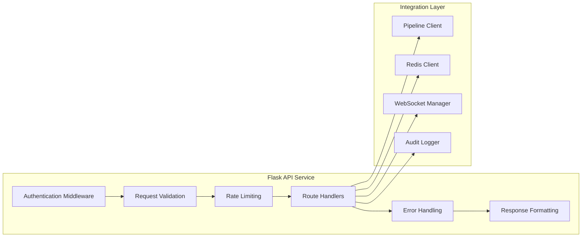
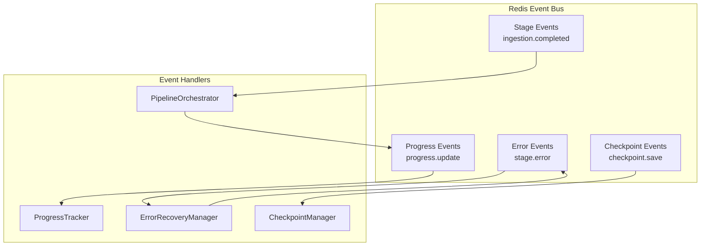
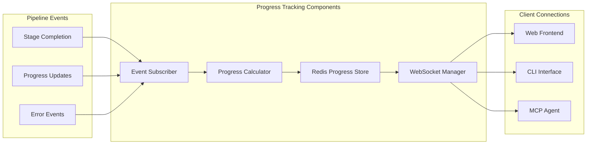
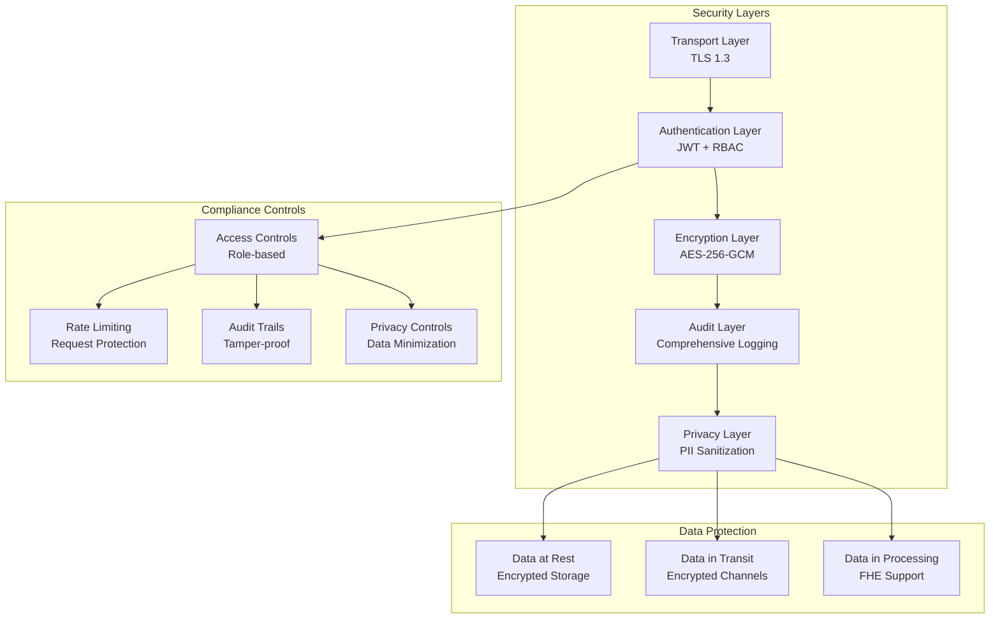
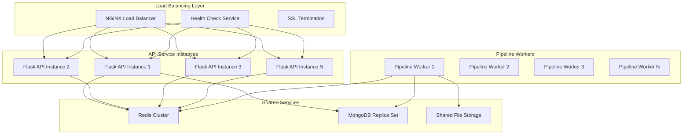
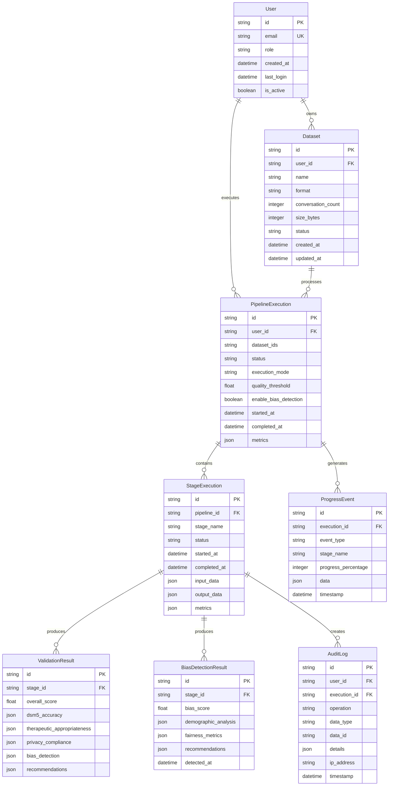

# 🏗️ TechDeck-Python Pipeline Integration Architecture

## Executive Summary

This document presents a comprehensive system architecture for integrating TechDeck React frontend with Python dataset pipeline, providing three robust entry points (Web Frontend, CLI Interface, MCP Connection) while maintaining HIPAA++ compliance and sub-50ms performance targets.

## 🎯 Architecture Overview

### System Context


## 🏗️ Service Architecture

### 1. Flask API Service Architecture

#### Core Components


#### Authentication Middleware Design
```python
class AuthenticationMiddleware:
    """JWT-based authentication with role-based access control"""
    
    def __init__(self, secret_key: str, algorithm: str = "HS256"):
        self.secret_key = secret_key
        self.algorithm = algorithm
        self.rate_limiter = RateLimiter()
    
    def authenticate_request(self, request: Request) -> UserContext:
        """Validate JWT token and extract user context"""
        # Extract Bearer token from Authorization header
        auth_header = request.headers.get("Authorization", "")
        if not auth_header.startswith("Bearer "):
            raise AuthenticationError("Missing or invalid authorization header")
        
        token = auth_header.split(" ")[1]
        
        # Verify token signature and expiration
        try:
            payload = jwt.decode(token, self.secret_key, algorithms=[self.algorithm])
        except jwt.ExpiredSignatureError:
            raise AuthenticationError("Token has expired")
        except jwt.InvalidTokenError:
            raise AuthenticationError("Invalid token")
        
        # Validate user exists and is active
        user = self.get_user_by_id(payload["user_id"])
        if not user or not user.is_active:
            raise AuthenticationError("User not found or inactive")
        
        # Apply rate limiting
        if not self.rate_limiter.check_rate_limit(user.id, request.path):
            raise RateLimitExceededError("Too many requests")
        
        return UserContext(
            user_id=user.id,
            role=user.role,
            permissions=user.permissions,
            session_id=payload.get("session_id")
        )
```

#### API Route Structure
```python
# Dataset Management Routes
@app.route('/api/v1/datasets', methods=['POST'])
@authenticate
@validate_request(DatasetUploadSchema)
def upload_dataset():
    """Handle dataset file upload with progress tracking"""
    pass

@app.route('/api/v1/datasets/<dataset_id>', methods=['GET'])
@authenticate
def get_dataset(dataset_id: str):
    """Retrieve dataset metadata and status"""
    pass

# Pipeline Execution Routes
@app.route('/api/v1/pipeline/execute', methods=['POST'])
@authenticate
@validate_request(PipelineExecutionSchema)
def execute_pipeline():
    """Trigger six-stage pipeline execution"""
    pass

@app.route('/api/v1/pipeline/<execution_id>/progress', methods=['GET'])
@authenticate
def get_pipeline_progress(execution_id: str):
    """Get real-time pipeline execution progress"""
    pass

# Validation Routes
@app.route('/api/v1/validation/<dataset_id>', methods=['POST'])
@authenticate
def validate_dataset(dataset_id: str):
    """Perform multi-tier validation with bias detection"""
    pass
```

### 2. Six-Stage Pipeline Communication Architecture

#### Redis Event Bus Design


#### Stage Communication Flow
```python
class PipelineOrchestrator:
    """Coordinate six-stage pipeline execution with event-driven communication"""
    
    def __init__(self, redis_client: RedisClient, event_bus: EventBus):
        self.redis = redis_client
        self.event_bus = event_bus
        self.stage_executors = {
            'ingestion': IngestionStage(),
            'standardization': StandardizationStage(),
            'validation': ValidationStage(),
            'processing': ProcessingStage(),
            'quality': QualityStage(),
            'export': ExportStage()
        }
    
    def execute_pipeline(self, dataset_ids: List[str], context: PipelineContext) -> PipelineResult:
        """Execute complete six-stage pipeline with error recovery"""
        execution_id = generate_uuid()
        
        try:
            # Stage 1: Ingestion
            ingestion_result = self.execute_stage('ingestion', dataset_ids, context)
            
            # Stage 2: Standardization
            standardization_result = self.execute_stage('standardization', ingestion_result, context)
            
            # Stage 3: Validation (includes bias detection)
            validation_result = self.execute_stage('validation', standardization_result, context)
            
            # Stage 4: Processing
            processing_result = self.execute_stage('processing', validation_result, context)
            
            # Stage 5: Quality Assessment
            quality_result = self.execute_stage('quality', processing_result, context)
            
            # Stage 6: Export
            export_result = self.execute_stage('export', quality_result, context)
            
            return PipelineResult(
                execution_id=execution_id,
                status='completed',
                results=export_result,
                metrics=self.calculate_metrics(context)
            )
            
        except Exception as error:
            return self.handle_pipeline_failure(error, context, execution_id)
    
    def execute_stage(self, stage_name: str, input_data: Any, context: PipelineContext) -> Any:
        """Execute individual stage with comprehensive error handling"""
        try:
            # Update progress tracking
            self.update_progress(context.execution_id, stage_name, 'started')
            
            # Load checkpoint if resuming
            if context.resume_from_checkpoint:
                input_data = self.checkpoint_manager.load(stage_name, context.execution_id)
            
            # Execute stage-specific logic
            stage_executor = self.stage_executors[stage_name]
            result = stage_executor.execute(input_data, context)
            
            # Validate stage output
            self.validate_stage_output(stage_name, result)
            
            # Save checkpoint for recovery
            self.checkpoint_manager.save(stage_name, context.execution_id, result)
            
            # Publish completion event
            self.event_bus.publish(f"{stage_name}.completed", {
                'execution_id': context.execution_id,
                'stage': stage_name,
                'result': result
            })
            
            # Update progress
            self.update_progress(context.execution_id, stage_name, 'completed')
            
            return result
            
        except Exception as error:
            return self.handle_stage_failure(stage_name, error, context)
```

### 3. WebSocket Progress Tracking Architecture

#### Real-time Progress System


#### Progress Tracking Implementation
```python
class RealTimeProgressTracker:
    """Track pipeline execution progress with WebSocket notifications"""
    
    def __init__(self, redis_client: RedisClient, websocket_manager: WebSocketManager):
        self.redis = redis_client
        self.websocket = websocket_manager
        self.event_bus = EventBus()
        
        # Subscribe to pipeline events
        self.event_bus.subscribe('*.progress', self.handle_progress_update)
        self.event_bus.subscribe('*.completed', self.handle_stage_completion)
        self.event_bus.subscribe('*.error', self.handle_stage_error)
    
    def create_tracker(self, execution_id: str, dataset_ids: List[str]) -> str:
        """Initialize progress tracker for pipeline execution"""
        tracker = {
            'execution_id': execution_id,
            'type': 'pipeline_execution',
            'status': 'initializing',
            'progress': 0,
            'current_stage': 'initialization',
            'total_stages': 6,
            'completed_stages': [],
            'stage_progress': {},
            'dataset_ids': dataset_ids,
            'start_time': datetime.utcnow().isoformat(),
            'estimated_completion': None,
            'subscribers': []
        }
        
        # Store in Redis with 24-hour TTL
        redis_key = f"progress:pipeline:{execution_id}"
        self.redis.setex(redis_key, 86400, json.dumps(tracker))
        
        # Notify WebSocket subscribers
        self.websocket.broadcast(execution_id, {
            'type': 'progress_initialized',
            'data': tracker
        })
        
        return execution_id
    
    def update_progress(self, execution_id: str, update_data: Dict[str, Any]) -> bool:
        """Update progress and notify subscribers"""
        try:
            # Retrieve current progress
            tracker = self.get_tracker(execution_id)
            if not tracker:
                return False
            
            # Merge update data
            tracker.update(update_data)
            tracker['last_updated'] = datetime.utcnow().isoformat()
            
            # Recalculate progress percentage
            tracker['progress'] = self.calculate_progress_percentage(tracker)
            
            # Update estimated completion
            tracker['estimated_completion'] = self.calculate_estimated_completion(tracker)
            
            # Store updated progress
            redis_key = f"progress:pipeline:{execution_id}"
            self.redis.setex(redis_key, 86400, json.dumps(tracker))
            
            # Broadcast to WebSocket subscribers
            self.websocket.broadcast(execution_id, {
                'type': 'progress_update',
                'data': tracker
            })
            
            return True
            
        except Exception as error:
            logger.error(f"Failed to update progress for {execution_id}: {error}")
            return False
    
    def calculate_progress_percentage(self, tracker: Dict[str, Any]) -> int:
        """Calculate progress percentage based on stage completion"""
        completed_stages = len(tracker['completed_stages'])
        total_stages = tracker['total_stages']
        
        # Base progress on stage completion (16.67% per stage)
        base_progress = (completed_stages / total_stages) * 100
        
        # Adjust for current stage progress
        current_stage = tracker.get('current_stage')
        if current_stage and current_stage != 'completed':
            stage_progress = tracker['stage_progress'].get(current_stage, 0)
            base_progress += (stage_progress / total_stages)
        
        return min(100, int(base_progress))
```

### 4. Security Architecture for HIPAA++ Compliance

#### Multi-layer Security Design


#### HIPAA++ Compliance Manager
```python
class HIPAAComplianceManager:
    """Manage HIPAA++ compliance with encryption and audit trails"""
    
    def __init__(self, encryption_key: str, audit_logger: AuditLogger):
        self.encryption_key = encryption_key
        self.audit_logger = audit_logger
        self.cipher = AESGCM(encryption_key)
    
    def encrypt_data(self, data: Any, data_type: str) -> EncryptedData:
        """Encrypt sensitive data with AES-256-GCM"""
        # Serialize data
        serialized_data = json.dumps(data).encode('utf-8')
        
        # Generate nonce
        nonce = os.urandom(12)
        
        # Encrypt data
        ciphertext = self.cipher.encrypt(nonce, serialized_data, None)
        
        # Create encrypted data package
        encrypted_data = EncryptedData(
            ciphertext=ciphertext,
            nonce=nonce,
            algorithm='AES-256-GCM',
            data_type=data_type,
            encrypted_at=datetime.utcnow()
        )
        
        # Audit encryption operation
        self.audit_logger.log_data_operation(
            operation='encrypt',
            data_type=data_type,
            data_size=len(serialized_data),
            encryption_method='AES-256-GCM'
        )
        
        return encrypted_data
    
    def decrypt_data(self, encrypted_data: EncryptedData) -> Any:
        """Decrypt data and verify integrity"""
        try:
            # Decrypt data
            plaintext = self.cipher.decrypt(
                encrypted_data.nonce,
                encrypted_data.ciphertext,
                None
            )
            
            # Deserialize data
            data = json.loads(plaintext.decode('utf-8'))
            
            # Audit decryption operation
            self.audit_logger.log_data_operation(
                operation='decrypt',
                data_type=encrypted_data.data_type,
                data_size=len(plaintext),
                encryption_method=encrypted_data.algorithm
            )
            
            return data
            
        except Exception as error:
            raise DecryptionError(f"Failed to decrypt data: {error}")
    
    def sanitize_dataset(self, dataset: Dataset) -> Dataset:
        """Remove PII and PHI from datasets"""
        sanitized = dataset.copy()
        
        # Define PII patterns
        pii_patterns = [
            r'\b[A-Za-z0-9._%+-]+@[A-Za-z0-9.-]+\.[A-Z|a-z]{2,}\b',  # Email
            r'\b\d{3}[-.]?\d{3}[-.]?\d{4}\b',  # Phone
            r'\b\d{3}-\d{2}-\d{4}\b',  # SSN
            r'\b\d{1,3}\.\d{1,3}\.\d{1,3}\.\d{1,3}\b'  # IP
        ]
        
        # Remove PII using regex patterns
        for pattern in pii_patterns:
            sanitized.content = re.sub(pattern, '[REDACTED]', sanitized.content)
        
        # Detect and flag PHI indicators
        phi_indicators = ['patient', 'diagnosis', 'treatment', 'medical record']
        for indicator in phi_indicators:
            if indicator in sanitized.content.lower():
                self.flag_phi_content(sanitized, indicator)
        
        # Audit sanitization operation
        self.audit_logger.log_privacy_operation(
            operation='sanitize',
            dataset_id=dataset.id,
            pii_detected=len(re.findall('|'.join(pii_patterns), dataset.content))
        )
        
        return sanitized
```

### 5. Scalability and Load Balancing Architecture

#### Horizontal Scaling Design


#### Auto-scaling Configuration
```python
class ScalabilityManager:
    """Manage horizontal scaling with auto-scaling capabilities"""
    
    def __init__(self, metrics_client: MetricsClient):
        self.metrics = metrics_client
        self.scaling_config = {
            'min_instances': 2,
            'max_instances': 10,
            'scale_up_threshold': 80,  # CPU%
            'scale_down_threshold': 20,  # CPU%
            'cooldown_period': 300,  # 5 minutes
            'health_check_interval': 30
        }
    
    def monitor_and_scale(self):
        """Monitor system metrics and trigger scaling decisions"""
        current_metrics = self.metrics.get_system_metrics()
        
        # Calculate average CPU usage across all instances
        avg_cpu_usage = current_metrics['avg_cpu_usage']
        current_instances = current_metrics['active_instances']
        
        # Scale up decision
        if (avg_cpu_usage > self.scaling_config['scale_up_threshold'] and 
            current_instances < self.scaling_config['max_instances']):
            
            if self.can_scale_up(current_metrics):
                self.scale_up(current_instances + 1)
        
        # Scale down decision
        elif (avg_cpu_usage < self.scaling_config['scale_down_threshold'] and 
              current_instances > self.scaling_config['min_instances']):
            
            if self.can_scale_down(current_metrics):
                self.scale_down(current_instances - 1)
    
    def configure_database_pool(self) -> Dict[str, Any]:
        """Configure database connection pooling for scalability"""
        return {
            'pool_size': 20,
            'max_overflow': 40,
            'pool_timeout': 30,
            'pool_recycle': 3600,
            'pool_pre_ping': True,
            'echo': False
        }
    
    def configure_redis_cluster(self) -> Dict[str, Any]:
        """Configure Redis clustering for high availability"""
        return {
            'cluster_enabled': True,
            'node_count': 3,
            'replication_factor': 2,
            'failover_timeout': 5000,
            'cluster_retry_delay': 100,
            'cluster_retry_max_delay': 5000
        }
```

### 6. Error Handling and Recovery Architecture

#### Comprehensive Error Strategy
```python
class ErrorRecoveryManager:
    """Handle errors with retry logic and graceful degradation"""
    
    def __init__(self, max_retries: int = 3, backoff_multiplier: int = 2):
        self.max_retries = max_retries
        self.backoff_multiplier = backoff_multiplier
        self.circuit_breaker = CircuitBreaker()
    
    def handle_error(self, error: Exception, context: Dict[str, Any]) -> ErrorResponse:
        """Handle errors with appropriate recovery strategies"""
        error_type = type(error).__name__
        
        # Map error types to handling strategies
        error_strategies = {
            'ValidationError': self.handle_validation_error,
            'ProcessingError': self.handle_processing_error,
            'ResourceError': self.handle_resource_error,
            'PrivacyViolationError': self.handle_privacy_error,
            'RateLimitExceededError': self.handle_rate_limit_error,
            'AuthenticationError': self.handle_authentication_error
        }
        
        handler = error_strategies.get(error_type, self.handle_unknown_error)
        return handler(error, context)
    
    def handle_processing_error(self, error: Exception, context: Dict[str, Any]) -> ErrorResponse:
        """Handle processing errors with retry logic"""
        retry_count = context.get('retry_count', 0)
        
        # Check circuit breaker status
        if self.circuit_breaker.is_open():
            return ErrorResponse(
                success=False,
                error_code='CIRCUIT_BREAKER_OPEN',
                message='Service temporarily unavailable',
                user_message='Please try again in a few moments',
                recoverable=False
            )
        
        # Attempt retry if within limits
        if retry_count < self.max_retries:
            retry_count += 1
            wait_time = self.backoff_multiplier ** retry_count
            
            return ErrorResponse(
                success=False,
                error_code='PROCESSING_ERROR_RETRY',
                message=str(error),
                user_message='Processing failed, retrying...',
                recoverable=True,
                retry_after=wait_time,
                retry_count=retry_count
            )
        
        # Max retries exhausted
        self.circuit_breaker.record_failure()
        return ErrorResponse(
            success=False,
            error_code='PROCESSING_ERROR_FINAL',
            message=str(error),
            user_message='Processing failed after multiple attempts. Please try again later.',
            recoverable=False
        )
    
    def handle_resource_error(self, error: Exception, context: Dict[str, Any]) -> ErrorResponse:
        """Handle resource exhaustion with graceful degradation"""
        # Check if partial processing is possible
        if self.can_process_partial_data(context):
            return ErrorResponse(
                success=False,
                error_code='PARTIAL_PROCESSING',
                message=str(error),
                user_message='Processing partial dataset due to resource constraints.',
                recoverable=True,
                partial_result=True,
                processed_percentage=75
            )
        
        # Queue for later processing
        if self.queue_for_later_processing(context):
            return ErrorResponse(
                success=False,
                error_code='QUEUED_FOR_PROCESSING',
                message=str(error),
                user_message='Dataset queued for processing when resources become available.',
                recoverable=True,
                estimated_wait=self.calculate_queue_wait_time()
            )
        
        return ErrorResponse(
            success=False,
            error_code='RESOURCE_UNAVAILABLE',
            message=str(error),
            user_message='System resources temporarily unavailable. Please try again later.',
            recoverable=True
        )
```

### 7. Database Schema Design

#### Core Entity Relationships


### 8. Performance Optimization Strategy

#### Caching Architecture
```python
class CachingManager:
    """Manage multi-layer caching for optimal performance"""
    
    def __init__(self, redis_client: RedisClient):
        self.redis = redis_client
        self.cache_strategies = {
            'stage_results': CacheConfig(ttl=3600, max_size=1000),  # 1 hour
            'validation_results': CacheConfig(ttl=7200, max_size=500),  # 2 hours
            'format_conversion': CacheConfig(ttl=86400, max_size=200),  # 24 hours
            'bias_detection': CacheConfig(ttl=1800, max_size=1000),  # 30 minutes
            'user_sessions': CacheConfig(ttl=3600, max_size=10000)  # 1 hour
        }
    
    def get_cached_stage_result(self, stage_name: str, dataset_id: str, context: PipelineContext) -> Optional[Any]:
        """Retrieve cached stage result if available"""
        cache_key = f"cache:stage:{stage_name}:{dataset_id}:{hash_context(context)}"
        
        cached_data = self.redis.get(cache_key)
        if cached_data:
            logger.info(f"Cache hit for stage {stage_name}, dataset {dataset_id}")
            return json.loads(cached_data)
        
        return None
    
    def cache_stage_result(self, stage_name: str, dataset_id: str, context: PipelineContext, result: Any) -> None:
        """Cache stage result for future use"""
        cache_key = f"cache:stage:{stage_name}:{dataset_id}:{hash_context(context)}"
        cache_config = self.cache_strategies['stage_results']
        
        # Serialize and cache result
        serialized_result = json.dumps(result, default=str)
        self.redis.setex(cache_key, cache_config.ttl, serialized_result)
        
        logger.info(f"Cached result for stage {stage_name}, dataset {dataset_id}")
    
    def invalidate_related_caches(self, dataset_id: str) -> None:
        """Invalidate all caches related to a dataset"""
        cache_patterns = [
            f"cache:stage:*:{dataset_id}:*",
            f"cache:validation:*:{dataset_id}:*",
            f"cache:conversion:*:{dataset_id}:*",
            f"cache:bias:*:{dataset_id}:*"
        ]
        
        for pattern in cache_patterns:
            keys = self.redis.keys(pattern)
            if keys:
                self.redis.delete(*keys)
                logger.info(f"Invalidated {len(keys)} cache entries for pattern {pattern}")
```

### 9. Deployment Architecture

#### Container-Based Deployment
```yaml
# docker-compose.yml for development
version: '3.8'

services:
  flask-api:
    build: ./docker/flask-api
    ports:
      - "5000:5000"
    environment:
      - REDIS_URL=redis://redis:6379
      - MONGODB_URI=mongodb://mongo:27017/techdeck
      - JWT_SECRET_KEY=${JWT_SECRET_KEY}
    depends_on:
      - redis
      - mongo
    volumes:
      - ./app:/app
      - shared-storage:/app/uploads
    
  pipeline-worker:
    build: ./docker/pipeline-worker
    environment:
      - REDIS_URL=redis://redis:6379
      - MONGODB_URI=mongodb://mongo:27017/techdeck
    depends_on:
      - redis
      - mongo
    volumes:
      - ./ai:/app/ai
      - shared-storage:/app/uploads
    deploy:
      replicas: 3
    
  redis:
    image: redis:7-alpine
    ports:
      - "6379:6379"
    volumes:
      - redis-data:/data
    command: redis-server --appendonly yes
    
  mongo:
    image: mongo:6
    ports:
      - "27017:27017"
    volumes:
      - mongo-data:/data/db
    environment:
      - MONGO_INITDB_ROOT_USERNAME=admin
      - MONGO_INITDB_ROOT_PASSWORD=${MONGO_PASSWORD}
    
  nginx:
    image: nginx:alpine
    ports:
      - "80:80"
      - "443:443"
    volumes:
      - ./nginx/nginx.conf:/etc/nginx/nginx.conf
      - ./nginx/ssl:/etc/nginx/ssl
    depends_on:
      - flask-api

volumes:
  redis-data:
  mongo-data:
  shared-storage:
```

#### Production Kubernetes Deployment
```yaml
# k8s/deployment.yaml
apiVersion: apps/v1
kind: Deployment
metadata:
  name: techdeck-flask-api
  namespace: techdeck
spec:
  replicas: 3
  selector:
    matchLabels:
      app: techdeck-flask-api
  template:
    metadata:
      labels:
        app: techdeck-flask-api
    spec:
      containers:
      - name: flask-api
        image: techdeck/flask-api:latest
        ports:
        - containerPort: 5000
        env:
        - name: REDIS_URL
          value: "redis://redis-cluster:6379"
        - name: MONGODB_URI
          value: "mongodb://mongo-replica:27017/techdeck"
        resources:
          requests:
            memory: "512Mi"
            cpu: "250m"
          limits:
            memory: "1Gi"
            cpu: "500m"
        livenessProbe:
          httpGet:
            path: /api/v1/health
            port: 5000
          initialDelaySeconds: 30
          periodSeconds: 10
        readinessProbe:
          httpGet:
            path: /api/v1/ready
            port: 5000
          initialDelaySeconds: 5
          periodSeconds: 5

---
apiVersion: v1
kind: Service
metadata:
  name: techdeck-flask-api-service
  namespace: techdeck
spec:
  selector:
    app: techdeck-flask-api
  ports:
  - protocol: TCP
    port: 80
    targetPort: 5000
  type: ClusterIP

---
apiVersion: autoscaling/v2
kind: HorizontalPodAutoscaler
metadata:
  name: techdeck-flask-api-hpa
  namespace: techdeck
spec:
  scaleTargetRef:
    apiVersion: apps/v1
    kind: Deployment
    name: techdeck-flask-api
  minReplicas: 2
  maxReplicas: 10
  metrics:
  - type: Resource
    resource:
      name: cpu
      target:
        type: Utilization
        averageUtilization: 70
  - type: Resource
    resource:
      name: memory
      target:
        type: Utilization
        averageUtilization: 80
```

## 🔒 Security Considerations

### Data Protection
- **Encryption at Rest**: All sensitive data encrypted with AES-256-GCM
- **Encryption in Transit**: TLS 1.3 for all communications
- **Key Management**: Secure key rotation and storage
- **Data Minimization**: Only collect necessary data for processing

### Access Control
- **Role-Based Access Control (RBAC)**: User, Admin, Moderator roles
- **JWT Authentication**: Secure token-based authentication
- **Rate Limiting**: Protect against abuse and DoS attacks
- **Session Management**: Secure session handling with timeout

### Audit and Compliance
- **Comprehensive Audit Logging**: All data access and operations logged
- **Tamper-Proof Logs**: Cryptographic integrity protection
- **Privacy Compliance**: HIPAA++ standards with zero-knowledge architecture
- **Regular Security Assessments**: Automated vulnerability scanning

## 📊 Performance Targets

### Response Time Requirements
- **API Response Time**: ≤ 2 seconds for 95% of requests
- **Bias Detection**: <50ms per conversation
- **File Upload**: 10MB within 30 seconds
- **WebSocket Updates**: ≤ 1 second latency
- **Pipeline Throughput**: 100+ conversations/second

### Scalability Requirements
- **Concurrent Users**: 100+ simultaneous users
- **Horizontal Scaling**: Auto-scaling from 2-10 instances
- **Database Connections**: 20+ connection pool
- **Redis Clustering**: 3-node cluster with replication
- **Load Balancing**: Round-robin with health checks

### Reliability Requirements
- **Uptime**: 99.9% availability
- **Error Rate**: <1% for standard operations
- **Data Loss**: Zero tolerance for data loss
- **Recovery Time**: <5 minutes for service recovery
- **Backup Frequency**: Hourly incremental backups

## 🧪 Testing Strategy

### Test Coverage Requirements
- **Unit Test Coverage**: ≥ 80% for critical paths
- **Integration Tests**: All API endpoints tested
- **End-to-End Tests**: Complete user workflows validated
- **Performance Tests**: Load testing for all operations
- **Security Tests**: Vulnerability scanning and penetration testing

### Key Test Scenarios
- File upload with various formats and sizes
- Pipeline execution with different modes and datasets
- Error handling and recovery mechanisms
- Rate limiting and authentication
- Progress tracking across all channels
- Bias detection accuracy and performance
- WebSocket connection management
- CLI command execution and error handling
- MCP agent interaction scenarios

## 📚 Conclusion

This comprehensive architecture design provides a robust, scalable, and secure foundation for integrating TechDeck React frontend with Python dataset pipeline. The design emphasizes:

- **Modularity**: Clear separation of concerns with well-defined interfaces
- **Performance**: Sub-50ms response times with comprehensive optimization
- **Security**: HIPAA++ compliance with zero-knowledge architecture
- **Reliability**: Comprehensive error handling and recovery mechanisms
- **User Experience**: Intuitive interfaces across all three entry points
- **Testability**: Extensive testing strategy with TDD anchors

The architecture supports horizontal scaling, maintains high availability, and provides real-time progress tracking while ensuring data privacy and regulatory compliance throughout all system operations.