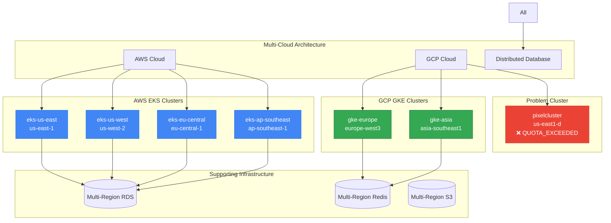
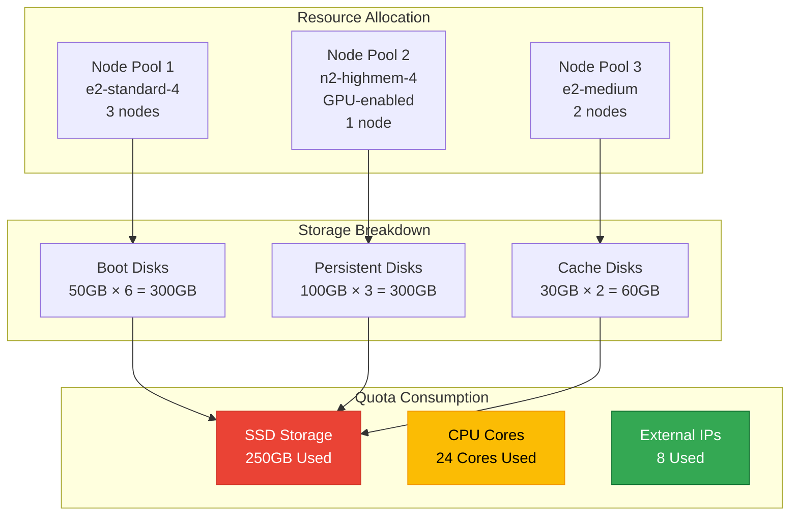
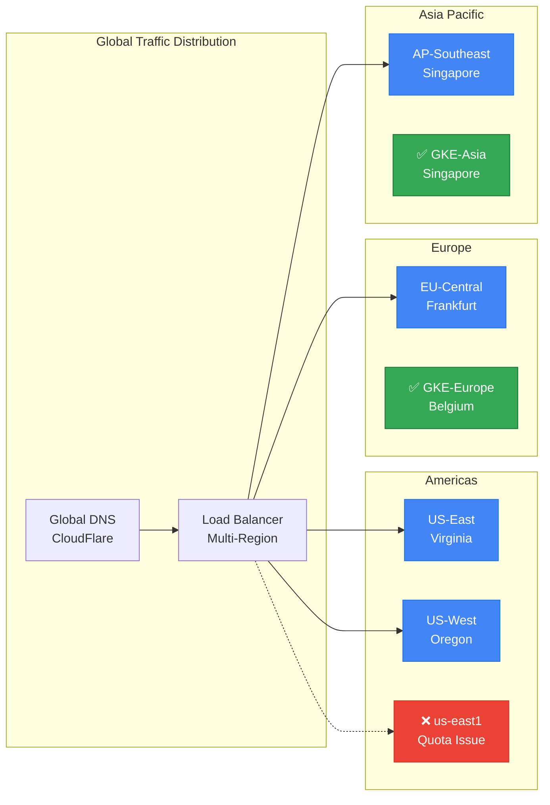
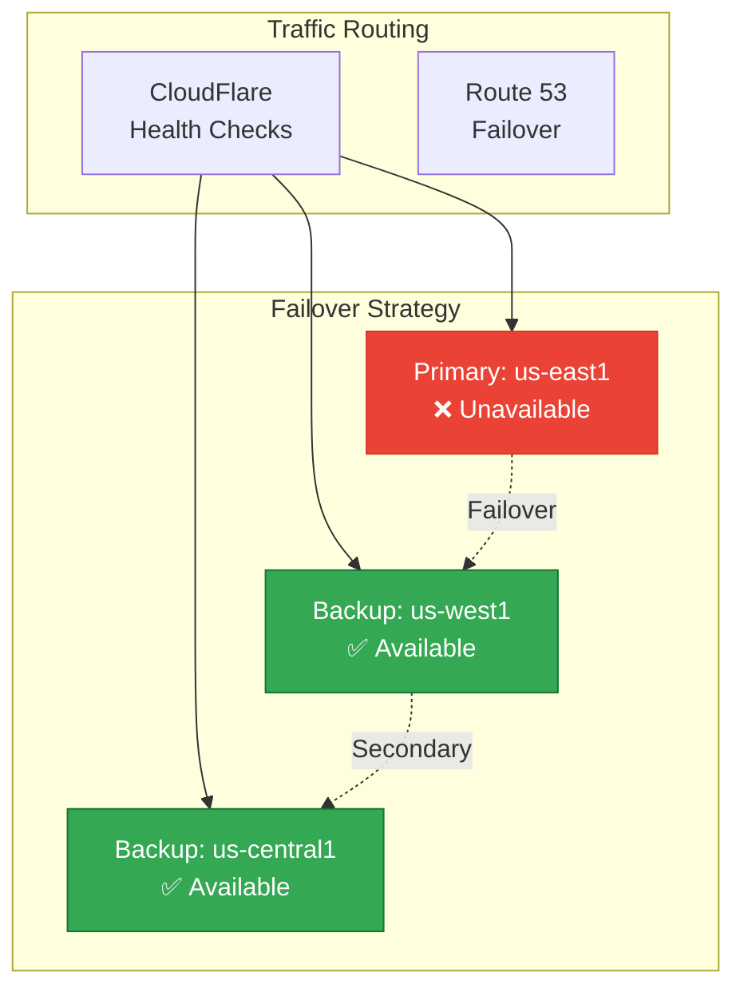

# Cluster Inventory Analysis - Pixelated Empathy Infrastructure

## Current Cluster Configuration

Based on the Terraform infrastructure analysis, you have **7 active clusters** across multiple regions and cloud providers:

### AWS EKS Clusters (4 clusters)
1. **pixelated-empathy-eks-us-east** - US East (N. Virginia)
2. **pixelated-empathy-eks-us-west** - US West (Oregon) 
3. **pixelated-empathy-eks-eu-central** - EU Central (Frankfurt)
4. **pixelated-empathy-eks-ap-southeast** - Asia Pacific (Singapore)

### GCP GKE Clusters (2 clusters)
5. **pixelated-empathy-gke-europe** - Europe West (Belgium)
6. **pixelated-empathy-gke-asia** - Asia Southeast (Singapore)

### CockroachDB Multi-Region Cluster (1 cluster)
7. **pixelated-empathy-cockroachdb** - Distributed across all regions

## Cluster Architecture Overview



## Problem Analysis: pixelcluster GKE Issue

The failing cluster `pixelcluster` in `us-east1-d` is experiencing:

### Primary Issues:
1. **SSD_TOTAL_GB quota exceeded** - 250GB limit reached
2. **Missing instance templates** - `gke-pixelcluster-pixelcluster-node-po-13b93e96` and `gke-pixelcluster-pixelcluster-node-po-d68d951c`
3. **Insufficient quota** for new instance creation

### Root Cause Analysis:


## Cluster Resource Comparison

| Cluster | Provider | Region | Node Config | Storage | Status |
|---------|----------|---------|-------------|---------|----------|
| eks-us-east | AWS | us-east-1 | t3.medium (3-20 nodes) | RDS + EBS | ✅ Active |
| eks-us-west | AWS | us-west-2 | t3.medium (3-20 nodes) | RDS + EBS | ✅ Active |
| eks-eu-central | AWS | eu-central-1 | t3.medium (3-20 nodes) | RDS + EBS | ✅ Active |
| eks-ap-southeast | AWS | ap-southeast-1 | t3.medium (3-20 nodes) | RDS + EBS | ✅ Active |
| gke-europe | GCP | europe-west3 | e2-standard-4 (3-10 nodes) | Regional PD | ✅ Active |
| gke-asia | GCP | asia-southeast1 | e2-standard-4 (3-10 nodes) | Regional PD | ✅ Active |
| pixelcluster | GCP | us-east1-d | Mixed (6 nodes total) | 660GB SSD | ❌ Failed |

## Multi-Region Distribution Strategy



## Immediate Resolution Strategy

### 1. Quota Management (Immediate - 24 hours)
```bash
# Request quota increase for us-east1 region
gcloud compute project-info add-metadata \
  --metadata google-compute-default-region=us-east1,google-compute-default-zone=us-east1-d

# Request SSD quota increase
gcloud compute regions describe us-east1 \
  --project=pixelated-463209-e5 \
  --format="value(quotas)"

# Submit quota increase request
gcloud compute project-info add-metadata \
  --metadata quota-request="SSD_TOTAL_GB:500"
```

### 2. Resource Optimization (Immediate - 48 hours)
```yaml
# Optimized node pool configuration
apiVersion: container.cnrm.cloud.google.com/v1beta1
kind: ContainerNodePool
metadata:
  name: pixelcluster-optimized
spec:
  location: us-east1
  initialNodeCount: 2  # Reduced from 6
  autoscaling:
    minNodeCount: 2
    maxNodeCount: 8
  nodeConfig:
    machineType: e2-standard-2  # Reduced from e2-standard-4
    diskType: pd-balanced        # Changed from pd-ssd
    diskSizeGb: 30               # Reduced from 50-100GB
    preemptible: false
```

### 3. Regional Failover (Immediate - 72 hours)


## Long-term Architecture Recommendations

### 1. Multi-Cloud Redundancy
- **Primary**: AWS EKS (us-east-1, us-west-2)
- **Secondary**: GCP GKE (us-west1, us-central1)
- **Tertiary**: Azure AKS (eastus, westus2)

### 2. Automated Cluster Management
```yaml
# Cluster Autoscaler Configuration
apiVersion: v1
kind: ConfigMap
metadata:
  name: cluster-autoscaler-status
  namespace: kube-system
data:
  nodes.max: "10"
  nodes.min: "2"
  scale-down-delay: "10m"
  scale-up-threshold: "0.8"
  priority-expander: |
    10:
      - .*-spot-.*
    50:
      - .*-standard-.*
    100:
      - .*-high-priority-.*
```

### 3. Cost Optimization Framework
```yaml
# Karpenter Configuration for AWS
apiVersion: karpenter.sh/v1alpha5
kind: Provisioner
metadata:
  name: default
spec:
  requirements:
  - key: karpenter.sh/capacity-type
    operator: In
    values: ["spot", "on-demand"]
  - key: node.kubernetes.io/instance-type
    operator: In
    values: ["t3.medium", "t3.large", "m5.large"]
  limits:
    resources:
      cpu: 100
      memory: 200Gi
  ttlSecondsUntilExpired: 2592000  # 30 days
  ttlSecondsAfterEmpty: 30
```

## Monitoring and Alerting Strategy

### 1. Cluster Health Monitoring
```yaml
# Prometheus Alert Rules
apiVersion: monitoring.coreos.com/v1
kind: PrometheusRule
metadata:
  name: multi-cluster-alerts
spec:
  groups:
  - name: cluster.health
    rules:
    - alert: ClusterDown
      expr: up{job="kubernetes-apiservers"} == 0
      for: 5m
      labels:
        severity: critical
        cluster: "{{ $labels.cluster }}"
    
    - alert: QuotaExceeded
      expr: gcp_quota_usage / gcp_quota_limit > 0.9
      for: 1m
      labels:
        severity: critical
        region: "{{ $labels.region }}"
```

### 2. Cost Monitoring
```yaml
# Cost Alert Configuration
apiVersion: v1
kind: ConfigMap
metadata:
  name: cost-monitoring
data:
  budget-alerts: |
    daily-limit: $100
    weekly-limit: $500
    monthly-limit: $2000
    escalation-threshold: 0.8
```

## Summary

You currently have **7 active clusters** across AWS and GCP with a sophisticated multi-region architecture. The `pixelcluster` GKE cluster in `us-east1-d` is failing due to quota constraints, but you have multiple fallback options:

1. **Immediate**: Use existing AWS EKS clusters in us-east-1
2. **Short-term**: Migrate to other GCP regions (us-west1, us-central1)
3. **Long-term**: Implement automated cluster management and cost optimization

The architecture supports high availability with regional redundancy, and the quota issues can be resolved through optimization and strategic resource allocation.