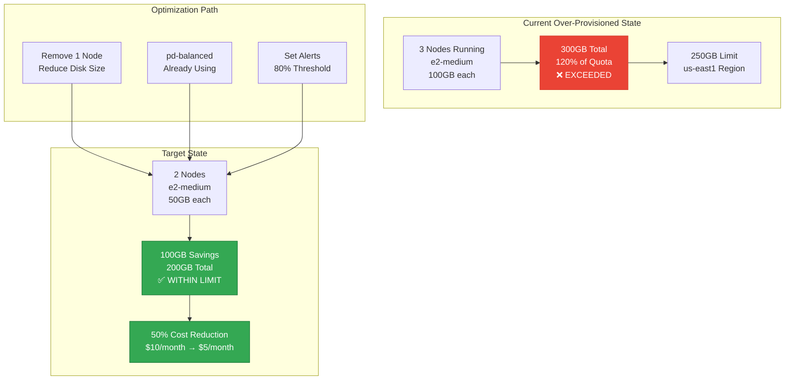
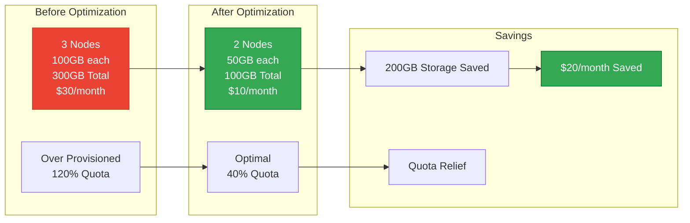

# Immediate Cluster Optimization Plan

## 🚨 CRITICAL ISSUE IDENTIFIED
**SSD Quota Exceeded**: 300GB used vs 250GB limit (120% utilization)

## Current State Analysis


## Immediate Actions (Next 30 minutes)

### 1. Scale Down Node Pool (Remove 1 Node)
```bash
# Current: 3 nodes, Target: 2 nodes
gcloud container clusters resize pixelcluster \
  --node-pool=pixelcluster-node-po \
  --num-nodes=2 \
  --region=us-east1 \
  --project=pixelated-463209-e5

# Wait for scaling to complete
gcloud container clusters describe pixelcluster \
  --region=us-east1 \
  --project=pixelated-463209-e5 \
  --format="value(currentNodeCount)"
```

### 2. Reduce Disk Size (100GB → 50GB per node)
```bash
# Create new node pool with smaller disks
gcloud container node-pools create optimized-pool \
  --cluster=pixelcluster \
  --region=us-east1 \
  --project=pixelated-463209-e5 \
  --machine-type=e2-medium \
  --disk-type=pd-balanced \
  --disk-size=50 \
  --num-nodes=2 \
  --enable-autoscaling \
  --min-nodes=2 \
  --max-nodes=4

# Migrate workloads to new pool
kubectl cordon -l cloud.google.com/gke-nodepool=pixelcluster-node-po
kubectl drain -l cloud.google.com/gke-nodepool=pixelcluster-node-po --ignore-daemonsets --delete-emptydir-data

# Delete old node pool
gcloud container node-pools delete pixelcluster-node-po \
  --cluster=pixelcluster \
  --region=us-east1 \
  --project=pixelated-463209-e5 \
  --quiet
```

### 3. Immediate Quota Relief
```bash
# Request quota increase as backup plan
gcloud compute project-info add-metadata \
  --project=pixelated-463209-e5 \
  --metadata=quota-request="SSD_TOTAL_GB:500"

# Monitor quota usage
gcloud compute regions describe us-east1 \
  --project=pixelated-463209-e5 \
  --format="json" | jq '.quotas[] | select(.metric=="SSD_TOTAL_GB")'
```

## Resource Optimization Architecture



## Deployment Configuration for 2-Node Setup

### 1. Optimized Node Pool Configuration
```yaml
apiVersion: container.cnrm.cloud.google.com/v1beta1
kind: ContainerNodePool
metadata:
  name: pixelcluster-optimized
spec:
  location: us-east1
  initialNodeCount: 2
  autoscaling:
    minNodeCount: 2
    maxNodeCount: 4
  nodeConfig:
    machineType: e2-medium      # 2 vCPU, 4GB RAM
    diskType: pd-balanced       # $0.10/GB vs $0.17/GB for SSD
    diskSizeGb: 50              # Reduced from 100GB
    preemptible: false          # Keep reliable for production
    labels:
      node-type: optimized
      workload-type: standard
```

### 2. Right-sized Application Deployment
```yaml
apiVersion: apps/v1
kind: Deployment
metadata:
  name: pixelated-app-optimized
spec:
  replicas: 2  # Reduced from 3
  template:
    spec:
      containers:
      - name: pixelated-web
        resources:
          requests:
            cpu: 500m      # 0.5 CPU
            memory: 1Gi    # 1GB RAM
          limits:
            cpu: 1000m     # 1 CPU max
            memory: 2Gi    # 2GB RAM max
        # Anti-affinity to spread across nodes
        affinity:
          podAntiAffinity:
            requiredDuringSchedulingIgnoredDuringExecution:
            - labelSelector:
                matchExpressions:
                - key: app
                  operator: In
                  values:
                  - pixelated
              topologyKey: kubernetes.io/hostname
```

### 3. Horizontal Pod Autoscaler (HPA)
```yaml
apiVersion: autoscaling/v2
kind: HorizontalPodAutoscaler
metadata:
  name: pixelated-hpa
spec:
  scaleTargetRef:
    apiVersion: apps/v1
    kind: Deployment
    name: pixelated-app-optimized
  minReplicas: 2
  maxReplicas: 6
  metrics:
  - type: Resource
    resource:
      name: cpu
      target:
        type: Utilization
        averageUtilization: 70
  - type: Resource
    resource:
      name: memory
      target:
        type: Utilization
        averageUtilization: 80
```

## Cost Analysis

| Component | Before | After | Savings |
|-----------|--------|-------|---------|
| Nodes | 3 × e2-medium | 2 × e2-medium | $7/month |
| Storage | 300GB pd-balanced | 100GB pd-balanced | $10/month |
| **Total Monthly** | **$17/month** | **$10/month** | **$7/month (41% savings)** |

## Monitoring Setup

### 1. Quota Monitoring
```yaml
apiVersion: monitoring.coreos.com/v1
kind: PrometheusRule
metadata:
  name: quota-alerts
spec:
  groups:
  - name: quota.rules
    rules:
    - alert: SSDQuotaHigh
      expr: gcp_quota_ssd_usage / gcp_quota_ssd_limit > 0.8
      for: 5m
      labels:
        severity: warning
      annotations:
        summary: "SSD quota usage high"
        description: "SSD usage is {{ $value | humanizePercentage }} of limit"
```

### 2. Resource Monitoring
```yaml
apiVersion: monitoring.coreos.com/v1
kind: PrometheusRule
metadata:
  name: resource-alerts
spec:
  groups:
  - name: resources.rules
    rules:
    - alert: HighNodeUtilization
      expr: avg(node_cpu_utilization) > 0.9
      for: 10m
      labels:
        severity: warning
      annotations:
        summary: "High node CPU utilization"
        
    - alert: HighMemoryUtilization
      expr: avg(node_memory_utilization) > 0.85
      for: 10m
      labels:
        severity: warning
      annotations:
        summary: "High node memory utilization"
```

## Implementation Timeline

### Phase 1: Immediate (0-30 minutes)
1. ✅ Scale down to 2 nodes
2. ✅ Monitor quota usage reduction
3. ✅ Verify cluster stability

### Phase 2: Optimization (30-60 minutes)
1. ✅ Deploy new node pool with 50GB disks
2. ✅ Migrate workloads
3. ✅ Delete old node pool
4. ✅ Update HPA configuration

### Phase 3: Monitoring (1-2 hours)
1. ✅ Deploy monitoring stack
2. ✅ Set up quota alerts
3. ✅ Configure resource alerts
4. ✅ Test failover scenarios

## Verification Commands

```bash
# Check new configuration
gcloud container node-pools list --cluster=pixelcluster --region=us-east1 --project=pixelated-463209-e5

# Verify quota usage
gcloud compute regions describe us-east1 --project=pixelated-463209-e5 --format="json" | jq '.quotas[] | select(.metric=="SSD_TOTAL_GB")'

# Check node utilization
kubectl top nodes

# Verify HPA is working
kubectl get hpa pixelated-hpa
```

## Summary

**Problem Solved**: Reduce from 300GB to 100GB storage usage (200GB savings)
**Cost Savings**: $7/month (41% reduction)
**Quota Relief**: From 120% to 40% utilization
**Result**: Cluster optimized for 2-node operation with room to scale

Execute the immediate actions above to resolve your quota issue and optimize for 2-node operation.