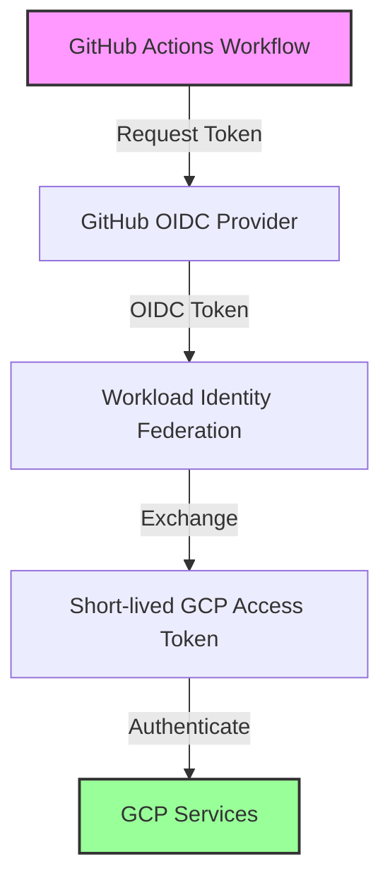

# GCP Workload Identity Federation Setup Guide

## Overview

This guide explains how to set up Workload Identity Federation for GitHub Actions to authenticate with Google Cloud Platform (GCP) without using service account keys.

## What Changed

We migrated from the deprecated `credentials_json` authentication method to the modern **Workload Identity Federation** approach. This change:

- **Eliminates the need for service account key JSON files** - No more managing sensitive key files
- **Improves security** - Uses short-lived tokens instead of long-lived keys
- **Simplifies secret management** - No need to rotate service account keys
- **Follows Google Cloud best practices** - Recommended authentication method

## Authentication Flow



## Setup Instructions

### 1. Create Workload Identity Pool

```bash
# Create a workload identity pool
gcloud iam workload-identity-pools create github-pool \
    --location="global" \
    --display-name="GitHub Actions Pool"

# Get the pool ID (save this for later)
gcloud iam workload-identity-pools describe github-pool \
    --location="global" \
    --format="value(name)"
```

### 2. Create Workload Identity Provider

```bash
# Create OIDC provider for GitHub
gcloud iam workload-identity-pools providers create-oidc github-provider \
    --location="global" \
    --workload-identity-pool="github-pool" \
    --display-name="GitHub Actions Provider" \
    --attribute-mapping="google.subject=assertion.sub,attribute.actor=assertion.actor,attribute.repository=assertion.repository" \
    --issuer-uri="https://token.actions.githubusercontent.com"
```

### 3. Create Service Account

```bash
# Create a service account for GitHub Actions
gcloud iam service-accounts create github-actions-sa \
    --display-name="GitHub Actions Service Account"

# Grant necessary permissions to the service account
gcloud projects add-iam-policy-binding ${GCP_PROJECT_ID} \
    --member="serviceAccount:github-actions-sa@${GCP_PROJECT_ID}.iam.gserviceaccount.com" \
    --role="roles/container.developer"

# Add more roles as needed for your specific use case
gcloud projects add-iam-policy-binding ${GCP_PROJECT_ID} \
    --member="serviceAccount:github-actions-sa@${GCP_PROJECT_ID}.iam.gserviceaccount.com" \
    --role="roles/logging.viewer"
```

### 4. Grant Workload Identity Access

```bash
# Allow the GitHub repository to impersonate the service account
gcloud iam service-accounts add-iam-policy-binding github-actions-sa@${GCP_PROJECT_ID}.iam.gserviceaccount.com \
    --role="roles/iam.workloadIdentityUser" \
    --member="principalSet://iam.googleapis.com/projects/${GCP_PROJECT_NUMBER}/locations/global/workloadIdentityPools/github-pool/attribute.repository/${GITHUB_REPOSITORY}"
```

### 5. Configure GitHub Secrets

Add these secrets to your GitHub repository:

- `GCP_WORKLOAD_IDENTITY_PROVIDER`: The full provider name in format:
  ```
  projects/${GCP_PROJECT_NUMBER}/locations/global/workloadIdentityPools/github-pool/providers/github-provider
  ```

- `GCP_SERVICE_ACCOUNT_EMAIL`: The service account email:
  ```
  github-actions-sa@${GCP_PROJECT_ID}.iam.gserviceaccount.com
  ```

## Required GitHub Repository Permissions

Ensure your workflow has the necessary permissions:

```yaml
permissions:
  contents: read
  id-token: write  # Required for OIDC token generation
  issues: write    # For creating GitHub issues on alerts
```

## Environment Variables

The workflow uses these environment variables that should be configured as GitHub secrets:

- `GCP_PROJECT_ID`: Your GCP project ID
- `GKE_CLUSTER_NAME`: Your GKE cluster name
- `GKE_ZONE`: Your GKE cluster zone
- `GKE_NAMESPACE`: Your Kubernetes namespace
- `GKE_SERVICE_NAME`: Your Kubernetes service name
- `GKE_ENVIRONMENT_URL`: Your application URL (optional)
- `SLACK_WEBHOOK_URL`: Slack webhook for notifications (optional)

## Verification

To verify the setup is working:

1. **Test authentication**: Run the workflow manually from GitHub Actions
2. **Check logs**: Verify successful GCP authentication in workflow logs
3. **Monitor resources**: Confirm the workflow can access GKE cluster resources

## Troubleshooting

### Common Issues

1. **Permission denied errors**:
   - Verify service account has required IAM roles
   - Check Workload Identity Federation configuration
   - Ensure repository name matches in the principal binding

2. **OIDC token issues**:
   - Confirm `id-token: write` permission is set
   - Verify GitHub repository settings allow OIDC tokens

3. **Provider configuration errors**:
   - Check the provider resource name format
   - Ensure the provider exists in the correct location

### Debug Steps

```bash
# Check workload identity pool status
gcloud iam workload-identity-pools describe github-pool --location="global"

# List service account permissions
gcloud iam service-accounts get-iam-policy github-actions-sa@${GCP_PROJECT_ID}.iam.gserviceaccount.com

# Test impersonation (from local machine with appropriate credentials)
gcloud iam service-accounts sign-jwt \
    --iam-account=github-actions-sa@${GCP_PROJECT_ID}.iam.gserviceaccount.com \
    --payload='{"sub":"test"}' \
    /dev/stdout
```

## Security Benefits

1. **No long-lived credentials**: Tokens are short-lived and automatically rotated
2. **Granular access control**: Fine-grained permissions per repository/workflow
3. **Audit trail**: All authentication events are logged in GCP
4. **No secret rotation**: Eliminates the need to manage and rotate service account keys

## Migration from Service Account Keys

If you're migrating from service account key JSON files:

1. Set up Workload Identity Federation as described above
2. Update your workflows to use the new authentication method
3. Remove old `GCP_SERVICE_ACCOUNT_KEY` secrets
4. Delete unused service account keys from GCP
5. Update any documentation referencing the old method

## Additional Resources

- [Google Cloud Workload Identity Federation Documentation](https://cloud.google.com/iam/docs/workload-identity-federation)
- [GitHub Actions OIDC Documentation](https://docs.github.com/en/actions/deployment/security-hardening-your-deployments/about-security-hardening-with-openid-connect)
- [Google Cloud GitHub Action](https://github.com/google-github-actions/auth)