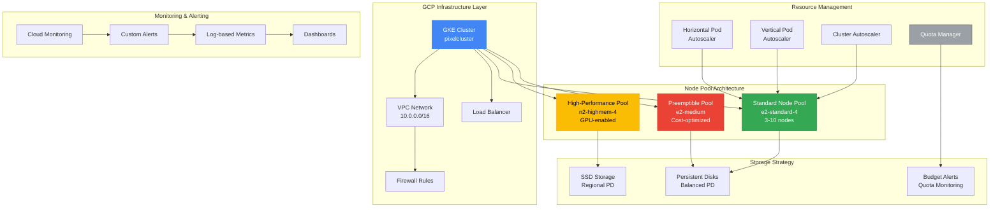
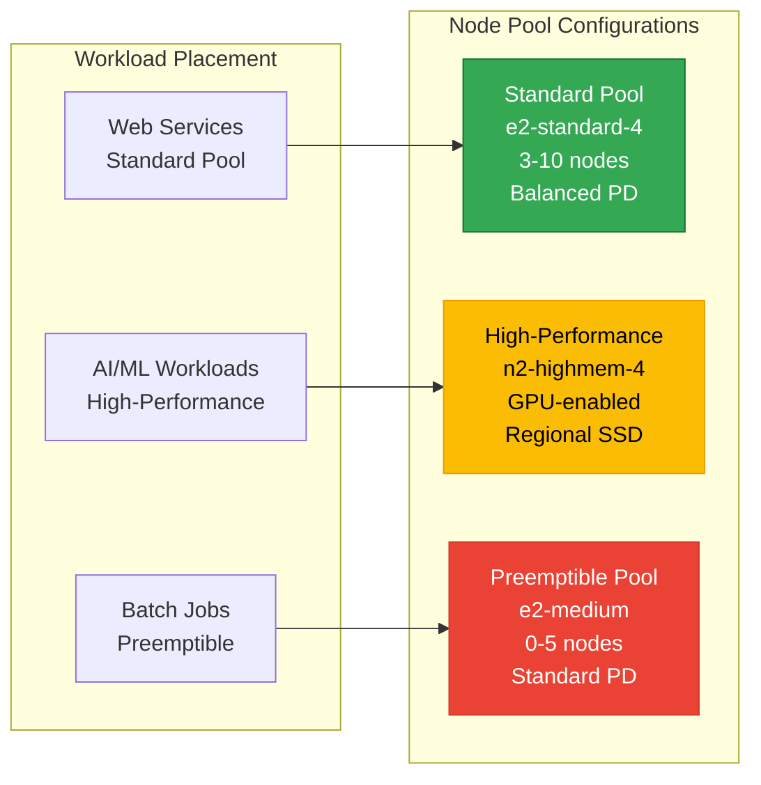
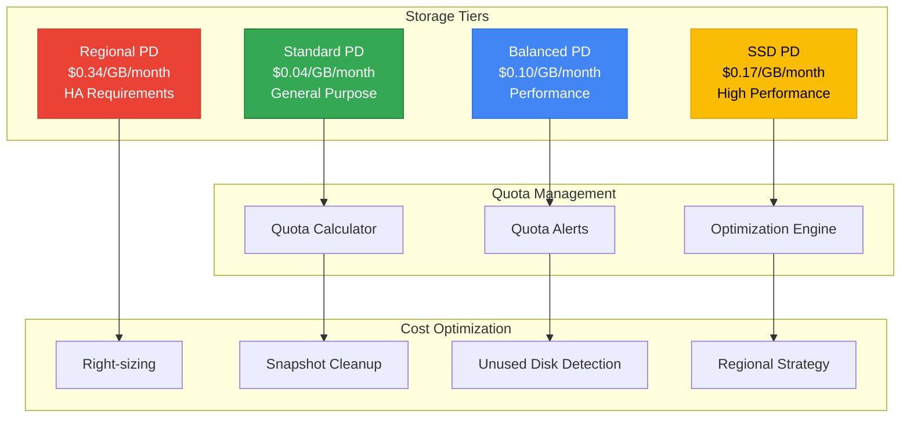
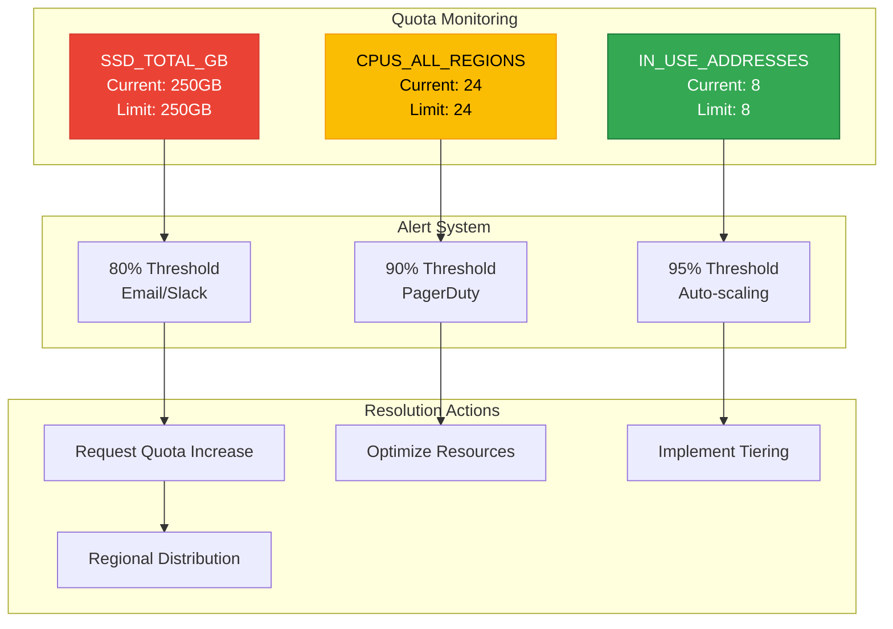
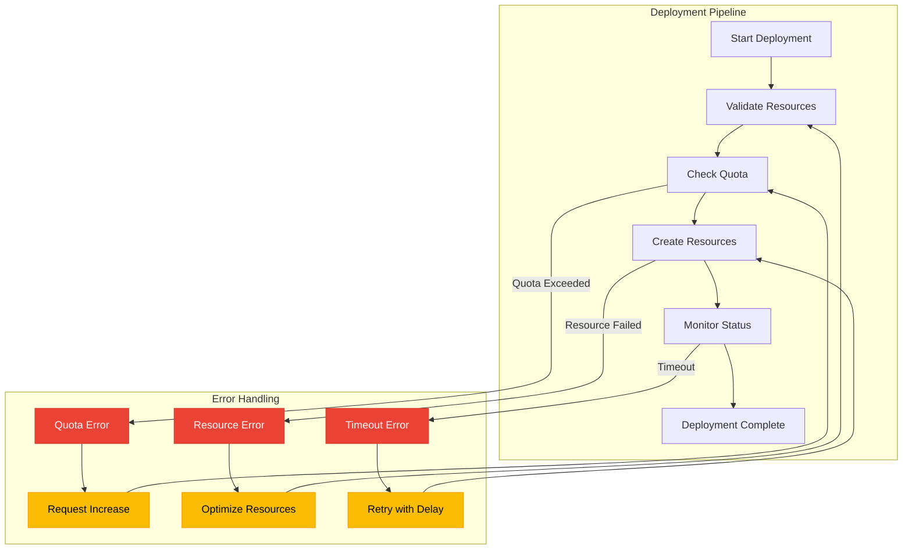

# GKE Cluster Optimization Architecture

## Problem Analysis

The current GKE cluster deployment is failing due to:
- **Missing instance templates** for node pool configurations
- **SSD quota exceeded** (250GB limit in us-east1 region)
- **Insufficient resource allocation** for high-performance workloads

## Architecture Overview



## Detailed Architecture Components

### 1. Multi-Node Pool Strategy



### 2. Storage Optimization Strategy



### 3. Resource Allocation & Quota Management



## Implementation Strategy

### 1. Node Pool Configuration

```yaml
# Standard Node Pool - Cost Optimized
apiVersion: container.cnrm.cloud.google.com/v1beta1
kind: ContainerNodePool
metadata:
  name: standard-pool
  namespace: config-control
spec:
  location: us-east1
  initialNodeCount: 3
  autoscaling:
    minNodeCount: 3
    maxNodeCount: 10
  nodeConfig:
    machineType: e2-standard-4
    diskType: pd-standard
    diskSizeGb: 50
    preemptible: false
    labels:
      node-type: standard
      workload-type: general
    taints:
    - key: workload-type
      value: standard
      effect: NO_SCHEDULE

# High-Performance Pool - SSD Optimized
apiVersion: container.cnrm.cloud.google.com/v1beta1
kind: ContainerNodePool
metadata:
  name: high-performance-pool
  namespace: config-control
spec:
  location: us-east1
  initialNodeCount: 1
  autoscaling:
    minNodeCount: 1
    maxNodeCount: 5
  nodeConfig:
    machineType: n2-highmem-4
    diskType: pd-ssd
    diskSizeGb: 100
    preemptible: false
    labels:
      node-type: high-performance
      workload-type: ai-ml
    taints:
    - key: workload-type
      value: high-performance
      effect: NO_SCHEDULE

# Preemptible Pool - Cost Optimized
apiVersion: container.cnrm.cloud.google.com/v1beta1
kind: ContainerNodePool
metadata:
  name: preemptible-pool
  namespace: config-control
spec:
  location: us-east1
  initialNodeCount: 0
  autoscaling:
    minNodeCount: 0
    maxNodeCount: 5
  nodeConfig:
    machineType: e2-medium
    diskType: pd-standard
    diskSizeGb: 30
    preemptible: true
    labels:
      node-type: preemptible
      workload-type: batch
    taints:
    - key: workload-type
      value: preemptible
      effect: NO_SCHEDULE
```

### 2. Quota Management Configuration

```yaml
# Quota Monitoring Dashboard
apiVersion: monitoring.cnrm.cloud.google.com/v1beta1
kind: MonitoringDashboard
metadata:
  name: quota-monitoring
  namespace: config-control
spec:
  displayName: "GKE Quota Monitoring"
  gridLayout:
    widgets:
    - title: "SSD Storage Usage"
      xyChart:
        dataSets:
        - timeSeriesQuery: |
            fetch consumer_quota
            | metric 'serviceruntime.googleapis.com/quota/allocation/usage'
            | filter (resource.quota_metric == 'SSD_TOTAL_GB')
            | group_by 1m, [value_usage_mean: mean(value.usage)]
        chartOptions:
          mode: LINE
    - title: "CPU Usage"
      xyChart:
        dataSets:
        - timeSeriesQuery: |
            fetch consumer_quota
            | metric 'serviceruntime.googleapis.com/quota/allocation/usage'
            | filter (resource.quota_metric == 'CPUS_ALL_REGIONS')
            | group_by 1m, [value_usage_mean: mean(value.usage)]
        chartOptions:
          mode: LINE

# Alert Policy for Quota Thresholds
apiVersion: monitoring.cnrm.cloud.google.com/v1beta1
kind: MonitoringAlertPolicy
metadata:
  name: quota-threshold-alert
  namespace: config-control
spec:
  displayName: "Quota Threshold Alert"
  conditions:
  - displayName: "SSD Quota > 80%"
    conditionThreshold:
      filter: |
        resource.type = "consumer_quota"
        AND metric.type = "serviceruntime.googleapis.com/quota/allocation/usage"
        AND resource.label.quota_metric = "SSD_TOTAL_GB"
      comparison: COMPARISON_GT
      thresholdValue: 200
      duration: 300s
  - displayName: "CPU Quota > 80%"
    conditionThreshold:
      filter: |
        resource.type = "consumer_quota"
        AND metric.type = "serviceruntime.googleapis.com/quota/allocation/usage"
        AND resource.label.quota_metric = "CPUS_ALL_REGIONS"
      comparison: COMPARISON_GT
      thresholdValue: 19
      duration: 300s
  notificationChannels:
  - name: "email-notification-channel"
  alertStrategy:
    autoClose: 86400s
```

### 3. Cost Optimization Strategy

```yaml
# Resource Right-sizing Configuration
apiVersion: v1
kind: ConfigMap
metadata:
  name: resource-optimization
  namespace: kube-system
data:
  optimization-config.yaml: |
    # Vertical Pod Autoscaler Configuration
    vpa:
      enabled: true
      updateMode: "Auto"
      resourcePolicy:
        containerPolicies:
        - containerName: '*'
          maxAllowed:
            cpu: 2
            memory: 4Gi
          minAllowed:
            cpu: 100m
            memory: 128Mi
    
    # Horizontal Pod Autoscaler Configuration
    hpa:
      enabled: true
      behavior:
        scaleDown:
          stabilizationWindowSeconds: 300
          policies:
          - type: Percent
            value: 10
            periodSeconds: 60
        scaleUp:
          stabilizationWindowSeconds: 60
          policies:
          - type: Percent
            value: 50
            periodSeconds: 60
    
    # Cluster Autoscaler Configuration
    clusterAutoscaler:
      enabled: true
      scaleDownEnabled: true
      scaleDownDelayAfterAdd: 10m
      scaleDownDelayAfterDelete: 5m
      scaleDownDelayAfterFailure: 3m
      scaleDownUnneededTime: 10m
      scaleDownUtilizationThreshold: 0.5
```

### 4. Deployment Flow with Error Handling



## Monitoring and Alerting Architecture

### 1. Metrics Collection

```yaml
# Prometheus Configuration for GKE Monitoring
apiVersion: v1
kind: ConfigMap
metadata:
  name: prometheus-config
  namespace: monitoring
data:
  prometheus.yml: |
    global:
      scrape_interval: 15s
      evaluation_interval: 15s
    
    scrape_configs:
    - job_name: 'gke-nodes'
      kubernetes_sd_configs:
      - role: node
      relabel_configs:
      - source_labels: [__meta_kubernetes_node_label_node_type]
        target_label: node_type
      - source_labels: [__meta_kubernetes_node_label_workload_type]
        target_label: workload_type
    
    - job_name: 'gke-pods'
      kubernetes_sd_configs:
      - role: pod
      relabel_configs:
      - source_labels: [__meta_kubernetes_pod_annotation_prometheus_io_scrape]
        action: keep
        regex: true
      - source_labels: [__meta_kubernetes_pod_annotation_prometheus_io_path]
        target_label: __metrics_path__
    
    - job_name: 'quota-metrics'
      static_configs:
      - targets: ['quota-exporter:8080']
      metrics_path: /metrics
```

### 2. Alert Rules

```yaml
# Alert Rules for Quota and Resource Management
apiVersion: monitoring.coreos.com/v1
kind: PrometheusRule
metadata:
  name: gke-quota-alerts
  namespace: monitoring
spec:
  groups:
  - name: quota.rules
    interval: 30s
    rules:
    - alert: SSDQuotaHigh
      expr: gcp_quota_ssd_total_gb_usage / gcp_quota_ssd_total_gb_limit > 0.8
      for: 5m
      labels:
        severity: warning
        team: infrastructure
      annotations:
        summary: "SSD quota usage is high"
        description: "SSD quota usage is {{ $value | humanizePercentage }} of limit"
    
    - alert: CPUQuotaHigh
      expr: gcp_quota_cpus_all_regions_usage / gcp_quota_cpus_all_regions_limit > 0.8
      for: 5m
      labels:
        severity: warning
        team: infrastructure
      annotations:
        summary: "CPU quota usage is high"
        description: "CPU quota usage is {{ $value | humanizePercentage }} of limit"
    
    - alert: NodePoolScalingFailed
      expr: increase(gke_node_pool_scaling_failures_total[5m]) > 0
      for: 1m
      labels:
        severity: critical
        team: infrastructure
      annotations:
        summary: "Node pool scaling failed"
        description: "Node pool {{ $labels.node_pool }} scaling failed"
```

### 3. Dashboard Configuration

```json
{
  "dashboard": {
    "title": "GKE Cluster Optimization",
    "panels": [
      {
        "title": "Quota Usage Overview",
        "type": "stat",
        "targets": [
          {
            "expr": "gcp_quota_ssd_total_gb_usage / gcp_quota_ssd_total_gb_limit",
            "legendFormat": "SSD Usage %"
          },
          {
            "expr": "gcp_quota_cpus_all_regions_usage / gcp_quota_cpus_all_regions_limit",
            "legendFormat": "CPU Usage %"
          }
        ],
        "thresholds": [
          {"color": "green", "value": 0},
          {"color": "yellow", "value": 0.7},
          {"color": "red", "value": 0.9}
        ]
      },
      {
        "title": "Node Pool Status",
        "type": "table",
        "targets": [
          {
            "expr": "gke_node_pool_nodes",
            "legendFormat": "{{node_pool}} - Nodes"
          }
        ]
      },
      {
        "title": "Cost Optimization Metrics",
        "type": "graph",
        "targets": [
          {
            "expr": "gke_preemptible_node_savings",
            "legendFormat": "Preemptible Savings"
          },
          {
            "expr": "gke_right_sizing_recommendations",
            "legendFormat": "Right-sizing Opportunities"
          }
        ]
      }
    ]
  }
}
```

## Cost Optimization Recommendations

### 1. Immediate Actions (0-2 weeks)
- **Request quota increase** for SSD_TOTAL_GB to 500GB minimum
- **Implement preemptible nodes** for non-critical workloads (70% cost savings)
- **Right-size existing resources** based on actual usage patterns
- **Enable cluster autoscaling** with conservative settings

### 2. Medium-term Optimizations (2-8 weeks)
- **Implement regional distribution** to avoid single-region quota limits
- **Deploy workload-specific node pools** with appropriate resource allocation
- **Set up comprehensive monitoring** and alerting for quota usage
- **Implement automated resource cleanup** policies

### 3. Long-term Strategy (8+ weeks)
- **Multi-cluster architecture** for high availability and cost optimization
- **Advanced scheduling policies** based on cost and performance requirements
- **Predictive scaling** based on historical usage patterns
- **Integration with cost management tools** for budget tracking

## Security Considerations

### 1. Network Security
- Implement network policies for pod-to-pod communication
- Use private clusters with authorized networks
- Enable VPC flow logs for traffic analysis

### 2. Identity and Access Management
- Use workload identity for pod authentication
- Implement least-privilege RBAC policies
- Enable audit logging for all cluster operations

### 3. Data Protection
- Encrypt all persistent volumes at rest
- Use secrets management for sensitive data
- Implement backup and disaster recovery procedures

This architecture provides a comprehensive solution to the current GKE cluster issues while ensuring scalability, cost-effectiveness, and operational excellence.