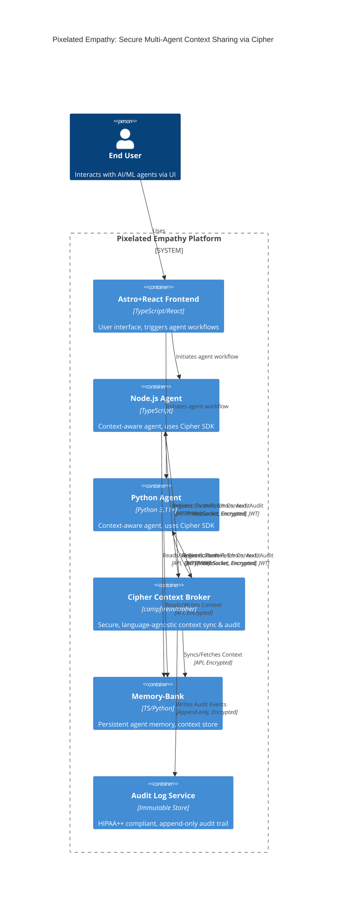
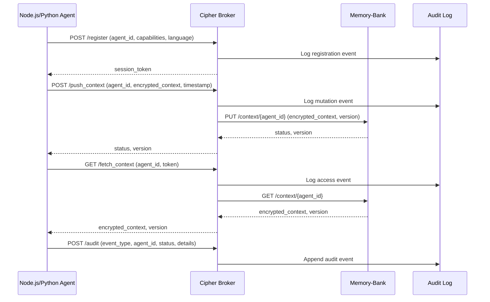

## Cipher Multi-Agent Context Sharing Integration Plan

1. **Cipher Initialization**: Add Cipher setup in a new utility (e.g., `src/lib/cipher.ts`).
2. **Configuration**: Use environment variables for Cipher keys/config (never hardcode secrets).
3. **Context Sharing API**: Expose functions for agents to read/write shared context.
4. **Agent Usage**: Import and use Cipher utility in agent modules/services.
5. **Error Handling**: Implement robust error handling and logging for Cipher operations.
6. **Documentation**: Document usage patterns and integration points in this file.

**Next Steps:**
- Add `src/lib/cipher.ts` with Cipher initialization and context API.
- Integrate Cipher utility in agent-related modules.
- Update this documentation with code examples and usage notes after implementation.

## Cipher Integration: Validation & Test Instructions

### 1. Automated Tests

- **Unit Test Example (Vitest/Jest):**
  - Test `shareContext` and `getContext` in [`src/lib/cipher.ts`](src/lib/cipher.ts:1) with mock agent IDs and context payloads.
  - Assert that context is stored and retrieved correctly.
  - Simulate error conditions (e.g., invalid API key, network failure) and verify error handling.

- **Integration Test Example:**
  - In a test file (e.g., `src/lib/cipher.test.ts`), call `shareContext` with a test agent and context, then call `getContext` and verify the result matches.
  - Test concurrent context sharing for multiple agents.

### 2. Manual Validation

- **Step 1:** Set required Cipher environment variables in `.env` (see earlier section).
- **Step 2:** In a Node.js REPL or script, import and call `shareContext` and `getContext` with test data.
- **Step 3:** Check for expected results and error messages.

### 3. Expected Results

- Context data should be securely stored and retrieved for each agent.
- Errors (e.g., missing credentials, API errors) should be logged and not crash the app.
- No sensitive data should be exposed in logs.

### 4. Troubleshooting

- If context is not shared/retrieved, verify:
  - Cipher API credentials and project ID are set in environment variables.
  - Network connectivity to Cipher service.
  - Error logs for details.

- For persistent issues, consult the Cipher documentation or integration logs.

---

_Last updated: 2025-09-13_
  
## Cipher Multi-Agent Context Sharing: Container & Integration Diagram



**Legend:**  
- **Cipher**: Trusted broker for all agent context sync, registration, and audit flows.  
- **Node.js/Python Agents**: Use Cipher SDKs for all context operations; never direct agent-to-agent sync.  
- **Memory-Bank**: Persistent, versioned context store, accessed via Cipher or directly by agents.  
- **Audit Log**: Immutable, append-only, HIPAA++ compliant; all access/mutation/error events logged.

**Integration Points:**  
- **Agent SDKs** (TS/Python):  
  - `initializeAgent(config)`  
  - `registerAgent()`  
  - `serializeContext(contextObj)`  
  - `pushContext(encryptedContext)`  
  - `fetchContext()`  
  - `handleError(error)`  
  - All cryptography via env/config keys.

- **Cipher API**:  
  - `/register` (POST): agent_id, capabilities, language  
  - `/push_context` (POST): agent_id, encrypted_context, timestamp  
  - `/fetch_context` (GET): agent_id, token  
  - `/audit` (POST): event_type, agent_id, status, details  
  - All endpoints require JWT/session, strict schema, and audit logging.

- **Memory-Bank API**:  
  - `/context/{agent_id}` (GET/PUT): versioned, encrypted context blobs  
  - Access controlled via Cipher or agent JWT

- **Audit Log**:  
  - Append-only, immutable, 7+ year retention, compliance-checked

**Security/Compliance:**  
- All secrets/keys from environment or secure vault  
- All context and audit flows encrypted (FHE/at-rest)  
- All access, mutation, and error events logged and redacted as needed  
- <50ms context sync/fetch enforced at API and agent SDK level

---

**Next:**  
- Detail service boundaries, data flow, and security layers for context sharing in prose and interface tables.
---

## Service Boundaries, Data Flow, and Security Layers

### 1. Service Boundaries

| Service         | Responsibility                                                                 | Exposed Interfaces / APIs                | Data Ownership         | Access Control / AuthN/AuthZ         |
|-----------------|-------------------------------------------------------------------------------|------------------------------------------|-----------------------|--------------------------------------|
| Cipher          | Trusted context broker for agent registration, context sync, and audit logging | `/register`, `/push_context`, `/fetch_context`, `/audit` | None (transient broker) | JWT (agent), strict schema, env keys |
| Node.js Agent   | Context-aware agent (TypeScript), interacts with Cipher and Memory-Bank        | Agent SDK (`initializeAgent`, `pushContext`, etc.) | Own context, agent state | JWT, env keys, agent config         |
| Python Agent    | Context-aware agent (Python), interacts with Cipher and Memory-Bank            | Agent SDK (Python)                       | Own context, agent state | JWT, env keys, agent config         |
| Memory-Bank     | Persistent, versioned context store for all agents                             | `/context/{agent_id}` (GET/PUT)          | All agent context      | JWT (agent or Cipher), RBAC         |
| Audit Log       | Immutable, append-only, HIPAA++ compliant audit trail                          | Append-only API, no direct read access   | All audit events       | Cipher only (writes), compliance     |

**Boundary Principles:**
- No direct agent-to-agent communication; all context sync via Cipher.
- Memory-Bank is the only persistent store for agent context; Cipher is stateless.
- Audit Log is append-only, immutable, and not directly readable by agents.

---

### 2. Data Flow

**Push Context (Agent → Cipher → Memory-Bank):**
1. Agent serializes and encrypts context using env/config keys.
2. Agent calls `pushContext` (SDK), which POSTs to `/push_context` on Cipher.
3. Cipher validates, audits, and forwards encrypted context to Memory-Bank.
4. Memory-Bank stores versioned, encrypted blob; Cipher logs audit event.

**Fetch Context (Agent ← Cipher ← Memory-Bank):**
1. Agent calls `fetchContext` (SDK), which GETs from `/fetch_context` on Cipher.
2. Cipher validates, audits, and fetches encrypted context from Memory-Bank.
3. Cipher returns encrypted context to agent; agent decrypts and deserializes.

**Registration & Capability Handshake:**
- Agent calls `registerAgent` (SDK), POSTs to `/register` on Cipher with agent_id, capabilities, language.
- Cipher validates, issues session/JWT, logs audit event.

**Audit Logging:**
- All access, mutation, and error events POSTed to `/audit` on Cipher.
- Cipher writes to Audit Log (append-only, encrypted, 7+ year retention).

**Error Handling:**
- All errors (validation, auth, network) are logged via `/audit` with redacted details.
- Agents receive structured error responses; no sensitive data in error payloads.

---

### 3. Security Layers

| Layer                | Mechanism / Protocol                          | Compliance / Rationale                |
|----------------------|-----------------------------------------------|---------------------------------------|
| Encryption           | FHE or strong symmetric encryption (env keys) | HIPAA++, Zero-Knowledge, at-rest/in-transit |
| Authentication       | JWT (agent-issued, Cipher-issued)             | Agent isolation, access control       |
| Authorization        | RBAC (agent, Cipher, Memory-Bank, Audit Log)  | Principle of least privilege          |
| Key Management       | All keys from environment or secure vault     | No hardcoded secrets, rotation ready  |
| Auditability         | Immutable, append-only audit log, redacted    | HIPAA++ compliance, traceability      |
| Performance          | <50ms enforced at API and SDK level           | Real-time context sync requirement    |
| Error Redaction      | All error/audit payloads redacted, no PHI     | Privacy, compliance                   |

---

### 4. Interface Table

| Integration Point         | Method / Endpoint         | Request Fields                        | Response Fields         | Protocol / Security         | Compliance Notes                |
|--------------------------|--------------------------|---------------------------------------|-------------------------|-----------------------------|---------------------------------|
| Agent SDK: register      | `/register` (POST)       | agent_id, capabilities, language      | session_token, status   | JWT, HTTPS, schema          | Audit event on register         |
| Agent SDK: pushContext   | `/push_context` (POST)   | agent_id, encrypted_context, timestamp| status, version         | JWT, HTTPS, schema          | Audit event on mutation         |
| Agent SDK: fetchContext  | `/fetch_context` (GET)   | agent_id, token                       | encrypted_context, version | JWT, HTTPS, schema      | Audit event on access           |
| Agent SDK: audit         | `/audit` (POST)          | event_type, agent_id, status, details | status                  | JWT, HTTPS, schema          | All errors/accesses audited     |
| Memory-Bank: context     | `/context/{agent_id}`    | (GET/PUT) encrypted_context, version  | encrypted_context, version | JWT, HTTPS, RBAC         | Versioned, encrypted, append-only|
| Audit Log: append        | (internal, append-only)  | event_type, agent_id, details         | status                  | Cipher-only, encrypted      | 7+ year retention, immutable    |

---

### 5. Compliance & Performance

- **HIPAA++**: All context and audit flows are encrypted, redacted, and logged.
- **Zero-Knowledge**: No plaintext context or PHI leaves agent boundary; Cipher and Memory-Bank only see encrypted blobs.
- **Auditability**: Every access, mutation, and error is logged with redaction and retention policy.
- **Performance**: All context sync and fetch operations must complete in <50ms (API and SDK enforced).
- **Extensibility**: New agent types or context schemas can be added by extending SDKs and updating schema validation.

---

**End of Service Boundaries, Data Flow, and Security Layers section.**
---

## Architecture Sequence & Data Flow Diagrams

### 1. Agent–Cipher–Memory-Bank Sequence Diagram



### 2. Data Flow Diagram: Secure Context Sync

```mermaid
flowchart TD
    subgraph Agent
        A1[serializeContext()] --> A2[encryptContext()]
        A2 --> A3[pushContext()]
    end
    subgraph Cipher
        C1[validate & audit]
        C2[forward to Memory-Bank]
        C3[log event]
    end
    subgraph MemoryBank
        M1[store versioned, encrypted blob]
    end
    subgraph AuditLog
        L1[append-only, immutable log]
    end

    A3 -->|POST /push_context| C1
    C1 --> C2
    C1 --> L1
    C2 -->|PUT /context/{agent_id}| M1
    M1 -->|status/version| C2
    C2 -->|status/version| A3
```

---

## Implementation Integration Plan

**For all agent implementers (Node.js/TypeScript & Python):**

1. **SDK Setup**
   - Install and import the Cipher Agent SDK for your language.
   - Load all secrets/keys from environment variables (never hardcode).

2. **Agent Registration**
   - Call `registerAgent()` with agent_id, capabilities, and language.
   - Store the returned session_token securely for future requests.

3. **Context Serialization & Encryption**
   - Use `serializeContext(contextObj)` to prepare context data.
   - Encrypt context using SDK utilities and environment keys.

4. **Push Context**
   - Call `pushContext(encryptedContext)` to send context to Cipher.
   - Handle and log all errors using `handleError(error)`; never expose sensitive data.

5. **Fetch Context**
   - Call `fetchContext()` to retrieve the latest context from Cipher.
   - Decrypt and validate context before use.

6. **Audit Logging**
   - Use `audit(event_type, status, details)` for all access, mutation, and error events.
   - Ensure all audit payloads are redacted and compliant.

7. **Validation & Compliance**
   - Validate all API responses against strict schemas.
   - Ensure all flows are <50ms (enforced in SDK and API).
   - Confirm all context and audit data is encrypted at rest and in transit.

8. **Extensibility**
   - To add new agent types or context schemas, extend the SDK and update schema validation as needed.

**Reference:**  
- See interface tables and diagrams above for endpoint details and data contracts.
- All flows must comply with HIPAA++, zero-knowledge, and auditability requirements.

---

**End of Architecture Diagrams & Integration Plan section.**