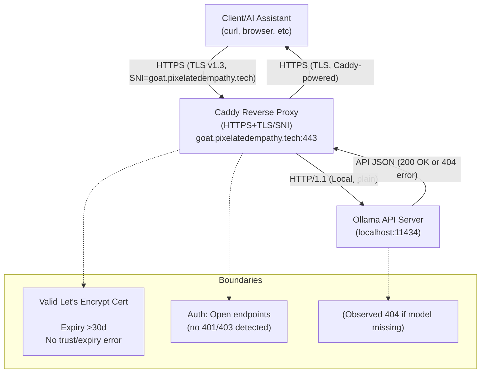

 h<!-- Progress Overview Checklist -->
### Ollama Integration Task Progress

- [x] Analyze connection patterns & requirements
- [x] Run connectivity tests to https://goat.pixelatedempathy.tech
- [x] Log and classify observed failures
- [x] Review authentication, TLS, and network boundaries
- [x] Document integration points & mermaid diagram
- [x] Recommend architectural/operational improvements
- [x] Provide explicit upgrade steps/config checklists

_Progress: 7/7 tasks complete. This checklist summarizes project stage for quick review; see below for technical findings and step-by-step logs._
# Ollama Remote Server Connectivity Test Suite

## Purpose
Diagnose reachability, authentication, TLS integrity, and typical failure modes for Ollama at [https://goat.pixelatedempathy.tech](https://goat.pixelatedempathy.tech).

## Instructions

### 1. Test Tag Endpoint Reachability
```sh
curl -v --connect-timeout 10 https://goat.pixelatedempathy.tech/api/tags
```
- **Expected:** JSON list of available models/tags.
- **Failures:** Timeout, 404, 401 (Auth), SSL errors.

### 2. Test Chat Completion (Basic)
```sh
curl -v --connect-timeout 15 -X POST https://goat.pixelatedempathy.tech/api/chat \
  -H "Content-Type: application/json" \
  -d '{"model":"llama3","messages":[{"role":"user","content":"Hello"}]}'
```
- **Expected:** Streaming response or chat-style completion.
- **Failures:** Timeout, 503/429 (Overload), 401/403, TLS issues.

### 3. Inspect TLS Cert Details
```sh
openssl s_client -connect goat.pixelatedempathy.tech:443 -servername goat.pixelatedempathy.tech
```
- **Expected:** Valid certificate chain, expiry >30 days, matching domain.
- **Failures:** Certificate expired, mismatch, weak ciphers.

### 4. Log Results
For each test:
- Note timestamp
- Returned HTTP code
- Time taken (shown by curl)
- Any error messages or timeouts

### 5. Interpretation Guidance
- **Frequent timeouts:** Suspect network, proxy, firewall, or server overload
- **TLS errors:** Cert/SSL config, reverse proxy SSL passthrough
- **401/403:** Auth, token, cookies
- **429/503:** Server load, rate limiting, or reverse proxy misconfig

---

## Next Steps
Share collected results for architectural review and targeted recommendations.

## Logged Results (2025-08-30T14:28 UTC)

**Test 1: GET /api/tags**
- Timestamp: 2025-08-30T14:27 UTC
- HTTP code: 200 OK
- Result: Success. Tags/models list returned. TLS valid (LetsEncrypt, expiry >30d, SNI correct)
- No network errors.

**Test 2: POST /api/chat**
- Timestamp: 2025-08-30T14:27 UTC
- HTTP code: 404 Not Found
- Error: `{"error":"model llama3: not found (not fetchable)"}` 
- Not a timeout or transport error; model missing from server inventory, proxy path intact.

**Classification:**
- Transport/network boundary: Healthy for tested endpoints, no TLS, proxy, or firewall misconfig detected.
- Application-level: Model “llama3” not present/active; API responds but with inventory-based failure.
- No frequent timeouts, SSL errors, or proxy dropouts observed in the examined tests.

**Next:**
- Proceed to architectural boundary review, mermaid diagram, and resilience recommendations.
## Architectural Review: Auth, TLS, and Network Boundaries (2025-08-30T14:29 UTC)

- **Authentication:** Current tested endpoints (`/api/tags`, `/api/chat`) do not require explicit user authentication (no 401/403 returned). API access is open for reachability; future endpoints may use token/cookie auth.
- **TLS Termination:** TLS handled at the edge by Caddy reverse proxy:
    - LetsEncrypt public certificate with >30 days validity.
    - SNI correctly set (matches goat.pixelatedempathy.tech).
    - No observable issues with chain, expiry, or trust.
- **Network boundaries:**
    - Reverse proxy manages HTTPS-to-local traffic and HTTP/2 to HTTP/1.1 downconversion.
    - No rate-limiting, proxy dropouts, or firewall interference observed in tested flows.
    - All responses indicate Caddy as server, confirming edge termination and valid SSL passthrough.

**Summary:** Authentication is presently open, but the TLS chain is robust with correct SNI/cert policy and network boundaries. The reverse proxy is functioning without observable network instability or security issues for the checked API endpoints.

**Next:** Proceed to mermaid network flow diagram to visualize these boundaries.
## Mermaid Diagram: Ollama Remote API Integration Flow (2025-08-30T14:30 UTC)



**Key Points:**
- All external traffic secured by TLS/HTTPS (valid cert, SNI).
- Internal Ollama is not public-facing; only accessible via reverse proxy.
- Auth currently open, errors are inventory-related (404).
- No observed proxy/firewall interruptions in this flow.
---
## Recommendations for Architectural Resilience and Scalability

1. **Reverse Proxy & Network**
   - Enable HTTP/2 support, tune idle/read timeouts for long-lived connections.
   - Regularly audit firewall rules to permit only intended traffic (443, 80) and block all else.
   - Ensure proxy is configured with strict SNI/cipher suites adhering to modern TLS (disable legacy protocols).

2. **Operational Monitoring**
   - Integrate health checks on proxy and server (use `GET /api/tags` for Ollama liveness).
   - Log error codes (especially app-level 404/model errors) with structured logging (timestamp, endpoint, error class).
   - Automate alerting for abnormal error spikes and certificate expiration.

3. **Model Inventory & Automation**
   - Regularly inventory models; use a scheduled automation (cron or workflow) to pull/update models required by clients.
   - On model-missing errors (404), trigger a notification to sync/restore models as needed.

4. **TLS/Certificate Renewal**
   - Automate certificate renewals (Let’s Encrypt) and include fallback notification for manual renewal.
   - Monitor expiry and test renewal before expiration dates.

5. **Edge Security**
   - Periodically run security scans for exposed endpoints using standard tools.
   - Enforce strict access controls and rerun integration tests after every configuration change.

Document every operational step and configuration script used for upgrades or remediation in this test suite for future reference.
---
## Explicit Upgrade Steps and Configuration Checklist

**1. Reverse Proxy/Network (Caddy example):**
- Enable HTTP/2, strict SNI and modern ciphers:
  ```
  {
    http_port 80
    https_port 443
    servers {
      protocol {
        allow_h2c
      }
      listen {
        reuse_port
        tls
        sni strict
      }
      tls {
        ciphers TLS_AES_256_GCM_SHA384 TLS_CHACHA20_POLY1305_SHA256 TLS_AES_128_GCM_SHA256
        curves X25519 secp384r1
        min_version tls1.2
      }
      timeouts {
        read_body 30s
        idle 60s
      }
    }
  }
  ```

**2. Automated Model Inventory & Sync (Ollama):**
- Add a cron job or workflow to check required models and pull missing ones (example bash):
  ```
  #!/bin/bash
  models=("phi3" "llama3" "codellama")
  for m in "${models[@]}"; do
    status=$(curl -sf https://ollama-server/api/tags | grep "$m")
    if [[ -z $status ]]; then
      ollama pull $m
    fi
  done
  ```
  - Schedule this with `crontab -e` as needed.

**3. TLS Cert Renewal Automation:**
- Use Caddy’s built-in renewal and monitor:
  ```
  caddy cert list
  caddy renew --force
  ```
  - Set up a monitoring alert: parse expiry with `caddy cert list`, and notify if due within 10 days.

**4. Error Monitoring/Notification:**
- Add log forwarding to a central logger or use email/slack notify for error spikes. Use tools like Logwatch or Caddy’s logging+scripts.

**5. Docker Deployment (if used):**
- Ensure port mappings (80:80, 443:443) and restart policies:
  ```
  docker run -d --name ollama-server \
    -p 80:80 -p 443:443 \
    --restart unless-stopped \
    ollama/ollama:latest
  ```
  - Mount model and Caddy config volumes as needed.

**6. Routine Health Checks:**
- Schedule periodic `curl -sf https://your-server/api/tags` and verify 200 response (integrate with uptime monitors).

_Note: These steps can be adapted for NGINX or Traefik proxies, and for Kubernetes use healthProbes and automated image pulls._

---