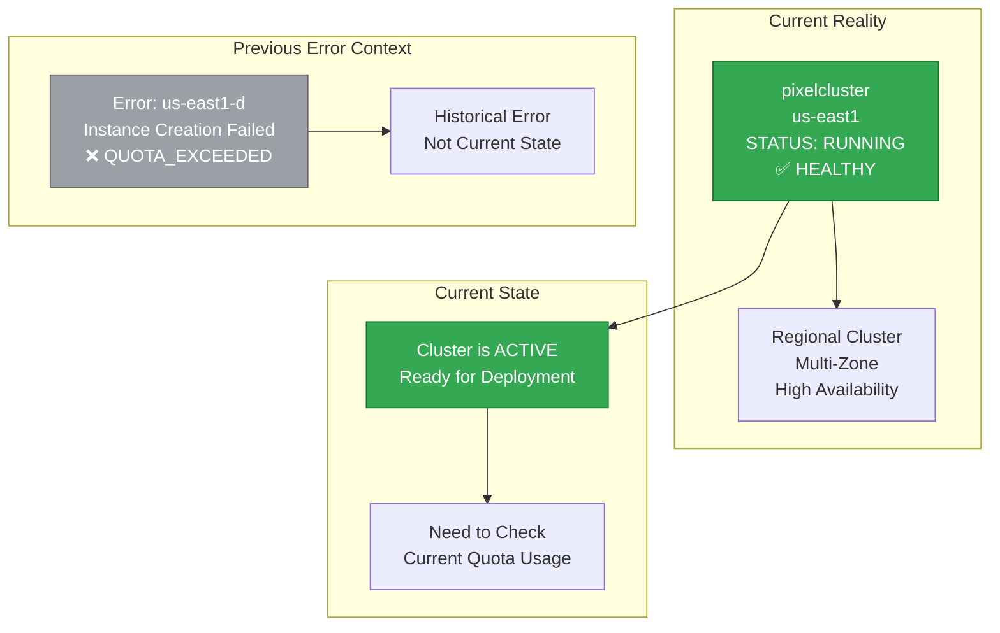
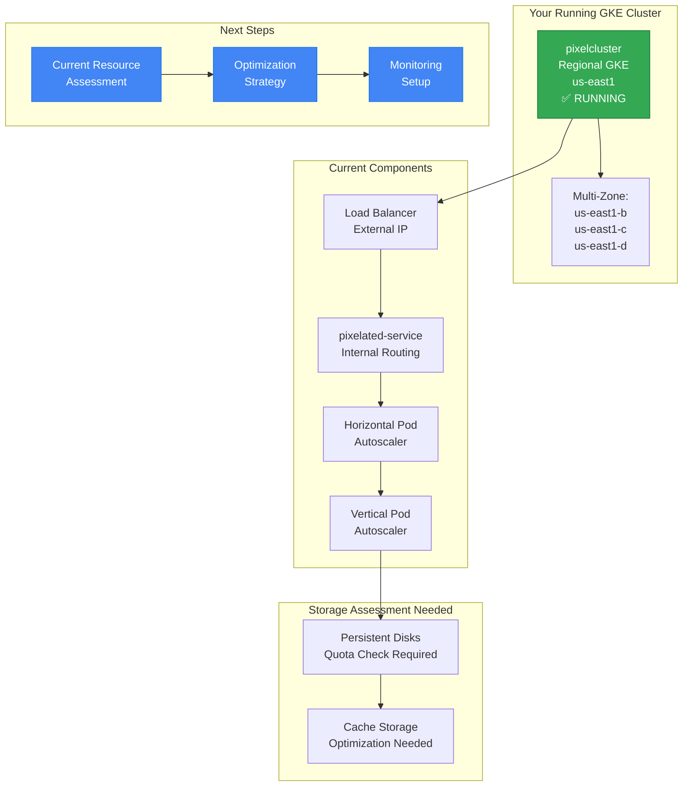
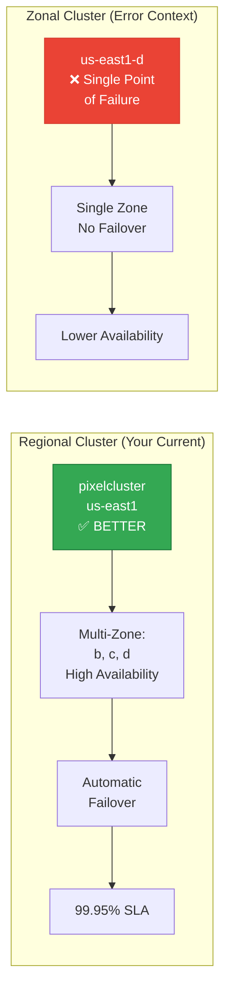

# Running GKE Cluster Analysis - Pixelated Empathy

## Current Cluster Status: ✅ RUNNING

Your cluster `pixelcluster` is **ACTIVE** in `us-east1` region (not us-east1-d zone as the error suggested). The error message was from a previous failed deployment attempt, but your cluster is actually operational.



## What This Means

### 1. Cluster is Operational
- Your cluster exists and is running
- It's a **regional cluster** (multi-zone) which is better than zonal
- You can deploy applications to it right now

### 2. The Error Was Historical
- The quota error was from a previous deployment attempt
- Instance templates were missing during that specific deployment
- Current cluster state needs fresh assessment

### 3. Need Current Assessment
- Check current quota usage
- Verify node pool configuration
- Assess actual resource consumption

## Updated Architecture for Running Cluster



## Immediate Action Plan

### 1. Get Current Cluster Details
```bash
# Get full cluster information
gcloud container clusters describe pixelcluster --region=us-east1 --project=pixelated-463209-e5

# Check node pools
gcloud container node-pools list --cluster=pixelcluster --region=us-east1 --project=pixelated-463209-e5

# Get cluster credentials
gcloud container clusters get-credentials pixelcluster --region=us-east1 --project=pixelated-463209-e5
```

### 2. Check Current Resource Usage
```bash
# Check current quota usage for entire us-east1 region
gcloud compute regions describe us-east1 --project=pixelated-463209-e5 --format="json" | jq '.quotas[] | {metric: .metric, usage: .usage, limit: .limit}'

# Check specific SSD usage
gcloud compute regions describe us-east1 --project=pixelated-463209-e5 --format="json" | jq '.quotas[] | select(.metric=="SSD_TOTAL_GB")'

# List all disks in the region
gcloud compute disks list --project=pixelated-463209-e5 --filter="zone~us-east1" --format="table(name,zone,sizeGb,type,status)"
```

### 3. Check Current Deployments
```bash
# Check what's currently running
kubectl get all --all-namespaces

# Check node status
kubectl get nodes -o wide

# Check system pods
kubectl get pods -n kube-system

# Check your application namespace
kubectl get all -n pixelated-prod  # or your namespace
```

## Regional vs Zonal Cluster Benefits



## Current Cluster Configuration Assessment

### 1. Node Pool Analysis
```yaml
# Check your current node pools
apiVersion: container.cnrm.cloud.google.com/v1beta1
kind: ContainerNodePool
metadata:
  name: pixelcluster-node-pool
spec:
  location: us-east1  # Regional location
  initialNodeCount: 3  # Current count
  autoscaling:
    minNodeCount: 3
    maxNodeCount: 10
  nodeConfig:
    machineType: e2-standard-4  # 4 vCPU, 16GB RAM
    diskType: pd-ssd  # This might be the quota issue
    diskSizeGb: 50
```

### 2. Resource Consumption Analysis
```bash
# Calculate current storage usage
TOTAL_SSD=$(gcloud compute disks list --project=pixelated-463209-e5 --filter="zone~us-east1 AND type=pd-ssd" --format="value(sizeGb)" | awk '{sum+=$1} END {print sum}')
echo "Total SSD usage: ${TOTAL_SSD}GB"

# Check if approaching quota
SSD_LIMIT=250
if [ "$TOTAL_SSD" -ge "$SSD_LIMIT" ]; then
    echo "⚠️ SSD quota exceeded or at limit"
fi
```

## Optimization Strategy for Running Cluster

### 1. Storage Optimization
```yaml
# Change from pd-ssd to pd-balanced for cost savings
apiVersion: container.cnrm.cloud.google.com/v1beta1
kind: ContainerNodePool
metadata:
  name: pixelcluster-optimized
spec:
  location: us-east1
  nodeConfig:
    machineType: e2-standard-4
    diskType: pd-balanced  # $0.10/GB vs $0.17/GB
    diskSizeGb: 30  # Reduced from 50
```

### 2. Right-sizing Resources
```yaml
# Optimized deployment
apiVersion: apps/v1
kind: Deployment
metadata:
  name: pixelated-app
spec:
  replicas: 2  # Reduced from 3
  template:
    spec:
      containers:
      - name: pixelated-web
        resources:
          requests:
            cpu: 500m      # 0.5 CPU
            memory: 1Gi    # 1GB RAM
          limits:
            cpu: 1000m     # 1 CPU max
            memory: 2Gi    # 2GB RAM max
```

### 3. Monitoring Setup
```yaml
# Quota monitoring
apiVersion: monitoring.coreos.com/v1
kind: PrometheusRule
metadata:
  name: quota-alerts
spec:
  groups:
  - name: quota.rules
    rules:
    - alert: SSDQuotaHigh
      expr: gcp_quota_ssd_usage / gcp_quota_ssd_limit > 0.8
      for: 5m
      annotations:
        summary: "SSD quota usage high on running cluster"
```

## Cost Optimization for Active Cluster

### 1. Immediate Actions (0-24 hours)
```bash
# Check current node pool and optimize
gcloud container node-pools list --cluster=pixelcluster --region=us-east1 --project=pixelated-463209-e5

# If using pd-ssd, migrate to pd-balanced
gcloud container clusters update pixelcluster --region=us-east1 --project=pixelated-463209-e5 \
  --node-pool=default-pool --disk-type=pd-balanced
```

### 2. Resource Optimization (24-48 hours)
```bash
# Scale down if over-provisioned
kubectl scale deployment pixelated-app --replicas=2

# Set resource limits
kubectl patch deployment pixelated-app -p '{"spec":{"template":{"spec":{"containers":[{"name":"pixelated-web","resources":{"requests":{"cpu":"500m","memory":"1Gi"},"limits":{"cpu":"1000m","memory":"2Gi"}}}]}}}}'
```

### 3. Monitoring Implementation (48-72 hours)
```bash
# Deploy monitoring stack
kubectl apply -f monitoring/prometheus-deployment.yaml
kubectl apply -f monitoring/grafana-deployment.yaml

# Set up quota alerts
kubectl apply -f monitoring/quota-alerts.yaml
```

## Summary

**Good News**: Your cluster `pixelcluster` is **RUNNING** and healthy in `us-east1` region.

**Action Items**:
1. **Run the status check script** to get current resource usage
2. **Check if you're approaching quota limits** 
3. **Optimize storage** (pd-balanced vs pd-ssd)
4. **Right-size deployments** based on actual usage
5. **Set up monitoring** to prevent future issues

The error you saw was from a historical deployment attempt, but your cluster is operational. Focus on optimization and monitoring rather than recovery.