# Single GKE Cluster Analysis - Pixelated Empathy

## Current Reality Check

You have **ONE GKE cluster** called `pixelcluster` in `us-east1-d` that is experiencing quota issues. The Terraform configurations and deployment scripts I found are:

- **Infrastructure planning** (not deployed)
- **Deployment automation** for your single cluster
- **Multiple deployment strategies** (blue-green, canary, rolling) for the same cluster

## Actual Problem: Single Cluster Failure

```mermaid
graph TD
    subgraph "Your Single GKE Cluster"
        GKE[pixelcluster<br/>us-east1-d<br/>❌ FAILED]
    end
    
    subgraph "The Real Problem"
        QUOTA[SSD_TOTAL_GB<br/>250GB Limit<br/>EXCEEDED]
        TEMPLATE[Missing Instance<br/>Templates]
        CREATE[Instance Creation<br/>FAILED]
    end
    
    subgraph "Current Status"
        DOWN[Cluster is DOWN<br/>No running pods]
        BLOCKED[Deployment<br/>BLOCKED]
    end
    
    GKE --> QUOTA
    QUOTA --> TEMPLATE
    TEMPLATE --> CREATE
    CREATE --> DOWN
    DOWN --> BLOCKED
    
    style GKE fill:#ea4335,stroke:#d33b2c,color:#fff
    style QUOTA fill:#fbbc04,stroke:#f29900,color:#000
    style DOWN fill:#9aa0a6,stroke:#5f6368,color:#fff
```



## What's Actually Happening

### 1. Single Cluster Configuration
```yaml
# Your actual cluster configuration from k8s/README.md
CLUSTER_NAME="pixelcluster"
ZONE="us-east1-b"  # Note: error shows us-east1-d
PROJECT_ID="pixelated-463209-e5"
```

### 2. The Real Error Context
```
- Google Compute Engine: The resource 'projects/pixelated-463209-e5/global/instanceTemplates/gke-pixelcluster-pixelcluster-node-po-13b93e96' was not found
- Google Compute Engine: The resource 'projects/pixelated-463209-e5/global/instanceTemplates/gke-pixelcluster-pixelcluster-node-po-d68d951c' was not found
- insufficient quota to satisfy the request: waiting on IG: instance https://www.googleapis.com/compute/v1/projects/pixelated-463209-e5/zones/us-east1-d/instances/gke-pixelcluster-pixelcluster-node-po-07042413-kgrz is still CREATING. Last attempt error: [QUOTA_EXCEEDED] Instance 'gke-pixelcluster-pixelcluster-node-po-07042413-kgrz' creation failed: Quota 'SSD_TOTAL_GB' exceeded. Limit: 250.0 in region us-east1.
```

## Simplified Architecture for Single Cluster


## Immediate Action Plan

### 1. Check Current Cluster Status (Right Now)
```bash
# Check if cluster actually exists
gcloud container clusters list --project=pixelated-463209-e5

# Check specific cluster status
gcloud container clusters describe pixelcluster --zone=us-east1-d --project=pixelated-463209-e5

# Check quota usage
gcloud compute project-info describe --project=pixelated-463209-e5 | grep -A 10 "quotas"
```

### 2. Quota Resolution (Immediate)
```bash
# Request SSD quota increase to 500GB
gcloud compute project-info add-metadata \
  --project=pixelated-463209-e5 \
  --metadata=quota-request="SSD_TOTAL_GB:500"

# Alternative: Optimize current usage
gcloud compute disks list --project=pixelated-463209-e5 --filter="zone:us-east1-d"
```

### 3. Cluster Recovery (24-48 hours)
```yaml
# Optimized single cluster configuration
apiVersion: container.cnrm.cloud.google.com/v1beta1
kind: ContainerCluster
metadata:
  name: pixelcluster
  namespace: config-control
spec:
  location: us-east1
  initialNodeCount: 2  # Reduced from planned 6
  nodeConfig:
    machineType: e2-standard-2  # Right-sized
    diskType: pd-balanced        # Cost-optimized
    diskSizeGb: 30               # Minimal boot disk
  autoscaling:
    minNodeCount: 2
    maxNodeCount: 6
```

## Single Cluster Architecture


## Cost-Optimized Single Cluster Configuration

### 1. Node Pool Strategy
```yaml
# Single optimized node pool
apiVersion: container.cnrm.cloud.google.com/v1beta1
kind: ContainerNodePool
metadata:
  name: pixelcluster-main-pool
spec:
  location: us-east1
  initialNodeCount: 2
  autoscaling:
    minNodeCount: 2
    maxNodeCount: 4
  nodeConfig:
    machineType: e2-standard-2      # 2 vCPU, 8GB RAM
    diskType: pd-balanced           # $0.10/GB vs $0.17/GB for SSD
    diskSizeGb: 30                  # Minimal boot disk
    preemptible: false              # Keep reliable for prod
```

### 2. Storage Optimization
```yaml
# Right-sized persistent storage
apiVersion: v1
kind: PersistentVolumeClaim
metadata:
  name: pixelated-data
spec:
  storageClassName: pd-balanced
  accessModes:
  - ReadWriteOnce
  resources:
    requests:
      storage: 50Gi  # Reduced from 100GB
```

### 3. Resource Limits
```yaml
# Optimized resource allocation
apiVersion: apps/v1
kind: Deployment
metadata:
  name: pixelated-app
spec:
  replicas: 2  # Reduced from 3
  template:
    spec:
      containers:
      - name: pixelated-web
        resources:
          requests:
            cpu: 250m      # 0.25 CPU
            memory: 512Mi  # 0.5GB RAM
          limits:
            cpu: 1000m     # 1 CPU max
            memory: 2Gi    # 2GB RAM max
```

## Monitoring for Single Cluster

```yaml
# Simplified monitoring setup
apiVersion: v1
kind: ConfigMap
metadata:
  name: cluster-monitoring
data:
  alerts.yaml: |
    groups:
    - name: cluster.health
      rules:
      - alert: ClusterDown
        expr: up{job="kubernetes-apiservers"} == 0
        for: 5m
        annotations:
          summary: "Single cluster is down"
          
      - alert: QuotaHigh
        expr: gcp_quota_ssd_usage / gcp_quota_ssd_limit > 0.8
        for: 1m
        annotations:
          summary: "SSD quota approaching limit"
```

## Deployment Strategy for Single Cluster

### 1. Blue-Green Deployment (Recommended)
```bash
# Deploy to green environment
kubectl apply -f deployment-green.yaml
kubectl rollout status deployment/pixelated-green

# Switch traffic
kubectl patch service pixelated-service -p '{"spec":{"selector":{"version":"green"}}}'

# Cleanup blue
kubectl delete deployment pixelated-blue
```

### 2. Rolling Updates (Fallback)
```bash
# Standard rolling deployment
kubectl set image deployment/pixelated-app pixelated-web=pixelated/new-version
kubectl rollout status deployment/pixelated-app
```

## Backup and Disaster Recovery

### 1. Single Cluster Backup
```yaml
# Daily backup job
apiVersion: batch/v1
kind: CronJob
metadata:
  name: cluster-backup
spec:
  schedule: "0 2 * * *"
  jobTemplate:
    spec:
      template:
        spec:
          containers:
          - name: backup
            image: gcr.io/google.com/cloudsdktool/cloud-sdk
            command:
            - /bin/bash
            - -c
            - |
              gcloud container clusters export pixelcluster \
                --zone=us-east1-d \
                --project=pixelated-463209-e5 \
                > cluster-backup-$(date +%Y%m%d).yaml
```

### 2. Regional Failover Plan
```bash
# If us-east1 fails, deploy to us-west1
gcloud container clusters create pixelcluster-backup \
  --zone=us-west1-a \
  --project=pixelated-463209-e5 \
  --machine-type=e2-standard-2 \
  --num-nodes=2 \
  --disk-type=pd-balanced \
  --disk-size=30
```

## Summary

You have **ONE GKE cluster** (`pixelcluster`) that's failing due to quota constraints. The solution is:

1. **Immediate**: Request SSD quota increase or optimize storage
2. **Short-term**: Right-size the cluster configuration 
3. **Long-term**: Implement proper backup and disaster recovery

The multi-cluster architecture I initially described was based on Terraform planning files, not actual deployed infrastructure. Your real focus should be getting this single cluster operational again.