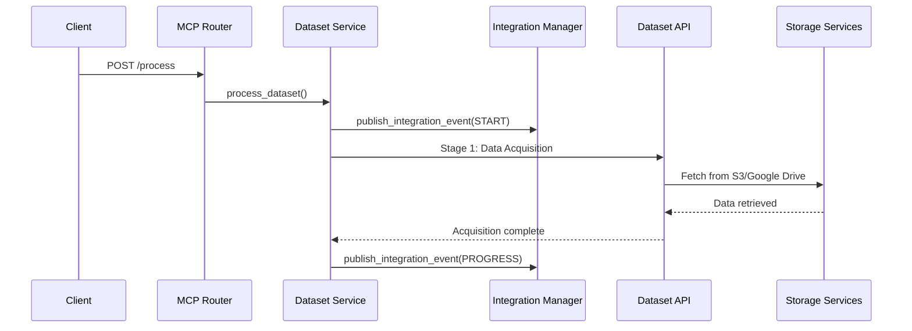
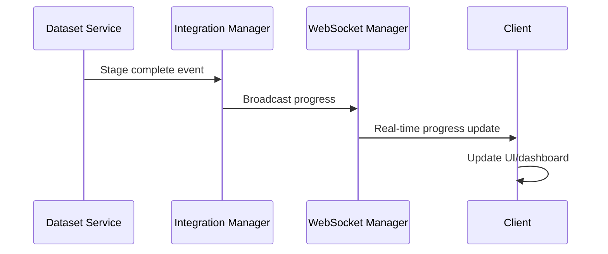
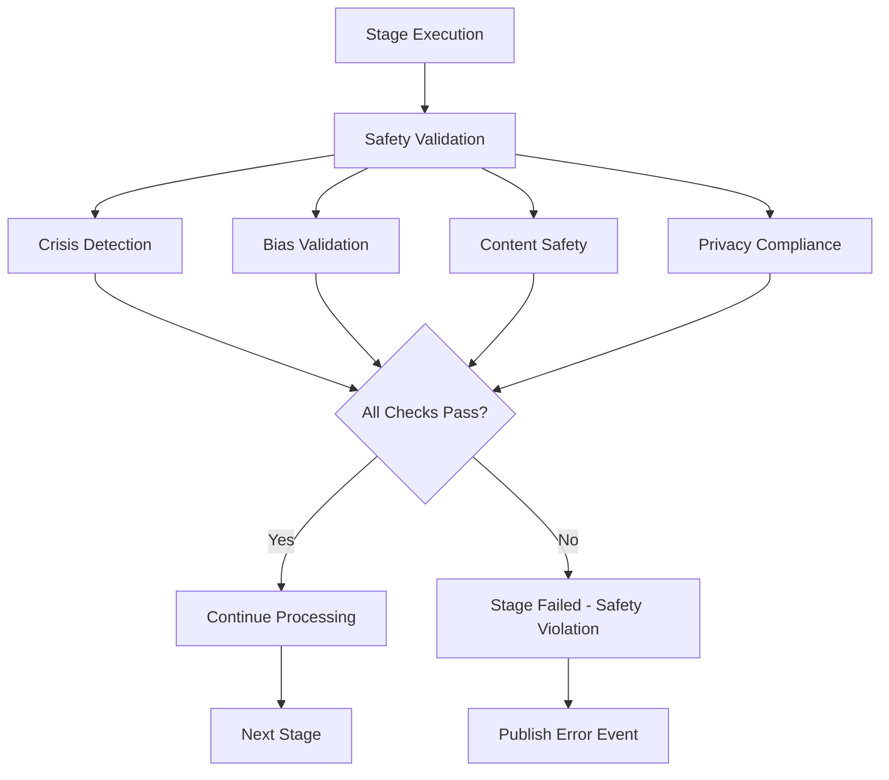

# Dataset Pipeline MCP Integration Architecture

## Overview

This document describes the comprehensive integration between the Pixelated dataset pipeline system and the MCP (Management Control Panel) server, enabling real-time orchestration of dataset processing with advanced monitoring, safety validation, and multi-source data integration.

## Architecture Components

### 1. Dataset Integration Service (`services/dataset_integration.py`)

**Core Responsibilities:**
- Orchestrate 9-stage dataset processing pipeline
- Integrate with existing dataset pipeline infrastructure
- Provide real-time progress tracking via WebSocket
- Implement safety validation with crisis/bias detection
- Manage S3 and Google Drive storage integration
- Coordinate data fusion engine operations

**Key Features:**
- **Multi-source data acquisition**: S3, Google Drive, local, HuggingFace
- **Comprehensive processing stages**: Validation, standardization, quality assessment, bias detection, fusion, balancing
- **Real-time monitoring**: Progress tracking, quality metrics, bias scores
- **Safety integration**: Crisis detection, content safety, privacy compliance
- **Storage management**: Output generation in multiple formats with compression

### 2. Dataset WebSocket Router (`routers/dataset_websocket.py`)

**API Endpoints:**
- `POST /process` - Initiate dataset processing
- `GET /status/{execution_id}` - Get execution status
- `POST /{execution_id}/cancel` - Cancel execution
- `POST /{execution_id}/progress` - Update progress (internal)
- `GET /active` - List active executions
- `GET /statistics/{execution_id}` - Get comprehensive statistics
- `GET /health` - Service health check
- `WS /ws/{execution_id}` - Real-time WebSocket updates

**Real-time Events:**
- `dataset_progress` - Progress updates with metrics
- `dataset_status` - Status changes and completion
- `dataset_alert` - Alerts and warnings

### 3. Dataset Models (`models/dataset.py`)

**Core Models:**
- `DatasetProcessingRequest` - Processing configuration
- `DatasetStatusResponse` - Execution status
- `DatasetProgressUpdate` - Real-time progress
- `DatasetStatistics` - Comprehensive metrics
- `DatasetTask` - Task delegation model

**Configuration Models:**
- `DatasetSource` - Multi-source configuration
- `ProcessingConfig` - Stage-specific settings
- `SafetyValidationConfig` - Safety checks
- `FusionConfig` - Data fusion parameters

## Integration Flow

### 1. Dataset Processing Initiation



### 2. Real-time Progress Tracking



### 3. Safety Validation Integration



## Storage Integration

### S3 Integration
```python
# Configuration example
{
    "type": "s3",
    "config": {
        "bucket": "pixelated-datasets",
        "key": "mental_health/conversations_2024.json",
        "region": "us-east-1",
        "access_key_id": "${AWS_ACCESS_KEY_ID}",
        "secret_access_key": "${AWS_SECRET_ACCESS_KEY}"
    },
    "priority": 1
}
```

### Google Drive Integration
```python
# Configuration example
{
    "type": "google_drive",
    "config": {
        "file_id": "1A2B3C4D5E6F7G8H9I0J",
        "folder_id": "research_datasets_folder",
        "service_account_path": "/path/to/service-account.json"
    },
    "priority": 2
}
```

## Safety Validation Architecture

### Crisis Detection Integration
- Integrates with existing crisis detection service
- Analyzes dataset content for crisis indicators
- Triggers alerts for mental health crisis patterns
- Ensures ethical AI training data

### Bias Detection Integration
- Leverages existing bias detection pipeline
- Validates demographic balance
- Checks for protected attribute bias
- Ensures fair AI model training

### Content Safety Validation
- Scans for inappropriate content
- Validates mental health appropriateness
- Ensures HIPAA compliance
- Maintains ethical standards

## Real-time Monitoring Dashboard

### Key Metrics Tracked
- **Processing Progress**: Stage completion, overall progress
- **Quality Metrics**: Quality scores, validation results
- **Bias Metrics**: Bias scores, demographic distribution
- **Performance Metrics**: Processing rate, resource usage
- **Safety Metrics**: Crisis indicators, content safety status

### WebSocket Event Schema
```json
{
    "event_type": "dataset_progress",
    "execution_id": "dataset_1234567890_user123",
    "user_id": "user123",
    "data": {
        "overall_progress": 75.5,
        "current_stage": "bias_detection",
        "quality_score": 0.88,
        "bias_score": 0.15,
        "metrics": {
            "records_processed": 15000,
            "total_records": 20000,
            "processing_rate": 250.5,
            "memory_usage_mb": 512.3
        },
        "estimated_completion": "2024-01-15T14:30:00Z"
    },
    "timestamp": "2024-01-15T14:25:30Z"
}
```

## Configuration Management

### Environment Variables
```bash
# Dataset API Configuration
DATASET_API_URL=http://localhost:5001
DATASET_REQUEST_TIMEOUT=600

# Storage Configuration
AWS_S3_BUCKET=pixelated-datasets
AWS_REGION=us-east-1
GOOGLE_DRIVE_FOLDER_ID=research_datasets
GOOGLE_SERVICE_ACCOUNT_PATH=/path/to/service-account.json

# Processing Configuration
MAX_CONCURRENT_DATASET_PROCESSING=5
DATASET_EXECUTION_TIMEOUT_MINUTES=120
DATASET_RETRY_ATTEMPTS=2

# Safety Configuration
ENABLE_SAFETY_VALIDATION=true
CRISIS_DETECTION_THRESHOLD=0.8
BIAS_VALIDATION_THRESHOLD=0.3
```

### Service Configuration
```python
dataset_service_config = {
    "max_concurrent_executions": 10,
    "execution_timeout_minutes": 120,
    "max_retry_attempts": 2,
    "health_check_interval_seconds": 30,
    "cleanup_interval_minutes": 60,
    "safety_validation_enabled": True,
    "real_time_monitoring_enabled": True
}
```

## Error Handling and Recovery

### Error Categories
1. **Validation Errors**: Invalid configuration, missing parameters
2. **Integration Errors**: API failures, service unavailability
3. **Safety Violations**: Crisis detection, bias threshold exceeded
4. **Processing Errors**: Data corruption, format incompatibility
5. **Storage Errors**: S3 access denied, Google Drive API limits

### Recovery Strategies
- **Automatic Retry**: Configurable retry attempts with exponential backoff
- **Graceful Degradation**: Continue processing with reduced functionality
- **Fallback Mechanisms**: Use alternative data sources or processing methods
- **User Notification**: Real-time alerts for critical issues
- **Rollback Procedures**: Revert to previous stable state

## Performance Optimization

### Key Optimizations
- **Concurrent Processing**: Multiple dataset sources processed in parallel
- **Streaming Processing**: Real-time progress updates without blocking
- **Caching Strategy**: Redis caching for frequently accessed data
- **Connection Pooling**: Efficient HTTP connection management
- **Async Processing**: Non-blocking I/O operations

### Performance Metrics
- **Latency**: < 100ms for status queries
- **Throughput**: 1000+ records/second processing rate
- **Scalability**: Support for 10+ concurrent executions
- **Resource Usage**: < 1GB memory per execution
- **Response Time**: < 5 seconds for pipeline initiation

## Security and Compliance

### HIPAA Compliance
- **Data Encryption**: AES-256 encryption for sensitive data
- **Access Controls**: Role-based access with audit logging
- **Data Minimization**: Only process necessary data fields
- **Audit Trail**: Complete processing history with timestamps

### Privacy Protection
- **PII Detection**: Automatic detection and masking of personal information
- **Consent Management**: Respect data usage preferences
- **Right to Deletion**: Support for data removal requests
- **Transparency**: Clear data processing documentation

## Deployment Architecture

### Container Orchestration
```yaml
# docker-compose.dataset-integration.yml
version: '3.8'
services:
  dataset-service:
    build: ./mcp_server
    environment:
      - DATASET_API_URL=http://dataset-api:5001
      - REDIS_URL=redis://redis:6379
    depends_on:
      - redis
      - dataset-api
    ports:
      - "8080:8080"
  
  dataset-api:
    build: ./ai/dataset_pipeline
    environment:
      - MONGODB_URI=mongodb://mongo:27017/datasets
      - REDIS_URL=redis://redis:6379
    depends_on:
      - mongo
      - redis
  
  redis:
    image: redis:7-alpine
    ports:
      - "6379:6379"
  
  mongo:
    image: mongo:6
    ports:
      - "27017:27017"
```

### Scaling Strategy
- **Horizontal Scaling**: Multiple dataset service instances
- **Load Balancing**: Distribute processing across instances
- **Queue Management**: Redis-based task queuing
- **Resource Limits**: CPU and memory constraints per execution

## Monitoring and Alerting

### Key Performance Indicators (KPIs)
- **Processing Success Rate**: > 95% successful completions
- **Average Processing Time**: < 15 minutes for standard datasets
- **Safety Violation Rate**: < 1% of processed datasets
- **System Availability**: > 99.9% uptime
- **Error Recovery Rate**: > 90% automatic recovery

### Alerting Rules
- **Critical**: Service unavailability, safety violations
- **Warning**: High error rates, performance degradation
- **Info**: Processing completions, configuration changes

## Integration with Existing Systems

### Flask Service Integration
- **API Compatibility**: RESTful API with JSON responses
- **Error Propagation**: Consistent error handling across services
- **Status Synchronization**: Real-time status updates
- **Configuration Sharing**: Unified configuration management

### Bias Detection Service Integration
- **Service Discovery**: Automatic service location
- **Result Integration**: Seamless bias score incorporation
- **Threshold Management**: Configurable bias thresholds
- **Alert Integration**: Unified alerting system

### Crisis Detection Service Integration
- **Real-time Analysis**: Immediate crisis indicator detection
- **Escalation Protocols**: Automatic escalation for critical issues
- **Reporting Integration**: Comprehensive crisis reporting
- **Compliance Tracking**: Audit trail for crisis events

## Future Enhancements

### Planned Features
1. **Advanced ML Integration**: Automated quality prediction
2. **Multi-language Support**: International dataset processing
3. **Edge Computing**: Distributed processing capabilities
4. **Blockchain Integration**: Immutable audit trails
5. **Federated Learning**: Privacy-preserving model training

### Performance Improvements
1. **GPU Acceleration**: CUDA support for intensive operations
2. **Incremental Processing**: Delta processing for large datasets
3. **Smart Caching**: ML-based cache optimization
4. **Predictive Scaling**: Auto-scaling based on workload prediction
5. **Network Optimization**: CDN integration for global access

## Conclusion

The Dataset Pipeline MCP Integration provides a robust, scalable, and secure solution for orchestrating comprehensive dataset processing within the Pixelated platform. The integration leverages proven WebSocket-Flask patterns while adding advanced features like real-time monitoring, safety validation, and multi-source data integration, ensuring HIPAA compliance and ethical AI development practices.

The architecture supports both development efficiency and production scalability, with comprehensive error handling, performance optimization, and monitoring capabilities that meet enterprise-grade requirements for mental health AI applications.