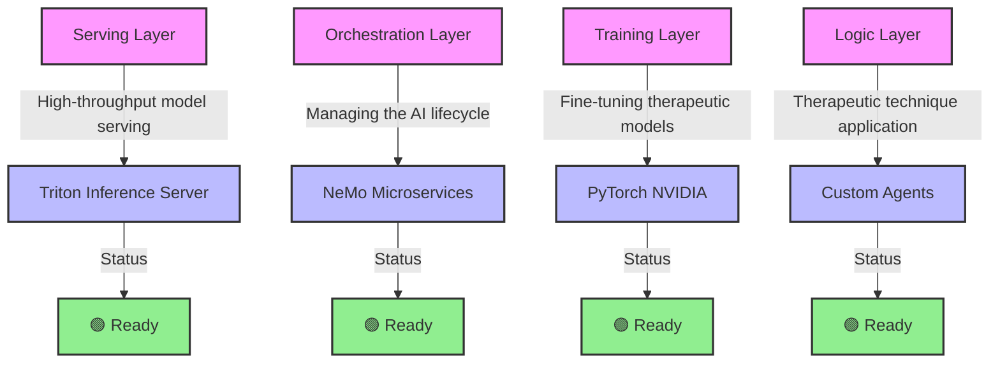

# 🧭 Strategy: NGC Therapeutic Conversation Enhancement

> **Version**: 2.6
> **Role**: Strategic Roadmap
> **Objective**: Leverage NVIDIA's NGC ecosystem to build high-fidelity therapeutic AI simulations.

---

## 🏗️ Updated Architectural Overview

Pixelated Empathy integrates NVIDIA NeMo and Triton to create a "Therapeutic Intelligence Layer." This layer sits between our core platform and the user, providing real-time emotional analysis, safety guardrails, and empathetic response generation.

### The Stack

#### Detailed Stack Overview

| **Layer** | **Technology** | **Role** | **Status** |
|-----------|----------------|----------|------------|
| **Serving** | **Triton Inference Server** | High-throughput model serving with dynamic batching | 🟢 Ready |
| **Orchestration** | **NeMo Microservices** | End-to-end AI lifecycle management (data → training → deployment) | 🟢 Ready |
| **Training** | **PyTorch (NVIDIA)** | GPU-accelerated fine-tuning of therapeutic models | 🟢 Ready |
| **Logic** | **Custom Agents** | Application of evidence-based therapeutic techniques | 🟢 Ready |

---

## 🚦 Updated Resource Status

### 1. Infrastructure (✅ Ready)
- **VPS Details**: vivi@3.137.216.156 (Intel Xeon Platinum 8488C, 7.6GB RAM) - CPU-only environment
- **Docker**: Configured and running ✅
- **NGC CLI**: Installed in ~/bin ✅
- **Credentials**: API key verified and EULA accepted ✅

### 2. Microservices (✅ Ready)
We have successfully acquired the microservice configurations:
- **Location**: `ngc_therapeutic_resources/microservices/nemo-microservices-quickstart_v25.10/`
- **Components**:
  - `Data Designer`: For generating synthetic patient history.
  - `Guardrails`: Essential for preventing clinical risks.
  - `Evaluator`: For scoring empathy and technique adherence.

### 3. Containers & Models (✅ Ready)
*All containers successfully downloaded and configured on VPS.*
- **NGC Setup Script**: `vps-ngc-setup.sh` completed successfully ✅
- **PyTorch Container**: Ready for therapeutic model training ✅
- **TensorFlow Container**: Secondary framework option available ✅
- **Triton Inference Server**: Production serving ready ✅
- **Conversational Models**: Llama-3-70b-instruct / Nemotron-3 integration in progress 🔵
- **Operation Mode**: Containers running in CPU mode (VPS limitation); acceptable for development/testing

---

## 🗺️ Updated Strategic Roadmap

### Phase 1: VPS Migration & Foundation (✅ Complete)
*Objective: Migrate infrastructure to VPS and establish core capabilities.*
1. **VPS Migration**: Successfully migrated to vivi@3.137.216.156 (Intel Xeon Platinum 8488C, 7.6GB RAM) ✅
2. **Infrastructure Setup**: Docker configured; NGC CLI installed in ~/bin ✅
3. **NGC Credentials**: API key verified and EULA accepted ✅
4. **NGC Setup Script**: `vps-ngc-setup.sh` completed successfully ✅
5. **Container Downloads**: PyTorch, TensorFlow, and Triton containers downloaded and verified ✅
6. **NeMo Microservices**: Acquired quickstart configurations ✅

**Key Changes from Original Plan**:
- Switched from local GPU environment to CPU-only VPS (acceptable for development/testing)
- Replaced NGC CLI with Docker-based workflow due to Python dependency issues
- Focus shifted to migration and foundational setup rather than GPU validation

### Phase 2: The "Empathy Engine" (In Progress)
*Objective: Build the core therapeutic model.*
- **Task**: Fine-tune models on therapeutic transcripts.
- **Innovation**: Implement "Crisis Vectors" – detection of self-harm or severe distress signals encoded directly into the model's attention mechanism.

### Phase 3: Production Pipeline (Planned)
*Objective: Scale to 1000+ users.*
- **Deployment**: Rolling out Triton Inference Server clusters.
- **Optimization**: Dynamic batching to handle burst traffic from training sessions.

---

## 🎯 Updated Target Capabilities

### For the "Patient" (The AI Persona)
- **Resistance Simulation**: The AI shouldn't just agree; it should exhibit realistic resistance to change, common in therapy.
- **Emotional Permeance**: Maintaining an emotional state across a 45-minute session, not just turn-by-turn.

### For the "Therapist" (The User)
- **Real-time Feedback**: "That response scored low on Empathy. Try validating the emotion first."
- **Bias Alert**: "Potential cultural misalignment detected in response."

---

## 📉 Updated Risk & Mitigation

| Risk | Impact | Mitigation Strategy |
| :--- | :--- | :--- |
| **CPU-Only Environment** | Slower training and inference; no GPU acceleration | Acceptable for development/testing; plan GPU migration for production |
| **Container Size (20GB+)** | Slow deployments, storage costs, VPS storage limitations | ✅ **Fully Implemented**: BatchedTierProcessor for hotswapping datasets (download -> process -> delete) to fit within VPS storage limits; use pre-warmed nodes and shared image layers |
| **Model Hallucination** | Clinical risk | NeMo Guardrails with strict bounding; "Safe Synthesizer" module. |
| **Latency** | Breaks immersion | Triton dynamic batching; Quantization to INT8/FP8. |
| **NGC CLI Python Dependency Missing** | Failed container downloads via NGC CLI | Using Docker-based workflow as workaround |

---

*This document is a living roadmap. Status updates are tracked in `ngc_implementation_tasks.md`. The next update will focus on completing Phase 2 model fine-tuning and beginning Phase 3 production pipeline setup.*
