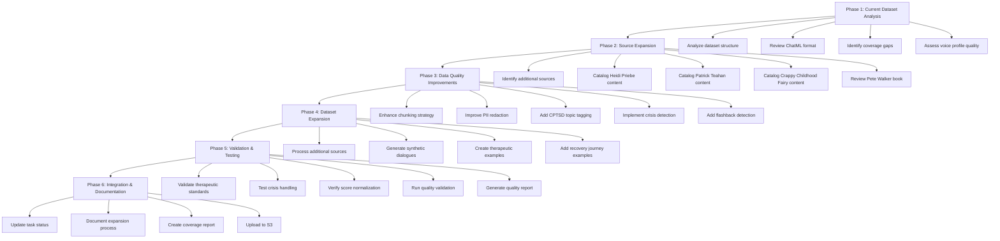

# CPTSD Dataset Quality & Coverage Improvement Plan

## Executive Summary

The CPTSD dataset has been initially generated from Tim Fletcher transcripts
(91 examples, 2026-01-26). This plan outlines a comprehensive approach to
improve dataset quality, expand coverage with additional sources, and ensure
therapeutic standards compliance.

## Current State Analysis

### Existing Dataset

- **Source**: Tim Fletcher transcripts (91 files)
- **Output**: `ai/training/ready_packages/data/generated/cptsd_transcripts.jsonl`
- **S3 Location**: `s3://pixel-data/datasets/gdrive/processed/edge_cases/cptsd/cptsd_transcripts.jsonl`
- **Format**: ChatML with CPTSD-specific metadata
- **Voice Profile**: Tim Fletcher voice profile integrated
- **Chunking**: 1 chunk per file (max 6 chunks configured, only 1 used)
- **Generated**: 2026-01-26
- **Stats**: `ai/training/ready_packages/data/generated/cptsd_transcripts_stats.json`

### Identified Issues

1. **Limited Source Diversity**: Only Tim Fletcher content processed
2. **Underutilized Chunking**: Only 1 chunk per file despite 6-chunk capacity
3. **Missing CPTSD-Specific Features**: No topic tagging, crisis detection,
   or emotional flashback detection
4. **Incomplete Coverage**: Additional CPTSD sources available but not processed

## Workflow Diagram



## Phase 1: Current Dataset Analysis

### 1.1 Analyze Dataset Structure

- Review existing ChatML format in `cptsd_transcripts.jsonl`
- Examine metadata completeness and structure
- Assess content hash deduplication effectiveness
- Validate PII redaction patterns

### 1.2 Review ChatML Format

- Verify message structure (system, user, assistant roles)
- Check system prompt quality and voice profile integration
- Validate metadata fields (source_family, content_hash, provenance)
- Ensure proper UTF-8 encoding

### 1.3 Identify Coverage Gaps

- Analyze CPTSD topics covered in current 91 examples
- Identify missing CPTSD subtopics (emotional flashbacks, triggers, recovery stages)
- Map coverage against Pete Walker's CPTSD framework
- Assess diversity of therapeutic approaches

### 1.4 Assess Voice Profile Quality

- Review Tim Fletcher voice profile integration
- Evaluate empathy markers and teaching patterns
- Assess transition phrases usage
- Validate voice consistency across examples

## Phase 2: Source Expansion

### 2.1 Identify Additional Sources

Based on S3 manifest analysis, the following CPTSD sources are available:

- **Heidi Priebe**
  - Location: `tier4_voice_persona/Heidi Priebe/`
  - Estimated Files: ~5 files
  - Content: CPTSD education, shame cycles

- **Patrick Teahan**
  - Location: `tier4_voice_persona/Patrick Teahan/`
  - Estimated Files: ~3 files
  - Content: PTSD/CPTSD shame examples

- **Crappy Childhood Fairy**
  - Location: `tier4_voice_persona/Crappy Childhood Fairy/`
  - Estimated Files: ~10 files
  - Content: CPTSD healing phases

- **Pete Walker Book**
  - Location: `ai/lightning/ghost/books/`
  - Estimated Files: 1 EPUB
  - Content: Comprehensive CPTSD guide

### 2.2 Catalog Heidi Priebe Content

- Extract CPTSD-specific transcripts
- Identify shame-procrastination cycle content
- Catalog healing signs and realistic recovery examples
- Tag content by CPTSD subtopic

### 2.3 Catalog Patrick Teahan Content

- Extract PTSD/CPTSD shame examples
- Identify trauma-informed approaches
- Catalog emotional regulation techniques
- Tag content by therapeutic modality

### 2.4 Catalog Crappy Childhood Fairy Content

- Extract CPTSD healing phase content
- Identify trauma recovery frameworks
- Catalog emotional flashback management
- Tag content by recovery stage

### 2.5 Review Pete Walker Book

- Extract key CPTSD concepts from EPUB
- Identify emotional flashbacks and triggers
- Catalog survival responses (fight, flight, freeze, fawn)
- Map content to therapeutic frameworks

## Phase 3: Data Quality Improvements

### 3.1 Enhance Chunking Strategy

**Current Issue**: Only 1 chunk per file generated

**Improvements**:

- Increase max chunks per file from 6 to 12 for better coverage
- Implement semantic chunking based on topic boundaries
- Preserve context across chunks with overlap
- Add chunk metadata (topic, emotional intensity, recovery stage)

### 3.2 Improve PII Redaction

**Current Patterns**: Email, phone, URL, timestamp

**CPTSD-Specific Additions**:

- Add location redaction (cities, addresses)
- Add name redaction patterns (first/last names)
- Add date redaction for personal events
- Add medical/therapy reference redaction

### 3.3 Add CPTSD-Specific Topic Tagging

**Topic Categories**:

- Emotional Flashbacks
- Triggers & Trauma Responses
- Survival Responses (fight, flight, freeze, fawn)
- Shame & Toxic Shame
- Emotional Regulation
- Recovery Stages
- Inner Child Work
- Boundary Setting
- Self-Compassion
- Healing Milestones

### 3.4 Implement Crisis Signal Detection

**CPTSD-Specific Crisis Indicators**:

- **Self-Harm Ideation** (Severity: CRITICAL)
  - Keywords: hurt myself, cut, burn, self-harm, self-injure, want to die,
    end it all

- **Suicidal Thoughts** (Severity: CRITICAL)
  - Keywords: suicide, kill myself, not worth living, better off dead, ending it

- **Severe Dissociation** (Severity: HIGH)
  - Keywords: not real, detached, floating, watching myself, numb, checked out

- **Trauma Re-enactment** (Severity: HIGH)
  - Keywords: happening again, back there, reliving, flashback, triggered

- **Emotional Overwhelm** (Severity: MEDIUM)
  - Keywords: too much, can't cope, drowning, suffocating, breaking point

- **Crisis Escalation** (Severity: MEDIUM)
  - Keywords: getting worse, spiraling, losing control, can't stop

**Detection Implementation**:

```python
# Crisis detection patterns for CPTSD content
CRISIS_PATTERNS = {
    'self_harm': [
        r'\bhurt myself\b',
        r'\bcut\b.*\bskin\b',
        r'\bburn\b.*\bmyself\b',
        r'\bself-harm\b',
        r'\bself-injure\b',
        r'\bwant to die\b',
        r'\bend it all\b',
        r'\bkill myself\b',
    ],
    'suicidal': [
        r'\bsuicide\b',
        r'\bsuicidal\b',
        r'\bnot worth living\b',
        r'\bbetter off dead\b',
        r'\bending it\b',
        r'\bno point\b.*\bbeing alive\b',
    ],
    'dissociation': [
        r'\bnot real\b',
        r'\bdetached\b',
        r'\bfloating\b',
        r'\bwatching myself\b',
        r'\bnumb\b',
        r'\bchecked out\b',
        r'\bdissociat',
    ],
    'trauma_reenactment': [
        r'\bhappening again\b',
        r'\bback there\b',
        r'\breliving\b',
        r'\bflashback\b',
        r'\btriggered\b',
        r'\btrauma\b.*\bback\b',
    ],
    'emotional_overwhelm': [
        r'\btoo much\b',
        r'\bcan.t cope\b',
        r'\bdrowning\b',
        r'\bsuffocating\b',
        r'\bbreaking point\b',
        r'\boverwhelm',
    ],
    'crisis_escalation': [
        r'\bgetting worse\b',
        r'\bspiraling\b',
        r'\blosing control\b',
        r'\bcan.t stop\b',
        r'\bescalating\b',
    ],
}

# Severity scoring
SEVERITY_WEIGHTS = {
    'self_harm': 1.0,
    'suicidal': 1.0,
    'dissociation': 0.8,
    'trauma_reenactment': 0.8,
    'emotional_overwhelm': 0.6,
    'crisis_escalation': 0.7,
}

# Crisis threshold
CRISIS_THRESHOLD = 0.7  # Score above this triggers crisis flag
```

**Detection Algorithm**:

1. **Pattern Matching**: Scan text for crisis keyword patterns using regex
2. **Context Analysis**: Evaluate surrounding context for severity indicators
3. **Severity Scoring**: Calculate weighted score based on pattern matches
4. **Crisis Classification**:
   - CRITICAL (score >= 0.9): Immediate intervention required
   - HIGH (0.7 <= score < 0.9): Urgent attention needed
   - MEDIUM (0.5 <= score < 0.7): Monitor closely
   - LOW (score < 0.5): No immediate crisis

5. **Metadata Tagging**:

   ```json
   {
     "crisis_detected": true,
     "crisis_type": "self_harm",
     "crisis_severity": "CRITICAL",
     "crisis_score": 0.95,
     "crisis_keywords": ["hurt myself", "end it all"],
     "crisis_resources": [
       "National Suicide Prevention Lifeline: 988",
       "Crisis Text Line: Text HOME to 741741",
       "International Association for Suicide Prevention"
     ]
   }
   ```

6. **Flagging for Review**: All CRITICAL and HIGH severity examples flagged for
   human review

**CPTSD-Specific Considerations**:

- **Flashback Context**: Distinguish between educational content about
  flashbacks vs. actual flashback experiences
- **Trauma Triggers**: Identify trigger language without flagging therapeutic
  trigger discussions
- **Survival Responses**: Recognize fight/flight/freeze/fawn responses as
  trauma responses, not crisis
- **Recovery Language**: Differentiate between crisis language and recovery
  journey language

**Validation Requirements**:

- False positive rate < 5%
- False negative rate < 1% (never miss actual crisis)
- Context accuracy > 95%
- Resource link validity 100%

### 3.5 Add Emotional Flashback Detection

**Flashback Indicators**:

- Sudden emotional intensity shifts
- Trauma trigger language
- Dissociation markers
- Time distortion references
- Body sensation descriptions

**Detection Approach**:

- NLP-based pattern recognition
- Emotional intensity scoring
- Contextual trigger identification
- Flashback severity classification

## Phase 4: Dataset Expansion

### 4.1 Process Additional Sources

**Script Enhancement**:

- Modify `build_cptsd_dataset_from_transcripts.py` to support multiple source directories
- Add source-specific voice profiles (Heidi Priebe, Patrick Teahan, etc.)
- Implement source weighting for balanced representation
- Add source diversity metrics

**Processing Pipeline**:

1. Scan all identified CPTSD sources
2. Apply enhanced chunking strategy
3. Generate ChatML format with source-specific voice
4. Add CPTSD topic tags
5. Run crisis and flashback detection
6. Validate PII redaction
7. Generate quality metrics

### 4.2 Generate Synthetic CPTSD Dialogues

**Dialogue Scenarios**:

- Client experiencing emotional flashback
- Therapist guiding trigger identification
- Client practicing emotional regulation
- Therapist explaining survival responses
- Client sharing recovery milestone
- Therapist validating shame experiences

**Generation Approach**:

- Use existing transcripts as style templates
- Generate diverse client presentations
- Ensure therapeutic best practices
- Validate against CPTSD frameworks
- Add crisis escalation/de-escalation examples

### 4.3 Create CPTSD-Specific Therapeutic Response Examples

**Response Categories**:

- Flashback grounding techniques
- Trigger management strategies
- Shame validation responses
- Emotional regulation guidance
- Recovery milestone celebration
- Boundary setting support
- Inner child connection exercises

**Quality Standards**:

- Trauma-informed language
- Avoid re-traumatization
- Validate without minimizing
- Provide actionable steps
- Maintain hope and agency

### 4.4 Add CPTSD Recovery Journey Progression Examples

**Recovery Stages** (based on Pete Walker's framework):

1. **Awareness**: Recognizing CPTSD patterns
2. **Stabilization**: Building safety and regulation
3. **Processing**: Working through trauma memories
4. **Integration**: Incorporating new coping skills
5. **Thriving**: Living beyond survival mode

**Progression Examples**:

- Stage-specific challenges and breakthroughs
- Therapeutic techniques for each stage
- Client reflections and insights
- Therapist guidance and support
- Setback and recovery narratives

## Phase 5: Validation & Testing

### 5.1 Validate Therapeutic Standards

**Validation Criteria**:

- Trauma-informed language usage
- Avoidance of re-traumatizing content
- Proper crisis handling
- Evidence-based techniques
- Cultural sensitivity
- Ethical considerations

**Validation Process**:

- Manual review of sample examples
- Automated pattern checking
- Therapeutic framework alignment
- Crisis signal verification
- PII redaction verification

### 5.2 Test Crisis Signal Handling

**Test Scenarios**:

- Self-harm ideation detection
- Suicidal thought identification
- Severe dissociation recognition
- Crisis escalation patterns
- Appropriate resource provision

**Testing Approach**:

- Synthetic crisis examples
- Edge case testing
- False positive/negative analysis
- Resource link validation
- Escalation protocol testing

### 5.3 Verify Emotional Score Normalization

**Validation Requirements**:

- All emotion scores in 0.0-1.0 range
- Proper score distribution
- No out-of-bounds values
- Consistent scoring methodology
- Score metadata completeness

**Testing Process**:

- Automated score range validation
- Distribution analysis
- Outlier detection
- Metadata verification
- Cross-source consistency

### 5.4 Run Quality Validation Pipeline

**Quality Gates**:

- PII redaction completeness
- Crisis signal detection accuracy
- Emotional score normalization
- ChatML format compliance
- Metadata completeness
- Content hash uniqueness
- UTF-8 encoding validation

**Pipeline Steps**:

1. Run automated quality checks
2. Generate quality metrics report
3. Flag issues for review
4. Manual review of flagged items
5. Issue resolution and re-validation
6. Final quality certification

### 5.5 Generate Comprehensive Quality Report

**Report Contents**:

- Dataset statistics (total examples, sources, topics)
- Quality metrics (PII redaction, crisis detection, scores)
- Coverage analysis (CPTSD topics, recovery stages)
- Source diversity metrics
- Voice profile integration quality
- Issue summary and resolution
- Recommendations for future improvements

## Phase 6: Integration & Documentation

### 6.1 Update Task Status

- Update `.memory/40-active.md` with completion status
- Mark CPTSD dataset task as COMPLETED
- Document completion date and key metrics
- Update overall Phase 1 progress

### 6.2 Document CPTSD Dataset Expansion Process

**Documentation Contents**:

- Source identification and selection criteria
- Processing pipeline description
- Quality improvement implementations
- Validation methodology
- Lessons learned and recommendations

### 6.3 Create CPTSD Coverage Analysis Report

**Report Contents**:

- Topic coverage matrix
- Recovery stage distribution
- Source contribution analysis
- Voice profile diversity
- Therapeutic approach variety
- Gaps and future expansion opportunities

### 6.4 Upload Final Dataset to S3

**Upload Process**:

- Generate final JSONL file
- Create comprehensive stats file
- Upload to `s3://pixel-data/gdrive/processed/edge_cases/cptsd/`
- Verify upload integrity
- Update S3 manifest
- Document S3 location and access

## Success Criteria

### Quantitative Metrics

- **Total Examples**: Target 500+ CPTSD training examples
- **Source Diversity**: Minimum 4 distinct sources
- **Topic Coverage**: All 10 CPTSD topics represented
- **Recovery Stages**: All 5 recovery stages covered
- **Quality Score**: 95%+ on quality validation pipeline

### Qualitative Metrics

- **Therapeutic Soundness**: All examples validated against trauma-informed standards
- **Crisis Handling**: Proper crisis signal detection and response
- **Voice Diversity**: Multiple therapeutic voices represented
- **Content Authenticity**: Genuine CPTSD experiences and guidance
- **Ethical Compliance**: HIPAA-level privacy and ethical standards

## Risk Mitigation

### Potential Risks

1. **Insufficient Source Material**: Limited CPTSD content available
   - **Mitigation**: Generate synthetic dialogues to fill gaps

2. **Quality Inconsistency**: Variable quality across sources
   - **Mitigation**: Implement rigorous quality validation pipeline

3. **Crisis Signal False Positives**: Over-detection of crisis content
   - **Mitigation**: Contextual analysis and manual review

4. **Voice Profile Conflicts**: Inconsistent therapeutic voices
   - **Mitigation**: Source-specific voice profiles and validation

5. **PII Redaction Failures**: Incomplete privacy protection
   - **Mitigation**: Enhanced redaction patterns and validation

## Next Steps

1. **Immediate**: Begin Phase 1 analysis of existing dataset
2. **Short-term**: Complete source cataloging (Phase 2)
3. **Medium-term**: Implement quality improvements (Phase 3)
4. **Long-term**: Complete dataset expansion and validation (Phases 4-6)

## Dependencies

- **Existing Script**: `ai/training/ready_packages/scripts/build_cptsd_dataset_from_transcripts.py`
- **Voice Profiles**: `ai/data/tim_fletcher_voice/tim_fletcher_voice_profile.json`
- **S3 Manifest**: `ai/training/ready_packages/data/s3_manifest.json`
- **Quality Pipeline**: Existing validation scripts in `ai/training/ready_packages/scripts/`

## Resources

- **Pete Walker's CPTSD Framework**: Complex PTSD: From Surviving to Thriving
- **Trauma-Informed Care Guidelines**: SAMHSA Trauma-Informed Care
  Implementation Resource Center
- **Crisis Intervention Standards**: National Suicide Prevention Lifeline protocols
- **HIPAA Privacy Standards**: 45 CFR Parts 160 and 164

---

**Document Version**: 1.0
**Created**: 2026-02-10
**Status**: Draft - Pending Review
