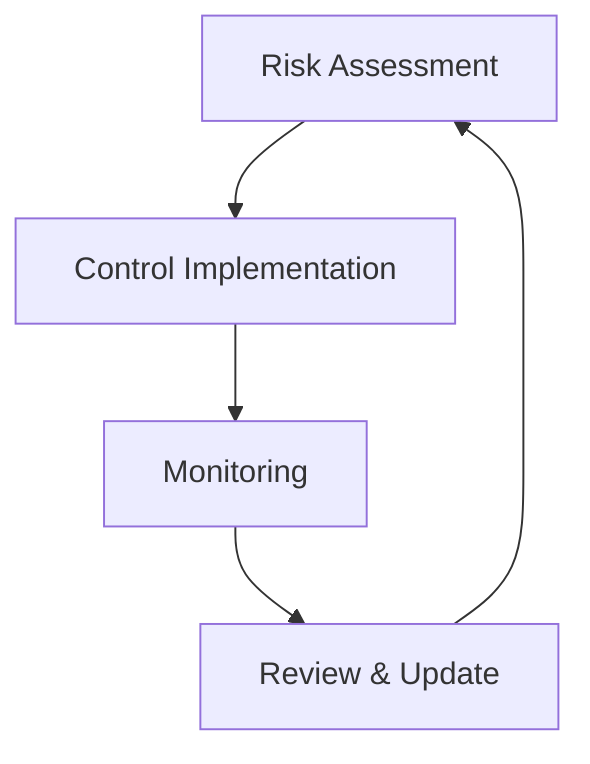

## Compliance & Standards

Pixelated maintains strict compliance with healthcare industry standards, with a primary
focus on HIPAA compliance and data protection regulations.

## Compliance Framework

    Healthcare data protection
  <Card
    title="Security Standards"
    icon="shield-check"
    href="#security-standards"
  >
    Industry certifications
    Privacy regulations
    Security controls

## HIPAA Compliance

### Core Requirements


- Privacy Rule compliance
- Security Rule implementation
- Breach notification procedures
- Patient rights management
- Business Associate Agreements

### Automated Compliance Tools

Pixelated implements comprehensive automated tools for HIPAA compliance verification:

- **HIPAA Security Check Script**: Automated codebase scanning for security vulnerabilities
  - Located at `scripts/hipaa-security-check.js`
  - Checks for deprecated crypto methods, proper encryption, authentication tags, route authentication, and PHI audit logging
  - Integrated into CI/CD pipeline for continuous compliance verification

- **Security Scanning Workflow**: GitHub Actions workflow for comprehensive security scanning
  - Located at `.github/workflows/security-scanning.yml`
  - Runs on all pull requests and schedules
  - Generates detailed compliance reports

- **DLP System**: Data Loss Prevention system to protect PHI
  - Automated PHI detection and redaction
  - Policy-based controls for data transmission
  - Comprehensive audit logging

- **BAA Management System**: Business Associate Agreement tracking
  - Template-based BAA generation
  - Vendor compliance verification
  - Expiration tracking and renewal management

### Implementation 1

```typescript Audit Logging

const logger = new HIPAALogger({
retentionPeriod: '6y',
encryptionEnabled: true,
backupEnabled: true
});

// Log access event
await logger.logAccess({
userId: 'user_123',
resourceType: 'patient_record',
actionType: 'view',
timestamp: new Date(),
reason: 'treatment'
});

````typescrpt

```typescript Data Access
const accessControl = new HIPAAAccessControl({
  minimumNecessary: true,
  roleBasedAccess: true,
  auditEnabled: true
});

// Check access permission
const canAccess = await accessControl.checkAccess({
  userId: 'user_123',
  resourceId: 'record_456',
  action: 'view'
});
````


### FHE Integration for HIPAA Compliance

  Fully Homomorphic Encryption enhances HIPAA compliance by enabling secure
  computation on encrypted data

```typescript

// Initialize FHE service
const fheService = new FHEService({
  scheme: 'BFV',
  securityLevel: 128,
  polyModulusDegree: 4096,
})

// Process PHI while it remains encrypted
async function processEncryptedPatientData(encryptedData) {
  // Perform operations on encrypted data without decryption
  const result = await fheService.processEncrypted(encryptedData)

  // Data remains protected throughout processing
  return result
}
```

### Compliance Verification Process

  ### Automated Scanning Run automated compliance checks (daily in CI/CD) ###
  Manual Review Quarterly review of all PHI handling systems ### Documentation
  Update compliance documentation ### Training Staff training and certification
  ### Third-Party Audit Annual external compliance audit

## Security Standards

### Certifications


| Standard      | Status    | Last Audit | Next Audit |
| ------------- | --------- | ---------- | ---------- |
| SOC 2 Type II | Certified | 2024-01    | 2024-07    |
| ISO 27001     | Certified | 2023-12    | 2024-12    |
| HITRUST       | Certified | 2024-02    | 2025-02    |
| NIST CSF      | Compliant | 2024-01    | 2024-07    |

### Framework Implementation

    - Role-based access control (RBAC) - Attribute-based access control (ABAC) -
    Principle of least privilege - Regular access reviews
    - Encryption at rest - Encryption in transit - Data classification - Data
    retention policies
    - Real-time security monitoring - Intrusion detection - Audit logging -
    Anomaly detection

## Data Protection

### Privacy Regulations


- HIPAA (United States)
- GDPR (European Union)
- CCPA (California)
- PIPEDA (Canada)

### Implementation 2

```typescript
const privacyManager = new PrivacyManager({
  regulations: ['HIPAA', 'GDPR', 'CCPA'],
  dataRetention: {
    medical: '6y',
    audit: '6y',
    backups: '7y',
  },
  dataSubjectRights: {
    access: true,
    deletion: true,
    portability: true,
  },
})

// Handle data subject request
const response = await privacyManager.handleRequest({
  type: 'access',
  subjectId: 'user_123',
  scope: ['medical_records', 'audit_logs'],
})
```

## Risk Management

### Security Controls



### Implementation 3

```typescript Risk Assessment
const riskManager = new RiskManager({
  assessmentFrequency: 'quarterly',
  automatedScanning: true,
  vulnerabilityManagement: true
});

// Perform risk assessment
const assessment = await riskManager.performAssessment({
scope: ['infrastructure', 'applications', 'data'],
depth: 'comprehensive'
});

````typescript

```typescript Control Monitoring
const controlMonitor = new SecurityControlMonitor({
  realTimeMonitoring: true,
  alertingEnabled: true,
  reportingFrequency: 'daily'
});

// Monitor control effectiveness
const status = await controlMonitor.checkControls({
  controlSet: 'encryption',
  metrics: ['effectiveness', 'coverage']
});
````


## Audit Management

### Audit Process


1. Event Collection
2. Secure Storage
3. Analysis
4. Reporting
5. Retention

### Implementation 4

```typescript
const auditManager = new AuditManager({
  storageProvider: 'encrypted_s3',
  retentionPeriod: '6y',
  realTimeAnalysis: true,
})

// Record audit event
await auditManager.recordEvent({
  eventType: 'data_access',
  userId: 'user_123',
  resourceId: 'record_456',
  action: 'view',
  timestamp: new Date(),
  metadata: {
    ip: '192.168.1.1',
    userAgent: 'Mozilla/5.0...',
    reason: 'treatment',
  },
})

// Generate compliance report
const report = await auditManager.generateReport({
  period: 'last_quarter',
  type: 'hipaa_compliance',
  format: 'pdf',
})
```

## Incident Response

### Response Protocol


  ### Detection Identify and classify the incident ### Containment Limit the
  impact and spread ### Eradication Remove the threat ### Recovery Restore
  normal operations ### Lessons Learned Document and improve

### Implementation 5

```typescript
const incidentManager = new IncidentManager({
  notificationChannels: ['email', 'slack', 'sms'],
  automatedResponse: true,
  forensicsEnabled: true,
})

// Handle security incident
await incidentManager.handleIncident({
  type: 'unauthorized_access',
  severity: 'high',
  affectedSystems: ['auth_service'],
  timestamp: new Date(),
})
```

## Best Practices

    Conduct periodic assessments
    Maintain compliance records
    Staff security awareness
    Keep policies current

## Support

Need help with compliance? Contact our compliance team:

  <Card
    title="Compliance Support"
    icon="balance-scale"
    href="mailto:compliance@gradiant.dev"
  >
    Contact compliance team
    View compliance guides
