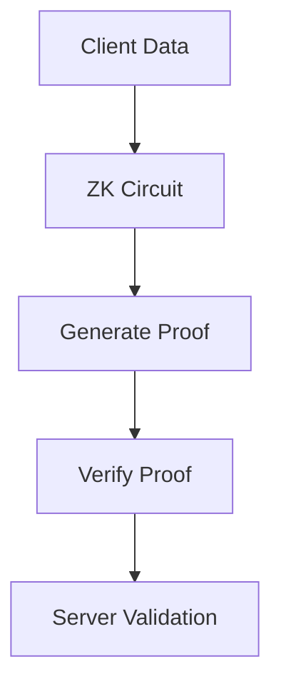
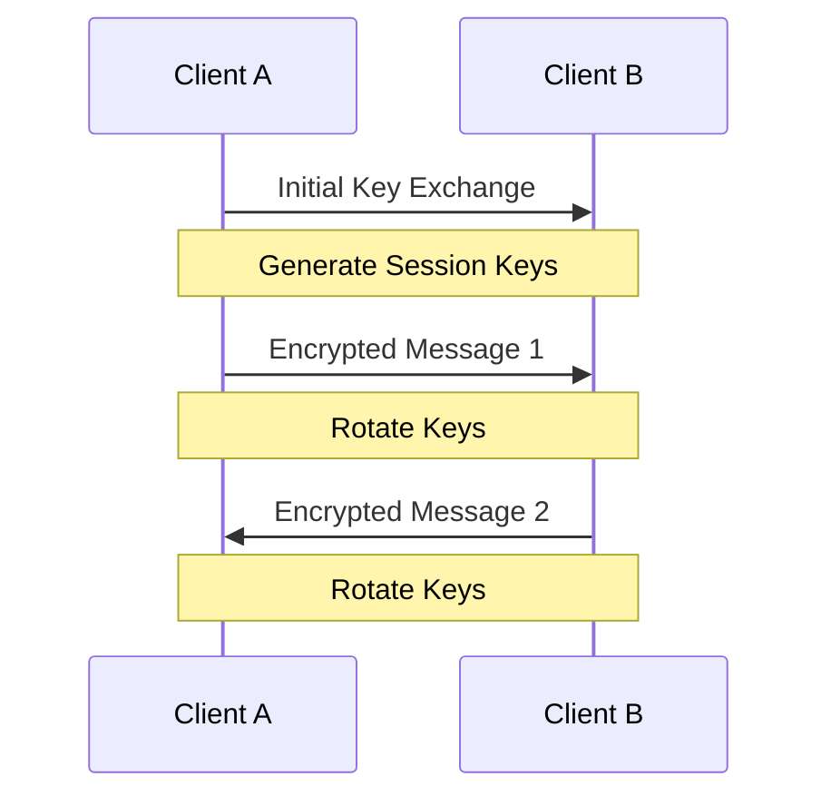

## Encryption & Zero-Knowledge System

Pixelated Healths encryption system provides end-to-end security through zero-knowledge proofs, quantum-resistant algorithms, and comprehensive key management.

## Architecture Overview

  <Card
    title="Zero-Knowledge Proofs"
    icon="lock-keyhole"
    href="#zero-knowledge-proofs"
  >
    Privacy-preserving verification
    Secure key lifecycle
    End-to-end encryption
    Future-proof security

## Zero-Knowledge Proofs

### Implementation

  Our zero-knowledge system ensures data privacy while enabling verification



### Circuit Components

```typescript Session Circuit

const circuit = new SessionDataCircuit({
hashFunction: 'Poseidon',
curveType: 'BN254',
merkleTreeDepth: 20
});

const proof = await circuit.generateProof({
sessionData: encryptedData,
publicInputs: publicParams
});

````

```typescript Verification
const isValid = await circuit.verifyProof({
  proof: proof,
  publicInputs: publicParams
});
````


## Key Management

### Key Hierarchy


- Master Key (KMS)
- Key Encryption Keys (KEKs)
- Data Encryption Keys (DEKs)
- Session Keys
- Forward Secrecy Keys

### Implementation

```typescript
const keyManager = new KeyManager({
  kmsProvider: 'aws',
  region: 'us-east-1',
  keyRotationPeriod: '30d',
  backupEnabled: true,
})

// Generate new data encryption key
const dek = await keyManager.generateDataKey({
  keySpec: 'AES_256',
  context: {
    purpose: 'session_encryption',
    userId: 'user_123',
  },
})

// Rotate keys
await keyManager.rotateKeys({
  keyType: 'data',
  gracePeriod: '7d',
})
```

## Data Encryption

### Encryption Layers

    * TLS 1.3 * Perfect forward secrecy * Strong cipher suites * Certificate
    pinning
    * End-to-end encryption * Zero-knowledge proofs * Homomorphic encryption *
    Secure key exchange
    * At-rest encryption * Key wrapping * Secure key storage * Backup encryption

### Implementation

```typescript Encryption

const encryption = new DataEncryption({
algorithm: 'AES-256-GCM',
keyDerivation: 'HKDF',
padding: 'PKCS7'
});

// Encrypt data
const encrypted = await encryption.encrypt({
data: sensitiveData,
key: dek,
associated: metadata
});

````

```typescript Decryption
// Decrypt data
const decrypted = await encryption.decrypt({
  data: encrypted,
  key: dek,
  associated: metadata
});
````


## Quantum Resistance

### Algorithms


- CRYSTALS-Kyber (Key Encapsulation)
- CRYSTALS-Dilithium (Digital Signatures)
- SPHINCS+ (Hash-based Signatures)
- Classic McEliece (Alternative KEM)

### Implementation

```typescript
const quantumResistant = new QuantumResistantCrypto({
  kemAlgorithm: 'Kyber1024',
  signatureAlgorithm: 'Dilithium5',
  useHybridMode: true,
})

// Generate quantum-resistant keypair
const keyPair = await quantumResistant.generateKeyPair()

// Encapsulate key
const { ciphertext, sharedSecret } = await quantumResistant.encapsulate({
  publicKey: keyPair.publicKey,
})

// Decapsulate key
const decapsulated = await quantumResistant.decapsulate({
  ciphertext: ciphertext,
  privateKey: keyPair.privateKey,
})
```

## Homomorphic Encryption

### Features


- Partial homomorphic encryption
- Somewhat homomorphic encryption
- Fully homomorphic encryption
- Optimized for specific operations

### Implementation

```typescript
const homomorphic = new HomomorphicEncryption({
  scheme: 'BFV',
  securityLevel: 128,
  polyModulusDegree: 4096,
})

// Encrypt numbers
const encrypted1 = await homomorphic.encrypt(5)
const encrypted2 = await homomorphic.encrypt(3)

// Perform operation on encrypted data
const encryptedSum = await homomorphic.add(encrypted1, encrypted2)

// Decrypt result
const sum = await homomorphic.decrypt(encryptedSum) // 8
```

## Forward Secrecy

### Protocol




### Implementation

```typescript
const forwardSecrecy = new ForwardSecrecyProtocol({
  ratchetAlgorithm: 'Double',
  kdf: 'HKDF-SHA256',
  messageKeyLimit: 100,
})

// Initialize session
const session = await forwardSecrecy.initSession({
  identityKey: localIdentityKey,
  preKey: remotePreKey,
})

// Send message
const encrypted = await session.encrypt('Hello')

// Receive message
const decrypted = await session.decrypt(encrypted)
```

## Best Practices

    Regular key rotation schedule
    Verify encryption integrity
    Protected key storage
    Track encryption operations

## Troubleshooting

    * Check key permissions * Verify key version * Ensure key availability *
    Check rotation status
    * Validate input format * Check algorithm compatibility * Verify key
    integrity * Review operation logs
    * Monitor operation timing * Check resource usage * Optimize key cache *
    Review batch operations

## Support

Need help with encryption? Contact our security team:

  <Card
    title="Security Support"
    icon="shield"
    href="mailto:security@gradiant.dev"
  >
    Contact security team
    View technical guides
