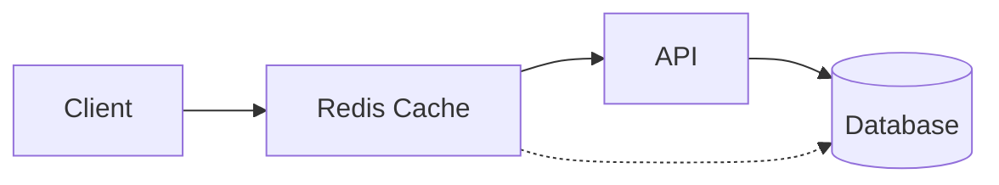
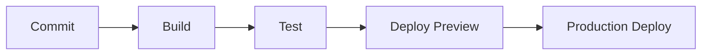

# Pixelated Empathy Architecture

## System Overview

Pixelated Empathy is built on a modern, secure, and scalable architecture that combines the best practices from various platforms while maintaining strong privacy and security measures through Zero-Knowledge Encryption and HIPAA compliance.

## Core Components

### Frontend Architecture

  The UI layer is built using React and Next.js, incorporating design elements from Liftoff's interview platform:

  - **Component Structure**
    - Atomic Design Principles
    - Shared Component Library
    - Theme Provider (Dark/Light modes)
    - Responsive Layout System

  - **State Management**
    - React Context for global state
    - React Query for server state
    - Local storage for persistence
    - Secure credential handling

  Data flow follows unidirectional principles:

  1. User actions trigger state changes
  2. State updates propagate to components
  3. Side effects handled by middleware
  4. Server state synchronized via WebSocket

### Backend Architecture


- RESTful endpoints
- GraphQL interface
- WebSocket connections
- Rate limiting
- Request validation


- MongoDB Atlas integration
- Azure AD authentication
- JWT token management
- Role-based access control
- Session handling


- End-to-end encryption
- Client-side key generation
- Secure message passing
- Zero-knowledge proofs


## Database Design

### MongoDB Atlas Schema

The application uses MongoDB Atlas as the primary database with the following collections:

```sql
-- Core Tables
CREATE TABLE users (
id UUID PRIMARY KEY DEFAULT uuid_generate_v4(),
email TEXT UNIQUE NOT NULL,
encrypted_data JSONB,
settings JSONB DEFAULT '{}'::jsonb,
created_at TIMESTAMPTZ DEFAULT NOW(),
updated_at TIMESTAMPTZ DEFAULT NOW()
);

CREATE TABLE sessions (
id UUID PRIMARY KEY DEFAULT uuid_generate_v4(),
user_id UUID REFERENCES users(id),
metadata JSONB,
started_at TIMESTAMPTZ DEFAULT NOW(),
ended_at TIMESTAMPTZ
);

CREATE TABLE messages (
id UUID PRIMARY KEY DEFAULT uuid_generate_v4(),
session_id UUID REFERENCES sessions(id),
encrypted_content TEXT NOT NULL,
metadata JSONB,
created_at TIMESTAMPTZ DEFAULT NOW()
);
````

## Security Architecture

  ### 1. Authentication Flow
  - User registration/login via Azure AD and JWT authentication
  - JWT token generation and validation
  - Secure session management

### 2. Zero-Knowledge Implementation

- Client-side key generation
- End-to-end encryption of sensitive data
- Zero-knowledge proof verification

### 3. Data Protection
  - Encrypted data storage in Supabase
  - Secure key management
  - Regular security audits

## Integration Points

### Liftoff Features


- Chat interface adaptation 
- Dashboard layouts 
- Form components
- Navigation elements


- Real-time updates 
- Cache management 
- Optimistic updates 
- Error handling


### PocketBase Inspired Features


- Adapted for Supabase 
- Enhanced with ZK principles 
- Role-based access control


- RESTful endpoints 
- Real-time subscriptions 
- Request validation


## Performance Considerations

### Caching Strategy



- **Client-side caching**

  - React Query cache
  - Service Worker cache
  - Local storage cache

- **Server-side caching**
  - Redis cache layer
  - Database query cache
  - CDN caching

### Optimization Techniques


- Code splitting
- Lazy loading  
- Image optimization
- Bundle size reduction


- Query optimization
- Connection pooling
- Background job processing
- Resource scaling


## Deployment Architecture

### Infrastructure Components

- **Frontend**
- Vercel deployment
- Edge functions
- CDN distribution

- **Backend**
- Containerized services
- Auto-scaling groups
- Load balancing

- **Database**
- Supabase managed instance
- Read replicas
- Backup strategy

## Monitoring & Logging

### Observability Stack

- **Application Monitoring**
- Error tracking
- Performance metrics
- User analytics

- **Infrastructure Monitoring**
- Server metrics
- Database metrics
- Cache performance

- **Security Monitoring**
- Audit logs
- Access logs
- Security alerts

## Development Workflow

### Local Development

```bash
# Frontend development
pnpm dev

# Backend development
pnpm backend:dev

# Database migrations
pnpm db:migrate

# Testing
pnpm test
````

### CI/CD Pipeline



  This architecture documentation is maintained alongside the codebase and
  updated as the system evolves. For implementation details of specific
  components, refer to the respective documentation sections.
