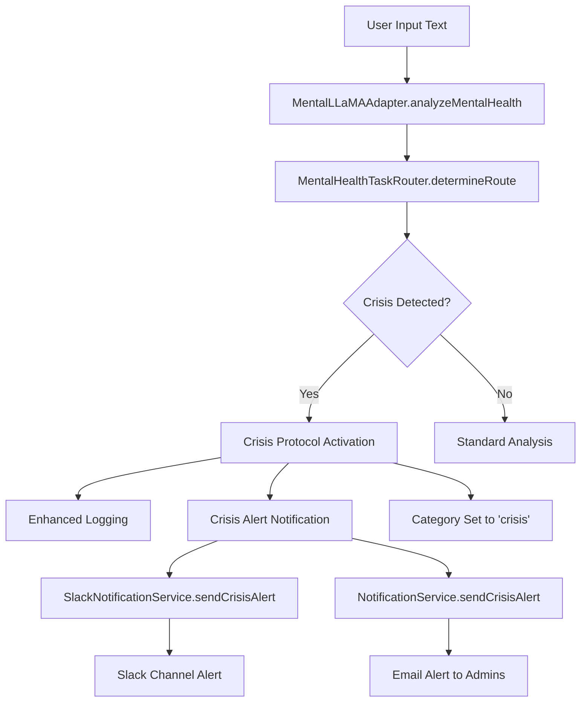

# Crisis Protocol Documentation

## Overview

The Crisis Protocol is a comprehensive system designed to detect potential mental health crises in user communications and automatically alert appropriate personnel for immediate intervention. The protocol integrates with the MentalLLaMA analysis system to provide real-time crisis detection and response.

## Architecture

### Components

1. **MentalLLaMAAdapter**: Core component that performs mental health analysis
2. **MentalHealthTaskRouter**: Intelligent routing system for determining analysis type
3. **ICrisisNotificationHandler**: Interface for crisis notification services
4. **SlackNotificationService**: Slack-based crisis alert implementation
5. **NotificationService**: Fallback notification service with email support

### Data Flow



## Implementation Status

### ✅ Completed Components

1. **ICrisisNotificationHandler Interface**
   - Location: `src/lib/services/notification/NotificationService.ts`
   - Defines contract for crisis alert services
   - Includes `CrisisAlertContext` type for alert data

2. **SlackNotificationService**
   - Location: `src/lib/services/notification/SlackNotificationService.ts`
   - Implements `ICrisisNotificationHandler`
   - Formats and sends rich Slack messages with crisis details
   - Robust error handling and logging

3. **MentalLLaMAAdapter Crisis Integration**
   - Location: `src/lib/ai/mental-llama/MentalLLaMAAdapter.ts`
   - Crisis detection in `analyzeMentalHealth` method
   - Enhanced structured logging for crisis events
   - Optional crisis notifier integration

4. **MentalLLaMAFactory Updates**
   - Location: `src/lib/ai/mental-llama/index.ts`
   - Automatic SlackNotificationService initialization
   - Environment-based configuration

5. **Configuration Setup**
   - Location: `src/config/env.config.ts`
   - Added `SLACK_WEBHOOK_URL` environment variable
   - Proper secret masking for security

### 🔄 Remaining Tasks

1. **Session/User Flagging System**
   - Implement mechanism to flag user sessions for immediate review
   - Requires external service integration (e.g., user management API)
   - Update user status or create crisis flags in database

2. **Application Integration**
   - Update application startup code to use SlackNotificationService
   - Ensure proper error handling in production environments
   - Test crisis protocol in staging environment

## Configuration

### Environment Variables

```bash
# Required for Slack notifications
SLACK_WEBHOOK_URL=https://hooks.slack.com/services/YOUR/SLACK/WEBHOOK

# Optional: Admin email for fallback notifications
EMAIL_FROM=admin@yourdomain.com

# Optional: Additional notification settings
VAPID_PUBLIC_KEY=your_vapid_public_key
VAPID_PRIVATE_KEY=your_vapid_private_key
VAPID_SUBJECT=mailto:admin@yourdomain.com
```

### Slack Webhook Setup

1. Create a Slack app in your workspace
2. Enable Incoming Webhooks
3. Create a webhook for your desired channel (e.g., #crisis-alerts)
4. Copy the webhook URL to `SLACK_WEBHOOK_URL` environment variable

## Usage

### Basic Implementation

```typescript
import { createMentalLLaMAFromEnv } from '@/lib/ai/mental-llama'

// Create adapter with crisis protocol enabled
const { adapter } = await createMentalLLaMAFromEnv()

// Analyze text with automatic crisis detection
const result = await adapter.analyzeMentalHealth(
  "I've been thinking about ending it all",
  ['auto_route'], // Enable automatic routing with crisis detection
  {
    userId: 'user123',
    sessionId: 'session456',
    sessionType: 'therapy_session'
  }
)

// Check for crisis detection
if (result.mentalHealthCategory === 'crisis') {
  console.log('Crisis detected - alerts have been sent')
  // Additional crisis response logic here
}
```

### Custom Crisis Notifier

```typescript
import { SlackNotificationService } from '@/lib/services/notification/SlackNotificationService'
import { MentalLLaMAAdapter } from '@/lib/ai/mental-llama/MentalLLaMAAdapter'

// Create custom crisis notifier
const crisisNotifier = new SlackNotificationService('https://hooks.slack.com/services/...')

// Create adapter with custom notifier
const adapter = new MentalLLaMAAdapter(
  provider,
  fheService,
  baseUrl,
  apiKey,
  modelProvider,
  pythonBridge,
  crisisNotifier
)
```

## Crisis Alert Format

### Slack Message Structure

The Slack notification includes:

1. **Header**: 🚨 CRITICAL CRISIS ALERT 🚨
2. **Description**: Brief explanation of the alert
3. **Context Details**:
   - Timestamp
   - User ID
   - Session ID
   - Session Type
   - Explicit Task Hint
4. **Text Sample**: First 500 characters of the analyzed text
5. **Routing Decision**: Technical details from the analysis
6. **Footer**: Generation timestamp and action prompt

### Email Fallback

If Slack notifications fail, the system falls back to email notifications sent to configured admin addresses.

## Security Considerations

### Data Protection

1. **Text Sampling**: Only first 500 characters included in alerts
2. **User Privacy**: User IDs are internal identifiers, not personal information
3. **Webhook Security**: Slack webhook URLs are masked in logs
4. **Error Handling**: Graceful degradation if notification services fail

### Access Control

1. **Slack Channel**: Restrict access to crisis alert channels
2. **Webhook Protection**: Store webhook URLs as environment secrets
3. **Log Security**: Ensure crisis logs are properly secured and audited

## Testing

### Manual Testing

```typescript
// Test crisis detection with sample text
const testText = "I don't want to live anymore"
const result = await adapter.analyzeMentalHealth(testText, ['auto_route'], {
  userId: 'test-user',
  sessionId: 'test-session'
})

console.log('Crisis detected:', result.mentalHealthCategory === 'crisis')
```

### Integration Testing

1. Set up test Slack webhook
2. Configure test environment variables
3. Run crisis detection scenarios
4. Verify alert delivery and formatting

## Monitoring and Alerting

### Key Metrics

1. **Crisis Detection Rate**: Number of crises detected per day/week
2. **Alert Success Rate**: Percentage of successful alert deliveries
3. **Response Time**: Time from detection to alert delivery
4. **False Positive Rate**: Manually reviewed false crisis alerts

### Logging

Crisis events are logged with:
- Timestamp
- User/Session identifiers
- Text sample
- Detection confidence
- Alert delivery status

## Future Enhancements

### Planned Features

1. **Multi-Channel Alerting**: Support for SMS, email, and webhook notifications
2. **Escalation Protocols**: Automatic escalation if initial alerts are not acknowledged
3. **Integration with EHR Systems**: Automatic crisis flags in patient records
4. **Machine Learning Improvements**: Continuous learning from crisis outcomes
5. **Dashboard Integration**: Real-time crisis monitoring dashboard

### Compliance Considerations

1. **HIPAA Compliance**: Ensure all crisis handling meets healthcare privacy requirements
2. **Audit Trails**: Comprehensive logging for regulatory compliance
3. **Data Retention**: Proper retention policies for crisis-related data
4. **International Regulations**: Support for GDPR and other privacy regulations

## Troubleshooting

### Common Issues

1. **Slack Webhook Not Working**
   - Verify webhook URL is correct
   - Check Slack app permissions
   - Test webhook with curl

2. **Crisis Not Detected**
   - Verify MentalHealthTaskRouter is configured
   - Check keyword matching rules
   - Review LLM classification accuracy

3. **Notifications Not Sent**
   - Check environment variable configuration
   - Verify network connectivity
   - Review error logs for specific failures

### Debug Commands

```bash
# Test Slack webhook
curl -X POST -H 'Content-type: application/json' \
  --data '{"text":"Test crisis alert"}' \
  $SLACK_WEBHOOK_URL

# Check environment configuration
node -e "console.log(require('./src/config/env.config.ts').config.notifications.slackWebhookUrl())"
```

## Support and Maintenance

### Regular Tasks

1. **Weekly**: Review crisis detection accuracy and false positive rates
2. **Monthly**: Test notification delivery systems
3. **Quarterly**: Update crisis detection keywords and patterns
4. **Annually**: Review and update crisis response protocols

### Emergency Contacts

- Technical Issues: DevOps Team
- Clinical Issues: Mental Health Clinical Team
- System Outages: On-call Engineer

---

*Last Updated: 2025-01-17*
*Version: 1.0.0*
