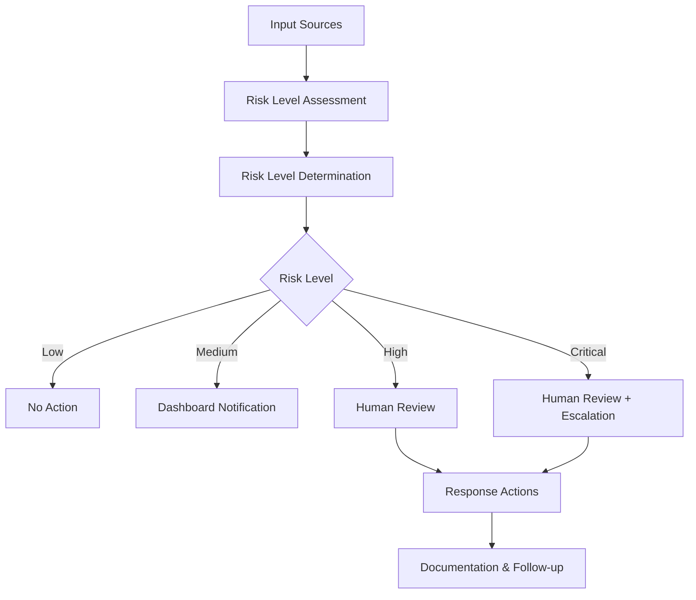
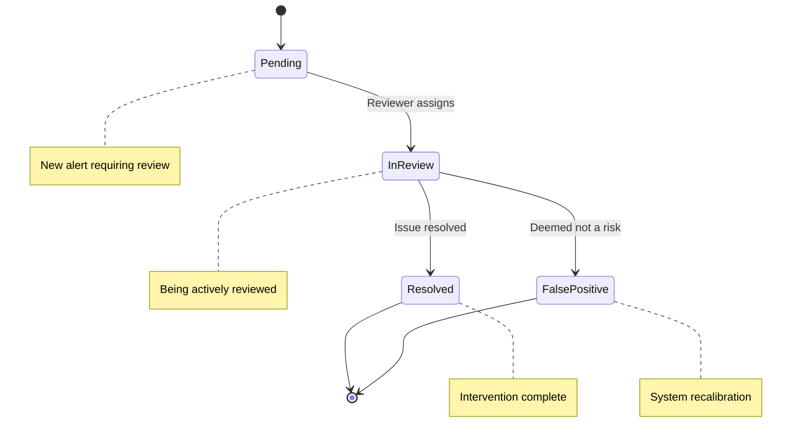

# Comprehensive Security Measures

## Overview

This document provides a comprehensive overview of all security measures implemented in the application, with a focus on the Risk Level Assessment System, alerting mechanisms, and human oversight. These measures ensure the protection of sensitive data, compliance with HIPAA regulations, and appropriate handling of potential mental health crises.

## Key Security Components

The application implements several layers of security:

    Four-tier risk level system with configurable thresholds and sensitivity
    levels
    Multi-channel notification system for high-risk situations with human
    oversight
    Fully Homomorphic Encryption for secure data processing with Microsoft SEAL
    Comprehensive logging of security events and access to sensitive data
    Secure authentication with advanced mechanisms and MFA support
    Data encryption both at rest and in transit using industry standards
    HIPAA compliance measures for protected health information
    Real-time monitoring of security events and system health

## Risk Level Assessment System

The Risk Level Assessment System provides a framework for evaluating and responding to potential security and mental health risks identified within the application.

### Risk Levels

The system uses four risk levels:

| Level        | Description                                | Response                                                    |
| ------------ | ------------------------------------------ | ----------------------------------------------------------- |
| **Low**      | Minimal concern, routine monitoring        | Passive monitoring only                                     |
| **Medium**   | Moderate concern, requires attention       | Dashboard notification                                      |
| **High**     | Significant concern, requires intervention | Dashboard notification + Human review                       |
| **Critical** | Severe concern, requires immediate action  | Dashboard notification + Human review + Optional escalation |

### Implementation Architecture

The Risk Assessment System consists of three main components:



### Configuration Options

The system can be configured with various sensitivity levels and thresholds:

#### Sensitivity Levels

- **Low**: Higher thresholds for triggering alerts (more permissive)
- **Medium**: Balanced thresholds (default setting)
- **High**: Lower thresholds for triggering alerts (more cautious)

#### Alert Channels

- **Dashboard**: In-app notifications (default)
- **Email**: Notifications to configured email addresses
- **SMS**: Text messages to configured phone numbers
- **Webhook**: HTTP POST to configured endpoints

### Technical Implementation

#### Risk Factor Evaluation

Risk factors are evaluated based on:

- **Severity**: How serious the factor is (0-1 scale)
- **Confidence**: How certain we are about the factor (0-1 scale)
- **Factor Type**: Some factors (e.g., suicidal ideation) receive higher weighting

Example code for risk assessment:

```typescript
// Create risk factors
const factors: RiskFactor[] = [
  {
    type: 'suicidal_ideation',
    severity: 0.8,
    confidence: 0.7,
  },
  {
    type: 'social_isolation',
    severity: 0.6,
    confidence: 0.8,
  },
]

// Assess risk level
const assessment = riskLevelAssessment.assessRiskLevel(factors)
```

#### Weighted Scoring System

The system uses a weighted scoring approach that:

1. Filters out factors with low confidence (below configurable threshold)
2. Applies weighting based on factor type (critical factors get 1.5x weight)
3. Calculates a normalized score between 0-1
4. Maps the score to appropriate risk level based on thresholds

#### Risk Level Determination

Risk levels are determined by comparing the weighted score against thresholds:

```typescript
private determineRiskLevel(score: number): RiskLevel {
  const { thresholds, sensitivityLevel } = this.options

  // Adjust thresholds based on sensitivity
  const sensitivityFactor = sensitivityLevel === 'high' ? 0.8 :
                           sensitivityLevel === 'low' ? 1.2 : 1

  const adjustedThresholds = {
    low: thresholds.low * sensitivityFactor,
    medium: thresholds.medium * sensitivityFactor,
    high: thresholds.high * sensitivityFactor,
    critical: thresholds.critical * sensitivityFactor
  }

  // Determine level based on adjusted thresholds
  if (score >= adjustedThresholds.critical) return 'critical'
  if (score >= adjustedThresholds.high) return 'high'
  if (score >= adjustedThresholds.medium) return 'medium'
  return 'low'
}
```

## Alert System

The Risk Alert System manages notifications and human oversight for high-risk situations.

### Alert Flow

  ### Assessment Processing
  When a risk assessment is processed, the system checks if alerts should be triggered based on risk level and configuration.

### Cooldown Check

To prevent alert fatigue, the system checks if sufficient time has passed since the last alert for the same user and level.

### Alert Creation

If an alert should be sent, the system creates an alert with details such as risk level, factors, and source.

### Notification

The alert is sent through configured channels (dashboard, email, SMS, webhook).

### Storage

High and critical alerts are stored in the database for human review.

### Human Review

For high and critical alerts, human reviewers examine the alert and determine appropriate actions.


### Alert Channels

    Dashboard alerts appear in the application interface for authorized users (therapists, administrators, clinical staff). These alerts include:

    - Risk level indicator
    - User information
    - Detected factors
    - Timestamp
    - Source information
    - Review status

    Dashboard alerts support direct interaction for reviewing and resolving issues.


    Email alerts are sent to configured recipients and include:

    - Subject line indicating risk level
    - User identifier (anonymized for security)
    - Risk factors detected
    - Link to review dashboard
    - Recommended actions

    Email templates are customizable and comply with security requirements.


    SMS alerts provide minimal but critical information:

    - Risk level indicator
    - Anonymized user reference
    - Instruction to check dashboard

    SMS alerts are typically used only for critical situations requiring immediate attention.


    Webhook alerts allow integration with external systems via HTTP POST requests with JSON payload containing:

    - Alert ID and details
    - Risk assessment information
    - Timestamp and source
    - Secure signature for verification

    Webhooks require proper authentication and use HTTPS.


### Human Oversight

For high and critical risk levels, the system ensures human review through:

1. **Flagging cases** in the dashboard with high visibility indicators
2. **Storing detailed information** in the database for authorized access
3. **Optional real-time notifications** to designated responders
4. **Review interface** for clinical staff to assess and respond to alerts

The human review process follows this workflow:



### Alert API

The system provides API methods for handling alerts:

```typescript
// Process a risk assessment and trigger alerts if necessary
await riskAlertSystem.processAssessment(
  assessment, // Risk assessment result
  userId, // User ID
  'chat-message', // Source of the assessment
  {
    // Additional metadata
    messageId: '123456',
    sessionId: '789012',
  },
)

// Retrieve pending alerts for human review
const pendingAlerts = await riskAlertSystem.getPendingAlertsForReview()
```

## FHE Security Implementation

The application uses Fully Homomorphic Encryption (FHE) with Microsoft SEAL to securely process sensitive data without exposing plaintext.

### Key Features

- **BFV Schema Implementation**: Uses the BFV cryptographic scheme for integer operations
- **Secure Key Generation**: Implements cryptographically secure key generation
- **Data Integrity Verification**: Uses authentication tags to verify data integrity
- **Protected Operations**: Allows computation on encrypted data without decryption
- **Error Handling**: Comprehensive error handling to prevent information leakage

### Implementation Use Cases

- **Secure Pattern Analysis**: Performs pattern analysis on encrypted text data
- **Privacy-Preserving Scoring**: Calculates risk scores without exposing raw data
- **Sensitive Information Processing**: Processes PII and PHI securely
- **Homomorphic Operations**: Supports addition, multiplication, and comparison

## Error Handling and Fallback Mechanisms

The system includes robust error handling and fallback mechanisms:

- If risk assessment fails, it defaults to a medium risk level
- If alert delivery fails through the primary channel, it attempts alternate channels
- All errors are logged for review and system improvement
- Periodic audits ensure system reliability and accuracy

Example fallback implementation:

```typescript
// Default assessment creation when processing fails
private createDefaultAssessment(level: RiskLevel): RiskAssessmentResult {
  return {
    level,
    score: level === 'low' ? 0.1 :
           level === 'medium' ? 0.4 :
           level === 'high' ? 0.65 : 0.85,
    factors: [],
    requiresIntervention: level === 'high' || level === 'critical',
    confidence: 0.5,
    timestamp: Date.now()
  }
}
```

## Integration with Crisis Detection

The Risk Assessment System integrates with the Crisis Detection system to identify potential mental health crises in user interactions.

### Integration Flow

1. **Text Analysis**: The system analyzes user text for concerning patterns
2. **Pattern Extraction**: Identified patterns are converted to risk factors
3. **Risk Assessment**: Risk factors are processed by the Risk Assessment Service
4. **Alert Triggering**: High-risk situations trigger appropriate alerts
5. **Human Review**: Clinical staff review and respond to alerts

### Pattern Recognition Categories

    Suicidal ideation, self-harm, violence, abuse, severe depression, psychosis,
    substance abuse, critical anxiety
    Moderate depression, anxiety, social isolation, significant stress, grief,
    sleep disturbance, eating disorder
    Mild distress, life transitions, relationship issues, work stress, financial
    concerns

## Security Considerations

- All risk assessment data is stored securely with strict access controls
- Sensitive data is encrypted both in transit and at rest
- The system follows privacy regulations by minimizing data collection
- Access to high-risk alerts is limited to authorized personnel only
- Comprehensive audit logging tracks all security-relevant actions

## Best Practices for Implementation

1. **Regular Calibration**: Periodically review and adjust sensitivity levels based on false positive/negative rates
2. **Human in the Loop**: Always maintain human oversight for high and critical risk levels
3. **Documentation**: Keep clear records of all alert responses for quality improvement
4. **Privacy Focus**: Collect only necessary information needed for risk assessment
5. **Regular Testing**: Conduct regular security testing and simulations
6. **Staff Training**: Ensure all staff are trained on alert response procedures
7. **Continuous Monitoring**: Monitor system effectiveness and adapt as needed

## Configuration Guide

### Risk Level Assessment Configuration

The Risk Level Assessment Service can be configured with the following options:

```typescript
// Configure the Risk Level Assessment Service
riskLevelAssessment.configure({
  // Set sensitivity level (low, medium, high)
  sensitivityLevel: 'medium',

  // Set thresholds for risk levels
  thresholds: {
    low: 0.25,
    medium: 0.5,
    high: 0.7,
    critical: 0.85,
  },

  // Set minimum confidence level for valid factors
  minConfidence: 0.6,
})
```

### Alert System Configuration

The Risk Alert System can be configured with the following options:

```typescript
// Configure the Risk Alert System
riskAlertSystem.configure({
  // Enable notification channels
  enabledChannels: ['dashboard', 'email'],

  // Set thresholds for different risk levels
  thresholds: {
    low: {
      notify: false,
      requireHumanReview: false,
      escalate: false,
    },
    medium: {
      notify: true,
      requireHumanReview: false,
      escalate: false,
    },
    high: {
      notify: true,
      requireHumanReview: true,
      escalate: false,
    },
    critical: {
      notify: true,
      requireHumanReview: true,
      escalate: true,
    },
  },

  // Set recipients for notifications
  recipients: {
    email: ['clinical.team@example.com'],
    sms: ['+1234567890'],
  },

  // Set cooldown period (in milliseconds)
  cooldownPeriod: 1800000, // 30 minutes
})
```

## Additional Security Measures

### Authentication & Authorization

The application implements robust authentication and authorization mechanisms:

- **Session-based authentication** with secure cookie handling
- **Role-based access control** for different user types
- **Multi-factor authentication** for sensitive operations
- **Rate limiting** to prevent brute force attacks
- **CSRF protection** for all requests
- **Session timeouts** for inactive users

For detailed information, see [Authentication Documentation](./authentication.mdx).

### Encryption & Data Protection

The application employs encryption for sensitive data:

- **TLS encryption** for all data in transit
- **Database encryption** for data at rest
- **Key rotation policies** for encryption keys
- **Data minimization practices** to reduce risk
- **Secure deletion procedures** for obsolete data

For detailed information, see [Encryption Documentation](./encryption.mdx).

### Audit Logging & Monitoring

The application includes comprehensive audit logging:

- **Security event logging** for authentication and authorization
- **Access logging** for sensitive data
- **Change logging** for configuration changes
- **Real-time alerting** for suspicious activities
- **Log retention policies** compliant with regulations

For detailed information, see [Monitoring Documentation](./monitoring.md).

### Compliance Framework

The application is designed to meet regulatory requirements:

- **HIPAA compliance** for protected health information
- **Privacy regulations** compliance (GDPR, CCPA)
- **Regular security assessments** and penetration testing
- **Documentation of security controls** and procedures
- **Incident response planning** and testing

For detailed information, see [Compliance Documentation](./compliance.mdx).

## Related Resources

- [Security Overview](./overview.mdx)
- [Risk Assessment System](./risk-assessment.md)
- [Authentication Documentation](./authentication.mdx)
- [Encryption Documentation](./encryption.mdx)
- [Compliance Documentation](./compliance.mdx)
- [Monitoring Documentation](./monitoring.md)
